# Bits, Bytes, and Integer


## 比特(位)

一切都是比特(bit), 每个位(bit)都是 0 或 1, 计算机通过以各种方式编码/解释比特集
- 计算机决定怎么做(指令集)
- 以及表示和操作数字、集合、字符串等等

### 二进制

根据下面表格的规律, 可知二进制 `1010.01` 转化 十进制结果为 `10.25`

|位数|4|3|2|1|小|1|2|
|-|-|-|-|-|-|-|-|
|代数|8|4|2|1|数|0.5|0.25|
|幂|3|2|1|0|点|-1|-2|
|位|1|0|1|0|.|0|1|

|十进制|15213|1.20|1.5213 * 10^4|
|-|-|-|-|
|二进制|11101101101101|1.00110011[0011]…|1.1101101101101 * 2^13|

## 字节

1字节(Byte) = 8比特(bits), 二进制表示 `00000000` 到 `11111111`, 十进制表示 `0` 到 `255`, 十六进制表示 `00` 到 `FF`

|十进制(Decimal) |0|1|2|3|4|5|6|7|8|9|10|11|12|13|14|15|
|-|-|-|-|-|-|-|-|-|-|-|-|-|-|-|-|-|
|十六进制(Hex)| 0|1|2|3|4|5|6|7|8|9|A|B|C|D|E|F|
|二进制(Binary)|0000|0001|0010|0011|0100|0101|0111|1000|1001|1010|1011|1100|1101|1101|1110|1111|

### 数据表示示例

|C Data Type|Typical 32-bit|Typical 64-bit|x86-64|
|-|-|-|-|
|char|1|1|1|
|short|2|2|2|
|int|4|4|4|
|long|4|8|8|
|float|4|4|4|
|double|8|8|8|
|long double|-|-|10/16|
|pointer|4|8|8|

## 布尔代数

由乔治·布尔于19世纪发展而来, 逻辑的代数表示`True` 编码为 `1` , `False` 编码为 `0`

操作符 &,  |,  ~,  ^ 在C中都是可用的, 可用于任意**整型**类型long, int, short, char, unsigned
- 将参数视为位向量
- 按位应用于参数

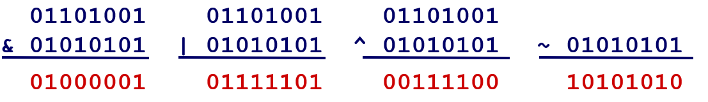

### 表示

例如 `w` 位的向量 可以表示{0, … ,w–1}的子集, 那么下列表格可表达子集 {0, 3, 5, 6}
|0|1|1|0|1|0|0|1|
|-|-|-|-|-|-|-|-|
|7|6|5|4|3|2|1|0|

那么上述表格所表示的子集跟下面4个子集分别进行&(与), |(或), ^(异或), ~(非)

|01101001|&|01000001|{ 0, 6 }|
|-|-|-|-|
|01101001| \||01111101|{ 0, 2, 3, 4, 5, 6 }|
|01101001|^|00111100|{ 2, 3, 4, 5 }|
|01101001|~|10101010|{ 1, 3, 5, 7 }|


### C中位运算
操作符 &,  |,  ~,  ^ 在C中都是可用的
可应用于任意“整型”数据类型
long, int, short, char, unsigned
将参数视为位向量
按位应用于参数

### 移位操作

#### 左移 x << y

把位向量x往左边移动y个位置, 丢弃左边多余的部分, 在右边填充0
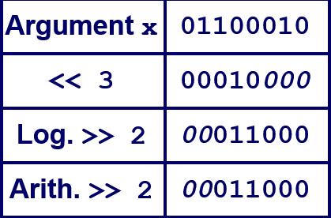

#### 右移 x >> y
把位向量x往右边移动y个位置, 丢弃右边多余的部分。逻辑移位往左边填充0, 算数移位往左边填充最高有效位
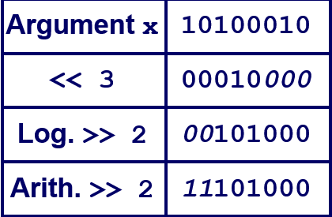

#### 未定义行为

移位量 < 0 或 ≥ 操作数位数大小


---

## 整型


### 编码

#### 公式
- 无符号整型(Unsigned)
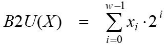
- 二进制补码(Two’s complement)


---

#### 示例

short 占2个字节, 所以是8个比特
```c
unsigned short x = 15213;
unsigned short y = -15213;
```


|example\\weight|1|2|4|8|16|32|64|128|256|512|1024|2048|4096|8192|16384|-32768|
|-|-|-|-|-|-|-|-|-|-|-|-|-|-|-|-|-|
|15213|1|0|1|1|0|1|1|0|1|1|0|1|1|1|0|0|
|-15213|1|1|0|0|1|0|0|1|0|0|1|0|0|0|1|1|

15213 = 1+4+8+32+64+256+512+2048+4096+8192
-15213 = 1+2+16+128+1024+16384-32768

---

### 数字范围

#### 公式


#### 示例
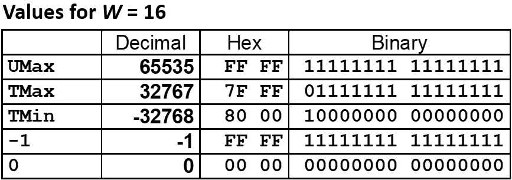

#### 观察
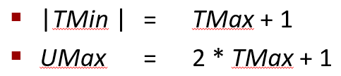

---

### 整型转换

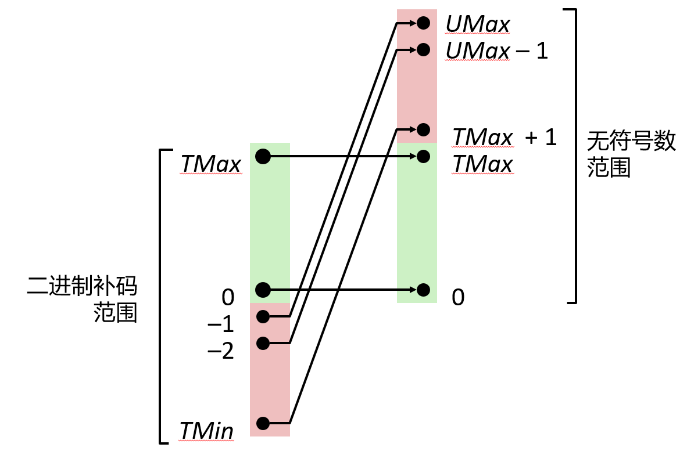

如果单个表达式中存在有无符号数和有符号数的混用, 带符号值隐式转换为无符号值

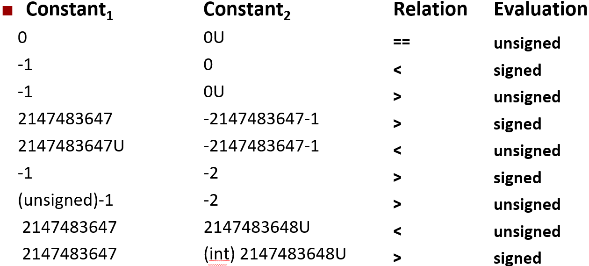

---

### 整型拓展

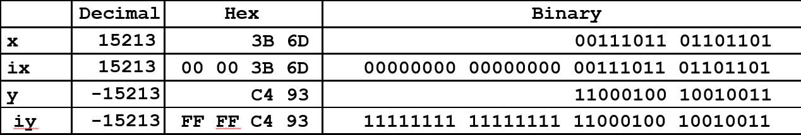

---

### 无符号加法
对于W位数, 只需按位相加, 最终结果多于W位的舍弃
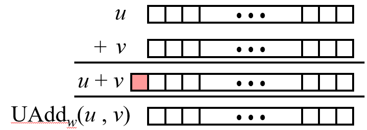

---

### 二进制补码加法
对于W位数, 按位相加, 最终结果多于W位的舍弃, 剩余位视为二进制补码整数

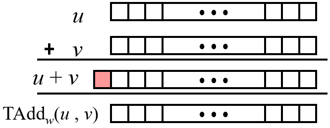


以 w = 4 位举例, TMax = 7, TMin = -8, 那么则有以下示例

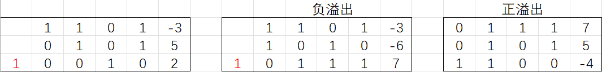

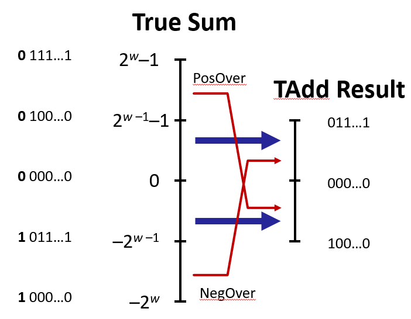

---

### 乘法

与加法类似, w 位操作数相乘, 2*w 位的真实乘积, 仍然丢弃 w 位, 只保留低 w 位

有符号数和无符号数都满足通过u << k 得到 u * 2k

无符号数通过移位 u >> k 得到 u / 2k。有符号数算术移位就可能出现问题: `-3 >> 2 == 1110 = -2`

---

### 总结

> Don’t use without understanding implications, Easy to make mistakes

```c
unsigned i;
for (i = cnt-2; i >= 0; i--) {
    a[i] += a[i+1];
}
```
这段代码当 `i = 0`, 并再次 `i--` 时, `i` 就会变成 `UMax` , 从而导致出现问题

```c
#define DELTA sizeof(int)
int i;
for (i = CNT; i-DELTA >= 0; i-= DELTA) {
    // to do something
}
```
`sizeof` 返回的是 `unsigned long`, 是一个无符号, 因此表达式 `i-DELTA >= 0` 中的 `i` 就会被解释为无符号, 导致出现问题

> 你可能会认为 既然无符号整数和有符号整数这么复杂, 而且我们上次也看到了一些奇怪的例子, 那我们就应该消除无符号数, 只允许补码存在。而这已经被Java等语言采用, 他们认为这太奇怪了, 应该每个数字都是补码。他们做的唯一改变是引入了 `>>>` 逻辑右移, 而把 `>>` 认为是算术右移
> 

#### 何时使用 unsigned
- 执行模运算时, 多倍精度运算
- 用位表示集合时, 逻辑右移, 没有符号扩展

---

## 内存组织方式

从编程角度来看, 可以把内存**简单地想象**成一个非常大的字节数组, 从0到某个最大的数字编号。一个地址就像该数组的索引, 并且一个指针变量存储地址。

**最小的寻址单位是字节**, 32位机器以 4 字节为单位进行内存访问, 64 位系统的 CPU 支持 8 字节的内存访问

当说64位机器, 是指它惯常处理64位值和算术运算, 并且它的指针或地址的值是64位, 即便**实际上能使用的最大内存地址是48位**。

**但这仍然是一个很大的内存空间**。每位表示2种状态, 48位能表示2^48种状态, 也就是2^48个地址, 可以指向2^48个字节, 也就是2^48B, 换算下来相当于256TB

在64位机器中, 当程序运行时, 逻辑上讲会认为自己有**独立的256TB内存空间**, 事实上操作系统**只允许使用该内存中的某些区域**, 如果尝试访问其他区域就会报错, 称这为**分段错误**(segmentation fault) 

---

## 字长
任何给定的计算机都有 “字长”, 作为整型数据的标称大小以及地址。字长和字不是简单地由硬件决定的，它们受到硬件架构和编译器设置的共同影响。

- 当使用gcc作为默认编译器来编译, 可以指定是64位编译还是32位编译

- 即使64位的机器, int 在不加任何修饰词的情况下仍然是32位的

> 当人们只说字或字长时, 从精确定义的角度说, 这不是一个非常有意义的术语

---

## 字节序

字节序指的是多字节数据（如 32 位或 64 位数据）在内存中存储时字节的排列顺序。

有2种基本的存储方式: 小端序、大端序

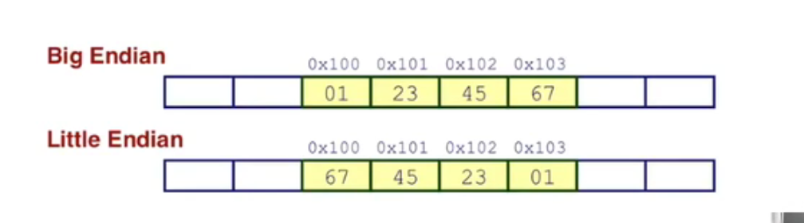


### 小端序

小端序的机器（例如大多数的 x86 架构）会把低位字节存放在低地址，这种存储方式被认为更符合现代处理器的设计，有助于提升处理效率。小端序的存储方式被大多数现代计算机系统（如 Intel、AMD 处理器）所采用。

- 在小端序系统中，数据的低位字节（Least Significant Byte，LSB）存储在内存的低地址处，高位字节（Most Significant Byte，MSB）存储在内存的高地址处。

- 例如，对于 4 字节的整数 0x12345678，在内存中的存储顺序是：
  ```
  地址      数据
  0x00      0x78
  0x01      0x56
  0x02      0x34
  0x03      0x12
  ```
  即低位字节（0x78）在最低地址，高位字节（0x12）在最高地址。


### 大端序

大端序的机器存储数据时的字节顺序和我们平时书写的数值顺序一致，符合人类自然阅读习惯。网络协议（如 TCP/IP）使用的是 大端序，即网络字节序。

- 在大端序系统中，数据的高位字节（Most Significant Byte，MSB）存储在内存的低地址处，低位字节（Least Significant Byte，LSB）存储在内存的高地址处。
- 例如，对于 4 字节的整数 0x12345678，在内存中的存储顺序是：
  ```
  地址      数据
  0x00      0x12
  0x01      0x34
  0x02      0x56
  0x03      0x78
  ```
  即高位字节（0x12）在最低地址，低位字节（0x78）在最高地址。


### 二者地位

**大端序的机器如今几乎不再出现，而小端序成为主流。**

历史上, 大端序在一些早期计算机中使用得较多，比如 Motorola 68k 系列处理器就采用了大端序。

大多数现代计算机（如使用 Intel x86 架构 和 AMD 架构 的计算机）都采用了 小端序。

虽然小端序非常普及，但大端序仍然在一些特定的应用中使用，例如：

- 网络协议：TCP/IP 协议使用 大端序（也叫 网络字节序）。
- 某些处理器架构：例如 PowerPC、SPARC、Motorola 68k 等依然支持大端序，但即使这些架构也普遍支持小端序。

---

## 检查数据表示

不同的编译器 & 机器 会给对象指派不同的地址, 甚至每次运行程序都会得到不同的结果


以下代码, 由于 char 是 1 字节，因此 pointer(unsigned char*)可以逐字节访问内存。
```c
typedef unsigned char *pointer;

void show_bytes(pointer start, size_t len){
  size_t i;
  for (i = 0; i < len; i++)
    printf("%p\t0x%.2x\n",start+i, start[i]);
  printf("\n");
}

int main() {
    int a = 15213;
    show_bytes((pointer)&a, sizeof(int));
}

```
