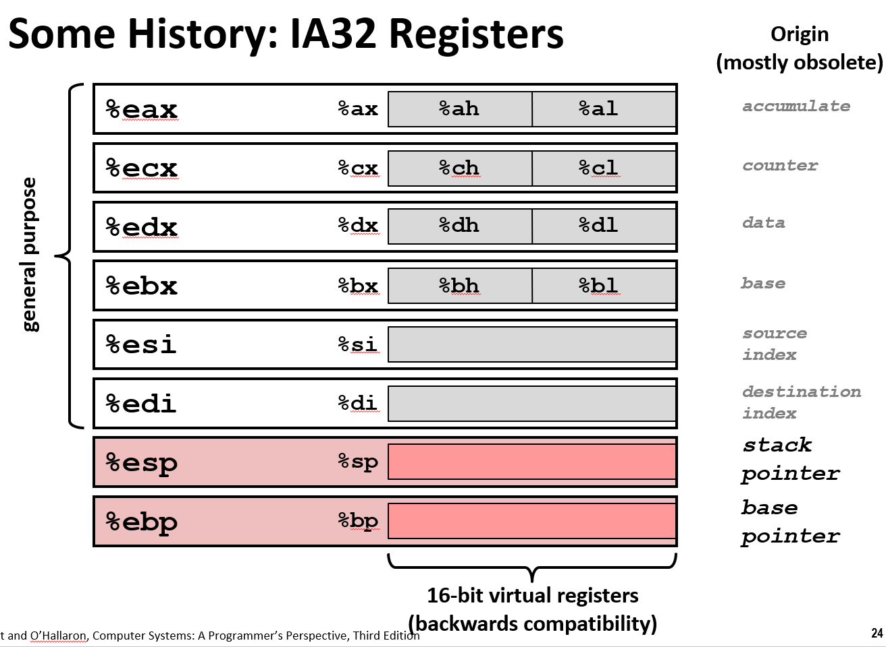

# Machine Level Programming I Basics

实际上有两种形式的机器程序: 汇编代码, 目标代码。

目标代码是一串字节, 编码处理器执行的指令。但很难通过观察字节去并理解含义。

它有许多更清晰的文本形式。其中一种是汇编代码，过去是人们用它对于机器进行编程, 而现在，生成汇编代码是编译器的目标。

> 当我说机器代码时，我有时候指的是目标代码，有时候指的是文本格式的汇编代码, 这两者可互换，因为它们之间的映射是一对一的。但以防万一，我倾向于使用"汇编代码"


## 英特尔

x86对于英特尔处理器来说是一个口头的称谓。原因是第一个芯片被称为8086, 然后他们跳过了81, 随后推出了8286、8386等等, 所以共同点是都有86，所以人们只称它为x86。

英特尔的x86处理器主导笔记本电脑、台式机和服务器市场。手机市场主要是arm, 比较省电。

x86处理器属于复杂指令集计算机 (CISC), 支持许多不同格式的指令, 但 Linux 程序不会用到全部的指令。

**早期**x86难以匹敌精简指令集计算机的性能(RISC), 但功耗的问题仍然难以克服。


> x86有时被称为CISC。在80年代早期有一件大事，80年代又被称作RISC和CISC大战年代。
>
> RISC是一个相对较新的想法, 他们称之为精简指令集计算机。它风摩一时。
> 之前没有人给它们命名, 但是RSIC人员将之前的处理器称作CISC,意思是复杂的指令集计算机。具有明显的贬义性质
>
> 英特尔使用的是经典的CISC架构, 这意味着它有很多特性, 这节课的内容甚至算不上皮毛  
>
> 它的许多层面没有成为成功的设计, 但英特尔一直是如此强大的公司，拥有如此多的市场和更好的技术。在半导体领域和竞争对手相比, 英特尔从事这方面已经有40年了。

### 里程碑

|Name|Date|Transistors(晶体管数)|MHz(频率)||
|-|-|-|-|-|
|8086|1978|29K|5-10|第一个16位英特尔处理器。IBM 和 DOS 的基础。1Mb的寻址空间|
|386|1985|275K|16-23|第一个32位英特尔处理器(IA32), 增加了"平面寻址", 能够运行 Unix|
|Pentium 4E|2004|125M|2800-3800|第一个64位英特尔 x86 处理器, 称为 x86-64|
|Core2|2006|291M|1060-3500|第一个多核英特尔处理器|
|Core i7|2008|731M|1700-3900|四芯(鲨鱼机)|

8086是最早的16位微处理器之一。它的一个变体成为了初始IBM电脑的基础, 这是将计算机放在许多人桌面上的重大突破。

> 在此之后更新了许多代，我只指出与这节课有关的那一部分

1985年，386处理器问世，它将原本无法运行有趣应用的个人电脑，转变为可以运行像Unix或Linux这样强大系统的机器。

原因是他们将其扩展到32位, 删除了过去常见的一些奇怪的寻址的东西, 使它看起来像一个通用的处理器。

> 我们可以看到是在1985年, 有时也称为IA32。intel32位架构几乎统治了所有的代码形式, 即使就是几年前, 我们稍后讨论

> 从32位到64位的扩展的背后有一个奇怪的故事, 英特尔好像是偷偷摸摸推出的。奔腾4E是一个奇怪的型号, 但是你看到它只是大约10年前。

大量软件从32位代码转换为64位代码的过程相当漫长。他们所做的一件聪明的事情是, 运行64位代码的机器也可以运行32位代码。因此，他们能够在不需要任何人更换软件的情况下更换硬件

### 功率
然后是实际上相当有趣的原因。你可以画出单个处理器的运行速度图, 在2004年之前，它一直保持稳定的增长趋势。

然后英特尔收到所有公司在芯片功耗方面遇到了严重问题的反馈: 他们的芯片接近百瓦。


他们已经达到了不能超过百瓦的功率瓶颈, 因此陷入功率预算问题。于是他们没有继续增加频率, 芯片内部的时钟频率仅仅是几个GHz。

他们说"我们不能更快地制造任何单核处理器 但我们可以在一个芯片上放置一堆处理器", 被称为多核心或多核。

因此，大多数人使用的笔记本电脑可能都有两个核心, 服务器最多可能有16个核心。这些都是独立的处理器，位于单个芯片上。

### 机器进化

如图所示，这四个内核集成在一个芯片上, 然后在底部是他们所谓的缓存, 它基本上是用于保存最近访问的数据的临时内存, 4个核心共享缓存。

### Core i7 Broadwell 2015
在芯片的边缘有许多接口连接其余的设备。DDR是连接到主存储器的方式, 即所谓的DRAM动态RAM。PCI是与外围设备的连接, SATA与不同类型盘的连接。以太网接口连接到一个网络。

集成到单个芯片上的不仅仅是处理器本身, 而是有很多逻辑单元粘在一起所组成的更大的系统。

### 英特尔64位历史
64位年代, 英特尔公司有一个有趣故事。他们决定将架构进行一个激进的改变，并称全新架构为IA64。

初步结果看起来很有希望, 他们在这些东西上投入了大量资金, 组成了一个联合行动, 却没有成功。

从技术理念来看, 这是非常有趣的技术。它过于激进，它假设编译器具有奇迹般的优化功能,但在市场上它没有用。英特尔投入了大量资金, 他们追求并感到有义务坚持下去。

随之而来的是, AMD说"我们不必做这种彻底的转变, 我们只做一些简单的事情, 使寄存器更大, 使东西从32位变为64位"他们采用了这种办法并取得了成功。

> 因此英特尔不得不羞怯地跟在AMD后面推出自己的产品, 也可能因为他们的交叉许可协议。

#### 总结
- 2001, 英特尔试图从 IA32 彻底转向 IA64。完全不同的体系结构（安腾）, 仅将 IA32 代码作为遗留代码执行, 结果表现不好。

- 2003, AMD 推出进化解决方案x86-64(现在称为“AMD64”)

- 英特尔觉得有义务专注于 IA64, 难承认错误, 或 AMD 更好
- 2004, 英特尔宣布将 EM64T 扩展到 IA32。扩展存储器64位技术, 几乎与 x86-64 相同

- 除低端 x86 处理器外, 所有处理器都支持 x86-64。但是，许多代码仍然以32位模式运行

---

## AMD
早期AMD 紧随 Intel 公司的后面, 相对落后一点，但是价格便宜。

后来 AMD 从数字设备公司(DEC)和其它下降趋势的公司招聘顶级电路设计师; 制造出 Opteron作为奔腾4的有力竞争对手; 开发了兼容32位的64位机器x86-64, 扩展到64位。

近年来, 英特尔齐心协力在半导体技术方面处于世界领先地位。AMD 依赖外部半导体制造商。


> AMD在英特尔方面总是排名第二, 在所有的情况下, 我给出的是主频后面的NO.2。英特尔在一些坏主意上浪费了他们的时间, 当他们有点超越英特尔时, 他们有点爆发了。
>
> AMD提出了我们使用的64位英特尔扩展程序。多年前他们之间有凶猛的专利诉讼, 最终是允许AMD生产X86处理器的交叉许可协议。

---


## ARM
ARM(Acorn RISC Machine), 上面提到 RISC 意味着精简指令集计算机。Acron意味着橡树的种子，是一家英国公司。

他们说在早期决定制造自己的个人电脑, 并说"我们不打算从英特尔购买这些芯片 我们将自己制作它们，以便于设计和生产自己的芯片"

最后作为一家公司的计算机制造商, 它彻底的破产了。ARM现在是一家总部位于英国剑桥的公司。

但事实证明他们提出了一个相当不错的非常简单高效的指令集, 因此比x86机器功耗更低。而且更好的是它可以定制。

另一个事实是他们实际上并没有销售处理器, 他们向公司出售使用其设计的许可权利。

所以你可以看到像手机处理器, 实际的ARM处理器只是它在芯片上的一小部分, 然后他们会有其他东西，让图形更好，改善你的通话等等。


> 我们得到了别人各种各样的询问, 你什么时候开始在你的书或你的课程中谈论ARM, 我们就说, 将有另一本书来介绍ARM。

---

## 简单定义

### 架构
指令集结构(ISA), 这是计算机世界中一个非常重要的概念, 需要理解汇编/机器代码的处理器设计部分、指令集规范、寄存器。

编译器为你提供一系列指令, 告诉机器确切地做什么, 但发明硬件的人们已经想到了各种巧妙的实施指令方式。 其中一些非常快, 但需要大量的硬件。有些很慢, 但不需要太多硬件。 

因此他们设法创建了这种称为"指令集"架构的抽象, 这便是编译器的目标。而如何最好地实现它, 便是硬件研究者的工作。

> 所以这个概念实际上是在20世纪60年代出现的, 那甚至在我的时间之前,在我研究计算机之前


### 微架构
架构的实现, 缓存大小和核心频率。
> 如何实现它被称为微结构, 我们将在本课程中谈论非常非常少的微结构知识。

### 代码形式
- 机器代码: 处理器执行的字节级程序
- 汇编代码: 机器代码的文本表示形式

### 指令架构集
IA32, x86-64, Itanium这些都是在某些方面不同的指令集架构
ARM 类似于Intel经历了各种不同的世代, 所以它的指令集有各种不同的世代 
- Intel: x86, IA32, Itanium, x86-64
- ARM: 几乎所有移动设备都使用

 
---

## 程序员可见的状态

> 写汇编代码与写C代码时有一点不同。机器状态指令中你可以检查，测试和操作，事实上你必须这样做。如果你只是用C语言来思考，你永远不会明白那些是什么

### 程序计数器(Program counter)
- 存储下一条指令的地址
- 被称为 “RIP” (x86-64)

程序计数器可以告诉你接下来要执行的指令是什么地址, 它位于内存中的哪个位置


### 寄存器文件, 寄存器集(Register file)
- 重度使用的程序数据

它们是程序员实际使用的一部分, 你可以将它们视为非常小的内存的位置。并通过从0到n-1或其他地址指定, 实际上通过专门的名字指定它们。

### 条件码(Condition codes)
- 存储最近的算术或者逻辑运算的结果状态
- 用于实现条件分支

只有几个位的状态寄存器显示了最近的一些指令的运行结果。它产生的值为0,是否产生负值或正值。这些值用于实现条件分支。

### 内存(Memory)
- 字节可寻址数组
- 代码和用户数据
- 用于支持过程调用的栈

内存可以逻辑地认为只是一个字节数组, 这就是机器级程序员所看到的。如前所述，它实际上是一种用不同方式实现的虚构对象。

操作系统和硬件之间存在一种协作, 他们称之为虚拟内存。使处理器上运行的每个程序都看起来像拥有自己独立的字节数组。即使它们实际上在物理内存内部都是共享这些字节数组的

### 缓存(Cache)
缓存只是自动加载最近的东西。如果你更快地重新访问那个内存。这在没有缓存的情况下是不会发生的。但对程序而言他不可见, 没有操作缓存的指令。

### PS
看到处理器是抽象的, 它许多真实硬件有关的细节在其下面。微架构级别具有内置的一些功能, 当写汇编时, 没有在操作中直接使用它们。


---

## 汇编代码


右边的就是汇编代码, 看到那些 %rbx 是寄存器的实际名称, 然后那些指令告诉它做某事
|pushq|mov|call|pop|ret|
|-|-|-|-|-|
|将东西推到栈上|将它从一个地方复制到另一个地方|调用一些过程|push的对应指令|从一个特定的函数返回|


看到每一个都是一个指令, 是用文本写的, 每条都将变成目标代码文件中的一个实际指令

> 这实际上是一个稍微整理过的版本, 所以让我来告诉你实际编译结果, 你也会体验到更多。我所做的只是告诉编译器将代码转换为汇编代码


> 所以当你调用GCC时，实际上你调用的不仅仅是一个程序 来完成编译的不同段
> 
> 通过给它 -S, 意思是Stop, 只把C转换成汇编代码。Og是我希望编译器做什么样的优化的规范
> 
> 所以如果你什么也不加, 它将生成完全未经优化的代码，实际上很难读该代码, 它的运过程非常繁琐
> 
> GCC更先进了, 现在做了很多优化, 使代码很难理解。最近几代GCC中的一个出现了这个名为g的调试级别, 这对于这门课程来说很不错
> 
> 这个选项使得代码更可读。没有那种竭尽全力试图重写整个程序，使它与众不同并希望更有效率, 这就是我将在本课程中使用的内容


> 然后会看到之前提到的那些指令 push,mov,call,mov,pop和ret
> 
> 也看到那里有一些乱七八糟的东西, 和我们为演示文稿编辑的，甚至在编辑出来的书中不同
>  
> 原因是这些是各种指令，并不是代码本身的直接部分, 他们以一个句点开头，这些实际上指示他们是别的东西
>  
> 它们与某些被需要的信息有关，要给调试器提供，使它能够定位程序的各个部分
>  
> 一些信息告诉链接器，这是一个全局定义的函数。 还有其他的不同信息，你在一开始的时候不需要考虑他们太多
> 
> 因此，我们将这些从程序中删除，以使它们更具可读性, 但如果你做了这件事，你会在那里发现这个问题, 我们不希望你这样"哦，我的天哪，书上没写，我不知道该怎么做"

---


### 汇编的数据类型
在整数数据类型中, 不区分符号与无符号的存储方式。至地址或指针都是以数字形式存储在计算机中, 没有任何特殊意义。

> **浮点以非常不同的方式处理另一方面，使用不同的寄存器组, 我想在后面的一个讲座中非常简短地谈一下**

程序本身在x86中，它只是一系列字节。**像数组和结构这样的东西, 所认知的一些所谓的基本数据类型不存在于机器级别, 它们是由编译器人工构造的**

> 在这些讲座的后续课程中，我们将讨论如何实际实现这些

汇编级编程的每条指令, 能做的事非常有限: 

- 通过寄存器和内存数据实现算术运算
- 将内存中的数据加载到寄存器
- 将寄存器中的数据存储到内存
- 无条件跳转到过程/从过程跳转


所以如果手工编写，**完成任何事情都必须编写一系列指令**, 这就是为什么编译器做得更好的部分原因

类似于do, while, switch 等语句都是在指令中的低级功能之上构建的

---


### 汇编的操作

#### C
将 t 的值存储到 dest 指定的位置
```c
*dest = t;
```
正如在C中所知，如果把 \* 放在前面，则作为指针, 如果在左边, 则指向的位置存储这个数值

#### 汇编
dest实际的指针值也将存储在寄存器%rbx中。使用mov指令来从一个寄存器(%rax)中取值, 并将其存储在由另一个寄存器指定的内存位置
```
movq %rax, (%rbx)
```
mov指令可以引用寄存器或存储器位置

#### 目标代码

但在这种情况下，只需要三个字节来编写该特定指令。
```
0x40059e:  48 89 03
```

---

### 反汇编

即使没有提供原始C文件, 没有汇编代码文件, 有一个叫做反汇编器。汇编器将指令的文本版本转换为字节级表示, 反汇编器是倒推它。

反汇编程序知道这个特定的字节序列引用的是一个移动指令, 所以它打印出来一个移动指令, 因此它基本上就是将工程从目标代码转回到汇编代码, 或者类似于汇编代码的东西


在汇编代码级别的变量的所有名称, 机器代码级别完全丢失, 东西都变成了寄存器和内存中的某个位置, 该程序不了解你在该级别的原始源代码, 因此反汇编只是一种回退的方式


> 你可以自己做, 而且你会发现它在各种环境中都很有用, 并且可以自己做, 就当是闲暇之余的消遣

#### 反汇编器
```bash
objdump –d sum
```
- 用于检查目标代码的有效工具
- 分析指令序列的位模式
- 生成程序集代码的近似格式副本
- 可以在 a.out（可执行文件）或 .o 文件运行

#### GDB

GDB是一个非常强大的调试程序, 可以单步检查程序并对其中的程序进行一些操作。也可用于没有源代码的程序, 其中一个功能是能够在它里面反汇编。

```bash
gdb sum
disassemble sumstore
```

> 如果我反汇编sumstore。它返回的东西很像你在objdump中看到的一个指令列表。在这里是按照十六进制的地址排列的。反汇编是一种可以用作任何逆向工程的工具

#### 题外话

> 我曾经展示反编Microsoft Word的结果, 我过去有一台电脑, 不是Mac, 而是windows系统
> 
> 但是你知道我们的幻灯片在线提供, 所以我们从别人那里得到了一些不好的投诉: 
> 
> 你知道在执行此操作时违反了Microsoft最终用户许可协议, 因为你应该知道, 但并不知道这一点。但请回忆所有那些点击 "我同意" 的时刻, 其实你永远不会读的
> 
> 其中一个条款是我同意不尝试对任何Microsoft产品进行逆向工程, **逆汇编在技术止是可行的, 只是为了 低调把它抹掉了**
> 
> 但你实际上可以做到这一点。如果你能找到文件的位置, 它有点难找, 应用程序的实际可执行文件的位置
> 
> 我的意思是**Word跟其他任何程序一样, 你运行的应用程序一样, 只是个可执行文件。而那个可执行文件只是一堆编码指令的字节。**

---

## 寄存器

### x86-64 整数寄存器

x86-64拥有这套完全奇特的寄存器, 这再次反映了这种进化史。从图中看到有十六个寄存器, 它们可以使用来保存整数和指针


使用它的%r名称, 会得到64位; 如果使用它的%e版本, 将得到32位。在操作long int的程序中, 在代码中会看到使用%r; 如果只是在32位的东西会看到%e


但是记住这一点非常重要 %e版本只是较大%r实体的低32位, 实际上的用法更多, 可以使用16位也就是2字节或者是1字节在这些寄存器里。 


这些命名的寄存器(这些位置), 可以存储值, 从中取出值。

> 而且你必须，我这里指将某个机器特定化了的机器级编程, 个人实际上必须在大多数情况下明确地指名这些寄存器。说值应该去哪个寄存器, 或者是从哪个寄存器取出。
> 
> 不像内存, 只需要给出一个数字来告诉在哪里寻找, 你可以计算一个数字, 实际上每个数字都是单独识别的

> 此处粉红色是栈指针, 那个寄存器, 你不把他用作任何旧的用途, 它有一个非常具体的目的, 而所有其他寄存器中有一些与另些略有不同, 但在大多数情况下，它们都可用于保存程序数据

---

### IA32 寄存器

从IA32到x86-64的变化之一是将寄存器数量增加一倍

> 顺便说一句，这是一个非常有用的东西，因为令人非常沮丧的是，旧的IA32机器中的寄存器很少



旧机器可以访问这些寄存器的低16位字节, 这是8086年代的遗产, 在前四个中，你甚至可以访问不同的低位2字节, 所以现在你可以实际访问所有寄存器的低位1字节

我们不讨论如何获得这些字节，因为这真的是后来的遗产。在8086之前，一台名为8080的机器是8字节机器


这些命名具有非常特定的用途，它们被赋子了这些反映目的的名称, 但这一切都在几年前消失了。所以现在这些名字只是遗留名称, 与他们的目的无关。


回到IA32时代，有一个名为基指针的寄存器, 这也用于程序, 但是至少通常不再使用它

> **所以无论如何我不想，我不想花很多时间在历史遗留物上**


---

## 移动数据
指令 `movq Source, Dest`, q 代表8个字节, source源, dest地址。
x86中的mov指令实际上可以做很多事情, 因为它可以采用不同类型的信息或他们称之为操作数的信息。

### 操作数类型

有三种不同的操作数类型: 直接数、寄存器、内存
#### 立即数
或者叫直接数, 是常量整型数据, 例如：$0x400, $-533。像 C 语言的常数，但是前缀是 ‘$’。用1、2、或4个字节编码。


#### 寄存器
指16个整数寄存器, 例如：%rax, %r13。
- %rsp 被保留为特殊用途。
- 其它寄存器对特定指令有特殊用途


#### 内存
在寄存器给定的地址上连续8个字节的内存, 例如: (%rax)

> 内存是个字节数组，通常你必须指定地址是什么。它可能是源你在读它。或者是目标，你要写入


### 操作数组合

mov指令为你提供了所有这些可能性
- 立即值可以写入寄存器或直接写入内存
- 寄存器值可以复制到另个寄存器或写入内存
- 可以从内存中取一个值，从内存中读取它井将其复制到寄存器中

|Source|Dest|Src, Dest|C Analog|
|-|-|-|-|
|Imm|Reg|movq $0x4, %rax|temp = 0x4;|
||Mem|movq $-147, (%rax)|*p = -147;|
|Reg|Reg|movq $rax, %rdx|temp2 = temp1;|
||Mem|movq $rax, (%rdx)|*p = temp;|
|Mem|Reg|movq ($rax), %rdx|temp = *p;|


将立即值作为自的地没有意义，它是常数, 所以没有9种不同的组答, 只有5种。

而且为了硬件设计者方便, 不允许从一个内存位置直接复制到另一个内存位置
> 你要做的是使用2个指令, 一个从内存中读取值将其复制到寄存器, 第二个是在寄存器中取值并将其写入内存

---

## 简单内存寻址模式

> 那么现在让我们谈谈我们如何编写这些指针, 我们如何指定内存引用的源或目标

### Normal

指令 `movq (%rcx),%rax`。将寄存器的名称放在括号中时, 那就是说使用这个寄存器，不管那是什么地址, 并使用该地址来引用一些内存位置。

所以你会看到这样的东西等同于解除引用指针并将其置于临时状态


<div style="display: flex; gap: 20px;">
  <div style="flex: 1;">
    <pre><code class="language-c">void swap(long *xp, long *yp) {
  long t0 = *xp;
  long t1 = *yp;
  *xp = t1;
  *yp = t0;
}
</code></pre>
  </div>
  <div style="flex: 1;">
    <pre><code class="language-asm">swap:
    movq    (%rdi), %rax
    movq    (%rsi), %rdx
    movq    %rdx, (%rdi)
    movq    %rax, (%rsi)
    ret
</code></pre>
  </div>
</div>

这就是存储在内存中的两个值的经典交换。两个叫做xp和yp的指针, 解除引用它们，并从内存中读取值到寄存器中, 再复制回对方的内存

> 因此，你可以构想到，它是一列4个mov指令, 对应于这四个内存引用

> 而最后一个ret，我们会学习更多关于函数和它们如何被调用的。但只要想一下，ret会返回之前call的位置

### Displacement

指令 `movq 8(%rbp),%rdx`, 可以从某些寄存器集合和其他常量值派生地址

> 在这个括号前面，它表示将地址偏移D，而不是直接使用寄存器中的地址, 添加或减去一些数字, 我们将看到，这对于访问不同的数据结构非常有用


### 理解 `swap()`
> 事实证明，使用(64)x86-64，函数参数总是出现在某些特定的寄存器中

%rdi是第一个参数寄存器，%rsi是第二个参数寄存器, 这两个寄存器代表xp和yp的值

两个寄存器的值是在函数实际开始执行之前就设置好的, 这是由调用者函数的代码部分设置的

看到寄存器%rax用于保持值t0, 而%rdx用于保存值t1

> 那些是指针，它们包含指定内存中位置的地址。然后在代码中, 编译器就提出了首己的想法: 如何使用不同的寄存器来处理临时数据


假设用于这两个指针的两个地址是0x120和0x100。其中一个持有值123, 而另一个持有456。

> 顺便说一下这两个不是典型的地址, 它们的数值太小，但使用它们在插图中比较方便


### 指令一
- 使用%rdi作为地址, 从该内存位置复制并将结果存储在寄存器%rax中
- 所以%rdi是0x120, 从该地址读取，我将读取值123并将其存储在寄存器%rax

> 这些都是8字节值, 但q指的是英特尔术语中的四字。回到8086年代，一个字是16位2字节, 长字是32位，四字是64位。这只是他们的术语，一直延续至今

### 指令二
- 指令二执行相同的操作，使用%rsi，0x100作为地址, 将456复制到%rdx
### 指令三
- 它的源是寄存器%rdx, 目的地的地址为%rdi，即0x120, 并将存储在内存中
### 指令四
- 它的源是寄存器%rax, 目的地的地址为%rai，即0x100, 并将存储在内存中

> 这四条指令从内存读入寄存器, 从寄存器写回内存，这就是整个函数。你可以看到这个mov指令在这里做了所有的工作

这就是为什么使用指针可以交换内存的值。不使用指针的话, 只是2个寄存器的值交换了, 但寄存器的值又没有写到交换后的内存地址里

---

## 完整的内存寻址模式

`D(Rb,Ri,S)` `Mem[Reg[Rb]+S*Reg[Ri]+ D]`
### 常用形式

- D: Displacement，位移：常量位移1、2、4字节
- Rb: Base Register，基础寄存器：16个整数寄存器中的一个
- Ri: Index Register，索引寄存器： 任何一个，除了 %rsp
- S: Scale，缩放：1、 2、 4、 8 （为什么是这些数？）


采用Ri寄存器(索引寄存器) * 比例因子 + 寄存器Rb的值 + 恒定位移量D


> 事实证明，这是实现数组引用的一种自然方式, 当我们谈论数组时，它会更有意义。但基本上你可以想到的是，如果这是一个数组索引, 我必须通过我的数据类型的字节数来缩放索引值
> 
> 因此，如果它是一个int我必须将索引缩放四倍，如果它是long，我必须将其缩放八倍。这就是这些比例因素的存在原因

### 特殊形式
- (Rb,Ri): Mem[Reg[Rb]+Reg[Ri]]
- D(Rb,Ri): Mem[Reg[Rb]+Reg[Ri]+D]
- (Rb,Ri,S): Mem[Reg[Rb]+S*Reg[Ri]]


---

## 地址计算指令

形式: `leaq Src, Dst`, Src 是地址模式表达式, 将 Dst 设置为表达式所表示的地址

- 计算没有内存引用的地址, 例如: p = &x[i];
- 计算形式为 x + k*y 的算术表达式, k = 1, 2, 4, or 8

<div style="display: flex; gap: 20px;">
  <div style="flex: 1;">
    <pre><code class="language-c">long m12(long x) {
      return x*12;
}
</code></pre>
  </div>
  <div style="flex: 1;">
    <pre><code class="language-asm">
leaq (%rdi,%rdi,2), %rax # t <- x+x*2
salq $2, %rax            # return t<<2
</code></pre>
  </div>
</div>

> 它基于想要计算地址的一些东西, 利用C的&符号操作来计算地址。但它也是一种非常方便的算术运算方式，C编译器喜欢使用它

目的地是寄存器, 源是上面这些内存引用。写入寄存器的是地址值, 不是内存值。得到的计算后的地址值直接送到寄存器

> 也是你想要做的地址运算，记住&符号操作的意思是, 给一个指针(指定位置)

`x * 12` 在C代码中是相当典型的, 它会把它变成一个地址计算, 这只是计算三倍%rdi的聪明方法: 

将%rdi加上2倍的%rdi, 并将其存储在%rax中。然后salq意味着左移两位(等价于乘4)。所以第一个值计算为 3\*x , 左移两位得 12\*x

---


## 算术运算

有关更多指令，请参阅书

|格式|计算||
|-|-|-|
|addq|Src,Dest|Dest = Dest + Src|
|subq|Src,Dest|Dest = Dest  Src|
|imulq|Src,Dest|Dest = Dest * Src|
|salq|Src,Dest|Dest = Dest << Src|也称为shlq
|sarq|Src,Dest|Dest = Dest >> Src|	算术逻辑
|shrq|Src,Dest|Dest = Dest >> Src|	
|xorq|Src,Dest|Dest = Dest ^ Src|
|andq|Src,Dest|Dest = Dest & Src|
|orq|Src,Dest|Dest = Dest | Src|
|incq|Dest|Dest = Dest + 1|
|decq|Dest|Dest = Dest - 1|
|negq|Dest|Dest = - Dest|
|notq|Dest|Dest = ~Dest|

---

## 算术表达式例子


