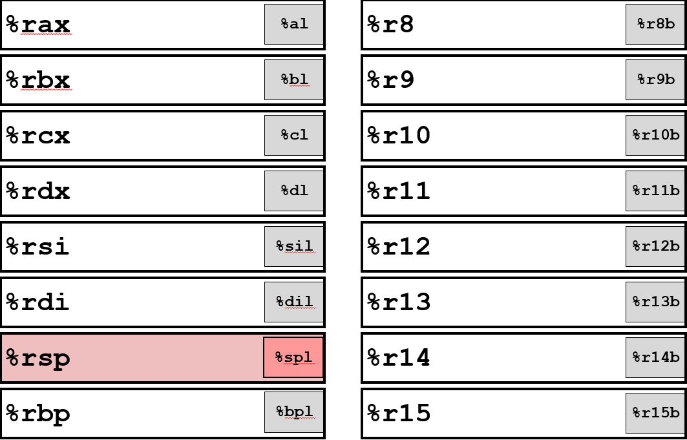
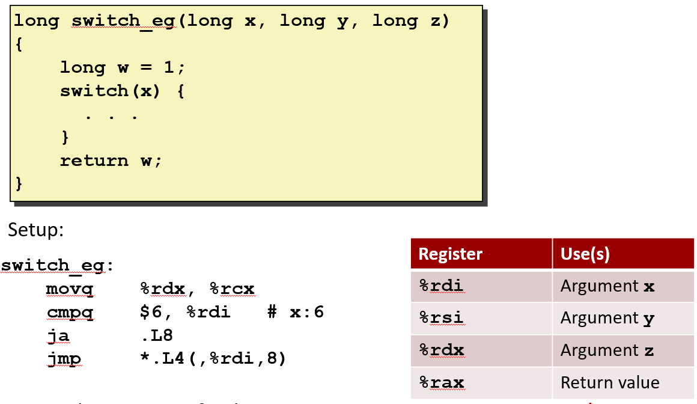

# Machine Level Programming II Control


寄存器不是内存的一部分, 不是缓存的一部分。C语言中没有操作寄存器的关键字

> 当你使用C语言进行编程时, 你「看）不到它们（不能访问它们）

## 处理器的状态

x86的一系列中的几代机器有被称为条件码的标志位, 它们是条件指令运作的基础

现在它有16个寄存器, 其中8个沿用旧x86架构中的名称。还有新引入的8个, 并简单地将它们从 `%r8`命名到 `%r15`

## rsp
真正特别的是 `%rsp`。 `%rsp` 寄存器存的是栈指针, 它能告诉你程序执行到哪儿了。所以不能随意地使用或设置它, 但是其他的寄存器可以去使用或设置：

> 下节课我们会学习更多关于栈的知识, 栈中有非常多的状态信息, 这些状态信息控制着过程的执行。

## rip
`%rip` 寄存器的含义是指令指针(instruction pointer)。

> 在IA32中叫 `%eip`, 现在叫 `%rip`。就像以前的寄存器是 `%eax`, 现在它是 `%rax`

`%rip` 存的是当前正在执行指令的地址, 告之程序执行到哪, 当前正在执行的程序的哪个部分

> `%rip` 不是能以正常方式访问的寄存器。但实际上有一些技巧可以让你获得它的值。

## 条件码

条件码是一组在CPU中用于存储最近一次运算结果状态的标志位

最近的指令：条件码记录的是最近一次执行的算术指令、test 指令或 cmp 指令的结果。set 指令本身不改变条件码。

> 我们只展示了八个中的四个: ZF, CF, SF, OF。其他的与我们现在的讨论无关

这些都是单比特标志, 它们不是直接设置的, 而是根据其他指令操作后的结果设置的, 它们是决定条件操作的基础。

它们被赋予了名称, 这些名称有助于记住它们的含义: 

### 进位标志(CF)

将两个**无符号数**进行二进制算术运算, 有时两个相加的数太大了, 以至于不能被包含在32, 64, 16或8位结果中, 导致多出来一位而产生了一个额外的位, 称为进位

### 零标志位(ZF)
如果刚刚计算的值为零, 则零标志位(ZF)就会被置位
> 这些通常由算术指令通过某种方式设置

### 符号标志(SF)

运算结果最高有效位为1（说明结果是负值）, 符号标志（SF）会被置1

### 溢出标志(OF)
溢出标志(OF) 表示**有符号数**运算溢出的位。CF表示无符号数运算溢出位

### 隐式设置

通过算术运算隐式设置条件码: `addq Src,Dest` ≡ `t = a+b` (leaq 指令不会设置条件码)


如果操作数的符号相同, 但结果的符号却和操作数符号不同: 
- 两个正数相加而得到了负数结果。这是正溢出
- 两个负数相加而得到了正数结果。这是负溢出
- 两个参数n（即操作数）的符号相反, 就不会溢出。


> 这四个标志被置位是许多指令的一种常规行为, 但总的来说, 这些标志大部分时间都被完全忽略了, 因为一般没人在乎

---

### 显示设置

#### cmp
有一些特殊指令只用于设置条件码, cmp（compare）就是其中一个: `cmpq Src2, Src1` ≡ `a-b` (不保存结果)

> 顺便说一句, 以q结尾的指令表示对64位数据进行操作, 也就是我说的quad word(四字)

cmp指令和减法指令几乎一样, 但是cmp只是将这两个值做减法, 不会对结果做任何操作, 只会设置这四个条件标志。

正常的减法指令(sub)类似于 `x-=y`。它将读取两个数字, 随后将运算结果赋给x

> 顺便说一句, 上次有人问过我, x86机器上有两种汇编语言, 有一种是英特尔和微软使用的, 我们不使用它, 另一种是Linux系统使用的, 就是我们现在上课使用的
> 
> 这两种语言是不同的, 他们之间很奇怪的一个差异是他们参数的顺序不同, 这会让你在阅读代码时感到发疯, 如果你熟悉其中一种, 就像你曾试图在路的错误一侧驾驶汽车一样, 你经常会崩渍或做错一些事, 这些话有点离题了


#### test


当有希望相互比较的两个值时, 会使用cmp指令。当想看看一个值的符号时, 就会使用: `testq Src2, Src1` ≡ `testq b, a` (像计算a&b, 保存结果)

使用test指令唯一能确定的事情: 确定零, 负数, 还是正数

一般 test 两个参数是相同的寄存器, 所以是 `testq %rax, %rax`

> 这就是test功能强大的地方, 可以跟两个相同的参数, 来替代得到（测试）一个参数的效果

---

### 读取条件码

现在的问题是你怎么读取它们, 如何使用它们。

虽然可直接从这个特殊的状态寄存器中获得条件码的值, 但一般不这样做

常见的做法是: 要么根据读取其他寄存器的结果设置1位标志, 或者尝试做一个条件分支


set 指令的作用: 根据条件码的组合, 将一个寄存器的单个字节(目标低序字节)设置为 1 或 0。(不改变剩余的7字节)

它就像一个布尔开关, 根据某个条件来决定是打开（1）还是关闭（0）。

set 指令做出判断的依据: 条件码结果是否为零, 是否为负数, 是否溢出等


> 正如你ppt上所看到的, set指令都基于这些条件码的逻辑组合而进行设置的, 这些逻辑组合和set指令的名字相一致。
> 
> 例如符号标志为真, 则sets指令为真, 意味着最近的运算结果是负数
> 
> 比如用于补码有符号数比较的小于(setl), 小于等于(setle)
> 并且它们必须考虑到最近的结果是否导致了溢出, 因为那会影响比较的结果
>
> 这就是我们让你们理解一进制新与算法的部分原因, 以及如何比较结果并让你了解位级行为, 这样你就可以理解这些指令的作用



16个寄存器中的每一个, 都可直接将其最低位字节设置为0或1, 而不会影响到该寄存器的其他7个字节

> 所以他们都有古怪的名字, `l` 意味着低位

---


第一个参数在寄存器在%rdi中, 第二个在寄存器%rsi中, %rsi为y, %rdi为x。

 
> 注意我是如何翻转顺序的, 但是当我注释它时, 我会说x到y, 所以我思考时是以正常的顺序进行比较, 而不是以汇编代码中的参数顺序, 因此当我阅读代码时我一直会这么做, 这可以帮助我以正常的顺序进行思考

cmp设置这四个条件码寄存器, setg设置这个单字节寄存器(%al), 即%rax的最低字节为1, 如果比较的结果是大于y的话, 会将该8字节寄存器的最低1字节设置为0或1

> 现在我的问题是剩余的7个字节如何处理, 而且我希望它全部为零


有一个mov指令具有从单字节到四字节的零扩展功能。这表示可以将任何来源的一个字节, 比如来自某个寄存器的低位部分, 复制到一个新的寄存器中, 并自动补零。


> 这似乎合乎逻辑, 但你会注意到的一件事是这里的自标寄存器是%eax。它是寄存器%rax的低32位, 然后你会说**如何确保高32位被设置为0**


**任何结算结果为32位的结果, x86-64会将在寄存器的其余32位设置为0**, 并且字节级操作仅影响要设置的那个字节位置, 而不会设置其他位, 但四字节会将剩余的高位字节设置为0

假设32位寄存器 EAX(0x12345678), 64位寄存器 RAX(0x1122334455667788)

- 将 0xAB 移动到 AL 中(movb $0xAB, %al), EAX 的值变成 0x123456AB。

- 如果对 EAX 执行16位的操作(movw $0xABCD, %ax), EAX 的值变成 0x1234ABCD

- 如果对 RAX 执行一个32位的操作(movl $0xABCD, %eax), RAX 的值变成 0x000000000000ABCD。会发现, 不仅 EAX 的值变成了 0x0000ABCD, 它上面的那4个字节（0x11223344）也被清零


> 这是AMD的某些人设定的规则, 具体我不知道是谁, 认为这是一个好主意并最终决定采用, 这可能是一个好主意, 但它确实很让人费解。但当你看到这样的代码时, 必须想起这个规则

---

## 条件语句

> 条件语句实际上有两种实现方式, 我们先学习那种通用的传统方式, 然后我们将展示更特别的新方式, 并对其进行比较

## 跳转

传统的方法是使用我们熟知的跳转指令, 并且跳转指令通常以特定顺序执行

> 就像编写一系列语句, 一行接一行地执行, 跳转指令可以从任何地方到其他地方, 它既可以跳过某些指令, 也可以跳回到之前的某些位置或任何位置

无条件跳跃意味着想跳转时就可以跳转; 有条件跳转只有当条件码满足时才会跳转


---

### 条件分支示例(老版)

> 我会使用这个例子向你展示它的几个不同版本, 这里展示的例子没有什么实际意义, 但他们说明了想法

假设接下来需要计算两个值的差值, 然后取其绝对值, %rdi为x, %rsi为y, %rax返回值

生成: `shark> gcc –Og -S –fno-if-conversion control.c`


在汇编代码中, 名称紧跟着冒号叫做标签。它只是个标签, 并不在目标代码中, 它提供的功能是更容易理解它, 然后找到它

所以这是一段相当简单的代码, 但可以看到它正在使用这种跳转, 创建两个不同的代码部分来执行


> 看汇编代码的前五分钟你可能觉得有趣, 但是过一会你就会厌烦, 所以想要更高级的语言表示相同的意思, 用C语言编写可以更抽象一些, 看起来很像汇编代码
> 
> 所以我一般会使用这种方式展示代码, 这样你就可以查看并理解程序的控制结构, 无需仔细阅读底层汇编代码


### 一般条件表达式翻译(使用分支)

```c
val = Test ? Then_Expr : Else_Expr;
```
```
    ntest = !Test;
    if (ntest) goto Else;
    val = Then_Expr;
  goto Done;
Else:
  val = Else_Expr;
Done:
    ...
```


如果test为true, 那么将跳转到某些已经编译好的else表达式的代码(Else_Expr),如果测试失败, 那么原始测试条件成立, 将使用无论原来是怎样的代码来计算then表达式(Then_Expr)

### 条件传送

在代码中能看到另一种方法: 条件移动的优化(条件传送)

> 从软件开发人员的角度来看, 不明白为什么想要这样做, 因为这有点不直观。
> 
> 基本思想是: **把then代码和else都执行得到两个结果, 然后才会选择使用哪一个结果**, 看起来似乎浪费时间, 但事实证明它更有效率
> 
> 如果有十分简单的计算, **当我们学到性能优化时我们会明白原因**
> 
> 现代处理器有点像在海上航行的油轮, 这意味着它沿着某个方向航行, 它真的很难让它停下来或转向
> 
> 你可能正在想我在说啥, 假设你知道的指令序列正在代码海洋中巡航, 这些指令可以很顺畅的执行
> 
> 因为他们**使用了**所谓的**流水线技术**, 这意味着他们在**完成一个指令之前就开始执行下一个指令的一部分**
> 
> 实际上流水线能达到20条以上指令的深度, 能达到的深度主要取决于提前获取的指令的条数
> 
> 当完成一些指令时仍然有另一些指令留在流水线上, 这就是我的海洋线或我的油轮类比
> 
> 但突然他们到达一个分支会发生什么?他们会试着猜测分支结果, 这被称为**分支预测技术**
> 
> 在你们熟悉的情况下, 条件分支会被**采纳**或者**落空**。而处理器非常擅长预测, 有98%的几率能猜对。
> 
> 他们甚至可以在路上预测到S-curve, 呃, 我的比喻到这儿有点不恰当了……总之, **只要猜测正确, 他们就会朝着这个方向全速前进, 效率会非常高。**
> 
> **但如果分支猜错了, 那你就必须紧急叫停, 调转方向, 然后重新开始。在最坏的情况下, 这会消耗40条指令, 也就是40个时钟周期**。
> 
> 所以, 如果你要处理一个绝对值, 这是很常见的。你能预测一个值是正还是负吗？通常是不能的。不管你猜什么, 总有一半的几率会猜错。
> 
> 在这种情况下, 事实证明, 使用条件移动指令会更有效率。**它会先把两个分支的代码都执行一遍, 然后在最后一刻, 你只需决定是否将结果移入寄存器**。
> 
> 这样做的好处是, 你**不需要暂停整个处理器的执行, 也不需要重新选择分支。**
> 
> 我花了很长时间来解释这个, 如果你觉得难以理解, 我完全可以体谅。但请相信我, 这是个非常棒的性能优化方法。


#### 条件传送失败案例

- 只有当计算很简单时, 使用条件移动才有意义
  ```c
  val = Test(x) ? Hard1(x) : Hard2(x);
  ```
- 两个值均被计算时, 可能会产生不良影响
  ```c
  val = p ? *p : 0;
  ```
- 计算时, 可能会有副作用
  ```c
  val = x > 0 ? x*=7 : x+=3;
  ```

---

## 循环

> 现在让我们来看看循环, 它也属于控制结构的一环。
> 
> 实际上C语言有三种不同的循环, 有你熟悉的while循环和for循环, 还有第三种循环
> 
迄今为止, 我写过很多C语言代码, 我用了大约6次第三种循环（do-while）
> 
> 但事实证明它是最简单的实现方式, 所以我们将深入学习它

---

## do-while

以下示例函数的作用: 
- 统计参数x中位为1的数量("popcount")
- 使用条件分支实现继续循环或者跳出循环


这有一个相当简单的方式, 使用do-while循环并将其转化为各种条件的组合, 开始执行do的部分就是之前需要跳转回来的位置。


> 上面是它的实际代码。我不会详细介绍它, 但你可以从这些注释中看到它与上面的代码很相似

jne的标签为L2, 如果为真, 那么会跳回到L2。它的一般形式是do的实现部分, 这部分称为循环体。

所以现在设置一些代码来执行循环体测试, 如果测试成功, 就会回到循环中

**do-while循环的本质还是while循环, 将测试移到开头就变成了while循环**

---

## while
do-while循环在第一次时不进行测试, 无论如何, 总会运行一次循环体; 而while循环在最开始时就会进行测试, 如果条件不成立则跳过循环

**因此有两种方法可以为while循环生成代码, GCC实际上使用了两种不同的方式**

### 题外话
> 当我们使用上次谈到的优化设置时, 我们会发现一个被称为-O, O是optimized优化的意思。
> 
> g意味着调试, 当然你已经知道了g标志的含义有一些历史。正如我上次提到的, -0g是本课程的最好优化级别
> 
> 你希望能够查看机器代码并理解它以及它与C代码的关系
> 
> 因为它做了某种简单的优化, 它不会尝试重写整个程序以使其运行得更好
> 
> 如果使用-01, 它是优化中的下一个级别, 你也会发现有时它会做一些非常奇怪的事情
> 
> 但是当你真正作为一个软件开发人员时, 或者你与公司交谈, 并询问他们使用的优化级别, 他们可能会说-02, 这是常见的那个
> 
> 所以通常有更高级别的优化, 我们故意降低优化等级, 来让这些代码更容易理解, 在本课程中, 无论怎样, 我们都是用-0g作为默认优化选项
> 
> 它做了一个转换, 我称之为jump-to-middle, 这是我自己使用的术语, 其他地方没有这个名词

### 示例一


再次想象有一个这种形式的while循环, 其中有一个测试在循环体中执行

与do-while相比, 需要在第一次循环前就进行测试, 所以这里只是跳到do-while循环代码的中间, 即跳转到do-while循环的测试部分, 然后测试是否可以执行循环体


> 所以这是一个例子, popcount函数while版的代码

### 示例二


第二种方法的主要思想是将while循环转换为do-while循环

但会先进行条件测试, 这样可以防止你直接进入循环

做初步测试, 如果测试为假, 那么将跳过所有循环, 否则它就像do-while循环一样执行


与之前的有些不同, 它有初步测试, 后续代码就是do-while循环


但是如果你看一下它实际上代码都在链接到你的类目录, 类网页的目录中

---

## for
for循环有四个部分: 初始化, 测试, 有一个规则进行更新来继续循环, 循环的主体


> 这是我的popcount函数的for循环版本, 我只是遍历字的每一位并提取它们, 并累加它们作为结果

for循环四个部分对应的代码: init部分是设置为0, test是将i与单词大小进行比较, 更新部分是i++, 循环体就是括号里的代码

> 我在这里将wsize设置为int字节数乘以8, 因此, 无论int是多少字节, 乘以8都能得到字大小

---

### for的while实现


在C语言中思考for循环的一种通用方法是通过下面规则: 这将把for循环变成while循环

> 首先进行初始化, 然后我做了一个循环, 会先进行测试才能判定是否进入for循环, 然后我会执行循环体, 再执行更新, 接着继续测试, 所以这就是C语言中for循环行为的定义


> 当然, 你可以任意选择一种, 无论是使用for循环还是使用while循环, 这都是个人选择问题

---

### for的do-while实现


> 因此, 实际上有用的一个原因是-O1我与你们谈过的一个优化选项。对于初始测试而言, 这是相当普遍的

> 例如在这里, 如果i=0, 我通常将它与32位的字进行比较, 测试为真, 这是肯定的。

> 所以你会看到编译器可以解决这个问题, 然后摒弃保护代码, 所以我相信这是使用-O1级别优化的主要原因

---

## switch

### 题外话
> 而C语言最奇怪的特征之一是: 如果你没有在case的末尾加上break语句, 它就会一直继续运行下去

> 这是编程语言历史上最糟糕的设计之一, 这导致了越来越多的bug。你知道C语言的除了这部分, 没有任何其他单一部分, 能让人有无法理解的心碎和错误

> 而且由于一些奇怪的原因, 他们甚至将这种设计保留在java和所有其他语言中。这保留了你知道的C语言中最危险部分中许多最糟糕的部分, 但不知为何, 他们保留了这个特性。

> 如果你们曾经使用过switch, 我给你们一个建议, 在你确实需要从一个case跳转到另一个case的地方, 请务必添加上注释

> 我数不清我因为没有写break语句而产生bug的次数了, 我已经对switch语句阐述了足够多的观点

---

### 跳转表结构

> 所以通常情况下, 如果你被告知你不应该再使用switch语句了, 你可能要做的就是写一个if-else大长链
> 
> 你可能认为if-else结构是switch语句的机器码样式, 但实际上不是, 所以让我告诉你swicth的机器码做了什么, 这是一个很长的故事


- 将它的一般形式看作一些代码块, 其入口点由这些case值标记
- 然后这些代码块以各种不同的方式串起来, 并做各种各样的事情
- 将所有这些代码块编译成一串总代码
- 并将它们存储在内存的某些位置, 加载内存能得到这些代码块

建一个表, 这个表里的每一项都描述了一个代码块的起始位置。如果 case 标签是在一个连续的范围内, 比如从0到n-1, 就会把这些代码块的地址按照顺序排列在这个表里。

这个表里存了一大堆地址, 这些地址就是各个代码块的位置。

> 这有点像数组索引（array indexing）。数组索引意味着你可以直接从一个已知数组的中间位置取出你想要的值, 完全不用遍历整个数组。switch 语句的底层机器码, 用的就是同样思想。

有了这个表, 我可以直接一步跳到一个代码块, 而不需要通过一堆if-else条件来逐一判断。

现在, 我们再来对比一下这两种思想的效率差别：
- 第一种, 一步到位, 精准地跳到你想要的地方。
- 第二种, 一步步地通过条件判断, 遍历整个列表来找到你需要的代码块。这种方式的时间复杂度是O(n), 效率很低。

**这就是为什么 switch 语句在处理大量连续的 case 标签时, 效率会比一长串 if-else 链要高得多**。


---

### 语句示例



牢记前两个参数分别存在%rdi和%rsi, 第三个参数存在%rdx。

因为这些case里6是最大的数字, 复制参数z, 然后比较×和6, 现在它正在使用跳转指令转到.L8

> 我应该提一下这儿有一个聪明的使俩, ja意思是jump above, 这是无符号比较, 你应该记得如果一个数字是负数, 如果你将其视为无符号值, 则会变为非常大的正值
> 
> 所以通过使用ja, 而不是jg, 如果x大于6, 我想跳转到默认行为 但如果x小于0, 也会导致跳转到默认行为, 所以这是一个聪明的技巧, 使用无符号数比较指令

这可以根据索引从表中提取出一个地址, 然后跳转到该地址, 这就是能够直接进入某些代码块的原理, 根据值是否在0到6之间, 因此该表中将有七项


> 有一点只是为了以后跟踪, 你会看到这个是由于某些原因, GCC, 你懂的。
>  
> 如果我查看所有代码, 我实际上不会使用w作为初始化, 所以我不会在代码块中的某个地方做这件事, 所以我们必须在这里跟踪它

---

### 跳转表


看到这是实际的跳转表，它的构造是由汇编代码指定的，填写此表的实际内容是汇编程序的工作。

> quad 只是一个声明，表示这儿需要一个8字节的值，并且该值应该匹配任何地址。你决定以后确定的是地址。


实际上已经可以看到 switch 语句的一些逻辑，内置于此表中各项的顺序。

特别地这里没有 case 0，所以 case 0 应该是默认代码块。这儿缺少 case 4，因此 case 4 应该是默认代码块。

有时候 switch 语句中有缺漏的 case，这些缺漏的情况会归到默认代码块。

它们没有按照任何特别合乎逻辑的顺序排列，.L7 在这里重复两次，因为它代表了 case 5 和 case 6。通过两次 .L7 就能自动处理这种多个 case 对应同一种行为的情况。通过跳转表将为多个不同的情况提供相同的地址。

---

### 代码块(x == 1)


比如 case 1 是两个数相乘，然后 break。一般情况下，break 只会转换为返回指令（ret）。

这个函数中有一个 switch 语句，无论在 switch 中如何计算，最终都会返回结果

实际上，编译器并不是达到某一点并且说‘好，每种情况都在该点返回’。它只会直接在 break 处返回。所以这儿做了乘法并返回。

---

### 代码块(x == 2, x == 3)


> 实际上这是一种奇怪的方式，我总是对编译器的具体做法感到有些惊讶，它永远不会是你期望的那种方式。

两个连续执行的两个代码块合在了一起。在进入这些代码块之前 w 没有被赋值为1，w 被推迟赋值了。

当直接进入 case 3 时，需要 w 的值为1。所以编译器会提前将 w 设置为1。

结果它创建了两个代码块，但 case 2 会直接跳到第二个代码块。w=1 这块代码位于两块代码之间。


然后这个跳转 .L6 就是我说的合并。合并是你将这两个 case 放在一起的地方。这是 w 设为1的地方。

> 再次强调一下，movl 会将高32位设置为零，所以我可以在这里使用 movl 指令。

---

### 代码块(x == 5, x == 6, default)

我需要 w 被初始化为1，所以我们在这里进行 w 的初始化。在默认情况下，w 被赋值为2。

> 我已经向你们展示了所有的代码块，**只不过我是逐一向你们展示，将它们串起来就形成了文件，并没有特别的顺序。它们的顺序无关紧要。**


---

#### 跳转表的生成与处理

跳转表并**没有嵌入在代码中**。它确实存在，编译器负责生成这些表的框架，而具体的地址信息则由汇编程序填写。所以从根本上说，它是编译器生成的。

---

#### case 值为负数或稀疏时的处理

**如果 case 的值为负数，通常会使用偏置处理**。无论最小值是多少，编译器都会通过增加一个偏置值来将其变为0，或者采取类似的方法，以避免出现负数索引。

如果 case 值范围很大且相对稀疏（例如只有 case 0 和 case 100000），编译器就不会生成巨大的跳转表。相反，它会转换为**if-else代码**，但会以更高效的方式来组织：

> 如果你了解二分搜索，它依赖于事先知道所有值的这个事实，会建立一个 if-else 树。这种方法能将时间复杂度变为 O(log₂n)，而不是线性的 O(n)。

这种方式也适用于处理超出范围或相对稀疏的值。编译器有一套规则来决定何时采用这种方法。

---

#### `switch` 语句的性能优势
尽管 switch 语句可能不常用，但如果你理解并欣赏其背后的原理，它能带来显著的性能提升。

- 跳转表从算法层面带来了性能优势，它让获取所需位置的时间复杂度降为 O(1)，远优于线性的if-else查找。
- 对于稀疏值，编译器会设置条件树，使其能在对数时间内完成查找。无论哪种情况，这都比简单的if-else形式要高效得多。

---
#### 编译器如何正确设置跳转树
如果你想知道编译器如何建立跳转树，可以把它想象成**二分查找**。
- 你有一定范围的值，选择一个中间值并进行比较。
- 根据结果，递归地处理左侧或右侧的子集。

这就是跳转树的准确形式。它们是**平衡二叉树**，利用了`C`语言中`case`值在编译时就是常量的事实。编译器可以对这些值进行排序，并以此来构建树结构。

---
#### 计算机科学家的思维方式
作为一名计算机科学家，我们不应该只满足于简单的解释。我们应该追问：“**如果必须这样做，我该如何实现它?**”

你所看到的大部分程序结构，都是由一套相当有限的核心技巧构建的：

- 条件跳转：用于改变代码执行流。

- 条件移动：用于替代某些分支。

- 跳转表：用于高效的switch语句。

这些基本原语是构建所有高级程序流的基础。当你从C代码转到机器代码时，你会看到这些底层指令是如何被组合起来，以实现更高级别功能的。