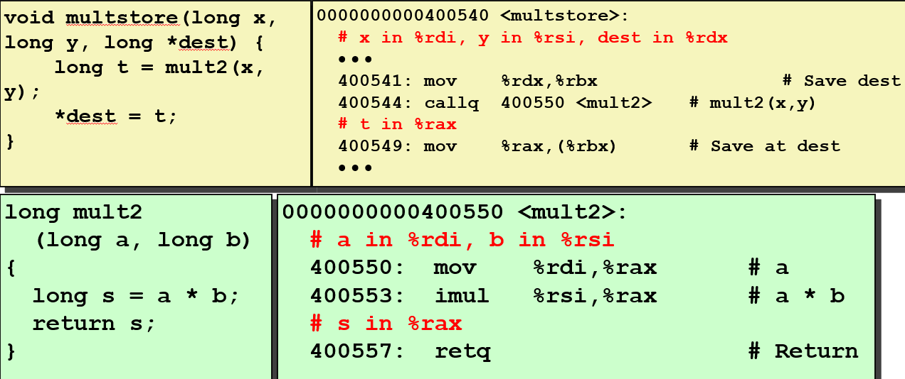

# Machine Level Programming III Procedures

> 那么我们今天要谈论的是过程，我这里将统一使用同一个术语，它既可以是函数、过程，也可以是面向对象编程中的方法，这些都是大致相同的东西，今天的讲座将全部覆盖到。

## ABI

讲述的过程虽然基于x86硬件及其运行方式, 但采用了一套被普遍承认的约定。这种约定称为ABI(应用程序二进制接口)。

在这本书中有ABI的文档。此文档描述的是开发第一台x86-64机器时人们所使用的ABI初始版本

它要求所有Linux程序，所有编译器，所有操作系统，系统的所有不同部分都需要对如何管理机器上的资源有一些共同的理解，并且同意遵守这套规则。

因此，它超越了硬件实际提供的软件标准，它是机器程序级别的接口,因此被称为应用程序二进制接口

所以，当人们问起是谁制定了这些规则和事情的时候，回答的要点是：是一个工作组实现了这些标准。

Windows也有一个单独的ABI，它与Linux ABI类似但不完全相同。苹果OSX系统也有它自己的ABI。甚至FreeBSD（UNIX操作系统的另一种变体）都有自己的ABI。

---

## 过程的机制
这里展示的是一个过程P调用另一个过程Q。

### 传递控制
传递控制将控制权转移给一个函数并确保它能返回到正确的位置。

当P调用Q时，程序必须以某种方式跳转进入到Q中，并开始执行Q的代码。然后当Q执行到它的退出点，程序必须以某种方式恰好在P调用Q后的位置。

为了返回到正确的位置，需要记录返回位置的信息。

### 传递数据
在这个例子中，Q是一个函数，它接受单个参数，并能在函数内部使用这个参数。

在P调用它的地方，P给Q传递了一个称为x的值。所以 x 的值必须以某种形式记录下来，使得在Q内程序有权访问其信息。

当Q想要返回一个值时，P也将用相同的方式利用该值，因此必须规定一些关于如何回传数据的约定。

### 内存管理
在函数中可能会有一些局部数据需要分配一些空间。确保正确分配才不会无限量地消耗存储空间。

> 将其分解为那些小部分的部分原因是，在X86-64中，设计者们会尽可能地减少过程调用的开销。因为这是个相当关键的开销。为此他们的原则是只做绝对必要的事情。
> 
> 所以如果数据不需要本地存储空间则不要分配和释放空间了。如果你没有必要传递任何值，那就不要传递它们。总之就是尽可能规避开销。
> 
> 因为每次都没有固定的模板，差不多在每种情况中过程的执行都需要具体情况具体分析。因此，我们将一步一步地分析这些步骤，看看到底发生了什么。

---

## x86-64 栈

栈并不是什么特殊的内存，它只不过是普通内存的一个区域。对于汇编层面的程序员而言，内存只是一个巨大的字节数组。在那一堆字节中的某个地方将其称为栈。

程序用栈来管理过程调用与返回的状态。在栈中，程序传递潜在信息、控制信息和数据，并分配本地数据。

栈可以用于管理这些信息的原因在于栈这种数据结构，符合过程调用和返回的整个想法的实质。

当调用时，可能需要一些信息，但当从调用中返回时，所有这些信息都可以被丢弃。因此它利用了栈的那种后进先出的原则。这与调用与返回的思想十分吻合。

在x86栈中，开始的地址是一个编号非常高的地址。当更多的数据分配给栈，栈指针递减。每次在栈上分配更多空间时，都会通过递减该指针来实现。

所以栈指针只是一个常规寄存器 %rsp，它的值是当前栈顶部的地址。

> 现在，我们采用一种约定的方式，我并不确定为什么一定要这样，但我们一直就是这样做的，我们要倒着画栈。
> 所以栈的顶部实际显示在底部。更加混乱的是，你需要记得地址是从下往上递增的，而不是从上往下。因此，当你往栈里添加数据时，栈指针地址是递减的。
> 也许这些都与你的直觉不相符，但你只需要习惯就好了，因为我们不打算重新绘制所有幻灯片。
> 所以无论如何都要一遍又一遍地记住，正如这箭头所示，如果我们要枚举数据中这些不同字节的地址，它们沿箭头方向是递减的。
> 当我们向栈中添加数据时，栈的顶部位于图片的底部，我们通过递减堆栈指针来完成这个操作。

### push

有 push 和 pop 这两个明确的指令来对栈进行操作。它们经常被写成 pushq 和 popq。但是实际上 q 是指令的可选后缀。

栈上的 push 的源操作数可以来自寄存器、内存或立即数。所以这有点像移动指令（move）。

不过，移动指令（move）的目的地是内存，而目的内存地址是通过首先递减栈指针然后执行写操作来确定的。

### pop
栈上的 pop 指令从栈中读取数据，并将其存储在目标中，对该指令而言目标必须是寄存器。

> 我认为 push 操作的目标也是一个寄存器或者立即数，你不能将内存中数据直接放入栈中。

所以 pop 从内存中读取，它读取的地址由当前栈指针给出，然后它将栈指针递增8。这些都只适用于8字节操作数, 然后将其结果存储在寄存器中。

---

push 和 pop 指令所做的事情，其实可以分解成几步更基础的操作：
- push：可以被看作是"减小栈指针 + 移动数据"的组合。
- pop：可以被看作是"移动数据 + 增加栈指针"的组合。

**既然它们能被分解，为什么还要作为独立的指令存在?**

因为这些操作太常见、太普遍了，如果每次都要写好几条指令来完成，效率会很低。因此，处理器设计者们为了方便和性能，将这些组合操作内置成了单一的指令。

---

call 和 ret 指令也包含多步操作，但它们能隐式地操作程序计数器(%rip)。

call 指令不仅仅是将返回地址压入栈，它还同时修改了 %rip 的值，使其跳转到被调用的函数开头。

ret 指令不仅仅是从栈中弹出地址，它还同时将 %rip 的值设置为弹出的地址，让程序返回到正确的位置。

无法用其他普通的指令来模拟这种对 %rip 的双重操作。**没有一条普通的指令可以既操作内存或寄存器，又同时修改程序计数器。**

这就是 call 和 ret 无法被简单模拟的原因，它们是独一无二的。

---

在写入之前要对栈指针进行算术运算。因为当第一次开始时，栈指针指向原本的栈顶元素。

当想创建一个新的栈顶元素，就需要先减少栈指针，然后再写入。想读取目前的栈顶元素，读完之后，想增加栈指针来释放空间。

> 你们需要注意的是，当我说“释放”的时候，并不意味着我神奇地抹去了什么，我仅仅移动了栈指针而已。原来的栈顶元素仍然保留在内存中，只是不再是栈的一部分了。

而 push 和 pop 的指令是为了将数据放入栈或将其取出。指令 call 与 ret 使用了相同的思想。

---

## 传递控制

这是经过反汇编器输出并稍微清理后的结果。类似地，还有一个名为 mult2 的函数和它的反汇编版本。

> 说了这么多，其实是向你们展示函数 multstore 对 mult2 的调用。我想通过这些代码展示一下这个调用是如何工作的。

请记住这两条指令: 要调用一个函数，只需要调用（call）此函数的标签; 当准备好返回时，执行 ret 指令即可。

这两个指令并没有完成过程调用与返回的全部任务，它们只是完成了控制部分，这只是过程调用的三个方面之一。

> 另外你会看到 rep,ret 指令，你几乎可以忽略它，它存在的理由不太明确，把它们当做是一个意思就可以。

---

### 控制流程示例

#### 图一

假设栈顶地址在 0x120。它表示当前指令的地址位于 0x544，即这个 call 指令。

> 顺便说一下，这样的栈顶地址在实际中是不可能出现的。另外，这个称为 %rip 的程序计数器与死亡（rest in peace）无关，

#### 图二

call 指令会减少栈指针，即从十六进制数 0x120 中减去8得到 0x118。

它会将调用并返回时**要接着执行的指令地址**写入栈顶部。
> 这个指令是我返回时要继续执行的指令。我想继续执行这个函数，而且它是当前调用之后的指令，而不是其当前被调用的指令，否则会导致无限循环。

在 call 指令的编码中也有指令的目标地址，该地址恰好是函数的起始地址。因此程序计数器被设置为该值。现在处理器开始执行这些指令。

> 所以它做了一个 jump 和 push 的组合，这就是为什么之前会提出这个问题：push 指令是否可以根据现有指令组合得到呢？对于 push 而言是可以的，而 call 指令就不行了。

---

在真正进入 `multstore` 之前，不会将 `mult2` 的地址存入 `%rip`。永远不会显式地操作 `%rip`，没有那条指令可以直接操作它。它是 call 指令隐含的一部分，这都是 call 指令会做的。

被调用函数的地址嵌入在这个调用指令中，但嵌入其中的是目标地址，例如这里长达五个字节。

因此它将采用该地址并将其作为程序计数器的新值。`call` 指令同时 push 原本的返回值并为程序计数器设置新目标，所以它做了这两件事。

> 没有什么方法影响程序计数器, 无论是 call 还是 return，我都不这么认为。如果是这样，那将是非常含糊不清的。

---

#### 图三

然后想象这个 mult2 运行，它到达返回点并且到达这个 ret 指令。

> 顺便说一下，retq 和 rep 是同样的指令。ret 的目的是逆转 call 的效果。

#### 图四

假定栈顶部有一个想要跳转的地址，所以它会从栈中 pop 出该地址，并增加栈指针。

该地址并没有真正从内存中消失，只是不再被视为栈的一部分。然后它会将程序计数器设置为刚从堆栈中弹出的地址，这样程序回到原来的位置继续执行。

> 好的，这就是传递控制。所有这些事情都非常简单，只不过是一些自然的机器代码。它的每一部分都非常简单，因为它被设计为由原始硬件执行，所以相当简单。其实并不仅仅这么简单，但这的确就是最基本的思想。

---

## 传递数据

已经看过一些寄存器用来传递函数参数。已经看过寄存器 %rax 用于函数的返回值，都是一些基本的想法。而这一切都在这个ABI中，被定义为一组约定，而不限定于硬件的某个部分。

这些规则要求前六个参数通过这些特定的寄存器来传递，这几个寄存器的选择并没有什么逻辑，所以需要记住顺序。因为返回值由寄存器 %rax 返回。

> 顺便说一下，这里的参数要求是整数或指针类型。好吧，我想我讲过一点浮点类型，但浮点类型的参数是由另外一组单独的寄存器来传递的。**现在，暂且假设我们只处理整数数据和指针数据吧。**

如果有一个函数超过6个参数会发生什么, 处理这种情况的规则是：将超出的参数放入栈上的内存中。

这些参数被传递给了这个函数，该函数必须从栈中检索这些值。回到过去IA-32的糟糕时期，所有参数都在栈中传递，但现在大多数情况下你通过寄存器传递参数，原因是寄存器访问比内存访问快得多。

---

这里的代码只是为了向你展示它们如何工作。

当有一个函数的返回值，它的处理方式是将返回值存入 %rax。然后当从 %rax 返回到 multstore 中。

现在 multstore 代码可以假设寄存器 %rax 保存了返回值，然后，它可以将其存储在目标寄存器中。

> 我们将在一分钟内了解为什么在这里使用了 %rbx，我们一会儿就会提到。
> 但是重点在于，只要每个人都坚持这种通用接口标准，然后你甚至可以使用不同的编译器来编译代码，并且让他们能够在传参与返回数据方面相互协作。这就是为何你会需要这样地约定。

---

首先对于 call 和 return，这是一台64位机器，因此所有地址都是64位或8字节。但是，即使 push 和 pop 指令也仅适用于8字节值。

如果试图在64位代码中写入 pushl，它会返回语法错误。对于不同的IA-32机器，则为四字节值。

> 为了获取一个显示传递参数的示例，需要一个至少有7个参数的函数，这种代码当然是非常混乱的，我决不会这样做，但书中有这样一个例子
>
> 所以，现在我们不得不接受它，在后面的部分中，我会展示这个例子。 

---

## 管理本地数据

栈也只不过是一种特别地内存分配模式。调用和返回的功能之一是可以对函数进行嵌套调用。执行特定函数时，它只需要引用该函数内部的数据或已传递给它的值。

但关键是代码中无论有多少其他函数，在那个时刻都被冻结了，在任何给定的时间只有一个函数在运行

假设使用的是一种称之为单线程的运行模型。

**可以在这个栈上分配这个当前函数需要的任意多的空间，当从那个函数返回时，不需要保留与该函数相关的任何信息。返回时，之前被调用地函数就可以永远消失了。**

> 这就是为什么我们要用栈的思想，在栈上可分配空间，如果调用更多函数，一直分配下去就是了。但当它们返回的时候你需要退出栈，并释放空间。
> 
> 所以栈的规则完全适用，它与过程调用和返回的思想完美匹配。因此，我们把栈上用于特定 call 的每个内存块称为栈帧。
> 
> 为了使你们理解其实现思想，我引入了另一个叫做栈帧的概念。**更技术性地说，它是特定过程调用的特定实例的栈帧**

---

## 栈帧

- 调用栈：是指整个程序运行时所有函数调用在栈上堆叠起来的结构。

- 栈帧：是调用栈中属于单个函数的独立区域。

在栈中**为每个被调用且未返回的过程**，保留一个栈帧。通常一个栈帧由两个指针分隔，一个是栈指针，还有一个叫基指针，由寄存器 %rbp 保存。但基指针是一个可选指针（实际上对于IA32也是如此）。

- 栈指针（Stack Pointer，%rsp 或 %esp）：它始终指向栈的顶部，也就是当前栈帧的顶部。

- 基指针（Base Pointer，%rbp 或 %ebp）：它指向当前栈帧的底部。

这个寄存器实际上并不会在程序中以帧指针的形式出现，它将被用作常规寄存器。

唯一确定的信息就是%rsp指向当前函数的栈帧顶部。至于这个函数占了多少栈空间，它的局部变量和参数都在哪里，无法仅凭寄存器就得到一个清晰的边界。

因为没有基指针来提供栈帧的固定边界，编译器就必须在编译时精确计算每个函数需要多少栈空间。所有的局部变量和参数的偏移量，都必须相对于栈指针 %rsp来确定。

> 那么目前为止，我们还没有看到什么代码对栈进行任何显式管理，因为我们现有的例子都非常简单，并且只是将栈用于返回地址。但我们会看到一些更多使用栈的例子。

每次开始调用一个函数时，栈上就会为它地栈帧分配一些空间, 该帧的位置由一个指针或两个指针指示。

---

当继续递归调用时，在栈中添加更多东西使它越来越深。这个过程可以不断进行，使得递归有点危险的原因之一是：与迭代相比，随着在递归中的深入，它不断需要更多空间。

> 大多数系统限制了栈的最大深度，这是可以理解的，因为他们害怕那种无限循环版本的递归，即失控的递归，这种递归只会不断将越来越多的东西压入栈。那是题外话了。

当这些开始返回时，这些帧将从栈中被释放。所以关于这一点的好处就是它意味着，每层都会有由自己管理的局部状态。于是，栈的原则再次保证了它能正确工作。

> 特别地，我们会注意到递归的构造方式。递归调用的处理方式与常规调用完全相同，它们没什么特别的。递归所需的所有基础结构都由栈的原则所保证。

---

既然 %rbp 是可选的，那么程序怎么知道如何释放空间，如何将栈重置回正确的位置？

例如，它知道当它分配时，它将分配16个字节，然后它最终知道可以释放16个字节。

有一些特殊情况，它无法提前知道将分配多少空间，当它必须分配一个可变大小的数组或内存缓冲区时，它实际上会在这些情况下使用 %rbp 来实现这个目的。

---

### x86-64/Linux 栈帧

如果传递六个以上的参数，调用者实际上将使用自己的栈帧来存储这些参数，当调用时，它会将返回地址压入栈。所以在函数开始之前，所有这些信息都已经在调用者栈帧中。

如果有这个特殊情况并且正在使用基指针的话，那么必须有一些方法来存储基指针的旧值，这样就可以在返回时恢复它。

函数在执行过程中可能会用到一些寄存器。为了不影响调用它的函数（caller），它需要先将这些寄存器的原始值保存到栈帧中。

当函数返回时，它会从栈帧中恢复这些寄存器的旧值，确保调用者的上下文不被破坏。

像数组这样占用较大空间的变量，都会直接在栈帧内分配内存。这是栈的一个优势——为局部变量提供快速且自动管理的存储空间。

函数那些额外的参数就不能通过寄存器传递。它们会被调用者压入栈中，存储在调用者的栈帧里。当被调用函数开始执行时，它会从栈上读取这些超出的参数。

---

### 示例：incr

#### 图一
这个函数需要一个参数是指针，另一个是整型。它的作用是它从指针中获取 x 的值，它通过将 x 和传递给它的值相加来计算值 y。它将 y 存储回 p，但它返回的是指针的原始值。

- 通常 %rdi 将保存第一个参数，在这种情况下它是一个指针，所以从该指针读取并将值放在 %rax 中，这也是返回值所在的地方。

- 然后增加 %rsi，其初值为 val，现在它具有 x+val 的值。

- 然后它会将其存储在 p 指向的值中，它会返回。

%rdi 是第一个参数，%rsi 最初的值是 val，但现在它将在调用期间设置为 y。同样，%rax 保存的是初值，它既用于保存 x 的值，同时也被用作返回值。

#### 图二

函数 call_incr 将创建一个名为 V1 的值，并且生成一个指向该值的指针。那么这意味着 V1 不能只保存在寄存器中，因为它不能创建寄存器的地址。

红色的代码生成了两条指令，其一是在栈中分配16字节的空间，其二是在离栈指针的偏移量为8的地方存储常数 15213。

程序经常在栈上分配比实际需求还要多的空间，因为有些约定要求内存地址保持对齐。

> 对齐的方式可以有很多种，这有点含糊不清，但你大可不必担心是否会有未使用的空间和函数，因为他们这样做的原因是。对某些人来说可能很有趣，但目前你并不需要理解。

#### 图三

现在内存中有一个数字：15213，可以创建一个指向它的指针。所以要构造这个调用需要创建一个指针指向 V1，然后给它传递一个数字 3000。

代码将 3000 复制到寄存器 %esi。

> 你看到这里的所有数据类型都是 long，没有 int。然而它只是复制 3000 到寄存器 %esi 而不是 %rsi，它使用的是 movl 而不是 movq。
> 
> 我想我们上次可能讲到了，但 3000 是一个足够小的数字，32位已经够用了。这是一个正数，所以我们不必担心符号位。

当一个指令以 e 开头寄存器作为目的地时，它会将该寄存器的高32位设置为零。因此，这将具有复制数字 3000 的效果，对于寄存器 %rsi 来说则是高位清零。

**编译器喜欢这么干的原因是 movl 比 movq 少一个字节。**

但 lea 指令经常被用来做两个数字的加法，但它实际上却是为此目的而设计的。

它是与栈指针相差8字节处的内存引用，但是与从该内存引用处读取数据不同，该指令会直接将计算的地址复制给 %rdi，所以 %rdi 现在将等于栈指针加上8。

#### 图四

记得 call 指令将两个数字相加（加3000）并将结果存储回指针。因此它的作用是将此内存位置设置为 18213。

> 你会注意到这里的聪明之处，并且还返回特定值。

#### 图五

将 V1 中的值加到刚刚计算的值上。我们刚刚计算的值是 V2。 从内存 %rsp+8 中读取 V1 ，将其存到 %rax 中。最后释放空间。

所以这回答了之前的问题，编译器是怎么知道如何将栈恢复到原来的位置的: 

**因为编译器会计算出这个特定的函数需要多少空间，然后，在调用时分配那么多的空间，并在结束调用时释放掉。**

> 你现在知道了这个非常简单的例子，但更复杂的例子仍然是基于同样的思想。这样就可以在一个例子显示数据管理，栈管理，使用栈帧的想法。

#### 图六

所以 %rsp 在执行 ret 之前就恢复到它原来的位置是非常重要的。

---

## 寄存器保存数据惯例

ABI也准备了一套关于寄存器的约定。显然 %rsp 是一个非常重要的寄存器。

> 你不会希望程序在他们不知道该怎么做的情况下随机改变此寄存器的值。但事实证明我们对其他一些寄存器也要小心。

---

当 who 被函数 yoo 调用时：寄存器 %rdx 不一定还保存着 you 想要存储的数据

因为 who 可能覆盖了 %rdx 并在那里放了其他东西。所以如果 who 做了一些涉及寄存器 %rdx 的操作，它可能已经替换掉之前的值了。

> 所以显而易见的答案是你不应该为此目的使用 %rdx。**这就是为什么我们会提出一系列约定。**

当一个函数调用另一个函数时，称调用别的函数的函数为调用者（caller），而被调用的函数称为被调用者（callee）。

**基本有两种方法可以管理寄存器：调用者保存（caller-saved）; 调用者保存（callee-saved）。**

### 调用者保存

- 调用者在调用前保存临时值到它自己的栈帧

想要这个值在返回时保持不变，则应该首先存储它，不应该假设寄存器会一直不变。应该假设寄存器的值可能被改变。

寄存器 %rax 用于返回值，还有六个寄存器用于传递参数。寄存器 %r10 与 %r11 用于存储可以被任何函数修改的临时值，它们属于调用者保存。

这些寄存器常常被改写，因为无论给函数传递什么参数，该函数可以对数据执行任何操作，只要它不会以某种方式破坏其他数据。

所以这些寄存器也通常被用作临时存储，而 %rax 在被设置为最终返回值之前经常被多次覆盖。

### 被调用者保存
- 被调用者在使用前保存临时变量的值到它自己的栈帧
- 被调用者在返回给调用者时再次恢复这些值

调用者保存是所有函数之间的约定，它也是ABI的一部分。如果特定函数想要更改某寄存器，需要先将它存储起来，将值放入栈中。从该过程返回之前，应该把它恢复到以前的状态。

> 所以这是一种名为被调用者保存的约定，它有点不那么直观，需要一段时间才能掌握这一点，但你会开始看到它的价值。

下面四个寄存器最常见的是 %rbx，属于所谓的被调用者保存的寄存器。意味着，当一个函数要改变这类寄存器的值时，只能使用一些特殊的方式: 

- 其中一个寄存器必须把值 push 到栈中，然后在返回之前它会将该值从栈中 pop 出。

当使用帧指针时，寄存器 %rbp 是很特殊的。如果不使用帧指针，则可以将其视为被调用者保存的寄存器。

> 你可以将这两者结合起来并且正常工作，这好像有些微妙。同样，我提到过，%rsp 也很特别的，除非你知道你在做什么，否则你不要乱用它。

---

### 被调用者保存示例

> 那么让我们看一下**被调用者保存寄存器的使用示例及其工作原理**。我会通过一个类似的函数示例来解释

#### 图一
现在要让返回值加上 x，它是由寄存器 %rdi 传递进来的，重用寄存器 %rdi 将值传递给 incr，所以我不得不用 x 做点什么，

然而，当从调用中返回后还需要 x，所以要把它放好，这就是为什么需要用到被调用者保存的寄存器。

在函数开始时，将存储 %rbx 目前的值并把它放在栈上。而且这个函数的栈帧有个返回地址。

先保存 %rbx 的值，然后将按照之前的方式将栈指针递减16。这16个字节的空间位于为 %rbx 所分配的18个字节空间之后。

#### 图二
当它想要计算此返回值时，无论 incr 这个调用做什么，即使 incr 函数用到了寄存器 %rbx，它会在返回之前恢复此寄存器的值。

这个函数在退出时不仅会增加栈指针，还会将 %rbx 的值重新弹回。所以再次看到这种成对的 push/pop，地址的减小/增加。在函数调用结束时，会按照与之前相反的顺序执行。

每个程序都会以这种方式处理 %rbx，即修改之前将它先暂存在栈上。如果不用改变，则不需要保存任何东西。

> 再此强调，这都是源于栈的原则，算是对API的8种思想的一种展示吧。

---

## 递归函数

> 你会认为递归是某种神奇的计算机科学，它似乎是一种黑科技。但它确实可行。
>
> 但当你看到这些底层机制时，你会发现黑科技其实没那么神奇
>
> 而且C编译器并不需要专门考虑递归的情况，递归函数和正常函数别无二致，因为栈的原则确保了它的可行性。

此函数的作用是统计一个数的二进制表示中1的数目。

初始情况下，如果参数为零，则1的个数是0，否则提取最低有效位（LSB），这个比特要么是1要么是0，即1个或0个1。

这个结果加上剩余数字的统计结果即为最终结果，剩余数字可通过原来数字右移一位得到。

请记住，参数类型都是 unsigned，所以右移运算都是逻辑右移，此例中绝对不要使用算术右移。

> 通常，相比于迭代，递归代码总是会生成更大的代码块，因为它必须处理更多栈上的操作。所以这和递归调用一样简单。

---

### 终止条件

首先假设 x 为零，并将寄存器的返回值设置为零（%eax）。然后它将将测试 x 是否为零。

如果 x 值为零，je 表示测试结果为0（相等）时就跳转。或者也可以用 test 指令，它们是相同的指令。因此，如果值等于零，将跳转到函数的末尾并执行返回指令。

> 就像我在 %rap 之前所说的那样：你可以忽略它。所以那个处理那一个。

现在剩下的代码就是处理这个下半部分，它们需要设置递归调用的参数。必须跟踪 x 的最低有效比特位，并处理其它所有事情。

---

### 寄存器保存

除了存储 %rbx 之外，它并没有用到栈上其它什么东西。不管 %rbx 存了什么东西，当进入时，%rbx 是什么值，程序并不关心。

它被静静放在栈上，没人看它一眼，也没人会用它。但还是必须把它暂存在栈上，以便返回时可以恢复成原来的值。

---

### 调用设置

把 %rbx 的值 push 到栈中。代码的主体是将 x 复制到 %rbx。因为刚刚把它放在栈上了，现在就可以存储别的值了。

并且只需要用到该寄存器中的值的最低有效位，%ebx 而不是 %rbx 作为 andl 的目的地，因为 %rbx 高位都是0。

然后将 x 右移一位，从而设置好了递归调用的参数。所以这几行红色代码完成了这几部分工作。

现在准备好递归调用 pcount_r 了。因为在 %rdi 保存了移位后的值。

---

### 调用

当 pcount_r 返回时，可以假设 %rax 保存了递归调用的返回值，即使 pcount_r 确实修改了 %rbx，但因为代码行为良好，%rbx 将恢复到之前的状态。

在这种情况下，%rbx 就在调用之前把它设置为这个右移后的值。因此当返回时，可以假设 %rbx 中存储了原始参数 x 的最低有效位，而 %rax 保存的是递归结果。

### 结果

可以将这两个数字加在一起，最后的返回值即为正确计算的结果。

### 完成

最后弹出 %rbx 来恢复它的值，然后返回。

> 所以你看，这又是一个像拼图一样的融合了多种技巧的例子。而且，所有函数都使用了同一个通用约定，比如，参数在哪里传递，比如，什么寄存器可以使用，如何使用寄存器，等等。
> 
> 如果一些寄存器在被使用后必须被恢复，还可能参与其它工作，我们就需要让它能够恢复到之前的状态。
> 
> 如果你使用寄存器 %rbp 作为帧指针，即指向一个帧的开头，同时，假设你有一个需要基指针的函数，因为我们之前提过，如果一个函数在内部需要分配一些空间，它在编译时是未知的。
> 
> 无论怎样，如果你将 %rbp 视为被调用者保存的寄存器，那么，当这些其他函数返回时，如果他们改变了，如果他们出于某种原因使用了 %rbp，它们会保证将其恢复。无论以前发生了什么，现在这个函数都将得到具有可靠值的 %rbp。
> 
> 这就是为什么创建ABI这种非常谨慎的规范的原因，在新处理器的生命周期的早期，对于所有编译器的编写者、操作系统编写者，以及那些实现 gdb 调试工具等工具的人，总之，我有他们可以使用的合适标准。

---

## 总结

> 顺便说一句，实际动手才是你们应该做的事。我可以给你讲几周的课，**但要真正理解，最好的方法是几乎手动执行一些非常简单的例子，或者使用调试工具亲自运行它们**，只是为了确保你真的相信这一切都是可行的，因为所有这些部件恰好合在一起，它们相互配合的方式才能发挥作用。

栈原则是递归调用可行的原因所在。每次调用函数时都有一个栈帧，这个思想意味着，我可以一直调用函数，直到永久。

当深层递归时，仍然拥有调用当前函数的其他未完成调用相关联的数据，但是每个函数都有自己的栈帧，所以必然有一个地方，用于存储与函数的一个特定实例相关联的信息。

寄存器保存约定确保了函数之间避免出现相互摧毁彼此数据的情况。如果正在使用被调用者保存的寄存器，则有义务保存并正确恢复它。任何被调用的函数都有义务进行保存和恢复。

然后这种栈的概念与过程调用和返回的方式相匹配，如果 P 调用 Q，然后在我回到 P 之前，Q 已经返回了，所以我不再需要 Q 的存储空间了。

> 那些你已经在150或其他地方看到一些有趣的语言，它们并没有那种状态可以信任的栈规则，但实际上，他们必然使用了其他某种机制，比如，使用堆空间而不是栈，来存储函数帧的栈数据结构，从而在函数返回后恢复数据。但是对于C以及所有标准的常用语言，栈的原则是我们所必需的。C的设计师们非常了解，他们设计的语言与栈之间是何等之匹配。

> 虽然之前谈的是简单的递归，但有时也存在相互递归，比如，函数 P 调用 Q 然后 Q 又可能调用 P。它看起来非常奇怪，也非常聪明，但是它的实现方式和我们刚才讲的没什么两样，不需要任何特殊代码。

