# Machine Level Programming IV Data

> 由于我们正在谈论Intelx86-64机器, 所以很多内容涉及到这种机器底层的细节。
> 
> 但我们希望你理解其中涉及到的通用原则, 当换到另一台机器的时候你就会意识到它们。
> 
> 这就像你学习第一种汇编语言时是最难的, 再学下一门就简单多了 。

> 到目前为止我们所看过的所有程序都只是操纵整数或长整数和指针。这就是我们所说的标量数据, 不是任何聚合形式的数据。今天我们将看看那些把数据收集起来的情形, 即将多个数据元素放在一起。

有两种方法可以做到这一点: 一种是使用数组, 第二种方法是使用结构。

- 数组: 可以通过数据创建许多副本, 或者许多相同数据类型的副本。
- 结构: 可以创建一个包含不同数据类型的值的小集合, 同时每个值都可通过字段名访问。

这些定义可以是递归的。可以使用结构数组和包含数组的结构。

> 我们将看到的是它们在机器内存中的表现方式, 以及操纵这些不同数据结构的代码是怎么样的。

在机器级代码里是没有数组这一高级概念的。而是将其视为字节的集合, 这些字节的集合是在连续位置上存储的。结构也是作为字节集合来分配的。

C编译器的工作就是生成适当的代码来分配该内存, 从而当引用结构或数组的某个元素时, 可以得到正确的值。

对于编程语言来说, 这是一种非常常见的要求。现在机器已经提供了相关的、接近完美的指令, 它们完全是为这类特殊应用而设计的。

> 而且我还会提到一点点浮点数, 给你一个浮点数的初步认识, 因为也值得去了解如何在机器上实现浮点运算 。

## 一维数组
### 内存分配

内存中用足够的字节去表示包含n个元素的数组, 这一段内存都会用来保存这些数据。

例如: 要创建12个 `char` 的数组需要12个字节。要创建5个 `int` 的数组需要20个字节。`T A[L];` 表示数据类型 T、长度 L 的数组, 在内存中连续分配 L * sizeof(T) 字节

只需将要表示数据类型的大小乘以元素数, 就可以得到数组在字节数方面的大小。

> 一个字符是一个字节, 双精度或长整数则是八个字节, 指针也是八个字节 。所以这些数据类型都有不同的存储量 。

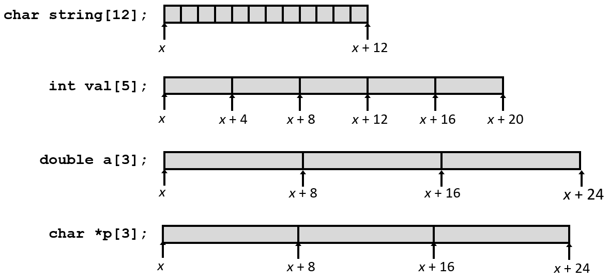
x表示该内存区域开头的起始地址。因此可以通过给x加上一个数字计算偏移量, 来获取此数组的一个特定元素的地址。而这正是机器代码要做的事。


### 数组访问
`T A[L];`标识符A可作为数组索引为0的元素指针: `Type T*`, 该声明实际上做两件事: 
- 分配足够的存储字节来保存整个数组。
- 从编程语言的角度来看, 可以像指针一样对待数组A的标识符。做它的指针运算。

> 这是C的其中一个特点, 在它被创造的那时候, 是一个相当独特的东西, 至今也仍然是独一无二的。**即这种指针和数组、数组标识符可互换的思想。**

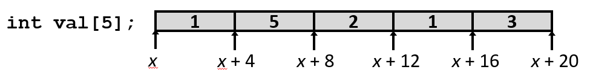

|引用形式|val[4]|val|val+1|&val[2]|val[5]|*(val+1)|val+i|
|-|-|-|-|-|-|-|-|
|类型|int|int *|int *|int *|int|int|int *|
|数值|3|x|x+4|x+8|??|5|x+4i|

val[4]是此数组的元素四, 是最后一个元素。也可以只是引用。

val表示的数据类型是int*, 是指向整型的指针 。它的值是一个指针。指针是用来记住地址的。同时它只是数组的首地址。

> 我可以对val进行指针运算。这点正如你所了解的C, 会有点令人困惑, 我们会反复讨论到它。
- `char* p`声明的数据类型是 `char`, 所以当使用 p++ 进行递增指针时, 表示给它加上1。
- `int* ip`声明的数据类型是 `int`, 所以当使用 ip++ 进行递增指针时, 表示给它加上4。

类似的, `ip += 1`实际上是将 `ip` 的值 `+4`。因为当从一个地方跳到另一个地方时, 想要的是一个指针, 希望ip增加足够的字节以指向下一个整数。

数组和指针之间有一点不同: **根据声明 `val` 是固定的值, 无法改变val的值, 因此不能val++。指针则可以通过各种方式改变它的值。**

&val[2]表示该数组第二个元素的地址。先是val[2]表示x+2, 然后&表示间接引用它。这是对同个东西的另种写法。

**指针运算的整个想法对于C语言来说是相当独特的。`val` 表示数组的开头是C语言的一个非常基本的原则。**

---
C语言里没有边界检查。编译器允许使用负值作为数组下标。当越界时, C会给你一个潜在的未定义值。

例如: 对于 `ip+x` 的表达式, 当 `x` 是负数时, 规则仍然适用, 最终结果将小于ip, 而不是大于ip。

如果越过了数组的范围, 可能得到任何不在范围内的东西。可能是无效的, 可能不是有效的地址, 然后得到了一个段错误。

> 你不必为不同的数据类型提供不同的缩放因子, 否则会让你抓狂的。但是当编译器在私底下生成代码时, 我们会看到类似这样的例子, 它会缩放一切。

---

指针运算只能对于指针加法运算, 且只能是一个是指针, 另一个必须是常规的整数。不能写成类似 2+ip 。

> 你**不能做的是两个指针相加** 。你**可以让两个指针相减**, 这是让人费解的, 我甚至都没有打算告诉你们这点 。你们去翻下K&R写的那本书(即《C程序设计语言》)吧。

---

### 数组示例
下面采用了一种在构建数据时被认为是好的编程风格: **即不要在程序里到处放洒任意常值, 这些常值经常被当作魔数。**

改为使用 `#define` 来定义, 并给它些有意义的名称和一些文档说明。通常位于文件顶部或在一些配置文件中 。

> 如果你要创建复杂的数据结构, 那么typedef是一种非常方便的方法, 我强烈建议你把它分解为类型定义 。因为C中的声明符号很快就会变得相当费解。
---
```c
#define ZLEN 5
typedef int zip_dig[ZLEN];

zip_dig cmu = { 1, 5, 2, 1, 3 };
zip_dig mit = { 0, 2, 1, 3, 9 };
zip_dig ucb = { 9, 4, 7, 2, 0 };
```
- 声明 `zip_dig cmu` 等价于 `int cmu[5]`
- 示例数组被分配在多个连续的 20 字节内存块(一般情况下不保证会发生)

**这里为了演示, 替它们编造了实际的内存地址, 刻意让它们正好是连续的内存位置**。实际上对于地址没有任何控制权, 这样做是没有根本性的理由的。

**永远不能相信什么东西会被分配到特殊的地址。但能确定这些块中的每块都是20个字节的连续集合。**

---

### 数组访问示例
第一个参数将成为指针, 会传给寄存器 `%rdi` 。第二个参数将是一个整型, 将传到寄存器 `%rsi` 中。

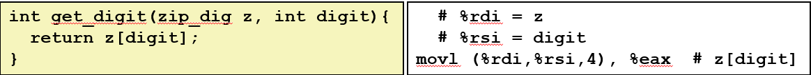

- 寄存器 %rdi 保存数组的起始地址, 寄存器 %rsi 保存数组元素的下标(索引)
- 期望的数据地址：%rdi + 4*%rsi, 内存寻址形式(%rdi,%rsi,4)


这里是拿 %rdi 加上 `%rsi * 4` 得到的结果, 所以这里是进行了缩放。接着给了一个地址, 然后从地址读取值, 并将值复制到 %eax中。这是一个整型数, 所以它会占据寄存器 %eax的低位四个字节。

> 所以你看到这就是缩放寻址的地方。这正是它的设计目标以及为什么他们不嫌麻烦将这种奇特的地址模式添加到x86。因为这是一件很平常的事情。

---

### 数组循环示例

```c
void zincr(zip_dig z) {
    size_t i;
    for (i = 0; i < ZLEN; i++)
        z[i] ++;
}
```
```s
  # %rdi = z
  movl    $0, %eax          #   i = 0
  jmp     .L3               #   goto middle
.L4:                        # loop:
  addl    $1, (%rdi,%rax,4) #   z[i]++
  addq    $1, %rax          #   i++
.L3:                        # middle
  cmpq    $4, %rax          #   i:4
  jbe     .L4               #   if <=, goto loop
  rep; ret
```

首先可以看到它跳转到业务中间, 初始部分将跳转到(给元素加一的)任务 。

使用%rax来保存i, 并增加它的值, 且在不同的地方比较它的值。

它选取第i个元素, 其中i存放在%rax里, 进行四倍缩放。将它加到数组的基地址上, 就得到了一个地址 。

`addl`的第二个操作数即目的地址是内存引用。而 `addl` 首先从内存中读取原始值, 进行加法运算, 然后将结果放回内存中。

因此, 这 `addl` 恰好是对数组中存储的数据执行自增运算。


> C语言真的是那些他们生命的绝大部分时间编写汇编代码的人在想："我如何让它看起来像一种高级的语言, 但又在一种编程语言里保持所有的灵活性, 以及我学会的在汇编代码里玩的所有技巧。"
> 
> 因为它起初是为了实现一个操作系统而设计的, 即UNIX操作系统。历史上, 操作系统直接用汇编代码写的。
> 
> 而Kernighan、Dennis Ritchie等这些人意识到做到这的方法是在一种编程语言里加入指针运算。
> 
> 你会在C语言里, 看到指令、机器代码和构造之间相当密切的关系。++ 和 += 运算符你会看作是汇编代码中的一种变体。

---

## 理解指针和数组 

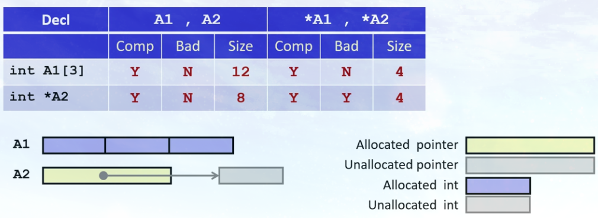

看到左边的声明, 对其中每一个东西(A1, A2), 需要知道的是：
- `Comp`: 它是否能通过编译, 在C中是不是合法语句。
- `Bad`: 有没有可能是空指针引用(当没有为它分配空间, 没有初始化使其指向有效的内存)
- `Size`: 对其使用sizeof运算符, 得到的大小。


用这个例子的部分原因是要理解数组和指针之间的区别。而主要原因是: 

- 当声明一个数组时, 既在分配空间, 正在为它分配某个位置的空间。同时也正在创建一个允许在指针运算使用的数组名称。

- 当声明一个指针时, 所分配的只是指针本身的空间, 而没有给它所指向的任何东西(分配空间)。


> 如果说 `*A1` 或者 `*A2` 那些都会通过编译。他们其中任何一个可能会让你一个间接引用空指针吗？
> 
> 如果尝试间接引用尚未初始化的指针, 它不指向任何东西 。这个可能会给你一个空指针错误。而这个就没问题。

A1是一个包含3个整数的数组。当声明A1时, 程序也在分配12个字节的存储空间来容纳数组。

A2是一个指针, 它的大小是8个字节。它不指向任何东西 。如果试图说*A2时, 可能有一个空指针间接引用。

> **如果你发现这令人困惑的话, 这表明你真的真的真的需要了解指针是什么以及数组是什么**。还有它们是怎么相同以及怎么不同。因为它是C语言编程的核心部分, 如果你还没有透彻掌握的话, 就会导致无休止的困惑。

---
这里所有的声明都涉及指针和数组的某种组合。
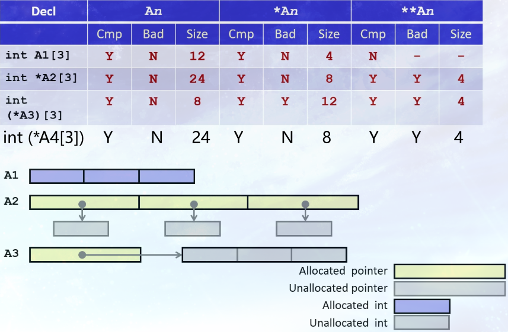

---
### `int A1[3]`

`A1` 是数组名, 代表数组的首地址。在大多数情况下, A1 被用作一个指向 A1[0] 的指针, 其值等于数组的起始内存地址。

`*A1` 是对 A1 所指向的地址进行解引用。因为 A1 被自动转换为指向第一个元素的指针, *A1 实际上就是数组的第一个元素, 即 A1[0]。

**引用的 `*A` 的数据类型是int。`**A1`表示间接引用一个整数, 这是非法的, 甚至不会通过编译。**

---

### `int (*A3)[3]`

> 这是Kernighan & Ritchie书里非常棒的一节, 我非常鼓励你去看看。这一章节是关于如何读C语言里的指针和声明。而基本规则是从内侧开始, 然后向外读。

首先来解析这个声明本身。`int (*A3)[3]` 声明了一个指针, 这个指针指向一个包含 3 个整数的数组。**A3 是一个指向整个数组的指针。**

- `()` 的优先级高于 `[]`。因此, `*A3` 被优先结合, 表示 `A3` 是一个指针。
- `[3]` 表示这个指针所指向的对象是一个数组, 该数组有 3 个元素。
- `int` 表示这个数组中元素的类型是 `int`。


`A3` 是一个指向整个数组的指针, 本身的大小是8。

`*A3` 是对 `A3` 所指向的地址进行解引用, 所以类型是 `int[3]`, 大小是12。`*A3`可以被理解为数组 `int[3]` 的数组名

`**A3` 是对数组的第一个元素地址进行解引用。结果就是数组的第一个元素, `int` 类型的值。

`*A3` 和 `**A3` 可能会导致空指针间接引用, 因为当声明A3时, 仅仅为该指针分配足够的存储空间, 没有初始化A3, 让它真正指向一个数组。所以它可能是一个空指针, 尽管它可能是任意垃圾值。它真的指向一个包含三个整数的数组的可能性极小。

---

### `int (*A4[3])`

`int (*A4[3])`和`int *A2[3]` 是一样的, 区别只是最外层的括号。

`A4` 是个三元素数组, 元素的类型是"指向一个int的指针(int *)", 每个指针8字节, 总大小是24字节。

`*A4` 是对 `A4` 所指向的地址进行解引用, `A4` 是数组名, 指向的地址是第一个元素的地址, 所以对其解引用得到的类型是 `int *`, 大小是8。

`**A4` 对 `*A4` 再做一次间接引用, 会得到一个 `int`, 它的大小是4 。

`*A4` 不会得到空指针或坏指针来。`A4` 是个三元素数组, 会被分配空间。`**A4`可能是一个空指针。因为还没有将数组初始化为任何东西。

---

已经声明这是一个由三个指针组成的数组。且在一台指针大小是八个字节的机器上编译。因此编译器知道是24字节。
 
在代码里声明一个数组时, 比如 `int A[10]`, 编译器在编译时就知道这个数组的大小是10个整数。

但当程序运行起来去访问 `A[11]` 时, 机器并不知道越界了。它只会简单地根据内存地址去读取数据, 而不会报错或停止。

---

> **我认为空方括号只是指针的另一个名称**。通常它只是作为参数, 给数组加上一些限制。当你在C中使用空括号表示法时, **这相当于做一个指针声明, 你没有为其分配任何空间。**
> 
> 但当你声明一个数组时, 并且你给出一个数字即数组的大小, 它确实分配了那些内存。

---

## 嵌套数组
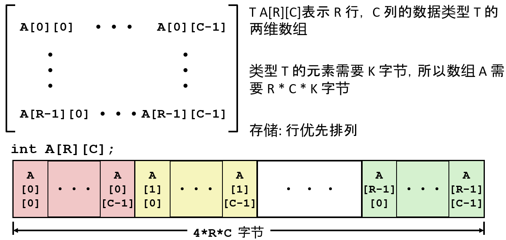

### 行优先排列
声明 `int (A[3])[5]` 表示A是个三元素数组。每个元素**都是一个包含五个整数的数组**。

A是包含R个元素的数组, 每个都是包含C个整数的数组。在遍历这些元素时, 会到第一行, 然后是第二行、第三行, 所以这就是为什么逻辑上这些元素这么排列。实际上直接来自这个声明表示法。
```c
#define PCOUNT 4
zip_dig pgh[PCOUNT] = {
  {1, 5, 2, 0, 6},
  {1, 5, 2, 1, 3 },
  {1, 5, 2, 1, 7 },
  {1, 5, 2, 2, 1 }
};
```
- `zip_dig pgh[4]` 等价于 `int pgh[4][5]`
- 变量 pgh 是一个有4元素的数组, 占用连续内存
- 每个元素是一个有5个整数的数组, 占用连续内存

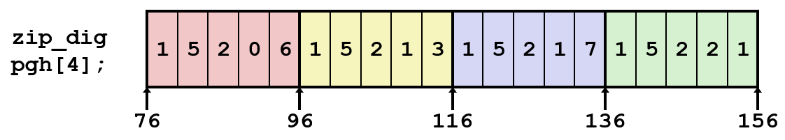

---

### 行访问

`A[i]` 表示一个"有 C 个元素的数组", 每个 T 元素 K 个字节, 起始地址就是 `A +  i * (C * K)`

`pgh[index]` 表示一个"有 5 个整数的数组", 那么起始地址就是 `pgh + index * 20`

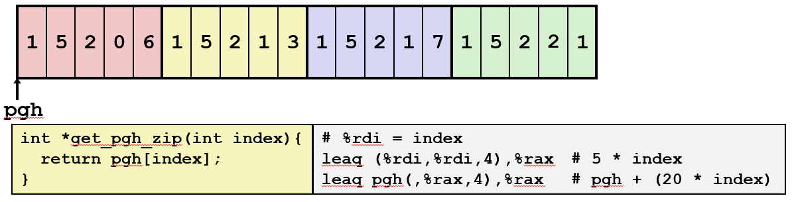

`leaq (%rdi, %rdi, 4), %rax` 表示计算 `(index + 4 * index)` 后, 存入`rax`

`leaq pgh(, %rax, 4)` 表示 `rax * 4 + pgh`, 也就是: `(index + 4 * index) * 4 + pgh`。

---

### 元素访问

`A[i][j]` 是类型为 T 的元素, 需要 K 字节。
起始地址: 第 i 个数组的起始地址 + 该数组的第 j 个元素 = `A` + `i * (C * K)` + `j * K` = `A + (i * C +  j)* K`


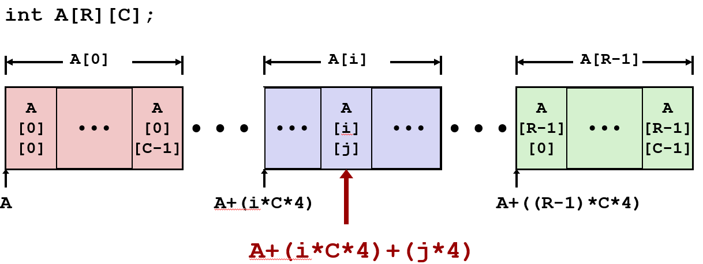

---

## 多级数组

变量 `univ` 表示有3个元素的数组, 每一个元素是一个指针(8 字节), 每个指针指向整数数组。
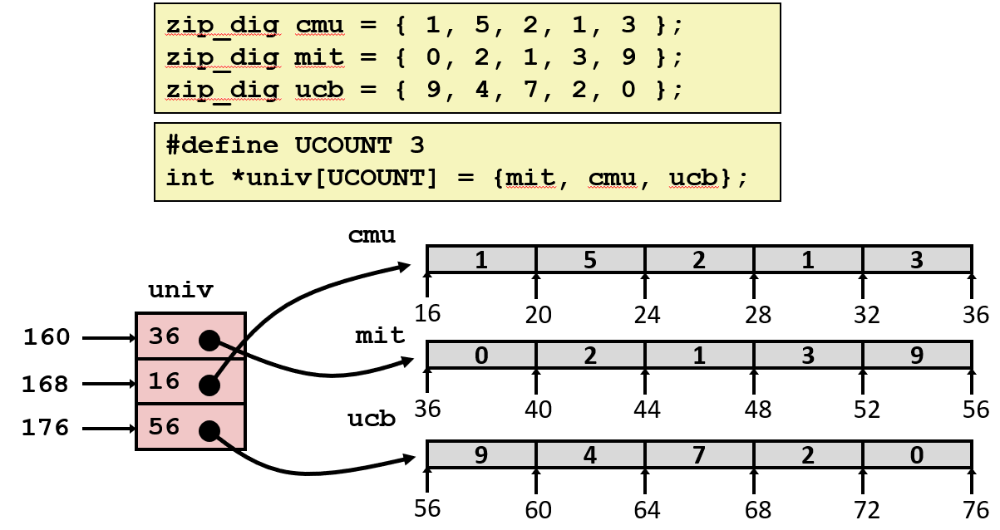

通常在编译的代码中, k的值是一种常数。如果它是一个已经声明了固定大小的数组, 那么C的值也将是一个常数。

将基本上采用此值并使用内存引用、移位和lea指令等的某种组合来实现此计算, 然后进行间接引用

---

### 访问数组元素
- 首先要间接引用来获得一个指向数组开头的指针
- 再从这个指针偏移访问得到元素的值

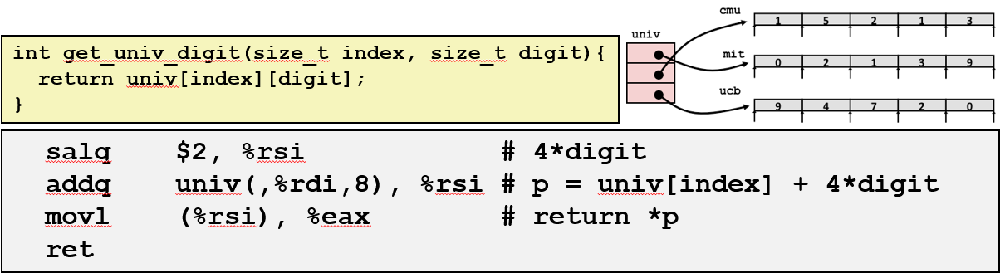

- 第一行: 左移 `%rsi` 两位, 相当于`digit * 4` 。因为它已经准备好接受digit这个参数并适当地缩放它。
- 第二行: 从数组univ得到的行数组的指针`univ + index * 8` + `%rsi`。

> 这个指令实际上是一个内存引用。引用这个叫做univ的三元素数组。它从内存读取, 并通过缩放直接在这里计算数组索引。然后得到一个指针。再加上缩放了的digit。

---

## 嵌套与多级
左边是嵌套数组的形式, 右边是多级数组的形式
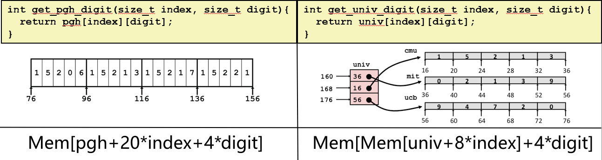

**嵌套数组中**, 所有这些地址计算都一次性完成, **只有单次的内存引用**。

- 首先每行20个字节, 所以`index * 20`表示拿到这个数组。
- 然后 `+ digit * 4`表示该数组中的一个特定元素。

**在多级数组中**, 必须经历**两次内存引用**。
- 首先必须根据索引获取这里相应的元素, 但那现在还只是一个指针。
- 然后向该指针添加一个偏移量以获取此数组中的相应元素, 再从中读取元素。

> 这有点让人好奇, 因为如果你看看C代码, 它看起来是一样的。但底层的数据类型是不同的, 因此引用也不同。

---

## N * N 矩阵
其它一些变体都脱胎自刚才描述的一般原则。下面引入一个16x16的整型数组。
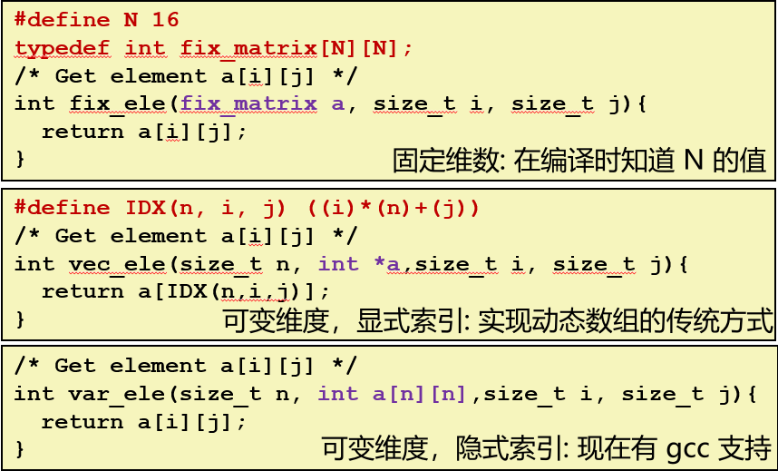

过去在C里面, 如果想要玩多维数组的话, 而这个数组的大小在编译时还没确定下来时, 基本上必须实现一个前面所展示的一个地址计算版本: 即"行数 * 列数 + j"。

> 所以这是一种经典的C写法, 我在这里把它写成宏, 但你可以看到, 它只是在这里直接进行行优先缩放, 是地址运算。

而现在, 自从在1999年引入的, 被称为C99的C编译器开始。可以将数组作为一个参数传递, 其中数组中的元素个数也是一个传递给函数的参数。

可以声明一个包含n个元素的数组, 只要在执行那个数组声明之前已经计算了n就行。然后编译器就会做该做的事情, 即给适当数量的元素分配适当的空间。

### 16 * 16
假设要得到 `a[i][j]` 这个元素: 首先计算 `i * 16 * 4`, 再加到起始地址 `%rdi`上, 接着将 `%rdx(j) * 4`, 并将其加到此数组(前面计算的结果)上, 然后再做一个内存引用。

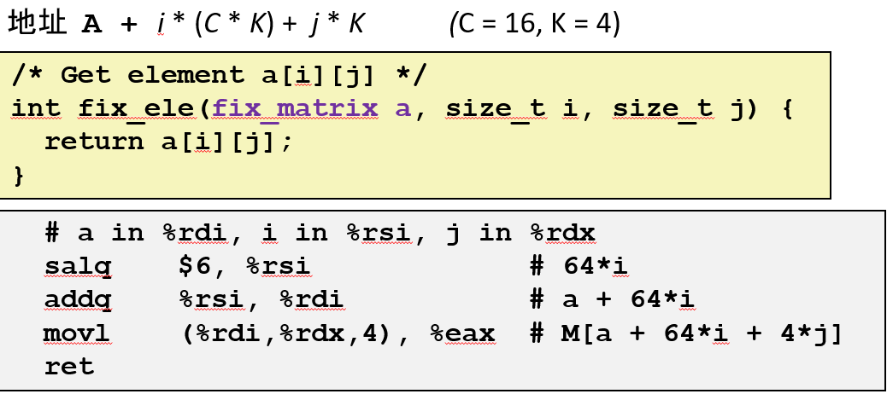

---
### n * n

其中 n 是一个传递给函数的参数。因此在编译时不知道要使用多大的缩放因子, 所以不得不使用一个乘法指令。就性能而言, 这是一种开销相对大的指令。

得到缩放因子后, 接下来只是 `n * i`。然后使用 lea, 和之前的缩放记法的各种组合, 来计算数组的合适偏移量以进行内存引用。

在这个例子里, 可以通过移位指令做到这一点。

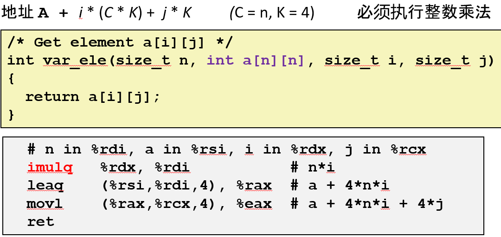

> 如果你想折磨自己, 我过去讲的一个例子, 用相同思路讨论了三重嵌套的可能性和它的间接引用。

---

## 结构体表示

结构实际上非常简单。基本上要做的是给结构的每一个字段(field)分配足够的空间。

- **结构体表示为内存块**: 足够大可以容纳所有域
- **各个域根据声明的顺序排列**: 即使另一个排列可以产生更紧凑的表示
- **编译器确定结构体的总大小和各个域的位置**: 机器级程序不了解源代码中的结构

对结构本身的内存引用将是结构的起始地址, 然后使用适当的偏移来得到不同的字段。
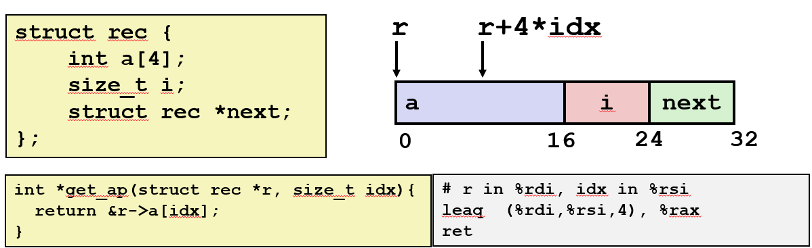
要得到此结构中数组 a 的相应元素: `idx * 4 + 基地址` 以获得相应的元素。

---
### 示例

> 在这么一个小小的函数里, 我对这个结构进行了三次引用。

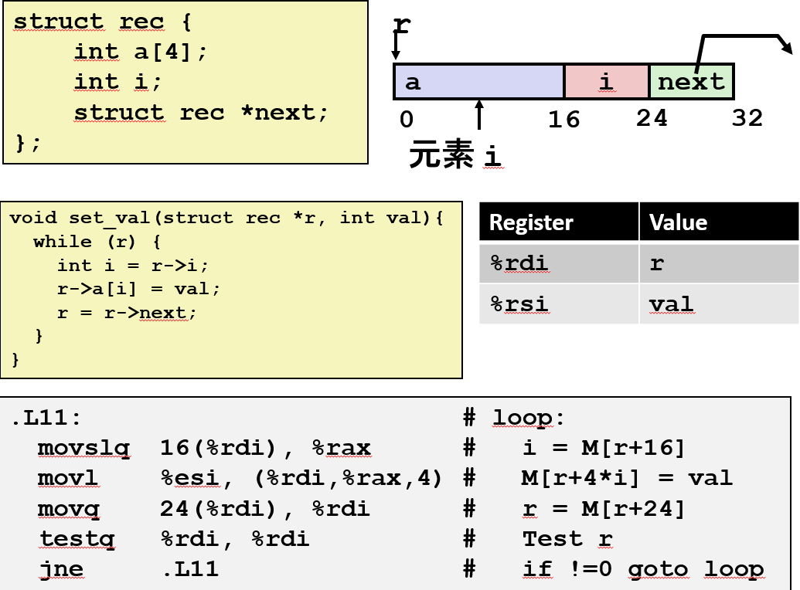

- 拿 `%rdi + 16` 来获取 i 的内存地址。
- 使用 `%rax(刚刚计算的 i 的值) * 4`。然后使用 `%rdi`(恰好也是 a 的起始地址)进行存储。
> 你看它实际上使用 movq 指令, 因为 i 本身就是一个整数。但我将把它用作数组索引, 这种情况下我必须缩放它。我必须使用 8 字节的数进行适当的算术运算。所以这实际上拿到了 4 字节的值并在其上做了一个符号扩展。
- 下一部分加上 24 字节的偏移得到 next 的位置。
- 从该位置读取值并将其存储在 %rdi 即 r 中。


> 所以你看到对结构的三次引用是使用这里的三个指令实现的。所以这里的代码和 x86 指令之间有非常直接的对应。
> 和一部分 x86 指令有直接对应是因为这种东西在程序中是如此常见, 他们让指令非常直接地对应到这些操作上。
> 而现在你应该明白为什么有各种绚酷的指令于这些地址引用。

---
## 结构与对齐

如果有一个 k 字节的数据类型, 机器通常更喜欢起始的地址是 k 的倍数。所以这引入了一个我们称之为对齐的属性。

当一个结构被分配内存空间时, 编译器实际上会在分配空间时, 在数据结构中**插入一些空白的不被使用的字节来保持以下规则**:
- **结构体的每个成员都必须在其自身大小的倍数的地址上开始。**
- **整个结构体的大小必须是其最大成员的对齐边界的倍数。**

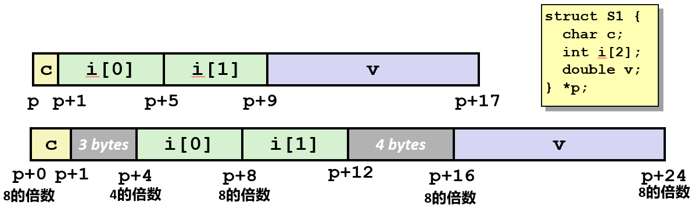

---
### 对齐的具体情况 (x86-64)

> 我们主要关注的是 1, 2, 4, 8 字节大小的数据类型, 还有一些 16 字节大小的数据类型, 但我们不会关注那些。

通常可以通过有多少个零来判断地址的对齐方式, 如果它是 2 的幂对齐的话, 通过在该地址的位级表示的末尾有多少个零来判断。

|1个字节|char|地址无限制|
|-|-|-|
|2个字节|short|地址位的最低位必须是0|
|4个字节|int, float|地址位的最低两位必须是00|
|8个字节|double, long, char *|地址位的最低三位必须是000|
|16个字节|long double (Linux 上的 GCC)|地址位的最低四位必须是0|

---
### 结构体数组
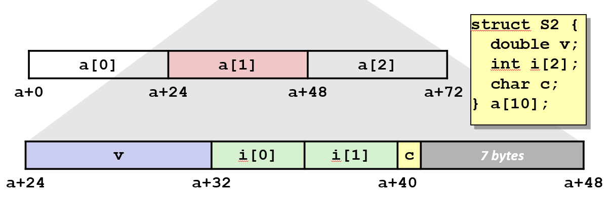

### 访问数组元素
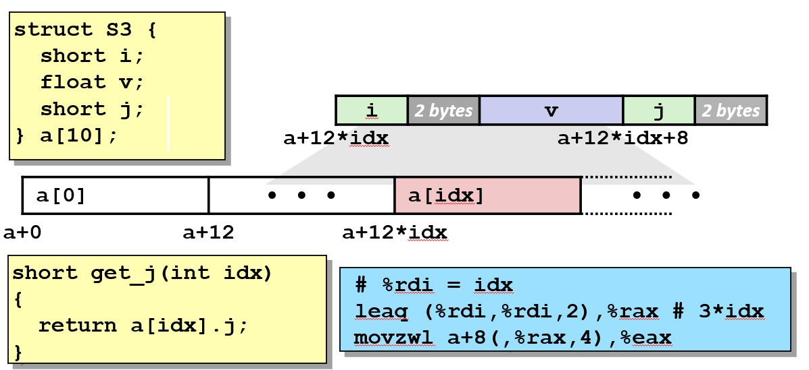

### 节省空间
可不可以让编译器不要做对齐。更好的方法是声明你的字段, 以最小化浪费空间量的方式。即将大型数据类型放在前面。

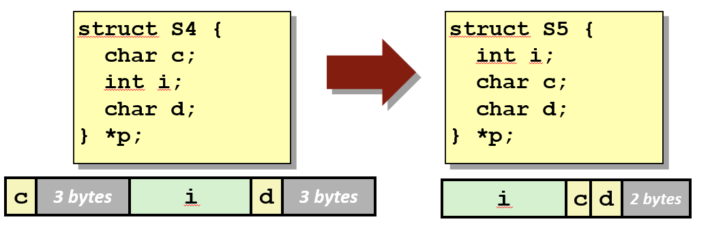

但编译器不会自动这么做。必须手动进行顺序的编排。

> 记住, 我从来没有从内存中读取整个数组。因此, 对齐仅指最原始的数据类型而言, 不包括聚合数据类型。如果这令人困惑, 课本已经非常仔细地介绍这点了。

### 对齐原因

内存对齐的**根本原因在于硬件的设计: CPU 访问内存的方式决定了对齐的必要性**。

内存条上的存储单元是`bank` 芯片。一个内存条上通常有多个 bank 芯片, 每个芯片负责存储一个字节。

为了CPU能够一次性读写更多的数据, 这些 `bank` 芯片并行工作。

为了实现并行读写, 硬件将数据分散在多个 bank 芯片上, 并要求一次传输的数据块必须从一个**对齐的地址**开始。


**现代 CPU 与内存之间的数据总线宽度**: 
- 在 32 位系统上, 数据总线宽度通常是 32 位, 一个字是 4 个字节；
- 在 64 位系统上, 数据总线宽度通常是 64 位, 一个字是 8 个字节。

这就意味着, CPU 在一个总线周期内可以从内存中读取或写入 4 或 8 个字节的数据。


对齐的主要原因体现在以下两个方面：

#### 一、提高访问效率


想象一下, 有一个 8 个字节的 `double` 变量。

- **如果它在对齐的地址上**(例如地址 0 或 8), CPU 只需要一次内存读取操作, 就能把它完整地取到寄存器中。

- **如果它在未对齐的地址上**(例如地址 4), 这个变量就会跨越两个“字”的边界。CPU 无法一次性把它读完, 而是需要进行**两次内存读取操作**, 然后再将这两个部分组合起来。

这种额外的操作会大大降低程序的性能。这就是为什么编译器会自动插入填充字节, 来确保每个变量都从对齐的地址开始。

#### 二、避免硬件错误
在 x86 机器中, 如果有未对齐的数据, 机器会正常执行指令的, 只是有可能会更慢一点。在其他一些机器上, 如果尝试进行访问未对齐的数据, 实际上这会导致内存错误。

在一些处理器架构上(比如早期的 RISC 架构), 未对齐的内存访问甚至会导致硬件异常或程序崩溃。这不像 x86 处理器, 在未对齐访问时只会降低性能。

例如, 在某些 ARM 处理器上, 如果程序试图从一个非 4 字节对齐的地址读取一个 int, CPU 会直接触发一个内存对齐错误(alignment fault), 导致程序终止。因此, 内存对齐不仅仅是为了性能, 更是为了保证程序在这些平台上能够正确运行。

---

## 浮点数

### 背景
#### x87 FP
浮点数在 x86 里有复杂的历史。在回到很古老的时候, 那时 8086 处理器上有一块称为 8087 的芯片。而它是这个类型芯片的第一块。

事实上, 它是与 IEEE 浮点标准本身共同开发的, 但它的编程模型非常糟糕和丑陋。

> 在这本书的旧版本中, 在第一版里有, 第二版里是放在网页旁注(webaside)里, 而现在它已被彻底清除, 因为它太糟糕了。

#### SSE FP
由 Shark 机器支持, 矢量指令的特殊使用情况。

但最近在 x86 的世界里, 他们意识到要支持视频以及人们用电脑真正要做的所有事情, 他们在数值处理方面需要更多的马力。

他们实现了一类名为 SSE 的指令。它替 SIMD 执行 SIMD 要执行的部分(指令)。
#### AVX FP
最新版本, 类似于 SSE, 在 x86 的最近的版本里, 已经被提炼成称为 AVX 的东西。

---
### 用 SSE3 编程

但是鲨鱼机器(CMU 的课程实验机器)支持这个所谓的 SSE 版本。

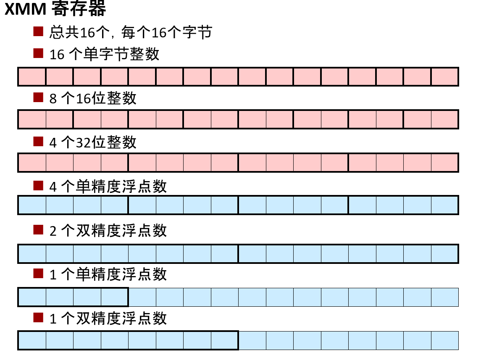

特别是鲨鱼机器支持所谓的 **SSE 版本 3**有 16 个特殊的寄存器, 完全不同于我们之前讨论过的寄存器。

每个寄存器都有 16 个字节。然后就是可以对它们进行操作、并以不同方式对待它们的指令。

其中一个指令是这样的, 将这样一个寄存器视为 16 个字符, 或者作为 8 个短整型数据或 4 个整数, 并且还支持双精度浮点运算。

> 有人曾经作出过很好的评论, 我可以对所有这些进行子集化, 然后实现浮点数运算, 直接使用这个 SSE 的东西, 跳过旧的 x87 东西。

---
### 标量指令和 SIMD 指令
例如 `addss` 指令。这条指令是指对单精度标量做加法运算。
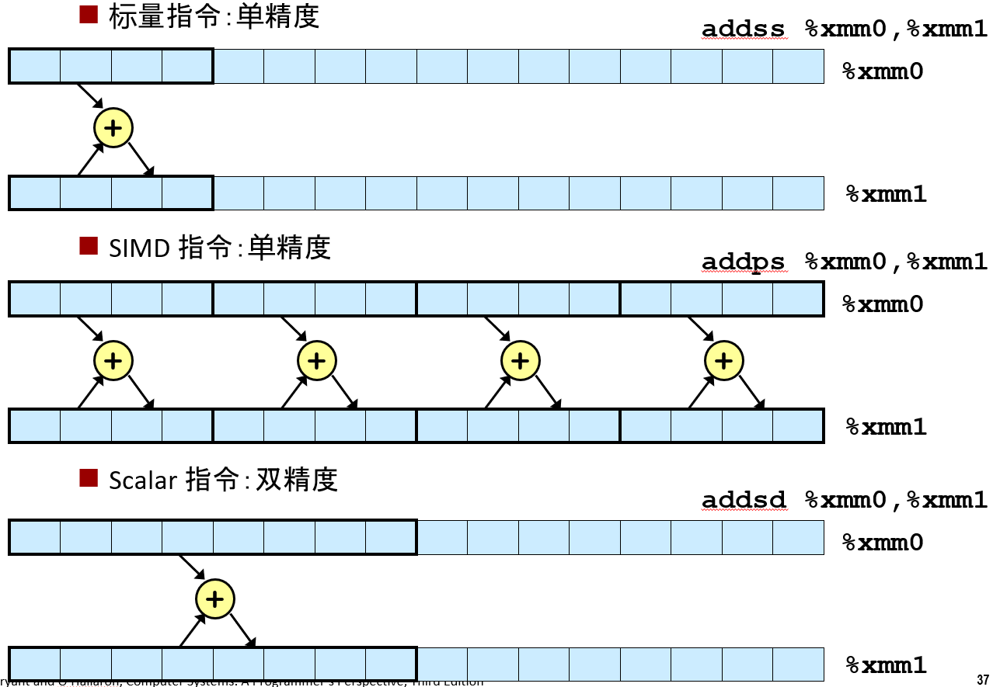


它看起来有点像你见过的 addq 指令。它将源的值加到目的的值上。有方法可以同时进行加法运算, 即使用他们所谓的 SIMD 指令执行。

这是 single instruction multiple data(单指令多数据)的缩写。单个指令 addps, p 是指 pack(一组), 就能同时对四个不同的数进行加法运算。

可以用来操作双精度浮点数, 可以一个一个来, 也可以一组同时来。

> 当我们学代码优化那一章时, 我们会看到这一点, **如果你利用这些指令来写代码, 你可以大大提高计算机的性能**。不过这里只是给你看看浮点数代码的样子。

---
### 基础知识

不需要像 %rdi, %rsi, %rdx 这样去记。这些寄存器是按照 %xmm0, %xmm1命名的, 都非常符合逻辑

基础规则非常简单, 主要是以下3条:

- 浮点数参数传入这些 XMM 寄存器里
- 而返回值是放在 %xmm0 里
- 所有寄存器都是被 "调用者" 来保存的, 没有寄存器是被 "被调用者" 来保存的

对两个浮点数进行加法运算的指令, 和对一个浮点进行加法运算的指令一样, 双精度浮点数据也是如此。

### 内存引用
如果既有指针的运算符, 也有浮点数的运算符。指针将传到常规寄存器 %rdi 中, 而这个双精度浮点数将传入 %xmm0 中:

- 常规寄存器中传递整数(和指针)参数
- XMM 寄存器中传递 FP 值
- 在 XMM 寄存器之间以及内存和 XMM 寄存器间有不同的传送指令进行传送

所以它有点像在处理参数列表时, 是按照特定顺序来的: 

- 如果是整数或指针, 则位于 r 开头的其中一个寄存器
- 如果它是一个浮点数, 它在一个 XMM 寄存器中, 并且可能是交错的

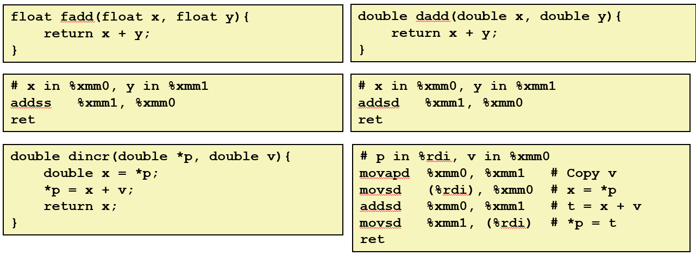

所以这是一段进行这个特定操作的代码, 这段代码有趣是因为它正在做内存引用, 同样, 有指令将从内存中读取并复制到一个 XMM 寄存器中

可以对一个寄存器进行加法运算, 可以从一个 XMM 寄存器复制到另一个 XMM 寄存器里, 还可以存储结果

因此, 除了使用 XMM 寄存器和特殊浮点指令、而不是寄存器和指令, 这段代码看起来很像整数运算

---

### 总结

所以它的基本思想非常简单, 它会变得复杂很多是因为有很多很多的指令

不单单是双精度浮点数, 还有其它各种形式的(比如单精度、标量、矢量等), 都有一个特殊的指令来算包括平方根在内的所有东西

> 浮点比较的操作真的很讨厌, 很乱, 很难理解, 然后你会看到使用常数的各种技巧
> 
> 课本已经包含这些内容了, 我们将不会在课堂里中真正谈论太多