# Machine Level Programming V Advanced Topics

## x86-64 Linux 内存布局

从机器级编程的程序员眼里来说"内存"就是一个很大的字节数组, 虽然它不是真实的实现方式。

它的底层实现，是对一系列不同存储类型的复杂管理，从磁盘存储到固态存储到所谓的DRAM(动态随机存取存储器)

正如所了解的 x86-64 机器的地址在名义上讲有 64 位, 但现在 64 位机器会限制只使用 48 位的地址，也就是 256 TB 内存，一些超级计算机确实有这么大的内存

7 用二进制表示是 3 个 1，然后 11 个 F 就是 44 个 1，加起来就是 47 个 1，这就是为什么 00007FFFFFFFFFFF 这个数字会出现在这里

> 这里我们以谷歌公司为例，整个谷歌的存储是以 EB 为单位计量的，每天都会产生好几 PB 的数据
> 我不知道具体是多少因为这是商业机密，但是至少会有 10 PB 或者更多的数据注入到他们的系统，这些数字很大，但还没有超出我们讨论的范畴

据估算，如果把全世界一年内所有人拍摄的所有视频加起来大概是几个 ZB
|B|KB|MB|GB|TB|PB|EB|ZB|YB|
|-|-|-|-|-|-|-|-|-|
|Byte |Kilobyte |Megabyte |Gigabyte |Terabyte |Petabyte |Exabyte |Zettabyte |Yottabyte|
|字节 |千字节 |兆字节 |千兆字节 |太字节 |拍字节 |艾字节 |泽字节 |尧字节|


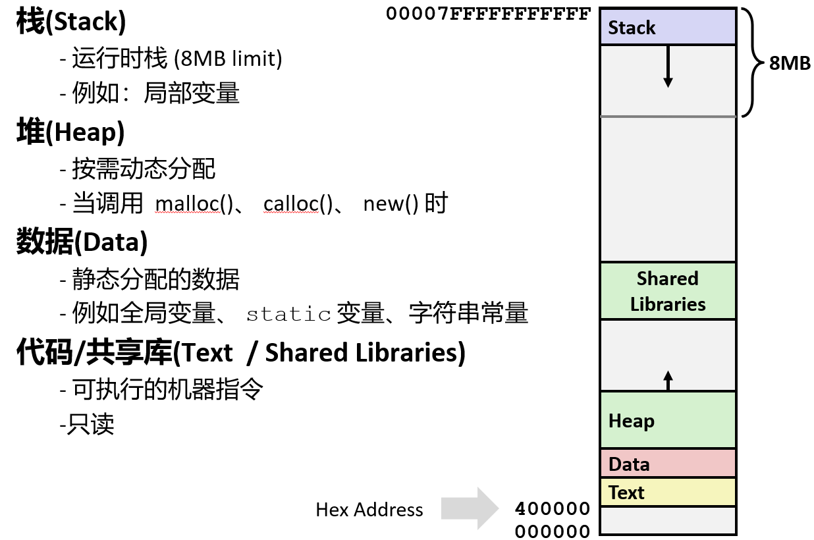

> 这幅图其实并不是按照比例绘制的，在这幅图中栈位于最顶部，我们知道栈是向着低地址增长的，因此我们把栈倒着画，即便这很难理解，所以在这张图中栈从最上方开始并且向下增长


下面的命令显示**栈**被限制在 `8192 KB(8 MB)`，这意味着如果试图使用栈指针去访问一个超过这个 `8 MB` 范围的地址，将会产生一个段错误

::: details 假设在 `macOS` 的终端里运行 `limit` 命令
```bash
cputime      unlimited
filesize     unlimited
datasize     unlimited
stacksize    8192 kbytes
coredumpsize 0 bytes
memoryuse    unlimited
vmemoryuse   unlimited
descriptors  1024
```
:::

::: details 假设在 `Linux` 的终端里运行 `ulimit -a` 命令
```bash
core file size          (blocks, -c) 0
data seg size           (kbytes, -d) unlimited
scheduling priority             (-e) 0
file size               (blocks, -f) unlimited
pending signals                 (-i) 63633
max locked memory       (kbytes, -l) 65536
max memory size         (kbytes, -m) unlimited
open files                      (-n) 1024
pipe size            (512 bytes, -p) 8
POSIX message queues     (bytes, -q) 819200
real-time priority              (-r) 0
stack size              (kbytes, -s) 8192
cpu time               (seconds, -t) unlimited
max user processes              (-u) 63633
virtual memory          (kbytes, -v) unlimited
file locks                      (-x) unlimited
```
:::

**文本段**是存放的是代码的地方，它来自于可执行文件，用于存放可执行程序

> 我们会在后面学习链接的时候更加详细地介绍这一部分, 我不知道为什么，但是在很多机器中就是这么叫的


**数据区**有一个数据段是在数据区中用来存放程序开始时分配的数据的, 声明的全局变量都在这个数据段中

**堆**用来存放通过 malloc 或相关的函数申请的变量, 这些变量在程序运行的时候会动态变化

它从一个很小的分配开始，如果每次都通过 malloc 申请很小的空间但又没有释放的话, 所占用的内存就会越来越大, 它将会向着高地址不断增加

还有一类代码存储在**共享库**中，比如 `printf` 和 `malloc` 等库函数。这些库代码最初存放在磁盘上，直到程序开始执行时才被**动态加载**到内存中。

**总体上来说应用程序在运行时有时会分配低地址的空间, 有时又会分配高地址的空间**

---

下面代码分配了一些相当大的数组: big_array, huge_array。并**发现如果尝试分配更大的数组，程序就将无法运行**


通过它们被分配的地方就可以看出下面这些声明的不同。运行这个程序来观察它们的地址。

通过 GDB 调试工具，看到 7 和几个 f 就知道这是栈的地址, 看到很多个 0 和几个 4 就知道这是代码运行的地方
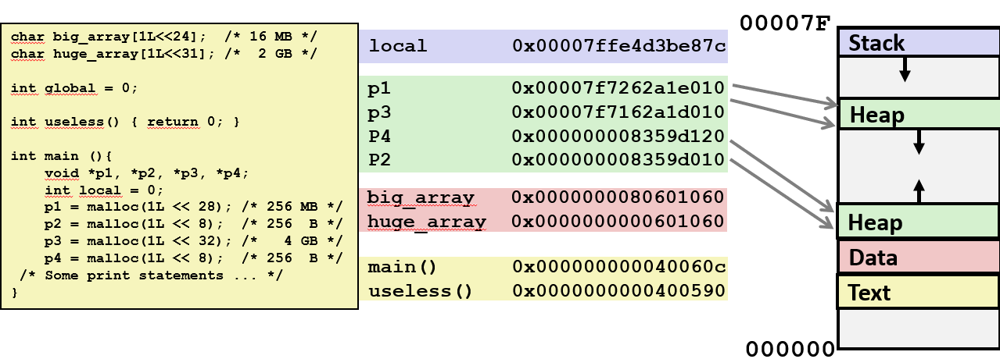
- local 变量被分配在了栈的范围内。可以看到它的地址有一个 7，两个 f 和其他的东西

- main 函数和 useless 的函数被分配在了底部的黄色区域，也就是文本段

- 预定义的数组(不是通过 malloc 分配的数组), 作为程序本身的一部分，被分配在了数据段中, 因为它是一个很大的数组，所以会得到很大的地址

- 出于某些原因，小的数组恰巧被分配在了粉色区域的稍微高出一点的地方，那些巨大的数组被分配在了接近栈的限制的地方
> 我也不知道为什么，我只是观察到大的东西被放在这儿，小的东西被放在那儿，操作系统可能会对它们使用不同的管理策略

如果试着去引用中间的这篇空白区域将会产生一个段错误，根据它的位属性，它是一块有效的地址，但是它还没有通过内存分配程序分配

所以无论何时，合理的地址都是低地址的这一部分和高地址的这一部分，中间的这一部分则属于"无人区"

如果持续通过 malloc 分配内存, 两边的地址将会朝着中间靠近。原则上来说，如果有很多的内存请求，上下的这两块将会相遇并且 malloc 将会返回 0

---

## 缓冲区溢出
回想在越界试验的程序中专门写了一个超出范围的值: 如果 i 大于 1, 就会污染 d 的值。如果继续增大直到开始污染内存

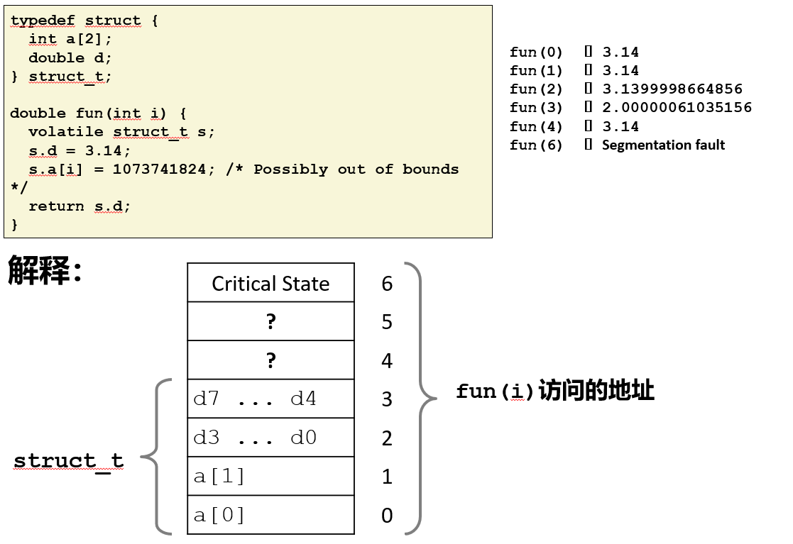

如果程序因外部输入而访问或写入超出其分配内存空间的数据，就会产生安全问题，这通常被称为**缓冲区溢出**，有时也特指**栈溢出**。

在未正确编写的 C 程序中，此类内存越界访问很容易发生。最常见的形式: 字符串输入时并没有检查长度，特别是栈上的有界字符数组

**因此当编写代码时应该考虑：能否信任这个值**

---

### 经典案例
在存储字符串时，由于无法提前知道字符串的大小, 将会出现非常多有关缓冲区溢出的问题。对于已经分配的缓冲区来说，这个字符串可能会过大。

> 引发这个问题的罪魁祸首之一就是那些存储字符串但却不检查边界情况的库函数，尤其是 gets 函数
```c
/* Get string from stdin */
char *gets(char *dest) {
    int c = getchar();
    char *p = dest;
    while (c != EOF && c != '\n') {
        *p++ = c;
        c = getchar();
    }
    *p = '\0';
    return dest;
}
```

这个函数中缺乏这样一种参数，用来告诉这个函数什么时候该停止，什么时候会到达它的极限

当编译代码时，将会出现一个警告: **这是一个不安全的函数并且不应该使用它**

> 因为 `gets` 函数编写于上世纪 70 年代, 当时早期的 UNIX 发行版刚刚推出, 人们还不用担心安全问题

其他库函数也有类似问题
- strcpy, strcat：它的作用是将源地址的字符串拷贝到目的地址, 但没有办法知道目标地址的缓冲区有多大
- scanf, fscanf, sscanf: 当使用 %s 转换符时, 它会读取一个字符串并且将它存储在某个地方, 既不知道字符串有多长, 也不知道目标地址的缓冲区有多大

---

## 存在安全隐患的缓冲区代码
指令 `sub $0x18,%rsp` 表明，程序在栈上分配了 0x18字节（24字节）的缓冲区。

这个 24 字节的缓冲区地址被传递给 gets 函数。这说明，即使源代码最初只声明了一个 4 字节的缓冲区，实际运行时 gets 函数使用的缓冲区大小却是 24 字节。

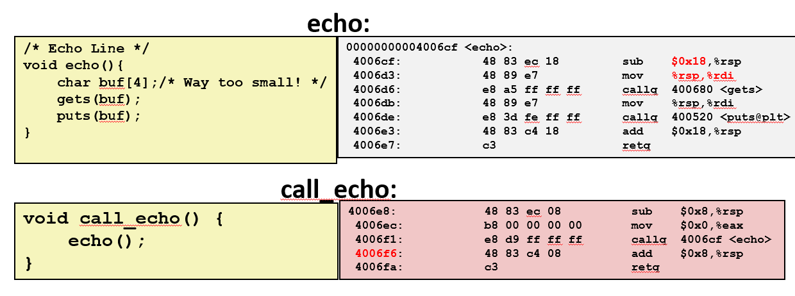

---

在调用 `gets` 之前，可以看到

- 程序在栈上分配了 24 字节的缓冲区, 声明了一个 4 字节的缓冲区，还有 20 个字节没有使用。

- 返回到 call_echo 函数的地址被存储在栈上，当 echo 函数运行的时，将会在栈中找到这个返回地址的指针

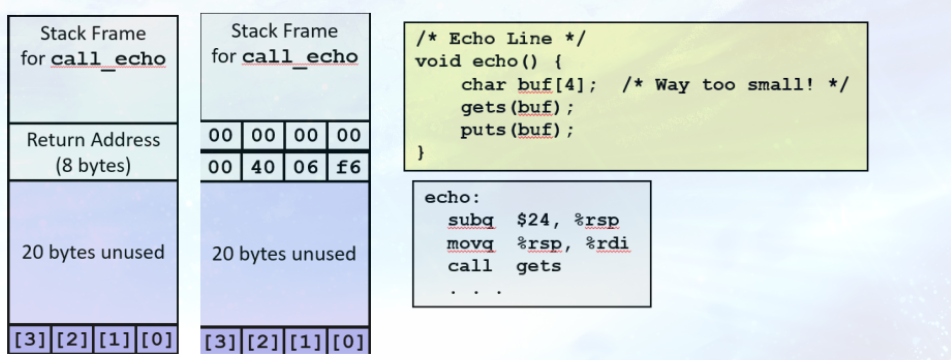

---
### 缓冲区溢出的栈示例

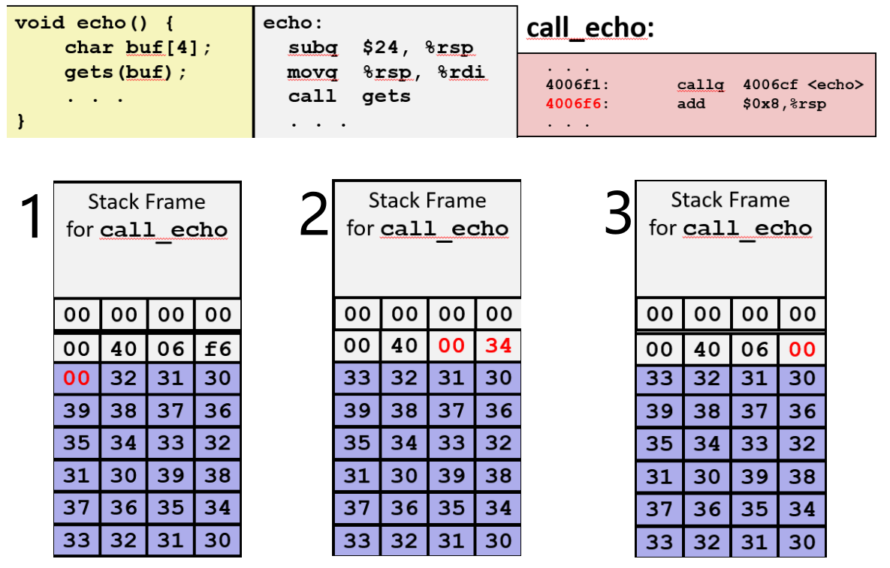

#### 情况一
因为有这块 20 个字符的额外空间，所以输入 23 个字符再加上以 00 结束的空字符用光了整个缓冲区，程序可以正常运行。

#### 情况二

一旦输入超过 23 个字符，再加上空字符，便开始慢慢破坏返回地址的字节表示。

这个例子中将不会返回 call_echo 调用 echo 的地方，而是其它 **"可能不是一个合法的地址"** 或 **"不是想要的结果"**

#### 情况三

输入 24 个字符的字符串，再加上空字符，已经开始破坏返回地址的字节表示，覆盖了返回地址低位的一个字节，程序应该已经崩溃了。

它本来应该返回到 0x4006f6，但是它实际上返回到了 0x400600，**因此程序跳转到了一个奇怪的函数，它会使程序错误地运行却不一定会使程序崩溃**

**这是导致经常会遇到有些 bug 使程序错误地运行，但却不知道的原因之一**

---
## 代码注入攻击

> 如果别人通过这些 bug 来控制你的心脏起搏器或其他东西，这显然很危险, 但是如果仅仅是家庭作业的话，这也没什么大不了
> 在过去的 30 年间，攻击已经变成了一种很正常的行为, 这给了那些黑客或者攻击者将代码注入到你的代码并执行的机会

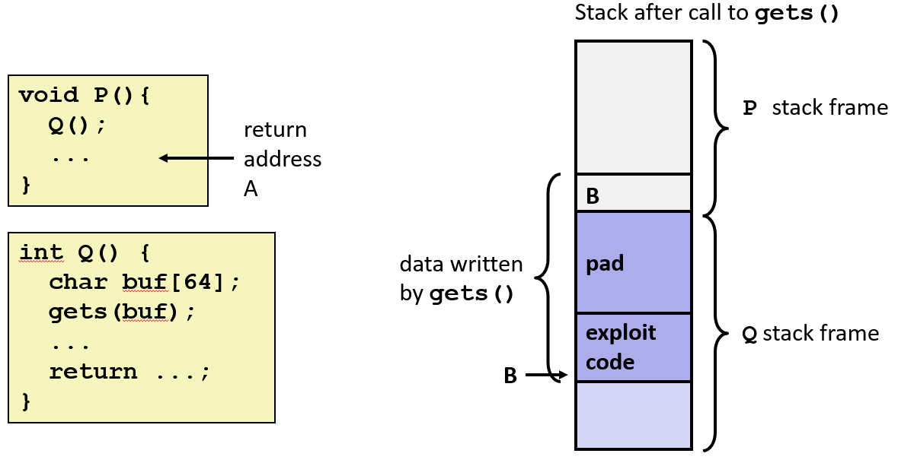

### 攻击原理

攻击者通过向程序输入过长的数据，覆盖掉栈上分配给缓冲区的内存，从而写入额外的、恶意的代码。这种攻击被称为代码注入。

### 攻击步骤详解

#### 注入恶意代码

首先，攻击者将一段**可执行代码**（例如，一个打开 shell 的程序）编译成字节形式，并将其作为字符串的一部分。

#### 利用漏洞
攻击者利用像 `gets()` 这样不检查输入长度的函数。他们构造一个特殊的输入字符串，这个字符串包含了：

- **无意义的填充字符**（`pad`）：这些字符用来填满缓冲区。

- **恶意代码**（`exploit code`）：这部分是攻击者真正想执行的代码。

#### 劫持返回地址
攻击的关键在于覆盖栈帧中的**返回地址**。通常，当函数 `Q` 执行完毕后，它会使用保存在栈上的返回地址（`return address A`）来返回到调用它的函数 `P`。

然而，攻击者构造的字符串足够长，它不仅填满了整个缓冲区，还**覆盖了原来的返回地址 A**。

#### 重定向执行流
攻击者用一个新地址 `B` 来替换原来的返回地址。这个地址 `B` 是缓冲区在栈上的起始位置，也恰好是攻击者注入的恶意代码的地址。

#### 结果

当 `Q` 函数执行完毕并尝试返回时，它不再返回到函数 `P`，而是跳转到新地址 `B`，从而开始执行攻击者注入的恶意代码。

---

> Q：当你尝试去替换代码时，如何确定你注入的代码提供了准确的地址
> A: 这正是黑客的厉害之处, 你必须确定它在正确的位置上, 但其实它也是比较简单的一部分, 因为你必须知道或者猜到这样的二进制编码, 比如说上一个例子中我知道缓冲区分配了 24 个字节, 因此只要我保证我的代码加上填充区是 24 个字节, 那么它后面的就是返回地址, 因此这其实很简单
> Q: 但是我不清楚这个程序占用多少内存
> A: 你必须有权限，如果要这样做, 你必须知道那台机器的操作系统, 比如说它是 Linux 系统, 你知道 GCC 会分配多少字节, 不管怎么说你必须知道被注入的那段代码本身的信息来使你完成注入

---

## 基于缓冲区溢出的漏洞利用程序

### 原始互联网蠕虫

有个现在被禁用的早期命令 `finger`，该命令用于向远程机器发送消息，而其背后的 fingerd 服务器使用了 gets() 函数来读取客户端发来的参数：`finger droh@cs.cmu.edu`

- 蠕虫通过发送假参数的方法攻击fingerd服务器：`finger "exploit-code  padding  new-return-address"`
- 利用直接和攻击者相连的 TCP 链接，在受害者机器上执行根用户shell。一旦进到机器上，就会自动扫描并攻击其他联网的机器，实现自我复制和传播。

1988 年，第一个互联网攻击被称为"莫里斯蠕虫", 几小时内侵入了大概6000 台，当时这几乎是整个互联网总数的 10%。(参考 Comm. of the ACM 在1989年6月的文章)

年轻的蠕虫作者被起诉，美国联邦政府在卡内基梅隆大学（CMU）成立了计算机安全应急响应组（CERT），其使命正是处理和防范未来的网络安全事件。

> 有趣的是，我们 CMU 并没有受到攻击, 因为我们已经修复了这个程序所利用的漏洞

---

### 即时通讯战争

> 这儿还有关于两个通讯服务公司之间的例子，它们使用合理的攻击手段攻击对方已经很多年了，幸运的是，如今的攻击不像以前那么容易了, 因此这不再是一个大问题

早在智能手机普及之前，主要通过计算机上的 **即时通讯(Instant Messaging, IM)** 程序来聊天。

在当时，美国在线（AOL）是即时通讯领域的巨头，其 **AIM(AOL Instant Messenger)** 服务占据主导地位。

微软也开发了自己的即时通讯客户端 MSN Messenger，但 MSN Messenger 的代码却直接连接 AOL 的 AIM 服务器，让用户可以通过 MSN 和 AIM 用户聊天。

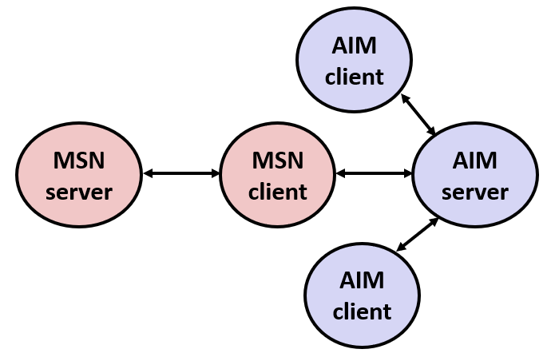


1999 年 8 月，MSN Messenger 客户端突然无法再访问 AIM 服务器。微软和 AOL 之间开始了长达数月的拉锯战。
- AOL 不断更改服务器，以阻止 MSN Messenger 连接。

- 微软则迅速发布更新，修改其客户端代码以绕过 AOL 的封锁。

- 这场"猫鼠游戏"持续了至少 13 个回合，但真正的原因一直不为人所知。

**真正发生的到底是什么**: 
- AOL 在自己的 AIM 客户端中发现了缓冲区溢出的漏洞。AOL 利用这个漏洞，让他们的客户端在连接服务器时，返回一个四字节的特殊“签名”。

- 这个签名实际上就是 AIM 客户端程序中某个特定位置的字节序列。当服务器检测到这个签名，就会识别出“这是我们自己的客户端”，并允许其连接。

- 当微软的 MSN Messenger 客户端试图连接时，由于它没有这个特定的签名，就会被服务器拒绝。

- 当微软通过逆向工程发现了这个签名并试图模仿时，AOL 就会再次利用这个漏洞，简单地改变签名的位置，使得微软的改动失效。

> 这件事被一个自称为 Phil Bucking 的人披露，后来经确定这封邮件是微软内部发出的，你们可以从课本中了解更多有关这件事的细节

::: details 点击查看邮件
```
Date: Wed, 11 Aug 1999 11:30:57 -0700 (PDT) 
From: Phil Bucking <philbucking@yahoo.com> 
Subject: AOL exploiting buffer overrun bug in their own software! 
To: rms@pharlap.com 

Mr. Smith,

I am writing you because I have discovered something that I think you 
might find interesting because you are an Internet security expert with 
experience in this area. I have also tried to contact AOL but received 
no response.

I am a developer who has been working on a revolutionary new instant 
messaging client that should be released later this year.
...
It appears that the AIM client has a buffer overrun bug. By itself 
this might not be the end of the world, as MS surely has had its share. 
But AOL is now *exploiting their own buffer overrun bug* to help in 
its efforts to block MS Instant Messenger.
....
Since you have significant credibility with the press I hope that you
can use this information to help inform people that behind AOL's
friendly exterior they are nefariously compromising peoples' security.

Sincerely,
Phil Bucking 
Founder, Bucking Consulting 
philbucking@yahoo.com
```
:::

---

### 蠕虫和病毒
> 你们应该区别蠕虫和病毒的概念, 虽然人们经常将他们混淆

蠕虫(Worm): 它可以自行运行, 可以将自己的完整版本传播到其它计算机上, 从一个地方繁衍到另外一个地方

病毒(Virus)：它将自己添加到别的程序中并改变这个程序的行为; 不独立运行, 类似于生物学里的病毒，它不能自己存活

两者通常都是为了在计算机之间传播并造成严重破坏而设计的

---
### 避免溢出漏洞
首先就是在编写代码时可以写得更安全, 下面的例子都能免受缓冲区溢出的困扰:

- fgets 有一个参数用来指示程序应该最多读取多少字节，如果输入的字节超过这个数字，它就会将输入的字符串截断

- 类似的，strcpy 也有一个使用限制参数的版本，它被称为 strncpy。

- 在使用 scanf 时要小心 %s，可以在 % 之前加一个数字，这个数字代表了 scanf 所能读取的字符串的最大长度

现在开发人员已经开发出了可以帮助我们追踪这些问题的工具, 因此现在编写代码比以前更加安全了，不过还是要小心。

---
### 随机的栈偏移

栈随机化(ASLR)代表地址空间布局随机化。每次程序运行的时候它的地址都是变化的，所以基本不可能知道代码运行在什么地方

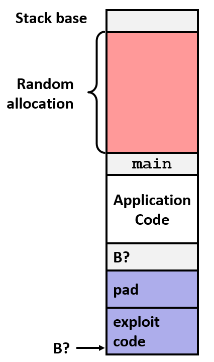

在主程序被调用之前, 将会在栈上分配随机大小的空间。当程序运行时，将移动整个程序使用的栈空间地址，局部变量的地址会发生变化


下面是一个为了演示而编写的代码
```c
#include <stdlib.h>
#include <stdio.h>
#include <unistd.h>
static void show_pointer(void *p, char *descr) {
    // printf("Pointer for %s at %p\n", descr, p);
    printf("%s\t%p\t%lu\n", descr, p,(unsigned long) p);
}

int global = 0;

int useless() {return 0;}

int main () {
    void *pl, *p2, *p3, *p4;
    int local = 0;
    void *p = malloc(100);

    show_pointer((void *) &local,"local");
    show_pointer((void *) &global, "global");
    show_pointer((void *) p, "heap");
    show_pointer((void *) useless,"code");
}
```

这个程序和之前的一样: 有全局变量分配在数据区; 有 useless 函数在代码区; 有通过 malloc 分配空间的变量在堆上; 存储在栈上的局部变量


当程序多次运行时，有些地址保持不变，有些地址则在变化
```bash
whaleshark:~/afs/classes/afs213-f15/www/code/09-machine-advanced> ./stack
local  0x7ffe6c6942fc   140730717258492
global 0x60102c         6295596
heap   0x1f5a010        32874512
code   0x400590         4195728

whaleshark:~/afs/classes/afs213-f15/www/code/09-machine-advanced> ./stack
local  0x7ffdd66ca9bfc  140726328007676
global 0x60102c         6295596
heap   0xceea010        13541392
code   0x400590         4195728

whaleshark:~/afs/classes/afs213-f15/www/code/09-machine-advanced> ./stack
local  0x7ffe54cc7ddc   14073021108444
global 0x60102c         6295596
heap   0x11f4010        18825232
code   0x400590         4195728
```
- global 变量和 code 变量的地址一直都没变化
- local 变量的地址在栈上，但低位的地址一直在变，差不多有 1 MB 的变化
- 堆地址也一直在变，所以 malloc 在分配的时候具有随机性

通过缓冲区来注入可执行代码，必须要知道代码开始的地方，必须要预测到缓冲区的地址

但现在有了这样的随机性，这个数字将会变化一百万左右，因此无法预测到下一个地址。这种随机性使得这种特定的攻击无法实现。

---

### 非可执行代码段

还有另一种更直接的防御机制，不过它需要硬件开发人员付出多年努力才能实现。

在**原始的 x86 架构**上，内存区域只有两种权限位：**可写**和**可读**。

- **可写**权限可以防止意外覆盖数据，例如字符串常量。

- **可读**权限允许程序访问这些字节。

在当时，“可读”和“可执行”被视为同一回事。如果能读取内存中的字节，就能执行它。

这正是缓冲区溢出攻击能够成功的关键: **"攻击者将恶意代码写入栈上可读的区域，然后劫持程序执行流去读取并执行这些字节"**

> 在过去十年左右的时间里，AMD 和 Intel 等硬件制造商**先后**引入了第三个独立的权限位：可执行（Execute）。

与在 UNIX 系统上看到的文件权限（读、写、执行）一样，内存区域现在也有了这三个独立的权限位。

通过简单地将栈（stack）标记为不可执行，现代处理器可以阻止任何试图在栈上执行代码的行为。

### 栈金丝雀

缓冲区溢出有时候也被称为栈溢出，金丝雀(canary)建立在堆栈中，在栈中 缓冲区buffer 和返回地址之间的一块特殊区域放置。

> 这个术语 canary 来源于以前的矿井工人, 他们每次下井时都会带上一只装有金丝雀的鸟笼。 
> 金丝雀对毒性非常敏感, 如果井下有甲烷, 工人们将会看到金丝雀停止鸣叫或者死亡，于是他们就会迅速撤出

用 GCC 实现`-fstack-protector`, 该选项现在是默认开启的(早期默认关闭)

> 一般来说我们在使用 gcc 的时候都会启用栈保护, 因此即使你什么也没写这段代码也是内置的

下面是一个例子表明程序检测到了栈溢出的问题

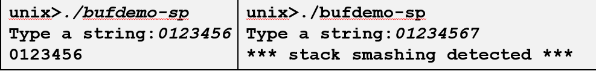

> 即使我的代码和之前一样，只分配了很小的缓冲区，也没有保护, 系统还是阻止我这样做

---

#### 代码示例

下面代码在编译的时候使用了栈保护，因为这是默认的，这个代码像之前一样也分配了 24 字节

但这还有几个其他的数字，这段代码将字符串存储在距离栈指针偏移量为 8 的地方，多余的部分使用 0 填充。

下面的代码有个测试条件，如果它失败了就会我们刚才看到的输出错误信息

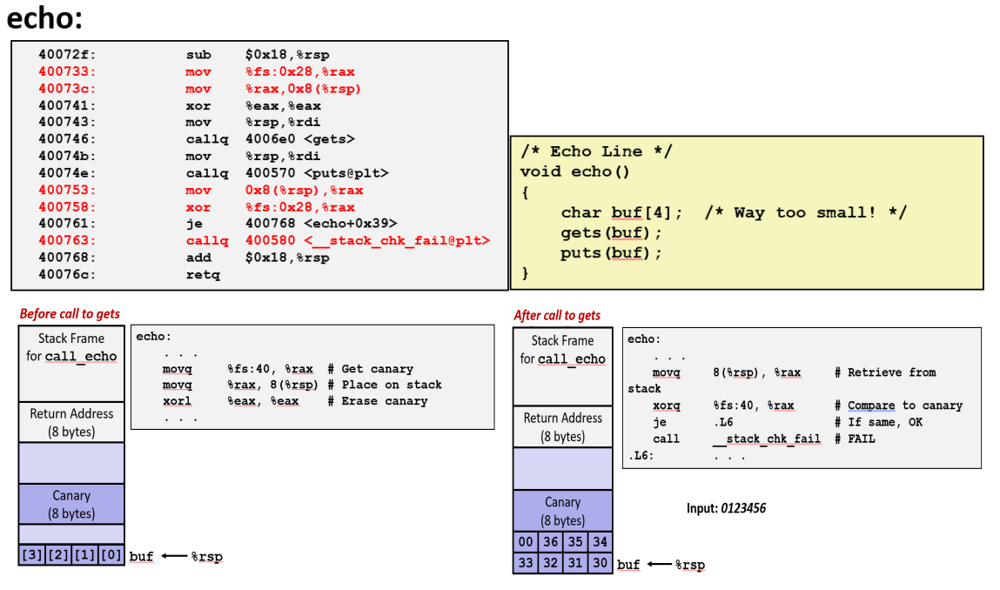

**在调用 gets 函数之前，设置金丝雀值:** 在每次运行**从一个特殊的寄存器**里获取到 8 字节**不一样**的值，并存放到栈顶指针前面的 8 个字节里


> fs 是一个为 原始的 8086 设计的一个寄存器, 因为它是向下兼容的，因此现在仍然可以使用, 但是我没有找到关于它的文档, 总之它就是某块内存中的值

**在调用 gets 函数之后，核对金丝雀值:** 

- 如果两个值相等，说明缓冲区没有溢出，程序正常执行。

- 如果两个值不相等，则说明缓冲区已经溢出，覆盖到了 canary。程序会立即终止。

当输入 7 个字符的字符串时，它并不会填满整个缓冲区，因此不会触及或修改 canary 的值。程序检测后发现 canary 完整，从而正常运行。

许多程序中的 “差一错误”（off-by-one bug），程序员可能没有为这个空字符预留空间，这就会导致它意外地覆盖相邻的内存。

但值得注意的是 canary 的最低位的字节是 0，所以上面的例子即使输入 8 个字符，也能正常运行。因为字符串末尾的空字符(null terminator)正好覆盖 canary 的最低位字节。

> 如果你是一个黑客，你肯定很沮丧，canary 技术确实是一种很安全的技术, 我还没见过有人能破解 canary 技术。

---

## 面向返回编程
针对前面提到的防御机制，黑客们发展出了一种新的攻击方法：面向返回编程（Return-Oriented Programming, ROP）。

### 攻击原理
ROP 攻击的核心思想是：如果无法在栈上注入可执行代码，那就利用程序自身已有的代码串在一起以获得总体期望的结果。

- **尽管栈位置随机化**: 现代系统会随机化栈的起始地址，使攻击者无法预测栈上缓冲区的确切位置。
- **但是代码段位置固定**: 然而，程序的可执行代码段（Text Segment）和全局变量通常位置是固定的，或者其随机化程度较低。

ROP 攻击正是利用了这一点。攻击者并不注入新代码，而是劫持程序的控制流，使其跳转到程序代码段中已存在的、以 ret 指令（0xc3）结尾的代码片段。

### Gadget 的概念
ROP 攻击中的关键是 gadget。一个 gadget 是指一段位于程序可执行代码段中，以 ret 指令结尾的字节序列。

攻击者会在栈上精心构造一个返回地址链。链上的每个地址都指向一个特定的 gadget。程序执行时，会依次跳转到这些 gadget，每个 gadget 执行完后，通过其结尾的 ret 指令，继续跳转到栈上的下一个 gadget。

通过这种方式，攻击者可以将这些小的、无害的 gadget 组合成一个完整的、能够执行恶意功能的指令序列。

---

#### Gadget 示例 #1

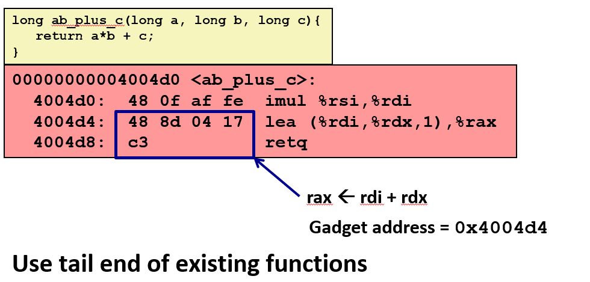
上面示例函数的作用是计算 `a * b + c`。最后两个指令，一个是执行加法运算，另一个执行返回操作。

因此这 5 个字节是获取 %rdi 寄存器和 %rdx 寄存器中的数据的一种途径。可以计算它们的和并放入 %rax 寄存器中。

将尝试执行的代码分解成碎片，然后再找到实现了这些碎片的代码，它们都以 c3 作为返回语句，这是一种在原始 C 语言中添加你期待执行的代码的方式

#### Gadget 示例 #2
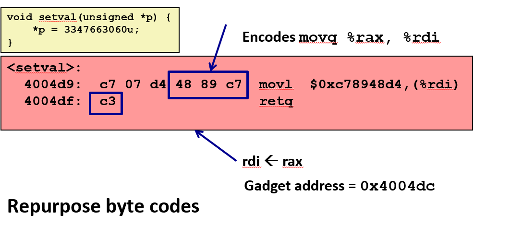

上面示例函数没有修改原有的 C 语言代码，只是碰巧和某些已存在的代码的字节相匹配。

这个函数在黑客眼里不是非常有用, 但图中`48 89 cv`这个特殊序列刚好会被编码成 `movq %rax, %rdi` 和返回语句 `c3`。

如果地址从 4d9 开始，然后是 4da，4db，4dc，那么这个 gadget 的地址应该在 0x4004dc，如果从这里开始执行，它会首先执行一个 move 操作，然后返回。

每个 gadget 的最后一句都是 c3。如果可以让程序执行一条 ret 语句，这个返回语句使用栈上弹出的一个地址并从那里开始执行。

执行完毕后在最后又命中了 c3 执行了返回操作，然后继续使用栈上的地址并开始执行下一个 gadget

所有的 gadget 被连接在了一起，从上一个 gadget 返回之后又会从下一个开始执行。这就是为什么将它称为面向返回编程，这是一种替换程序计数器的方法。

---
> 但需要说明的是 canary 仍然可以检测到缓冲区溢出, 所以在你们的 attack lab 中, 我们已经使代码更容易受到攻击, 否则这个 lab 就会很难。
> 
> 并且如果你们能完成这个实验，你们就可以进入黑客的世界并且能混的很成功
>
> 我认为你们通过这些实验学到的将会比你们听到的还要多

> 你们也许会问为什么我们要教这些, 我们不是应该教给你们好的东西而不是这些罪恶的东西吗，其实有很多理由:
>  
> 一个就是你们将会学到很多关于程序执行的知识: 栈是如何工作的，字节指令是如何编码的等等, 你们将会比 bomb lab 更多地使用 GDB 工具
> 
> 另一个就是你们应该为正义而战, 成为一个好人的同时也要知道坏人是怎么做的, 这样会更加有效
---

## 联合体
联合体看上去和结构体很像, 但它们实际上完全不一样: 结构体为所有的域都分配足够的内存; 而联合体会使用占用空间最大的域的大小来分配内存

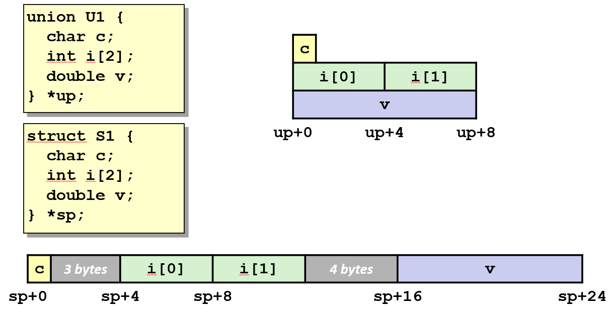

它假设你只会使用一个域, 如果存储另一个域，就会覆盖上一个存储的域。它是一种通过别名来引用不同的内存的方式

---
### 使用联合访问位模式

如果使用一个包含 unsigned 类型和 float 类型的域的联合体，就可以通过将浮点数的字节表示存储到 unsigned 类型的域中，并通过 float 域来获取它

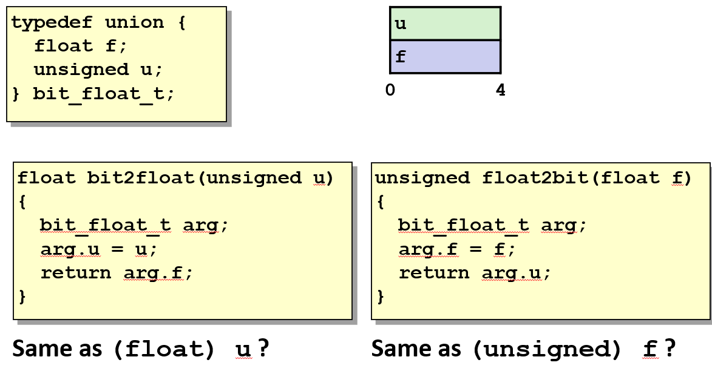

这和类型转换是完全不同的操作，当将 unsigned 类型的值转换为 float 类型时，实际上改变了它的位。将它转换成了最接近这个值的浮点数。

但是联合体并没有改变它的位，因此联合体是一种切换类型并得到不同的位表示形式的技术。

---

## 字节序

如果不小心的话，就会写出含有字节序问题或其他问题的代码，程序中就会出现字节序列的问题，可能只能在同一台机器运行。

```c
union {
    unsigned char c[8];
    unsigned short s[4];
    unsigned int i[2];
    unsigned long l[1];
} dw;
```
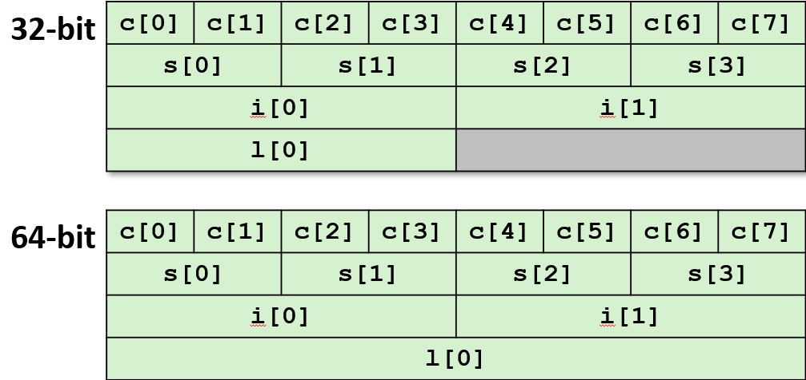

**下面的函数**可以**查看上面联合**的一个字节，或者字节的组合，这取决于使用的机器。由于不同机器上的字节序列不同，在不同的机器上会得到不同的结果。

```c
int j;
for (j = 0; j < 8; j++)
    dw.c[j] = 0xf0 + j;

printf("Characters 0-7 ==  [0x%x,0x%x,0x%x,0x%x,0x%x,0x%x,0x%x,0x%x]\n",
    dw.c[0], dw.c[1], dw.c[2], dw.c[3],
    dw.c[4], dw.c[5], dw.c[6], dw.c[7]);

printf("Shorts 0-3 == [0x%x,0x%x,0x%x,0x%x]\n",
    dw.s[0], dw.s[1], dw.s[2], dw.s[3]);

printf("Ints 0-1 == [0x%x,0x%x]\n",
    dw.i[0], dw.i[1]);

printf("Long 0 == [0x%lx]\n",
    dw.l[0]);
```

- 在 IA32 机器上，这个字节序列是 0xf3f2f1f0

- 在 Sun 的机器上会得到相反的字节序列

- 下面是在一台 x86-64 的机器上的 8 个字节

如果仔细看会发现这是一个小端序的字节序，因为它的有效位是 f0，也就是第一个字节是 0xf0

> 因此这也是一种获取低位字节的方式，当你使用这种方法的时候，你实际上实在告诉 C 编译器，相信我，我知道自己在做什么，不要阻止我

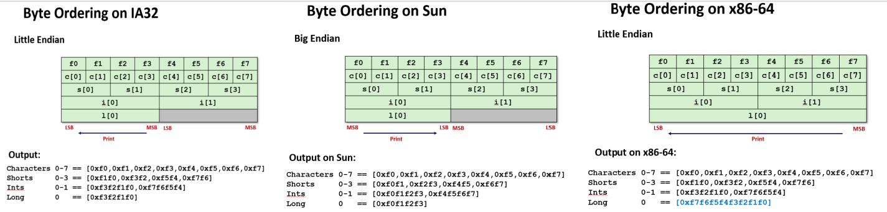


