# Program Optimization


这一章的主题是，如何让程序运行更快: 运行的更快指的是算法已经确定了, 并且程序可以正确运行了, 如何让它运行得更快

> 你可以在不同的层面上做这件事情, 可以先去掉程序中不必要的工作，这个优化不依赖与目标机器,后面我会讲什么是编译器友好代码

> 要编写出编译器友好的代码，你必须明白**什么代码编译器能够优化**, 什么代码编译器无法优化

> 并且你应该养成 **编写对编译器来说友好的代码** 的习惯

> 我们已经去掉了程序中不必要的代码，下一步是如何让程序运行得更快

> 特别是，我们如何针对特定的机器对程序进行优化. 也就是从对大多数机器的优化，转移到了对特定机器的优化

> **针对特定机器优化是一件冒险的事情**，因为例如 x86 的机器在每个时间点，它们都有各种不同的型号, 并且不同的型号也随着时间的推移而发展

> 因此，可能在一个 x86 处理器的特定型号上运行速度较快, 但在另一台 x86 机器上运行速度可能较慢, 当你把优化的程序移到另一个机器时，你会发现你的努力有点浪费

> **另一方面，我将要描述的这些一般性想法实际上适用于各种各样的机器**, 随着我们的进展，我会更多地谈论这个问题


## 性能优化

> 以前如果你希望程序快速运行，则你必须编写汇编代码, 而**这显然不再是正确**，如果有人告诉你这是正确的, 这是因为他们对这个不了解, 事实并非如此

> 除非程序运行在资源非常小的机器上, 比如程序运行在一个非常小的计算力不足的嵌入式系统上

> 我们这个课程使用 gcc 作为编译器，是因为 gcc 的获取比较方面。它实际上并不是最好的编译器，但英特尔制造的编译器需要花钱才能使用

> 虽然有其他编译器，但事实上 gcc 可以做到较好的优化, 对于大多数人来说，gcc 是一个足够好的编译器


## 优化编译器的局限性


### 在基本约束条件下运行
不能导致程序行为发生任何改变, 除了在程序可能使用了非标准语言功能时。在无法控制的条件下通常会阻止优化，因为那样会影响程序行为。


**大多数分析仅在过程内进行**
在大多数情况下，整个程序分析过于昂贵, 较新版本的 GCC 在单个文件中进行过程间分析, 不会在不同文件的代码之间

**大多数分析仅基于静态信息, 编译器很难预测运行时输入**


**程序员显而易见的行为可能会被语言和编码风格所混淆**
例如编译器不可能理解正在使用的数字代表什么实际含义**

当我们定义一个 int 时, 虽然它的范围在 `-2^31 ~ 2^31-1` 之间, 但实际在开发时, 业务逻辑可能用到的范围远小于 `-2^31 ~ 2^31-1` 这个范围

**编译器也很难理解内存引用模式和不同的过程调用会对程序有什么影响**

一般来说，编译器有一整套优化策略, 以及如何使用这些优化方案的方法

但如果编译器 **能否对代码进行某些优化** 不够确定, 编译器就不会优化，会采取直接的实现方法


> 编译器的优化方案中总有一个备选方案，即不优化, 如果你希望程序运行得更快，你有可能遇到麻烦, 因为编译器选择了不对代码进行优化

> 这时你可以使用一个非常有用的技巧, 因为你可以阅读汇编代码，所以你可以编译程序, 看看编译器做了哪些优化

> 如果编译器没有做到你想要的优化，你就回去看代码，找到原因

> 因此，用同一种语言重写程序, 并对其进行调整以使其运行得更快, 更加编译器友好是一种常用的优化程序的方法

> 只要你不把这个程序改的完全无法阅读, 所以我们只讲一些通用的优化方式

## 通常有用的优化

> 这里的汇编代码的一些版本我们前面已经看过了, 我们使用的大多数例子是多维数组, 因为多维数组是相当容易优化的任务

**代码移动: 如果它总是产生相同的结果, 则将代码移出循环, 降低执行计算的频率**

主要观察下面这个循环体, 唯一变化的变量是 `j`, 如果 `n*i` 在这个循环中反复执行, 就是一种浪费

所以可以进行一种叫做**代码移动**的优化方式 ,在循环外预先计算 `n*i` 的值,然后在内部一遍又一遍地使用它。

当编译器可以检测到它是一个数组访问代码，并且编译器有这种技术时，编译器通常就会这么做

```c
void set_row(double *a, double *b, long i, long n){
    for (long j = 0; j < n; j++) {
        a[n*i+j] = b[j];
    }
}
```
```c
void set_row(double *a, double *b, long i, long n){
    int ni = n*i;

    for (long j = 0; j < n; j++) {
        a[ni+j] = b[j];
    }
}
```
 
实际上可以查看使用 gcc，优化级别为 1 编译后的汇编代码。

```s
set_row:
    testq	%rcx, %rcx		# Test n
    jle	.L1			# If 0, goto done
# 在访问数组元素之前，即循环体之外增加了这个乘法操作
    imulq	%rcx, %rdx		# ni = n*i
    leaq	(%rdi,%rdx,8), %rdx	# rowp = A + ni*8
    movl	$0, %eax	               	# j = 0
.L3:				      	# loop:
    movsd	(%rsi,%rax,8), %xmm0    	# t = b[j]
    movsd	%xmm0, (%rdx,%rax,8)   	# M[A+ni*8 + j*8] = t
    addq	$1, %rax			# j++
    cmpq	%rcx, %rax		# j:n
    jne	.L3			# if !=, goto loop
.L1:				      	# done:
    rep ; ret
```

实际上这个代码还做了另外的优化。它将代码转换为指针风格的代码, 使用指针来访问数组 a，然后每次循环，指针的值加 1

**用更简单的方法替代昂贵的操作: 移位、加法(x << 4)替代乘除法(16 * x)**

实际效果依赖于不同机器在乘法或除法指令的成本: 在 Intel Nehalem 上，整数乘法需要3个CPU周期


```c
for (i = 0; i < n; i++) {
    int ni = n * i;
    for (j = 0; j < n; j++) {
        a[ni + j] = b[j];
    }
}
```

在上面的例子中预先计算了 `n*i` 的值, 所以现在内循环效率不错。但可以意识到第一个乘法也是不必要的。

因为从 i=0 到 i=1 到 i=2, 可以通过让 ni 增加 n 来实现, 这个称为计算量的减少，将乘法转化为加法, 因为有一些可预测的模式可以更新这个变量 ni

```c
int ni = 0;

for (i = 0; i < n; i++) {
    for (j = 0; j < n; j++) {
        a[ni + j] = b[j];
    }
    ni += n;
}
```

下面这个例子也是关于数组访问优化的, 想象有一个图片表示为像素值的二维数组

我们想要做一些过滤操作: 得到一个像素东南西北四个邻居的像素值, 求它们的平均值或它们的和

<div style="display: flex; gap: 20px; align-items: flex-start;">

```c
/* Sum neighbors of i,j */
up =    val[(i-1)*n + j  ];
down =  val[(i+1)*n + j  ];
left =  val[i*n     + j-1];
right = val[i*n     + j+1];
sum = up + down + left + right;
```
```s
leaq   1(%rsi), %rax  # i+1
leaq   -1(%rsi), %r8  # i-1
imulq  %rcx, %rsi     # i*n
imulq  %rcx, %rax     # (i+1)*n
imulq  %rcx, %r8      # (i-1)*n
addq   %rdx, %rsi     # i*n+j
addq   %rdx, %rax     # (i+1)*n+j
addq   %rdx, %r8      # (i-1)*n+j
```
</div>

 
实现这个功能最自然的代码是直接求出上下左右四个像素值, 类似于下面的代码，然后直接编译它

会发现汇编代码中有三个乘以 n 的乘法 `(i+1)*n`, `(i-1)*n` 和 `i*n+j`

如果编译器不是太聪明，它不会意识到它们彼此相关,  对每一个像素，都会做 3 次乘法运算

> 如果我更聪明一点, 我会手工重写这部分代码, 然后重新编译

改动之后的代码如下面所示，inj 是 i*n+j, 我可以通过加减 n 来得到下上像素的值, 然后重新编译代码，这次编译的代码只有一个乘法运算


<div style="display: flex; gap: 20px; align-items: flex-start;">

```c
long inj = i*n + j;
up =    val[inj - n];
down =  val[inj + n];
left =  val[inj - 1];
right = val[inj + 1];
sum = up + down + left + right;
```
```s
imulq	%rcx, %rsi  # i*n
addq	%rdx, %rsi  # i*n+j
movq	%rsi, %rax  # i*n+j
subq	%rcx, %rax  # i*n+j-n
leaq	(%rsi,%rcx), %rcx # i*n+j+n
```
</div>

> 一般来说，乘法操作非常昂贵, 但现在有足够的硬件资源，乘法操作需要大约三个时钟周期，所以这不是一个大问题

> 但是，任何时候你可以使用一个乘法操作替代三个乘法操作，都是有优化的

**针对空间上的优化**

以前的内容非常昂贵, 640K 内存是顶级配置。现在随便一个程序都不止这点，现在的优化重点是看执行效率，而不是看源代码有几行。

## 编译器的局限 

### 过程调用

> 如果你编写代码的方式比较合理的话，一般的编译器都非常擅长这种低级优化
> 但是还有一些其他的代码，你可以购买的最好的编译器也可能无法优化

> 我在实验室里看到一些学生写的这段代码, 我对这段代码感到震惊. 我向助教展示了这段代码，但没有一个人弄清楚出了什么问题

> 我已经向许多其他训练有素的 C 程序员专业人员展示过它, 他们感觉没什么问题. 那么让我们弄清楚为什么我被这段代码吓坏了

```c
// 将字符串转换为小写的过程
// 摘自213实验室提交的材料，1998年秋季
void lower(char *s) {
    for (size_t i = 0; i < strlen(s); i++){
        if (s[i] >= 'A' && s[i] <= 'Z') {
            s[i] -= ('A' - 'a');
        }
    }
}
```
> 如果你的字符串到了 `50w` 个字符, 需要 240 秒左右才能运行完此代码
> 
> 你也注意到这种增长是非线性的，它是二次的, 它正在以字符串长度的平方增长，所以这并不好
> 
> 这是一类非常容易有隐藏的性能上的 bug 的程序, bug 会使程序的增长是二次的
> 
> 并且当你的测试数据是 10,000 或更少的字符串时, 它看起来并不是什么大不了的事，因为运行时间是微不足道的
> 
> 但如果这个程序遇到了字符串比较大的情况就会出问题, 所以，为什么这个程序不好
> 
> 关键的点是在条件测试中调用 strlen 函数, 但 strlen 函数是通过测试字符串是否到达末尾的方式来计算字符串的长度


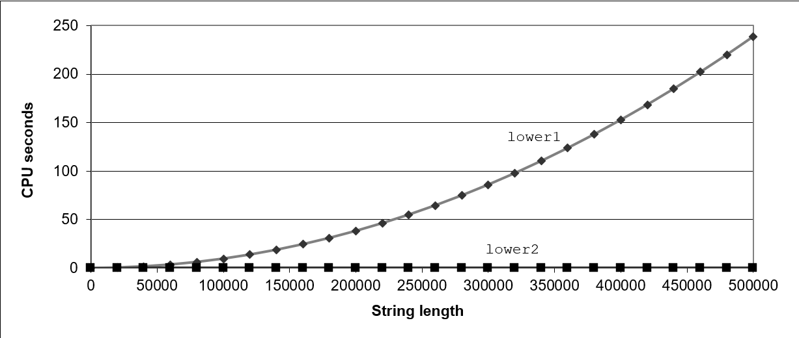


现在，我们将 `for` 循环转换为 `goto` 形式, 有各种方法来进行这个转化

`for` 循环有三个不同部分, 程序员常常忽略了这样一个事实, 初始化只执行一次, 但测试和更新每次循环都会执行

每次循环时都会产生对 `strlen` 的调用, 因此，`strlen` 调用的次数，等于字符串中字符的数量
```c
void lower1(char *s) {
    size_t i = 0;
    if (i >= strlen(s)) {
        goto done;
    }
loop:
    if (s[i] >= 'A' && s[i] <= 'Z') {
        s[i] -= ('A' - 'a');
    }
        
    i++;
    if (i < strlen(s)) {
        goto loop;
    }
done:
}
```

现在看 `strlen` 如何工作, 查看字符串长度的唯一方法, 是遍历整个字符串直到找到空字符为止

整体性能，长度为 N 的字符串, 对 strlen 的N次调用需要次数 N, N-1, N-2, …, 整体复杂度 O(N2) 性能

因此 `strlen` 本身就是线性时间的操作, 所以，对一个线性时间函数调用了 `n` 次

```c
/* My version of strlen */
size_t strlen(const char *s) {
    size_t length = 0;
    while (*s != '\0') {
        s++; 
        length++;
    }
    return length;
}
```
如果引入一个名为 `len` 的局部变量, 预先计算 `strlen`, 那么程序将做同样的事情

但是现在运行时很短，甚至都看不出来时间的增长, 即使是一百万个字符，也不是什么大不了的事
```c
void lower2(char *s) {
    size_t len = strlen(s);
    
    for (size_t i = 0; i < len; i++){
        if (s[i] >= 'A' && s[i] <= 'Z') {
             s[i] -= ('A' - 'a');
        }
    }
}
```
> 这只是我职业生涯中见过的许多例子之一, 看似无足轻重的事情，最后证明存在严重的性能问题

```c
size_t lencnt = 0;
size_t strlen(const char *s) {
    size_t length = 0;
    while (*s != '\0') {
        s++; 
        length++;
    }
    lencnt += length;
    return length;
}
```


为什么编译器不能更智能一点, 但编译器知道更好的方法，会提前预先计算 strlen, 有几个原因使得编译器无法进行此类优化


**1. 代码在循环中修改了字符串**

上面的代码中, 每调用一次 `strlen` 全局的 `lencnt` 就会增加, 如果少调用了 `strlen`, `lencnt`的值就会发生改变

而之前的将字符串转换为小写的示例中, 外界修改了字符串, 即将大写换成小写, 编译器不确定这是否对字符串长度产生了影响

**2. 编译器不知道哪个版本的 `strlen` 将被使用**
因为每个文件都是单独编译的, 编译之后，它们才会在链接阶段链接在一起, 其中一些甚至在程序启动后发生

编译器优化是在链接之前进行的, 在链接之前还不能确定调用了哪版本的 `strlen`

当编译器处理 main.c 时，它看到你调用了 strlen。

虽然库里有一个标准的 strlen，但编译器不敢保证你最后链接的时候，会不会偷偷换成自己写的那个“带副作用”的 strlen。

既然无法预知最终链接的是哪个版本，编译器只能把它当成一个**黑盒子**：每次遇到，都老老实实地跳进去执行一遍。


### 内存问题

有二维数组 a 和一维数组 b, 想使 b[i] 等于 a 中 i 行中所有元素的总和

当然现在知道可以通过移动 i*n 来改善这一点, 但想说的不是这一点

<div style="display: flex; gap: 20px; align-items: flex-start;">

```c
/* Sum rows is of n X n matrix a and store in vector b  */
void sum_rows1(double *a, double *b, long n) {
    for (long i = 0; i < n; i++) {
        b[i] = 0;
        
        for (long j = 0; j < n; j++) {
            b[i] += a[i*n + j];
        }
    }
}
```
```s
# sum_rows1 inner loop
.L4:
        movsd   (%rsi,%rax,8), %xmm0	# FP load
        addsd   (%rdi), %xmm0		# FP add
        movsd   %xmm0, (%rsi,%rax,8)	# FP store
        addq    $8, %rdi
        cmpq    %rcx, %rdi
        jne     .L4
```
</div>

将浮点数据放在其中一个 %xmm 寄存器中, 所以在这里看到的主要是它从内存中读取数据， 然后加上某个值，然后再将它写回内存位置对应 b[i]

所以这意味着每次循环都需要从内存中读取 b[i]，然后再把 b[i] 写回内存

为什么编译器不把 b[i] 先存在寄存器里，等内层循环算完了, 最后再写回内存一次. 为什么要傻傻地在循环里读一次内存、加一下、写回一次内存

通常认为 `a` 是矩阵，`b` 是存放结果的数组，它们互不干扰。在这种情况下，每次修改 `b[i]`，`a` 里的数据纹丝不动。

<div style="display: flex; gap: 20px; align-items: flex-start;">

```c
double A[9] = { 
    0,   1,   2, 
    4,   8,  16,
    32,  64, 128
};
double *B[3] = A + 3;

sum_rows1(A, B, 3);
```
```c
//B的值
//init : [4, 8,  16 ]
//i = 0: [3, 8,  16 ]
//i = 1: [3, 22, 16 ]
//i = 2: [3, 22, 224]
```
</div>


由于 C 语言允许指针指向任何地方，万一外界像下面这样调用函数

如果 `b[i]` 的内存地址恰好就是 `a[i*n + j]` 后面某个元素的地址，神奇的事情发生了：

当执行 `b[i] +=` 时，实际上修改了数组 `a` 里的某个值

那么下一次循环 `j++` 之后，读取出来的 `a[i*n + j]` 就是被你刚刚改过的值。

```c
// 假设 n=3，a 和 b 指向的内存有重叠
sum_rows1(&data[0], &data[1], 3);
```

如果通过引入局部变量来把求和的结果保存在其中, 然后只在最后赋值 b[i], 然后会看到这个完全相同的循环突然变得更加简单

<div style="display: flex; gap: 20px; align-items: flex-start;">

```c
/* Sum rows is of n X n matrix a and store in vector b  */
void sum_rows2(double *a, double *b, long n) {
    for (long i = 0; i < n; i++) {
        double val = 0;
        for (long j = 0; j < n; j++) {
            val += a[i*n + j];
        }
        b[i] = val;
    }
}
```

```s
# sum_rows2 inner loop
.L10:
    addsd   (%rdi), %xmm0	# FP load + add
    addq    $8, %rdi
    cmpq    %rax, %rdi
    jne     .L10
```
</div>


> 再一次重申，作为一名程序员，很难想到这是一件大事. 但是 C 编译器通常不能进行这样的优化, 因为它无法预先确定是否存在的内存别名使用


> 要习惯这两个例子中引入局部变量的写法, 这样可以告诉编译器不要一遍又一遍地调用相同函数
> 
> 不要一遍又一遍地读取和写入相同的内存位置，只需将其保存在临时位置即可
>
> 然后编译器会自动分配一个寄存器并将结果存储在该寄存器中，一切都会很好
> 
> 影响编译器优化的，主要是内存别名使用和函数调用中的副作用


**为什么 C 使用 null 来标识字符串的结尾**

> 使用这种方式可能是一个糟糕的决定，我想，因为 C 语言是由 D.M.Ritchie(补充的)发明
> 
> 他曾写过很多汇编代码，想要提升汇编代码的抽象级别, 因为他们不想一遍又一遍地写同样的东西, 所以他们进一步考虑高级的抽象
> 
> 他们只是试图在机器级编程之上提供一个小的抽象, 可以使他们编写的代码，从一个机器跨越到另一台机器, 所以，他们设计的 C 语言，都使用最简单的表示方式
> 
> 例如，大多数语言，数组都有边界检查, 数组是一个数据结构，包括它的大小，值的范围和其他的东西，而 C 没有这些东西
> 
> C 语言只提供基本的功能, 而且你知道 C 语言已经存在了 40 年左右的时间


**C 语言参考了 Pascal 语言吗**
> 不, Pascal 语言是 Niklaus Wirth 发明的，用于教学用的语言。
> 
> 它是用于教学的一种语言, 所以它是帮助学生理解编程, C 由专业程序员设计，帮助他们编写代码，不是为了帮助学生学习
> 
> 所以这两种语言之间的理论区别比较大


**在栈上分配内存还是在堆上分配内存在这里完全没有区别**


## 利用指令级并行性

> 现在来看另一种比这个有趣的优化, 这种优化更依赖于系统, 但是现在几乎所有处理器都实现了这个特性, 名为的无序执行的特性
> 
> 所以这是一种可以, 适用于各种各样的机器的通用优化方法, 我要通过一系列例子来说明这种优化方法

todo
需要对现代处理器设计有大致的了解
硬件可以并行执行多条指令
性能受数据依赖限制
简单的转换可以显著提高性能
编译器通常无法进行这些转换
浮点运算缺乏结合性和可分配性

### 矢量的数据类型


> 这看起来像 pascal 语言实现数组的方式, 我没有说 Pascal 语言不好, 过去我们曾经教过这种语言
> 
> 在一种语言中实现数组的典型方法是使用一个数据结构不仅保存数组中的值, 还保存与之相关的其他信息，例如它的大小
> 
> 所以这是一种很好的抽象方式, 你编写的代码可以确保，如果你对数组的访问越界了会返回一个错误信号

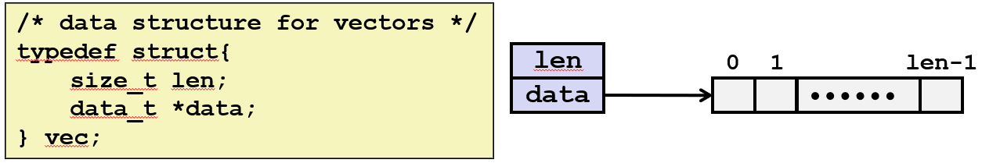

下面函数的功能是，从数组中取出索引值对应的元素, 传递一个指针, 然后该指针被赋值为数组中索引对应的元素

将元素的数据类型定义为 data_t, 这样可以修改 data_t 的定义，然后重新编译

data_t 可以定义为 int，long，float 和 double, 将看到性能特征如何随着不同的数据类型而变化

<div style="display: flex; gap: 20px; align-items: flex-start;">

```c
/* retrieve vector element and store at val */
int get_vec_element(*vec v, size_t idx, data_t *val) {
    if (idx >= v->len){
        return 0;
    }
    *val = v->data[idx];
    return 1;
}
```

```c
//对 data_t 使用不同的声明
int
long
float
double
```
</div>


在这里使用了两个宏定义 IDENT 和 OP进行了2钟定义, 这样就可以对两种运算进行对比: 

- OP 定义为加法，且 IDENT 定义为 0
- OP 定义为乘法，且 IDENT 定义为 1


有八种可能, 四种不同数据类型和两种不同的运算的组合

先使用 get_vac_element 的函数来得到数组的第 i 个值, 然后累加或累积到 dest

```c
// 计算数组中所有元素的总和
void combine1(vec_ptr v, data_t *dest) {
    long int i;
    *dest = IDENT;
    for (i = 0; i < vec_length(v); i++) {
        data_t val;
        get_vec_element(v, i, &val);
        *dest = *dest OP val;
    }
}
```


每个元素所花的时间周期(CPE)表示 对向量或列表进行操作的程序 的性能

使用这个指标，是因为通常当遍历处理一个数组时, 随着数组的增大，处理的时间是线性增长的

并不需要关心对一个元素的处理需要多少秒或多少微秒或多少纳秒, 需要关心它的整体性能特征是什么


进行低级代码优化也是如此, 使用处理器内部时钟的时钟周期作为时间单位更有用, 而不是像纳秒这样的时间单位

因为处理器是以 2G 赫兹运行还是 2.3G 赫兹运行, 一名程序员是无法控制它的, 但程序员可以控制程序中不同的计算部分使用了多少个时钟周期

所以这就是为什么它被称为每元素的周期数, 这里展示了函数实际测量的 CPE 值


但通常像 combine 这样的函数因为需要设置循环，调用函数和其他的一些东西, 会有一些额外的开销(类似 size 为 0 时的开销)

**下面这个例子中: 长度 = n, CPE = 每个 OP 的周期, T = CPE*n + 固定开销, CPE 是线的斜率**

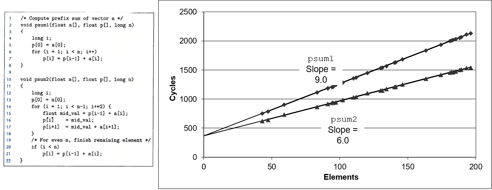


这里只展示四种结果, 因为 data_t 是 int 还是 long 还是 float 或 double, 大多数情况下都不会对性能产生影响

如果指定优化等级为 0, 每个元素需要大约 20 个时钟周期, 如果优化级别设置为 1，它只需要花费不优化时一半的时间

只需更改编译器的优化选项，就可以将每个元素降低到 10 个时钟周期

> 这个例子所用的代码是我能想到的，最不优化的代码

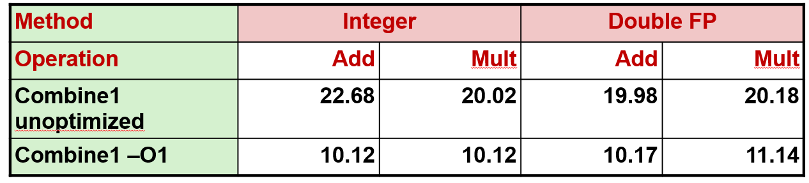

然后可以进行一些优化: **将 vec_length 移出循环**, **避免每个循环进行边界检查**, **数据累加到临时变量**

> 每次调用 get_vec_element 函数都会检查数组索引是否越界, 一遍又一遍地检查同一个数组是否越界是很愚蠢的
> 
> 所以当我遍历时，我先得到它的长度来确定要访问的元素数量, 放弃 get_vec_element 函数的边界检查
> 
> 我可以引入一个函数，它返回数组的长度, 数组长度之外的东西就直接忽略
> 
> 所以我可以重新编写一个循环，引入局部变量, 先把数据累加到临时变量，然后再赋值给 dest


```c
void combine4(vec_ptr v, data_t *dest) {
    long length = vec_length(v);
    data_t *d = get_vec_start(v);
    data_t t = IDENT;

    for (long i = 0; i < length; i++) {
        t = t OP d[i];
    }
    
    *dest = t;
}
```
这里使用的是优化级别 1: 它把整数的加法降低到 1 个多时间周期, 整数乘法降低到了 3 个时钟周期，双精度乘法降低到了 5 个时钟周期

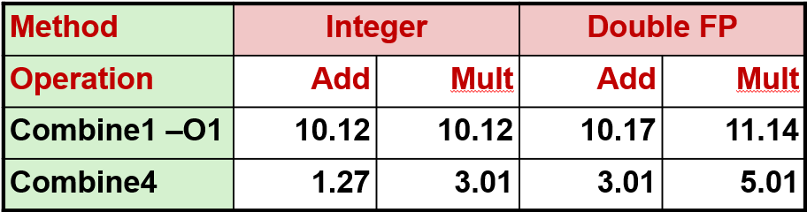


解释一下这三个数字怎么来的，3，5和 1.27。这些数字的来源暗示刚才的程序存在一些基本限制, 要理解这些数字的来源，必须对底层硬件有一些了解

## 现代CPU设计

> 你可以选修一个非常好的课程，ECE 741，它会教你，你能想象的，有关处理器设计的一切知识
> 
> 你会自己动手设计了这样的处理器，但我想你暂时不打算那样做，因为这门课程有 7 门先修课程
> 
> 那么，让我给你一个简单版本的处理器，这个处理器有点像 1995 年左右的处理器
所以这是旧的东西，但真正理解它非常困难，有很多细节
> 
> 因此，即使是 ECE 447 这样的计算机架构课程也没有讲述这方面的内容
> 
> 他们并没有真正进入这种设计，因为它们很难，要自己设计非常困难

但基本的想法是: 对于一个程序, 计算机会读入一条指令，然后执行这条指令, 读取另一条指令，然后执行那条指令

这实际上和正在执行的程序无关（程序可以分解为基础指令）

CPU 提供了这个庞大的硬件基础设施使程序运行速度比一次只执行一条指令快

它采用了一种称为超标量乱序执行的技术，这个想法粗略地讲: 

可以认为程序是一个顺序执行的指令序列，CPU 尽可能的读取多的指令序列

然后 CPU 把读入的指令拆开，发现有的指令之间不是相互依赖的，所以可以开始执行程序后面的代码, 而不是当前的代码

这被称为指令级并行性，也就是即使程序是一个顺序的指令序列, 但实际上，这些代码可以拆分成不同的部分

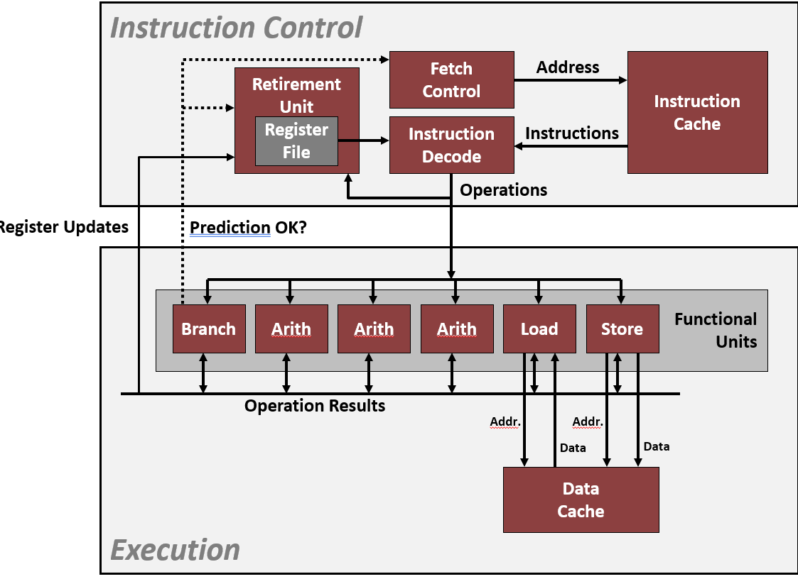


上图的上半部分显示了获取指令的方法: 这里有高性能高速本地缓存, 这个缓存只是尽可能快地提取指示

然后缓存把指令送入指令译码这个硬件中, 这个硬件把指令拆分为低级操作，并确定这些操作之间的依赖关系

CPU 还有一组功能单元, 能够执行这些低级操作，如算术浮点运算, 从内存中读取数据，写入数据到内存

所有的这些操作都使用缓存，缓存可以视为某些内存数据的高速副本

总的来做，基本的思想是**把程序的操作进行拆分，重组使这些基本单元尽可能保持繁忙**, 执行代码的不同片段，与以前不同的顺序执行不同的指令

一组寄存器可以看做是可读可写的一段内存, 一个寄存器相当于一个内存符号(寄存器重命名，P360), 一条指令往写个内存写，其他一些指令读取这个内存

寄存器是一条指令产生数据的目的地，也可以是一些其他指令的数据来源, 有很多数据通过寄存器进行传递, 可能是一次计算结果，作为另一次计算的输入

基于寄存器名称而不是将它们显式存储在寄存器文件中, 有一个寄存器文件，当计算的结果出来了，它们将被存储在这里

> 但主要考虑的事情是，你的机器有足够的资源，可以同时进行多项操作, 但这需要你能以某种方式构建你的程序，才能同时使用这些资源

## 超标量处理器
可以同时进行多项操作的 CPU 被称为超标量指令处理器，这种 CPU 可以在一个周期内发出并执行多条指令。这些指令是从顺序指令中检索的，并且通常是动态调度的。

超标量处理器无需编程，超标量处理器可以利用大多数程序所具有的指令级并行性


> 实际上，1993 年，Intel 自奔腾 Pentium 处理器起就可以同时执行两条指令, 紧接着他们推出了一款名为 Pentium Pro 的产品
> 
> 大多数现代 CPU 都是超标量的, 它是所有现代处理器的基础, 顺便说一下，Intel 的首席架构师是 CMU 毕业生, 乱序执行是现在处理器的模型

## 流水线操作单元
乱序执行比较复杂，但功能单元可能比想象的更加复杂, 功能单元使用了流水线技术

流水线的基本思想是将计算分解为一系列不同的阶段, 一个简单的例子: 计算 a*b+c 的值先做乘法，然后做加法

但乘法器做乘法比人算乘法更加复杂: 乘法器先将乘法分解为可以一个接一个地完成的更小的步骤

可以认为每个阶段都有一个单独的专用硬件, 然后做流水线操作, 也就是当一个操作从一个阶段移动到下一个阶段时, 前一个阶段空出来了，可以填入新的数据

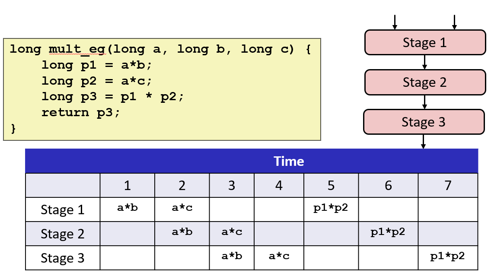


> 请看 PPT 上的例子，我的乘法器分为 3 个阶段, 我计算 `a*b`，`a*c` 然后把两个积相乘
> 
> 要注意的是 `a*b` 和 `a*c` 不以任何方式相互依赖, 所以我可以同时计算它们两个的积，但我没有两个乘法器, 但我可以一个接一个地做一个
> 
> 所以，`Time1` 我可以先计算 `a*b` 的第一阶段, 当 `Time2` 时，它将继续进入第二阶段, 到了 `Time3`，它将进入第三阶段
> 
> 但 `Time2` 时，我可以同时计算 `a*c` 的第一阶段, 因为这个阶段是空闲的, 当 `a*b` 从第 1 阶段移至第 2 阶段时
> 
> 所以在其他操作后面的一个时钟周期，我都可以开始新的操作, 现在 `p1*p2` 显然取决于 `a*b` 和 `a*c` 的乘积
> 
> 因此，在 `a*c` 完成之前 `p1*p2` 无法启动, 然后我们计算 p1*p2，后面没有其他的操作，所以流水线后面是空的
> 
> 总的来说，我们已经完成了看起来需要 9 个步骤的乘法, 但由于流水线操作，这里总共有七个步骤（3 个乘法 *3 个时钟周期）


> 这一切都在单个处理器的单核中，单核的这种并行性是一种比多核低的并行性
> 
> 除了在低功率的嵌入式处理器中，其他的处理器都提供了这种并行性, 并且大多数时候你的硬件没有得到充分利用
> 
> 这就是流水线操作的基本思想，它有点像并行性, 但这种并行性不是说你拥有多份资源（如多个乘法器）而是把在单个硬件上的操作，划分为紧密联系的顺序的多个步骤


例如 Haswell CPU 有许多不同功能的功能单元，这些功能单元组合起来，可以同时执行: 

`2 次读内存`，`1 次写内存`, `4 次整数运算`，`两次浮点乘法`，`一次浮点加法`和`一次浮点除法`

> 这些操作不可能同时发生，因为功能单元之间有一些共享资源, 但功能单元的确比较多

从下图可以看到，大多数操作需要花费几个时钟周期才能完成，但它们采用了流水线的技术，只需一个时钟周期

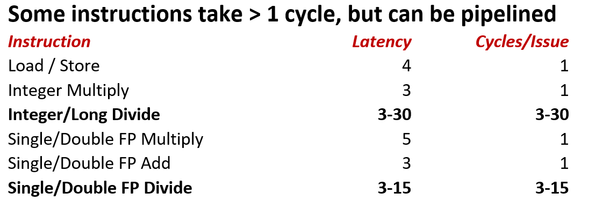

指令有两个参数，延迟（Latency）是一个指令从头到尾需要多长时间

但由于有流水线操作，还有一个参数（Cycles/Issue）表示两个小步骤之间的距离

> 我讲这两个参数的原因是，它们限制我们程序的运行速度

**注意到，除法操作非常慢，并且没有流水线，所以，相对而言，在大多数机器上，除法是一项非常昂贵的操作**

## 循环展开

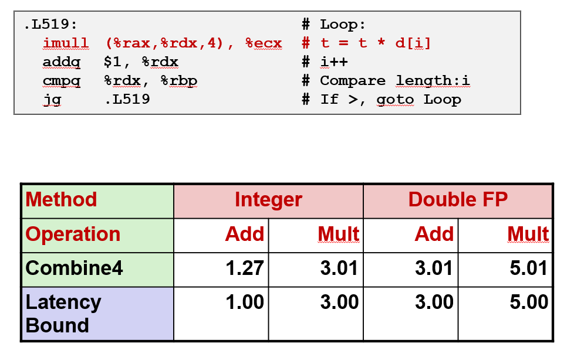

> 举个例子，如果我计算多个整数乘法, 从上图代码中可以看出，在开始下一个乘法之前，我需要上一次乘法的结果
> 
> 每次乘法需要 3 个时钟周期，所以这里得到的结果是 3 个时钟周期. 实际上我的测量结果都符合
> 
> **我称为机器延迟界限**, 这种限制是基于一个操作从开始到结束需要的时间

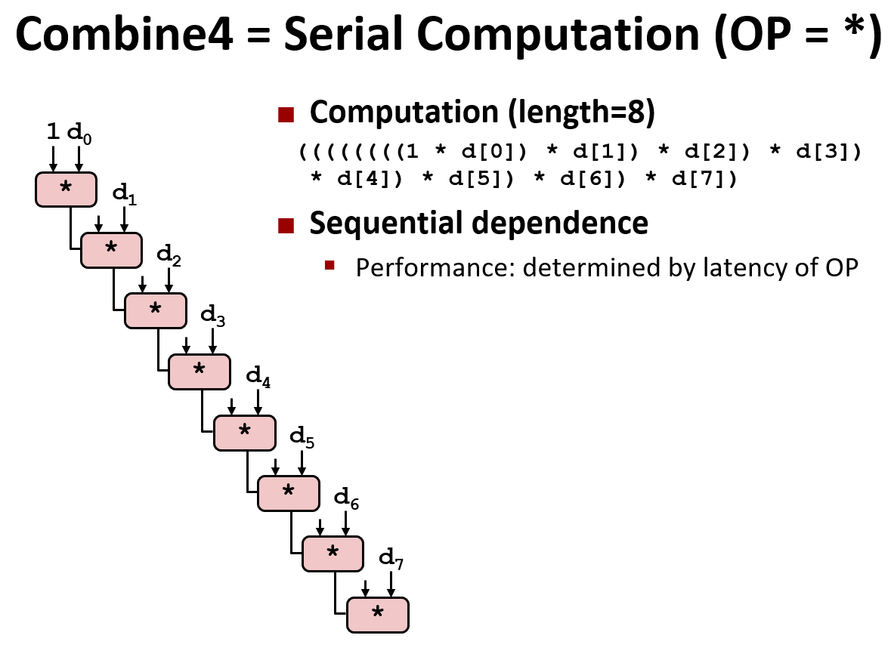


进行一系列的乘法运算, 并且在开始下一个之前，需要上一次乘法的结果

这个循环代码,必须先计算乘法，更新 %ecx 的值, 然后更新 i 的值，再开始下一次循环

所以这就是为什么，即使有一个流水线乘法器, 但程序本身限制了所有乘法必须顺序执行


这里采用了一种技术叫做循环展开, 基本思想是: 在循环中计算多个值，而不是一个值

```c
void unroll2a_combine(vec_ptr v, data_t *dest) {
    long length = vec_length(v);
    long limit = length-1;
    data_t *d = get_vec_start(v);
    data_t x = IDENT;
    long i;
    /* Combine 2 elements at a time */
    for (i = 0; i < limit; i+=2) {
        x = (x OP d[i]) OP d[i+1];
    }
    /* Finish any remaining elements */
    for (; i < length; i++) {
        x = x OP d[i];
    }
    *dest = x;
}
```
这段代码展示了 2*1 循环展开, 也就是每次循环处理数组的两个元素

在循环内部，计算 x 和 d[i] 及 d[i+1] 的和或乘积, 必须加入一些额外的代码才能完成

这段代码帮助整数相加达到延迟边界，整数加法的速度提升了, 但其他的根本没有改善

但这个更快是因为原来的代码在循环的计数上的开销比较大, 因为原来的代码已经接近一个时钟周期

但这里的代码没有超越这个特定指令的延迟界限, 是因为这段代码也需要顺序执行

为了获得 x 的新值，必须先乘以 d[i]，然后乘以 d[i+1]，然后开始另一次循环


**但可以做一个非常小的改变，就可以让性能显著提升**

```c
//Int *, FP +, FP * 的速度提升近2倍
void unroll2aa_combine(vec_ptr v, data_t *dest) {
    long length = vec_length(v);
    long limit = length-1;
    data_t *d = get_vec_start(v);
    data_t x = IDENT;
    long i;
    /* Combine 2 elements at a time */
    for (i = 0; i < limit; i+=2) {
        //before: x = (x OP d[i]) OP d[i+1];
        x = x OP (d[i] OP d[i+1]);
    }
    /* Finish any remaining elements */
    for (; i < length; i++) {
        x = x OP d[i];
    }
    *dest = x;
}

```

> 我把这种展开称为 2*1 循环展开, 我会在一分钟内解释它的含义
> 我这里用小写字母来表示我做的这个基于结合律的转换
> 你可以发现这样转换之后，三种情况下时间都变为了原来的一半

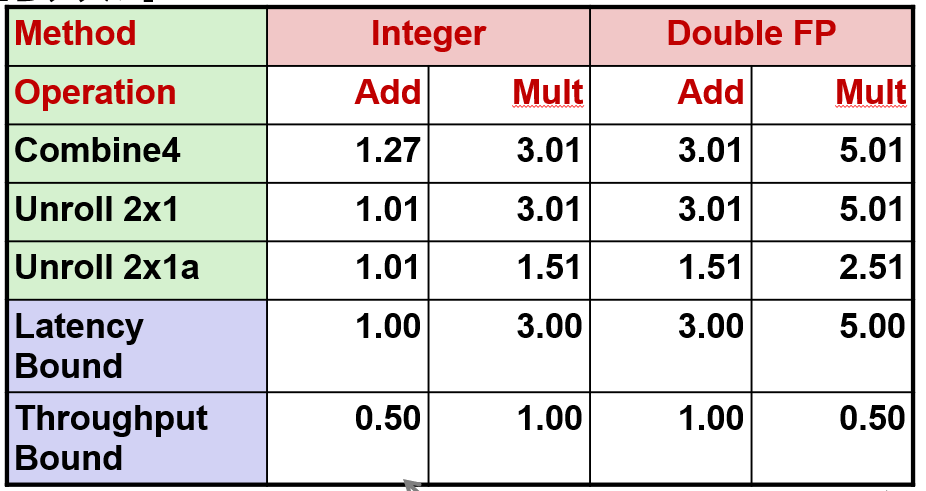

上面的改动改变了计算的结构, 改变之后先计算数组中的两个元素的乘积, 然后将它们累积到整体的积中

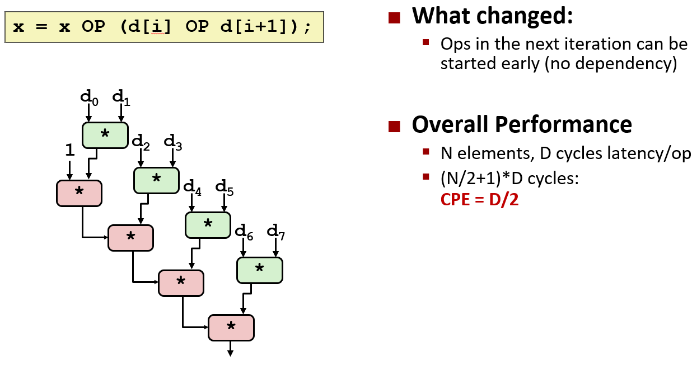


改动之后决定性能的关键路径已经变成了上面这张图, 它的关键路径恰好是前面的一半, 这就是运行速度是前面的两倍的原因


但这个转换没有提升整数加法的性能, 但对于其他三个运算，速度已经提升了一倍，仅仅是改变了括号的位置

二进制补码的加法和乘法运算满足交换律和结合律, 所以整数的乘法和加法进行这种转换都是没问题的

无论将这些元素以任意的顺序组合组合，都会得到完全相同的答案，但对于浮点数的运算，并不满足结合律

所以对于浮点数运算，如果移动这些括号，由于可能出现舍入（如大数加小数，小数会被忽略），甚至是溢出的情况，可能会导致计算的结果不同


> 但即使发生舍入的情况比较少，但也足够让大多数的编译器不会改变浮点数的结合性，因为它们对浮点数计算的优化非常保守
> 
> 应用程序员，你必须要充分了解这些东西, 知道做某个转换是不是可能导致错误的结果

## 吞吐量限制

延迟界限是指在一系列操作必须严格顺序执行时，执行一条指令所要花费的全部时间

> 但还有一个更基本的界限，我称之为吞吐量限制. 这个限制是基于硬件的数量和性能, 基于功能单元的原始计算能力

> 例如上面两个操作的吞吐量界限是 0.5，因为它受限于下面的要求， 我必须把数据从内存中读出来

> 我只有一个整数乘法器，一个整数加法器, 因为这是硬件设计的一个奇怪的地方，它有两个两个浮点乘法器, 但只有一个浮点加法器

> 所以，这里乘法实际上比加法运行得更快, 这里虽然我有 4 个加法器，但只有两个加载(load)单元，所以性能受限于加载单元

> 因为我必须先从内存中读取一个元素, 所以我不能低于 0.5


> 我们现在来看看这段代码实现的转化, **它使我们突破了延迟界限，接近于吞吐量界限**
```c
void unroll2a_combine(vec_ptr v, data_t *dest) {
    long length = vec_length(v);
    long limit = length-1;
    data_t *d = get_vec_start(v);
    data_t x0 = IDENT;
    data_t x1 = IDENT;
    long i;
    /* Combine 2 elements at a time */
    for (i = 0; i < limit; i+=2) {
       x0 = x0 OP d[i];
       x1 = x1 OP d[i+1];
    }
    /* Finish any remaining elements */
    for (; i < length; i++) {
    x0 = x0 OP d[i];
    }
    *dest = x0 OP x1;
}
// 不同形式的重组
```

## 多个累加器

> 下面是种可以获得更多并行性的技术, **我称之为多个累加器**

在数组中有索引为奇数的元素和索引为偶数的元素, 可以分别计算这两组元素的和或积, 然后最后将它们组合在一起

所以这是另一种形式的结合律变换, 这改变了元素组合的顺序, 将索引为奇数的组合在一起，索引为偶数的组合在一起

一般来说，我们可以通过参数 i 来将数组划分为多份


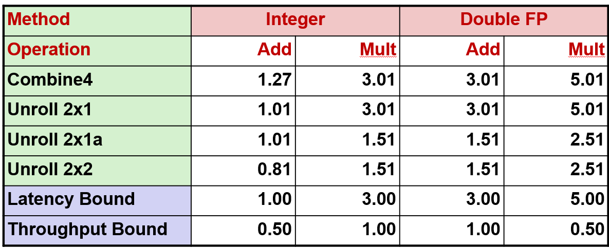

它和前面的转化有同样的问题: 浮点数运算时存在改变程序行为的风险, 而且会看到整数除加法外，其他的操作运行时间是原来的一半, 但比整数的加法要慢一点

下面的图表示了我们的计算顺序, 在这里计算所有偶数, 把偶数编号的元素组合在一起，这里所有奇数编号的元素, 最后将二者的结果组合在一起

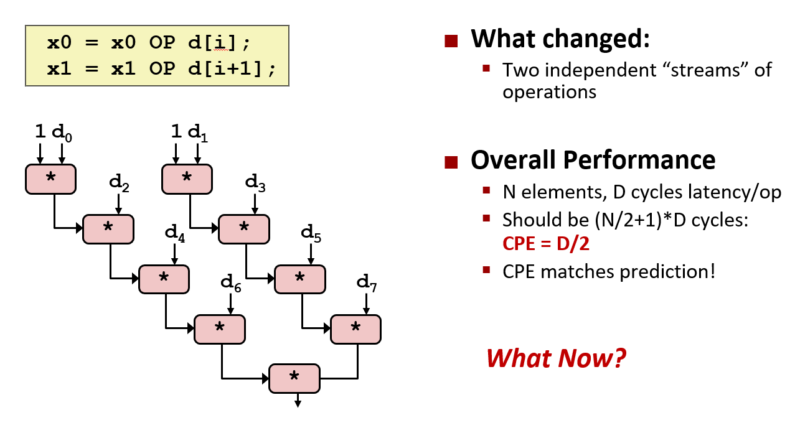

进一步可以将其一般化，可以以 K 为因子展开一个长度为 L 的数组, 这样可以并行计算 K 个值. 可以使用不同的 l 和 K 值, 一般来说 L 必须是 K 的倍数

更改 K 和 L 的值运行程序，这里是浮点数乘法的结果和整数加法的结果。实际上运行速度可以接近吞吐量极限 0.5

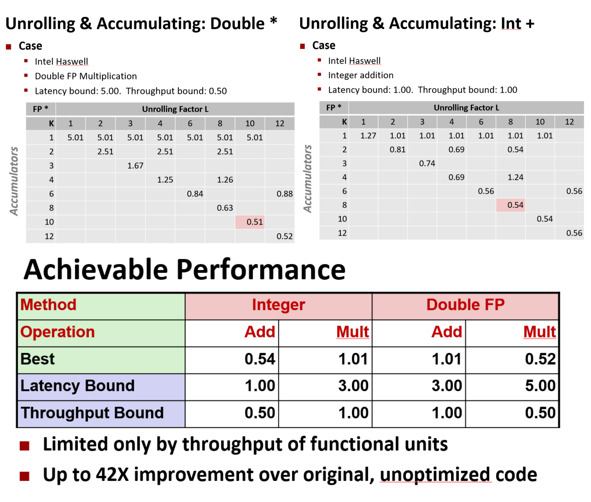

一般来说，通过选择最佳参数，运行速度可以非常接近这个处理器的吞吐量界限


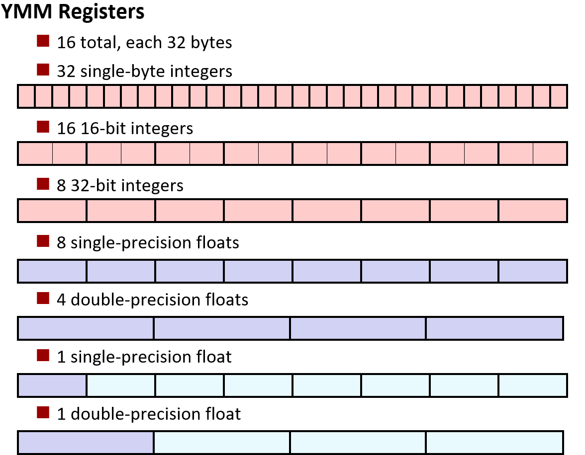


讲浮点提到过有一组特殊的寄存器, 在 x86 的机器上，称为 ％xmm 寄存器. 

而现在新一代的 CPU 上，增加了一个叫做 ％ymm 的寄存器. 它的大小是 ％xmm 寄存器的两倍, 所以这些寄存器有 32 个字节

> 并且 Intel 会在一年内推出一个新的名为 AVX512 版本, 寄存器为 512 位，因此长度应该是 64 字节，所以它的长度是 %ymm 长度的两倍

> 正如我之前提到的，你可以将它们视为 32 个 1 字节的整数, 或者把它们视为浮点数. 浮点数使用这些寄存器的低 4 位或低 8 位


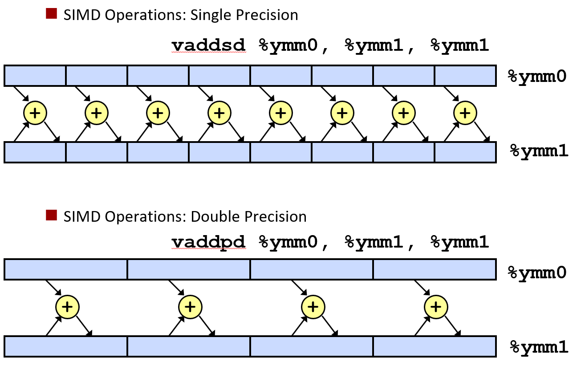

有一些称为**矢量加法**的指令, 其中一条**矢量加法指令**具有执行八次单精度浮点加法的效果, 或者相当于 4 次双精度浮点加法

但这个硬件很少处于繁忙的状态, 如果这个硬件繁忙起来, 这样可以较大的提升乘法性能. 可以在三个时钟周期内，并行进行八次浮点流水线乘法

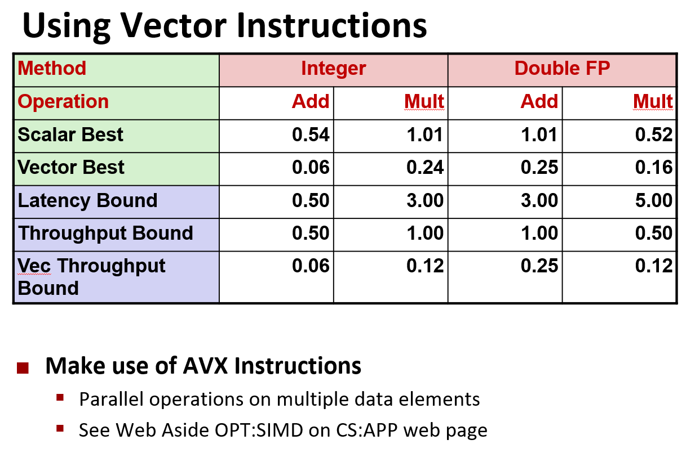
如果把代码改写为矢量代码, 可以看到 CPE 降低了 4 倍. 这个 0.06 是 0.0625

> 正如我所提到的，shark 机器是一个早期版本，它的 %ymm 寄存器的长度是这里的一半, 因此它可以同时执行 4 个单精度或两个双精度的浮点数运算
> 
> 它每个时钟周期执行 16 次操作（原来每个时钟周期执行 2 次操作，提升了 8 倍）
> 
> 但是我们最多只能接近矢量吞吐量界限


> 你可以想象，这些指令是为视频、声音、图象处理而引入的, 这些信号处理的程序对性能的要求很高. 如，显示图像的速度有多快，将某个图象旋转速度有多快. 

> 渲染图象速度的快慢影响很大. 在电脑游戏中这是一个关键因素，在其他领域也比较重要，如你拍摄一张照片. 这些指令就是为了这些情景设计的

> 人们为这些应用程序编写代码, 他们需要编写这种向量化的代码. 不幸的是，虽然 intel 编译器会自动做一些这方面的优化

> 但 gcc 虽然尝试去实现这种优化, 但实际效果不好，可能 gcc 已经没有继续这个优化了

> 这里有一个网络旁注, 对应的网页上讲了如何进行这种向量化的编程，有兴趣你可以试试. 网页上还有一些 gcc 的扩展

> 但是你可以编写代码, 然后利用 gcc 的扩展（补充）编译，这样就可以利用这些矢量指令. 这是我的做法，也是我得到这个性能的测试结果的方法

> 还有一点，这种优化是针对某个机器的. 如果你要在不同的机器上运行程序，你需要调整 gcc 的选项, 这种优化依赖于 gcc

## 分支

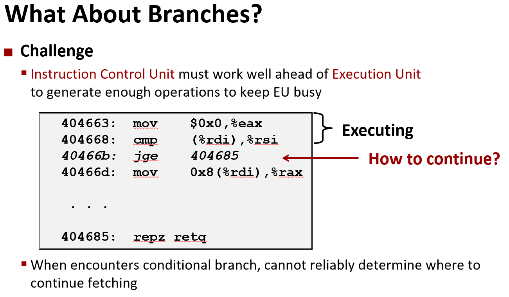

前面的程序是一个非常长的顺序结构的指令, 然后 CPU 一次读取尽可能多的指令，然后把这些指令分开.

但这里的程序实际上是一个循环, 并且循环中的指令不多. 把它变成一个顺序指令依赖于处理条件指令的方法

现在知道 CPU 会读取指令, 如果指令中有跳转指令，CPU 会跳转到对应的分支中去执行

这里就出现了一个**两难的境地**: 如果条件满足，它会跳转到对应的对应的分支, 如果条件不满足，它会继续执行后面的代码

并且**没有办法事先知道**哪个会被执行，因为这与数据有关. 在现代处理器是向下面这样处理这种情况的

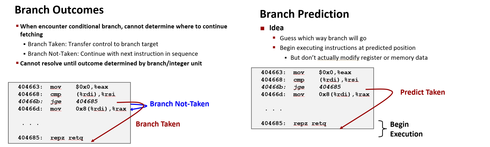


它采用所谓的分支预测，但本质上是猜测哪一个分支会被执行, 然后 CPU 会执行对应分支的代码

但执行对应代码的时候，必须能够保证没有对该程序造成不可修复的损害, 下面解释这意味着什么.


指令控制单元（上半部分）中有许多逻辑单元, 指令高速缓存会读取指令

如果遇到了分支，会先执行某个分支，当执行到后面(乱序), 发现预测是正确的，就会接着往下面指令

如果预测不正确可能要回到 100 个时钟周期前(这不是很久以前的事), 需要回到分支点，然后开始取出和指令另一个方向上的指令


跳转指令的指令变成了这样, 先执行猜测的分支，然后在后面判断猜测是否正确

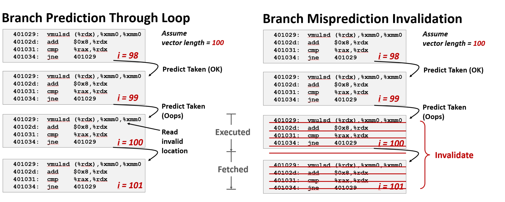


总的来说它会以一种方式预测并开始执行一个分支, 举个例子: 

这里有一个循环, 预测不会跳转，执行后面的内容，然后会再次回到循环的开始

尽管这是一个正确的猜测, 但会继续这么猜, 因此程序继续执行循环体的内容, 通过这种方式，创建了一个长的顺序指令序列, 功能单元可以读取并执行

一般来说，一些指令是有效的，而一些指令是多余的, 因为已经完成了所有的操作

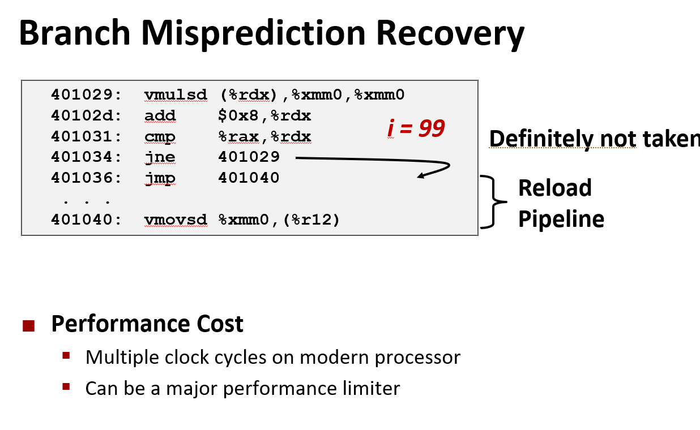


然后继续执行的时候，一个标志位会提示当前的分支不是无效的, 然后它会返回, 并且取消所有已读取并执行的指令

注意，这里所有的指令都只修改寄存器, 并且它有所有寄存器的多个副本

回退的时候，这些寄存器每一次计算的结果都依次保存在寄存器副本中，所以猜测正确的在前，猜测错误的在后

因此，当需要取消它时，只需取消所有待处理的更新, 并把正确的值返回（前面是存储在副本中，并没有真正更新寄存器）


这位同学有什么问题吗
在 CPU 中，有一个寄存器重命名块
它对每一个寄存器都有多个副本，计算的结果就保存在这些副本中


对于每个寄存器，它通常有几百个虚拟寄存器(副本)用于存储需要更新到实际寄存器的值

> 它记录更新的次数，知道这是第一次更新，这是第二次更新，这是第三次更新
> 它记录了你可以想象的一切，这不是你在一学期课程中能够学完的内容
> 它需要记录所有的内容，所以，确保它能够正常工作相当棘手

> 但从概念上讲，这是一个非常简单的想法, 它只是基于猜测提前做了许多工作, 然后只有在出错的情况下才会回退到某一个点

> 好像它只执行到了那个点然后它继续执行后面正确的分支, 它是如何回退的，这是非常有趣且棘手的内容

> 我们在课程的早期谈过, 关于条件传送和条件分支代码的区别（书 P145）. 条件传送可以在管道的结构内进行

> 如果是条件分支代码，并且是一个不可预测的数据可能会执行大量无效的工作

> 但更糟糕的是，当它不得不回来重新启动时, 需要一段时间来填充系统中的所有缓冲区才能继续执行后面的代码