# The Memory Hierarchy


> 当我们在学习汇编语言程序的时候, 将内存视为一个字节数组: 是可以用地址作为下标来访问的一个大的字节数组

> 但实际上，存储系统是一个非常复杂的设备层次结构: 提供了一个抽象，把内存结构抽象成一个大的线性数组

## 内存的概念
实际生活常说的内存其实叫做随机访问存储器(Random-Access Memory (RAM)). 传统上被打包成芯片, 然后有很多个这样的芯片组合起来成为主存(内存条)

最基本的存储单位称为单元(cell)，一个单元存储一个 bit. 

RAM 可以分为两种: 一种是 SRAM(静态RAM) 另一种是 DRAM(动态RAM). 它们之间是根据**存储单元实现方式**来区分的

### SRAM vs DRAM

DRAM 只需要一个晶体管去存储一比特，而 SRAM 更复杂，需要约 4 或 6 个晶体管

||Trans per bit|Access time|Needs refresh|Needs EDC|Cost|Applications|
|-|-|-|-|-|-|-|
|SRAM|4 or 6|1X|No|Maybe|100x|高速缓冲存储器|
|DRAM|1|10X|Yes|Yes|1x|主储存器, 显存|


**所以 SRAM 的成本会高得多, 因为 SRAM 的每一个存储单元都比 DRAM 复杂的多, 但 SRAM 的速度也比 DRAM 快一个数量级**


DRAM 是需要被刷新的: 如果没有用一定的电​​压去充电, 它就会丢失电荷，丢失所保存的信息，所以 DRAM 是需要插着电用的: 如果有在充电，那就不需要被刷新


SRAM 就比 DRAM 更加地可靠, 所以不太需要进行错误检测和纠正, SRAM 比 DRAM 更小，速度更快

因此将 SRAM 用于那些**内存容量小但速度非常快**的芯片中，**叫做高速缓存**。相比之下，DRAM 被广泛运用于主存，以及图形显卡中的帧缓存中


### 非易失性存储器
DRAM 和 SRAM 都是易失性存储器: 意味着如果断电，就会丢失它们所保存的信息, 这也是为什么当关掉电脑后，会丢掉所有内存中的东西. 再把电脑打开后，需要从硬盘中重新加载所有东西


另一种存储器称为非易失性存储器: 即使断电的情况下也可以保存其中的内容, 很多这些东西被称为只读内存, 这些非易失性存储器的通用名称是只读存储器(ROM)


曾经很多最初的不同类型的 ROM, 它们只可以在其芯片生产期间被硬编码一次, 然后可以用 20 或 30 年的时间

现在 ROM 的编程方式和删除方式都有所改进, 它们可以被重新编码

|只读存储器(ROM)|可编程 ROM(PROM)|可擦PROM(EPROM)|电子可擦 PROM (EEPROM)|闪存(EEPROMs)|
|-|-|-|-|-|
|可编程|可编程一次|可大容量擦除(紫外线，X 射线)|电子擦除能力|具有部分(块级)擦除功能, 擦除约 100,000 次后会磨损|


现代形式的只读内存被称为闪存, 它提供了擦除功能，可以删除闪存上面的存储块: 缺点是**闪存在擦除后再重新编码约十万次后就会磨损**

非易失性存储器在固件和软件中使用:
+ 存储在 ROM 中的固件程序(BIOS、磁盘控制器、网卡、图形加速器、安全子系统等)
- 固态磁盘(取代闪存盘、智能手机、mp3播放器、平板电脑、笔记本电脑中的旋转磁盘)
- 磁盘缓存

可以对 ROM 进行硬编码: 当开启电脑时会调用的 BIOS 和开机后执行的最初的指令，都存储在 ROM 中


然后有一个 boot 引导程序: 越来越多的信息和指令都被装载到内存中

> I/O 设备中也有小型的计算机，称为控制器. 控制器由存储在 ROM 中的指令和数据组成, 你还可以在这些固态硬盘(SSD)中看到它们

系统仍然把它们当作旋转的硬盘, 但它们实际上是由闪存构成的: 就是在 U 盘、智能手机、平板电脑和笔记本电脑中能看到的那些, 甚至也在服务器中被使用

## 连接 CPU 和存储器的传统总线结构

主存是通过一些电子线路连接到 CPU 的，被称为总线(主线(bus)): 总线是传输地址、数据和控制信号的并行导线的集合。总线通常由多个设备共享。

数据流就可以通过这些电子线路从内存和 CPU 芯片之间来回传输


CPU 芯片中有一些寄存器，例如通用寄存器：％rax，％rdi 等等

有一个算术逻辑单元(ALU)会从寄存器文件读写数据: 对数据进行一定的算术运算和逻辑运算. 

如果指令需要访存, 则执行一个移动指令 (mov) ，移动指令会读写内存, 然后由总线接口处理，总线接口与系统总线相连接。

然后连接到 I/O 桥, 然后 I/O 桥连接到另一条主线，叫做存储器主线，连接 I/O 桥与主存

> I/O 桥是另一个芯片集合，我所称的 I/O 桥，英特尔称之为芯片组, 是与 CPU 芯片区分开来一个芯片集合

> 这只是一种抽象，我不希望你们太在字面意义上较真, 但它让你了解信息如何在系统中流动. 
> 现代系统使用的专有总线设计，它们非常神秘且越来越复杂, 所以我们才在这里使用一个非常简易的总线系统抽象

## 内存读事务
假设执行 movq 指令进行了一个装载操作: 将 A 地址处的 8 个字节加载到寄存器 %rax

所以当 CPU 执行 movq 指令时，是像这样进行的: 
- CPU 将 A 的地址放到存储器主线上
- 主存储器感知到这个信号后，会从该地址取得一个 8 字节的字的内容
- 然后将这些比特通过 I/O 桥上传递回总线接口
- 最后 CPU 从总线数据中读取这个字 x，然后放到寄存器 %rax 中


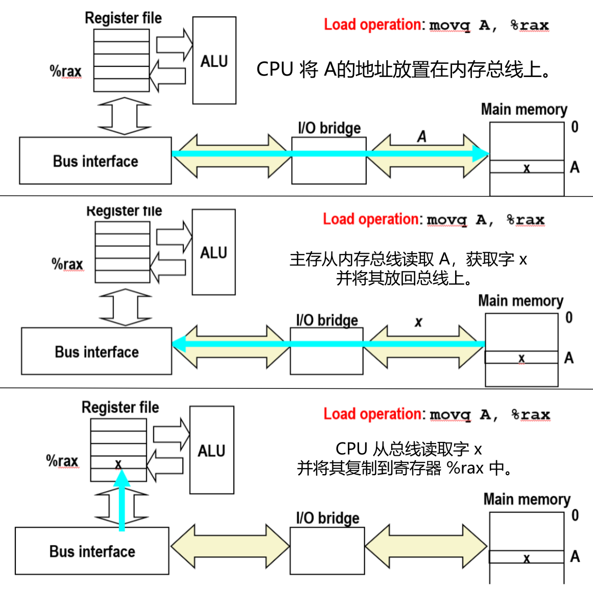

> 之所以称之为加载(load)，是从 CPU 的角度出发来考虑的. 我们是加载数据到 CPU 中, 但实际上我们是从主存中加载数据到 CPU 的


## 内存写事务


这里执行一个指令 movq: 将寄存器 %rax 的内容写入主存中地址为 A 的位置

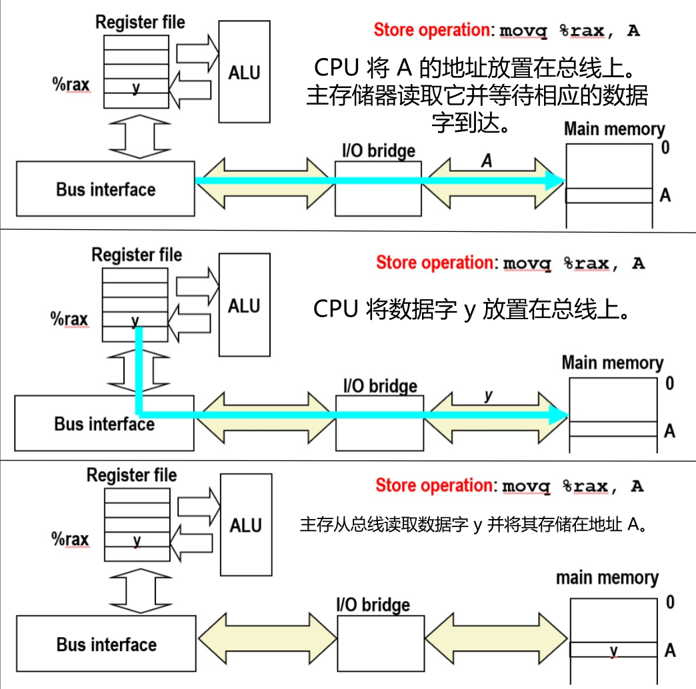


起初 CPU 也将地址写到总线上, 主存读取这个地址，然后等待数据到达总线, 接着 CPU 将寄存器 %rax 的内容放到总线上

这些数据传输到主存, 主存读取这些数据，将其存放到地址 A 处. 其**中的关键点在于其中的操作: 寄存器的读写**


因为寄存器文件是很接近算术逻辑单元的, 所以这些操作的速度都很快, 这一切都发生在大约几个 CPU 周期内

然而内存实际上是非常远离 CPU 的一些芯片组, 当需要读写内存时，那么会发生很多事情: 必须在总线上做多个操作，数据必须通过该总线传播. 所有这些操作都需要时间


所以对于内存的读写，典型地都需要大约 50 或 100 纳秒. 而寄存器之间的一些操作所需时间甚至不到 1 纳秒. 所以它们之间大约差了两个数量级

## 磁盘

> 现在还有另一项广泛应用的存储技术就是硬盘. 不知道你们有没有拆过硬盘，蛮有趣的

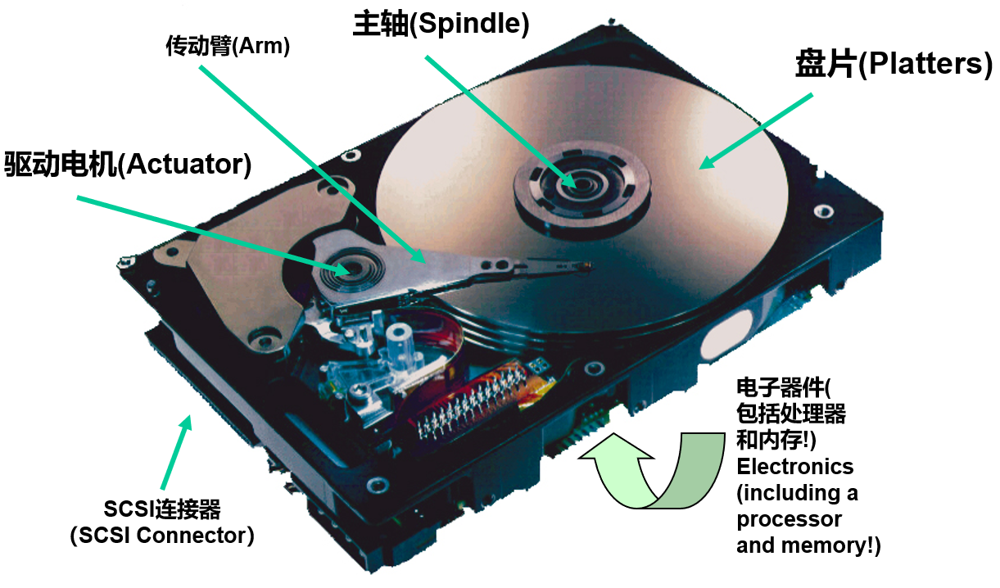

硬盘其实是一系列的盘片, 每个盘片都涂有磁性材料, 然后在该磁性材料中编码 1 和 0 的二进制位

有一个部件叫做传动臂，铰接在驱动电机那里。它漂浮在盘片上方的薄薄一层空气中

在传动臂最细的末端有一个读/写头，可以感知编码位的磁场变化。这些盘片像逆时针一样旋转，这样磁臂可以前后移动

所以有很多齿轮等机械装置，这些都是机械设备，所以旋转磁盘的机械性质，意味着它会比 DRAM 和 SRAM 慢


而且它还有电子设备，就像固件中的一台小电脑一样，控制了驱动器的操作，该驱动器控制磁臂如何来回移动。并且控制如何从读/写头读取数据

### 磁盘结构

可以认为磁盘是由盘片组成的, 一个盘片有两个表面，上面和下面。每一个表面都包含一系列的同心圆，称之为磁道。

每一个磁道包含很多个扇区，扇区存储着数据。典型地，一个扇区存储 512 个字节。

在这些扇区之间有一些空隙, 这些空隙是不保存数据的

盘片在主轴上是彼此对齐的，在不同表面上，轨道也是对齐的

这些轨道的集合，称之为一个柱面，因为它形成一个圆柱形

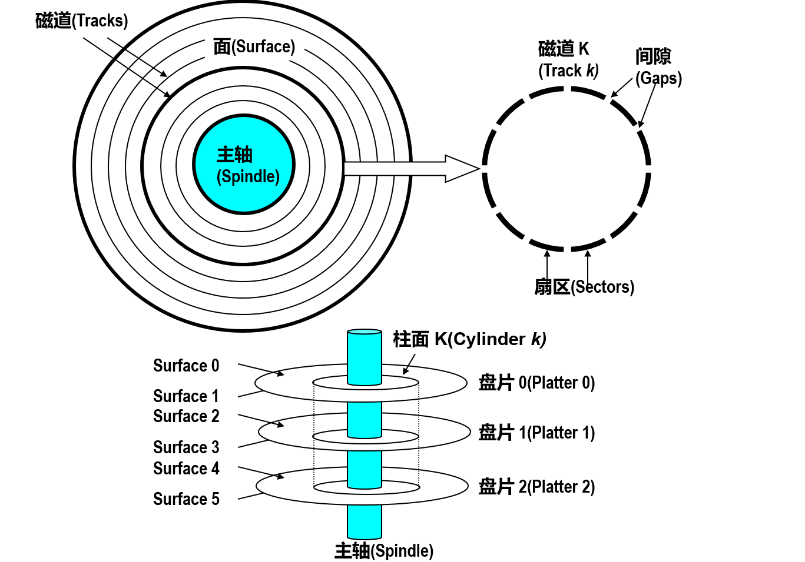


### 磁盘容量

磁盘的容量就是它可以存储的位数。所有供应商都以千兆字节(GB)为单位来表达磁盘容量

> 这里的 1GB 是 10^9 字节而不是你所想的 2^20 字节, 我也不确定他们为什么这样做......

以 10^9 字节作为容量的单位是一个更大的数字, 所以看起来好像可以存储更多的信息

> 我不知道他们为什么这样做，但我认为可能原因就是那样的。有点烦人，所以我们需要了解，然后习惯这个设定


磁盘的容量的大小是由下面这些因素决定的: 

记录密度(bits/in): 单独一个扇区可以存储多少比特。或者至少是一个磁道的一部分。可以被压缩到轨道的1英寸段中的比特数。

轨道密度(tracks/in): 指可以将相邻的磁道放置得多临近。可以被挤压成1英寸径向段的轨道的数量。

面密度(bits/in2): 记录和磁道密度的乘积。决定了整个磁盘的存储容量。


#### 计算磁盘容量

> 计算磁盘容量的公式是相当简单的: 它是每个扇区的字节数 * 每个磁道上的平均扇区数 * 每个盘面的平均磁道数 * 一个盘片的盘面数 * 磁盘中盘片的数量


```
Capacity =  (# bytes/sector) * (avg. # sectors/track) *
            (# tracks/surface) * (# surfaces/platter) *
            (# platters/disk)
```

<div style="display: flex; gap: 20px; align-items: flex-start;">

```
512 bytes/sector
300 sectors/track (on average)
20,000 tracks/surface
2 surfaces/platter
5 platters/disk
```
```
Capacity = 512 x 300 x 20000 x 2 x 5
         = 30,720,000,000
                = 30.72 GB 

```
</div>


### 记录区


曾经磁盘的面密度相当低, 磁面上每一个磁道所包含的扇区数量是相等的, 每一个磁道所包含的扇区数是一个常数。

而现在的磁道有的比较靠近中心, 有的则较为边缘的, 如果磁道是由相同比特密度的扇区组成。那么越往外，扇区间的间隙会越变越大: 这将会浪费越来越多的磁面上的空间

在面密度比较低的时候这还可以接受, 但随着技术发展，浪费空间就不太能被接受了

现代的系统**为处理扇区之间的间隙变得过大**所做的改进是: **现代磁盘将磁道划分为不相交的子集: 称为记录区**。  
- 一个记录区中的每条轨道都有相同数量的扇区，由最内层轨道的周长决定。
- 每个区域都有不同数量的扇区/轨道，外部区域比内部区域有更多扇区/轨道。
- 在计算容量时使用扇区/轨道的平均数量。 		


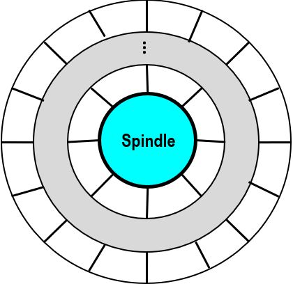

每一个记录区里的每一条磁道都包含相同数量的扇区。越靠外的记录区, 扇区之间的空隙会越来越大。

记录区的每一条磁道里会有更多的扇区: 在靠外的磁道，会比靠内的磁道有着更多的扇区


每一条磁道所包含的扇区数不再是一个常数: 因此使用平均值，也就是每条磁道平均包含的扇区数。用所有记录区的平均每条磁道扇区数来估计整个磁盘的容量


### 磁盘操作

#### 单个盘片
磁盘表面都以一个固定的频率在旋转: 现在典型的速率可能是 7200 转/分钟，这是相当常见的转速

磁盘逆时针旋转，然后磁臂沿着半径轴前后移动，磁臂沿着半径轴前后移动，可以定位到任何一个磁道上


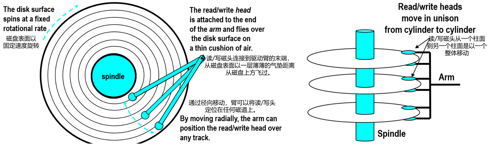

#### 多个盘片
每一个盘片实际上都有多个磁臂, 每个表面上都有一个读/写头: 所以一个盘片上面下面各一个磁头，共2个磁头。

磁头涂上这种磁性材料, 每一侧都有一个读/写头, 然后这些都是连接在一起的，一起移动

原始的这种读/写头将是很死板的, 因为那时候的磁道密度没有那么高, 所以即使磁道没有很好地对齐, 读/写磁头仍然可以用这种固定的磁臂覆盖所有磁道

现如今磁道密度如此之高, 实际上控制器实际上可以移动读/写头一点点, 这样它就匹配了所有表面上的所有轨道


### 磁盘访问

黑色箭头是磁臂, 箭头的尖端是读/写头, 并且它被定位并且盘片逆时针旋转

读写头当前的位置正好可以读这个蓝色的扇区. 当蓝色扇区在读/写头下旋转, 它会检测这些比特，并将它们发送到控制器，控制器将它们传递回CPU


CPU请求磁盘读写红色扇区的数据: 控制器需要操控读/写头, 先将其移回红色扇区所在的磁道, 然后等待磁盘旋转, 等到该扇区旋转到读写头的下方, 然后读取红色扇区中的数据

一共有三个因素决定着阅读其中一个扇区需要多长时间下：

**寻道时间**：将磁盘的读写头移动到目标数据所在轨道的机械动作所需的时间。

**旋转延迟**：等待目标扇区旋转至读写头下方所花费的时间。在平均情况下，这通常等于磁盘旋转一整圈所需时间的一半。

**传输时间**：当读写头定位到目标扇区后，实际进行数据读写，即数据在读写头下通过并完成传输所需的时间。

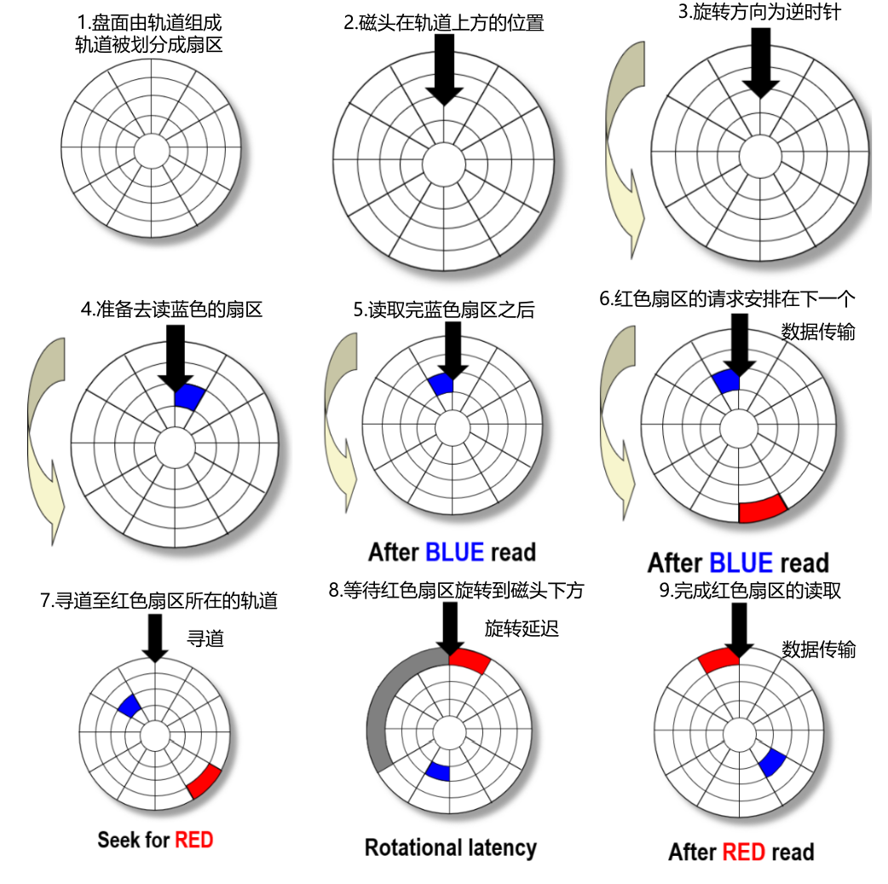

### 磁盘访问时间
这三个因素，将它们加在一起，这就是你的平均值
磁盘访问数据的平均时间

访问某个目标扇区的平均时间近似为:
```
Taccess = Tavg seek + Tavg rotation + Tavg transfer 
平均时间 = 寻道时间 + 旋转延迟 + 传输时间
```

#### 寻道时间
寻道时间(Tavg seek)是以毫秒为单位测量的。寻道就是把磁头放置在包含目标扇区的柱面上方的时间。

> 典型的平均寻道时间为 3—9 ms, 这已经存在了几十年。这个值是改不了的, 这是一种基本的机械限制, 这使得降低这个值非常困难

#### 旋转延迟
旋转所需的时间称之为旋转延迟(Tavg rotation), 也就是平均旋转的时间。可以说是等待目标扇区的第一位通过r/w磁头下方的时间。

- Tavg rotation = 1/2 x 1/RPMs x 60 sec/1 min

- Typical Tavg rotation = 7200 RPMs

#### 传输时间
磁头读取目标扇区中的比特的时间称之为传输时间(Tavg transfer)。
- Tavg transfer = 1/RPM x 1/(avg # sectors/track) x 60 secs/1 min.

#### 示例

寻道时间和旋转延迟是毫秒级, 机械限制了可以用多快的速度旋转它们

传输时间是非常短的, 所以它的数量级要小一些，因为只需要读扇区中的一些位。**一个扇区的第一个比特是最昂贵的，其余的都可以认为是免费的。**


所以可以看到总访问时间主要是寻道时间和旋转延迟, 传输时间基本上可以忽略不计的。**访问时间主要由寻道时间和旋转延迟决定。**

> 所以这儿有一个好的经验法则，用于估计从磁盘读取数据所需的时间: 就是两倍的寻道时间，就很精准了 

|已知|旋转速率|平均寻道时间|Avg # sectors/trac|
|-|-|-|-|
||7,200 RPM|9 ms.|400|


|可得|Tavg rotation|Tavg transfer|Taccess|
|-|-|-|-|
||1/2 x (60 secs/7200 RPM) x 1000 ms/sec = 4 ms.|0/7200 RPM x 1/400 secs/track x 1000 ms/sec = 0.02 ms|9 ms + 4 ms + 0.02 ms|


SRAM 范围时间大概是 4 ns/doubleword, DRAM 大概是  60 ns
磁盘比SRAM

- 访问 SRAM 取得一个 double 类型的双字，时间大约为 4 纳秒
- 访问 DRAM 取得一个 double 类型的双字，时间大约为 60 纳秒

所以 DRAM 和 SRAM 之间存在很大差距, 磁盘和其他内存类型之间存在更大的差距

|存储类型|速度对比|相对 SRAM 的倍数|
|-|-|-|
|SRAM|基准速度|1 倍|
|DRAM|比 SRAM 慢一个数量级(约慢10倍)|≈ 10 倍|
|磁盘|比 SRAM 慢 40,000 倍|40,000 倍|

### 逻辑磁盘块

#### 从物理到逻辑的抽象
物理磁盘本身的结构非常复杂，由盘片、磁道、扇区、柱面组成，而且现代磁盘每个磁道的扇区数可能还不一样。

为了让操作系统和CPU不必处理这些复杂的物理细节，现代磁盘控制器提供了一个简单的接口。

它将磁盘上的所有可用数据存储空间看作一个由编号连续的逻辑块组成的线性序列(从0， 1， 2开始编号)。每个逻辑块通常对应一个物理扇区(或其整数倍)。

> 刚才提到的是磁道、柱面、扇区等几何描述, 但实际上现代磁盘控制器是将磁盘作为一系列逻辑块提供给 CPU
> 
> 每个块是扇区大小的整数倍, 所以在最简单的情况下，块只是一个逻辑块或者说就是一个扇区
> 
> 块从零开始编号, 块号是一系列增长的数字, 然后磁盘控制器保持映射保持物理扇区和逻辑块之间的映射


#### 磁盘控制器与映射
**中间管理层**：由被称为磁盘控制器的硬件/固件设备来维护逻辑块和实际(物理)扇区之间的映射。

**地址转换**：当操作系统请求读取某个逻辑块时，磁盘控制器内部会执行一个映射操作，将这个逻辑块号转换成实际的物理地址(盘面、轨道、扇区)


#### 古老智慧

通过映射层，上层软件(操作系统)不需要关心底层硬件的细节，硬件可以自由管理内部布局，而无需修改上层软件。

> 计算机科学中古老的有趣的智慧就是涉及某种形式的间接, 所以这是一个间接层面, 让你了解逻辑块和物理块之间的映射

#### 坏道管理与容量差异
**预留备用空间**：磁盘出厂时，厂商会预留一些物理柱面(包含磁道和扇区)作为备用。这些备用柱面这些柱面没有被映射为逻辑块, 在逻辑块编号中是看不见的。

**热修复机制**：如果磁盘使用过程中，某个物理扇区坏了(比如磁介质损坏)，导致数据无法读写，磁盘控制器会自动执行以下操作：
- 将损坏扇区里的数据(如果有)写到某个备用柱面的空闲扇区中。
- 修改内部的映射表，让原来那个坏掉的逻辑块号指向新的好用的物理扇区。
- 上层操作系统和应用程序对此完全无感知，磁盘看起来依然能正常工作。


#### 容量缩水

买来标称 500GB 的硬盘，在操作系统里却只看到约 465GB，这主要是由以下两个原因造成的：

##### 主要原因：单位换算差异

硬盘厂商(十进制)： 为计算方便，采用 1 GB = 1000 MB 的换算。
操作系统(二进制)： 采用 1 GB = 1024 MB 的换算。

标称 500 GB = 500 × 1000 × 1000 × 1000 = 5000 亿字节
系统显示 = 5000 亿字节 ÷ 1024 ÷ 1024 ÷ 1024 ≈ 465 GB

这部分的差异导致了直观感受到的“缩水”(少了约35GB)。

##### 次要原因：物理备用空间
磁盘内部会预留一部分物理空间用于坏道管理，以保证硬盘的稳定性。

**注意： 这部分空间在厂商标称容量(如500GB)之前就已经被扣除了，它不包含在上述35GB的差额中，对最终用户看到的数字影响极小**。

## IO总线

像磁盘这样的设备，是通过 I/O 桥连接到一种叫做 I/O 总线的总线上，从而与 CPU 和内存相连的。

> 我现在向你展示的内容实际上并不代表现代系统就是这么简单的, 它代表了大约五年前所谓的 PCI 总线

### 广播总线
PCI 总线被称为广播总线, 是将事物连接在一起的最简单的方式, 这意味着它只是单一线路

如果这根总线上的任何设备更改了某个值, 该总线上的每个设备都可以看到这些值

### PCIe
现代系统采用 PCI Express作为总线结构。虽然名字里有“PCI”，但它实际上是点对点的架构。

设备通过一组专用的点对点链路连接到交换器，由交换器负责仲裁和数据转发。

> 我们不会深入探究其细节，它是一个更有效的设计。它更快，但它提供相同的功能: 它允许你将所有设备连接到 CPU

**因此只需将此总线视为一组电子线路即可**, 每根电线都带有一个比特的信息, 并且连接在总线上的每个设备都可以看到所有电线上的所有值


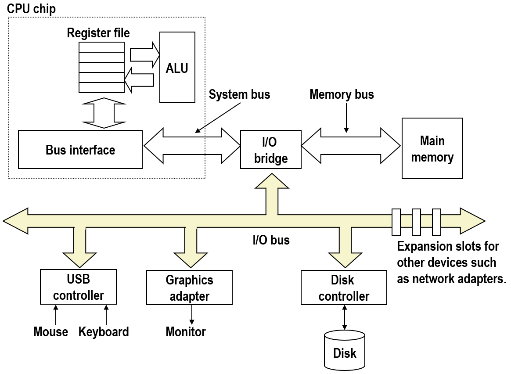

在计算机系统中，设备通过以下方式连接到总线：

**主板集成设备**：一些设备(如图形适配器、USB控制器)直接焊接在主板上，与总线相连。

**主板插槽设备**：磁盘等设备则通过插入主板上的专用插槽来连接总线。

**扩展插槽设备**：主板还提供了通用的扩展插槽(如 PCIe 插槽)，允许用户根据需要添加额外设备，例如网络适配器。


### 读取磁盘扇区


#### 图一
CPU 通过编写三元组来启动此读取行为: 所以它写了三个不同的值
- 写了个指令: 比如说 read
- 写入一个逻辑块号: 想读取的那个逻辑块的块号
- 想将该逻辑块的内容放在内存中的某个地址

**三要素就是指令、逻辑块号和内存地址**

#### 图二

假设一个逻辑块对应一个扇区: 当磁盘控制器接收到读取某个逻辑块的请求时, 会直接内存访问(DMA)。

首先，磁盘控制器获得 I/O 总线的控制权。然后，它通过 I/O 桥，将数据从磁盘经由 I/O 总线直接复制到主存储器。

在这个过程中，数据不需要经过 CPU，CPU 完全不需要参与数据传输，因此它可以继续执行其他任务，对这次传输毫无感知。

#### 图三
将数据一旦传输到主存储器, 它将使用这种称为**中断**的机制来通知 CPU

实际上 CPU 芯片本身上用了一个引脚, 磁盘控制器将该引脚的值从 0 更改为 1 来触发中断并通知 CPU: 目标扇区的数据已经复制到内存中了

CPU得知数据已就绪, 它可以执行正在等待这批数据的程序: 该程序现在可以处理内存中的数据

#### 为什么需要中断
**根本原因：磁盘I/O的速度远远慢于CPU**

- 从磁盘读取数据大约需要 10 毫秒
- 在这10毫秒内，CPU可以执行 数百万条指令

**无中断(轮询模式)：**

- CPU只能停下来，不断检查磁盘是否读完数据
- 这会导致CPU在等待期间无事可做，造成巨大的性能浪费

**有中断(中断驱动模式)：**

- CPU向磁盘控制器发出读取请求
- 磁盘缓慢读取的同时，CPU可以继续执行其他有用的工作
- 磁盘读取完成后，通过中断通知CPU
- CPU再来处理这批数据

结论： 中断机制对于获得合理的系统性能至关重要，它防止了慢速的磁盘系统拖慢整个系统的运行速度。


## 固态硬盘

固态硬盘(SSD)在性能上介于机械硬盘和 DRAM(内存) 之间。

对于 CPU 来说无需知道内部差异，可以直接用同样的方式访问: 具有相同的接口, 具有相同的物理接口, 具有相同的包装。


在 CPU 看来固态硬盘就是一个机械硬盘, 但 SSD 没有机械部件，而是以下两部分构成：
- 闪存芯片：实际存储数据的介质
- 固件(控制器)：管理闪存的逻辑，称为闪存翻译层(FTL，Flash Translation Layer)

在固态磁盘内部有一组称为闪存翻译层的固件: 闪存翻译层的作用**类似于旋转磁盘的磁盘控制器，负责管理数据的存储和访问。**


- 固态硬盘以页(Page)为单位从闪存读取和写入数据。
- 页的大小取决于技术的不同，可以是 512kb 到 4 kb
- 多个页组成一个块(Block)，一个块通常 32 到 128 页


**这里的“块”与 CPU 视角的“逻辑块”是两个不同的概念，只是术语巧合重叠。**


|操作|特点|限制|
|-|-|-|
|读|任意读取|无特殊限制，可直接读取任何页|
|写|只能写入已擦除的页|不能覆盖写入，必须先擦除整个块|


> **数据是以页为单位写入的: 一个页只能在所属的整个块都被擦除之后，才能写这一页**。好的，这似乎有点奇怪，但这就是它的工作方式

想要对固态硬盘进行写入必须进行以下步骤:
- **找空闲块**：找到一个已经被擦除的空闲块
- **复制数据**：将目标块中所有其他有效页复制到新块(或暂存区)
- **擦除原块**：擦除整个原块，使其变为可写状态
- **写入新页**：将新数据写入合适的位置

固态硬盘的写操作变得相当复杂，**涉及数据的搬移和块的擦除**。读操作没改变，还是可以读任何东西。


在经过十万次重复擦除块并写入后，这个块就会磨损, **现代 SSD 系统的闪存翻译层实现了各种优化算法来延长寿命**：
- **磨损均衡**：均匀分布写入操作，避免某些块过早损坏
- **缓存技术**：暂存写入数据，合并操作，减少擦写次数
- **垃圾回收**：后台整理无效数据，释放空闲块

由于这些优化，在实际使用中，SSD 的寿命问题并不突出。

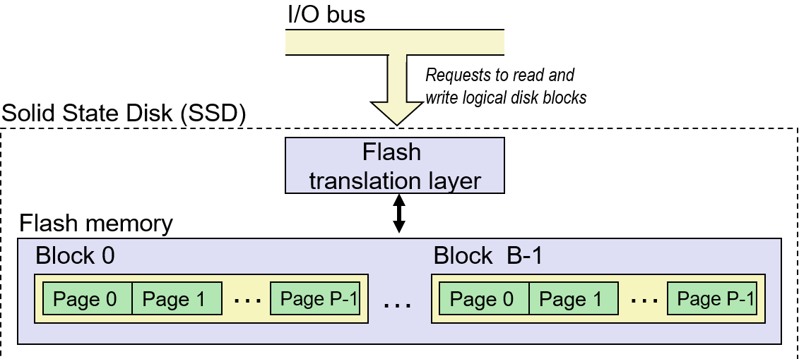

### 性能特点

|顺序读吞吐量|550 MB/s|顺序写吞吐量 470 MB/s|
|-|-|-|
|随机读吞吐量|365 MB/s|随机写吞吐量 303 MB/s|
|平均顺序读时间| 50 us|平均顺序写时间  60 us|

对比参考：传统机械硬盘(HDD)的典型读写速度约为 40–50 MB/s。而 SSD 的速度要快 10 倍, 对于顺序读取可以获得大约 550MB/s 的速度。

#### 顺序 > 随机
顺序访问比随机访问快是存储器层次结构中的常见情况

> 就是在内存系统中，按顺序执行操作几乎总是比在内存中跳来跳去更好

#### 随机写入更慢

**随机写入速度较慢的根本原因是 SSD 的擦除操作**：要修改某一页，必须将该页所在块中的所有其他有效页复制到新块，然后擦除整个原块，最后才能写入新页

- 擦除耗时：擦除一个块大约需要 1 毫秒
- 1 ms = 1000 μs，比正常访问时间(50–60 μs)高出约 20 倍


#### 技术演进

- 早期 SSD：随机写入与顺序读取之间存在巨大差距
- 现代 SSD：得益于闪存翻译层（FTL） 的改进，差距已大幅缩小。各种优化算法让读写性能更接近

#### 抽象模型
在系统层面，当我们使用 SSD 的抽象模型时，往往不需要严格区分读和写——接口对 CPU 是统一的，内部差异由控制器处理。

### SSD vs HDD


因为SSD没有移动部件，所以读写速度都非常快，消耗的电能也少，同时也更结实。

因此在抽象模型层面，可以不再像机械硬盘那样严格区分读和写操作的性能特征。


|优点|缺点|
|-|-|
|速度快（无寻道和旋转延迟）| 可能磨损（闪存有擦写次数限制）|
|省电（无机械电机）| 成本较高（每字节价格更贵）|
|更坚固（抗震、抗冲击）||

寿命问题可能是一个问题，但实际情况也不是大问题，因为：

- 闪存翻译层（FTL） 中实现了磨损均衡逻辑，均匀分布写入操作
- 现代SSD的寿命远超普通用户的需求

> 英特尔保证，在对于他们的产品(Intel SSD 730)，在损毁之前，你可以执行 128 PB 的写入。
> 那是很大量的数，我的意思是考虑一下要写那么多的数据够你写多少年了

截至2015年, 固态硬盘存储每个字节的成本比机械磁盘大约高出30倍

## CPU-Memory 差距
随着时间推移, 不同存储设备相对于 CPU 的的性能特征: DRAM、磁盘和CPU之间的速度差距越来越大。

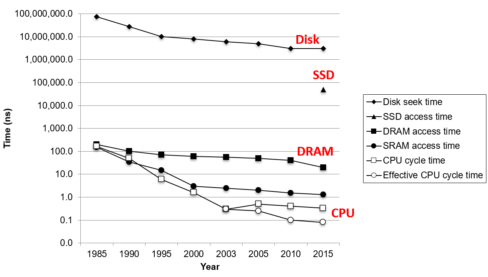

- 在 y 轴上, 标识访存所需要的时间，单位为纳秒，以 10 的指数为尺度: y 轴上相邻一格的变化，都表示访问时间的一个数量级差异
- 在 x 轴上, 绘制了从 1985 年到 2015 年的时间
- 绘制了硬盘、SSD、DRAN 和 SRAM 访存的时间 和一个 CPU 周期时间

### CPU性能演进

#### 2003年之前：频率翻倍时代

从 1985 年到 2003 年间, 一个 CPU 周期的时间以这种指数速度在下降

基本上每 18 个月或两年，时钟频率就会加倍(一个 CPU 周期的时间会减半)

制造商为了使他们的处理器更快，他们只会使时钟频率加倍: 
- 缩小制造的芯片特征尺寸：芯片上的晶体管做得更小, 把更多的部件放的更紧密
- 按比例提高时钟频率：更小的晶体管可以跑得更快


#### 2003年：能源瓶颈的转折点

有种不幸的特性: CPU 消耗的电能与其时钟频率成正比, CPU 越强，其时钟频率越高，消耗的功率越大

> 这一切都在 2003 年结束，这是计算机历史上有趣的一年
>
> 到 2003 年，英特尔准备新出品的处理器将耗费大约 800 瓦的功率
>
> 想象一下，你的笔记本电脑里面有一个 800 瓦的灯泡（笑


> 我实际上看到了其中一个设备的早期原型: 吸收芯片热量的散热器大约是四平方英寸大, 这在主板上简直是一个庞然大物
> 
> 所以这就是我们所说的处理器设计在 2003 年触及了能源的瓶颈


|时期|代表CPU/平台|典型功耗 (TDP)|散热器特点与规模|说明|
|-|-|-|-|-|
|2003年前后|Pentium 4 早期|约 50-80 W |铝挤压工艺，小型散热片+风扇 |这是上文提到的“能源瓶颈”爆发前夕。一个4平方英寸（约25cm²）的散热底座在当时已是“庞然大物”。|
|2003-2006年|Pentium 4 后期 (Prescott核心)|可突破 100 W|散热器体积和重量开始显著增加|为压制上百瓦的发热，散热器不得不变大。此时热管技术开始在高端领域普及，以提升导热效率 。|
|约2007-2017年|Core 2 Quad, 早期Core i7|95W - 130W 左右 |四热管、六热管的塔式侧吹散热器成为主流|为了在有限空间内增加散热面积，散热器开始向“高塔”发展，高度逐渐逼近160mm 。|
|2017年至今|高端桌面CPU (如Intel Core i9, AMD Ryzen 9)|125W - 280W+|双塔双扇成为标配，高度普遍在155mm-160mm以上|为应对超过250W的发热，不得不堆砌更多热管和鳍片，部分旗舰风冷高度甚至超过160mm 。|


在2003年的主流还是小小的铝挤散热器，4平方英寸的纯铜散热器在那时确实是“庞然大物” 。

但CPU功耗的飙升，让当时标准被不断刷新: CPU功耗从早期的几十瓦增长到现在的上百甚至近三百瓦。

为了把这几百瓦的“火炉”产生的热量迅速散发出去，散热器必须不断增加热管数量、扩大散热鳍片面积、提高塔体高度 。

能源瓶颈之后，散热在二十年后的今天变得更加严峻，便有了了越来越“夸张”的散热器。


#### 2003年之后：多核并行时代


制造商再也不能继续增加时钟频率来制作更快的计算机, 于是他们选择了在芯片上放置了更多处理器内核:
- 将CPU芯片细分为多个独立的处理器内核
- 每个核心都可以并行执行自己的指令
- 可以同时运行多个独立的线程或程序

|传统单核|现代多核|
|-|-|
|一个CPU芯片 = 一个处理核心|一个CPU芯片 = 多个独立处理核心|
|通过提高频率提升性能|通过并行运行提升性能|
|受功耗墙限制|每个核心可独立执行指|


虽然物理时钟频率不再大幅提高，但通过并行有效周期时间仍在下降：`有效周期时间 = 物理周期时间 ÷ 核心数`

> 所以我在底部绘制的是有效循环时间, 换言之，是循环时间除以核心数

|时间|核心数|说明|
|-|-|-|
|2005年|2核|首个双核系统问世, 可同时运行两个独立线程/程序|
|后续|4核|服务器级系统标配|
|当前|8核|高端服务器系统|
|更高级|12核|甚至更多核心的芯片|

未来的趋势将会是时钟频率将保持相当的稳定。所以真正获得更多性能的唯一途径是增加独立核心的数量


### 其他设备
**SRAM**: 在第二行的黑色圆圈中可以看到 SRAM 的情况和 CPU 跟踪地非常好, 虽然它的速度要慢一些些。


**DRAM**: 可以看到 CPU 和 DRAM 之间存在几个数量级的巨大差距。在过去的几年里，DRAM 已经变得更好了, 但也已经证明非常难以更快地速度进步了

**SSD、Disk**: 磁盘的曲线可以看到就是毫秒级别, 磁盘的访问时间在毫秒范围。曲线下降了一点点，但还是不怎么够

SSD 介于磁盘和 DRAM 之间

### 访问数据所需时间的限制

所以 DRAM、SSD、磁盘和 CPU 之间存在着访问时间的巨大差距, 而且在某些情况下，随着时间的推移，它甚至会变得越来越糟。

**程序都需要数据，数据存储在内存和磁盘中: 如果计算机变得越来越快, 但存储设备的访问速度却保持相对不变，甚至变得相对较慢**

**受到访问数据所需时间的限制, 导致计算机性能实际上不会增加**, 很难让程序运行得更快

## 局部性

弥合 CPU 和内存之间差距的关键: 是这个非常根本的程序的基本属性 —— 程序的局部性

### 定义

程序倾向于使用地址接近或等于最近访问过的地址的那些数据和指令。

如果程序访问是一个数据项，那不久的将来, 该程序访问该数据项或附近的数据项的可能性非常高, 这个属性称为局部性

### 时间局部性

定义: 最近被引用的存储器位置，可能在不久的将来再次被引用的属性

通俗理解: 如果一个数据被访问过，那么它很可能很快会被再次访问

```c
int sum = 0;
for (int i = 0; i < 1000; i++) {
    sum += i;  // 变量 sum 在每次循环迭代中都被访问
}
```
变量 sum 在循环的每一次迭代都被访问, 这就是典型的时间局部性: 同一个位置被反复使用


### 空间局部性
定义: 程序倾向于引用临近的存储器位置的属性

通俗理解: 如果访问了一个存储器位置，那么很可能很快会访问它附近的位置
```c
int arr[1000];
for (int i = 0; i < 1000; i++) {
    arr[i] = i;  // 按顺序访问数组元素
}
```
访问了 arr[0] 之后，紧接着访问 arr[1]、arr[2]。这些元素在内存中是连续存放的

### 局部性示例

```c
sum = 0;
for (i = 0; i < n; i++) {
    sum += a[i];
}
return sum;
```

|数据引用||指令引用||
|-|-|-|-|
|连续引用数组元素(步长为1的引用模式)|空间局部性|按顺序引用指令|空间局部性|
|每次循环迭代都会引用变量sum|时间局部性|指令序列通过循环重复执行|时间局部性|

### 定性评估

#### 好的局部性
以下代码是求一个 m 行和 n 列二维数组 a 所有元素的总和

> 看似是一个非常简单, 不可能出错的操作, 但如果用**具有较差的局部性的方式**编写, 它将以慢一个数量级的速度运行


数组 a 在内存中是以行优先顺序来存储的: 保持 i 不变来访问第 i 行, 改变 j 来访问该行中的所有列, 然后增加 i 来访问下一行

如果查看 a[i][j] 的地址，查看正在被读取的地址的序列, 这个序列符合于步长为 1 的引用模式，因此将依次按顺序访问所有元素。

```c
int sum_array_rows(int a[M][N]) {
    int i, j, sum = 0;

    for (i = 0; i < M; i++) {
        for (j = 0; j < N; j++) {
            sum += a[i][j];
        }
    }
    return sum;
}
```
#### 坏的局部性
以下代码只是将上一个相同的程序颠倒了循环的顺序: 首先在 j 上循环，然后在 i 上循环

这对访存的空间局部性有非常糟糕的影响: 保持 j 不变，然后遍历每一行的第 j 个元素

在每行中都有 n 个元素，因此是以步长为 n 的模式来对内存进行访问，这是在内存中跳跃
```c
int sum_array_cols(int a[M][N]){
    int i, j, sum = 0;

    for (j = 0; j < N; j++) {
        for (i = 0; i < M; i++) {
            sum += a[i][j];
        }
    }
    return sum;
}
```

#### 优化局部性

问题: 这段代码的访问模式不符合数组在内存中的布局，局部性较差。
目标: 让访问模式匹配数组的存储顺序，实现步长为1的连续访问。
```c
int sum_array_3d(int a[M][N][N]) {
    int i, j, k, sum = 0;

    for (i = 0; i < M; i++)
        for (j = 0; j < N; j++)
            for (k = 0; k < N; k++)
                sum += a[k][i][j];
    return sum;
}

```

在C/C++中, 多维数组以行优先方式存储，意味着：**最右边的索引（最后一维）在内存中是连续变化的**

要获得步长为1的引用模式，应该让最右边的索引变化最快, 访问时应该让最内层循环对应最右边的索引

```c
int sum_array_3d_optimized(int a[M][N][N]) {
    int i, j, k, sum = 0;

    for (k = 0; k < M; k++)           // 最外层：变化最慢
        for (i = 0; i < N; i++)         // 中间层
            for (j = 0; j < N; j++)     // 最内层：变化最快
                sum += a[k][i][j];      // 现在 j 变化最快
    return sum;
}
```


> 现在我想对你们说的就是这整个课程的主要观点之一: **观看代码就可以获得对其局部性的定性认识**是作为一个专业程序员必不可少的技能
> 
> 好的程序局部性带来良好的性能, 这就是如今系统的构建方式
> 
> 作为一名程序员: 能够在看到代码时获得一些定性感觉对你来说非常重要
> 
> 你可以分析出来: 代码的这部分局部性非常好，这部分局部性非常差，你需要做的是避免代码出现差的局部性


## 存储器层次结构

硬件和软件的一些基本和持久特性完美地相辅相成: 

- 快速存储技术每字节的成本更高，容量更小，而且需要更多的功率(热量)
- CPU和主存储器之间的速度差距正在扩大。
- 编写良好的程序往往表现出良好的局部性。

存储技术的这些特性和程序的局部性属性相互补充得非常完美: 为人们提供一种设计**怎样存储系统的建议和信息**, 这种设计被称为**存储器层次结构**


### 示例


顶层：寄存器
- 位置：CPU 内部
- 技术：定制芯片（与 CPU 相同工艺）
- 访问方式：每个 CPU 周期都可访问，指令执行期间可读写
- 容量：极小（通常只有 16 个左右）
- 成本：最昂贵（生产处理器的制造工厂耗资数十亿美元）
- 特点：速度最快，容量最小，成本最高

第二层：高速缓存（Cache，SRAM）
- 位置：处理器芯片内部
- 技术：高速缓存存储器是使用 SRAM 制作的
- 结构：通常分为多级（L1、L2、L3 缓存）
- 容量：兆字节（MB）级别
- 特点：比寄存器大得多，但仍是 MB 级别

第三层：主存（DRAM）
- 技术：DRAM（动态随机存取存储器）
- 容量：现代系统可达 几十个 GB
- 特点：容量显著增大，但速度比缓存慢

第四层：磁盘
- 技术：机械硬盘（HDD）或固态硬盘（SSD）
- 容量：更大（数百 GB 到数 TB）
- 特点：速度慢，但容量大、成本低

更低层：网络存储
- 示例：云存储（如 Google 服务器上的数据）
- 定位：可以视为存储器层次结构的延伸

### 数据流动
在存储器层次结构中: 存储器层次结构中的每一层都包含从下一个较低级别层次所检索的数据

- CPU 寄存器保存着从 L1 高速缓存中取出的数据
- L1 高速缓存保存着从 L2 高速缓存中检索的数据
- L2/L3 高速缓存保存着从 主存（DRAM） 中取出的数据
- 主存保存着从 磁盘 中读取的数据
- 磁盘... 依此类推，甚至可以延伸到网络存储

### 原因

**根本目标**：在成本和性能之间取得平衡
- 顶层（寄存器/缓存）：速度最快，但容量小、成本高 → 存放最常用的数据
- 底层（磁盘/网络）：速度慢，但容量大、成本低 → 存放大量不常用数据

**效果**：通过层次结构，系统可以在顶层以最快速度访问最常用的数据，同时利用底层的大容量存储所有数据。

**这正是局部性原理的体现**：
- 程序倾向于重复使用当前数据（时间局部性）
- 程序倾向于使用附近的数据（空间局部性）
- 层次结构让常用数据留在顶层，不常用的沉到底层


## 缓存

### 定义

**定义**：缓存是一种更小、更快的存储设备，作为存储在更大、更慢的设备中的数据对象的临时存储区域（缓冲区）。

**形式化定义**：对于每一层 `k`，在层级 `k` 的更快、更小的存储设备，充当层级 `k+1` 的更大、更慢的存储设备的缓存。


**缓存的概念贯穿整个层次结构的每一层**：可以把主存（DRAM）视为存储在磁盘上的数据的缓存
从磁盘读取数据后，将其存储在内存中, 后续访问同一数据时，直接从内存读取，速度比磁盘快得多

> 你的公寓离学校比较远, 早上出门前，你把当天需要的东西放进背包里
> 
> 在学校如果需要用到这些东西，直接从背包取用, 如果不这样做，每次需要某样东西，都得走回家取，再赶回学校


### 原因

由于程序的局部性：**程序访问第 k 层数据的频率，远高于访问第 k+1 层数据的频率**

大部分访问命中在更快的第 k 层, 只有少数访问需要触及更慢的第 k+1 层

### 流程

1. 当程序需要访问某个数据时，首先在第 k 层（更快）查找
2. 如果数据不在第 k 层（缓存未命中），则从第 k+1 层（更慢）读取
3. 将读取的数据**拷贝到第 k 层**（放入缓存）
4. 由于局部性，程序**很可能很快再次访问**这个数据
5. 后续访问就可以直接以**第 k 层的速度**进行


### 好处

因为不经常访问第 k+1 层的数据，所以可以: **使用更便宜、更慢的存储技术**; **让第 k+1 层的设备容量更大**; **降低每比特的存储成本**

**最终效果**：
存储器层次结构创建了一个**大型存储池**，其：
- **容量**：接近底层（最便宜）存储设备的大小
- **访问速度**：接近顶层（最快）存储设备的速度
- **成本**：接近底层廉价存储设备的成本

这就是层次结构设计的**精妙之处**——在成本和性能之间取得最佳平衡。


### 一般性概念

缓存是一个非常通用的概念，可以应用于存储器层次结构中的所有层

所有层缓存的工作方式都是类似的：在上下层之间，以某种**传输单元**为单位来回拷贝数据。

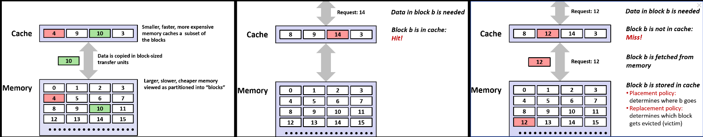

#### 一般方式工作


**缓存的思路放到更低层级也一样**: 
- 本地浏览器从Web服务器访问数据，数浏览器从 Web 服务器下载 HTML、图片、CSS 文件（就像缓存从内存取块）
- 这些文件被保存在本地缓存里, 第二次访问同一个网页：浏览器直接从本地加载，不用再去服务器

假设下面是**被划分为一些固定大小块**主存，主存上面是容纳四个块的高速缓存。

主存里的数据切成字节数相同的块，数据将以块大小为传输单位在内存和高速缓存之间传输。

如果告诉缓存需要来自主存的数据，那么它将获取整个块。然后在任何时间点，高速缓存都保存主存储器中块的一个子集

所以这个缓存要快得多，容量更小，但它的价格却要贵得多


#### 命中


现在假设 CPU 请求第 10 块中的一些数据: 这样第 10 块会被复制，又覆盖掉缓存中的那个（第 14）块

现在将块复制到缓存中的想法是: 希望在 CPU 上执行的程序将重用复制到高速缓存中的一个块

费力地从内存复制块到缓存很慢, 所以现在假设 CPU 需要块 b 中的一些数据，在这个例子下是块号为 14 的块

现在缓存内有这个块，因此可以直接返回，我们称之为缓存命中（cache hit）

> 要访问的块正位于缓存中，这叫缓存命中，这是很好的, 因为现在我们可以将该块直接返回给CPU

而且使用高速缓存的访问速度比如果要去访问 DRAM 主存要快得多(SRAM 比 DRAM 快得多)

相比要到主存中去取得这个块，通过这种方式 CPU 非常迅速地取得第 14 个块


#### 未命中

假设 CPU 现在请求第 12 块: 在高速缓存中查无此块, 这就是缓存不命中（cache miss）

高速缓存需要从主存中取出第 12 块, 复制第 12 块到高速缓存中，然后可以返回给 CPU

所以这需要更长的时间，因此 CPU 必须等待高速缓存从内存中取出该块

> 所以一旦出现缓存不命中，访问速度就会很慢。所以缓存命中很好，因为很快。缓存不命中很糟糕，因为会很慢


### 缓存未命中的几种类型


#### 冷不命中

第一种是冷不命中（cold miss）或者叫强制不命中（compulsory miss）

这是因为高速缓存中没有任何的数据, 最初缓存是空的，没有存储任何块。

当缓存为空时，每一次访存都肯定会缓存不命中，所以没有办法避免冷不命中。

当要读取数据时就要从下一级获取块，将它们放入缓存中，缓存将慢慢填满, 也就增加了缓存命中的可能性，这称为缓存的暖身


#### 容量不命中

第二种是容量不命中（capacity miss）: 高速缓存的大小是有限的，不能容纳超过缓存大小的工作集

在上面的例子中，高速缓存只有四个块的大小, 如果程序的局部性需要用到包含 8 个块的数据
那么容量仅有 4 个块的高速缓存无法放下整个 8 个块的数据, 这就是容量不命中
**这意味着如果有足够大的缓存，那么就会有良好的命中率**

如果我们可以在缓存中存储所有块，然后缓存可以利用该程序中的空间和时间局部性

在程序运行的任何时候，将这一些不断被程序访问的块称之为工作集（working set）
当程序从一个循环执行到另一个循环, 从一个函数到另一个函数时, 工作集是会改变的。
但是在程序执行中的某个时间点, 有一个工作集的概念，它就是你需要存储在缓存中的块

> 好的，所以当你的工作集大小超过你的缓存大小时，就会发生容量不命中


#### 冲突未命中

硬件缓存为了设计简单，给每个内存块规定死了能放在缓存里的哪个位置。

假设有一个可以容纳四个块的缓存: 内存中的第 i 块，只能放在缓存中的第（i mod 4）块

|块0|块1|块2|块3|块4|块5|块6|...|
|-|-|-|-|-|-|-|-
|只能放缓存块0|只能放缓存块1|只能放缓存块2|只能放缓存块3|和块0抢同一个位置|和块1抢|和块2抢|...|

假设从主存中要引用的数据对象是块 0、块 4、块 8

- 只引用三个块，所以在缓存中有足够的空间来存储这三个区块
- 但由于映射缓存块的方式，每一次拷贝新的块到 cache 时都会导致驱逐另一个块

**这种访问模式与用于映射块的算法密切相关**: 当访问第 4 块时，它将进入高速缓存中第 0 块已经占有的位置

> 因此，即使我们有足够大的缓存, 但由于这种访问模式和映射算法, 缓存会一直不命中
> 我们将在明天研究 cache 中冲突不命中的细节


### 缓存示例
下图是缓存存在于存储器层次结构中的任何地方的体现, 它们都是各种形式的缓存

> **这里的理念就是，缓存机制存在于存储器层次结构中的任何位置，而且它们都基于相同的原则，它们只是以不同的方式来实现**

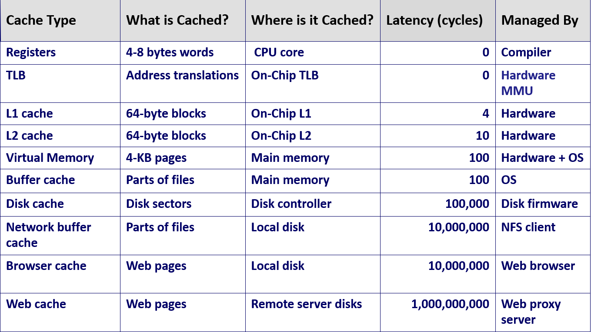


**当有请求从层次结构中的较低层读取内容时, 必须有一个过程决定如何处理这个请求，如何将其放入的缓存中的某一位置，称之为缓存管理**

#### 寄存器
- 它缓存的是来自内存的数据，供CPU直接使用
- 它被缓存于 CPU 内部, 0延迟（一条指令周期内完成）
- 由编译器管理缓存, 确定由哪个寄存器来存储来自内存的数据项

#### 翻译后备缓冲

翻译后备缓冲TLB（Translation Lookaside Buffer）是一个在虚拟内存中使用的缓存

#### L1/L2 硬件缓存

- 它们在现代英特尔系统上存储 64 字节块
- 它们被缓存于 CPU 芯片上，由 SRAM 制成，集成在 CPU 上
- L1 缓存在酷睿 i7 上的延迟是 4 个时钟周期。L2 缓存的延迟是 10 个 CPU 周期
- 当 CPU 要从 L1 缓存中读取一个内容时，由硬件来管理
- 如果出现了未命中，就会从 L2 缓存中加载一个块，L1 缓存中的硬件来决定在哪里存放这个块
- 好的，所有这些都是在没有硬件干预的情况下完成的

#### 磁盘缓存
磁盘包含由操作系统维护的缓冲区缓存，在这种情况下，缓存的是文件的一部分

- 他们被缓存在主存中，缓存到主存的延迟大约一百个时钟周期左右
- 这些都是由操作系统管理的，操作系统会保留一部分内存来存储你已加载的文件
- 如果读取文件，操作系统将利用本地性，然后开始从该文件中读取字节
- 它实际上将从主存中的文件缓存被读取，而不是去磁盘上读取

#### 网络缓存
网络也维护着一份本地地盘的缓存，例如网络文件系统（Network File System）和安德鲁文件系统（Andrew File System）

浏览器有缓存机制，因此从服务器获取文件时，浏览器将会把这些文件本地存储在磁盘上，以便再次引用这些网页

然后这些文件就会从本地磁盘读取，而不是一直通过网络重新请求


| 层级 | 缓存什么？ | 缓存在哪？ | 谁管理？ | 典型延迟 |
|:---|:---|:---|:---|:---|
| **寄存器** | 来自内存的字（8字节） | CPU内部 | 编译器 | 0延迟（一条指令周期内完成） |
| **TLB** | “虚拟地址 → 物理地址”的映射关系 | CPU内部 | 硬件 | - |
| **L1缓存** | 64字节块（现代英特尔系统） | CPU芯片上（SRAM制成，集成在CPU） | **硬件**（CPU内置的缓存控制器自动管理） | 4个时钟周期 |
| **L2缓存** | 64字节块 （现代英特尔系统）| CPU芯片上（SRAM制成，集成在CPU） | **硬件**（CPU内置的缓存控制器自动管理） | 10个时钟周期 |
| **磁盘缓存** | 文件块(文件的一部分) | 主存 | 操作系统 | 约100周期 |
| **网络缓存** | 文件/网页 | 本地磁盘 | 应用/OS | - |