# Cache Memories

## 回顾

内存层次结构是存储设备的集合: 

- 越处于顶部的存储设备容量越小，越昂贵，速度也越快，处于底部设备则相反
- 层次 k 的存储设备作为高速缓存，储存着下一层次中的一部分子集(即层次 k + 1 的存储设备的子集)

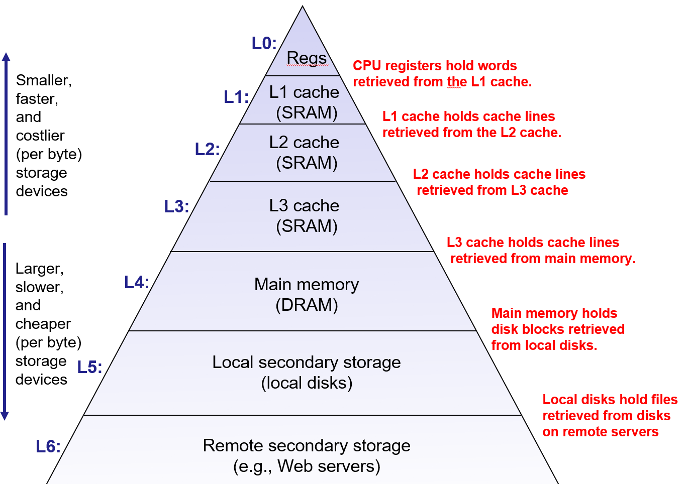


内存虽然在逻辑上是由**字节(Byte)**组成的数组，但在缓存机制中，将其拆分并视作为**块(Block)**的集合:

- **主存(Main Memory)**：容量更大、速度更慢、更便宜。
- **高速缓存(Cache)**：更小、更快、更昂贵。仅包含主存中所包含块的一个**子集**
- **传输单位**：块是存储器层次结构中，高速缓存与主存之间来回复制的**基本传输单元**

### 工作流程示例


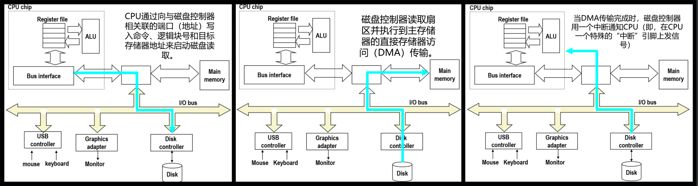


#### 缓存不命中(Cache Miss)
- **请求**：程序请求包含在**块 4** 中的字。
- **查找**：缓存在其现有的块子集中搜寻该块。
- **缺失**：发现块 4 不存在，此时产生一次**不命中(Miss)**。
- **加载**：缓存要求主存储器发送块 4。
- **存储与替换**：当块 4 到达缓存时，缓存会存储它。在此过程中，可能需要覆盖(替换)现有的某些块。

如果程序随后请求**块 10**，缓存搜寻后发现没有，则会请求内存将块 10 复制到缓存中，这同样会覆盖现有的块。

#### 缓存命中(Cache Hit)
- **再次请求**：如果程序再次需要引用包含在**块 10** 中的字。
- **发现**：由于之前已加载，缓存搜寻后发现该块已经存在。
- **命中**：此时我们说缓存**命中(Hit)**。
- **返回**：缓存立即返回该数据，无需经历费时长的操作(如通知内存并获取块)。

---

## 缓存的组织和操作


### 定义

有一类非常重要的缓存，即所谓的**高速缓存储存器**。它包含在 CPU 芯片之中, 完全由硬件自动管理, 并使用快速 SRAM 存储器实现的

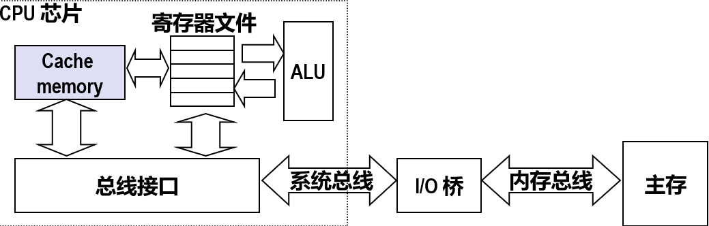


处于**寄存器组**附近的缓存的实质: 是存储主存储器中经常访问的块

因为**局部性原则**: 请求的大多数据都会从这个缓存中提供，而不是从这个缓慢的主存, 这只需要花费几个**时钟周期**

---

### 通用组织 (S, E, B)

要想实现**高速缓存存储器完全由硬件管理**, 硬件逻辑必须知道**如何查找缓存中的块并确定是否包含特定块**, 所以必须以非常严格且简单的方式去组织高速缓存存储器

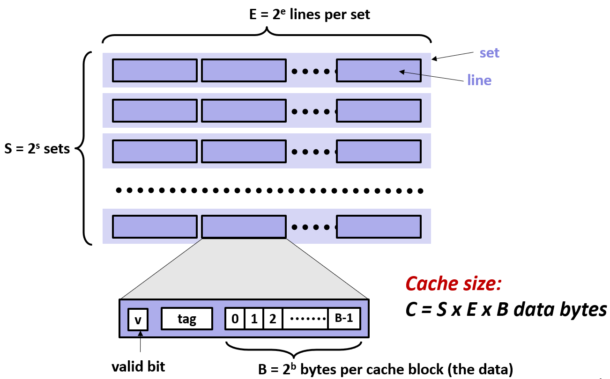

查找逻辑可以非常简单, 所有缓存存储器都按以下方式组织:
- 一个缓存由 `S=2^s` **组**构成
- 一组都包含 `E=2^e` **行**
- 一行由 `B=2^b` 字节的数据块组成

当开机时, 缓存可能只是随机比特位, 缓存中没有任何实际内容: 这些位将具有值, 要么为 1 要么为 0, 但它们实际上是随机的, 没有任何意义

于是便有个指示这些数据位和数据块(B 字节)是否实际意味着什么的**有效位(valid bit)**；以及称为 **标记位(tag)** 的附加位来帮助我们搜寻块

缓存大小(块中包含的数据字节数) `C = S * E * B`

---

### 缓存读取

访问数据时, 程序会执行一个**带着需要访问的数据的位置(地址)**指令(指令引用了主存中的一些字)

CPU 将该地址发送到缓存, 缓存便会根据这个地址查询数据, 并返回查询到数据(字)

> 对于 x86-64, 上述的这个地址将是 64 位地址

缓存的组织决定将地址划分为多个区域: s 设置的数量是每组的行数, b 是每个数据块的大小

低位的 b 个地址 用于确定块中的偏移量; 中间的 s 位整体被视为无符号整型(正整数)并作为组的集合的索引; 剩下的 t 位构成了有助于进行搜索的 **标签位**

**这里只是将缓存视为一个关于组的数组集合, 设置的索引位为这个数组提供索引**

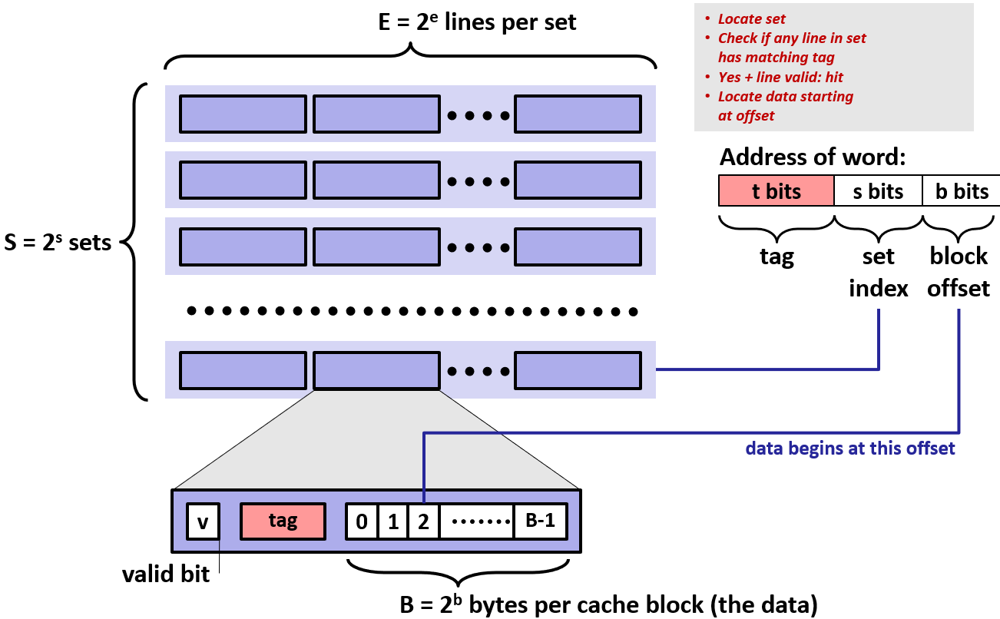


- 提取中间 s 位作为此数组的**索引**: 来识别所在的组
- 提取高位 t 位作为**标签位**: 来从这些行中寻找匹配的标记
- 匹配到所在行后, 根据**该行的有效位**判断该是否有效
- 确定匹配到的行有效后, 命中, 并且该行便是唯一并且确定的
- 最后再根据低位 b 位来偏移并确定它的位置


### 直接映射缓存

当每组只有一行时(E=1), 缓存称为**直接映射缓存(Direct Mapped Cache )**

假设缓存有 S 组, 每组只有 1 行, 缓存块大小为 8 字节, 并且程序引用了数据项。

现在 CPU 感知到缓存的地址并将该地址分解为三个字段: 块偏移量 4(二进制100), 组索引是 1, 粉色表示标记位

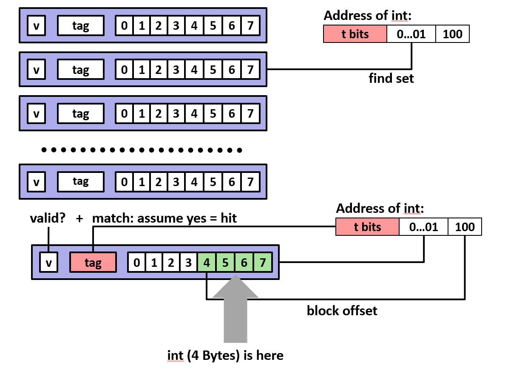

#### 命中

寻找到的块是在缓存中它将在这个插入的第 1 个, 然后进行标记位和有效位的比较

如果都匹配, 再查看块偏移量为 4 的地址, 并告知 4 比特就是指令引用的内容

缓存把这视作 int 格式, 将它发送回 CPU, 并将其放入寄存器中

#### 不命中

如果标签位不匹配, 则表示**未命中**, 缓存必须**从内存中获取相应块并覆盖旧块**, 然后就可以从块中取出字并将其发送回处理器

> 现在让我问一个问题, 只是为了检查你是否跟上了进度: 
> 
> 在缓存系统中，如果发生了一次 缓存不命中(Cache Miss)，CPU 需要从主存中获取缺失的块并用其覆盖当前缓存行中的旧数据。
> 
> 请问：在覆盖数据块的同时，该行对应的 **标记位(Tag)** 是否也必须随之更改？

**当发生缓存不命中并需要从内存获取块并覆盖当前行时**：

- **数据位 (Data Block) 覆盖**：旧的数据块被来自主存的新块替换。
- **标记位 (Tag Bit) 覆盖**：**必须更改**。标记位必须更新为当前请求地址的 Tag。
- **有效位 (Valid Bit) 更新**：如果该位原先为 0，则必须置为 1。

无论有效无效, 只要不命中, 标签位必须更新

#### 模拟

> 让我多说一点, 让我讲一个非常简单的具体例子, 关于直接映射如何工作的例子

> 我希望你能真正了解这是如何工作的, 但我也想说明直接映射缓存的不足及其原因, 为什么希望每组包含多行


块偏移位 (Block Offset, b=1)：
- 因为块大小 B=2 字节(即 2^1)，所以需要 1位 来表示偏移量。
- 通过这 1 位，我们可以定位块中的第 0 个或第 1 个字节。

组索引位 (Set Index, s=2)：
- 因为缓存共有 S=4 个组(即 2^2)，所以需要 2位 来作为组索引。
- 这 2 位决定了地址映射到缓存中的哪一组。

标记位 (Tag, t=1)：
- 地址中剩余的位即为标记位。在本例中：4(总位数) - 1(b) - 2(s) = 1 位。

|t = 1|s = 2|b=1|
|-|-|-|
|x|xx|x|


缓存有 4 组, 每组 1 行, 每块 2 字节大小, 也就是缓存有 8 字节。但主存有 16 字节(4位地址): **必有两个不同的内存块会争抢同一个位置。**

地址跟踪 (读取，每次读取一个字节):

|步骤|访问地址 (十进制)|二进制 [t ss b]|目标组 (Index)|结果|缓存状态更新 (该组的变化)|解释|
|-|-|-|-|-|-|-|
|1|0|[0 00 0]|组 0|不命中|"V:1, Tag:0, Block:M[0-1]"|初始有效位为 0，必须从内存加载数据块。|
|2|1|[0 00 1]|组 0|命中|(保持不变)|同一数据块 M[0-1] 已在缓存中，Tag 匹配且 V=1。|
|3|7|[0 11 1]|组 3|不命中|"V:1, Tag:0, Block:M[6-7]"|组 3 初始为空，加载包含地址 7 的块 M[6-7]。|
|4|8|[1 00 0]|组 0|不命中|"V:1, Tag:1, Block:M[8-9]"|冲突：组 0 已被 Tag 0 占用，但地址 8 的 Tag 是 1。发生替换。|
|5|0|[0 00 0]|组 0|不命中|"V:1, Tag:0, Block:M[0-1]"|抖动：刚刚存入的 Tag 1 被地址 0 的 Tag 0 再次踢出。|

模拟结束后的缓存内容:
||v|Tag|Block|
|-|-|-|-|
|组0|1|0|M[0-1]|
|组1||||
|组2||||
|组3|1|0|M[6-7]|

#### 更高关联性 (E 值)

在此期间缓存里的 组 1 和 组 2 全是空的, 明明有地方却因为规则限制必须互相伤害。

如果多个常用的地址正好映射到同一个组，它们会不断地互相覆盖。即使缓存整体还有大量空闲空间，不命中率依然很高。

> **所以这就是为什么缓存需要具有更高的关联性, 更高的 E 值的原因**

---


### E 路相连高速缓存

对于 E 的值大于 1 的情况, 缓存称为**E 路相连高速缓存(E-way Set Associative Cache )**。


假设缓存有 S 组, 每组有 2 行, 所以是两路组相联缓存。并且假设被提供了具有以下形式的地址

缓存提取组索引, 找到在第一组内, 再寻找从区块内的偏移量 4 开始的字


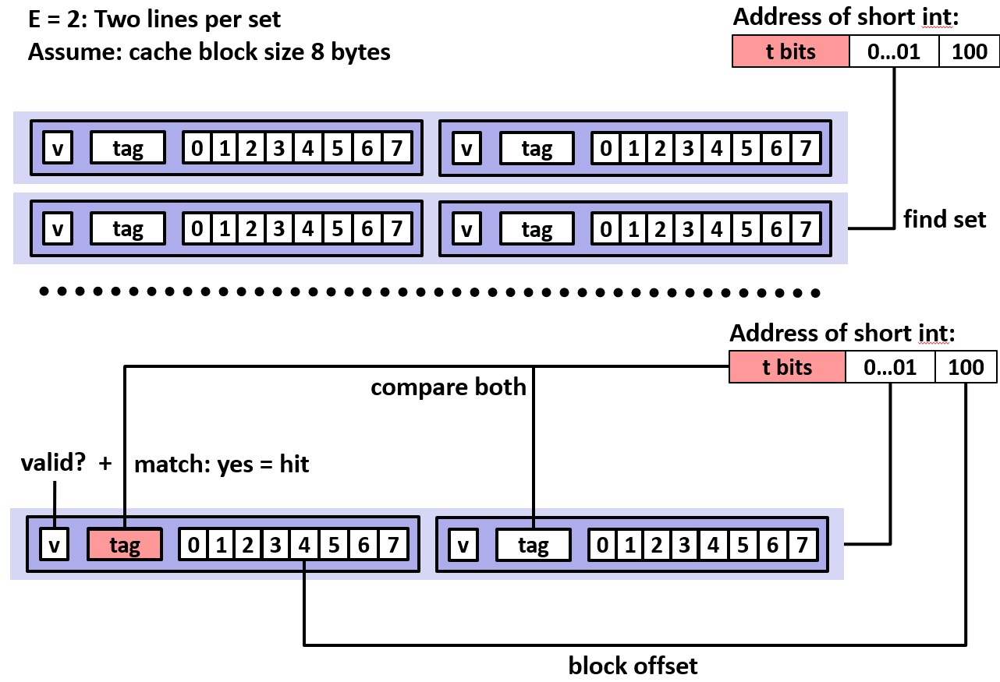

现在开始并行搜索, 搜索标记位, 在每组的两行中搜索匹配的标签位: 如果得到匹配的标记位和有效位就是缓存命中

一旦确定匹配, 就检查组偏移位: 现在正在访问一个短整型, 因此 4 是该区块内的偏移量

---

### 全相联高速缓存

这里存在比较检查的硬件逻辑: 因为随着关联性的增加, 逻辑电路变得越来越昂贵, 就像在做某种二叉树搜索一样

当要求电路特别便宜, 那么只能存在一个组, 称之为**全相联高速缓存(Fully Associative Cache)**

#### 性能

虽然只有"1组"，但这个组里有所有的位置: 这个"超级大组"像一个公共大澡堂，谁来都有位子坐，不需要对号入座

现在任何一个块可以存在于任何地方, 放置一个块, 不存在任何限制

|最高：全相联|"S=1|E=很大"|完全不打架。任何块可以放进任何位置。|最低|极高 (昂贵)|
|-|-|-|-|-|-|
|中等：组相联|"S=4|E=4 (示例)"|小规模打架。只能在对应的组里的 4 个位置里抢。|较低|适中|
|最低：直接映射|"S=4|E=1 (示例)"|疯狂打架。每个地址只有一个位置，非此即彼。|最高|极低|

#### 代价

在软件级别的缓存(如数据库缓存或 Web 缓存)中经常看到它，但在实际的底层硬件电路设计中，全相联缓存是非常罕见的，实现它的代价太高了。

因为硬件实现的复杂性: **全相联缓存要求硬件能够同时并行比对成百上千个标签位，这会消耗巨大的电量和芯片面积**。

虽然降低关联性(比如使用 2 路或 4 路组相联)会带来一点点性能损失, **但为了这点性能提升而去增加极高的硬件复杂度是不值得的。**

因此，硬件设计往往在关联性和复杂度之间寻找一个平衡点。

> 稍后我们研究虚拟内存时, 会有一些这样的系统

在虚拟存储器系统中, DRAM 作为存储在磁盘上的数据的高速缓存

如果在 DRAM 上有一个缓存, 但未命中, 则必须转到磁盘, 这个耗时是非常巨大的

所以拥有比较复杂的搜索算法是值得的。特别是在虚拟存储器系统中, DRAM 实现了完全关联的高速缓存, 其中来自磁盘的块可以存储于任何地方。

> 当我们学习虚拟内存时, 会更深入的了解此内容, 无疑, 你会在真实的系统中看到它。

现今数目在快速增加, 因为特征尺寸在减少, 设计人员可以负担得起更昂贵的硬件

> 我所知道的最大的关联性是 Intel 系统, 是 16 路组相联 L3 三级缓存, 其他的大多是 8 路组相联, 这就是现在最先进的组数大小

#### 现代

在 16 路后，进一步增加路数带来的命中率收益已经非常微小，不值得为此增加芯片面积。

2026 的顶级 CPU在 L3 缓存 的关联性上并没有盲目追求更高, 而是保持在 12 路到 16 路 之间

- **AMD**: AMD的 3D V-Cache 技术不再是在平面上增加缓存，而是通过垂直堆叠的方式，在 CPU 核心上方直接加盖一层缓存“大楼”。

- **Intel**: Intel 也在其最新的 Nova Lake 架构(2026)中引入了类似的 bLLC (Big Last Level Cache) 技术，旨在通过超大容量的缓存来对抗 AMD。

|规格参数|2015 年顶级水平 (如 Haswell/Skylake)|2026 年主流水平 (如 Nova Lake / Zen 5)|
|-|-|-|
|L3 缓存容量|2MB ~ 20MB|32MB ~ 192MB (通过 3D 堆叠)|
|L3 关联性|12 路 / 16 路|12 路 / 16 路 (保持稳定)|
|L2 缓存容量|256KB 每核心|1MB ~ 4MB 每核心 (L2 增长极快)|
|L2 关联性|8 路|16 路 (L2 的关联性有所提升)|

---

### 提问

**CPU 每次向缓存请求数据时，是必须说明要多少位，还是缓存自动知道要返回多少?**

> 实际上, 而我并不知道具体细节。这可能是一个, 它总是一个 64 位, 然后处理器提取当前比特位
> 
> 我实际上不知道那个细节, 但它要么在请求中, 要么处理器解析标准大小。我们假设缓存知道返回的大小


**如果一组里有多行且都满了，新数据进来时，硬件怎么决定踢走哪一行？**

- 核心算法：LRU (Least Recently Used，最近最少使用)。

- 逻辑依据: 利用逆向局部性原理。如果一个块很久没被用了，那么预测它未来也不太会被用到。

- 实现细节: 硬件会维护类似“虚拟时间戳”的位，记录每一行的访问先后。

- 必做动作: 如果被踢走的行(受害者行)数据被修改过，必须先**写回(Write-back)**内存。

> 有很多不同的算法, 最常用的算法是**最近最少使用**策略。根据局部性原则, 你希望将缓存中的块将被尽可能多次的使用
>
> 逆着局部性原则思路来思考, 如果一个块长时间不被引用, 在不久的将来, 它也不太可能会被引
> 
> 你只是跟踪, 我没有说那里需要额外的位。类似于在排序中, 保持虚拟时间戳, 但这只是你做这件事的常规方式: 只是尽量保持最常访问的块

**块的大小（Block Size）是怎么定的？为什么不做得极大或极小？**

先确定块的大小, 然后再确定关联性, 一旦确定了关联性就可以确定组的数量, 最后决定所期望的缓存的大小

- 设计初衷: 利用空间局部性。取回一个块时顺便把邻居也带回来，分摊访问内存的高昂成本。
- 太小: 无法有效利用空间局部性，频繁发生不命中，访问内存的成本无法被“摊销”。
- 太大: 搬运一个超大块的时间太长，会卡住系统。缓存总容量有限，块太大意味着能放的块数量变少，容易引发冲突

|维度|块太小 (Small Block)|块太大 (Large Block)|
|-|-|-|
|空间局部性|利用率低。刚读完一个字，下一个字可能就在另一个块里，导致再次 Miss。|利用率高。 搬运一次就能带回周围一大片数据。|
|摊销成本|差。去一趟内存只带回一点数据，性价比极低。|好。 访问内存的开销被块内多个字节“摊销”了。|
|缺失惩罚|惩罚小。传输时间短，系统很快就能恢复。|惩罚大。 搬运一个巨型块需要很长时间，总线会被占满。|
|缓存空间利用|灵活。总容量一定时，块越小，能存的块（身份）越多。|僵硬。 块太大占用了太多物理空间，导致能存的块变少（冲突增加）。|

> 块的大小是由内存系统的设计决定的, 这是内存系统的固定参数

> 当 Intel 设计师决定将缓存存储器放在他们的处理器上时, 他们决定了块大小为 64 字节


> 基本上所有这些: 行数的数量和容量大小; 每组的行数是固定的高级设计参数。缓存的大小是高级设计参数


**在目前的硬件设计中，发生不命中且对应的组已经满了，是如何选出块的？**

> 如何在一组中有多行时, 确定哪些将被覆盖: 你应该尝试选择最近最少使用的行, 最近没有访问过的行很适合替换
> 
> 因为由于这种逆向局部性原理的正确性, 它们最近没有被引用, 它们将来不会被引用的可能性也很大


---

### 两路组相联高速缓存模拟

缓存有 2 组, 每组 2 行, 每块 2 字节大小, 缓存仍是 8 字节大小; 主存有 16 字节。
|t = 2|s = 1|b=1|
|-|-|-|
|xx|x|x|


地址跟踪 (读取，每次读取一个字节):

|步骤|访问地址 (十进制)|二进制 [t ss b]|结果|目标组 (Index)|缓存状态更新(行0的变化)|缓存状态更新(行1的变化)|解释|
|-|-|-|-|-|-|-|-|
|1|0|[0 00 0]|组 0|不命中|V=1, T=00, M[0-1]|V=0|初始为空，加载块 M[0-1] 到组 0 的第一个空行。|
|2|1|[0 00 1]|组 0|命中|(保持不变)||地址 1 就在刚刚加载的块 M[0-1] 中，Tag 匹配。|
|3|7|[0 11 1]|组 3|不命中|V=1, T=01, M[6-7]|V=0|地址 7 的 Index 是 1。加载 M[6-7] 到组 1 的第一个空行。|
|4|8|[1 00 0]|组 0|不命中|V=1, T=00, M[0-1]|V=1, T=10, M[8-9]|关键点：组 0 虽有数据，但由于 E=2，还有一个空行。无需覆盖，直接存入。|
|5|0|[0 00 0]|组 0|命中|(保持不变)||区别所在：地址 0 的块还在行 0 里，没有被地址 8 踢走。|

模拟结束后的缓存内容:
||v|Tag|Block|
|-|-|-|-|
|组0|1|00|M[0-1]|
||1|10|M[8-9]|
|组1|1|01|M[6-7]|
||0|||


---

### 写操作
层次结构中是向上移动的, 在缓存中创建数据的子集(进行子设置), **所以数据有多个副本**: L1、L2、L3、主存储器、磁盘

#### 写命中

对当对在缓存中的块内的数据字进行写操作, 有 2 种情况:

##### 直写

立即将该块写入内存便是**直写**: 内存访问是非常费时的, 所以这是耗费高的写方式

> 我们有一个这么大的块, 我们正在更新它的一小部分, 我们可以进行更新, 然后立即将其刷新到内存中, 因此, 内存始终保持着缓存的镜像

##### 写回

每一行缓存(Cache Line)不仅仅存数据，它还包含了几项必须的**管理信息**：

|有效位 (Valid)|脏位 (Dirty)|标记位 (Tag)|数据块 (Data Block)|
|-|-|-|-|
|1 bit|1 bit|t bits|B bytes (如 64 字节)|

**脏位(Dirty Bit)** 是缓存行的一个状态位: `0` (Clean)：缓存与内存一致, `1` (Dirty)：缓存已被修改，比内存"新"。

在高效的缓存设计中，CPU 修改数据时**只改缓存，不改内存**，以节省时间。但这引出了替换时的补偿逻辑(当某一行被选中准备替换时)：
- **检查脏位**：如果为 `0`：直接丢弃，覆盖新数据; 如果为 `1`：执行**写回**。
- **写回动作**：将该行的数据（“其”）同步到内存对应的地址。
- **完成替换**：内存更新后，再载入新的数据块。


#### 写不命中
当进行一个写操作: 但写的字不包含在缓存中的任何块中, 便发生了写不命中

##### 写分配

即使没有命中, 也会从主存中把该地址所在的**整个块**加载到缓存中。然后在缓存中修改这个块。

**优点**: 利用了时间局部性。如果之后还要读/写这个地址，它已经在缓存里了（变成命中）。

这种做法和"读不命中"的逻辑是对称的: 先加载，后操作。


##### 非写分配

不要分配新行, 不管缓存，直接写内存: 直接将数据绕过缓存，写入主存。

**优点**: 如果只是想一次性写入大量数据，且以后再也不读它，这种方法更省事。

#### 组合
典型的组合有: "直写 + 非写分配"; "写回 + 写分配"

> 对于非专业设计人员，不必纠缠于所有实现细节。为了方便理解，建议你统一采用以下**最简组合模型**：写回 (Write-back) + 写分配 (Write Allocate)

- 遇到写命中: 只改缓存，标记为“脏”（Dirty），等到该行被踢出时才写回内存。
- 遇到写不命中: 在缓存里挤出一个新条目，把内存里的块拉进来，就在缓存里改。

**尽可能把所有事情都留在缓存里解决，直到缓存满了要替换时, 再去碰缓慢的内存/磁盘。**

---

### 层次结构

假设在一个真实的系统中, 只有一个缓存: 但在实际系统中, 会存在多个缓存

> 现代核心 i7 拥有来自英特尔的良好架构: 包含多个处理器核心

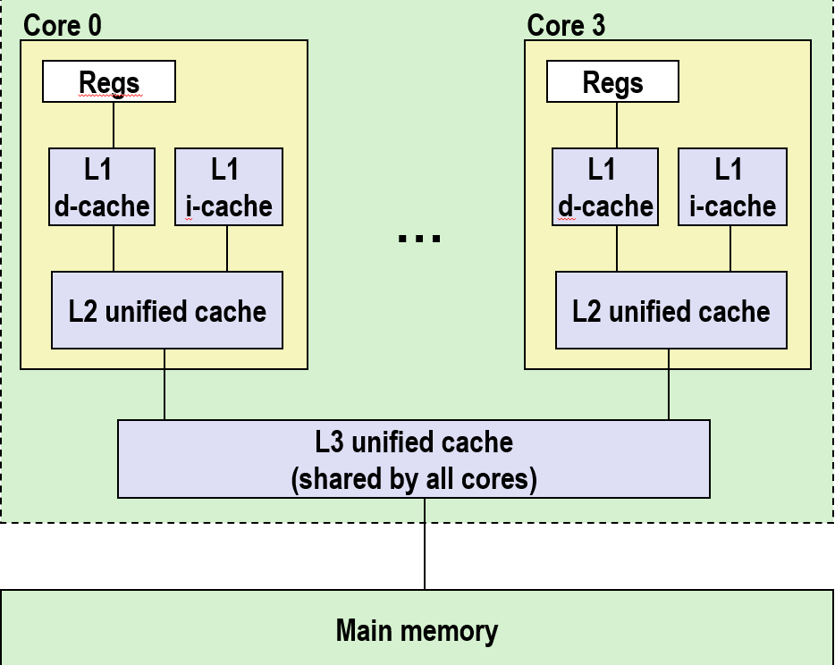

||L1 i-cache|L1 d-cache|L2 统一的高速缓存|L3 统一的高速缓存|
|-|-|-|-|-|
|容量|32KB|32KB|256kb|8MB|
|关联性|8路|8路|8路|16路|
|访问|4 个周期|4 个周期|10 个周期|40-75 个周期|
|块大小|64字节|64字节|64字节|64字节|

所有不同层级的缓存的块大小都为 64 字节
#### L0

桌面系统通常有 4 到 8 个核心。服务器系统则需要处理更庞大的任务，所以通常有 8 到 12 个（甚至 2026 年有的服务器已达到 128 核以上）

**这些处理器内核可以并行执行不同的程序指令, 自己的独立指令流**

并且每个处理器内核可以包含通用寄存器, 其在高速缓存层次结构中为 0 级

#### L1

为了让 CPU 能同时读取指令和数据，互不干扰: 将 L1 高速缓存拆分为 i 和 d
- i-cache (Instruction Cache)：指令缓存(专门存指令: 程序代码)。
- d-cache (Data Cache)：指令缓存(专门存数据: 变量、数字等)。

> 这些是相当小的 32k 字节, 是八路组关联的, 并且可以在极少的时钟周期内访问它们
#### L2

比 L1 大一些, 但仍然是相当小的 256k 字节, 相同的关联性, 延迟稍高(10 个周期), 通常也是每核独

在 L2 缓存包含数据和指令的意义上, 它是统一的: 不再区分指令和数据，混在一起存。

#### L3

从 L0 到 L2 的一切都在芯片的单核心内。在芯片上, 在所有内核外部并由所有内核共享的是**L3 统一缓存**

其大小 8 兆字节和 16 路组相联, 访问时间大约为 40 到 75 个周期

#### 未命中时的流程

如果在 L1 中出现未命中, 则 L1 感知到, 然后尝试向 L2 发送请求以尝试在 L2 中查找数据

由于 L2 稍微大一点, 又或许数据还没有从 L2 中刷新: L2 无法找到它, 它会向 L3 发送请求, 以查看它们是否可以在 L3 中找到数据

如果 L3 中也找不到它, 那么它就会放弃, 它会从芯片到内存中消失

---

### 缓存性能指标
#### 不命中率

最常见的考虑缓存的性能方法是使用称为**未命中率(Miss Rate)**的指标: 
(在缓存中找不到内存引用的次数 / 访问次数) = 1 - (找到内存引用的次数 / 访问次数)

正常工作缓存来说的未命中率必须非常低: 由于局部性原则, 未命中率很低

L1 典型位 3-10%。对于L2来说可能非常小 (例如，< 1%)这取决于大小等

#### 命中时间
**命中时间(Hit Time)**是在缓存中寻找到一个命中所需的时间(搜索然后访问标记位, 确定该项是否在缓存中, 然后将高速缓存中的一行传送到处理器所需时间), 


查找排序确定有一个命中, 然后返回值: 在 intel 系统中, L1 会花费 4 个时钟周期, L2 为 10 个时钟周期


#### 未命中处罚

当 CPU 在当前层级的缓存中找不到数据时，必须向更低层级的存储索要数据。由此产生的额外等待时间，被称为**未命中处罚** (Miss Penalty)。

未命中处罚就是从内存取回数据所花的时间, 是所知道的所有延迟的之和: 内存响应请求所花费的时间; 数据通过总线返回缓存所需的时间等

- 主存(DRAM)惩罚：通常需要 50-200 个时钟周期。

- 磁盘(Disk/SSD)惩罚：飙升至 数万甚至数百万个周期。

虽然内存容量在变大，但延迟缩减的速度远跟不上 CPU 频率的提升。因此，以 CPU 周期来衡量，这个惩罚数值实际上在增加。

> 你总是要付出命中时间, 你应该在这部分尽力做到最好。但是, 如果你有一个未命中, 那么你需要花费命中时间

---

### 命中与不命中

系统的性能对未命中率非常敏感, 命中和不命中之间的巨大差异。如果只有L1和主存储器:
- 高速缓存命中时间为1个周期, 不命中处罚为100个周期, 这是100倍
- 比如 99% 命中率的平均访问时间是 97% 命中率的两倍
  - 97% 命中的平均访问时间:  1 周期 + 0.03 * 100 周期 = 4 周期
  - 99% 命中的平均访问时间:  1 周期 + 0.01 * 100 周期 = 2 周期

这就是为什么使用**不命中率**而不是**命中率**: 
- 如果使用命中 97% 和 99% 看起来只差了 2%。
- 但从 CPU 的视角看，它们的性能表现却是天差地别的(相差 2 倍)

---

### 意义

#### 为什么

缓存就都是自动执行的, 是由硬件构建的, 一切都在硬件中自动在幕后执行: 不存在所谓的可见指令集去允许操作缓存和组装机器代码程序

对缓存的工作方式有一个大概的了解, 就能编写缓存友好的代码, 让最常见的情况运行得更快: 把注意力集中在核心函数里的循环上

> 从某种意义上说, 你的代码会比缓存不友好的代码具有更低的未命中率
> 你应该专注于使得更常用的部分更加快一点, 不要把时间花在那些代码不能很快执行的代码上


尽量减少每个循环内部的缓存不命中数量
对局部变量的反复引用是好的 (时间局部性)
步长为1的引用模式是好的 (空间局部性)

要点: 我们对局部性的定性概念是通过对高速缓存的理解来量化的

#### 怎么做

**略外循环中发生的事情, 只关注内循环中的代码**

如果有嵌套循环, 可以忽略外循环中发生的事情, 只关注内循环中的代码。 现在要做的是尽量减少内循环中的未命中: 因为它是执行最多的循环


**对于时间局限性来说, 多用局部变量(重复引用变量)**

如果声明一个局部变量, 编译器可能将它放在寄存器中; 但如果正在引用全局变量, 编译器不知道发生了什么, 因此它无法将该变量的引用放入寄存器中

> 如此重复引用存储在堆栈中的局部变量是好的, 因为那些将变成寄存器访问, 你永远不会去内存取回数据, 逐元素的访问数组是有利的
由于块的存在, 它们是有利的


**对于空间局部性来说, 坚持步长为 1 的引用"**

缓存是以**块(通常为 64 字节)**: 当访问 a[0] 未命中时，硬件会把 a[0] 到 a[7](假设每个元素 8 字节)整块搬进缓存, 接下来的 7 次访问都是命中。

> 如果在做步长为 2 的引用, 你只会命中剩下的字, 所以你会得到一半的命中率, 也就是加倍的未命中率

---

## 缓存的性能影响

> 我们将研究缓存对代码的性能影响, 为什么你需要知道这些事情, 以及他们会造成的影响

### 记忆山

存储器山是一种表征内存系统性能的紧凑方式。作为空间和时间局部性的二维函数测量的读吞吐量。

**存储器山**描绘了一种称为**读吞吐量**或**读带宽**(每秒从内存读取的字节数MB/s)的衡量标准

> 有一个非常有趣的函数, 实际上绘制在教科书的封面上, 我们称之为**存储器山**
> 我从 90 年代卡内基梅隆大学的名叫汤姆史翠克的研究生那里了解到这个, 他提出了这个概念 

刚才说过如果它正在做步长为 1 的引用, 那是缓存友好的; 如果一遍又一遍地访问同一个变量, 那也是缓存友好的

如果有一个循环正在逐个从一个双精度 double 类型的数组中读取这些元素: **读吞吐量是执行该任务的每秒兆字节数**


在存储器山图上表示为读取吞吐量, 作为该循环中的时间和空间局部性的函数

> 从某种意义上说, 储存器山考虑程序中的各种局部性选项或特征, 将该存储系统的性能在该范围内作为二维函数绘制出来
> 从某些角度来说, 存储器山就像指纹一样, 每种系统都有自己独特的记忆山


#### 测试函数

通过改变数组大小(Size)和访问步长(Stride)调用测试函数来量化缓存层次结构的性能:


实验步骤
- 运行一次 test() 预热缓存: 将目标数据从主存搬运到各级高速缓存(L1, L2, L3)中。
- 正式测量：再次运行 test() 并记录执行时间。
- 计算吞吐量：将耗时转换为 MB/s(每秒读取的兆字节数)。


**步长越大, 访问速度越慢, 当步长超过缓存块的大小，性能跌至内存访问速度:** 
- 步长 = 1：顺序访问每一个元素（0, 1, 2, 3...）。空间局部性最好，缓存命中率最高。
- 步长 = 2：间隔访问（0, 2, 4, 6...）。由于缓存块（Block）的浪费，未命中率会翻倍，吞吐量减半。


**数组大小(元素数量)决定了数据会落在哪个缓存层级:**
- 小数组：完全适配 L1 缓存，吞吐量极高。
- 中数组：超出 L1 但适配 L2/L3，性能阶梯式下降。
- 大数组：超出所有缓存，必须访问 DRAM (主存)，速度最慢。

```c
long data[MAXELEMS];  /* 全局待遍历数组（由双字/double组成） */

/**
 * test - 测量内存吞吐量核心函数
 * @elems: 参与遍历的元素数量（决定了工作集大小）
 * @stride: 访问步长（决定了空间局部性）
 */ 
int test(int elems, int stride) {
    long i, sx2=stride*2, sx3=stride*3, sx4=stride*4;
    long acc0 = 0, acc1 = 0, acc2 = 0, acc3 = 0; // 四个独立的累加器
    long length = elems, limit = length - sx4;

    /* 主循环：使用 4x4 循环展开 (Loop Unrolling) */
    for (i = 0; i < limit; i += sx4) {
        acc0 = acc0 + data[i];           // 第一次扫描
        acc1 = acc1 + data[i+stride];    // 第二次扫描（并行）
        acc2 = acc2 + data[i+sx2];       // 第三次扫描（并行）
        acc3 = acc3 + data[i+sx3];       // 第四次扫描（并行）
    }

    /* 扫尾循环：处理剩余不足 4 个步长的元素 */
    for (; i < length; i++) {
        acc0 = acc0 + data[i];
    }
    return ((acc0 + acc1) + (acc2 + acc3));
}
```
> 而且为了突出我想告诉你们的, 而这是我们不需要知道的, 所以不打算详细讨论这个问题

> 这实际上就是我如何制作出书本的封面, 为了利用 intel 处理器内部的并行性

**上述代码中采用了 4x4 展开，这是一种重要的代码优化技术：**

- 目的：利用 Intel 处理器内部的多个并行功能单元（如多个加法器/访存单元）。

- 逻辑：通过定义四个独立的累加器（acc0 到 acc3），打破了数据依赖。CPU 可以同时发起四次内存读取请求，并行处理，从而测得硬件的真实极限带宽。

- 原理：这与此前提到的利用超标量处理器的流水线并行性完全一致。


#### 山脉形象
存储器山是多级存储层次结构中 **时间局部性** 与 **空间局部性** 共同作用的量化体现。

> 我们所做的是, 我们称这个测试函数具有不同大小的 elems 和 stride
> 
> 我们评测性能, 得到了这幅美丽的图, 这个美丽的函数, 对我来说它是美丽的, 我不知道它对你们来说是否依然美丽

Z 轴代表读取吞吐量 (Read Throughput): 范围从 2,000 MB/s(内存速度)到 16,000 MB/s(L1 速度)。程序员应尽量让代码处于“山顶”。

X 轴代表步长 (Stride): 随着步长增加，空间局部性减少。当步长达到 8（即 64 字节，一个 Cache Line 的大小）时，因为此时每次访问都会发生一次不命中, 性能曲线会变平

Y 轴代表工作集大小 (Working Set Size / Elems): 随着 Size 增加，时间局部性减少。层次结构中的可以容纳数据的缓存越来越少, 数据逐渐超出 L1、L2、L3 的容量。

> 所以作为程序员你应该想办法在这里, 做你认为该做的: 良好的空间局部性, 良好的时间局部性
>
> 因为你可以达到每秒 14GB 的速度, 来衡量一致的吞吐量; 你不想在读取内存时, 每秒只有大约 100 MB
> 
> 从内存中读取数据和从缓存的某些部分读取它,这两者之间的区别是巨大的, 极大的

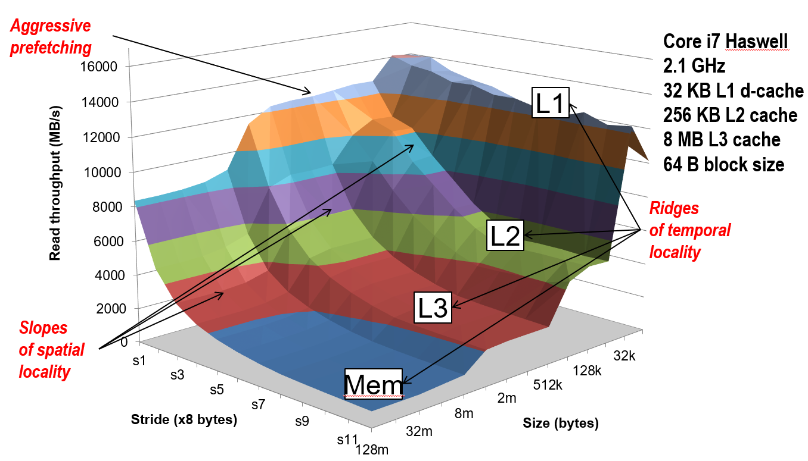

图中那些水平平坦的阶梯（山脊线）代表了各级缓存的性能界限, 是时间局部性山脊 (Temporal Locality Ridges)：
- L1 山脊：最顶部的平原，数据完全驻留在 L1 缓存中。
- L2 山脊：第一级台阶，数据超出了 L1 但能放入 L2。
- L3 山脊：第二级台阶，数据超出了 L2 但能放入 L3。
- 主存平原：底部的平地，所有数据必须从 DRAM 读取。


当固定数组大小（站在某个高度）并增加步长时，会从空间局部性斜坡 (Spatial Locality Slopes)滑下：
- 步长每增加一倍，吞吐量几乎减半。一旦步长 > 8（64字节），斜坡消失。
- 因为每个块里的数据只读一个字就走了，块的预加载收益归零。


硬件预取 (Hardware Prefetching)是一个“整洁”的发现：当 Stride = 1 时，即使数据量超出了 L2 的容量，性能依然能长时间维持在 L2 的速率。

- 原理：Intel 处理器的硬件逻辑会自动识别“步长为 1”的访问模式。
- 动作：硬件推测你很快会用到后面的块，于是提前将数据从 L3 搬运到 L2。
- 结果：原本应该在 L3 运行的代码，被硬件“强行”提速到了 L2 的水平。

---

### 重新排列循环

程序的空间和时间局部性可以通过几种不同的方式改善, **改善空间局部性**的一种方法是**重新排列循环**


以下代码通过做 N x N 矩阵相乘填满结果矩阵 C, 其中 i 指向行, j 指向列

矩阵元素是双精度浮点数 (8 字节), 每个源元素读取N次, 每个目标计算总计N个值, 总操作(O^3)

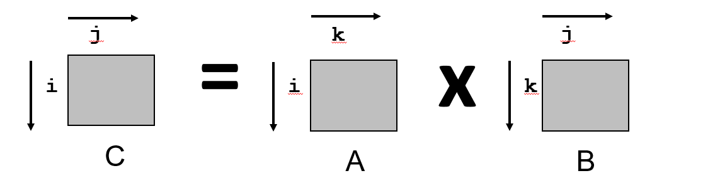

```c
/* ijk */
for (i=0; i<n; i++)  {
  for (j=0; j<n; j++) {
    sum = 0.0; // 变量和保存在寄存器中
    for (k=0; k<n; k++) 
      sum += a[i][k] * b[k][j];
    c[i][j] = sum;
  }
} 
```

---

|块大小| 32 B | 对4个双精度浮点数来说足够大|
|-|-|-|
|矩阵维数(N)|很大|近似 1/N 为 0.0|
|高速缓存|不够大|无法容纳多行|

并需要不关心 c, 因为它不在内循环中, 所以只需忽略它

<div style="display: flex; gap: 20px; align-items: flex-start;">

```c
/* ijk */
for (i=0; i<n; i++)  {
  for (j=0; j<n; j++) {
    sum = 0.0;
    for (k=0; k<n; k++) 
      sum += a[i][k] * b[k][j];
    c[i][j] = sum;
  }
} 
```

```c
/* jik */
for (j=0; j<n; j++) {
  for (i=0; i<n; i++) {
    sum = 0.0;
    for (k=0; k<n; k++)
      sum += a[i][k] * b[k][j];
    c[i][j] = sum
  }
}
```
</div>


注意到 i, j, k 实现内部循环正在对列 a 进行行方式访问, 也就是在内存里挨个往后读, 并且列优先访问数组 b 。

假设一个缓存块能存 4 个元素，那么只有读第一个元素时会"不命中"，剩下的 3 个都在块里，直接"命中"。

对 a 来说，每四次访问一次未命中: 第一个引用将错过, 然后接下来的三个将被命中, 在那之后的下一个引用将命中到一个新的块。

但由于 b 的访问模式是列式的, 都要在内存里大跳到下一行去。因为步长太大，每次对 b 的引用都会丢失, 发生"不命中"

a 的不命中率是 0.25, b 是 1.0, 每一次循环平均就要发生 1.25 次不命中(0.25 + 1.0)

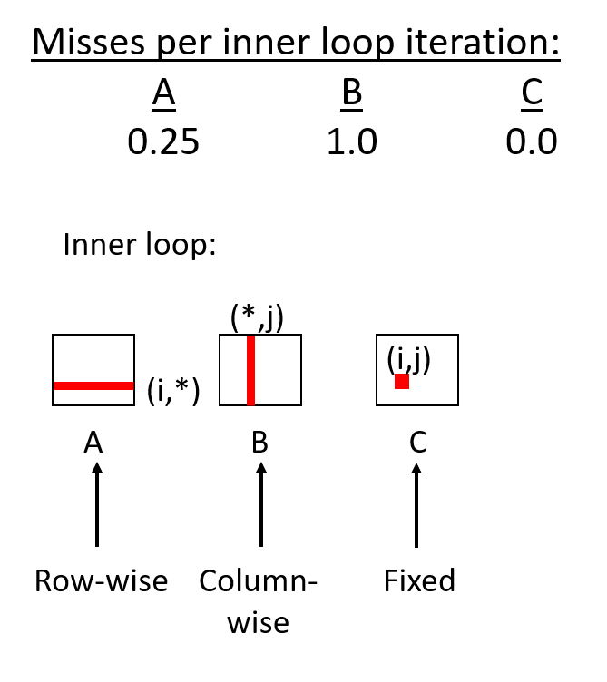


---


<div style="display: flex; gap: 20px; align-items: flex-start;">

```c
/* kij */
for (k=0; k<n; k++) {
  for (i=0; i<n; i++) {
    r = a[i][k];
    for (j=0; j<n; j++)
      c[i][j] += r * b[k][j];   
  }
}

```

```c
/* ikj */
for (i=0; i<n; i++) {
  for (k=0; k<n; k++) {
    r = a[i][k];
    for (j=0; j<n; j++)
      c[i][j] += r * b[k][j];
  }
}

```
</div>


数组 b 访问的是 b[k][j]。因为 j 在变, 所以是在横着读 b 的一行。这是步长为 1 的顺序访问

数组 c 访问的是 c[i][j]。因为 j 在变，也是在横着写 c 的一行。这也是步长为 1

数组 a 那个 r = a[i][k] 被提到了最内层循环的外面: 在整个 j 循环跑完之前，CPU 只需读一次 a[i][k] 并存在寄存器 r 里就行了。不用在内层反复去访问 a。

数组 b 和 c 都是每 4 次存取才错 1 次, 每次循环平均就要发生 0.5 次不命中

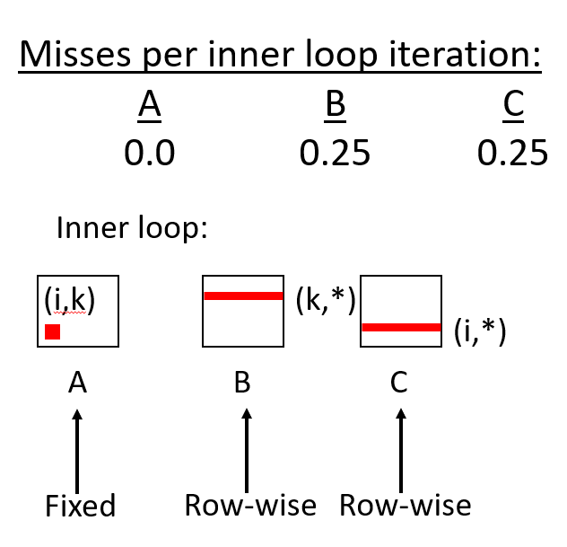


---

<div style="display: flex; gap: 20px; align-items: flex-start;">

```c
/* jki */
for (j=0; j<n; j++) {
  for (k=0; k<n; k++) {
    r = b[k][j];
    for (i=0; i<n; i++)
      c[i][j] += a[i][k] * r;
  }
}	
```

```c
/* kji */
for (k=0; k<n; k++) {
  for (j=0; j<n; j++) {
    r = b[k][j];
    for (i=0; i<n; i++)
      c[i][j] += a[i][k] * r;
  }
}	
```
</div>


数组 a 访问的是a[i][k], 数组 c 访问的是c[i][j]。因为最内层变动的是行索引i，这意味着在垂直地跨行读取

结果：在C语言这种行优先存储的系统里，‘垂直跳跃′意味着步长（Stride）巨大。你每读/写

数组 a 和 c 每次访问都换行，次次都不命中，也就是1.0次不命中, 每次迭代平均有2.0 次不命中

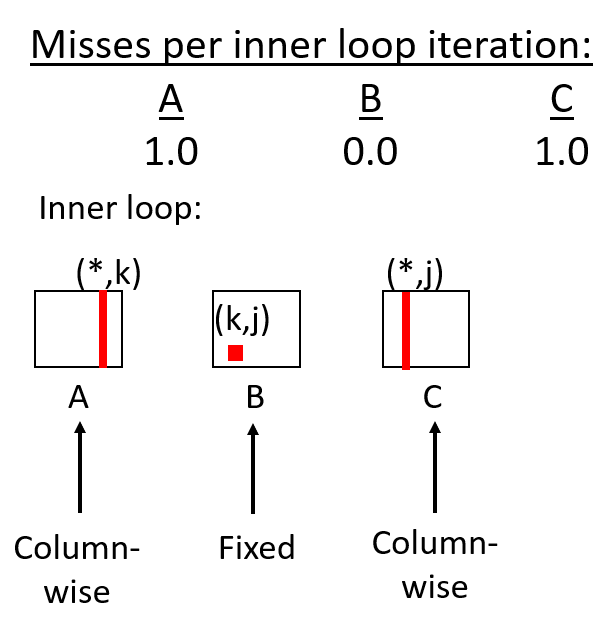


---


<div style="display: flex; gap: 20px; align-items: flex-start;">

```c
// ijk (& jik): 
// 2 loads, 0 stores, misses/iter = 1.25
for (i=0; i<n; i++) {
  for (j=0; j<n; j++) {
   sum = 0.0;
   for (k=0; k<n; k++) 
     sum += a[i][k] * b[k][j];
   c[i][j] = sum;
 }
} 
```

```c
// jki (& kji): 
// 2 loads, 1 store, misses/iter = 2.0
for (j=0; j<n; j++) {
 for (k=0; k<n; k++) {
   r = b[k][j];
   for (i=0; i<n; i++)
    c[i][j] += a[i][k] * r;
 }
}
```

```c
// kij (& ikj): 
// 2 loads, 1 store, misses/iter = 0.5
for (k=0; k<n; k++) {
  for (i=0; i<n; i++) {
    r = a[i][k];
    for (j=0; j<n; j++)
      c[i][j] += r * b[k][j];   
  }
}
```

</div>

可以看到 `i, j, k` 和 `j, i, k` 平均有 1.25 次未命中; `k, i, j` 有 0.5 个未命中; `j, k, i` 有 2 个未命中

看起来 `k, i, j` 及其兄弟是最好的选择, 唯一的区别是 `k, i, j` 有这个额外的储存

最内层代码 `c[i][j] += r * b[k][j]` 实际上包含了两步：把 c[i][j] 读出来; 把加法结果写回 c[i][j]

因此可能存在一个问题: 比起之前的版本，这里多了一个"写"的动作，会不会反而变慢了(即创造的是减慢速度)

在任何类型的存储系统权利系统中都证明了这一点: **处理读操作更容易**

写操作比读取操作更为灵活: 可以写回来推迟, 可以推迟写, 直到实际使用的值

但读到一元素时, 就会陷入困境: 在获得该数据之前, 你无法做任何事情

> 事实证明, 写操作并不是,  真的这个额外的存储并没有真正影响到我们


当在现代系统上测量这些时, 可以看到 `k, i, j` 具有最少的未命中数; 每次迭代有两次未命中的 `j, k, i` 是最差的; 这种 `i, j, k` 模式是中间体 1.2 的一种未命中, 这种情况介于两者之间

> 在这里绘制的是每个循环迭代的周期, 所以每次迭代都需要大约一个周期, 这非常好
这


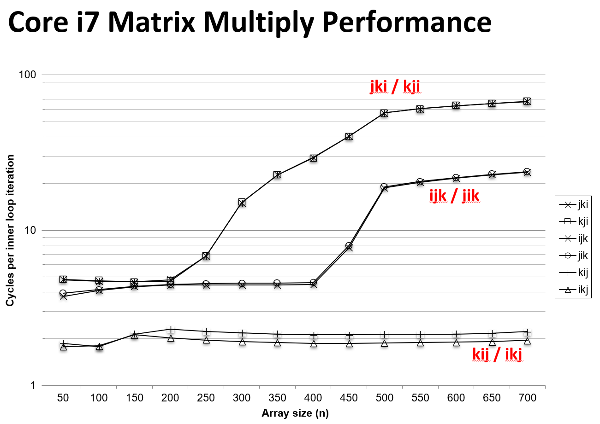

--- 

### 利用分块

在矩阵乘法中, 做的是改善我们的空间局部性, **但并没有做任何改善时间局部性的事情**: 要改善时间局部性, 必须使用称为**阻塞**的技术

> 这一点很重要, 因为你需要在缓存实验室中完成。但它也是一种非常通用的技术, 任何时候你需要, 任何时候你遇到时间局部问题

#### 未做处理
> 我们不打算详细介绍这段代码, 但是我重写了矩阵乘法: 它运行时你知道一个二维矩阵, 可以把它想象成一个连续的字节数组
> 
> 我在这里**使用显式索引重写**了这段代码来操作这个**想象的连续一维数组**

计算索引的方式是 `行号 * 总列数 + 列号`: 这样可以清晰地控制每一步跳跃了多少内存地址。


```c
c = (double *) calloc(sizeof(double), n*n);

/* Multiply n x n matrices a and b  */
void mmm(double *a, double *b, double *c, int n) {
    int i, j, k;
    for (i = 0; i < n; i++)
      for (j = 0; j < n; j++)
        for (k = 0; k < n; k++)
           c[i*n + j] += a[i*n + k] * b[k*n + j];
}
```
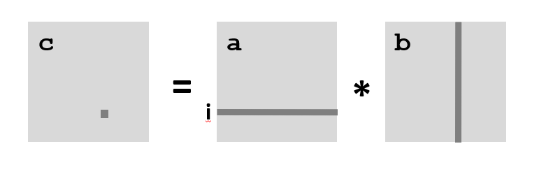

假定: 矩阵元素都是双精度浮点数; 缓存块大小 = 8 个双精度浮点数; 缓存大小 C << n (远小于n)


上面是一个原始的无阻塞矩阵相乘, 正在计算 c[0][0]: 通过采用第 0 行和第 0 列的内积来做到这一点

行访问 A 矩阵: 因为是顺序读, 将每八个引用丢失一个块, 未命中数是 n / 8

列访问 B 矩阵: 跳到下一行的同一个位置时，之前的缓存块早被替换。所以每读一个数，就是一次新的未命中。未命中数 = n

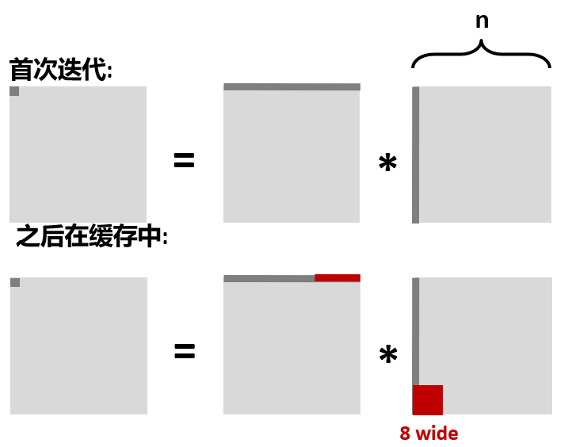

每计算 C 矩阵的一个点，总共未命中 `(n / 8) + n = 9n / 8` 次。矩阵 C 有 n ^ 2 个点
，总共未命中 `(9n / 8) * (n^2) = (9 / 8) * (n ^ 3)` 次

但因为矩阵太大（行宽超过了缓存容量），等到想复用它时，它已经被新的数据挤走了。

这意味着 CPU 大部分时间都在等内存传数据，而不是在做加法和乘法。

---


#### 处理后
现在重写代码以使用阻塞: 以图形方式看待它会简单得多

现在不再是一个点一个点地去算 C，而是一组块、一组块地更新: 把整个大矩阵切成了无数个 B * B 的小方块。

以前算 C 是用 A 的一行乘以 B 的一列；现在是用 A 的一排子块乘以 B 的一列子块。

- 取 A 的第一个子块和 B 的第一个子块，做一次**迷你矩阵乘法**，把结果累加到 C 的对应子块里。
- 取 A 的第二个子块和 B 的第二个子块，再做一次迷你乘法，继续累加。
- 依此类推，直到把这一排和这一列的子块全部处理完。

```c
c = (double *) calloc(sizeof(double), n*n);

/* Multiply n x n matrices a and b  */
void mmm(double *a, double *b, double *c, int n) {
    int i, j, k;
    for (i = 0; i < n; i+=B)
      for (j = 0; j < n; j+=B)
        for (k = 0; k < n; k+=B)
        /* B x B mini matrix multiplications */
            for (i1 = i; i1 < i+B; i++)
                for (j1 = j; j1 < j+B; j++)
                    for (k1 = k; k1 < k+B; k++)
                  c[i1*n+j1] += a[i1*n + k1]*b[k1*n + j1];
}
```
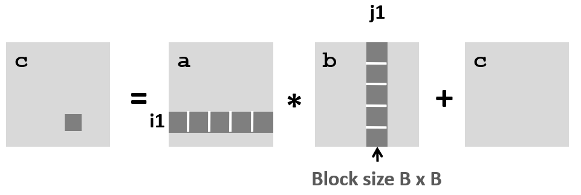
本质上和原始的矩阵乘法逻辑是一样的，只不过把**原子操作**从单个数字（标量）换成了小矩阵（块）。

这么做的原因是这些 B * B 的小矩阵被设计得刚好能完全塞进缓存: 一旦搬进来，在这个**迷你乘法**做完之前，它们就一直待在里面，再也不会像之前那样被无情地挤出去了。

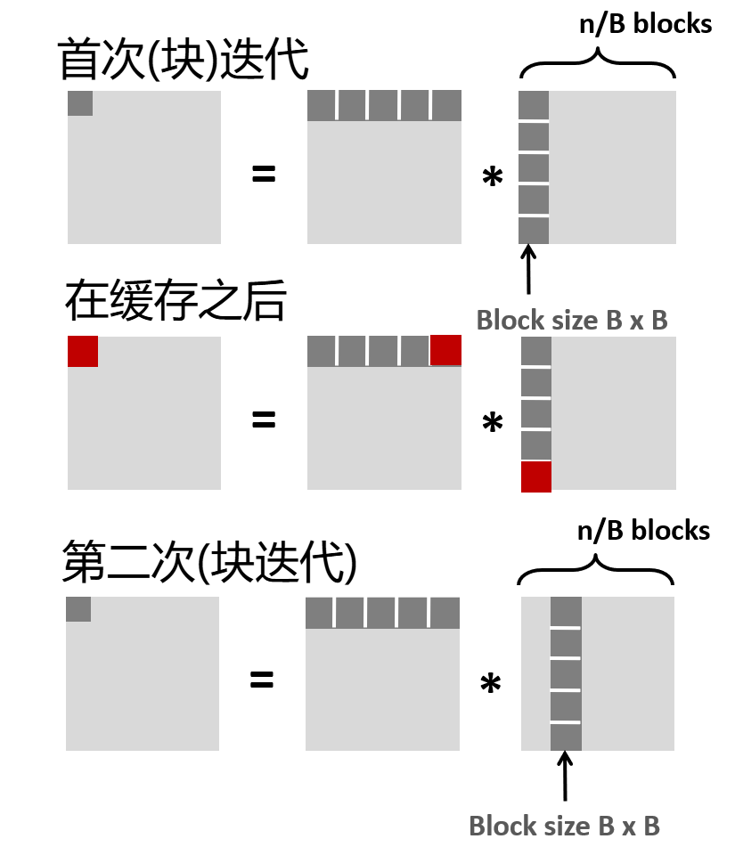


**处理单个子块 (Sub-block) 的代价:**

每个子块包含 `b*b` 个元素, 并且由于顺序读取，每个块加载需要 B*B 次未命中。

计算时涉及 A 的子块和 B 的子块，总代价为：2 * (B^2) / 8 = (B * B) / 4 次未命中


**计算 C 的一个子块 (第一次大迭代):**
为了完成 C 中一个 B 子块的更新: 需要遍历 A 的一排子块和 B 的一列子块。

这一排/列共有 n/B 个块。，总代价为：(n/B) * (B^2) / 4 = (n*B)/4 次未命中


**整个矩阵的总代价:**
结果矩阵 C 一共有 (n/B)^2 个子块, 总未命中数公式：((n/B)^2) * ((n*B)/4) = (n^3)/4B


通过分块技术，未命中次数从 $\frac{9}{8}n^3$ 降低到了 $\frac{1}{4B}n^3$。

| 指标 | 原始算法 | 分块算法 | 提升倍数 |
| :--- | :--- | :--- | :--- |
| **总未命中数** | $\approx 1.125n^3$ | $\frac{0.25}{B}n^3$ | **约 B 倍** |

分块技术通过减小工作集，强制让数据留在缓存中被多次复用。

只要 B 选取得当（使三个 B*B 的块能放入缓存），内存访问频率就会大幅下降。

---

### 分块缓存总结

不分块: (9/8) * (n^3)。分块: 1/(4B) * (n^3)

矩阵乘法具有固有的时间局部性：输入数据: 3n^2, 计算 2n^3, 每个数组元素被使用 O(n) 次

> 在第一个没有阻塞的情况下, 虽然未命中的数量是渐近相同的, 但是有这个很好的, 恒定因素的这个巨大差异, 所以没有阻止它是 9/8, 为了阻止它的 1/4b 我们现在我们可以把它降低

不分块（9/8）系数是 1.125; 分块（1/4B）系数变成了 1 / 4B。

通过增加块(B)大小给了一些控制: 如果方格 B=32，那么常数项就变成了 1 / 128 ~= 0.0078

但无法让块太大, 因为需要适合三个块: 建议最大可能的块大小 B: 需要限制 3 * B * B < C
