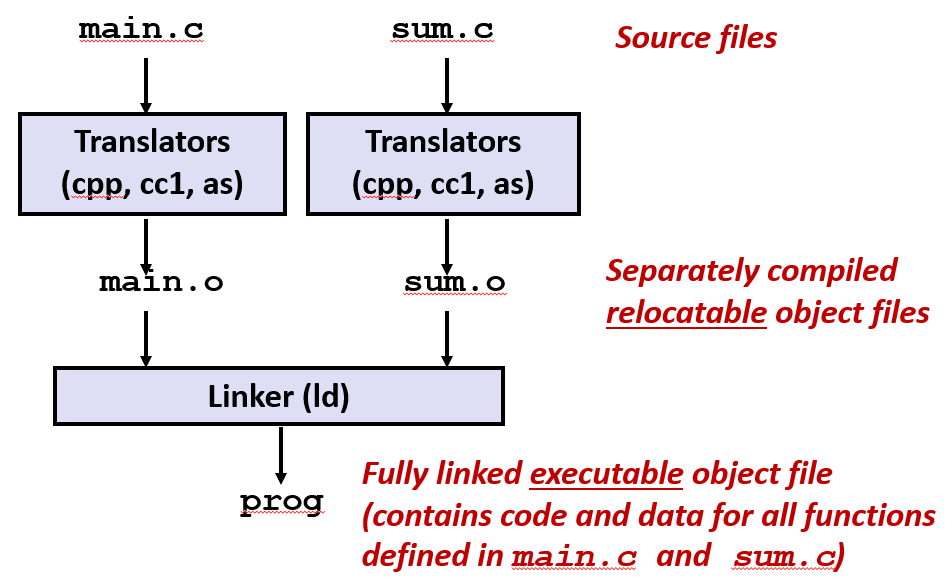
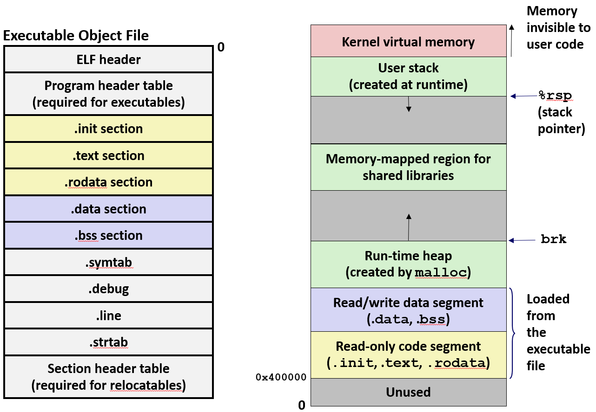
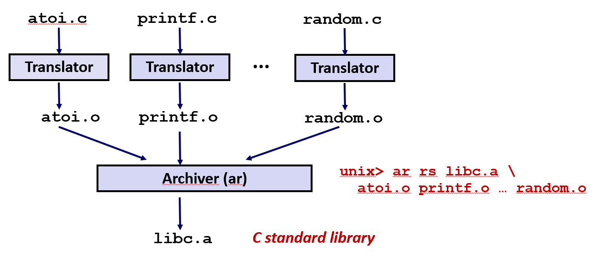
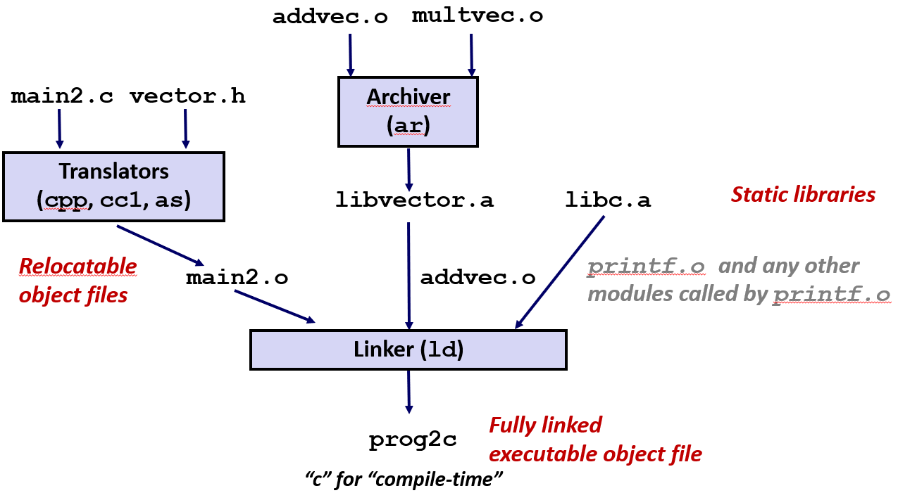
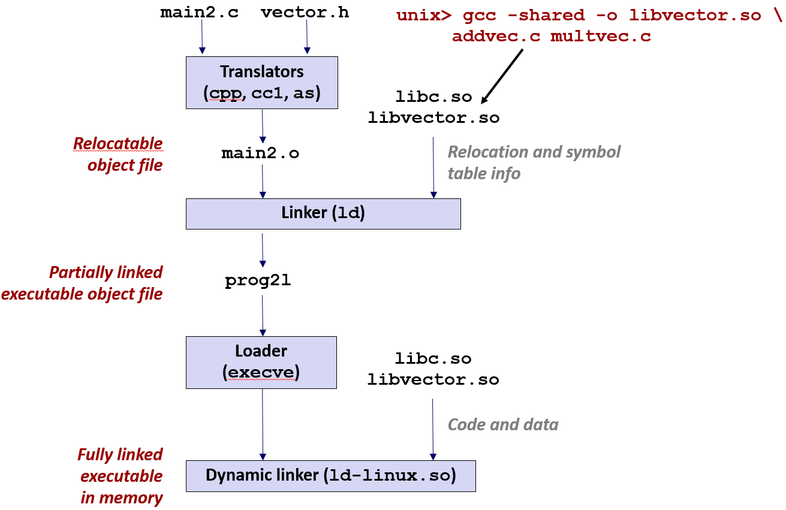

# Linking


从程序如何与硬件交互, 以及如何与特定系统软件中的软件交互开始, 从研究链接的过程开始, 弄清楚系统是如何构建程序


> 然后我将向你展示一项非常酷的技术, 称为**库打桩**技术
> 这允许你使用链接实际拦截像 C 标准库这样的库中的函数调用
> 所以它是一种非常强大而且有趣的技术, 它通过链接实现

## 链接

### 样例C程序

下面的程序里包含两个模块 main.c 和 sum.c: 
sum.c 将一个数组和一个长度 n 作为参数, 并计了该数组中元素的总和, 并将总和返回给调用者

main.c 调用了 sum 函数: 使用并传递一个两元素的 int 类型数组, 然后返回了从其中收到的值

> 是的, 我们认为像这样返回退出状态是件奇怪的事情: 但我们这样做, 以便编译器不会优化掉所有代码

<div style="display: flex; gap: 20px; align-items: flex-start;">

```c
int sum(int *a, int n);

int array[2] = {1, 2};

int main() {
    int val = sum(array, 2);
    return val;
}
```

```c
int sum(int *a, int n) {
    int i, s = 0;

    for (i = 0; i < n; i++) {
        s += a[i];
    }
    return s;
}
```
</div>

### 静态链接

程序使用编译器进行编译和链接:
```bash
linux> gcc -Og -o prog main.c sum.c
linux> ./prog
```




对于源文件 main.c 和 sum.c, GCC 会在这些模块上调用 .c 文件上的一系列翻译器: 
- 首先调用 C 预处理器 cpp(将 main.c 翻译成 ASCII 中间文件 main.i)
- 然后调用编译器, 实际上使用的编译器是叫 cc1(将 main.i 翻译成 ASCII 汇编语言文件 main.s)
- 编译器生成汇编程序, 然后汇编器将其翻译, 生成 .o 文件, 称为 main.o。sum.c 也发生了类似的事情
- 在这三个翻译器处理完代码之后, 生成了两个 .o 格式目标文件。
- 链接器将这些 .o 格式目标文件和必要的系统目标文件链接在一起, 生成单个可运行的可执行文件, 就可以加载并运行到系统上

> 这些 .o 文件虽然是我们分开编译的目标文件, 但我们还是要叫他们可重定位目标文件
> 因为它们可以组合在一起形成完全链接的可执行目标文件

---

### 为什么这么安排

程序可以写成更小的源文件的集合, 而不是一个庞大的整体。

为什么允许这种所谓的分离编译, 为什么不喜欢一个包含所有代码的大文件

**第一是模块化: 允许将代码分解成更小的部分**

可以将相关功能放入单独的源文件中, 可以构建公共函数库(例如: 数学库, 标准C库)

> 所以这只是一种很好的技术, 它可以让你将代码分解成很好的模块化的部分

**第二是效率: 所以这在时间和空间上都是有效的**

**时间上**: 所以如果把程序分为多个块, 当程序改变, 只需要更改其中一个块

没必要重新编译所有其他模块, 可以只编译更改的一个模块, 然后再将它们全部链接在一起

**空间上**: 只需要在代码开头写一行 `#include <stdio.h>` 就可以使用 C 标准库中的所有功能

通用函数可以聚合到一个文件中, 把成百上千个 `.o` 目标文件打包成了一个单独的库文件, 所以可以将它们放在一起

可执行文件实际编译并链接到的和运行的内存映像只包含它们实际使用的函数的代码: **静态链接只会把 `.a` 里面用到的 `.o` 文件打包到最终的可执行程序里**

> 你通常不知道你其实只使用 C 标准函数的一小部分。因此, 如果你不需要将所有这些功能链接到代码中, 那就没有意义了

---

### 做了什么

**第一个被称为简单解析(符号解析): 程序会定义和引用符号**

所以符号解析的意思: 在链接器链接过程中, 链接器将每个**符号引用**与一个**符号定义**相关联

```c
void swap() {}    /* define symbol swap 声明函数*/ 
swap();           /* reference symbol swap 引用, 调用函数*/
int *xp = &x;     /* define symbol xp, reference x 声明xp, 引用x*/
```
在符号解析步骤中, 链接器将每个符号引用与恰好一个符号定义相关联。
- 汇编器将**符号定义**存储在 可重定位目标文件中的一种**称之为符号表的一系列结构数组**里。
- 每个结构数组里面包含有关该符号的信息(比如符号的名称, 大小和位置等等信息)

这中间可能会有些问题: 比如在多个模块中, 可能会声明一个有相同名称的全局变量, **链接器必须决定将其中的某个定义用于所有后续引用**

> 一旦链接器和一个独一无二的目标建立联系, 每个引用都会有一个唯一的符号定义, 然后它执行第二步: **即重定位**

**第二个被称为重定位: 链接器必须弄清楚每个符号, 每个函数和每个变量是要准备存储在哪**

合并成为单个可执行目标模块后, 就可以直接在系统上加载和执行: 所以合并时必须进行重定位

最初的函数只是存储在其目标模块中的某个偏移处, **因为链接器不知道这些函数最终会被真正加载到内存中的哪个地方**

所以在重定向前目标模块中的函数地址只是在模块中的偏移量, 对于数据也是如此


在重定位步骤期间, 链接器首先会决定: 
- 当程序执行时, 每个符号最终将位于 **虚拟内存地址空间** 中的哪里
- 将那些 **具体的内存地址数值(比如 0x400500)** 绑定到符号

然后它会继续向下执行, 并查看所有**先前不知道地址并留空位的符号**的引用

然后它会将那些**具体的内存地址数值**填到留空的符号, 以便它们现在能指向正确的地址

- 在 .o 文件阶段, 编译器不知道 sum 的地址, 所以它在调用处留了一个空位(通常填 0)
- 链接器在第一步已经确定了 sum 函数最终会住在 0x400800。
- 链接器回头去找 main.o 里那个"空位", 把里面的 0 擦掉, 填上 0x400800

> 好的, 所以弄清楚原料要去哪里, 对于每个定义, 找出它要去的位置以及每个引用, 然后更新该引用, 所以它现在指向正确的位置

---

### 目标文件(模块)

#### 可重定位目标文件 (.o 文件)

每个 `.o` 文件都是由一个源 `.c` 文件生成的, 并且包含代码和数据

每个 .o 文件都是汇编器的输出, 是可重定位目标模块。但它不是一个二进制文件, 不能以任何形式直接加载到内存中

在实际使用之前, 需要由链接器对其进行操作: 在编译时与其它可重定位目标文件合并形成可执行目标文件。


#### 可执行目标文件 (a.out 文件)
由链接器生成的可执行目标文件被称为 a.out 文件。包含代码和数据, 其形式可以直接被复制到内存并执行。

> 在历史上第一个 Linux 操作系统就是可执行的

在 Unix 的早期(70-80年代), 编译器非常简单。如果运行 `cc main.c` 而不指定输出名字, 就会默认生成一个叫 a.out(Assembler Output的缩写) 的文件。

现代在 CMake 中 `add_executable(my_prog main.cpp)` 如果不加 `my_prog`, `CMake` 甚至无法生成构建文件。

但如果在在原始终端里输入 `gcc main.c` 便会生成 `a.out`。如果输入 `gcc main.c -o hello` 便会生成 `hello`。

> 这是 Unix 开发人员使用的默认名称, 其可执行文件的默认名称是 a.out, 所以这只是一个历史原因所以它被称为 a.out

#### 共享目标文件 (.so 文件)

共享目标文件 (.so 文件) 是一种特殊类型的可重定位目标文件。Windows下叫动态链接库 (DLLs)。

是一种用于创建共享库的现代技术, 可以在加载或运行时被动态加载到内存并链接。在

> 那个我们之后再了解, 将在今天晚些时候再学习了解

---

### 可执行可链接格式(ELF)

ELF二进制文件是目标文件的标准二进制格式。是可重定位目标文件 `.o`, 可执行目标文件`a.out`, 共享目标文件 `.so` 的一个统一格式

#### 格式 

**Elf头**: 它提供了关于这个二进制文件的一般信息, 定义了(生成该文件系统的)字节顺序和字的大小, 无论是 .o, .out 还是 .so

**段(节)头部**表: 它只在可执行目标文件中定义: 指出代码的所有不同段在内存中的位置

> 那么你的栈在哪里, 你的共享库去了哪里, 你初始化数据和未初始化数据的位置在哪里, 你的代码去了哪里, 所有这些不同的部分都在段头表中定义

**.text节**: 出于某种神秘的历史原因它被称为 `.text` 部分, `.text` 一般是代码

**只读数据**: 比如 switch 语句中的跳转表。因此, 文本 .text 和只读 .rodata 都是只读的, 不能写入。

**.data 节**: 它包含了所有初始化全局变量的空间

**.bss节**: 它定义了未初始化的全局变量。但实际上并没有占用 .o 文件中的任何空间, 因为它所做的是记录未初始化的全局变量需要多少空间

链接时, 告诉链接器把所有未初始化的变量堆在一起, 计算出它们的总和; 

加载时, 加载器看到 `.bss` 的总大小, 直接在内存里"划"出一块空白地。

> .bss 是另一种神秘的名字, 应对可以追溯到 60 年代, 那时候 IBM 指令将其称为块符号
>
> 我认为理解它的意义最好的方式是 better save space (BSS) 的缩写

|组成部分 / 节 (Section)|主要内容与功能|关键特征 / 备注|
|-|-|-|
|ELF 头 (ELF Header)|"系统字长 (32/64位)、字节序 (大/小端)、文件类型 (.o, exec, .so)、机器类型等。"|文件的"魔数"和总纲, 位于文件开头。|
|段头部表 (Segment Header Table)|页大小、节的虚拟内存地址、节的大小。|仅可执行文件必需, 用于指导加载器如何映射到内存。|
|.text 节|编译后的机器指令(代码)。|只读, 存储程序逻辑。|
|.rodata 节|只读数据：如 printf 的格式化字符串、switch 语句的跳转表等。|只读, 防止程序运行时意外修改。|
|.data 节|已初始化的全局变量和静态变量。|占用目标文件空间。|
|.bss 节|未初始化的全局变量和静态变量。|Better Save Space: 在文件中仅占一个占位符, 不占实际空间。|
|.symtab 节 (符号表)|函数和静态变量的名字、节的名称和位置。|记录程序中定义和引用的所有符号。|
|.rel.text 节|.text 节的重定位信息。|指明哪些指令的地址需要在链接时被修改。|
|.rel.data 节|.data 节的重定位信息。|指明哪些全局变量指针的地址需要在链接时被修改。|
|.debug 节|调试符号信息(如 gcc -g 生成的内容)。|包含源程序中的变量名、行号等, 用于调试。|
|节头部表 (Section Header Table)|描述每个节在文件中的偏移量和大小。|文件的"目录", 位于文件末尾。|


**符号表(.symtab)**: 它包含程序全局变量的结构数组, 以及使用 static 属性定义的任何内容, 并且这些符号中的每一个都在符号表中获得了一个条目

**重定位节**: 有两个部分称为包含重定位信息的部分, 称为记录。当链接器去识别 **所有对符号的引用(确定地址)** 时, 它就会记下一些记录

当汇编器在生成 .o 文件并遇到一些无法确定地址的东西时, 例如: 汇编器知道这里要产生一个 call 指令, 但它根本不知道 printf 最终在内存的哪个位置

汇编器会先在指令里填全是0的假地址, 然后通知链接器: 等知道 printf 的真地址后, 记得回来把它填上

重定位节或者说记录(.rel.text 或 .rel.data)通常包含三样东西:
- 偏移量 (Offset)：代码中哪个具体位置需要修改？(比如：第 50 字节处)。
- 符号 (Symbol)：那个位置对应的是哪个名字？(比如：printf)。
- 类型 (Type)：应该怎么改？(是直接覆盖 32 位地址, 还是计算相对偏移量？)。

链接器在创建可执行文件的过程中, 链接器会扫描所有的 .o 文件：它看到了代码和配套的重定位节, 便会读取里面的记录。

**调试部分**: 它包含了将源代码中的行号与机器代码中的行号相关联的信息。所以这叫做 `.debug`, 是用 `-g` 编译时得到的


**节头表**: 告诉所有这些不同部分的起始位置

---

### 链接器符号

#### 全局符号

在模块(源文件)中定义的 **没有静态属性的全局变量或函数名** 都可以被其他模块使用的符号
```c
int count = 10;        // 没有静态属性的全局变量
void say_hello(); // 没有静态属性的函数
```

#### 外部符号
外部符号是一种全局符号: 被模块引用, 但由某些其它模块定义的全局符号。

当每个模块编译成一个 .o 文件, 并调用由其他模块正确定义的, 在当前 `.c` 文件里没有找到实现的函数时: 

编译器不会抛出错误, 因为它假设那些是在其他模块中有实现, 它假定链接器能够找到它们并确定地址。

#### 局部符号
在模块(源文件)中定义的 **有静态属性的全局变量或函数名**, 只能从该模块中引用的符号
```c
static int x = 0;      // 局部符号：链接器知道它在 m.o 里, 但不会让别的模块碰它
static void hidden() { x++;}// 局部符号：私有函数
```

**本地链接器符号(局部符号)不是本地程序变量(局部变量)**:

|概念|术语 (英文)|存储位置|链接器能看到吗|
|-|-|-|-|
|局部变量|Local Variable|栈 (Stack)|看不到(它是运行时的临时数据)|
|局部符号|Local Symbol|数据节 (.data/.bss)|看得见(它是静态存储的)|

在函数内部定义的 `int a = 10;` 是存放在寄存器或栈里的。**链接器的工作是在程序运行前拼凑零件, 它根本不关心函数内部运行时的临时变量。**


---


### 符号解析


下面的这个例子程序引用了一个全局调用数组, 定义了一个全局调用 main 函数, 引用一个全局调用 sum 函数

val 是堆栈上的局部 C 变量, 链接器实际上对其没有任何了解。现在加载 i, s, 当然这两者也是局部变量

<div style="display: flex; gap: 20px; align-items: flex-start;">

```c
int sum(int *a, int n);

//[2]: that’s defined here
int array[2] = {1, 2}; 

int main()//(): Defining a global
{   //sum: Linker knows nothing of val
    int val = sum(array, 2); //2: Referencing a global…
    return val;
}
```
```c
int sum(int *a, int n) //…that’s defined here
{
    int i, s = 0; //Linker knows nothing of i or s
    
    for (i = 0; i < n; i++) {
        s += a[i];
    }
    return s;
}
```
</div>

#### 本地符号

在这个函数 f 中定义一个类型为 int 的局部静态变量, 这个变量 x 只能在函数 f 中引用; 函数 g 中 x 的这个定义也类似, 只能被函数 g 引用


<div style="display: flex; gap: 20px; align-items: flex-start;">

```c
int f() {
    static int x = 0;
    return x;
}
```
```c
int g() {
    static int x = 1;
    return x;
}
```
</div>

用静态属性声明的变量不存储在堆栈中, 而是存储在 .data 文件中: 

所以这是一个存储在 .data 而不是堆栈中的全局变量, 但它的范围仅限于所在的函数

**本地 `non-static C` 变量保存在栈上。本地 `static C` 变量保存在 `.bss` 节或者 `.data` 节中。**

编译器在 .data 节中为每个x的定义分配空间, 在符号表中为本地符号创建唯一的名字来消除歧义

> 也许它会称之为 x.1, 也有可能叫 x.2。这些符号分配在在 .data 中, 因为它们已初始化并且像任何其他符号一样会获得符号表条目

#### 强弱符号

程序符号被定义为强或弱, 程序符号要么是强(Strong)符号, 要么是弱(Weak)符号:

过程, 函数名称或已初始化的全局变量是**强符号**; 未初始化的全局变量是**弱符号**。

<div style="display: flex; gap: 20px; align-items: flex-start;">

```c
//p1.c
int foo = 5; // <--strong
p1() {  // <--strong
}
```
```c
//p2.c
int foo; // <--weak
p2() {  // <--strong
}
```
</div>

在 `p1.c` 中: 根据定义 p1 是强符号, 因为 `int foo` 已初始化, 所以是强符号

在 `p1.c` 中: 因为 `int foo` 没有初始化就是弱符号, `p2` 的定义的话就是强符号


#### 解析重复的符号
在符号解析阶段, 链接器会扫描所有引用, 并确保每一个引用都精准地指向一个唯一的符号定义

针对不同模块中都有相同的符号定义, 编译器作出了如下规定: 

**不允许有多个同名的强符号, 每个强符号只能被定义一次, 否则链接错误:**

如果在多个模块中, 声明一个具有相同名称的函数, 链接器将抛出一个不允许的错误


**如果有一个强符号和多个弱符号同名, 那么选择强符号, 对弱符号的引用会解析为对强符号的引用:**

如果在多个模块中声明一个强符号和多个具有相同的名称的弱符号, 那么编译器将选择强符号, 并将所有对该符号的引用关联到该强符号

<div style="display: flex; gap: 20px; align-items: flex-start;">

```c
#include <stdio.h>
int x = 100; /* 强符号：因为它被初始化了 */

void print_x();

int main() {
    printf("Main thinks x is: %d\n", x);
    print_x();
    return 0;
}
```
```c
#include <stdio.h>
int x; /* 弱符号：因为它没有初始化(属于 .bss 节) */

void print_x() {
    /* 这里的 x 最终会指向哪里？ */
    printf("Helper thinks x is: %d\n", x);
}
```
</div>

```bash
# 链接器会把 helper.o 中所有对 x 的引用, 全部指向 main.o 里的那个地址
Main thinks x is: 100
Helper thinks x is: 100
```

**如果有多个弱符号同名, 那么选择任意一个。可以用 `gcc –fno-common` 参数覆盖这个规则**
    
如果有多个弱符号同名, 那么会从这些弱符号中任意选择一个。

如果用 `gcc –fno-common` 的参数声明函数, 多个弱符号将在链接器中抛出错误


这种"多个弱符号不报错"的机制被称为 Common Block 机制。它的存在主要是为了兼容老旧的 FORTRAN 语言。

链接器认为反正都没给初始值, 就全部揉在一起, 在 .bss 节里开辟一块足够大的空间共用就行

如果 A.c 里写 `double x;` , B.c 里写 `int x;`。链接器通常会选空间大的那个。

这时候 B.c 以为自己在改一个整数, 其实在改一个浮点数的一半。这种 Bug 极难排查

从 GCC 10 开始默认设置从 `Common Block` 变为了 `-fno-common`


> 如果你不了解这些东西, 你可能会遇到一些非常严重的问题, 这些东西容易令人困惑和混淆
> 
> 链接器错误就是最糟糕的那种, 它们是最难调试的, 因为人们通常不知道链接器的内部发生了什么
> 
> 而且通常只有最好的程序员真的理解里面发生了什么, 你知道这些链接器是如何工作的, 它们可以抛出什么样的错误以及如何调试它们


#### 链接器难题
噩梦场景：**两个相同的弱结构, 由不同的编译器编译, 具有不同的对齐规则。**

<div style="display: flex; gap: 20px; align-items: flex-start;">

```c
int x;
p1() {}
```
```c
int y
p1() {}
```
因为两个强符号(p1), 所以链接时会发生错误
</div>

<div style="display: flex; gap: 20px; align-items: flex-start;">

```c
int x;
p1() {}
```
```c
int x;
p2() {}
```
对 x 的引用将指代相同的未初始化的 int。
</div>


<div style="display: flex; gap: 20px; align-items: flex-start;">

```c
int x;
int y;
p1() {}
```
```c
double x;
p2() {}
```
链接器会选择占用空间最大的 `double x`, 
p1.c 中 x 和 y 内存布局是紧挨着的, 
所以 p2 中对 x 的写会覆盖 y
</div>

<div style="display: flex; gap: 20px; align-items: flex-start;">

```c
int x = 7;
int y = 5;
p1() {}
```
```c
double x;
p2() {}
```
链接器看到强符号int x = 7和弱符号double x。
因为优先选择强符号, 
所以 x 的地址被定在只有 4 字节的空间上的int x
</div>


<div style="display: flex; gap: 20px; align-items: flex-start;">

```c
int x = 7;
p1() {}
```
```c
int x;
p2() {}
```
对x的引用将指代相同的已初始化的变量。
</div>


普通局部变量函数结束就销毁, 而 static 局部变量在函数结束后, 仍保留上次的值。

早期的随机数生成器用的这个写法：

生成随机数公式通常是: `Next = (Current * A + B) mod M`, 

那就需要一个地方存这个 Current, 以便下次调用函数时知道上次算到哪了。

这时就会用 `static int seed;`。它只在模块内可见(私有), 但它的寿命是永久的。

**这种写法在多线程环境下线程不安全, 因为多个线程会同时改这个唯一的 seed**

#### 使用建议

**如果可能的话, 请避免使用全局变量**。如果必须使用的话, 尽可能做到如下几点:
- 尽可能使用 static 修饰: 因为那样会限制了它声明的模块的范围
- 如果定义了一个全局变量, 请初始化它: 以便于编辑器查看是否有多个具有相同名称的初始化全局符号
- 如果引用了一个外部的全局变量, 则通过使用 extern 属性告诉编译器

---

### 重定位

链接器已经将每个符号引用与一些简单的定义相关联: **现在它必须获取所有这些对象可重定位目标文件, 并将它们组合在一起并创建一个大的可执行文件**

拿一个小运行示例来举例: 每个 main.o 和 sum.o 都包含了代码并初始化数据。sum.o 没有初始化数据, 只有代码。然后系统代码在程序之前和之后运行

由左边的 可重定位目标文件 组成右边的 可执行目标文件:
<div style="display: flex; gap: 20px; align-items: flex-start;">

|lib.c|System code| .text|
|-|-|-|
|lib.c|System data| .data|
|main.o|main()|.text|
|main.o|int array[2] = {1,2}|.data|
|sum.o|sum()|.text|

||Headers|
|-|-|
|.text|System code|
|.text|main()|
|.text|swap()|
|.text|More System code|
|.data|System data|
|.data|int array[2] = {1,2}|
||.systab .debug|

</div>

当链接器重定位目标文件时: 它将所有代码都放在每个模块的文本部分中, 并按照确定的顺序将目标文件连续地放在可执行对象文件的 .text 部分中来组合在一起

它在可执行文件中创建了一个包含所有系统代码和模块中定义的所有代码的 .text 部分, 然后它会对数据采用所有 .data 做同样的事情: 组合的 .data 部分


后面还会出现符号表和调试信息: 重定向这些目标文件需要链接器来弄清楚它们实际存储在哪里

当程序加载时, 这些不同的符号, 例如必须为函数 main 选择从某个绝对地址开始。它会对 swap() 做同样的事情, 以保证所有数组都是正确的

#### 启动与退出

想象有一个库文件(或者是标准库中的一部分), 暂且称它为 lib.c, 里面定义了那些负责‘启动’和‘收尾’的系统级函数。

程序运行时从 lib.c 开始执行启动代码: 它主要做这一类初始化的事情, 最后一件事是调用 main 并传递 `rc(int argc)` 和 `rv(char *argv[])`

并不是 main 执行完 `return` 程序就会结束, 文本和数据会消失, 而是会回到启动代码。启动代码调用 _exit 系统调用告诉操作系统: 彻底结束, 回收内存。


#### 重定位条目

先前提到在编译代码时, 编译器不知道链接器将选择哪些地址, 所以会填充 0, 并且编译器会向**称为重定位条目的链接器**创建这些提醒

这些提醒存储在目标文件的重定位部分中, 链接器根据指令进行重定位, **这些指令被称作重定位条目**

有一个被填充为 0 的符号引用必须要修改, 在代码实际进行重定位后并合并到可执行文件中

下面的例子在 main.c 模块中引用了名为 array 的全局符号和名为函数 sum 的全局符号, 因此编译器会创建两个重定位条目。

##### 第一个条目(引用)

因为 `sum` 函数输入数组作为其参数来获取数组地址, 所以将第一个参数的数组地址传送到 `%edi` 中。

但编译器不知道该地址会是什么, 所以它暂时把立即数值 $0x0 传送到 %edi: 所以可以看到这是全零(bf 是 mov 指令后面全都是 0)


填充完 0 后, 它将此重定位条目放在 main.o 的重定位部分中, 并1在偏移量 a 处告知链接器

这里 main.o 模块的函数 main 在模块的 .text 部分的模块的代码部分偏移为零的地方开始, 如果此模块中还有其他函数(功能), 则会在函数 main 地址结尾处开始


编译器以 **.text节** 为开始生成这些指令的偏移量: 在翻译 main 时发现 `mov array, %edi` 位于整个 .text节开始后的第 10 个字节(即十六进制的 0xa)

于是编译器便会通知链接器合并完文件后, 来 .text节 的偏移量 a 处填数

函数 main 是从 .text节 开始, 然后开始翻译并一直到翻译到了 .text 开始的 a 处, 发现这里要填个 4 字节地址(地址都是4字节)


编译器不知道 sum 实际上会在哪里结束, 即使 sum 是在模块中定义的, 编译器甚至不知道它所在的模块, 甚至它是什么模块: 所以在这种情况下它只能用全零来调用

然后编译器添加了对链接器通告的重定位条目: 在偏移量 f 处有一个四字节的 pc 相对引用, 用于汇总调用 sum

<div style="display: flex; gap: 20px; align-items: flex-start;">

```c
int array[2] = {1, 2};

int main() {
    int val = sum(array, 2);
    return val;
}
```

```s
0000000000000000 <main>:
   0:   48 83 ec 08             sub    $0x8,%rsp
   4:   be 02 00 00 00          mov    $0x2,%esi
   9:   bf 00 00 00 00          mov    $0x0,%edi      # %edi = &array
                        a: R_X86_64_32 array          # Relocation entry

   e:   e8 00 00 00 00          callq  13 <main+0x13> # sum()
                        f: R_X86_64_PC32 sum-0x4      # Relocation entry
  13:   48 83 c4 08             add    $0x8,%rsp
  17:   c3                      retq
```
</div>

CPU在运行可执行程序时, 在调用函数时是使用 pc 相对寻址来解决的: 因为CPU不关心函数 sum 的绝对地址, 要做的仅是按照指令一行行的往下执行

链接器在生成可执行程序时, 并不知道运行时, 被填充为 0 的那部分需要被重新引用成什么样的相对地址

链接器只知道函数 sum 的绝对地址, 但CPU想要的是运行时**函数 sum 的相对地址**

在执行指令时, 程序计数器(在 64 位下叫 %rip, 在 32 位下叫 PC)并不是指向正在执行的那条指令, 而是指向下一条指令的开头。

链接器便知道 %rip 会在偏移量 f 后多跑 4 个字节, 于是链接器便能得出如下公式:
- **函数 `sum` 的绝对地址 = `%rip` + 函数 `sum` 相对于 `%rip` 的地址**
- **%rip = f + 4**
- **函数 sum 的相对地址 = 函数 sum 的绝对地址 - f - 4**

> 所以如果你真的想知道它是如何工作的, 我会在书中详细讨论它, 但这里的重点是链接器有足够的信息来实际填充正确的地址


#### 可重定位 .text 节

如果使用 objdump 来将可执行文件反编译, 就能得到**内存坐标、机器语言(十六进制)、以及人类语言(汇编)**

那么看到的就是这些一开始为 0 的字节现在已经被更新为在运行时用内存中数组的实际地址

链接器决定数组将会在地址 `0x601018(大端序)` 处, 将该地址传送到 ％edi: 

实际上修改了 mov 指令中该绝对地址中的四个字节, 原先的 `00 00 00 00` 已经被修改为了 `18 10 60 00(小端序)`


用 pc 的相对地址为 5 来更新函数 sum 的地址: CPU真正运行的那列 `e8 05 00 00 00`, `e5`是操作码, 是固定的机器指令。后面的是 32 位的相对地址

当它计算函数 sum 的绝对地址时, 它会采用程序计数器的当前值, 即下一条指令 0x4004e3

> 它将增加它在这个区域的任何值, 可以把它解释为一个二进制补码整数, 它是相对的, 因此可以减或加

在这种情况下, 它表示要调用的函数是在 0x4004e3 + 5 = 0x4004e8, 这是 sum 的地址

```s
00000000004004d0 <main>:
  4004d0:       48 83 ec 08       sub    $0x8,%rsp
  4004d4:       be 02 00 00 00    mov    $0x2,%esi
  4004d9:       bf 18 10 60 00    mov    $0x601018,%edi  # %edi = &array
  4004de:       e8 05 00 00 00    callq  4004e8 <sum>    # sum()
  4004e3:       48 83 c4 08       add    $0x8,%rsp
  4004e7:       c3                retq

00000000004004e8 <sum>:
  4004e8:       b8 00 00 00 00          mov    $0x0,%eax
  4004ed:       ba 00 00 00 00          mov    $0x0,%edx
  4004f2:       eb 09                   jmp    4004fd <sum+0x15>
  4004f4:       48 63 ca                movslq %edx,%rcx
  4004f7:       03 04 8f                add    (%rdi,%rcx,4),%eax
  4004fa:       83 c2 01                add    $0x1,%edx
  4004fd:       39 f2                   cmp    %esi,%edx
  4004ff:       7c f3                   jl     4004f4 <sum+0xc>
  400501:       f3 c3                   repz retq
```

编译器计算了重定位条目, 链接器只是盲目地浏览每个重定位条目, 按照它所说的去做, 结果是所有这些引用都已使用有效的绝对地址进行了修补


---

### 加载可执行目标文件

链接器创建的可执行目标文件可以加载代码和数据, 可以直接加载到内存中而无需进一步修改

> 如果查看可执行文件中的所有只读部分, 会发现有这个 .init 部分: 不用担心, 所有代码都在 .text 中, 跳转表之类的东西都在 .rodata 中

所有这些数据都可以直接加载到内存中, 这些字节可以直接复制到内存中, 这形成了所谓的只读代码段

.data 和 .bss 部分中的数据也可以直接复制到内存中, 在变量和 .data 的区域下, 它们将被初始化为存储在符号表中的值





右边的是一个存储模型, 这是每个 Linux 程序看到的(内存)地址空间: 从 0 开始画地址, 随着往上而增加。

每个程序都加载到相同的地址 0x400000。代码直接来自目标文件, 数据直接来自目标文件

然后是运行由 malloc 创建和管理的堆, 它紧随数据段之后开始并向上发展。所以当需要动态分配内存时, 比如使用 malloc, 内存来自这个堆。

栈位于可见内存的最顶层, 可供应用程序使用。栈会逐渐减少, 这样就可以管理并创建一个运行时间

上面的内存仅限于内核: 如果尝试访问这些内存位置, 将收到段错误

在栈和堆之间的这个巨大区域, 将会在某个地方存在共享库的一个区域: 因此 .so 文件都被加载到共享库的内存映射区域

堆的顶部**由内核维护的, 名为 `break, brk` 的全局变量**指示。栈顶部由通用寄存器 %rsp 指示


如果实际查看 malloc 返回的地址, 实际上有两个堆: 从图中看到靠近栈的内存映射区和靠近代码段的传统堆


||管理方式|适用对象|分配算法|
|-|-|-|-|
|传统堆|通过 brk 指针向上增长|申请几十个字节的小目标|为了速度会预先从内核要一大块地, 然后内部慢慢分|
|内存映射区|使用 mmap 系统调用, 在栈和堆之间的那块巨大的"无人区"里直接划出一块地。|申请几百 MB 的大型目标|直接找内核要一整块页表, 不用了就立刻还给内核, 避免内存碎片|

小对象的堆通常集中在低地址, 它们离得很近, 所以空间局部性好: 当在一个小范围内频繁访问小对象时, 它们更容易命中 CPU 的 高速缓存

---

## 打包通用函数

> 作为程序员, 我们总是希望做的某些事情, 我们总是希望创建抽象, 然后将这些抽象呈现给用户, 作为程序员我们总是想抽象定义 api

链接的一个真正优势是创建库, 要实现 api 并将其提供给其他程序员, 考虑到目前为止的链接器框架:

**可以把所有的功能都放在一个大的 C 文件中:**
- 想使用这些功能的程序员只需将大的 C 文件链接到他们的程序中即可
- 可能会变得有点笨重, 空间和时间效率低下, 例如 libc 有数百种功能


**将每个函数放在一个单独的源文件中:**
- 程序员明确地将合适的二进制文件链接到他们的程序中
- 但会很麻烦, 因为该程序必须知道所有这些函数的位置, 并放在 make 文件中: 最终可能会向 GCC 提供一个非常大的命令行


### 老式解决方案: 静态库

> Unix 开发人员提出的第一个解决方案, 有些人称它为静态库

将相关的可重定位目标文件连接到具有索引的单个文件中称之为创建静态库

静态库本质是将一堆的 .o 文件和具有索引的内容目录放在一个称为(.a 归档文件)的大文件中

所以生成的 .a 文件就是 .o 文件的集合。将 .a 文件传递给链接器, 链接器只需要实际引用的 .o 文件并将它们链接到代码中

#### 创建

通常使用一个名为 archive 或 AR 的工具(或者叫 ranlib 的工具)来创建 .a 文件: 工具会在归档文件的头部生成一张符号表(Symbol Table)

链接器只要查这张表, 就能瞬间定位到 printf.o 在文件里的哪个偏移行

比如在 libc 中只调用 printf, 就会只把得到的唯一 .o 文件是 printf.o 链接进去




和以前采取的方式一样: 将想要的所有函数放在库中, 通过翻译器运行它们来获取 .o 文件, 我们将这些文件传递给归档器以获取归档文件

> 所以在种情况下 libc.a, 可能有 printf 代码, 我们想使用

可以随时重新创建该档案: 如果其中一个函数发生变化, 比如说 printf 更改, 只需重新编译 printf, 然后重新存档所有 .o 文件

#### 常用的库

> 这些库的惯例是, 库总是以 lib 为前缀, 这样做对它的作用进行了一些额外暗示

|库名称|文件名|档案大小|目标文件数 (.o)|主要功能模块|
|-|-|-|-|-|
|C 标准库|libc.a|约 4.6 MB|1496 个|I/O、内存分配 (malloc)、信号处理、字符串处理、日期时间、随机数、整型数学|
|C 数学库|libm.a|约 2.0 MB|444 个|"专门的浮点数学运算：sin, cos, tan, log, exp, sqrt 等"|	

<div style="display: flex; gap: 20px; align-items: flex-start;">

```
% ar –t libc.a | sort 
…
fork.o 
… 
fprintf.o 
fpu_control.o 
fputc.o 
freopen.o 
fscanf.o 
fseek.o 
fstab.o 
…
```

```
% ar –t libm.a | sort 
…
e_acos.o 
e_acosf.o 
e_acosh.o 
e_acoshf.o 
e_acoshl.o 
e_acosl.o 
e_asin.o 
e_asinf.o 
e_asinl.o 
…
```
</div>

---

#### 与静态库链接

这里创建了一个用来操纵向量的库(libvector.a):
- 一个函数可以将两个向量 x 和 y 相加并在 z 中返回结果
- 一个将对两个向量进行成对乘法 x [i] * y [i] 等于 z [i]

将两个函数打包成一个名为 libvector.a 的存档, 在主程序中调用其中一个函数 `addvec` 来将这两个向量 x 和 y 加在一起

<div style="display: flex; gap: 20px; align-items: flex-start;">

```c
#include <stdio.h>
#include "vector.h"

int x[2] = {1, 2};
int y[2] = {3, 4};
int z[2];

int main() {
    addvec(x, y, z, 2);
    printf("z = [%d %d]\n", z[0], z[1]);
    return 0;
}
```

```c
// libvector.a 包含 addvec.o 和 multvec.o
// addvec.c
void addvec(int *x, int *y, int *z, int n) {
    for (int i = 0; i < n; i++) {
        z[i] = x[i] + y[i];
    }
}
// multvec.c
void multvec(int *x, int *y, int *z, int n) {
    for (int i = 0; i < n; i++) {
        z[i] = x[i] * y[i];
    }
}
```
</div>

现在已经从 addvec.o 和 multvec.o 构建了存档 libc.a, 并将该存档与 main.o 可重定位目标文件一起传递给链接器

链接器阅读 main.o 后发现 addvec 和 printf 的缺失, 然后根据编译器给的重定位条目(未解析符号列表)去其他的 .o 文件或 .a 库里寻找对应的定义




---

#### 静态链接中的符号解析与归档文件提取机制

链接器在使用静态库时会在命令行上按顺序扫描所有 .o 文件和 .a 文件。在扫描期间, 链接器会保留当前未解析的引用列表。

> 它首先会看看 main.o 有一个对 printf 的引用, 这是一个未解析的引用, 因为 printf 未在 main.o 中定义

当遇到每个新的 .o 或 .a 文件目标文件时, 尝试根据目标文件中定义的符号, 来解析列表中的每个未解析引用。

链接器只关心这个文件里能提供什么符号, 如果它提供的符号不是所缺失的定义, 就直接跳过它, 不把它包含进来。

如果在扫描结束时未解析列表(重定位条目)中有任何条目, 那么就会出错


#### 命令行参数规范：路径搜索与单向扫描的顺序陷阱

参数 -L 定义了要查找的地方: 链接器会先根据 -L 定义的地方查找, 再去默认的例如 `/usr/lib` 或 `/lib` 查找

参数 -l 是对libxxx.a的缩写: 在 Linux 中库文件通常以 lib 开头, 以 .a 结尾。参数 -l 可以省略刚才的开头和结尾

这里的关键是**链接器将尝试在命令行上从左到右解析这些引用, 如果使用错误的顺序, 可能会遇到一些奇怪的令人困惑的链接器错误**


假设有一个名为 libtest 的对象模块调用了一个在 lmine.a 中定义的函数, 链接器会查看 libtest.o 中未解析的符号并且它检测到这个未解析的函数 libfun

所以链接器把函数 libfun  放在列表上然后继续扫描下一个命令行条目 lmine.a, 并发现了 libfun 的这个符号, 并将对 libfun 的引用解析为重定位地址的实际地址

> 现在, 如果我们切换顺序, 我们首先将 lmine.a 放在 libtest.o 之前

那么先解析 libmine.a 的话就会出现问题, 这个库中没有未解析的引用, 它只是函数定义的集合, 因此链接器会发现这一切都很好

然后链接器查看 libtest.o, 现在发现有未解析的引用 libfun, 但现在已经到了命令行的末尾, 所以就有了一个链接器错误

```bash
unix> gcc -L. libtest.o -lmine 
unix> gcc -L. -lmine libtest.o 
libtest.o: In function `main': 
libtest.o(.text+0x4): undefined reference to `libfun' 
```

> 所以你获取了这个神秘的错误信息, 如果你不了解此顺序规则, 你将不知道如何调试, 没关系, 静态库是一种老式的解决方案

---

### 现代解决方案: 共享库
假设编写了很多程序, 几乎每个程序都使用 printf, 如果用静态库编译的话, 每个可执行程序都必须有 printf 的副本

现代解决方案是使用**动态库(共享库)**提供了一个机制使得系统上运行的每个程序都将共享一个像 printf 这样的共享库成员的实例

在Linux中它们被称为 .so 文件, 在 windows 中, 它们被称为 dll 文件

> 现在是编译和链接到可执行目标文件时, 但实际上当程序加载到系统中时, 对共享库的引用的链接延迟了

- 静态库：链接时(编译阶段)合并代码, 地址在生成可执行文件时相对固定, **必须随程序一起加载。**

- 共享库：链接被推迟。不仅可以在程序启动时链接, 甚至可以在程序运行过程中**随时**被加载进来。

首次加载和运行可执行文件时, 可能会发生动态链接(加载时链接):
- Linux的常见情况, 由动态链接器自动处理(ld-linux.so)。
- 标准C库(libc.so) 通常都是动态链接的。 

动态链接也可以在程序开始执行后发生(运行时链接):
- 在Linux中, **分发软件**, **高性能web服务器**, **运行时库打桩**等都是通过调用 `dlopen()` 来完成


> 并且存在这样一个了不起的事: **共享库例程可以由多个进程共享**。当我们学习到虚拟内存时, 我们就会发现这是有意义的, 所以现在不要担心

>
> 直到可执行目标文件实际加载到内存中这也可以, 甚至可能发生, 它可能在程序实际加载到内存时发生, 但也可以在运行时随时在运行时发生
> 
> 你可以运行一个程序, 并且该程序可以任意决定加载在共享库中声明的函数,我会告诉你它真的很酷

#### 加载时链接

下面创建了一个包含函数 addvec 和函数 multvec 的动态库 `libvector.so` 和 C 开发人员创建的包含 printf 和其他标准库函数的共享库 `libc.so`

程序 main2 和之前一样调用函数 addvec。现在将 main2.o 和这些 `.s`o 文件传递给链接器

现在链接器在实际上并没有真的复制将要使用的 addvec 或 printf, 它实际上并不复制这些函数, 也并不在可执行文件中对它们执行任何操作

链接器在可执行文件中创建一个动态重定位条目。这个条目指示动态加载器在程序启动或运行时, 去共享库中找到真实的函数地址, 并回填到当前程序的相应位置。


当输入 ./main 时, 系统调用 execve 启动, 加载器获取可执行文件并将其搬进内存, 当加载器发现需要共享的 .so 文件中的 k 时, 加载器再去调用动态链接器

动态链接器会执行与静态链接器类似的过程, 修复引用以加回对 printf 的引用

> 我们将更多地了解 `execve`, 但这只是一个 sys 调用, 它将可执行文件加载到内存中并运行它们

所以函数 addvec 和函数 printf 的地址在程序加载之前是不确定的: 在加载程序之前, 动态链接器不会确定它



---

#### 运行时链接

> 好的, 现在真正酷的是你也可以在运行时进行动态链接, 所以我要向你展示加载时候发生了什么

```c
#include <stdio.h>
#include <stdlib.h>
#include <dlfcn.h>

int x[2] = {1, 2};
int y[2] = {3, 4};
int z[2];

int main() {
    void *handle;
    void (*addvec)(int *, int *, int *, int);
    char *error;

    /* Dynamically load the shared library that contains addvec() */
    handle = dlopen("./libvector.so", RTLD_LAZY);
    if (!handle) {
        fprintf(stderr, "%s\n", dlerror());
        exit(1);
    }

    //...

    /* Get a pointer to the addvec() function we just loaded */
    addvec = dlsym(handle, "addvec");
    if ((error = dlerror()) != NULL) {
        fprintf(stderr, "%s\n", error);
        exit(1);
    }

    /* Now we can call addvec() just like any other function */
    addvec(x, y, z, 2);
    printf("z = [%d %d]\n", z[0], z[1]);

    /* Unload the shared library */
    if (dlclose(handle) < 0) {
        fprintf(stderr, "%s\n", dlerror());
        exit(1);
    }
    return 0;
}
```

程序可以在运行过程中, 自主决定去加载某个库、链接其中的符号, 并调用那个库里定义的任何函数。

上述代码里只有一个函数指针：`void (*addvec)(int *, int *, int *, int);`。编译器此时不关心这个指针指向哪里, 它只保证调用这个指针时的参数是对的。


然后动态加载包含想要的函数的共享库: 调用 dlopen 然后把这个 .so 文件加载到内存中`handle = dlopen("libvector.so", RTLD_LAZY);`

懒加载(LAZY懒加载)是性能优化的精髓: 链接器把整个库搬进内存挂号, 但库里成千上万个函数地址先不费劲去一个一个算, 等真要用时, 再现场算

那么这个处理返回了一个句柄(Handle), 然后用在随后的调用中, 如果 handle 为空, 就会出现某种错误, 例如这个 .so 文件并不存在

将 **成功打开 `.so` 文件获得 `handle`** 和 **被调用函数的名称**作为参数输入给函数 dlsym, 便能将返回参数作为指向该函数的指针

> 然后我们可以像任何其他函数一样使用该函数, 因此我们可以使用该函数指针, 我们称之为**静态定义函数**

定义的 addvec 只是一个存储地址的变量。可以直接用这个变量的名字来调用函数, 就像它是一个普通函数名一样。

虽然从逻辑上讲是在解引用这个指针去寻找背后的代码, 但在 C 语法里, 不需要手动写 `*` 号。

如果只是单纯看这个指针的值, 它就是一个内存地址；只有当加上括号调用它时, 才真正进入了那个函数并获得了它的返回结果。

--- 

## 库打桩

### 定义
库打桩是一种强大的链接技术, 允许程序员**拦截对任意函数的调用**: 出于某种原因截获函数调用后记录一些统计数据或做一些错误检查, 然后按预期调用实际函数


当源码在被编译的时候; 当可重定位目标文件被静态链接以形成可执行目标文件时;当可执行目标文件加载到内存中, 动态链接, 然后执行时, **都可以进行库打桩**

---

### 包装函数

**库打桩技术可以进行名为包装函数的操作**: 在真正执行目标功能之前, 可以偷偷做点别的事情(比如记录日志、检查权限、甚至修改参数)

包装函数的流程示例：程序 -> 自定义 malloc -> 标准 malloc

不需要修改 main.c 的代码, 也不需要重新编译原来的程序, 就能强行让它运行包装函数代码

---

#### 后台加密

库打桩技术可以进行后台加密(即在数据写入文件或发送到网络前, 包装函数自动对其进行加密), 可以进行

---

#### 打桩沙盒

监禁沙盒就是通过打桩技术限制程序建一个只能看该看的东西, 只能动该动的文件夹:

##### 安全防护

例如从网上下载了一个不信任的播放器, 担心偷看文档, 可以用打桩技术拦截所有 open("/home/user/敏感信息.txt") 的调用。

##### 虚拟化

程序想写 /var/log, 包装函数偷偷把路径改成 /home/sandbox/var/log。程序以为自己在根目录下操作, 其实是在给它准备的"样板间"里玩耍, 不会破坏真实系统。

早期的沙盒工具(如 chroot 的某些辅助工具) 和 Docker 的部分原理会利用类似的逻辑

##### 网络隔离
包装 connect()：只允许程序连接指定的 IP 地址, 其他的连接请求直接在包装函数里掐断。

---

#### 程序调试

> 我知道的最棒的是 facebook 工程师做过的: 他们正试图在 Facebook 的 iPhone 应用程序中解决一个长达一年的错误, 没有人能弄明白发生了什么
>
> 他们使用库间定位来解决这个问题, 他们发现SPDY网络协议栈中的代码写入错误的位置
> 
> 他们通过拦截来自他们的 Facebook 应用程序的所有权限来解决这个问题, 然后做一些处理
>
> 他们只是拦截了所有这些电话, 然后他们就可以查看参数, 以及如何调用这些函数

底层代码通常是用 C 语言写的, 调用的是最原始的 POSIX 系统函数(比如 write、writev)。

在 iPhone 这种复杂的系统里, 源码成千上万, 不可能给每一行代码加打印调试。

于工程师们使用了**库打桩**拦截所有出口：他们用包装函数强行拦截了程序中所有对 write、writev 和 pwrite 的调用

每当程序想往硬盘或网络写数据时, 必须先经过这个包装函数: 在包装函数里就可以仔细检查哪个模块调用的, 目标内存地址, 数据长度

[源: Facebook工程博客文章](https://code.facebook.com/posts/313033472212144/debugging-file-corruption-on-ios/)

---

## 库打桩样例

目标: 在不中断程序和不修改源代码的情况下, 跟踪分配和释放的块的地址和大小

```c
#include <stdio.h>
#include <malloc.h>

int main() {
    int *p = malloc(32);
    free(p);
    return(0);
}
```
> 我们的想法是跟踪所有 malloc 和 free 调用, 所以这里有一个 malloc 调用, 以及下面调用了 free, 我们想知道这些地址是什么, 我们想知道这些大小是什么

所以可以在编译时, 链接时或运行时执行库打桩操作来进行跟踪

---

### 编译时

在 malloc.h 有个技巧: 将 malloc 定义为 mymalloc, 并且把 free 定义为 myfree

包装函数 mymalloc 能在相应的位置调用 __real_malloc 函数, 然后它打印出它调用的大小和 malloc 返回的地址: 当运行程序时会打印出这些所有这些地址

```c
// mymalloc.c
#ifdef COMPILETIME
#include <stdio.h>
#include <malloc.h>

/* malloc wrapper function */
void *mymalloc(size_t size) {
    void *ptr = malloc(size);
    printf("malloc(%d)=%p\n",
           (int)size, ptr);
    return ptr;
}

/* free wrapper function */
void myfree(void *ptr) {
    free(ptr);
    printf("free(%p)\n", ptr);
}
#endif
```

<div style="display: flex; gap: 20px; align-items: flex-start;">

```c
// malloc.h
#define malloc(size) mymalloc(size)
#define free(ptr) myfree(ptr)

void *mymalloc(size_t size);
void myfree(void *ptr);
```
```bash
linux> make intc
gcc -Wall -DCOMPILETIME -c mymalloc.c
gcc -Wall -I. -o intc int.c mymalloc.o
linux> make runc
./intc
malloc(32)=0x1edc010
free(0x1edc010)
linux>
```
</div>

> 我们调用它, 这里有个诀窍: 参数 -I 意思是在当前目录中查找任何 include 文件, 这与 -L 参数类似

---

### 链接时

也可以在链接时执行此操作, 如果要避免编译, 我们可以在定位时使用链接时间

因此使用这个特殊名称 __wrap_malloc 来定义我们的包装函数, 这会调用 __real_malloc 函数, 然后打印出信息


<div style="display: flex; gap: 20px; align-items: flex-start;">

```c
#ifdef LINKTIME
#include <stdio.h>

void *__real_malloc(size_t size);
void __real_free(void *ptr);

/* malloc wrapper function */
void *__wrap_malloc(size_t size)
{
    void *ptr = __real_malloc(size); /* Call libc malloc */
    printf("malloc(%d) = %p\n", (int)size, ptr);
    return ptr;
}

/* free wrapper function */
void __wrap_free(void *ptr)
{
    __real_free(ptr); /* Call libc free */
    printf("free(%p)\n", ptr);
}
#endif
```

```bash
linux> make intl
gcc -Wall -DLINKTIME -c mymalloc.c
gcc -Wall -c int.c
gcc -Wall -Wl,--wrap,malloc -Wl,--wrap,free -o intl int.o mymalloc.o
linux> make runl
./intl
malloc(32) = 0x1aa0010
free(0x1aa0010)
linux> 
```

</div>

|组成部分|语法/参数|链接器的具体动作 (背后逻辑)|最终效果|
|-|-|-|-|
|传递指令|`-Wl,<options>`|告诉 gcc：不要管后面的内容，直接原封不动传给底层链接器(ld)。同时将逗号替换为空格。|绕过编译器，直接指挥链接器。|
|重定向目标|`--wrap,malloc`|开启"包装"模式。寻找所有名为 malloc 的引用。|malloc 变成了"待解析"状态。|
|包装映射|`malloc → __wrap_malloc`|将代码中原本调用的 malloc 全部指向你写的 __wrap_malloc。|包装函数成功"截胡"。|
|真身还原|`__real_malloc → malloc`|将代码中调用的 `__real_malloc` 指向真正的、原始的 malloc 例程。|保证包装器依然能完成实际任务。|

---

### 加载/运行时

运行时打桩允许在不访问源代码、不访问 `.o` 文件, 甚至不重新编译程序的情况下, 直接拦截并修改任何可执行文件的行为。

参数 `LD_PRELOAD` 告诉动态链接器(`ld-linux.so`)优先搜索路径的环境变量:

- 动态链接器在解析符号(如 `malloc`)时, 会首先查看 `LD_PRELOAD` 列表中定义的库。
- 只有在这些位置找不到时, 才会去搜索标准的系统目录(如 `/lib` 或 `/usr/lib`)。

**这样就可以通过这个变量, 强行让任何程序先运行包装函数。**

关键参数 `RTLD_NEXT` 是特殊的伪句柄, 告诉 `dlsym` 跳过当前的库, 去"下一个"正常的搜索序列中寻找符号的地址:

- 将该地址存入一个函数指针(如 `mallocp`)。
- 在包装器内部, 你可以先执行自定义逻辑(如 `printf`), 然后通过 `mallocp` 调用真正的内存分配函数。
- 使用 `dlsym(RTLD_NEXT, "malloc")` 获取原始 libc 中 `malloc` 的真实地址。

**这样就避免无限递归(即包装器里的 `malloc` 又调用了自己), 找到"真正的"系统函数**


| 步骤 | 动作 | 常用命令 |
| - | - | - |
| **第一步** | 编写包装代码并编译为共享库 (`.so`) | `gcc -shared -fPIC -o mymalloc.so mymalloc.c -ldl` |
| **第二步** | 编译你的目标主程序 | `gcc -o intr intr.c` |
| **第三步** | 运行程序时注入环境变量 | `LD_PRELOAD="./mymalloc.so" ./intr` |


```c
#ifdef RUNTIME
#define _GNU_SOURCE
#include <stdio.h>
#include <stdlib.h>
#include <dlfcn.h>

/* malloc wrapper function */
void *malloc(size_t size)
{
    void *(*mallocp)(size_t size);
    char *error;

    mallocp = dlsym(RTLD_NEXT, "malloc"); /* Get addr of libc malloc */
    if ((error = dlerror()) != NULL) {
        fputs(error, stderr);
        exit(1);
    }
    char *ptr = mallocp(size); /* Call libc malloc */
    printf("malloc(%d) = %p\n", (int)size, ptr);
    return ptr;
}

/* free wrapper function */
void free(void *ptr)
{
    void (*freep)(void *) = NULL;
    char *error;

    if (!ptr)
        return;

    freep = dlsym(RTLD_NEXT, "free"); /* Get address of libc free */
    if ((error = dlerror()) != NULL) {
        fputs(error, stderr);
        exit(1);
    }
    freep(ptr); /* Call libc free */
    printf("free(%p)\n", ptr);
}
#endif
```

```bash
linux> make intr
gcc -Wall -DRUNTIME -shared -fpic -o mymalloc.so mymalloc.c -ldl
gcc -Wall -o intr int.c
linux> make runr
(LD_PRELOAD="./mymalloc.so" ./intr)
malloc(32) = 0xe60010
free(0xe60010)
linux>
```

- **全平台通用**：它对任何使用动态链接的 Linux 可执行文件都有效。
- **无需源码**：你可以劫持你完全没有源码的第三方闭源软件。
- **实时性**：打桩发生在程序加载的一瞬间, 这种"欺骗"链接器的行为不需要修改任何磁盘上的文件。