# Exceptional Control Flow Ecxeptions and Processes


## 异常控制流

异常控制流是现代系统非常重要的一个组成部分, 它存在于操作系统的各个层次, 从最底层的硬件, 直到软件


### 控制流

从第一次打开计算机时, 处理器只是简单地读和执行(解释)一个接一个的一系列指令。如果计算机有多个 cpu 核心, 那么每个核心会依次交替执行指令, 直到关闭计算机


整个指令执行的序列就是CPU控制流(控制流), 硬件正在执行的实际指令序列称为**物理控制流**

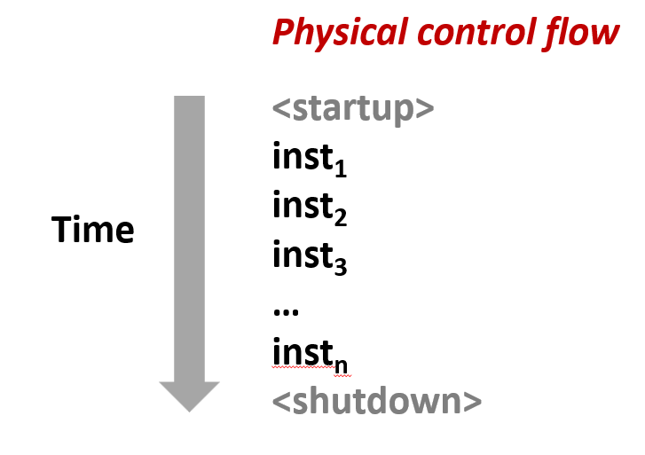

通常此控制流在内存中按顺序执行单条指令

#### 改变控制流

先前所了解的比较常用的两种改变控制流的机制 **跳转和分支**和**调用和返回**, 这些都是对**程序状态变化**的处理

以上两种很难对**系统状态的变化**做出反应, 真正的操作系统需要能够处理**系统级的变化**: 

数据从磁盘或网络适配器读取、指令除零、遇到 `Ctrl-C` 类型中断、系统定时器超时、程序执行非法指令

### 异常控制

系统需要叫做**异常控制流**的机制, 不同与在程序中看到的正常控制序列

#### 底层机制: 异常

系统中的所有级别都存在**异常控制流(ECF)**, 从最底层的硬件都有**异常**来响应某些**从底层系统事件来的控制流变化**, 比如系统状态的改变。

> **异常是由硬件和操作系统软件的组合共同实现的**, 等一会儿我们将会看到

#### 高层机制

在一个进程中, **上下文切换(进程切换)** 就是一个异常控制流的典型示例: 是由硬硬件定时器和操作系统内核共同实现的

比如正在执行当前进程中的代码时, 随即, 系统执行另一个进程的代码。刚才的进程就应该处于**挂起**状态

> 这是一种异常控制流: 你在一个进程中执行语句指令, 然后你突然在另一个进程中执行语句指令

**信号** 是通过操作系统软件实现的

由 C 运行时库实现的**非本地跳转**, 比如 `setjmp()` 和 `longjmp()` 允许非本地跳转, 允许违背正常的调用和返回模式

比如函数 A 调用了函数 B , 在一个函数 B 返回时通常只能回到函数 A 。非本地跳转允许在函数 B 中断, 并返回跳转到其他的函数或代码

---

## 异常

当出现**某些类似**处理器状态的改变(如: 除零、运算溢出、页错误、IO请求完成、用户按 Ctrl-C)时, 把控制权交给操作系统内核来响应称之为**异常**。

将控制权转移到操作系统实际上是低级别的转移

操作系统提供的各种程序: 如列出文件、更改目录、列出当前进程, 所有的这些构成了操作系统。

而 **内核** 是操作系统中始终驻留在内存中的一部分。


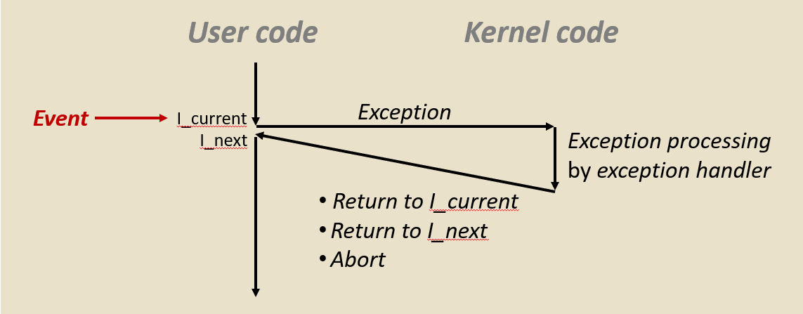


当在执行用户代码时, 因为系统中发生了一些情况, 然后一些情况发生在某些**事件**上, 这称为事件引起了系统状态的变化

为此, 异常将控制权从**用户代码**转移到**内核态中的代码**这称为**异常处理程序**。然后内核以某种方式响应这种变化这称为**异常处理**

在内核处理异常后可能会发生三种情况: 返回并重新执行当前指令、返回到下一条指令和**终止**

> 我们会发现返回并重新执行当前指令对于**页缺失**很有用, 我们用以实现虚拟内存

异常实际上是由硬件和软件**共同实现**的: 

硬件: 完成实际上控制权的转移, 也就是程序计数器(%rip)的更改
软件: 异常而执行的代码是由操作系统内核设置和确定的

---

### 异常表

每种类型的事件都有一个唯一的**异常编号**。用作跳转表的索引称为**异常表**

|异常编号|0|1|2|...|n-1|
|-|-|-|-|-|-|
|异常表|异常处理 0 的代码|异常处理 1 的代码|异常处理 2 的代码|...|异常处理 n-1 的代码|

每种类型的事件都有一个唯一的异常编号 k .当事件 k 发生时, 硬件使用 k 作为此表的索引(也称为中断向量), 然后得到**该异常的处理程序**的地址

---

### 异步异常 (中断)

**异步异常**是由于处理器外部发生的事件而引起的, 这被称为**中断**: 通过在处理器上设置**引脚**, 向外部引脚(中断管脚)发信号通知这些状态变化。

拿**磁盘控制器完成直接内存访问**为例: 先将数据从磁盘复制到内存中, 通过**设置的中断引脚**来通知处理器已完成复制, 在发生中断后, 处理程序返回到下一条指令

> 中断像: 你正在运行程序, 然后当中断处理程序运行时, 像个小暂停, 然后你的程序继续运行正常

中断通常在后台完成, 不会影响程序的执行

#### 定时器中断

所有系统都有一个内置计时器, 每隔几毫秒就会关闭一次, 当定时器关闭时, 中断引脚设置为高电平, 从而导致内核发生瞬态异常

有一个特殊的异常编号用于定时器中断, 需要这个编号以便允许内核再次获得对系统的控制: 否则用户程序可能会陷入无限循环中永远运行, 无法让操作系统获得控制权

#### 来自外部设备的 I/O 中断
来自外部设备的这种 I/O 中断比较常见的: 键盘输入 `Ctrl-C` 、来自网络中的包到达、来自磁盘的数据到达

---

### 同步异常

由执行指令的结果导致的事件被称为**同步异常**, 常见的有三类:

#### 陷阱

由程序故意引起的异常被称为陷阱。陷阱会将控制返回到"下一条"指令。

比较常见的陷阱有**系统调用**、 断点陷阱、特殊指令


##### 系统调用

操作系统内核为程序提供各种服务, 但程序没有直接访问权限, 程序无法在内核中调用函数, 无法直接在内核中访问数据, 因为该内存区域受到保护, 对用户程序不可用。

内核所做的是提供一个响应程序请求的接口, 调用内核中的函数并发出对各种服务的请求, 此接口称为**系统调用**

程序进行系统调用并从内核请求各种功能, 内核为该请求提供了对应的响应, 然后将控制权返回给调用程序的函数

> 你可以把系统调用想象成一种... 它看起来像一个函数调用, 但它却是将控制权转移到内核中


许多不同类型的系统调用都有自己唯一的编号。 例如在 x86-64 系统中, 每个系统调用都有唯一的由 Linux 分配的 ID 号


|编号|0|1|2|3|4|57|59|60|62|
|-|-|-|-|-|-|-|-|-|-|
|名称|read|write|open|close|stat|fork|execve|_exit|kill|
|说明|读取文件|写入文件|打开文件|关闭文件|获取文件信息|创建进程|执行程序|终止进程|送信号给进程|


#### 故障

不是由程序故意引起的异常被称为**故障**。但故障是**有可能**恢复的。

比较常见的故障有**页缺失**、 保护故障、浮点异常

在任何一种情况下, 当出现故障时, 要么重新执行当前指令, 要么**终止**

##### 页缺失

当运行一个程序时, 操作系统并不会一次性把整个程序都塞进内存里。它会把程序拆成一小块一小块的, 这些小块就叫 "页"。

当 CPU 尝试访问某个内存地址, 但发现该地址对应的"页"当前并不在物理内存中时, 硬件就会向操作系统发出的一个中断信号就是页缺失。

但**页缺失**是可以恢复的。尽管程序引用的一部分地址空间、数据不在内存或内核当中, 但可从磁盘复制到对应内存的地址上, 重新启动导致故障所需的指令, 就能恢复工作

##### 保护故障

程序尝试执行一些"违法"的操作时, 硬件就会触发保护故障。常见的违规行为包括: 
- 越权访问: 普通程序尝试执行只有操作系统内核才能运行的特权指令。
- 非法内存读写: 程序尝试修改一段只读的代码区, 或者访问了不属于自己的内存地址

著名的 段错误(Segmentation Fault) 就是因为非法内存读取发生的。

与页缺失不一样的是, 保护故障是不可以恢复的, 原因如下:

- 逻辑错误: 保护故障通常意味着代码逻辑出错了。不像页缺失只需要把数据从硬盘搬到内存, 保护故障没有一个"正确的数据"可以修复。

- 安全防范:  操作系统为了保护自己和其他程序, 必须立即关掉这个"不守规矩"的进程。如果允许恢复, 恶意软件就能绕过安全检查, 直接控制系统底层。

- 状态不明确:  一旦发生这种故障, 系统无法确认程序接下来的行为是否安全, 因此直接终止是最稳妥的做法。

##### 浮点异常

当 CPU 执行数学运算出现逻辑矛盾时触发。最典型的例子: 除以零, 结算结果上溢等。

**浮点异常也是可恢复的**。一方面软件可以接管修复, 另一方面也可以按默认值处理。

软件接管: 当发生除以零或溢出时, 操作系统会发送一个信号(如 Linux 中的 SIGFPE)。

如果程序员编写了专门的"信号处理程序", 程序可以捕获这个异常, 将计算结果手动修正(例如设为最大值或 $0$), 然后让程序继续跑。

默认值处理: 硬件和编译器通常遵循 IEEE 754 标准。系统并不一定会让程序立刻崩溃, 而是返回如 NaN 或 Inf 类的值, 程序可以检测到这些值并采取补救措施。

#### 终止
无意和不可恢复的异常称为**终止**: 即那些总是终止的异常

比较常见的终止有: 非法指令、奇偶检验错误、机器检查

> 如果你执行非法指令, 如果你的内存存在问题, 那么它就会被破坏。机器存在一些问题, 就总会是终止


---

#### 示例

##### 系统调用示例: 打开文件

当用户调用称为 open(filename, options) 的系统级函数来开一个文件: 使用文件名并指定为只读写

系统通过调用 __open 函数执行编号为2的 syscall, syscall 实际执行系统调用

通常不需要在程序中直接使用 syscall 指令, Linux 将这些函数包装在系统级函数中, 这些函数实际上会调用的

```s
00000000000e5d70 <__open>:
...
e5d79:   b8 02 00 00 00      mov  $0x2,%eax  # open is syscall #2
e5d7e:   0f 05               syscall         # Return value in %rax
e5d80:   48 3d 01 f0 ff ff   cmp  $0xfffffffffffff001,%rax ## 可以看到代码正在检查负的返回值 还有一系列的比较
...
e5dfa:   c3                  retq
```

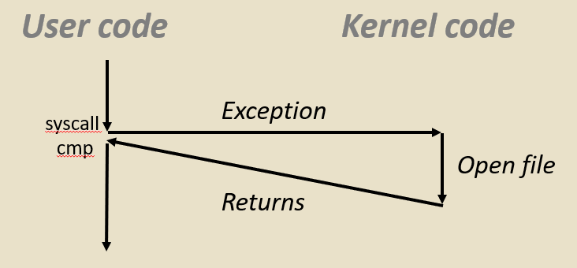

在 syscall 指令中: 第一个系统调用编号是 %rax 。其他参数在 %rdi, %rsi, %rdx, %r10, %r8, %r9 中


如果查看该代码: 会看到它移动 $0x2, 读入 %eax 的系统调用号。然后系统调用在 %rax 中返回其状态: 如果是负数则发生了一些错误, 如果是正数则没有发生错误

在这种情况下, 在 open 中返回一个**文件描述符**:  一个称为文件描述符的小整数, 然后可以在后续的读写调用中使用

##### 故障示例: 页面故障

假设有个程序写入一个有效的内存区域, 但实际上并没有存储在内存中, 而是需要从磁盘加载到内存中, 户内存的那部分(页面)当前在磁盘上

```c
int a[1000];
main () {
    a[500] = 13;
}
```
下面指令 movl 这里, 因为此地址的内存不可用, 会触发页缺失, 这样就创建了一个异常:

也就是将控制权转移到内核中的页缺失处理程序中, 决定哪个页从磁盘复制到内存, 然后它返回并对 movl 指令产生反应

> 这很酷, 现在可以使用内存了, 当它的响应快速完成时, 执行这个 movl 指令
```s
80483b7:	c7 05 10 9d 04 08 0d 	movl   $0xd,0x8049d10
```
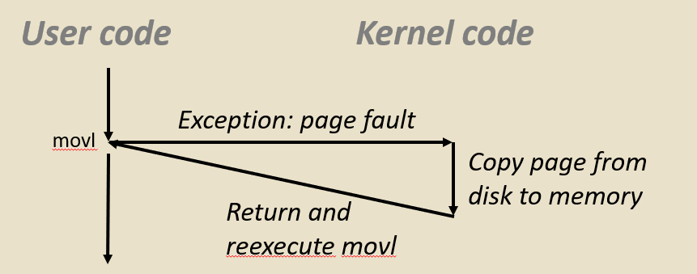

##### 故障示例: 无效的内存引用

假设正在访问一个数组元素中不存在而且是非法的位置
```c
int a[1000];
main () {
    a[5000] = 13;
}
```
在这种情况下是 movl 指令**看起来**像一个页缺失: **但内核检测到它是一个无效的地址, 没有任何东西可以从磁盘加载**

因为 `0x804e360` 是虚拟地址空间的无效区域: 它向用户进程发送信号(SIGSEGV), 户进程出现 segmentation fault 并打印相关错误信息, 最后退出永远不会返回


```s
80483b7:	c7 05 60 e3 04 08 0d 	movl   $0xd,0x804e360
```

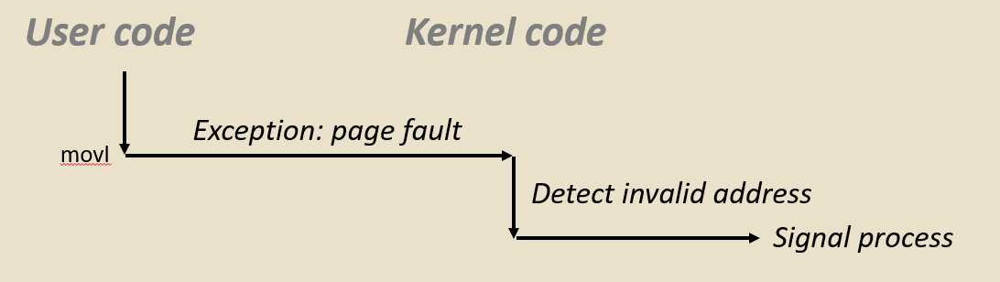

---

## 进程

> 我们已经看到异常, 非常低层的控制转移, 这是由硬件和操作系统软件实现的
> 
> 在更高层次上是另一种形式的异常控制流, 我们将会在**进程的上下文切换中**看到

程序可以存在于许多不同的地方: 可以作为 .C 文件中以文本形式保存的程序, 可以作为二进制文件的 .text 节存在, 可以作为已加载到内存中的字节存在

进程与程序不同, 是**正在运行的程序的实例**, 是处于正在执行中的。进程的思想是**计算机科学中最基本、最重要的思想之一**。

进程给每个程序提供两个关键的抽象: 逻辑控制流、私有地址空间

### 逻辑控制流

通过上下文切换的内核机制让每个程序都感觉在独占 CPU 和寄存器,: 当一个进程在运行时, 永远不必担心其他程序修改寄存器

> 而你甚至无法告知系统上还有其他进程在运行。它看起来很正常, 除了偶尔的延迟, 比如需要更长时间运行的指令


### 私有地址空间
通过**虚拟内存**的内核机制让每个程序都感觉在独占主内存, 感觉拥有独自的地址空间, 每个运行的程序都有自己的代码、数据、堆栈

> 而且你永远不会察觉到其他进程正在使用的内存, 进程给你这种错觉: 你可以拥有所有内存和处理器的独占访问权限


现在系统同时运行了许多这些进程
即使在具有单核的系统上, 这些进程中的许多个实际上是在同一时间并发运行

---

### 多进程

下图中的内容表示现在系统同时运行了许多进程。即使在具有单核的系统上, 这些进程中的许多个实际上是在同一时间并发运行:

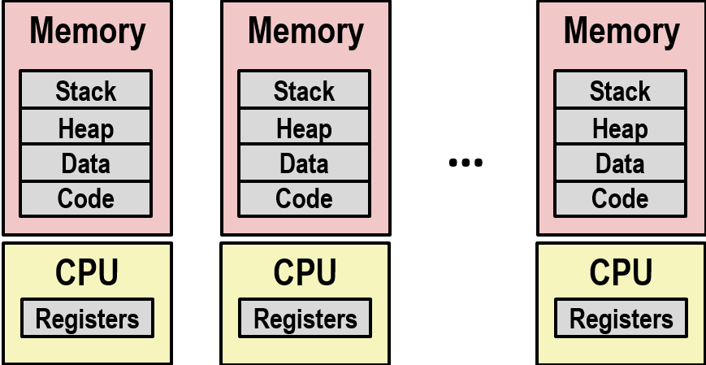

这就像计算机能同时运行一个或多个用户的应用程序: Web 浏览器、email 客户端、编辑器等。能运行的后台任务, 如监控网络和 I/O 设备等

> 你可以看这个, 我的 Mac 运行 top 程序: 你可以看到它运行了 123 个进程, 其中 5 个是处于实际运行状态
> 
> 并且这些进程中的每一个都有自己唯一的进程 ID, 这是整数类型

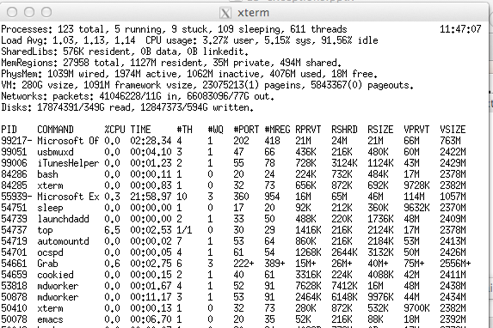


#### 示例(传统)

看似进程对系统有独占的访问权限, 但实际上由操作系统管理共享。例如单处理器就是交错执行多个进程: 

进程执行交错多任务, 由虚拟内存系统管理的地址空间(将未运行进程的寄存器值存储在内存中)


假设共享使用的系统只有一个核心, 有一个正在运行的进程, 有自己的地址空间, 自己的寄存器。然后在某时由于定时器中断而发生异常, 或某种故障, 或陷阱

这时, 操作系统就可以控制系统, 决定它是否想要运行另一个进程

##### 图一
操作系统将当前寄存器值复制到存储器中并保存它们。或者说将当前寄存器保存在内存中。

##### 图二
然后操作系统会安排下一个待执行的进程

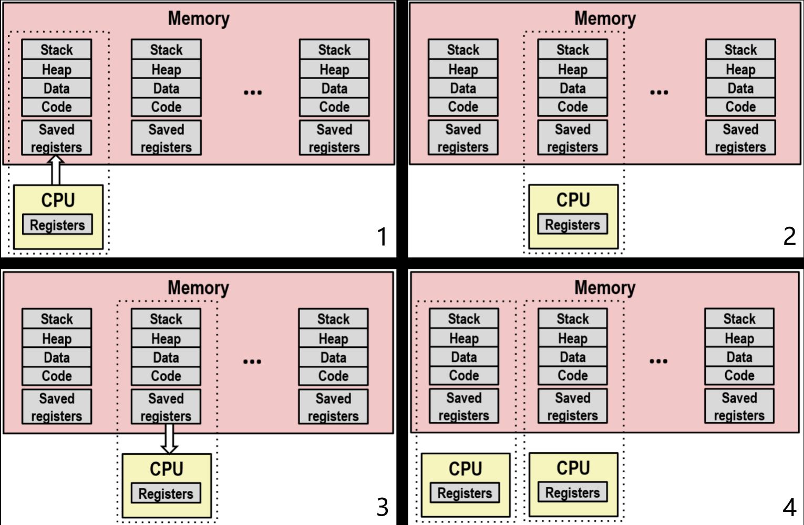

##### 图三
加载保存的寄存器和切换地址空间(上下文切换)

紧接着操作系统**加载**上次运行该进程时**保存的寄存器的值**到 cpu 寄存器中, 然后它将**地址空间切换**到此进程的地址空间

这个地址空间和寄存器值是**上下文**, 上下文切换是地址空间和寄存器的变化

##### 图四

在具有多个核心(单个芯片上有多个 CPU)的现代系统上, 共享主内存以及一些缓存, 每个 CPU 都可以执行单独进程, 由内核完成从处理器到核心的调度

操作系统将在这些多核上安排进程, 如果没有足够的核心来处理这些进程, 那么它将进行上下文切换, 就像之前展示的一样

---

### 并发进程
每一个进程代表一个**逻辑控制流**, 每个程序都幻觉自己拥有一条完整的、不间断的执行曲线。

但如果把 CPU 运行过程中经历的所有 PC 指针位置按时间顺序画出来, 会发现那其实是一条纵横交错、不断在不同程序间切换的单一**物理控制流**

尽管一个进程执行指令时, 突然间从另一个进程执行, 这种上下文切换在物理层面很突兀。但对进程内部而言, 它只关心自己的指令序列, 它并不感知自己被暂停过

在单个进程中, 有一个逻辑控制流, 它是该过程的所有指令

当它们的时序在时间上重叠时, 则两个进程**同时运行(并发)**, 否则它们是连续的

例如 (在单芯片上运行):
并发: A 和 B, A 和 C
连续: B 和 C

先从逻辑视图上看: 进程 A 运行一会, 然后暂停。进程 B 开始运行, **这期间进程 A 并没有结束, 只是暂停了**

进程 B 运行到生命周期结束, 开始运行进程 C , 紧接着暂停开始运行进程 A 直到它的生命周期结束再开始重新运行 C。这期间进程 C 并没有结束。

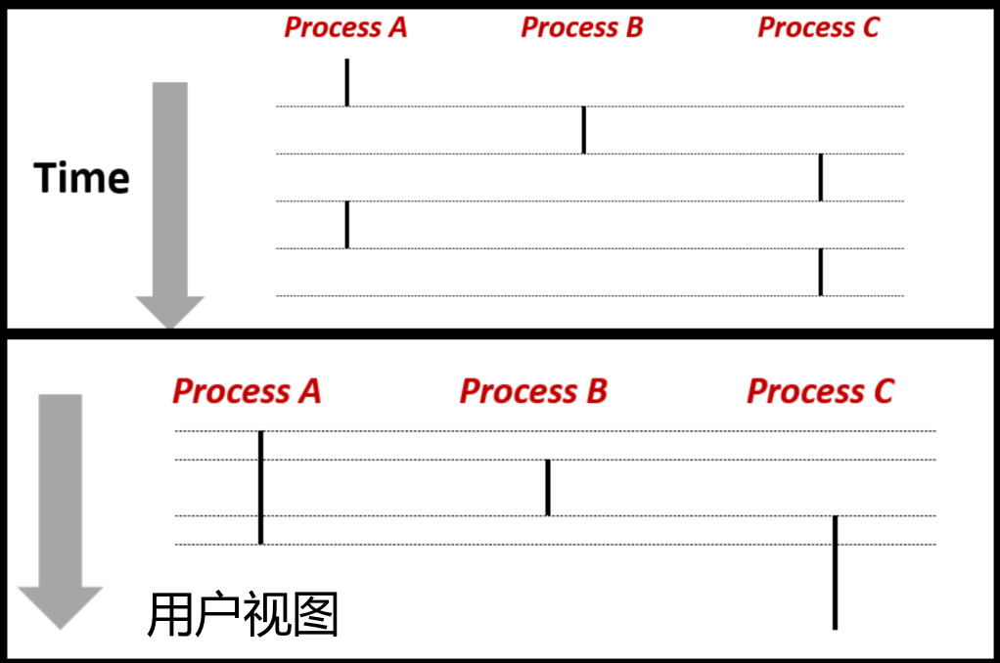

在 B 逻辑流开始到结束的整个过程, 进程 A 并没有结束, 只是暂停了, 所以二者的生命周期有重叠, **在用户视图这相当于同时运行(并发)**。


并且类似地 C 和 A 重叠。所以 AB, AC 是并发的, BC是连续的。

并发进程的控制流在时间上**是物理上不相交的**, 然而可以将并发进程视为彼此并行运行

> 无论核心数量为多少, 这种并发性定义都会成立, 即使你有一个核心: 我向你展示的这个例子就是一个核心
> 
> 但即使你有多个核心, 只要逻辑流在时间上重叠, 那么他们是并发的


并发是一个逻辑上的概念: 指多个任务的执行时间在时间轴上是重叠的。即使在任意瞬间 CPU 只在运行其中一个任务, 只要都处于"已开始但未结束"的状态, 就是并发的。

并行是一个物理上的概念: 指多个任务在**同一时刻同时**在运行。这通常需要多个硬件资源(比如多核 CPU)的支持。

---

### 上下文切换

**内核**是一种**驻留在内存中**的**共享操作系统代码块管理**, 进程由内核管理, 控制流通过**上下文切换**从一个进程传递到另一个进程

内核不是一个正在运行的独立进程, 而是作为某些现有进程的一部分运行。它始终在某些现有进程的上下文中运行, 是位于地址空间顶部的代码。

当正在运行的进程发生异常, 便会将控制权返回到内核, 内核调用其调度程序。调度程序决定是否让该进程继续运行, 还是做上下文切换并运行另一个新的进程

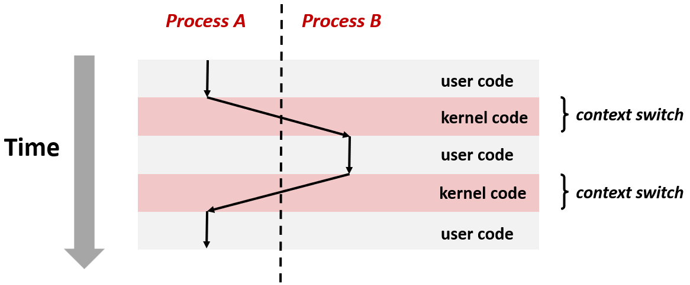

在上面的示例中, 进程 A 发生异常, 将控制权返回到内核, 内核调用其调度程序, 调度程序决定运行进程 B, 一旦重新指定地址空间, 调度程序就会执行代码然后进行排序

调度程序在进程 B 的上下文中运行, 完成加载进程 B 通用寄存器, 将控制权转移到 B, B 就从此中断处继续运行

在某些时候会 B 发生另一个异常, 并且在内核中决定将控制权转移回进程 A, 进程 A 在此处从中断处继续

---

## 进程控制

现在 Linux 提供了许多函数可以从用户程序调用来操作进程。这个操作进程的过程称为进程控制

### 系统调用错误处理

大多数这些函数进行系统调用属于称之为系统级函数的更高级别

现在，Linux 系统函数出现错误时, 通常返回 -1 且设置全局变量 errno 表示错误原因。

有一条通常是管理, 但必须严格执行的硬性规则: 当调用系统级函数时, 必须检查应该使用的那些函数的返回值, 如果忽略检查返回值, 可能就会遇到巨大的麻烦

尽管**不应该在进行系统级函数调用时, 不检查返回值**, 但唯一的例外是有些函数, 如 exit 或 free 返回 void

```c
if ((pid = fork()) < 0) {
    fprintf(stderr, "fork error: %s\n", strerror(errno));
    exit(0);
}
```

典型的如调用 fork 用来创建子进程的进程, 返回了创建的子进程的进程ID, 则总是正数。如果有错误则返回 -1

在下面的代码中检查返回值是否小于 0, 然后以某种方式处理该错误: 打印一条消息并退出

> 虽然这是必要的, 它必须这样做。但从我的角度来看, 我们正试图向你展示代码, 它变得非常混乱, 占用了大量空间


#### 错误报告函数


> 那么我们要做些什么来简化这一点: 在我们向你呈现的代码中以及我们在本书中向你展示的代码中

定义错误报告功能, 或者说写一个错误报告函数可以在一定程度上简化: 

<div style="display: flex; gap: 20px; align-items: flex-start;">

```c
/* Unix-style error */
void unix_error(char *msg) {
    fprintf(stderr, "%s: %s\n", msg, strerror(errno));
    exit(0);
}
```

```c
if ((pid = fork()) < 0) {
    unix_error("fork error");
}
```
</div>

像 unix 样式的错误, 其中函数返回 -1 然后设置错误号。得到错误后会打印一条消息, 在退出之前报告该错误。

然后就可以在代码中用一行替换 if 语句的主体, 这样可以使代码更紧凑

#### 错误处理包装

下面由一位名叫"W.Richards Stevens"的伟大技术家开创的包装器: 在函数中处理错误形成一个包装器, 它具有与原始函数相同的接口, 只不过它的第一个字母大写

这个包装器做的是, 它调用原始函数并检查错误: 

- 没错误: 这个包装器的行为与被包装函数相同, 原始函数将返回
- 有错误: 将以某种方式处理, 比如打印一条消息

<div style="display: flex; gap: 20px; align-items: flex-start;">

```c
pid_t Fork(void){
    pid_t pid;

    if ((pid = fork()) < 0)
        unix_error("Fork error");
    return pid;
}
```

```c
pid = Fork();
```
</div>

> 这使我们能够在不违反此规范的情况下使代码真正紧凑，我们必须检查错误的硬性规则

---

### 获取进程 ID

最简单的进程控制函数是函数 `getpid`, 允许获取当前进程的pid。或者是处理器概念中的 `getppid`, 创建当前进程的父进程

> 这些不带参数, 它们返回一个整数, 这是一个进程ID

```c
pid_t getpid(void); // 返回当前进程 PID

pid_t getppid(void); //返回当前进程的父进程的 PID
```

---

### 创建和终止进程

从程序员的角度看，可将进程看作是处于三种状态: 

- 运行: 进程要么正运行，要么等待被执行或最终将会被内核调度执行(即选择执行)
- 停止: 进程执行被挂起后就会暂停, 并且在进一步收到信号前不会被调度执行
- 终止: 进程被永久停止, 永远不会再被安排完成

---

### 终止进程

终止一个进程可能有三个原因: 接受默认操作为终止的信号、从主例程返回、调用 `exit` 函数

从主例程返回一个整数值: 函数 main 的定义类型是 int, C 语言主程序总是返回一个 int 值, 可以从 main 函数返回将终止进程

```c
// 参数  status 表示退出的状态: 正常状态为返回 0, 错误返回非零
void exit(int status);
```

函数 exit 有点不一样: 被调用的函数结束时, 通常会回到先前调用的位置, 但函数 exit 不会返回先前位置。只调用 1 次, 但永远不会返回, 直接结束。

---

### 创建进程

函数 `int fork(void)` 没有参数, 返回值是一个整数, 并且创建一个新的子进程。

父进程可以通过调用 fork 创建新的正在运行的子进程。函数 fork 在父进程和子进程都各自分别返回一次: 子进程返回 0, 父进程返回子进程 PID

子进程获得父进程虚拟地址空间的相同副本, 但是却不是同一份。

但在 fork 返回地址之后, 地址空间是相同的: 这意味着所有变量, 全局变量, 栈, 代码一切都是相同的, 子进程与父进程具有完全相同的值

子进程获得父进程打开文件描述符的相同副本, 子进程可以访问任何已打开的文件, 包括父进程拥有的标准输入和标准输出

唯一的区别是子进程获得的进程ID与父进程不同

#### 函数 fork 示例

下面示例程序在堆栈上有一个名为 x 的局部变量, 初始化为 1, 调用函数 fork 创建子进程并向父进程和子进程返回一个值

区分是在父项还是在子项中执行的**唯一方法是检查返回值**: 如果进程的pid == 0, 就是在子进程上执行

**子进程得到的是和父进程完全相同的内存和代码, 是重复但独立的地址空间**: 当 fork 在父进程和子进程中返回时x = 1, 对 x 的后续更改是独立的

子进程会打印 1 + 1 = 2 并退出。在父进程中检查此进程是不为零, 在父进程中, 父进程打印出的是 1-1 = 0

<div style="display: flex; gap: 20px; align-items: flex-start;">

```c
int main() {
    pid_t pid;
    int x = 1;

    pid = Fork(); 
    if (pid == 0) {  /* Child */
        printf("child : x= %d \n", ++x); 
        exit(0);
    }

    /* Parent */
    printf("parent: x= %d \n", --x); 
    exit(0);
}
```

```bash
linux> ./fork
parent: x=0
child : x=2
```
</div>

无法保证子进程还是父进程先执行: 当 fork 返回时, 内核可能会决定先安排子进程, 或可能决定首先运行父进程

子和父进程共享相同的打开文件: 父进程和子进程都打印到标准输出, stdout 在父进程和子进程中相同

#### 进程图

> 这确实会有点难以理解, 可以使用一个叫做**进程图**的模型来排序, 理解会发生什么


进程图是一个很有用的工具，可捕获并发程序中语句的偏序:
- 每个节点表示一条执行的语句
- a -> b 表示 a 在 b 前面执行
- 边可以用当前变量的值来标记
- 对应于printf 语句的节点可以标记上printf的输出
- 每个图由一个入度为 0 的点起始 

图的任意拓扑排序都对应于一个可行的全序。节点的总排序即为所有边从左到右的指向

函数 forks 可能有点复杂: 还有随着时间多次调用它们, 特别是如果它们是嵌套的

> 我们使用一种称为进程图的工具, 来捕捉我们调用 forks 时可能发生的情况
> 
> 对, 我们不能对不同进程的运行顺序做出任何假设, **但我们可以使用称为进程图的工具来了解事件的次序**

#### 进程图示例

父进程最初 x == 1, 然后父进程调用 fork, 函数 fork 在父进程和子进程中返回, 父进程和子进程在递增或递减后均打印 x 的值, 然后都退出

发生的这些可以以任何方式交替进行


```c
int main() {
    pid_t pid;
    int x = 1;

    pid = Fork(); 
    if (pid == 0) {  /* Child */
        printf("child : x=%d\n", ++x); 
        exit(0);
    }

    /* Parent */
    printf("parent: x=%d\n", --x); 
    exit(0);
}
```

只用字母可以实现这些边缘, 能够让图表保持简单

总排序 (Total Ordering): 指 CPU 实际执行的所有指令序列(如 a -> b -> e -> c -> f -> d)。

拓扑排序 (Topological Sort): 一种符合所有"先后依赖关系"的排序。只要总排序满足拓扑排序的要求，它就是可行的(Possible)。

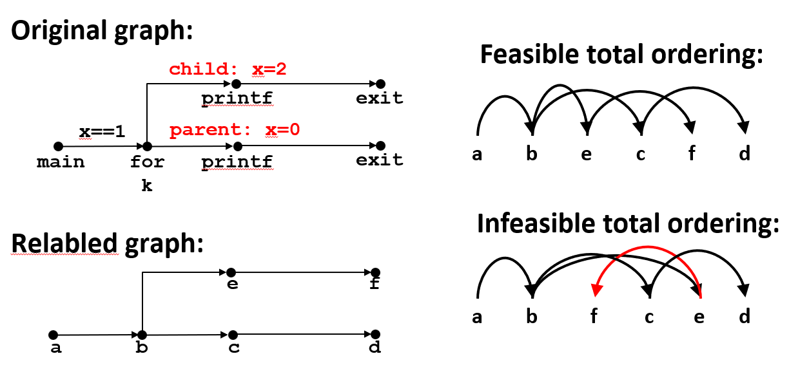


比如这个案例序列**是可行的**:  a -> b -> e (子进程) $\to$ c (父进程) $\to$ f (子进程) $\to$ d (父进程)

虽然发生了上下文切换，但它并没有违反任何"必须先 A 后 B"的逻辑边。

#### 两个连续的 fork 示例

> 如果现在我们有两个连续的 forks 会发生什么, 那么让我们绘制流程图将有助于我们理解这一点

在父进程中打印 L0 然后 fork 创造一个子进程, fork在父进程和子进程中返回到此 `printf("L1\n")`, 父进程和子进程都打印 L1

然后父和子再都执行 fork, 这样就各自又创造了一个子进程, 相当于创造了两个子进程, 然后又返回到输出 Bye 的 printf

调用 fork 两次这样的结果是它创建了四个进程

```c
void fork2() {
    printf("L0\n");
    fork();
    printf("L1\n");
    fork();
    printf("Bye\n");
}
```

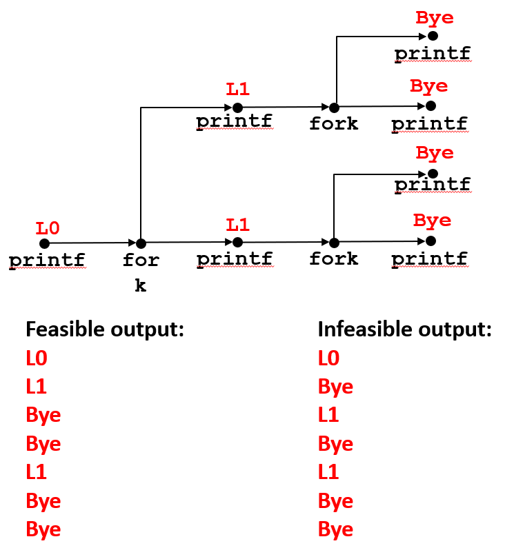


#### 父进程中嵌套 fork

> 如果我们在父进程中嵌套 forks 会发生什么, 我不知道你为什么要这样做, 除非想要折磨 213班上的学生

> 但我们可以通过绘制流程图来解决这个问题。我没有在这里显示终止, 但是可以认为**调用此函数的**函数调用了 exit 

父进程打印 L0, 然后做一个 fork 创建一个子进程。如果 fork() 为 0 则正在执行子进程, 子进程只是打印, 然后终止

如果 fork 不等于 0 则在父进程中执行。父进程打印 L1, 然后再做另一个 fork 创造一个子进程

如果 fork() 不等于 0 则在父进程, 父进程打印 L2, 然后退出条件判断, 并打印 Bye

如果 fork 返回 0 则表示正在执行子进程, 跳出条件, 然后子进程打印 Bye

下面这个案例是不可行的输出: L0 跟着 Bye, 然后是 L1, 然后在一个 Bye, 到这这里是可行的, 但从这以后不能先 Bye 再 L2


```c
void fork4() {
    printf("L0\n");
    if (fork() != 0) {
        printf("L1\n");
        if (fork() != 0) {
            printf("L2\n");
        }
    }
    printf("Bye\n");
}
```

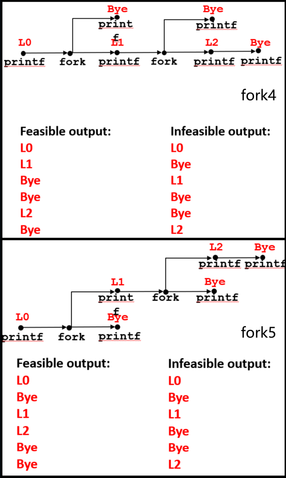

> 我会让你们把这个fork5作为练习

```c
void fork5() {
    printf("L0\n"); // 不同在这里
    if (fork() == 0) {
        printf("L1\n");
        if (fork() == 0) { // 不同在这里
            printf("L2\n");
        }
    }
    printf("Bye\n");
}
```

---

### 僵尸进程

当进程终止时, 实际上系统会一直保持这个进程, 不会完全从系统中删除它, 并保持与子进程相关的一点状态信息, 例如操作系统(OS)表, 直到它被父进程**回收**(reaped)

这么做的原因是: 如果父进程创建一个子进程, 它可能希望等待该子进程完成, 并检查其退出状态

子进程已经终止, 但并没有消失, 因此被称为**僵尸进程**, 半生半死

任何进程结束后, 都是**僵尸进程**, 因为理论上都是 PID = 1 的子进程

---

### 回收子进程

当父进程对**已终止**的子进程使用函数 wait 或函数 waitpid, 也就是回收。

函数 wait, waitpid 向父进程提供退出状态信息, 内核然后删除僵尸子进程

如果父进程终止而没有回收子进程, 子进程仍再运行, 那么 init 进程 (pid == 1) 将会回收孤立的子进程(孤儿进程)

> 因此只需要在长时间运行的进程中显式回收, 如: shell 和 服务器。因为在这种情况下, 服务器可能会创建数百万个子进程
> 
> 每个子进程终止时都会执行这些进程, 成为僵尸, 他们仍带有状态信息, 这占用了内核的空间, 你会想到这其实是一种内存泄漏的形式
> 
> 如果你没有回收这些僵尸子进程, 最终可能会填满内存空间并导致内核崩溃


---

### 僵尸进程示例

对于长期运行程序的情况, **必须使用 wait 或 waitpid 来回收子进程们**

> 让我们看一个例子, 首先让我们看看这个僵尸现象的一个例子

有一个叫做 forks 的函数, 然后在子进程中打印一个关于这个子进程的信息, 然后退出子进程

在父进程内打印一条消息, 然后进入一个无限循环: 这是一个**永远不会回收**它创建的子进程的父进程

<div style="display: flex; gap: 20px; align-items: flex-start;">

```c
void fork7() {
    if (fork() == 0) {
        /* Child */
        printf("Terminating Child, PID = %d\n", getpid());
        exit(0);
    } else {
        printf("Running Parent, PID = %d\n", getpid());
        while (1)
            ; /* Infinite loop */
    }
}
```

```bash
linux> ./forks 7 &
[1] 6639
Running Parent, PID = 6639
Terminating Child, PID = 6640
linux> ps
  PID TTY          TIME CMD
 6585 ttyp9    00:00:00 tcsh
 6639 ttyp9    00:00:03 forks
 6640 ttyp9    00:00:00 forks <defunct> # ps 子进程显示为"已失效"(僵尸)
 6641 ttyp9    00:00:00 ps
linux> kill 6639
[1]    Terminated
linux> ps # 杀死父进程允许 init 回收子进程
  PID TTY          TIME CMD
 6585 ttyp9    00:00:00 tcsh
 6642 ttyp9    00:00:00 ps
```
</div>

如果运行这个调用 forks 的程序, 可以看到打印这两条消息: 父进程打印一条消息, 然后子进程打印一条消息

> 我们用这个 ＆ 符号在后台运行它, 因为这样......它还会继续运行, 我们无法检查它

在后台运行这个程序之后, 再使用 ps 来打印当前进程: 可以在父进程中看到进程ID为 6639, 子进程是 6640。 **defunct** 表明是一个僵尸进程

如果杀死父进程 6639， 启动另一个 ps 会看到那个僵尸进程消失了: **因为它是由 init 进程回收的**

---

### 孤儿进程示例

下面的代码中调用创造一个子进程: 在子进程中打印一条消息, 然后子进程进入无限循环。父进程打印一条消息然后退出

<div style="display: flex; gap: 20px; align-items: flex-start;">

```c
void fork8() {
    if (fork() == 0) {
        /* Child */
        printf("Running Child, PID = %d\n",
               getpid());
        while (1)
            ; /* Infinite loop */
    } else {
        printf("Terminating Parent, PID = %d\n",
               getpid());
        exit(0);
    }
}
```

```bash
linux> ./forks 8
Terminating Parent, PID = 6675
Running Child, PID = 6676
linux> ps
  PID TTY          TIME CMD
 6585 ttyp9    00:00:00 tcsh
 6676 ttyp9    00:00:06 forks # 即使父进程已终止，子进程仍处于活动状态
 6677 ttyp9    00:00:00 ps
linux> kill 6676 # 必须显式的终止子进程，否则将无限期地继续运行
linux> ps
  PID TTY          TIME CMD
 6585 ttyp9    00:00:00 tcsh
 6678 ttyp9    00:00:00 ps
```
</div>

如果运行这个程序, 可以看到来自父进程和子进程的两条消息

如果看一下这些进程, 可以看到子进程还在运行: 即使父进程已经终止, 子进程仍然在运行

如果杀死这个子进程 6676, 它便终止了。它没有父进程, 初始进程回收了它, 可以看到它已经消失了, 不在系统中了。

---

### 等待: 与子进程同步

父进程通过与子进程同步, 并回收子进程: 最简单的一个函数 `int wait(int *child_status)`

函数 wait 的参数需要一个**可选**的状态, 可以获得检查子进程的退出状态。返回值是终止的子进程的 pid

函数 wait 会暂停执行(挂起)当前进程, 直到一个或其中一个子进程终止: 因为没有指定等待哪一个, 所以只是直到创建的任意一个子进程终止

如果 child_status != NULL，则它所指向的整数将被设置为一个值，该值指示子进程终止的原因和退出状态, 更多详见课本: 

|使用 wait.h 中的宏定义检查|WIFEXITED|WEXITSTATUS|WIFSIGNALED|WTERMSIG|WIFSTOPPED|WSTOPSIG|WIFCONTINUED|
|-|-|-|-|-|-|-|-|


#### 简单示例

下面调用 fork 并创建一个先打印消息, 然后退出的子进程。父进程打印一条消息, 然后等待子进程终止, 当子进程终止时, 它会打印一条消息

```c
void fork9() {
    int child_status;

    if (fork() == 0) {
        printf("HC: hello from child\n");
        exit(0);
    } else {
        printf("HP: hello from parent\n");
        wait(&child_status);
        printf("CT: child has terminated\n");
    }
    printf("Bye\n");
}
```


如果查看流程图会看到让 fork 创建子进程, 父进程和子进程都会打印, 接着父进程等待它并暂停, 直到子进程通过调用 exit 终止

子进程在打印 Bye 之前打印 CT , 然后终止, 这是不可行的: 因为子进程还没有这样终止, 这两个消息永远不会被打印出来, 直到子进程通过调用 exit 退出终止


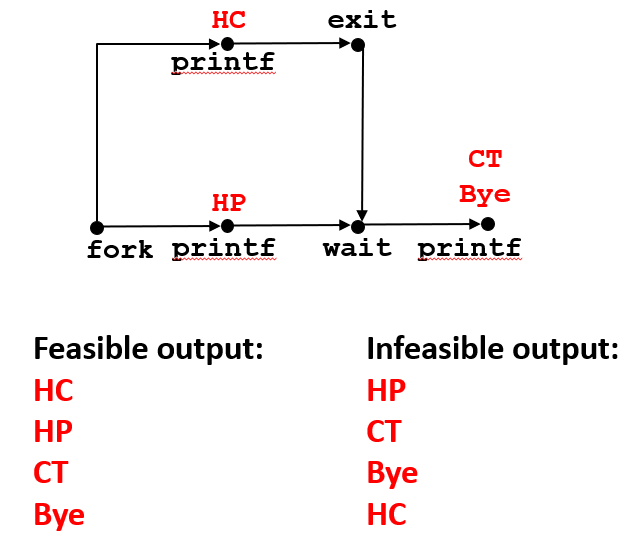

案例 HP, HC, CT, By 是可行的: 因为父进程打印 HP, 有一个上下文切换, 子进程打印 HC 然后退出, 现在父进程将等待返回, 最后打印 CT bye


#### 复杂示例
更复杂一点的例子是: 创造一堆子进程, 并等待他们全部终止。**如果多个子进程完成，将按任意顺序执行。**

在 0 到 n 的循环体 fork 一个子进程, 并带有一个返回状态退出: 这将表示这是哪个子进程退出了

父进程在类似的循环 0 到 n 内添加等待子进程终止, 它将等待 n 个子进程终止并返回进程 ID

可以使用宏 WIFEXITED 和 WEXITSTATUS 来获取有关退出状态的信息

```c
void fork10() {
    pid_t pid[N];
    int i, child_status;

    for (i = 0; i < N; i++) {
        if ((pid[i] = fork()) == 0) {
            exit(100+i); /* Child */
        }
    }

    for (i = 0; i < N; i++) { /* Parent */
        pid_t wpid = wait(&child_status);
        if (WIFEXITED(child_status))
            printf("Child %d terminated with exit status %d\n",
                   wpid, WEXITSTATUS(child_status));
        else
            printf("Child %d terminate abnormally\n", wpid);
    }
}
```

实际上可以使用类似于 wait 的 `pid_t waitpid(pid_t pid, int &status, int options)`: 它允许等待特定进程。暂停当前进程，直到特定进程终止

> 我会告诉你, waitpid 真的复杂, 它在你的教科书中有详细描述, 你需要查看有关其工作原理的详细信息


```c
void fork11() {
    pid_t pid[N];
    int i;
    int child_status;

    for (i = 0; i < N; i++)
        if ((pid[i] = fork()) == 0)
            exit(100+i); /* Child */
    for (i = N-1; i >= 0; i--) {
        pid_t wpid = waitpid(pid[i], &child_status, 0);
        if (WIFEXITED(child_status))
            printf("Child %d terminated with exit status %d\n",
                   wpid, WEXITSTATUS(child_status));
        else
            printf("Child %d terminate abnormally\n", wpid);
    }
}
```

---

### 加载和运行程序

> 现在另一个重要的是, 我们已经学会了如何创建新进程, 但我们还没有学会如何调用 fork
> 
> 我们只是创建一个子进程的精确副本, 只是父进程的精确副本: 运行相同的代码, 相同的程序, 相同的变量

要在进程内运行不同的程序, 需要使用函数 `int execve(char *filename, char *argv[], char *envp[])`: 允许在当前进程中, 会加载并运行可执行文件

filename (可执行文件名): 
- 可以是二进制目标文件(编译后的程序)。
- 也可以是脚本文件(以 #! 开头的文本文件)。

argv (参数列表): 
- 这是一个字符串数组，指向传递给新程序的命令行参数。
- 惯例: argv[0] 通常等于 filename(即正在执行的程序名)。如果你想在代码里打印程序名，直接访问 argv[0] 即可。

envp (环境变量列表): 
- 这也是一个字符串数组，格式为"名=值"对(例如 USER=droh)。
- 常用操作工具: getenv(获取)、putenv(设置)、printenv(打印全部)。


一旦在进程调用 exceve, 它打破了当前的程序: 函数 exceve 所有代码, 数据和栈会完全覆盖虚拟地址空间, 保留PID、打开的文件和信号上下文。


函数 execve 只调用一次并且永远不会返回, 除非出现错误: 如果此文件不存在, 那么 execve 将返回 -1。在正常操作中它永远不会返回

#### 新程序启动时的栈结构

当新程序开始之后, 在 argv 完成它的工作之后, 它创建一个新的堆栈, 它在新代码中加载数据, 创建一个新的空堆, 一切都是新的

这里展示的是, 启动代码调用 main 之前的情况: 函数 main 的未来栈帧将位于此顶部

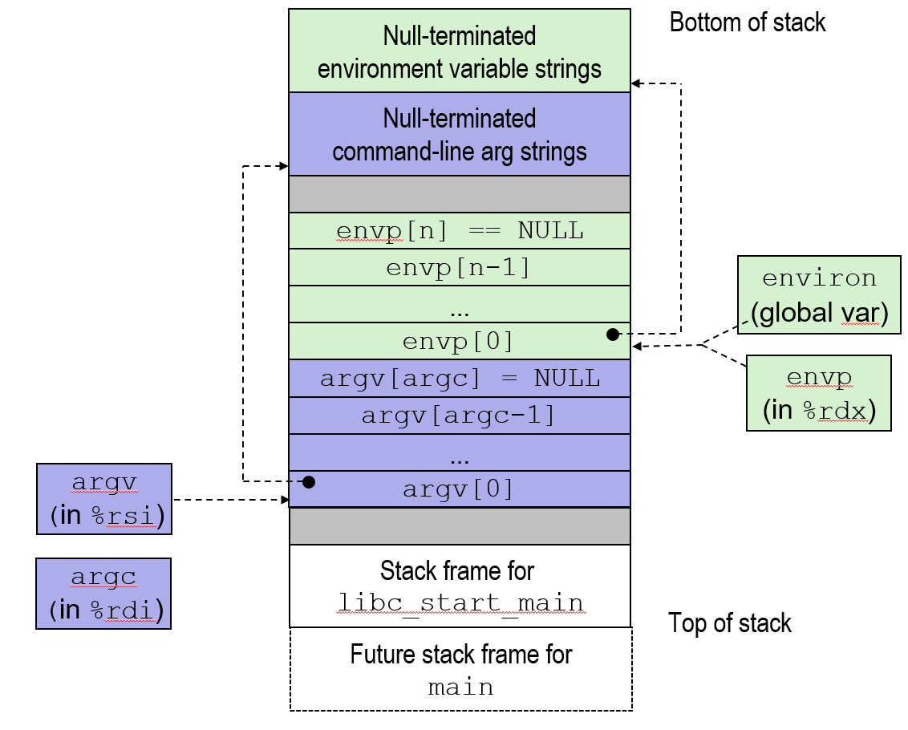


在堆栈的顶部有一个栈帧, 执行的第一个函数 `libc_start_main`。在堆栈顶部之后有一些填充, 然后 argv 中的参数列表包含在栈中

当 execve 加载并启动一个新程序时，操作系统会按照 x86-64 的调用约定(Calling Convention)，将关键信息通过寄存器和栈传递给新程序的 main 函数: 

第一个参数 argc (参数计数): 它表示命令行参数的总数量，按照约定存放在 %rdi 寄存器中。

第二个参数 argv (参数矢量表): 这是一个指向参数字符串指针数组的指针，存放在 %rsi 寄存器中。

它指向的地址位于栈内存中，通过该地址可以找到所有的命令行参数字符串。

第三个参数 envp (环境矢量表): 这是一个始终存在的"隐藏"参数，存放在 %rdx 寄存器中。

它指向栈中的环境列表，该列表包含一系列指针，每个指针都指向一个形如"名=值"的关键值对(环境变量字符串)。


栈与指针: 虽然寄存器里存的是指针，但这些指针指向的具体内容(即那些实际的字符串数组)都整齐地排列在新进程的栈顶部。

全局变量: 除了作为 main 的第三个参数传入，系统还维护了一个全局变量 environ 指向这个环境列表。


#### execve 样例

使用当前环境变量在子进程中执行 `/bin/ls –lt /usr/include` :

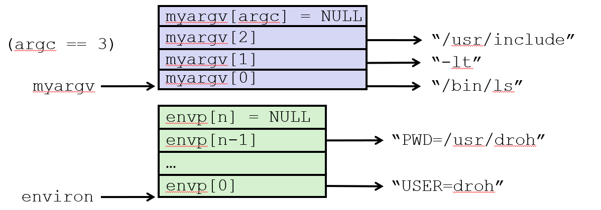

```c
if ((pid = Fork()) == 0) { /* Child runs program */
    if (execve(myargv[0], myargv, environ) < 0) { 
        printf("%s: Command not found.\n", myargv[0]);
        exit(1);
    }
}
```

假设执行 `ls -lt /usr/include` 显示list的长格式并按时间顺序对其进行排序, 从最近最多使用到最近最少使用

不能直接调用 execve, 因为 execve 会覆盖当前进程。如果在主程序里直接调它，你的程序还没执行完就"消失"了。


执行此操作的标准方法: 使用 fork 创建子进程, 然后在子进程内调用函数 exceve 执行 `ls` 二进制文件(通常位于 /bin/ls)。此时，子进程的内存被 ls 的代码替换并开始运行

参数构造: 我们需要构建一个 myargv 数组，按照惯例，myargv[0] 必须是程序的名称(如 /bin/ls)。

环境继承: 子进程通常会使用父进程的当前环境变量(如 USER=droh 或当前工作目录 PWD)。

错误处理: 如果 execve 找不到程序(返回小于 0)，子进程必须负责检查该条件并主动调用 exit 退出；否则，一旦成功，它就永远不会返回。

#### 意义

> 现在这似乎是你第一次看到这个 fork 和 execve 的组合, 看起来有点奇怪不是吗
>
> 为什么不只有一个命令来创建一个新进程并运行, 并在该进程中运行程序
> 
> 为什么要分开这两个单独的 fork 和 execve

Windows 等系统倾向于使用一个命令同时完成"创建并执行"，但 Unix 将其拆分为两步，这具有巨大的灵活性: 

##### 实现并发服务器: 
有时只需要原封不动地复制当前进程: 比如一个 Web 服务器，通过 fork 出一堆运行相同代码的子进程，可以同时处理多个用户的请求。

##### "中间地带"的控制权: 
这是最关键的一点。在 fork 之后、execve 之前，子进程有一段"自由时间"。

在这段时间可以: 重定向 I/O: 修改文件描述符。信号处理: 设置阻塞或开启特定的信号。权限设置: 改变子进程的用户 ID 等。


如果合二为一，你就失去了这种在"程序启动前"进行微调的机会。