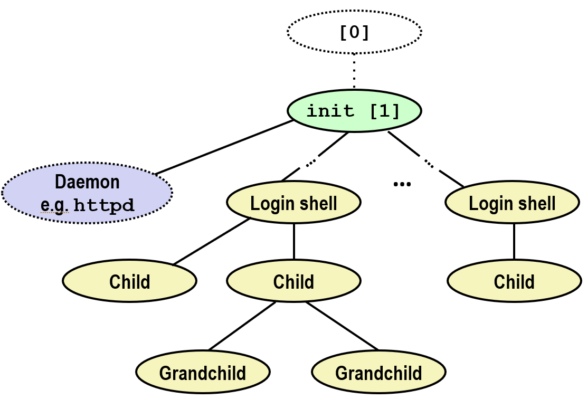
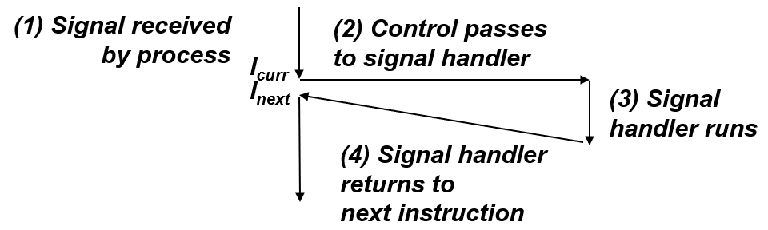
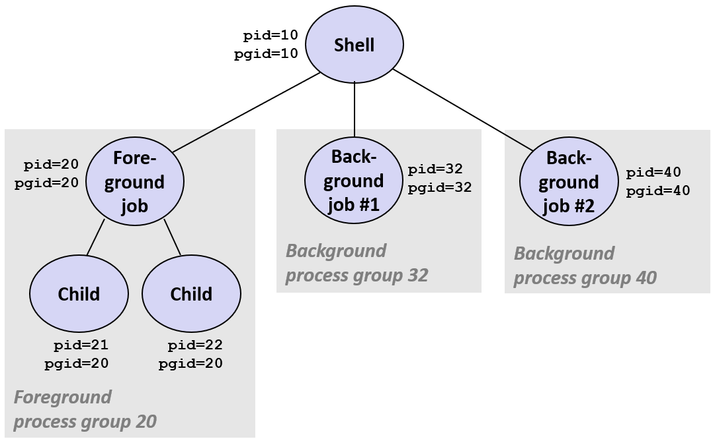
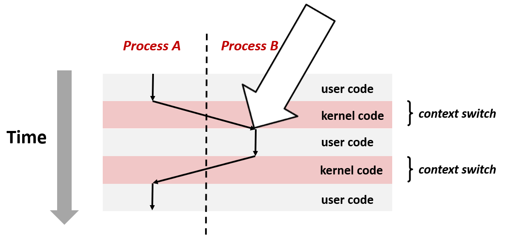
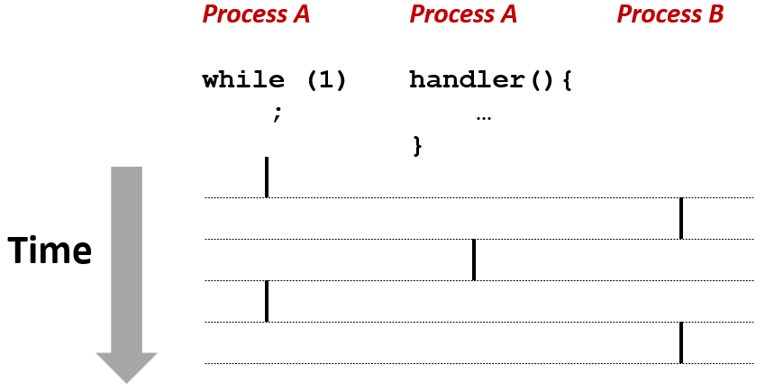
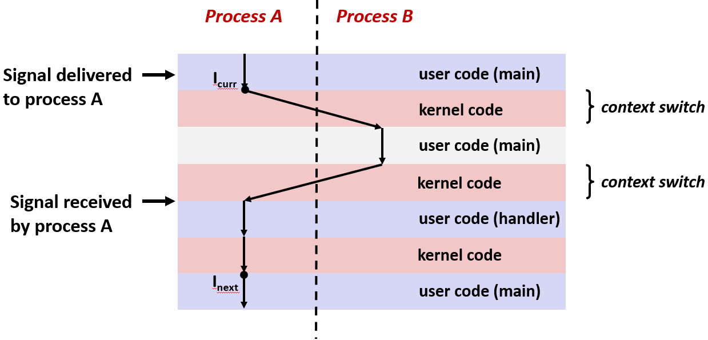
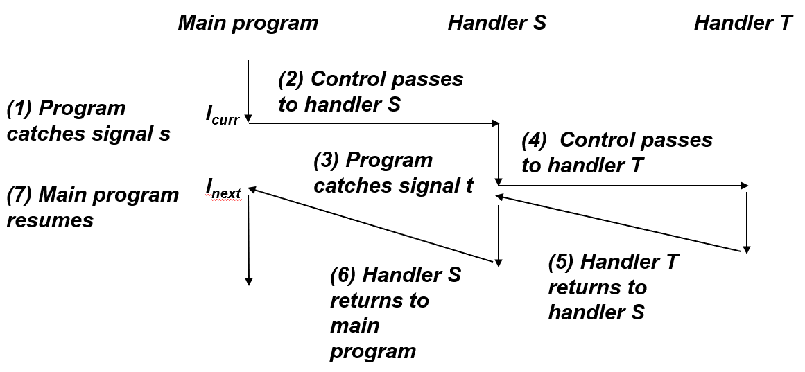

# Exceptional Control Flow Singals and Nolocal Jumps


> 今天我们继续学习异常控制流, 主要是看看一些高层次的机制, 比如说 Linux 信号机制和 C 中的非本地跳转
> 
> 我们会把大多数时间花在信号机制上, 因为它有一些技巧可能迷惑你, 所以我们要我们要把大部分时间花在那里

> 我也会提到非本地跳转的概念, 但是更详细的内容你得看你的课本还有幻灯片末尾的补充内容


## 命令行解释器

现在我们把注意力集中在信号上
我想先说一丢丢 shell 程序的内容

正如之前提到只有一种方法在 Linux 下创建进程, 那就是使用 fork 调用, 可以使用 Linux `pstree` 命令查看层次结构

系统上的所有程序实际形成了一个层次结构: 当启动系统时第一个创建的进程是 init 进程, 进程 id 是 1, **系统上其它所有的进程都是 init 进程的子进程**

当进程 init 启动时会创建**守护进程**: 守护进程一般是一个长期运行的程序, 或者那些希望一直在系统上运行的服务: 比如说 web 服务器




最后会创建登录进程, 登录 shell 为用户提供了命令行接口: 所以当登录到一个 Linux 系统, 得到的是一个登录 shell

在 shell 输入命令, 然后登录 shell 会以登录的用户身份执行程序

所以在 shell 里输入的时候: 比如 ls 命令, 其实是在要求 shell 运行名为 ls 的可执行程序: 会创建一个子进程, 然后在这个子进程中执行 ls

---

### Shell 程序

> 其实 shell 程序和其它的程序没啥区别, 它们以用户的身份执行程序

在早期版本的 UNIX 上也有其它的 shell, 其中 sh 是最初的 shell。它被称为 Bourne shell, 它是由 Stephen Bourne(AT&T Bell Labs, 1977) 创造的


还有当 Berkeley 推出的 UNIX 发行版时, 推出了一款叫做 csh 的 shell

而现代 Linux 默认的 shell 叫做 bash ("Bourne-Again" Shell)

执行程序就是在 shell 中的一系列读/求值的步骤:
- 首先, shell 打印一个提示符"> ", 然后等待在命令行中输入一个命令并敲击 return
- 输入的第一个东西是一个命令, 然后再跟上用空格分隔开的可选参数
- 并且 shell 会检查文件末尾的字符来选择退出, 对终端来说如果是 ctrl-d 则退出, 否则计算此命令行

```c
int main() {
    char cmdline[MAXLINE]; /* command line */

    while (1) {
        /* read */
        printf("> ");
        Fgets(cmdline, MAXLINE, stdin);
        if (feof(stdin))
            exit(0);

        /* evaluate */
        eval(cmdline);
    }
}
```

---

### 内建命令

在 Linux 中命令通常分为两类: 外部可执行文件, 内建命令 (Built-ins)

外部可执行命令如 ls、pwd、gcc 等是硬盘上某个文件夹里的独立程序(比如 /bin/ls)。

当运行它们时, Shell 必须创建一个全新的子进程(fork), 然后把程序加载进来(execve)。

而内建命令的代码就写在 Shell 程序(比如 bash 的源码)内部。常见的内建命令有这些

|命令|全称|作用|
|-|-|-|
|jobs|Jobs|查看当前所有在后台运行或被挂起的任务。|
|bg|Background|将一个挂起的任务放到后台继续运行。|
|fg|Foreground|将一个后台或挂起的任务调回前台运行。|

#### 意义

如果 cd 是个外部程序, 它运行在子进程里: 它改变的是子进程的当前目录, 子进程退出后, 父进程(Shell)的目录依然没变。

改变 Shell 状态的命令(比如切换目录、修改环境变量、管理作业)必须由 Shell 自己亲自执行

---

### 简单的 `Shell eval` 函数

在 shell 中有个约定: 如果命令行以 & 符号结尾, 那么 shell 在后台运行此作业, 并立刻打印出下一个提示符(prompt), 准备读取输入的下一条命令。

如果输入的行里没有 & 符号, 那就是要求 shell 在前台运行此作业, Shell 会把自己"挂起", 等待这个子进程运行结束


```c
void eval(char *cmdline)
{
    char *argv[MAXARGS]; /* Argument list execve() */
    char buf[MAXLINE];   /* Holds modified command line */
    int bg;              /* Should the job run in bg or fg? */
    pid_t pid;           /* Process id */

    strcpy(buf, cmdline);
    bg = parseline(buf, argv);
    if (argv[0] == NULL)
        return;   /* Ignore empty lines */

    if (!builtin_command(argv)) {
        if ((pid = Fork()) == 0) {   /* Child runs user job */
            if (execve(argv[0], argv, environ) < 0) {
                printf("%s: Command not found.\n", argv[0]);
                exit(0);
            }
        }

        /* Parent waits for foreground job to terminate */
    if (!bg) { // bg 是后台的意思
            int status;
            if (waitpid(pid, &status, 0) < 0)
                unix_error("waitfg: waitpid error");
        }
        else
            printf("%d %s", pid, cmdline);
    }
    return;
}
```

求值先解析命令行, 在本例中是保存在 buff 里, 它首先把这个命令行解析成一个 argv 数组: 其中 argv[0] 是命令, 之后的 argv[1], argv[2] 等是可选参数

如果 argv[0] 为空, 那么就是说只输入了一个 return, 所以得到空行: 所以返回即可, 不用管这些


进程 shell 会先检查 argv[0] 是否为内建 shell 命令, 如果不是内建的, 这意味着 shell 要运行一些程序

在这种情况下 shell 会 fork 子进程, 子进程会使用 execve 调用来运行这个程序: 将命令的名字作为第一个参数, 将环境信息作为 argv 的第二、第三个等等


除非有错误, 否则函数 execve 永远不会返回, 所以要检查 execve 的返回值: 如果小于零, 它只会返回一次, 并总是会返回 -1

根据返回值检查是否有错误：如果有, 把错误信息打印出来, 然后退出

一旦父进程再次获得控制权, 会检查是否为后台进程: 如果不是则通过调用 waitpid 等待前台作业(进程)结束之后回收它, 如果是则输出一条信息并继续执行


在 shell 中后台进程和前台进程几乎没什么区别: 仅有的区别是有没有使用 waitpid, 除此之外没什么不同的地方

---

### 简单的 Shell 问题示例

示例中的 shell 会等待和回收前台的工作, 但后台的工作停止时变成"僵尸"后, 由于 shell 不停止, 所以永远不会被回收

如果有太多这样的作业, 那么就会创造出引发内核内存耗尽的内存泄露, 这可能让系统崩溃掉, 所以这是一处错误。这就引出了**异常控制流**来解决这个问题: 

内核会在 shell 的后台子进程结束时, 内核会中断常规的进程发送警告并告知 shell, 接下来 shell 会对此作出反应, 并放出 waitpid


在 Unix 下, 内核用到的这个通知机制就是所谓的信号

---

## 信号

信号就是一条小的信息, 它通知进程系统中发生了一次某种类型的事件。信号与异常机制很像, 但信号完全由软件实现的


内核信号总是由内核发出的, 但有时它是在某些进程请求时发送的(进程间通信), 有时内核自动发起的(事件通知)

说信号是一条小的信息, 是因为它唯一的信息是整数 ID 和它到达的事实。信号类型由小整数 ID (1-30) 标识, 下面是一些的特殊的信号:

当在命令行中按下 ctrl-c 的时候就会触发 sigint 信号, 收到 sigint 时的默认操作是终止任务

所以如果对一个正在运行的前台工作按下 crtl-c, 就会得到返回提示符, 因为这样 kill 了这个工作

信号 sigkill 可以终止任何程序: 这和 sigint 有点类似, 都 kill 了程序, 但sigkill 的特殊之处是它不能被任何方式忽略或覆盖掉


如果试图访问受保护的, 或不合法的内存区域, 就会出现段错误: 然后内核会向这个进程发送 sigsegv 信号, 信号的默认效果是终止这个程序


|ID|名称|默认动作|相应事件|
|-|-|-|-|
|2|SIGINT|终止|用户按 ctrl - c|
|9|SIGKILL|终止|强制中断, 无法被处理|
|11|SIGSEGV|终止|段冲突|
|14|SIGALRM|终止|时钟信号|
|17|SIGCHLD|忽略|子进程停止或终止|


信号 sigalrm 是一个可以自行安排的信号: 可以将信号发送给自己

所以可以在程序里写每隔三秒给自己发送一个 sigalrm 信号, 这是一种设置定时器的方式, 可以按照需求设置超时

如果想设置一个超时变量并且做一些作业, 比如想要防止这项作业运行太长时间, 可以用 sigalrm 来设置超时

信号 sigchild 对 shell 来说非常重要, 每当子进程结束时 kernel 就会通知它们的父进程, 这就是 shell 回收进程的做法: 利用了 sigchild 信号

---

### 信号概念

#### 发送信号

内核给目标进程发送或传递一个信号是**通过为目标进程的上下文设置一些状态**来实现的

> 除了目标进程上下文中的一些位被改变了, 再没有其它的

内核发送信号可能因为监测到一些系统事件: 比如说一个子进程被终止(SIGCHLD), 除以零(SIGFPE)


也可能是进程请求内核代表该进程传递(发送)一个信号给另一个进程: 比如系统调用 kill 就是其中一种, 明确请求内核向目标发送信号

> 这是一个太好的名字。我的意思是说,  kill 是一个发送信号的方式, 当然有时候 kill 掉一个程序不太好, 但因为某些理由, 人们把它叫做 kill

#### 接收信号

目标进程作出应答有两种差异很大的方式: 默认行为(Default Action)和执行信号处理程序 (Signal Handler)

如果进程没有为这个信号编写专门的处理函数, 内核会按照预设逻辑(默认行为)办事:
- 终止进程：内核直接把该进程从任务列表中删掉, 资源回收：该进程占用的资源回收都会被内核回收, 比如收到 SIGKILL
- 停止进程：内核修改进程状态为 TASK_STOPPED, 进程被挂起, 不再被调度执行, 比如收到 SIGSTOP, 收到 SIGCONT 信号之后重启
- 忽略：内核干脆什么都不改, 让进程继续跑。


执行名为信号处理程序的用户级函数来捕获信号, 很像响应某些系统事件的异常处理程序: 区别在于**异常处理是内核级别的, 信号处理实际上是在 C 代码里**



进程接收到信号后, 内核将控制权转移给了信号处理程序, 信号处理程序是一段仅仅在当前进程执行的代码, 是 C 代码里的一个函数

当这段信号处理程序执行完, 它会返回到下一条指令, 接着继续执行


#### 待处理信号

如果信号已由内核发送但是未被目标进程接收, 那么发送给目标进程的该类型信号**处于待处理状态**。待处理信号最多接收一次

任何时刻一个类型**至多有一个待处理信号**: 如果进程有一个类型为 K 的待处理的信号, 则后续的被发送给进程的类型为 K 的信号都被直接丢弃


#### 阻塞信号

进程可以阻塞某些信号的接收, 但没办法阻止信号的传递: 内核不会管有没有阻塞, 只会发送, 但可以阻止进程在收到信号后的响应

内核不管阻塞不阻塞, 照发不误: 会把 Pending 位图里对应的那个 bit 位设为 1。

当设置了 Blocked 位图(也叫信号掩码 Signal Mask), 内核在准备“接收”信号时, 会发现：`Pending & ~Blocked` 的结果里没有这个信号。

结果内核就不会强迫跳转到处理函数。这个信号会像一个待办事项一样, 静静地躺在内核的记录里, 直到把阻塞取消。

**去实现阻塞信号的最核心的原因是：防止竞态条件**

当 Shell 调用 fork 创建子进程。在父进程还没来得及把这个子进程的 PID 加入到 jobs 列表(全局变量)里时, 子进程突然运行结束了。

内核立刻给父进程发了一个 SIGCHLD 信号。父进程被迫停下手中的活, 跳去执行信号处理函数 handler。

当 handler 试图从 jobs 列表里删除这个子进程, 但此时 jobs 里还没有这个进程。handler 执行完回到主程序, 主程序才把这个已经死掉的进程加进 jobs。

结果：这个进程永远留在了 jobs 里, 成了"幽灵进程"。


#### 待处理和阻塞位

##### 待处理位

内核会跟踪这些待处理和阻塞的进程, 内核在每个进程的上下文中维护等待和阻塞位集合

"待处理位向量"中的每一个位都对应着一个特定的信号: 这就是为什么它们不会有排队的说法, 因为每一个信号仅有一个位表示, 在位向量里只有一个位

当传递一个类型为 k 信号时, 内核仅仅会将位 k 置为 pending , 当传递同类型的另一个信号, 仅仅会再次设置那个位, 其实什么都没有做

当信号被传递过来时, 内核将这个位设置为待处理, 并且当信号被接收时将对应位清零

##### 阻塞位

内核也向用户提供了可以阻塞信号的阻塞位向量: 阻塞位向量与待处理位向量基本相同, 它们都是一个 32 位的 int 类型

它可以被置位也可以被清零, 使用系统调用 sigprocmask 就可以置位或清零它。在一些 Linux 资料中, 阻塞位向量有时也被称为信号掩码


---

### 发送信号


#### 进程组

每一个进程都属于某个进程组, 下图展示的这些, shell 也在一个进程中。进程 shell 的进程 id 是 10, 进程组 id 是 10。

接着进程 shell 创建了一个前台作业, 该前台作业的进程 id 是 20, 进程组 id 是 20, 这个前台作业创建的所有子进程都有相同的进程组 id 20

这些进程组可以使用系统调用 setpgid 设置, 也可以使用系统调用获取进程组 id

|getpgrp() |返回当前进程的进程组 |setpgid()| 设置一个进程的进程组|
|-|-|-|-|



> 你可以在例子中看到, shell 做了什么: 它创建了一个前台子进程, 它创建了这个子进程并修改了它的进程组 id, 使之等于它的进程 id
> 
> 当这个子进程创建了其它的子进程时, 它们会继承相同的进程组 id

#### 程序 kill 发送信号

进程组允许可以同时给一组进程发送信号, 可以用一个叫 kill 的程序做到, 一般在 `/bin/kill`

可以用这个 kill 程序发送一个任意信号给某个进程, 或者某个进程组中的所有进程

下面的程序使用 fork 创建了两个子进程, 进程组 id 是 24817, 如果使用 ps 命令, 可以看到有两个进程在运行

那么可以使用 kill 来 kill 掉某个进程: 第一个参数表示想传递的信号, 信号 9 是 sigkill 信号。第二个参数是进程的 id

所以 `/bin/kill –9 24818` 请求内核 kill 进程 24818, 因为传递了 sigkill 信号。

如果在进程 id 之前出现了横杠符号, 那么意思是发送信号给该进程组中的每一个进程, 在这里它是被当作进程组 id 处理的

```bash
linux> ./forks 16 
Child1: pid=24818 pgrp=24817 
Child2: pid=24819 pgrp=24817 
 
linux> ps 
  PID TTY          TIME CMD 
24788 pts/2    00:00:00 tcsh 
# /bin/kill –9 24818 向进程 24818 发送 SIGKILL 
24818 pts/2    00:00:02 forks
# /bin/kill –9 –24817 向进程组 24817 中的每个进程发送 SIGKILL 
24819 pts/2    00:00:02 forks 
24820 pts/2    00:00:00 ps 
linux> /bin/kill -9 -24817 # 杀死整个进程组
linux> ps  
  PID TTY          TIME CMD 
24788 pts/2    00:00:00 tcsh 
24823 pts/2    00:00:00 ps 
linux> 
```

> kill -9 很常用, 如果你想 kill 掉某个进程, 那使用 kill -9 准没错
> 
> 实际上, 我最喜欢的 213 自动实验系统的昵称之一是 kill -9 15-213


#### 从键盘发送信号

键入 ctrl-c (ctrl-z) 让内核向每个前台进程发送 SIGINT (SIGTSTP) 信号:
- ctrl-c 会使内核向前台进程组下的所有作业发送 sigint 信号: sigint 的默认行为是终止进程
- ctrl-z 会使向所有前台进程组下的作业发送 sigtstp 信号: sigtstp 的默认行为是挂起进程


下面程序创建一个父进程, 其一个子进程在前台运行, 当然父进程也在前台

当在命令行敲下 ctrl-z, shell 会显示它已经挂起了这个进程, 如果用 ps, 呢么可以看到父进程和子进程都被挂起了


下面用 shell 内建的指令 fg 把这些被挂起的进程恢复到前台运行: 后面再输入 fg, 作业又到前台运行了

用 ctrl-c kill 掉它会触发 sigint, 它的默认行为是终止进程: 再使用 ps, 它们都没了

```bash
bluefish> ./forks 17
Child: pid=28108 pgrp=28107
Parent: pid=28107 pgrp=28107
<types ctrl-z>
Suspended
bluefish> ps w
  PID TTY      STAT   TIME COMMAND
27699 pts/8    Ss     0:00 -tcsh
28107 pts/8    T      0:01 ./forks 17
28108 pts/8    T      0:01 ./forks 17
28109 pts/8    R+     0:00 ps w
bluefish> fg
./forks 17
<types ctrl-c>
bluefish> ps w
  PID TTY      STAT   TIME COMMAND
27699 pts/8    Ss     0:00 -tcsh
28110 pts/8    R+     0:00 ps w
```

|STAT (进程状态)|S|T|R|s|+|
|-|-|-|-|-|-|
|说明|睡眠|停止|运行|会话领导者|前台进程组|


#### 函数 kill 发送信号

下面的例子展示了如何使用系统函数 kill 发送信号

创建了 N 个子进程且都陷入了死循环, 并记录了所有创建的进程的进程 id

然后到另一个循环去使用 kill 函数 kill 掉了所有那些子进程: 传递进程 id, 想传给这个过程的信号

```c
void fork12() {
    pid_t pid[N];
    int i;
    int child_status;

    for (i = 0; i < N; i++)
        if ((pid[i] = fork()) == 0) {
            /* Child: Infinite Loop */
            while(1)
                ;
        }
    
    for (i = 0; i < N; i++) {
        printf("Killing process %d\n", pid[i]);
        kill(pid[i], SIGINT);
    }

    for (i = 0; i < N; i++) {
        pid_t wpid = wait(&child_status);
        if (WIFEXITED(child_status))
            printf("Child %d terminated with exit status %d\n",
                   wpid, WEXITSTATUS(child_status));
        else
            printf("Child %d terminated abnormally\n", wpid);
    }
}
```

> 现在回收了所有应该被回收的被我们终止的子进程, 这不是绝对必须的, 因为我们将在 fork12 函数返回后立即退出
> 
> 我们只是要说到这一点, 你知道在这里小心, 也许有点迂腐......

---

### 接收信号


假设有一个进程 A 正在执行用户代码, 然后出现了异常, 这个异常可以是定时器到达了时刻, 可以是一个异步异常(中断)或一个同步异常(陷阱一类的)

由于出现了异常, 这里视作发生了陷阱, 用户调用系统调用(陷阱的一种), 控制权转移给内核

内核调用它的调度函数, 它决定做一个从进程 A 到进程 B 的上下文切换, 从异常返回之前会获取进程 B 的有关设置

在它准备好将控制权返还给进程用户代码和进程 B 之前会检查所有待处理的信号



内核通过**计算位向量 pnb 来检查所有待处理的信号**, 使之不会阻塞

将待**处理位向量**与**阻塞位向量的非**进行与运算 `pnb = pending & ~blocked`。计算结果 pnb 是所有**未阻塞待处理信号**的列表

如果 (pnb == 0) 就是说没有待处理的信号, 只要返回, 把控制交给进程 p 的逻辑流中的下一条指令: 它将控制权返还给进程 B, 让它可以继续执行

如果 (pnb != 0) 那么内核会选择 pub 中最小的非零位 k, 它会强制进程 p 接收相应的信号 k, 这个信号的接收会引起这个进程的一些行为

内核会对 pnb 中所有的非零位对应的信号 k 重复此过程, 最后会处理完所有的非零位, 把控制交给进程 p 的逻辑流中的下一条指令


#### 默认行为

每个信号类型都有一个默认动作, 上面详细介绍过, 包括: 进程终止, 停止进程, 进程忽略信号


##### 注册信号处理程序

可以使用系统调用 `handler_t *signal(int signum, handler_t *handler)` 来修改默认行为

因为给一个进程发送信号时, 并不是总是要 kill 掉它, 而 signal 也不是要发出信号, 它可以修改为与默认操作相关的某些操作

第一个参数 signum 代表信号 ID, 意味着要修改哪种类型的信号

第二个参数可以有 3 种传递方式: SIG_IGN(宏), SIG_DFL(宏), **用户级信号处理程序的地址**

宏 SIG_IGN 和 SIG_DFL 分别代表 **忽略 signum 类型的信号** 和 在**接收到 signum 类型的信号时恢复到默认操作**

用户级信号处理函数的地址也就是们在 C 程序中定义的函数: 这个的声明里有一个信号参数作为信号 ID

当进程接收到 signum 类型的信号时, 就会调用称为注册处理程序, 执行处理程序称为"捕获"或"处理"信号

当处理程序执行其返回语句时, 控制权将传递回进程的控制流中因接收到信号而中断的指令

下面是一个安装处理程序的例子: 在 main 里安装 sigint 的处理程序 sigint_handler: 它需要一个信号编号作为参数, 并且没有返回值

```c
void sigint_handler(int sig) /* SIGINT handler */
{
    printf("So you think you can stop the bomb with ctrl-c, do you?\n");
    sleep(2);
    printf("Well...");
    fflush(stdout);
    sleep(1);
    printf("OK. :-)\n");
    exit(0);
}

int main()
{
    /* Install the SIGINT handler */
    if (signal(SIGINT, sigint_handler) == SIG_ERR)
        unix_error("signal error");

    /* Wait for the receipt of a signal */
    pause();

    return 0;
}

```

接着执行到 pause 调用, 它会等待一个信号处理程序的执行, 因为 pause 停止或暂停当前进程, 直到接收到一个信号并且在这个进程中执行了它的处理程序


> 当按下 ctrl-c 时, sigint 开始执行, 所以当你触雷时, 你有没有慌的一批, 并试图用 ctrl-c 来取消掉
>
> 所以你会得到一条嘲笑信息, 我们通过在 bomb 中安装 sigint 信号处理程序来实现
> 当你按下 ctrl-c 时, 就会触发 sigint, 收到 sigint 信号后, 我们输出一条信息然后退出

---

### 并发与信号

进程有各自独立地址空间, 并发流不会妨碍彼此. 但有时需要在进程之间共享东西, 为了在两个进程间共享内存, 得使用特定的系统调用

#### 作为并发流的信号处理程序

信号是并发的一种形式, 信号是一个并发流, 信号处理程序是独立的逻辑流(不是进程), 与主程序并发运行

一个**处理程序**是主程序中执行的一个并发逻辑流: 信号处理程序是一个会随时、随机地打断你主程序, 并抢夺 CPU 控制权的独立运行序列




进程 A 中执行一个 while 循环, 运行到循环中的一条语句时, 进程收到了一个信号, 这使得控制权被转移给这个处理程序

这个处理程序是并发执行的, 它与进程 A 中的 while 循环在逻辑上是时间重叠的, 最终该处理程序返回到进程 A


**信号棘手的理由**之一就是这个重叠的并发流: 因为这个信号处理程序与 main 程序**运行在同一个进程里**, 是并发的, 所以它们**共享程序中的所有全局变量**

信号处理程序是一个自己定义的函数, 它可以访问所有的状态, 程序中的所有全局状态: 

如果 main 正在修改一个全局变量, 这个修改需要 3 步汇编指令, 而内核在第 2 步指令结束时强行"切换"到了 handler

而 handler 恰好也要读这个变量, 那么这就导致了 handler 读到的是一个改了一半的、错误的数据

将这些信号处理程序看作并发流的另一种方式是用这个上下文切换图




假设执行一个进程 A, 某时刻一个信号被传递给进程 A, 现在还什么都没有发生, 现在只有进程 A 的待处理位被置位

在某些时刻, 控制权被转移给了内核, 内核决定进行从 A 到 B 的上下文切换, 现在 B 开始运行一段时间, 这是另一次内核控制权的转移

内核决定调度进程 A , 在内核将控制权返还给进程 A 之前, 此信号的未处理信号位是置位的

所以进程 A 收到了这个信号然后执行**处理程序**, 当处理程序返回, 它会返回到内核去, 然后控制权会被交给进程要执行的下一条指令


因为 **信号处理程序也可被其它信号处理程序中断**, 所以这使它很麻烦




假如 main 程序捕获到了一个信号 S, 控制权得转移给 S 的处理程序, 处理程序 S 执行完之前, 又捕获了信号 T, 那么控制权就得先转移给 T 的处理程序

处理程序 T 返回到处理程序 S 被中断的地方, 然后处理程序 S 继续执行, 最终返回到 main 程序被中断的地方

---

### 阻塞和非阻塞信号

#### 隐式阻塞机制

内核会阻塞与当前在处理的信号同类型的其它正等待的信号: 如一个 SIGINT 处理器是不能被另一个 SIGINT 信号中断的

内核也提供一个系统调用, 允许显式设置阻塞和解除阻塞: 函数 sigprocmask, 它允许阻塞或解除阻塞一组信号

下面是些支持的函数, 它们允许创建集合, 可以把集合当成**位向量**来看: 这些函数可以置位或复位这些位向量里的位

|辅助函数|sigemptyset|sigfillset|sigaddset|sigdelset|
|-|-|-|-|-|
|说明|创建空集|把所有的信号都添加到集合中|添加指定信号到集合中|删除集合中的指定信号|

#### 临时阻塞信号

下面展示了如何使用 `int sigprocmask(int how, const sigset_t* set, sigset_t* oldset);` 来暂时阻塞或解除阻塞一个信号

用 sigemptyset 来创建一个空的掩码, 这是一个全为零的掩码, 这个集合现在没有元素

接下来添加一个 sigint 信号到这个集合中: 暂时有些不想被 sigint 中断的代码, 所以需要暂时阻塞掉 sigint 的接收, 那就要在命令里使用函数 sigprocmask

掩码 &mask 指定了一堆想屏蔽的信号, 即想屏蔽的信号集合。**内核会根据新掩码 mask 和动作 `SIG_BLOCK` 给内核中的阻塞位集合重新赋值**

在内核把新掩码 mask 生效之前, 内核会先把"生效前内核中阻塞位", 也就是旧掩码复制一份, 塞进提供的 &prev_mask 变量里。

从 sigprocmask 返回后, 信号 sigint 就被阻塞了, 所以收不到它, 接下来执行这段不会因为收到 sigint 而中断的代码

可以在后面的操作中使用 sig_setmask 来恢复之前的阻塞集合, 再次传递在阻塞开始时保存的掩码

```c
sigset_t mask, prev_mask;

Sigemptyset(&mask);
Sigaddset(&mask, SIGINT);

/* Block SIGINT and save previous blocked set */
Sigprocmask(SIG_BLOCK, &mask, &prev_mask);

    /* Code region that will not be interrupted by SIGINT */

/* Restore previous blocked set, unblocking SIGINT */
Sigprocmask(SIG_SETMASK, &prev_mask, NULL);
```

---

### 信号安全

#### 不安全原因

**第一方面: 共享的数据结构可能会被破坏**

处理程序 Handler 和主程序并发执行且**共享相同的全局数据结构**: 假如 main 程序在更新某种类似链表的数据结构时, 这个程序收到信号时会被中断

如果这个信号处理程序更新了同一个数据结构, 读或修改它, 这会导致它状态不一致, 那么就会出现问题

**第二方面: 可能丢失处理程序的计数**

因为同类型的信号不会排队, 所以用收到信号的次数来对事件进行计数时, 便会出现丢失: 处理程序本该运行 5 次, 但因为还没处理完, 后面进来的 4 次都没被处理


**第三方面：在不同版本的 Linux 上是不能移植的**

Unix 的发展史非常混乱(BSD派、System V派、Linux派), 导致不同系统对 signal() 函数的实现细节不一样

信号处理程序的语义可以是与 Linux 不同的:

> 如果你用的是 solaris 或者 bsd 的某个版本, 这不重要

#### 编写安全信号


**信号处理器越简单越好**
第一个参考是让处理程序尽可能的简单: 有个例子, 最简单的处理程序就是设置一个全局变量然后返回

> 事实上, CMU cert 为兼容的程序提供了参考, 这是唯一一个兼容的信号处理程序, 仅仅设置了一个全局变量后就返回

**信号处理器只调用异步且信号安全(async-signal-safe) 的函数**

处理程序中出现的这种函数必须是同步信号安全的

函数 printf、sprintf、 malloc 和 exit 等非常常见和常用的功能是不安全的

**在进入和退出的时候保存和恢复 errno**

每次进入和退出时都要保存并恢复 errno: 全局变量 errno 在系统级函数出现错误时才会被赋值

所以在开始和结束时要把它保存和恢复: 如果被一个中断处理程序中断掉了, 这使得它不会被覆盖掉

**临时阻塞所有的信号以保证对于共享数据结构的访问**

如果信号处理程序中访问某些共享的数据结构时, 得临时阻塞一些信号: 程序 main 和信号处理程序都得这么做


**用 volatile 关键字声明全局变量**

得确认在信号处理程序和 main 程序间共享的全局变量被声明为 volatile: 属性 volatile 可以防止编译器将它的值放入寄存器中

假设 main 有一个等待全局变量设置的循环 while(flag == 0), 编译器查看函数 main 内部没有修改全局变量 flag 的代码

于是编译器把全局变量 flag 读进寄存器里, 以后每次判断直接看寄存器就行了, 不用老跑去内存里读

而处理程序 handler 修改了全局变量 flag 在内存中的值, 这是 flag 实际的值, 但函数 main 只读在寄存器里, 这使得 main 程序永远也接收不到改变

使用 volatile 的变量可以让它不会被放入寄存器里

所以如果声明一个全局变量为 volatile, 就在明确告诉编译器, 它可能会被程序控制流之外的东西修改, 必须老老实实地从内存里读写


**用 volatile sig_atomic_t 来声明全局标识符**
假设有一个特殊的全局变量 flag, 它是只读或只写的变量 (例如：flag = 1, 而不是 flag++)

如果变量具有这种性质, 那么可以用 sig_atomic_t 来声明它, 这样定义后就不需要像其它全局变量被保护, 系统会保证这个变量的读写操作是原子的


原子操作: 意味着对这个 flag 的读写操作会发生在一个禁止中断的步骤中, 发生在一个不可中断的加载或存储

> 在实践中, 在大多数系统下, sig_atomic_t 是 int 类型的, 所以你可以在一个原子指令中读写一个 int 类型的数据
> 但如果你想要移植, 你得用 sig_atomic_t 声明, 它可以在所有系统上工作


#### 异步信号安全

假设有一个函数, 它**访问的所有数据都在自己的栈上**, 这叫做可重入, 是异步信号安全的: 没有全局变量, 没有指向全局变量的指针, 所有都被保存在本地栈

因为可重入函数可以有多个实例, 它们**使用的所有变量都有自己的副本**, 那么**可以**在信号处理函数中**使用这些可重入函数**

POSIX 标准确保了 117 个不同的函数是同步信号安全(async-signal-safe)的

常见的: _exit, write, wait, waitpid, sleep, kill 都包含在内

有些常用函数并不在这个列表中, 比如说 `printf,  sprintf, malloc, exit`, 函数 `write` 是唯一的同步信号安全的输出函数


当希望信号处理程序输出信息时, 一定不要使用 printf 的, 原因如下:

写一个程序, 在 main 中密集执行打印输出循环, 然后是一个稳定的中断流, 它也执行一个 printf

printf 调用必须获得终端上所谓的锁: 获得锁意味着同一时刻只能有一个 printf 的实例向终端进行写操作

如果有另一个函数尝试获得锁, 那么它必须得等待, 直到拥有锁的函数释放它. 锁是一种互斥访问两个共享资源的方法

如果在 main 中执行密集的 printf 循环, 如果其中一个 printf 获得了终端的锁, 然后因为接收到信号而中断, 在信号处理程序中, 它调用另一个 printf

这个 printf 尝试获得这个锁, 但这个锁被程序 main 执行到一半的 printf 占用而不释放, 这会导致一直阻塞

这样 main 等待处理函数运行完, 处理函数等待 main 处理完释放锁, 进程在等待一个永远不会发生的事件


#### 安全生成格式化输出

> 为了处理这种情况, 我真的不想告诉你们: 你的程序中不可能出现任何输出, 并且还为它写一个很难的东西来处理
> 
> 我做了一个很小的库, 叫做安全 I/O 库, 有三个可重入的程序, 可以在 csapp.c 文件中找到它们, 已经发布在网站上了

|ssize_t sio_puts(char s[])|ssize_t sio_putl(long v)|void sio_error(char s[])|
|-|-|-|
|打印一个字符串|打印一个 long|打印一条信息然后退出|


> 你可以安全地使用, 相信我, 你可以安全地在信号处理程序中使用它

> 如果用这个库重写我们的 sigint 处理程序, 重写的结果会是这个样子, 那么现在我们所有的函数都是同步信号安全的了

```c
void sigint_handler(int sig) /* Safe SIGINT handler */
{
    Sio_puts("So you think you can stop the bomb with ctrl-c, do you?\n");
    sleep(2);
    Sio_puts("Well...");
    sleep(1);
    Sio_puts("OK. :-)\n");
    _exit(0);
}
```

#### 错误的信号处理

下面的程序中通过挂载 sigchild 处理程序来知道如何回收那些在后台运行的子进程


这个程序挂载了 sigchild 处理程序, 然后创建了 N 个不同的子进程, 每个子进程 sleep 一段时间后退出

然后父进程 spin 直到全局变量 ccount 变为 0, 该全局变量在 child_handler 程序中被修改

然后等待这个子程序, 当这个 child_handler 程序被调用说明收到了 sigchild 信号。在处理程序中, 通过调用 wait 来回收子进程, 接下来将 ccount 减 1


一旦所有子进程都被回收, 那么 ccount 将变为 0, 然后父进程就可以退出这个 while 循环


```c
int ccount = 0;
void child_handler(int sig) {
    int olderrno = errno;
    pid_t pid;
    if ((pid = wait(NULL)) < 0)
        Sio_error("wait error");
    ccount--;
    Sio_puts("Handler reaped child ");
    Sio_putl((long)pid);
    Sio_puts(" \n");
    sleep(1);
    errno = olderrno;
}

void fork14() {
    pid_t pid[N];
    int i;
    ccount = N;
    Signal(SIGCHLD, child_handler);

    for (i = 0; i < N; i++) {
        if ((pid[i] = Fork()) == 0) {
            Sleep(1);
            exit(0);  /* Child exits */
        }
    }
    while (ccount > 0) /* Parent spins */
        ;
}
```

在这个例子中N = 5. 当运行这代码时「Handler reaped child」信息仅仅被执行了两次, 这意味着处理程序只被调用了两次

```bash
whaleshark> ./forks 14
Handler reaped child 23240
Handler reaped child 23241
```


> 我们创建了五个子进程, 我们也终止了五个子进程, 但我们只回收了两次

假设的 child_handler 的执行处理了对 sigchild 信号的接收

实际上有多个 sigchild 信号被传递给子进程在待处理位向量上不断被覆盖, 这些信号的传递在这个过程中没有任何反应

直到进程准备好调度, 才会接收到一个信号: 尽管传递了三个信号, 但是只有一个信号被接收

> 在这种情况下你不能使用事件, 我们在用信号来统计事件, 在这个例子中是子进程的终止

> 所以这种情况下接收到的信号, 它仅仅表明至少有一个子进程被终止, 我们可以从接收到的信号推断出最少有一个子进程被终止了


#### 正确的信号处理

在收到 sigchild 时可能有多个被终止的子进程, 必须等待所有终止的子进程, 那么可以把 wait 放进循环回收所有终止的子进程

在这个循环里直到没有被终止的子进程, 这时候会以错误码 -1 返回, 并得知有一个子进程错误

但这不是一个真正的错误, 这只是说明没有更多被终止的子进程了。所以只要检查 errno != ECHILD, 接着会有一个错误, 否则就会像预期的那样正常结束

```c
void child_handler2(int sig)
{
    int olderrno = errno;
    pid_t pid;
    while ((pid = wait(NULL)) > 0) {
        ccount--;
        Sio_puts("Handler reaped child ");
        Sio_putl((long)pid);
        Sio_puts(" \n");
    }
    if (errno != ECHILD)
        Sio_error("wait error");
    errno = olderrno;
}
```

```bash
whaleshark> ./forks 15
Handler reaped child 23246
Handler reaped child 23247
Handler reaped child 23248
Handler reaped child 23249
Handler reaped child 23250
whaleshark>
```

#### 可移植的信号处理

不同版本的 Unix 可以具有不同的信号处理语义

**有些系统不会阻止正在处理的类型的信号**

**有些较旧的系统在捕获信号后将操作恢复为默认值**

有一些早期版本的 UNIX 在捕捉到信号后, 会立刻将该信号的动作重置为默认值, 所以不得不每次都再挂载一次

想持续处理该信号, 都得通过在处理程序自身里调用 signal 重新挂载它, 在 Linux 系统上不必如此

**有些中断系统调用可能返回 errno == EINTR**

像 read()、write() 或 accept() 这种可能会导致进程永久阻塞(等待磁盘、网络数据或用户输入)的函数被称作**慢速系统调用**

**慢速系统调用**在被调用时, 内核不会等数据到来, 内核会向磁盘控制器发送请求, 然后调度到其它进程去, 然后调用该函数的进程会一直等待


当进程 read() 等待数据触发中断时, 突然收到信号, 内核为了处理, 会中止当前的系统调用。系统调用返回一个错误码 EINTR(Interrupted system call)。

> 你没有做错任何事情, 你只是运气不太好, 被信号中断了, 在你的用户代码中, 你必须得检查它


如果有像 read 这样的慢系统调用被信号中断了, 必须得重新调用它: 得把这些 read 调用放到循环中, 在成功前一直循环


**解决方法是一个叫做 sigaction 的系统调用, 它提供了信号替换的机制, 它为可移植和可预测的信号处理提供了一种机制**

下面程序创建一个首字母大写的 Signal, 参数与 signal 一样, 但在调用过程中它会使用 sigaction 函数来获取可移植的信号处理程序

> 它的细节不是重点, 重点在于你的代码经常会用 caspp.c 提供的包装来调用 Signal, 如果你这样做了, 那么这种类型的信号就会一直被阻塞
> 
> 处理程序会自动重新开始, 慢系统调用会被信号中断, 幸运的是有个简单的解决方法


```c
handler_t *Signal(int signum, handler_t *handler)
{
    struct sigaction action, old_action;

    action.sa_handler = handler;
    sigemptyset(&action.sa_mask); /* Block sigs of type being handled */
    action.sa_flags = SA_RESTART; /* Restart syscalls if possible */

    if (sigaction(signum, &action, &old_action) < 0)
        unix_error("Signal error");
    return (old_action.sa_handler);
}
```


#### 同步错误

函数 initjobs() 维护了一个工作列表, 因此每次创建一个新的子进程时, 便会将它加入工作列表中, 每当子进程终止, 从工作列表中将其移除

在循环中创建一个子进程, 然后在这个子进程中执行程序。

在父进程中, 在它将工作加入到工作队列中时, 它会临时阻塞所有信号, 接着解除这些信号的阻塞。

因为工作队列受 sigchild 处理程序影响, 所以这么做是它在保护对共享工作队列的访问


所以当子进程终止时, 父进程会收到 sigchild 开始运行处理程序, 回收所有终止的子进程, 将每个子进程对应的工作从工作队列中删除

> 这是经典情况, 在我们的 main 程序中有两个并发流, 还有我们的信号处理程序
>
> 每次访问一个工作队列, 当它们更新工作队列时, 它们会阻塞信号

```c
void handler(int sig)
{
    int olderrno = errno;
    sigset_t mask_all, prev_all;
    pid_t pid;

    Sigfillset(&mask_all);
    while ((pid = waitpid(-1, NULL, 0)) > 0) { /* Reap child */
        Sigprocmask(SIG_BLOCK, &mask_all, &prev_all);
        deletejob(pid); /* Delete the child from the job list */
        Sigprocmask(SIG_SETMASK, &prev_all, NULL);
    }
    if (errno != ECHILD)
        Sio_error("waitpid error");
    errno = olderrno;
}

int main(int argc, char **argv)
{
    int pid;
    sigset_t mask_all, prev_all;

    Sigfillset(&mask_all);
    Signal(SIGCHLD, handler);
    initjobs(); /* Initialize the job list */

    while (1) {
        if ((pid = Fork()) == 0) { /* Child */
            Execve("/bin/date", argv, NULL);
        }
        Sigprocmask(SIG_BLOCK, &mask_all, &prev_all); /* Parent */
        addjob(pid);  /* Add the child to the job list */
        Sigprocmask(SIG_SETMASK, &prev_all, NULL);
    }
    exit(0);
}
```

但是这个程序有一个非常微妙和令人讨厌的 bug: **可能子进程在父进程将工作添加到工作队列中之前子进程可能就终止了**

不能对子进程的执行顺序做任何假设还有它们会运行多长时间, 它有很多可能性

子进程执行完后可以将控制权返回给另一个子进程, 而不是父进程: 子进程会在父进程将其添加到工作队列之前终止:

父进程调用 Fork() 创建子进程诞生了, 时间片切换 CPU 去跑子进程, 父进程在原地等, 还没执行 addjob。

子进程执行 Execve 跑完程序, 然后终止了。内核发现子进程死了, 立刻给父进程发了一个 SIGCHLD 信号。

父进程还没来得及执行 addjob 就被迫跳到了 handler 处理程序执行 waitpid 回收了子进程并执行 deletejob(pid)。

但 addjob 还没被执行过, 所以此时 jobs 列表里还没有这个 PID, 所以 deletejob 被执行完毕什么也没做

在 handler 执行完成后, 父进程开始了 addjob(pid): **一个已经死掉并被回收的进程, 被永久地添加到了 jobs 列表里。**


> 所以这是一种微妙的, 令人讨厌的, 可怕的, 你会遇到的 bug
> 当你处理并发时, 试图追踪所有这些交错的事件, 这只会让你头皮发麻, 它会发生在任何情况的并发下
>
> 当你有并发流访问共享资源时, 信号处理函数没什么不同, 在我们后面学习线程时, 我们会讨论处理这种共享的原则

#### 修正无竞争的 Shell 程序

无法控制**是子进程先执行还是父进程先执行**, 也没办法**控制子进程运行多久**, 但可以**控制 sigchild 处理程序何时运行, 因为可以阻塞信号**

消除子处理程序在父进程将对应的工作添加到工作队列之前执行的可能性: 用 sigprocmask 在创建子进程之前阻塞 sigchild 信号

在 mask_one 中添加 SIGCHLD, 接着将 mask_one 传入 sigprocmask 在创建子进程之前阻塞 sigchild 信号, 接着创建子进程 A

在 execev 之前不知道**子进程 A 运行的代码里是否创建了自己的子进程 B**。**默认情况下, 子进程会继承父进程的阻塞位向量**。

所以如果不解除阻塞, 子进程 A 运行时, SIGCHLD已经被阻塞, 永远不会收到子进程 B 的SIGCHLD。**所以在执行 B 之前得解除对 sigchild 的阻塞**


```c
int main(int argc, char **argv)
{
    int pid;
    sigset_t mask_all, mask_one, prev_one;

    Sigfillset(&mask_all);
    Sigemptyset(&mask_one);
    Sigaddset(&mask_one, SIGCHLD);
    Signal(SIGCHLD, handler);
    initjobs(); /* Initialize the job list */

    while (1) {
        Sigprocmask(SIG_BLOCK, &mask_one, &prev_one); /* Block SIGCHLD */
        if ((pid = Fork()) == 0) { /* Child process */
            Sigprocmask(SIG_SETMASK, &prev_one, NULL); /* Unblock SIGCHLD */
            Execve("/bin/date", argv, NULL);
        }
        Sigprocmask(SIG_BLOCK, &mask_all, NULL); /* Parent process */ 
        //保护全局变量 jobs 防止除 SIGCHLD 以外的其他修改
        addjob(pid);  /* Add the child to the job list */
        Sigprocmask(SIG_SETMASK, &prev_one, NULL);  /* Unblock SIGCHLD */
    }
    exit(0);
}
```

这就**将创建线程与执行程序分开**的意义之一: 这允许获取信号掩码, 在子进程中执行程序之前, 将它设置为期望的样子

子进程拥有的是和父进程数值完全相同但独立的地址空间, 拥有两套完全独立的位向量, 因此子进程中解除阻塞不会改变父进程中的阻塞

所以尽管子进程提前运行结束, 由于父进程阻塞, 不会接收发送的 SIGCHLD, 处理程序在添加工作队列中之前是不会运行的

#### 显式等待问题

在之前的示例中在 main 中使用了 wait, 但在一个实际的 shell 中将让 sigchild 处理程序执行所有的 wait 调用

所以得把 wait 放到 sigchild 处理程序中, 如果不能在 main 程序中有一个 wait 的话, 可以在 sigchild 处理程序中写代码来检测前台工作是否已完成

当读取前台进程时会创建另一个前台进程, 可以将这个进程的 id 设置为全局变量 pid 作为一个 flag

```c
volatile sig_atomic_t pid;

void sigchld_handler(int s)
{
    int olderrno = errno;
    pid = Waitpid(-1, NULL, 0); /* Main is waiting for nonzero pid */
    errno = olderrno;
}

void sigint_handler(int s)
{
}
```


在下面的 main 程序中, 想像之前那样阻塞 sigchild 来避免父进程和子进程之间的竞争

创建子进程, 然后将它的父进程的 pid 设置为零, 然后解除对 sigchild 的阻塞, 然后等待 sigchild 处理程序运行, 将这个 pid 设置为非零


```c
int main(int argc, char **argv) {
    sigset_t mask, prev;
    Signal(SIGCHLD, sigchld_handler);
    Signal(SIGINT, sigint_handler);
    Sigemptyset(&mask);
    Sigaddset(&mask, SIGCHLD);

    while (1) {
        Sigprocmask(SIG_BLOCK, &mask, &prev); /* Block SIGCHLD */
        if (Fork() == 0) /* Child */
            exit(0);
        /* Parent */
        pid = 0;
        Sigprocmask(SIG_SETMASK, &prev, NULL); /* Unblock SIGCHLD */

        /* Wait for SIGCHLD to be received (wasteful!) */
        while (!pid);
        /* Do some work after receiving SIGCHLD */
        printf(".");
    }
    exit(0);
}
```

程序是正确的, 但这是非常浪费的, **下面有其他选项, 但也不够好**

> 因为一直在 spinning......我们在这个紧密的循环中用变量处理循环
> 
> 只是一遍又一遍又一遍又一遍又一遍又一遍地执行, 鬼知道会用多久, 所以这不是一个优秀的解决方法


左边代码意思是：如果子进程还没结束(pid 为 0), 就让父进程挂起(pause), 直到收到信号。

这里存在一个时间窗口, 在 while(!pid) 的判断之后, 但在执行 pause() 之前。

父进程检查 pid, 发现是 0。就在这一瞬间, 子进程结束了, 内核发送了 SIGCHLD。父进程被迫跳去执行 handler。

函数 handler 回收了子进程, 并把 pid 改成了 1。handler 返回, 父进程继续执行刚才的pause()。

函数 pause 的功能是“等待下一个信号”。但唯一的信号(SIGCHLD)已经跑完了。父进程会在这里永远等下去, 程序卡死。

<div style="display: flex; gap: 20px; align-items: flex-start;">

```c 
while(!pid) /* Race! */
    pause();
```

```c
while(!pid) /* Too slow! */
    sleep(1);
```
</div>


右边的代码如果子进程在 0.001 秒就结束了, 父进程却必须睡满 1 秒钟才能醒来检查 pid。这在高性能 Shell 中是不可接受的

如果将值设置为纳秒级, 那么父进程会频繁地“醒来 -> 检查 -> 睡觉”, 这种由于高频轮询导致的 CPU 占用过高, 被称为忙等(Busy Waiting), 效率极低。

#### 解决显式等待

解决方法是使用 `int sigsuspend(const sigset_t *mask)` 显示等待信号, 函数 sigsuspend 是一个接受信号掩码的函数, 等价于这三条指令的不可中断版本

第一行阻塞信号掩码中指定的信号, pause 和 第一行是原子的, 之后这两条指令不能被中断, 它们总是一起执行

阻塞了这些信号然后执行 pause, 这之间没有什么变化, 在 sigprocmask 和 pause 之间没有信号中断它

接着当有信号过来, 处理程序的执行会导致 pause 退出, 然后将掩码设置回原来的值


```c
sigprocmask(SIG_BLOCK, &mask, &prev);
pause();
sigprocmask(SIG_SETMASK, &prev, NULL);
```

**正确的方法是按照以下方式使用 sigsuspend 显示等待信号**


```c
int main(int argc, char **argv) {
    sigset_t mask, prev;
    Signal(SIGCHLD, sigchld_handler);
    Signal(SIGINT, sigint_handler);
    Sigemptyset(&mask);
    Sigaddset(&mask, SIGCHLD);

    while (1) {
        Sigprocmask(SIG_BLOCK, &mask, &prev); /* Block SIGCHLD */
        if (Fork() == 0) /* Child */
            exit(0);
 
       /* Wait for SIGCHLD to be received */
        pid = 0;
        while (!pid)
            Sigsuspend(&prev);
 
       /* Optionally unblock SIGCHLD */
        Sigprocmask(SIG_SETMASK, &prev, NULL);
    /* Do some work after receiving SIGCHLD */
        printf(".");
    }
    exit(0);
}
```


既然"检查变量"和"挂起等待"之间有缝隙, **那就让这两个动作合并成一个不可分割的原子操作**。

在创建子进程前得先阻塞 sigchild 再创建, 然后等待 sigchild 被接收, 现在 sigchild 信号还是被阻塞的, 也就是没有 sigchild 处理程序运行的危险


将这个全局变量设置为零, 当是非零的时候反复调用 sigsuspend, 函数 sigsuspend 使用的是 sigchild **阻塞被解除的掩码**

当运行 sigsuspend 时, sigchild 被解除阻塞, 这允许 handler 可在此时被接收或执行, **因为是原子性的, 所以立刻挂起, 没有间隙**

并且只要有任何一个未被阻塞的信号到达, 函数 sigsuspend 就会醒来, 挂起结束, 循环继续并检查全局变量 pid

---

## 非本地跳转

普通的 return 只能跳回上一层调用者, 而 `setjmp` 和 `longjmp` 可以直接从嵌套了十层、百层深的函数内部, 瞬间"闪现"回程序的某个起始点

尽管它打破了正常的栈结构, 打破调用机制, 返回规律, 但如果使用不当, 会造成资源泄漏或不一致状态。

并且对错误恢复和信号处理有帮助: 在嵌套调用中发生错误, 不需要逐层 return 错误码, 可以直接跳回顶层, 由顶层统一处理。


### setjmp

函数 `int setjmp(jmp_buf j)` 会保存当前寄存器的**寄存器上下文、堆栈指针、PC寄存器值**在 jmp_buf 中

该函数不止会返回一次, 第一次调用时会返回 0, 如果某个地方调用了 longjmp, 程序会“跳回”到调用 setjmp 的地方并返回非零


### longjmp

函数 `void longjmp(jmp_buf j, int i)` 不返回, 而是恢复上下文并跳转到当 setjmp 位置并恢复 j 保存的上下文, 而且 i 作为 setjmp 的返回值


#### 实现原理

- 恢复 %esp(栈指针): 让栈回到当时调用 setjmp 时的状态(中间的栈帧全丢失)。

- 恢复 %ebp(基指针): 也回到当时的状态。

- 恢复 %eip(指令指针): 跳回 setjmp 之后的指令。

- 把 i 存入 %eax(返回值寄存器): 这样 setjmp 返回时就能看到这个值。


### 使用示例

目标: 从深度嵌套的函数直接返回到原始调用

```c
jmp_buf buf;

int error1 = 0;
int error2 = 1;

void foo(void), bar(void);

int main()
{
    switch(setjmp(buf)) {
    case 0:
        foo();
        break;
    case 1:
        printf("Detected an error1 condition in foo\n");
        break;
    case 2:
        printf("Detected an error2 condition in foo\n");
        break;
    default:
        printf("Unknown error condition in foo\n");
    }
    exit(0);
}

/* Deeply nested function foo */
void foo(void)
{
    if (error1)
        longjmp(buf, 1);
    bar();
}

void bar(void)
{
    if (error2)
        longjmp(buf, 2);
}
```

### 限制

只能跳转到已经调用但尚未完成的函数环境


<div style="display: flex; gap: 20px; align-items: flex-start;">

```c
// longjmp之前: p1 -> p2 -> p2 -> p2 -> ... -> p3
// longjmp之后: p1
jmp_buf env;

P1() {
  if (setjmp(env)) {
    /* Long Jump to here */
  } else {
    P2();
  }
}

P2() {  . . . P2(); . . . P3(); }

P3() {
  longjmp(env, 1);
}

```

```c
jmp_buf env;

P1() {
  P2(); P3();
}

P2() {
   if (setjmp(env)) {
    /* Long Jump to here */
  }
}

P3() {
  longjmp(env, 1);
}

```
</div>

下面的示例把所有的放在一起：一个在ctrl-c 时重新启动自己的程序

```c
#include "csapp.h"

sigjmp_buf buf;

void handler(int sig)
{
    siglongjmp(buf, 1);
}

int main()
{
    if (!sigsetjmp(buf, 1)) {
        Signal(SIGINT, handler);
    Sio_puts("starting\n");
    }
    else
        Sio_puts("restarting\n");

    while(1) {
    Sleep(1);
    Sio_puts("processing...\n");
    }
    exit(0); /* Control never reaches here */
}
```

```bash
greatwhite> ./restart
starting
processing...
processing...
processing...
restarting # ctrl-c
processing...
processing...
restarting # ctrl-c
processing...
processing...
processing...
```