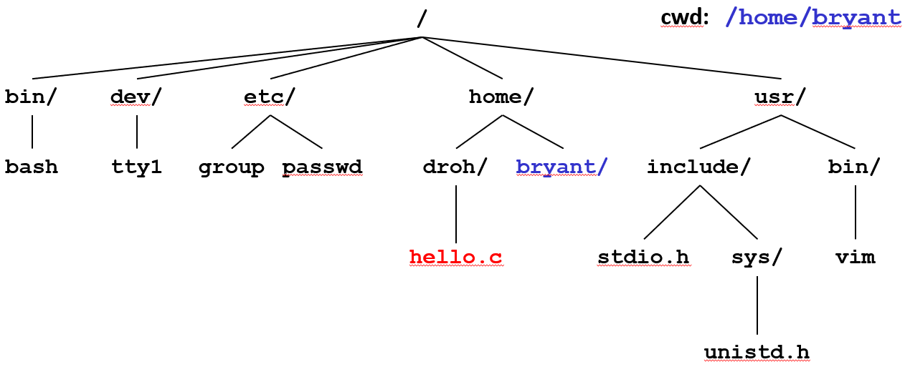
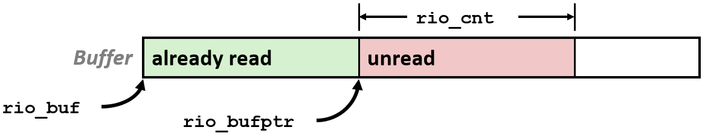
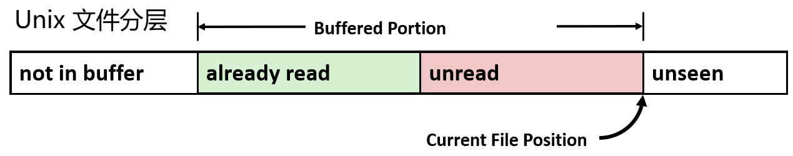
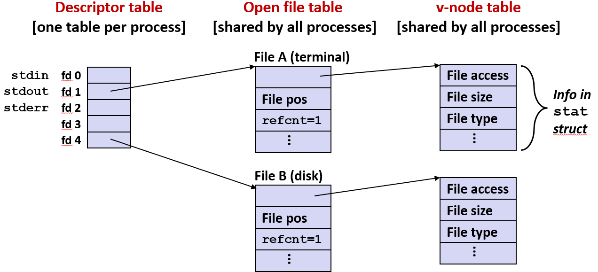
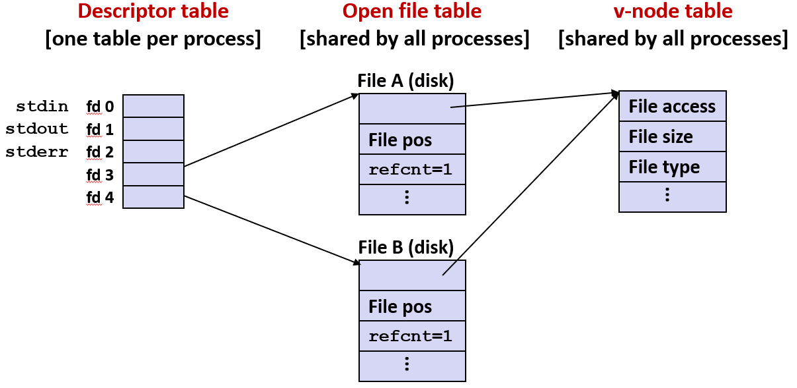
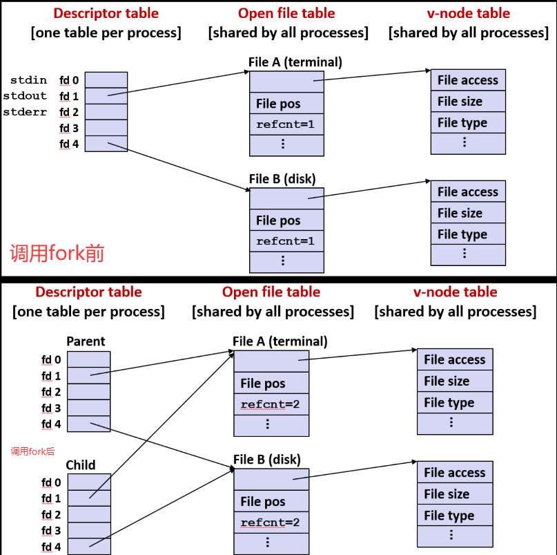
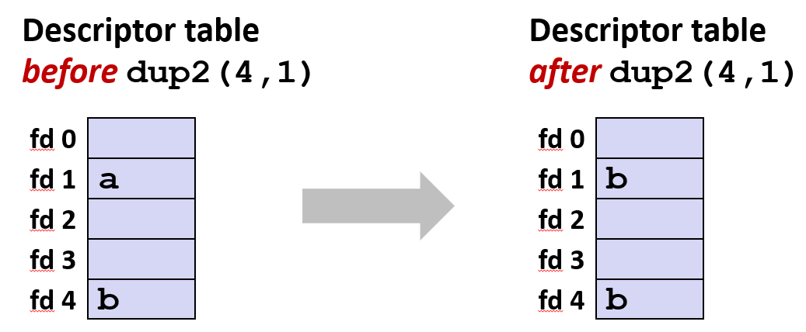
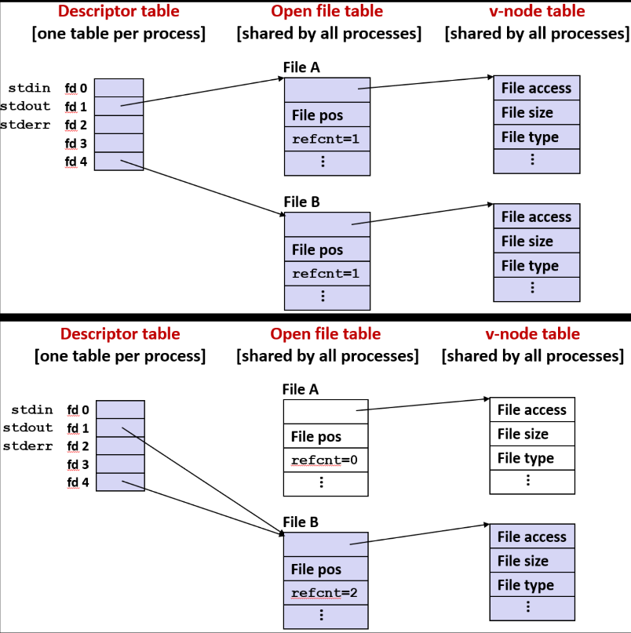
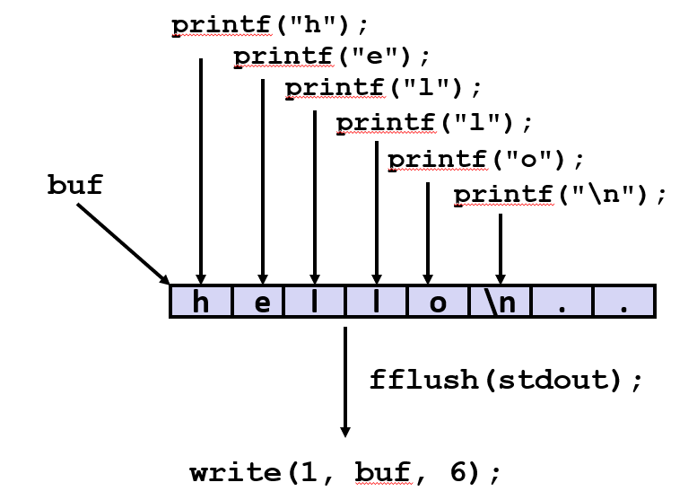
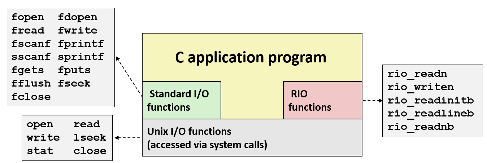

# Exceptional System Level I_O

## Unix I/O


### 概述

Unix 的 I/O 比起其他操作系统更简单且更一致, 它的一个设计优点是: **用文件来描述很多抽象的事物**

与 Windows 或早期 Macintosh 操作系统不同, Unix 不区分文件类型, 文件实际上只是个 m 字节的序列, 只把文件看作字节: `B0, B1,..., Bk,..., Bm-1`

操作系统基本上不了解文件内部的详细结构, 它通常把文件看作存储在磁盘驱动器或其他外部存储设备上的某个东西, 可以对其执行打开、读写、关闭等一系列标准操作

在 Unix 中所有连接到机器上的 I/O 设备都表示为文件, 如: 用 TTY 来代表**电传打字机**, `/dev/sda2` 表示 `/usr 磁盘分区`, `/dev/tty2` 表示 `终端`

> 这种说法比较古老, 过去人们用它来描述打字机与计算机的接口

网络连接俗称套接字也被表示为一个文件: 当通过互联网进行通信时, 消息是写入套接字来发送的, 并从套接字读出来接收的

低级 API 中也是如此: 在磁盘驱动器上读或写文件以及通过互联网发送数据包

甚至内核也被表示为一个文件: `/boot/vmlinuz-3.13.0-55-generic`(内核镜像), `/proc`(内核数据结构)


#### 文件位置

每打开一个普通文件, 都会有一个文件位置来指向最后一次读或写结束的地方, 或者下一次读或写起始的地方, 这就是文件位置

**文件到设备的优雅映射允许内核导出名为 Unix I/O的简单接口**: 
- 打开和关闭文件: open() 和 close()
- 读和写文件: read() 和 write()
- 更改或查找当前文件位置, 指示文件中要读取或写入的下一个偏移量: lseek()

|B0|B1|...|Bk-1|Bk|Bk+1|...|
|-|-|-|-|-|-|-|

这些都基于文件的打开、读写和关闭这些核心操作, 大多数文件还有另一种属性: **文件位置**

在读文件时都不希望从头开始, 而是先读一部分, 接着再读一部分: 这时候就会用到文件位置来追踪, 它相当于一种计数器, 记录了截至目前已读的文件字节数

有了文件位置就知道接下来从哪里开始读, 甚至可以执行 seek 操作来改变文件位置的值, 从而改变文件位置指针的指向

但如果是**基于终端的输入**, 该方法则不太适用: 因为**无法移动、备份和恢复**先前已经读入的数据, 也无法提前接收还未键入的数据

所以有些文件有文件位置和 seek 操作, 有些文件像网络套接字没有, 无法在时间上进行跳转, 只能在数据包进入时对其进行读或写

可以**把文件位置当作与打开文件相关联的数据的一部分**, 记录了文件已经读或写到的位置

### 文件类型

尽管很多不同的事物被统一抽象成了文件, 但这些事物各不相同, 有不同的属性, 因此就有了不同的文件类型和子类, 每个文件都有一个类型来表明它在系统中的角色

|普通文件|目录|套接字|
|-|-|-|
|包含任意数据|相关文件组的索引|用于与另一台机器上的进程通信|

- **普通文件**: 一类放在磁盘驱动器上的文件
- **目录**: 仅其中的数据便足以作为文件的文件, 这是一类特殊的文件, 此类文件中的条目描述了其他文件的位置和属性
- **网络连接的套接字**:  它用来发送和接收网络消息, 用于与另一台机器上的进程通信

**目前临时不会提到的其他文件类型: 命名管道 (FIFOs), 符号链接, 字符和块设备**

**通道文件**用于**在应用程序之间传送数据**, 既是前一程序的输出, 也是后一程序的输入, 这类文件可以写和读, 写就是在其中放入数据, 读就是从其中取出数据

与之相似的文件叫符号链接, 一个符号链接文件, 不需要创建副本就可以有多个名称、被多个指针指向

### 普通文件

普通文件**包含任意数据**, 应用程序将普通文件分为**文本**和**二进制文件**


在操作系统更高级别, 有些应用程序会区分**文本文件**和**二进制文件**。而内核(操作系统)并不会试图去探索文件内部的具体细节。

#### 文本

文本和二进制文件的主要区别是**文本文件只含有标准的 ASCII 字符**或者**可以对非英文字符进行编码的 Unicode 字符**

文本文件的主要特征是**它包含某些能够辨别新行符的函数**, 也就是一行文本的结尾。文本文件是**文本行的序列**, 文本行是**由换行符终止的字符序列**

#### 换行符

换行符的文本形式 `\n`, 十六进制的单字节编码 `0xa`, A 换算成十进制就是 10 对应 ASCII里的换行符(LF) 

因为 gets 函数会将单字节编码 0xa 解读为新行, 这让它成为文本中的一个禁用代码

在 Windows 与 Linux 或 MAC 之间转存文件时, 如果该文件是文本文件, **需要注意的一点是这两类系统对文本行结尾的处理不一样**

在 Linux 或 MAC 操作系统的文件中, 只需要字符编码 `0xa(\n)` 表示换行

在 Windows 和 Internet 协议中, 文本行结尾需要两个字符表示回车及换行: `\r\n`(0xd 0xa)(CR LF)

#### 二进制文件

二进制文件是图像, 实际目标代码, 视频文件等所有其他的文件。这类文件中有一个字节序列直接是以某种形式编码的数字

#### 回车和换行

下图这台打字机的左侧是一个滚筒, 当打字时, 纸就会随着滚筒向左平移, 当滚筒移动到末端时, 需要回到下一行的开头

这时候既要回车, 把滚筒推到右边, 同时也要换行, 让滚筒切换到下一行, 此时就需要用手转动旋钮完成换行


> 总之, 你一直打到末端, 再像这样把滚筒推回右边, 在打字机里杠杆的作用下, 会让滚筒回到行首, 并把滚筒旋转, 一行文字的距离

---

### 目录

目录被存储为一种文件, 由一组链接组成, 每个链接都将文件名映射到一个文件

每个目录至少包含两个条目: `.`指向自身的链接, `..` 指向目录层次结构中父目录的链接

|mkdir|ls|rmdir|
|-|-|-|
|创建空目录|查看目录内容|删除空目录|

#### 层次结构

所有文件都组织为一个层次结构，该层次结构由名为 / (斜线)的根目录锚定

内核为每个进程维护当前工作目录(cwd): 使用 cd 命令修改



> 在我所知道的大部分系统中, 所有文件都组织成一种层次结构, 在此我们不会讨论太多

层次结构被作为一系列文件来维护, 这些文件每个都是目录, 目录又是指向其子目录的指针, 而子目录也是文件

#### 路径名

在 Unix以及大多数其他操作系统的语境中, 路径名是一种**在文件层次结构中导向某个特定文件的导航方式**

由路径名表示的层次结构中文件的位置:
- 绝对路径名以 `/` 开头，表示从根开始的路径: `/home/droh/hello.c`
- 相对路径名表示当前工作目录的路径: `../home/droh/hello.c`


#### 打开文件

低级的 Unix 操作利用路径名对文件进行open、read、write 和 close 操作, 在使用 open 函数时, 要给出一个路径名

路径名可以是用 `/` 开头的绝对路径沿着层次结构向下走, 路径名也可以是相对于当前工作目录的路径, 还可以用 `~/` 或 `~` 来指定相对于用户目录的路径名

当打开文件时, 尤其当文件不在当前工作目录, 必须明确指出它所在的位置, 所以要给出一个路径名

然后还要给出一个整数代码, 指明打开文件时想以什么形式打开它, 这些整数代码由一系列预先定义好的常量指定, 但是要 include 相关文件


整数代码适合按位操作, 它们每个都是一个 2 的某次幂的标志量, 或者是位于某个字段的一个 1 位的标志量


可以通过逻辑或 `|` 运算得到多种组合, 例如只读、可读可写, 还可以用 append表示当打开文件进行写的操作时, 不要从头开始, 而是从文件结尾处开始

打开一个文件会通知内核您已准备好访问该文件

```c
int fd;   /* file descriptor */

if ((fd = open("/etc/hosts", O_RDONLY)) < 0) {
   perror("open");
   exit(1);
}
```

##### 返回值

打开操作返回一个文件描述符, 文件描述符是比较小的一个整数, 标识当前程序正在操作的某个打开文件。

文件描述符是一个比较小的数, 因为是按顺序编号的。大多数机器, 允许同时打开的文件数量是有限的


所有系统调用都有返回值, 返回值的涵义不总是相同, 有时候负数表示出错, 有时候 0 表示错误。由于涵义不同, 所以必须查看每个函数的文档


每次进行系统调用时**都务必检查返回值**, 看看是否存在错误, 并采取一些适当的方法来处理错误

> 这是一个惯例, 但比较烦人, 因为这样做会让代码看起来一团糟, 大家都不想这样做, 因为当出现错误时决定要怎么处理它更难, 不如直接忽略


打开操作返回一个有符号的整数值, 如果出现 `fd == -1` 则表示发生错误, 无法打开文件。原因有很多, 可能是该文件不存在, 或者试图在未经授权的模式下打开

##### 数量限制

如果在这里键入 limit, 会出现一堆条目, 其中有一条叫 `descriptors 1024` 表示在任何时候能够同时打开的文件数量不超过 1024 个

> 实际上, 如果你同时打开了 1024 个文件, 可能你犯了一个很严重的错误: 没有关闭本该关闭的文件

```bash
whaleshark:~/afs/classes/afs213-f15/ww/code/16-io> limit
cputime         unlimited
filesize        unlimited
datasize        unlimited
stacksize       8192 kbytes
coredumpsize    0 kbytes
memoryuse       unlimited
vmemoryuse      unlimited
descriptors     1024 # 这里
memorylocked    64 kbytes
maxproc         63327
maxlocks        unlimited
maxsignal       63327
maxmessage      819200
maxnice         0
maxrtprio       0
maxrttime       unlimited
whaleshark:~/afs/classes/afs213-f15/ww/code/16-io>|
```

##### 特定的文件描述符

Linux shell 创建的每个进程都以三个与终端相关联的打开文件开始: 

|0|1|2|
|-|-|-|
|标准输入 (stdin)|标准输出 (stdout)|标准错误 (stderr)|

> 虽然不能用这些值直接去引用它们, 但实际上你还是能够依赖这些值

---

#### 关闭文件


关闭一个已经关闭的文件会导致多线程程序中的灾难, 始终检查返回代码, 即使是看似良性的函数

关闭文件会通知内核已完成对该文件的访问。关闭文件只要调用 close 函数, 并指出文件描述符值而不是文件名

> 在书中介绍了一些错误处理例程, 其中之一是 perror, 其作用是打印一条错误消息

```c
int fd;     /* file descriptor */
int retval; /* return value */

if ((retval = close(fd)) < 0) {
   perror("close");
   exit(1);
}
```

#### 读文件


调用读函数要给出一个文件描述符 `fd`, 还要给出一个指向缓冲区的指针 `buf`。缓冲区可以通过静态或 malloc 分配而且要指定缓冲区的长度, 避免溢出

返回类型 ssize_t 为带符号整数, 数值分别代表了以下三种情况:

|< 0 | == 0 | > 0|
|-|-|-|
|发生错误|从文件 fd 读取到 buf 的字节数|检测到 EOF 说明执行到文件结尾或网络连接已经关闭等|


- 在标准输入中: read 将挂起并等待, 直到输入一个字符串并回车, 它就会将该字符串的至少一部分内容读入程序中
- 在网络连接中: read 也将挂起并等待, 直到新内容进入, 它才会读入若干字节

```c
// 读取文件将字节从当前文件位置复制到内存，然后更新文件位置
char buf[512];
int fd;       /* file descriptor */
int nbytes;   /* number of bytes read */

/* Open file fd ...  */
/* Then read up to 512 bytes from file fd */
if ((nbytes = read(fd, buf, sizeof(buf))) < 0) {
   perror("read");
   exit(1);
}
```

函数 read 读入的字节数不是固定的, 至少 1 个, 最多不超过缓冲区的长度, 但介于二者之间的字节数都是可以的

当读入的字节数小于指定的最大值时这种情况**被称为不足值**, 在写代码时要考虑到这种情况, 我们稍后还会讲到


#### 写文件

写入文件将字节从内存复制到当前文件位置，然后更新当前文件位置

写文件也要给出一个文件描述符 `fd`, 一个用于存储写出数据的缓冲区 `buf`, 以及要写的字节长度 `sizeof(buf)`

可以写出的字节数至少 1 个, 最多不超过缓冲区长度。写操作也会返回已写的字节数, 如果是负数, 表示出错

```c
char buf[512];
int fd;       /* file descriptor */
int nbytes;   /* number of bytes read */

/* Open the file fd ... */
/* Then write up to 512 bytes from buf to file fd */
if ((nbytes = write(fd, buf, sizeof(buf)) < 0)) {
   perror("write");
   exit(1);
}
```

---

#### 简单的 Unix I/O 示例


这段代码会把输入的内容一次一个字节打印出来, 将 stdin 复制到 stdout, 指定每次读入 1 个字节, 便写出 1 个字节

```c
#include "csapp.h"

int main(void) {
    char c;

    while(Read(STDIN_FILENO, &c, 1) != 0)
        Write(STDOUT_FILENO, &c, 1);
    exit(0);
}
```

##### 存在的缺陷 

<a id="IO缓冲问题"></a>

从读、写调用的角度来说, 系统级调用的开销是比较大的, 这意味着将操作过程全抛给操作系统, 执行所谓的上下文切换

它会进入系统内核, 调用操作系统函数按指令完成读、写操作, 再切回到先前的工作, 这个过程通常需要 20,000 到 40,000 个时钟周期

现在的电脑 1 个时钟周期不到 1 纳秒, 所以可能觉得 20,000 到 40,000 个时钟周期才不过 10 微秒, 没什么大不了


但如果发送的是长文件, 时间消耗不容小觑, 对于一个数百万字节的文件, 如果每次发送 1 个字节

> 你的大部分时间将是坐在操作系统前等待, 这会让人抓狂, 所以这不是一个好主意, 但确实可以运行
>
> 实际上, 像这样调用低级读写是程序员容易犯的一个错误, 虽然程序运行正常, 但是真的很慢

---

#### 不足值

##### 分类

**读时遇到 EOF**

遇到 EOF 无论指定的缓冲区有多长都会停止读入

**从终端读文本行**

如果是从终端读取文本行, 终端处理器每遇到新行符就会停止, 所以每次只发送一行文字

**读写网络套接字**

如果是读写网络数据包, 网络数据包的工作方式是: 如果是一条很长的消息, 它会被分割成多个小数据块(包), 每块(每个包)通常约 1000 个字节

通过互联网发送的数据包实际大小, 取决于它要通过的是协议中的哪一层, 但一般是 1500 个字节, 这就是标准的最小传输单元

因一个大的文件就会被分割成像那样的小数据块, 如果想将该文件读入一个较大的缓冲区, 它通常也是按块读入


这 2 种情况不会出现"不足值": **读磁盘文件(除了 EOF), 写磁盘文件**

##### 处理

使用这种低级 I/O 的一个麻烦就是处理不足值, 这通常是一种应用程序级别的麻烦, 因此通常会将此类低级 I/O 操作封装到正在调用的其它库中


最低级的操作写也会出现不足值, 例如, 通过网络发送数据包时, 它只会发送该包可以容纳的字节数, 然后返回, 必须把数据抽取出来按包发送

通常在编写使用 while 循环的代码时, 必须考虑到不足值的情况。最好的解决办法就是一直允许不足值。

##### 示例

如果文件已经读完, 剩余 0 个字节, 从 EOF 读则返回 0, 这也是不足值, 但不会返回负数

假设让 read 读 200 个字节，但文件只剩 100 个字节了，第一次调用会把这 100 个字节读出来，然后返回 100 ，这是个不足值

但文件还没真正结束。等再调用一次 read ，这时候它啥也读不到了，就会返回 0。这个 0 就是告诉你: 碰到 EOF 了，文件真的到头了


> 我们实际上是这样检测到 EOF 的, 这与其它不足值情况不同, 返回值为 0 的唯一可能就是遇到 EOF


##### 提问

> 我想你要问的是, 如果花一周的时间键入一长串字符后再回车会发生什么, 我不知道, 你试完告诉我。
> 
> 它不会导致错误, 但相信我, 这段代码有人已经试过很多次并克服了代码中所有潜在的缓冲区溢出漏洞
> 
> 但我本人没有试过, 也不反对你去试


---

## RIO包

> 教授 O'Halloran 教授写的名为 RIO 的软件包, 现在来讲这个软件包
> [下载地址](http://csapp.cs.cmu.edu/3e/code.html): src/csapp.c and include/csapp.h 

更高级的软件包 RIO 是一组封装函数，但使用了低级 I/O 的操作: 在像网络程序这样容易出现不足值的应用中，提供了方便、健壮和高效的 I/O 

准确来说 RIO 提供了**两种不同级别的** I/O 文件接口: 

**无缓冲的二进制数据输入输出函数**: 函数 rio_readn 和 rio_writen

软件包 RIO 中最低级别的接口只对低级 I/O 读写进行了简单封装, 从而解决不足值问题

如果调用 rio_readn 函数并指定字节数, 在读完该字节数之前函数不会返回, 如果是读到不期望的 EOF, 它将返回错误

如果处理的是包含很多字节的网络套接字或其他文件, 它将挂起, 所以需额外注意

函数 rio_writen 函数也对 write 函数进行了简单封装: 它将一直循环直到不足值问题被妥善处理


**带缓冲的输入函数(文本行、二进制数据)**: 函数 rio_readlineb 和 rio_readnb


带缓冲的 RIO 函数是线程安全的，可在同一个描述符上任意地交错调用: 这类 I/O 在实践中经常用到也最常与标准的 Unix I/O 函数一起使用

这类 I/O 会在用户代码中建立一个小的缓冲区, 用来存放已读但还未被应用程序使用的字节, 或用来在程序中存放一些字节, 以便未来输出文件或网络中

带缓冲的 I/O 有两种, 一种是基于文本, 另一种是基于字节

---

### 无缓冲输入输出函数

软件包的 rio_readn 和 rio_writen 在语义上与 Unix  read 和 write 大体相同, 但它们会处理不足值问题, 对于在网络套接字上传输数据特别有用


```c
#include "csapp.h"

ssize_t rio_readn(int fd, void *usrbuf, size_t n);
ssize_t rio_writen(int fd, void *usrbuf, size_t n);

//Return: num. bytes transferred if OK,  0 on EOF (rio_readn only), -1 on error 	
```

函数 rio_readn 在遇到 EOF 时只能返回一个不足值, 能确定要读取的字节数时，使用它; 函数 rio_writen 绝不会返回不足值

对同一个描述符，可以任意地调用 rio_readn 和 rio_writen


#### 函数 rio_readn 的实现


函数 `ssize_t rio_readn(int fd, void *usrbuf, size_t n)` 的返回值: 返回负数代表出错, 返回 0 代表遇到 EOF, 其余为读入的字节数

如果没读满遇到 EOF, 它将返回不足值, 但那是唯一会返回不足值的情况, 只要还可以继续读, 就不会返回不足值

下面的实现: 有一个主要循环不停调用 read, 直到读入的字节数 == 指定要读的字节数, 或者遇到出错代码

虽然不太容易追踪出错的类型, 但通常会返回表示出错的负数, 如果 nread 为 0 表示遇到 EOF, 这时候它将返回已读的字节数返回不足值

总之, 它会循环执行读操作, 直到读完指定的字节数, 或者出错, 或者遇到 EOF。每次调用它都会判定所有出错条件


```c
/*
 * rio_readn - Robustly read n bytes (unbuffered)
 */
ssize_t rio_readn(int fd, void *usrbuf, size_t n) 
{
    size_t nleft = n;
    ssize_t nread;
    char *bufp = usrbuf;

    while (nleft > 0) {
        if ((nread = read(fd, bufp, nleft)) < 0) {
            if (errno == EINTR) /* Interrupted by sig handler return */
            nread = 0;       /* and call read() again */
            else
            return -1;       /* errno set by read() */ 
        } 
        else if (nread == 0)
            break;              /* EOF */
        //这几行代码是说已经读了若干字节, 通过 −= 和 += 更新相应变量
        nleft -= nread; 
        bufp += nread;
    }
    return (n - nleft);         /* Return >= 0 */
}
```

> 这是一段比较典型的代码, 虽然乍看之下有点凌乱, 但多加研究就会发现它这样做是有道理的

---

### 带缓冲的输入函数

高效地从 **部分缓存在内部内存缓冲区中的**文件 读取文本行和二进制数据

函数 rio_readlineb 从文件 fd 中读取最多 maxlen 字节的文本行，并存储在 usrbuf 中, 对于从网络套接字上读取文本行特别有用

函数 rio_readlineb 当已经读了 maxlen 字节, 或者遇到 EOF, 或者遇到换行符都会停止

```c
#include "csapp.h"

void rio_readinitb(rio_t *rp, int fd);

ssize_t rio_readlineb(rio_t *rp, void *usrbuf, size_t maxlen);
ssize_t rio_readnb(rio_t *rp, void *usrbuf, size_t n);

//Return: num. bytes read if OK, 0 on EOF, -1 on error
```

函数 rio_readnb 从文件 fd 最多读取 n 个字节。当遇到 EOF, 或者已读 maxlen 字节都会停止

同一个描述符对 rio_readlineb 和 rio_readnb 的调用可以任意交叉进行, **函数 rio_readn 不能交叉使用**


#### 应用

<a id="IO缓冲解决"></a>

带缓冲的 I/O 会给文件分配关联的缓冲区

如果程序正在执行读操作, 它将填满该缓冲区, 读入分配给缓冲区的字节长度的数量。并且系统会向缓冲区填入不超过其大小的字节数

当用户程序想要提取若干字节时, 它会先看看缓冲区内是否还有未读取的字节, 如果有, 就接着读, 如果没有, 就重新填满缓冲区

这样就不用每次需要少量字符时, 都调用一次操作系统。而是先调用一次把若干字符缓存起来, 后续应用程序只需从缓冲区中提取, 避免函数 RIO 再去调用操作系统

这个过程是借助指针来完成的, 指针所指向的位置, 标明了函数 RIO 已经通过调用操作系统读到缓冲区, 但还未读出到应用程序的字节段的起始点

从一个文件的角度来考虑, 缓冲区就**代表某个时间点上该文件中的一段字节**:

- 绿色区域表示已经被应用程序读过的部分
- 粉红色区域表示已经通过调用操作系统从该文件中读出, 但还未被应用程序读过的部分






#### 声明

> 稍加思索, 就会发现这个操作实现起来, 其实并不难


每个文件都对应一个文件描述符, 一个计数表示还有多少字节未读, 一个指针用来分割已读与未读区域, 以及缓冲区本身的实际存储空间, 也就是分配给缓冲区的字节数

```c
// 结构中包含所有信息
typedef struct {
    int rio_fd;                /* descriptor for this internal buf */
    int rio_cnt;               /* unread bytes in internal buf */
    char *rio_bufptr;          /* next unread byte in internal buf */
    char rio_buf[RIO_BUFSIZE]; /* internal buffer */
} rio_t;
```

#### 示例

下面例子表示用 RIO 函数边读边写的例子, 它会先读入一行文本, 直到遇到换行符为止, 再把读入的文本写出来

```c
//从标准输入复制一个文本文件到标准输出
#include "csapp.h"

int main(int argc, char **argv) 
{
    int n;
    rio_t rio;
    char buf[MAXLINE];

    Rio_readinitb(&rio, STDIN_FILENO);
    while((n = Rio_readlineb(&rio, buf, MAXLINE)) != 0) 
    Rio_writen(STDOUT_FILENO, buf, n);
    exit(0);
}
```

同样可以看到, 它在操作系统层面现在已经读完了一整行, 然后调用操作系统的 write 函数写了一整行, 而不是逐个字节地写

```bash
whaleshark:~/afs/classes/afs213-f15/ww/code/16-io> strace -e trace=write ./cpfile
abcdefg
write(i,"abcdefg!n",8abcdefg
)               =8
```

---

## 元数据、共享和重定向

### 文件元数据

元数据是关于数据的数据，在本例中是文件数据

每个文件的元数据都由内核来维护, 它们被存放在 stat 数据结构中, 用户通过调用 stat 和 fstat 函数访问元数据

所谓元数据, 是指文件中实际包含的数据信息, 这些信息有很多, 包括: 
- 关于文件类型的信息
- 关于文件保护类型的信息: 读/写/执行保护等
- 关于文件所有权的信息: 类型, 文件创建时间、最后一次访问时间、最后一次修改时间等

```c
/* Metadata returned by the stat and fstat functions */
struct stat {
    dev_t         st_dev;      /* Device */
    ino_t         st_ino;      /* inode */
    mode_t        st_mode;     /* Protection and file type */
    nlink_t       st_nlink;    /* Number of hard links */
    uid_t         st_uid;      /* User ID of owner */
    gid_t         st_gid;      /* Group ID of owner */
    dev_t         st_rdev;     /* Device type (if inode device) */
    off_t         st_size;     /* Total size, in bytes */
    unsigned long st_blksize;  /* Blocksize for filesystem I/O */
    unsigned long st_blocks;   /* Number of blocks allocated */
    time_t        st_atime;    /* Time of last access */
    time_t        st_mtime;    /* Time of last modification */
    time_t        st_ctime;    /* Time of last change */
};
```

#### 访问文件元数据

如果想写代码来查看文件系统的目录结构, 可以调用 stat 函数。为此, 需要给出想要 stat 的文件的路径名以及指向其中一个 stat 数据结构的指针

文件信息就会填入该指针指向的 stat 数据结构, 然后便可以测试文件的各种属性并获得存放在该 stat 数据结构中几乎所有的信息

```c
int main (int argc, char **argv) 
{
    struct stat stat;
    char *type, *readok;

    Stat(argv[1], &stat);
    if (S_ISREG(stat.st_mode))     /* Determine file type */
    type = "regular";
    else if (S_ISDIR(stat.st_mode))
    type = "directory";
    else
        type = "other";
    if ((stat.st_mode & S_IRUSR)) /* Check read access */
    readok = "yes";
    else
        readok = "no";

    printf("type: %s, read: %s\n", type, readok);
    exit(0);
}
```

如果调用处于同目录下的 statcheck 函数来检查: 普通文件会显示 yes 表示该文件可读。如果用 chmod 将所有保护设为 0, 它会显示 no 表示不可以读该文件

```bash
linux> ./statcheck statcheck.c
type: regular, read: yes
linux> chmod 000 statcheck.c
linux> ./statcheck statcheck.c
type: regular, read: no
linux> ./statcheck ..
type: directory, read: yes
```

#### stat 演示

> 键入 man 2 stat 可以看到 stat 的作用, 而且还会了解到更多知识

如果直接敲 `man stat` 出来的可能是一条 Unix 命令(就是在终端里敲 `stat .` 能显示当前目录信息的那种)。

如果想看的是编程用的系统调用，得敲 `man 2 stat`。因为 Unix 手册分不同章节，系统调用通常在第 2 章。

用 `man 2 stat` 就能看到 stat 这个函数的详细说明，包括它需要什么参数、返回什么结构体。


给函数 stat 一个路径名和一个指向缓冲区的指针后, 它会把文件信息以 struct stat 数据结构的方式填入缓冲区中

这些函数的典型特征是含有一些预定义的 struct, 想获得信息, 可以先分配一个 struct, 再传一个指针给该它, 库函数就会将文件信息填入该 struct


---

### 共享

#### Unix 内核表示打开的文件

两个描述符引用两个不同的打开文件: 描述符 1 (stdout) 指向终端, 描述符 4 指向打开磁盘文件

**对于任何执行进程都有与之相关的描述符表**

对于每个打开的文件, 描述符表都含有一个表项指向该文件的数据结构, 该数据结构是文件表中的一个表项, 由操作系统进行全局维护

该表项描述了每个打开文件: 实际上每打开一个文件, 都会在打开文件表中分配一个表项

文件描述符0(标准输入)、1(标准输出)、2(标准错误)在程序启动时就默认打开了，指向终端。

从 3 开始往后的描述符，才是程序运行过程中通过open等调用主动打开的其他文件。

每个文件表表项都是对某个打开文件的引用, 它给出了关于**该文件的信息**, 文**件位置**, 还含有**一个引用计数**: 
- 由于打开文件表中的一个表项可能由多个进程共享
- 所以引用计数被操作系统用来追踪内存分配
- 从而知道什么时候不再需要该表项, 比如文件不可访问时


总之每个打开文件在文件表中都会有一个对应的表项, 而这个文件表**由整个操作系统共享**




每个文件还有一个与之相关的虚拟节点 (v-node) 其中包含可以从 stat 中获得的文件信息, 比如文件存储的位置, 文件的大小等

实际上系统中的每个文件**不论是否打开, 都在 v-node 表中有一个对应的表项**

#### 共享文件

两个不同的描述符通过两个不同的打开文件表表项来共享同一个磁盘文件
例如: 以同一个 filename 调用 open 函数两次



**不同的文件描述符可能引用的是同一个文件, 只是文件位置可能不同**

如果在某个程序中用同一个函数调用 open 两次, 会得到两个不同的文件描述符。两个文件描述符都能访问同一个文件并形成两个不同的文件位置

假设正在读一个文件, 但希望在同一个程序中从该文件的两个不同位置读取, 这时候只需要调用两次 open, 形成两个不同的文件位置

假设如果打开一个文件并同时进行读写操作, 并且是先写后读, 也会发生这种情况


> 两次调用 open **会让文件变得很乱**, 不过操作系统**不会阻止**你这样做
> 
> 虽然不建议, 但这是合法操作, 这样做是可以的, 也是完全合法的


如果两个不同的描述符表表项共同引用一个文件, 这说明可能是有两个不同的文件位置

**进程之间通过函数 fork 创建子线程来共享文件**


如果调用 fork 会创建一个子进程, 子进程会继承父进程的很多信息, 其中包括描述符表: 子进程会获得父进程描述符表的副本

函数 exec 不会改变已打开文件描述符的属性(比如使用 fcntl 设置的文件偏移量)




父子进程有相同的描述符表表项, 所以它们共享文件, 但这时候**不是文件级别的共享**而是**打开文件表级别的共享**

这意味着如果父进程进行读操作, 文件位置前移, 如果此时子进程再进行读操作, 它将从这个新位置读起

当然父进程或子进程可以自行打开和关闭文件, 但这会变得非常混乱, 所以必须用到引用计数

如果 fork 太多, 就可能会有多个指针指向同一个文件表表项, 如果此时要关闭文件, 所有进程都必须调用 close, 才能从操作系统的角度真正关闭它

---

### 重定向

> 还有其他有意思的内容, 生活因它们而变得多姿多彩, 考题也因它们而充满无限可能, 其中之一是 dup2

函数 dup2(oldfd, newfd) 复制文件描述符表项, 让 newfd 指向 oldfd 所指向的同一个打开文件: **两个描述符共享同一个文件偏移量和文件状态标志**

|Shell符号|含义|底层操作|
|-|-|-|
|>|输出重定向|把标准输出(fd 1)重定向到文件|
|<|输入重定向|把标准输入(fd 0)重定向到文件|



这样 shell 就可以实现 I/O 重定向, 以 ls 不输出到终端而是输出到 `foo.txt` 为例(linux> ls > foo.txt):

- 打开文件: `shell` 调用 `open` 打开 `foo.txt` 获取一个新的文件描述符(比如 fd 3)
- 复制描述符: `shell` 调用 `dup2(3, 1)`，让 `fd 1` 指向 `fd 3` 打开的那个文件
- 关闭多余描述符: `shell` 调用 `close(3)`，因为已经不需要了
- 执行程序: `shell` 调用 `exec` 运行 `ls`，此时 `ls` 的所有 `printf/write` 输出到 `fd 1`，而 `fd 1` 已经指向了文件


#### 示例

首先打开文件 A, 标准输出会像往常一样指向此文件表表项。再打开一个新的文件 B, 最后调用 dup2: **现在 fd1 和 fd4 共享此文件表表项, 引用计数显示为 2**

如果要真正关闭它, 通常需要在它启动程序前, 关闭文件描述符 4, 否则可能会引起很多漏洞, 因为文件表表项存在被共享时很容易出错





- 在执行 shell 代码的子进程中，在 exec 之前打开需重定位文件
- 调用 dup2(4,1) 使得 fd=1 (stdout) 指向 fd=4 所指向的磁盘文件

**如果调用 close 函数关闭文件, 不一定意味着文件真的被关闭了**: 它只是把当前这个描述符的引用去掉, 如果还有其他描述符指向文件, 文件仍处于打开状态。

函数 dup2 在复制之前, 如果 newfd 已经打开, **它会先关闭 newfd 原先指向的文件，减少那个文件的引用计数**。

--

## 标准 I/O


更常用的 I/O 是标准 I/O, K&R 一书中对此作了相关说明。

标准 I/O 实际上是标准 C 的一部分, C 语言定义了标准 I/O (libc.so)，包含一组更高级别的标准 I/O 函数

类似于 RIO 包, 标准 I/O 函数都带有缓冲功能, 所以避免了很多低级操作

|打开和关闭文件|读和写字节|读和写字符串|格式化的读和写|
|-|-|-|-|
|(fopen 和 fclose)|(fread 和 fwrite)|(fgets 和 fputs)|(fscanf 和 fprintf)|


标准 I/O 模型将文件作为流打开, 内存中文件描述符和缓冲区的抽象

程序 C 以三个打开的流(在 stdio.h 中定义)开始: stdin  (标准输入), stdout (标准输出), stderr (标准错误)

```c
#include <stdio.h>
extern FILE *stdin;  /* standard input  (descriptor 0) */
extern FILE *stdout; /* standard output (descriptor 1) */
extern FILE *stderr; /* standard error  (descriptor 2) */

int main() {
    fprintf(stdout, "Hello, world\n");
}
```

### 缓冲I / O


> 它用缓冲来进行 I/O 操作, **工作原理我们之前已经讲过了** [问题](#IO缓冲问题)  [解决](#IO缓冲解决)


#### 标准中的缓冲

标准 I/O 函数使用缓冲 I/O: 这段代码调用 printf 函数, 打印单词 hello, 一次打印一个字符



缓冲区刷新到输出 `fd`，当遇到 `\n` 时，调用 `fflush` 或退出，或从主程序返回。


现在运行它并执行 Linux strace 程序, 就会看到只有一个对 write 的系统调用, 它的运作方式和 RIO 代码相同:
- 它会创建一个缓冲区, 先写到缓冲区, 再调用 fflush, 把写的内容打印输出
- 通常如果 printf 换行符, 它将自动 flush, 所以在这里不调用 fflush 也可以

<div style="display: flex; gap: 20px; align-items: flex-start;">

```c 
int main() {
    printf("h");
    printf("e");
    printf("l");
    printf("l");
    printf("o");
    printf("\n");
    fflush(stdout);
    exit(0);
}
```

```bash
linux> strace ./hello
execve("./hello", ["hello"], [/* ... */]).
...
write(1, "hello\n", 6)               = 6
...
exit_group(0)                        = ?
```
</div>


---


### 各种 I/O 对比

当前一共介绍了三种不同类型的 I/O: 低级的 Unix I/O, 专门为本书及本课程编写的 RIO 包, 由 Unix 标准库提供的标准 I/O 函数

其中由 Unix 标准库提供的标准 I/O 函数的函数数量更多、类型也更丰富




因为标准库提供的函数虽然非常适用于对终端或文件执行 I/O 操作, 但不太适用于网络连接, 它不是为网络连接设计的, 函数 RIO 主要是用于网络连接

带缓冲的 I/O 与 RIO I/O 不能很好地共存, 因为它们各自有自己的缓冲区, 彼此之间互不了解, 还会相互干扰

> 所以在对某个 I/O 连接进行操作时, 你只能二选一, 切忌混用和匹配使用

#### 低级 I/O

> 首先是低级的 I/O, 从应用程序的角度, 它不是很好用, 存在不足值、出错代码等, 诸多缺陷
> 所以**一般来说需要自己编写程序包或者用其他程序包对它进行封装**

优点
- Unix I/O 是最通用、开销最低的 I/O 形式
- 所有其他 I/O 包都是使用 Unix I/O 函数实现的
- Unix I/O 提供了访问文件元数据的功能
- Unix I/O 函数是异步信号安全的，可以在信号处理程序中安全使用

缺点
- 处理不足值很棘手且容易出错
- 高效地阅读文本行需要某种形式的缓冲，这也很棘手且容易出错
- 这两个问题都由标准 I/O 和 RIO 包解决

#### 标准 I/O

标准 I/O 提供了 printf、scanf 等很多不错的函数: 它是统一的, 所有系统中都有, 而且很标准化

优点
- 缓冲区通过减少读写系统调用次数来提高效率
- 不足值自动处理

缺点：
- 不提供访问文件元数据的功能
- 标准 I/O 函数不是异步信号安全的，也不适用于信号处理程序
- 标准 I/O 不适用于网络套接字上的输入和输出
对流的限制和套接字的限制，有时会互相冲突，而又极少有文档描述这些现象 (CS:APP3e, 第10、11节)


#### 选择 I/O 功能

标准 I/O 最常用于日常文件的使用。Unix I/O 适合用来完成一些低级操作, 比如编写信号处理程序, 此时不应该用标准 I/O。RIO 非常适用于网络操作

尽可能使用最高级别的 I/O 功能: 许多 C 程序员能够使用标准 I/O 函数完成所有工作, **但一定要了解正在使用的功能**!

使用磁盘或终端文件时使用标准 I/O

当在读写网络套接字时, 避免在套接字上使用标准 I/O, 使用 RIO
 
在信号处理程序内部，因为 Unix I/O 是异步信号安全的, 或者**极少数需要绝对最高性能时**使用原始 Unix I/O 

#### 使用二进制文件

**不能对没有行概念的文件进行基于行的 I/O 操作**, 比如 jpeg 格式的图片等
这主要是因为这些函数

在处理新行符 0xa 这个特殊字符时会停止读入, 或者如果是在 Windows 操作系统下, 在处理回车换行符时会停止读入

像 fgets, scanf, rio_readlineb 等面向文本的 I/O 会解释 EOL 字符, 请改用 rio_readn 或 rio_readnb 等函数

字符串函数 strlen, strcpy, strca 会将字节值 0 (字符串结尾) 解释为特殊值并停止操作: 在发送网络数据包时, 这是一定要避免发生的情况

> 所以要小心谨慎, 有时候你经常使用而且非常熟悉的一些函数, 也许完全不适用于你当下的操作
> 
> 比如二进制数据, 或网络通讯等, 所以在使用这些函数前先想清楚要做什么


#### 更多信息

##### Unix 圣经

> 如果大家想更进一步了解相关内容, 向大家推荐理查德史蒂文斯写的一套书
> 
> 史蒂文斯已经过世多年, 在他过世后, 又有很多人成为这套书的合著者, 让这套经典著作得以延续至今, 不断推出新版本
> 
> 所以如果你很想知道具体的运作原理, 想成为一名王牌程序员, 这套书是你可以参考的最好资料
> 
> 但我必须告诉你们, 这套书是个大部头, 有一、二、三卷, 还有几本讲网络的, 就像一套百科全书
> 
> 但这是一套优秀的书, 如果你真的想深入研究, 就去读史蒂文斯

W. Richard Stevens 和 Stephen A. Rago，Unix 环境高级编程，第2版， Addison Wesley, 2005: 更新自 Stevens 1993年的经典著作

##### Linux 圣经

> 专门针对 Linux 的书, 这本书也相当不错、非常详细, 但因为它只针对 Linux, 所以读起来比史蒂文斯的书更轻松
>
> 在史蒂文斯的书中, 它会讲到在这个版本的 Unix 中是这样, 在另一个版本中又是那样等, 读起来让人抓狂, 但这不失为一套出色的书籍

Michael Kerrisk, Linux/UNIX系统编程手册, No Starch Press, 2010
百科全书和权威的

---

## 附加练习

**这个程序会为包含 `abcde` 的文件打印什么?**
```c
#include "csapp.h"
int main(int argc, char *argv[])
{
    int fd1, fd2, fd3;
    char c1, c2, c3;
    char *fname = argv[1];
    fd1 = Open(fname, O_RDONLY, 0);
    fd2 = Open(fname, O_RDONLY, 0);
    fd3 = Open(fname, O_RDONLY, 0);
    Dup2(fd2, fd3);
    Read(fd1, &c1, 1);
    Read(fd2, &c2, 1);
    Read(fd3, &c3, 1);
    printf("c1 = %c, c2 = %c, c3 = %c\n", c1, c2, c3);
    return 0;
}

```
**这个程序会为包含 `abcde` 的文件打印什么?**
```c
#include "csapp.h"
int main(int argc, char *argv[])
{
    int fd1;
    int s = getpid() & 0x1;
    char c1, c2;
    char *fname = argv[1];
    fd1 = Open(fname, O_RDONLY, 0);
    Read(fd1, &c1, 1);
    if (fork()) { /* Parent */
        sleep(s);
        Read(fd1, &c2, 1);
        printf("Parent: c1 = %c, c2 = %c\n", c1, c2);
    } else { /* Child */
        sleep(1-s);
        Read(fd1, &c2, 1);
        printf("Child: c1 = %c, c2 = %c\n", c1, c2);
    }
    return 0;
}
```
**结果文件的内容是什么?**
```c
#include "csapp.h"
int main(int argc, char *argv[])
{
    int fd1, fd2, fd3;
    char *fname = argv[1];
    fd1 = Open(fname, O_CREAT|O_TRUNC|O_RDWR, S_IRUSR|S_IWUSR);
    Write(fd1, "pqrs", 4);
    fd3 = Open(fname, O_APPEND|O_WRONLY, 0);
    Write(fd3, "jklmn", 5);
    fd2 = dup(fd1);  /* Allocates descriptor */
    Write(fd2, "wxyz", 4);
    Write(fd3, "ef", 2);
    return 0;
}
```

仅建议对目录执行操作：读取其条目
- 目录结构包含有关目录项的信息
- DIR 结构在遍历目录条目时包含有关目录的信息
```c
#include <sys/types.h>
#include <dirent.h>

{
  DIR *directory;
  struct dirent *de;
  ...
  if (!(directory = opendir(dir_name)))
      error("Failed to open directory");
  ...
  while (0 != (de = readdir(directory))) {
      printf("Found file: %s\n", de->d_name);
  }
  ...
  closedir(directory);
}
```