# Virtua Memory Concepts

## 基础概念

### 物理寻址

之前内容把内存理解成一个连续的物理字节数组, 可以通过给出一些称为地址的偏移来访问

以 CPU 执行一条移动指令为例: 在使用物理寻址的系统中, 生成了一个有效的物理地址, 这个地址实际上是主存储器中一个字节的偏移量

像下面这样 CPU 在生成 PA 为 4 的物理地址后, 把地址发送给内存, 然后内存从该地址获取其中保存的字, 然后将其发送回 CPU

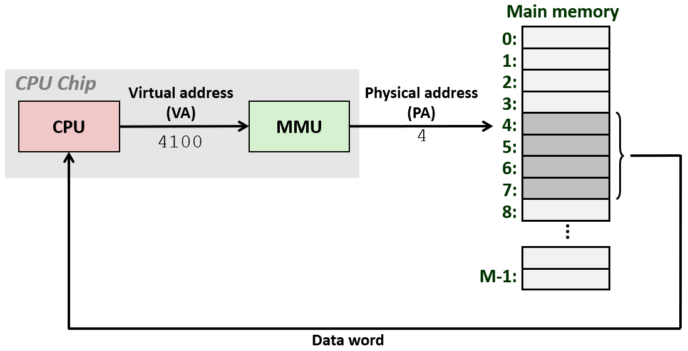

---

### 虚拟化

> 实际上, 这是非常简单的微控制器工作的方式, 但这**并不是大多数系统的工作方式**, 包括手机, 台式机和服务器
> 
> 这些系统虚拟化这个主存储器, 现在, **虚拟化的概念在计算机科学中是非常重要的**, 它扩展了很多, 应用于计算机系统的很多领域

当虚拟化资源时, 会向该资源的用户显示该资源的一些不同类型的视图, 这些视图通常是呈现某种抽象或某种不同的资源视图

可以通过介入对该资源的访问过程来实现这一点: 当有一些资源, 并且想要虚拟化它时, 通过干预或介入对该资源的访问过程来实现这一点

相同的技术可以用来虚拟化资源, 一旦拦截了访问的过程, 就可以用任何想要的方式处理它: 这样就有很多方法改变那个资源对用户的视图

### 磁盘虚拟化

看待磁盘的方式就是一个很好的理解虚拟化的例子: 磁盘**在物理上**由**柱面、磁道、扇区、盘面**组成, 访问这些磁盘上的一个特定扇区时, 必须指定柱面、磁道和盘面

但磁盘控制器显示的视图实际上不是这样的, 它是磁盘的虚拟化视图: 
- 磁盘控制器则将磁盘抽象成一系列逻辑块的形式提供给内核
- 它通过拦截来自内核的读写请求来呈现该视图
- 并将内核发送的逻辑块号转换为实际的物理地址

---

### 虚拟寻址

对于内存资源, CPU发出的每个虚拟地址都由芯片内部的被称作 **内存管理单元(MMU)** 的硬件**负责翻译成物理地址**

当 `CPU` 执行一条指令时, 比如移动指令, 会产生一个虚拟地址, 接着 `CPU` 将该虚拟地址发送给 MMU。

在下图中 MMU 将虚拟地址 4100 转换为物理地址 4, 这个物理地址 4 对应于实际想要的数据对象的地址。

在 MMU 将虚拟地址转换为物理地址之后, 内存会将返回存储在该地址中的字

---

### 地址空间

地址空间是一个地址的集合, 不是数据字节的集合, 而是字节的地址的集合:

- 线性地址空间是连续的非负整数集合, 只有 `0,1,2,3,4` 等等
- 虚拟地址空间是包含 `N = 2^n` 个虚拟地址的集合, 是线性地址空间
- 物理地址空间是包含 `M = 2^m` 个物理地址的集合

|线性地址空间|虚拟地址空间|物理地址空间|
|-|-|-|
|连续非负整数地址的有序集|一组 N = 2n 的虚拟地址|一组 M = 2m 的物理地址|
|{0, 1, 2, 3... }|{0, 1, 2, 3, …, N-1}|{0, 1, 2, 3, …, M-1}|

**对于运行中的所有进程, 每个进程都认为自己独占了整个地址空间**, 虚拟地址空间是相同的

虚拟地址空间通常比物理地址空间大得多, 物理地址空间对应于系统中实际拥有的 DRAM 容量。

---

### 伟大的思想

**虚拟内存**用于所有现代服务器、笔记本电脑和智能手机。计算机科学的伟大思想之一。

- 作为**缓存工具**, 有效使用内存: 利用高速缓存, DRAM, 磁盘形成缓存层次
- 作为**内存管理工具**, 简化内存管理: 每个进程都有相同的地址空间
- 作为**内存保护工具**, 隔离地址空间: 进程之间不能干扰双方的内存、用户程序无法访问特权内核信息和代码、防止修改只读的代码段

---

## 缓存工具

### 虚拟页面

写入磁盘的每一个文件(.exe、.txt、jpg) 会连同**文件本身的数据**和**文件加载时的虚拟内存布局**一起写入

概念上可以将**虚拟内存数据**视为存储在磁盘上的 N 个连续字节数组, 储存在磁盘上的数组被分解成页面

操作系统利用虚拟内存机制，将程序虚拟内存数据(页面) 按需缓存到DRAM中, 所以 DRAM 是这些连续字节数组的缓存

页面类似于缓存中的块, 但通常比的缓存块大得多, 通常是 4096 个字节而不是 64 字节

因此虚拟内存可以看作存储在磁盘上的一系列页面, 这就是所谓的**虚拟页面**。

这些页面中的每一个都将标识一个数字, 比如图中的虚拟页面 0, 虚拟页面 1

像块一样, 一部分页面存储在物理 DRAM 存储器中, 并且**会有一些映射**表示哪些页面已被缓存

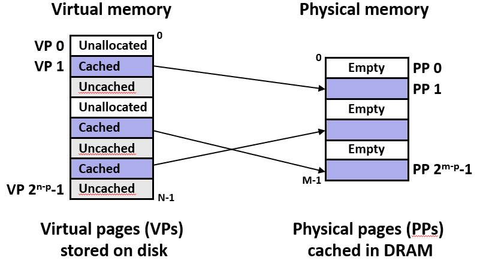

如上图所示, 在 DRAM 中的某个地方缓存了三个虚拟页面, 虚拟页号与它映射到的物理页号之间没有关系

未缓存(Uncached)的页面只存储在磁盘上, 没有分配(Unallocated)的页面既不存在于磁盘, 也不存在于内存中

如果操作系统为每个可能的虚拟地址都在磁盘上预留空间，那再大的硬盘也会瞬间被填满, 未分配意味着"不存在"，自然不需要占用任何存储资源。

虚拟内存的核心思想之一是"惰性"或"按需"分配。只有当程序真正需要一块内存时，操作系统才会在物理内存和磁盘上(如果需要换出的话)真正地为其创建实体。

---

### 选用全相联

在未命中缓存时就要从磁盘中获取数据项, 但 DRAM 大约比 SRAM 慢 10 倍, Disk 比 DRAM 慢约 10,000 倍, 会消耗很多时间。

**增加缓存的关联性就可以减少冲突未命中的可能性, 但块的大小需要权衡**: 既要从磁盘中获取数据块的代价分摊下来小, 又不要让数据块过多占用稀缺的缓存空间

**但除非缓存是全相联的, 否则永远不会完全消除冲突未命中的可能性**: 于是虚拟内存在 DRAM 中的缓存是全相联的, 只有一个组, 任何 VP 都可以放置在任何 PP 中

---

### 选用页表

如果每个虚拟页面可能被缓存到缓存中的任何位置, 就 **无法通过简单的取模运算** 获知 VP 在哪个 PP 里

尽管 CPU 缓存有专用比较器, 可以使用硬件并行搜索查找全相联。但虚拟内存**没有并行搜索电路**。如果让软件去遍历搜索，代价高到无法接受

所以选择**用一个专门的页表来记住**所有这些被缓存的块在这个巨大的"全相联组"中的具体位置

---

### 选用写回

当尝试选出牺牲页时, 如果选错并且驱逐了一个即将用到的页面，CPU就会触发缺页异常，然后去读磁盘。

一次磁盘I/O的时间是几毫秒级别(相当于几百万个CPU时钟周期), 但操作系统执行一段复杂的C代码来计算踢哪个页面，可能只花几微秒

选出一个牺牲块所需的时间远小于**由于缓存未命中而去访问磁盘来获取块**的代价, 因此虚拟内存缓存具有比 LRU 更复杂的替换算法

> 这些复杂的替换算法超出了本课程的范围, 你会在操作系统课上学到这些算法

因此操作系统选择把多次写操作合并成一次磁盘写，减少磁盘访问次数: **也就是虚拟内存系统总是使用写回策略, 尽可能地将写回磁盘的操作推迟**:

- 直写(WT，Write-Through)：只要CPU一写内存，立刻也写到磁盘。这会让程序慢如蜗牛(每次写都要等磁盘)。

- 写回(WB，Write-Back)：CPU只写DRAM里的缓存页，在页表里标记为"脏页"。直到这个页要被踢出内存时，才真正写到磁盘。

---

### 页表

跟踪复杂的缓存和 DRAM, 记录虚拟页面位置**的数据结构**称为页表。页表由内核维护并**位于内存当中**, 是每个进程上下文的一部分

每个进程都有自己的页表, 由一系列将虚拟页映射到物理页的页表条目数组 (PTEs) 组成。

其中 PTE k 保存的是 DRAM 中物理页面 k 位的高位地址, 也就是物理页号(PPN)

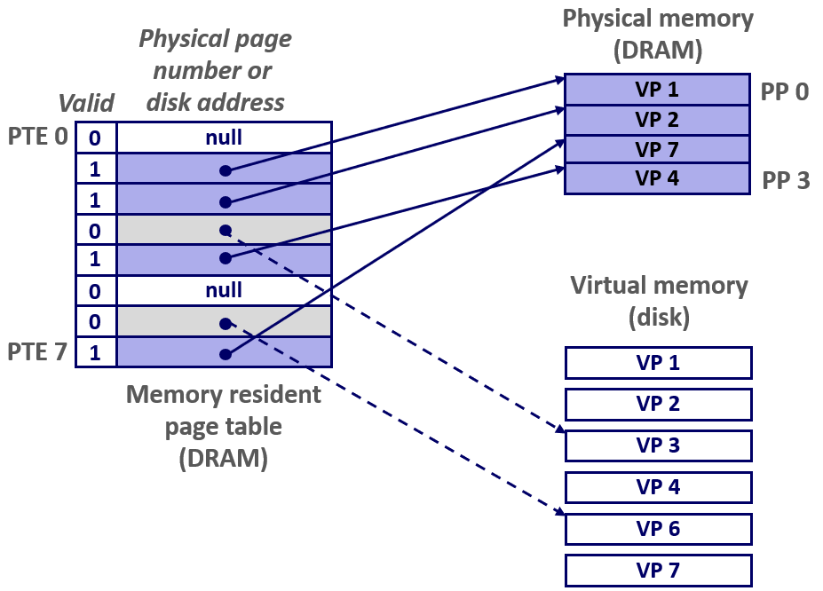

图中右下是存储在磁盘上的虚拟页面, 图中右上是物理的, 物理中的 VP 是存储在 DRAM 中的不同物理页面中的虚拟页面

页表记录这些虚拟页存储的位置: 在上例中, 这个 PTE 1 对应虚拟页面 1, 这里表示虚拟页面 1 被映射到物理页面 0, 虚拟页面 2 被映射到物理页面 1, 依此类推

有些已分配但是不在内存中的页面, 存储在磁盘上, 对于这些页面, 页表条目包含指向该页面在磁盘上的位置的指针, 将其视为逻辑块编号, 可在磁盘上找到该页面

然后还有一些页面是未分配的, 因此这个页表中有一个空条目

---

### 页命中

缓存会有命中和未命中: **对虚拟地址空间中字的引用**在页表中存在(在物理内存中)称为页命中, 这个字包含在缓存在 DRAM 中的页面中

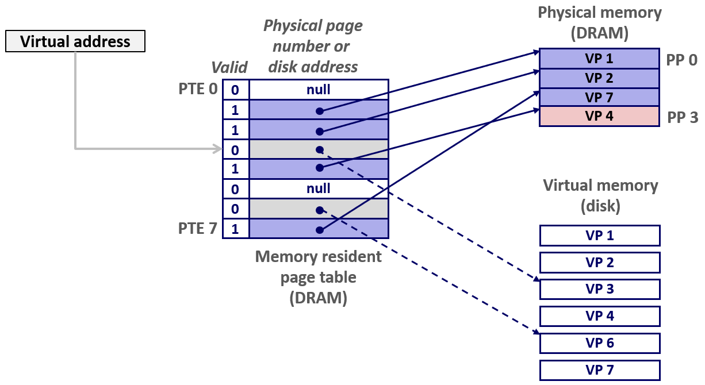

已知 CPU 在执行指令时会生成一个虚拟地址, 接着 MMU 会在页表中查找: 假设此虚拟地址位于虚拟页面 2 中的某个位置, 那么 MMU 就去查找第 2 个页表条目

然后 MMU 会得到虚拟页面 2 的物理地址。在这种情况下, 页面在内存中, 它被缓存在内存中, 所以这是一次命中, 现在内存可以将该物理地址返回给 MMU

---

### 缺页

对虚拟内存中字的引用不在物理内存中, 也就是不在页表上, 说明没有缓存在 DRAM 中

在上面例子中: 虚拟页面 3 没有缓存在 DRAM 中, 它存储在磁盘上

#### 缺页处理

页不命中会导致硬件触发异常: 这使得控制权转移给内核中称为缺页处理程序的代码, 这段代码选择要驱逐的牺牲页, 在这个例子里牺牲是虚拟页面 4

然后内核从磁盘中获取虚拟页面 3 将其加载到内存中然后更新此页表条目, 以反映虚拟页面 4 现在存储在磁盘上的事实

如果虚拟页面 4 曾经被修改过, 那么必须将修改的内容写入磁盘

一旦处理程序将虚拟页面 3 复制到内存中, 就可以重新执行导致缺页的指令: **内核中的缺页处理程序会返回到原来产生错误的指令, 然后重新执行该指令**

现在当 MMU 查找到 PTE3 对应的页面时, 会发现它确实缓存在物理内存当中, 所以现在指令可以继续, 无论 DRAM 中的那个虚拟地址里保存的是什么字

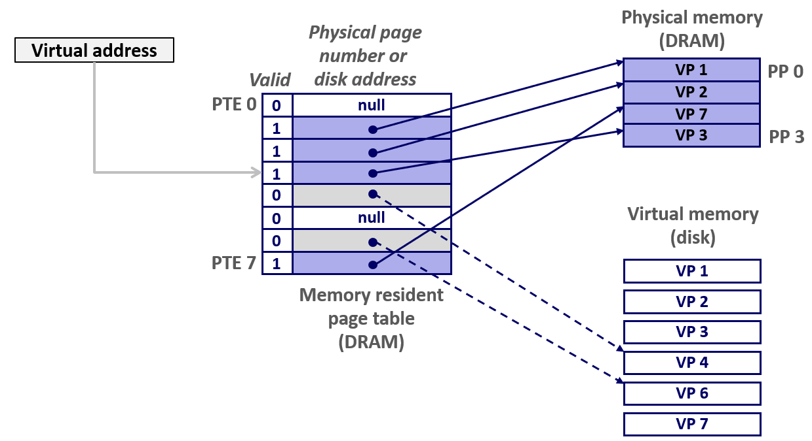

---

### 页分配

假如调用了 malloc 函数分配一大块虚拟地址空间, 其中一个页面尚未分配, 那么内核或者 malloc 函数必须通过调用一个名为 sbrk 的函数来分配该内存

函数 sbrk 是一个 Unix/Linux 系统调用, 用于来请求增加堆空间: 函数 sbrk 在虚拟地址空间中划出块新区域, 在页表中创建条目, 记录"这个虚拟页面存在了"

调用 sbrk 时, 物理内存(DRAM)里没有任何变化, 没有实际的物理页被分配: 所做的只是分配空间、更改此页表条目

当程序第一次读/写这个新分配的页面时, CPU 去查页表发现"这个虚拟页面存在，但不在物理内存", 触发缺页异常

操作系统这时才真正分配一个物理页框, 把数据放进去, 更新页表，标记为"已缓存"

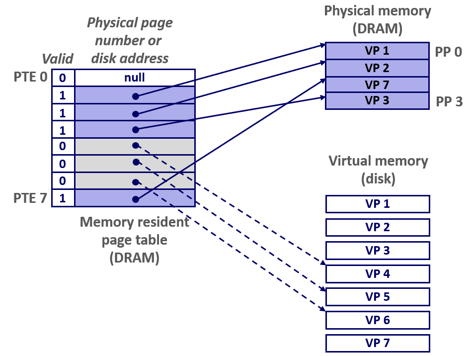

---

### 局部性

> 我不知道你们是怎么想的, 但在我第一次知道这个机制时, 我非常震惊, 它似乎是最低效的糟糕的想法
> 
> 对于使用内存的每一条指令, 你怎么能负担得起, 把它们来回复制并查找页表的代价, **这似乎是一个糟糕的主意, 但是局部性再次拯救了我们**

虚拟内存的效率似乎非常低, 但它的工作原理是局部性的: 由于时间局部性和空间局部性原理, 往往会重复使用相同的东西或者使用附近的东西

在任何时候程序都倾向于只访问一组称为**工作集**的活动虚拟页, 时间局部性较好的程序将具有较小的工作集

如果 (工作集大小 < 主存大小) : 内存可以存放下工作集中的所有页面, 对于一个进程来说，强制未命中后的性能良好

但系统运行多个进程, 出现(总和(工作集大小) > 主存大小), 进程就会互相颠簸, 页将不断换进换出, 导致页面来回复制

> 当我们学习地址转换时, 我们将学到一个称为翻译后备缓冲器的小硬件缓存, 这进一步利用了程序的局部性

---

## 内存管理工具

### 简化内存分配

每个进程都拥有一个独立的虚拟地址空间, 它可以**将内存视为简单的线性数组**: **映射函数通过物理内存分散地址, 精心选择的映射可以提高局部性**

虚拟内存极大地简化了内核对于内存管理的各个方面, **每个进程都有自己专属的虚拟地址空间**: 内核通过**为每个进程提供自己独立的页表**来实现这一点

在进程的上下文中, 页表是内核中的数据结构, 是内核为进程所维护的, **每个进程的页表都映射该进程的虚拟地址空间**

**在虚拟地址空间中这些连续的页面, 可以映射到 DRAM 中的物理地址空间的任何位置, 它们可以分散在各处**

不同的虚拟页面和不同的进程可以映射到不同的物理页面: 如图, 进程 1 的虚拟页面 1 映射到物理页面 2, 但在进程 2 中, 虚拟页面 1 被映射到物理页面 8

程序员可以认为每个进程都有一个相似的虚拟地址空间: **有相同大小的地址空间, 代码和数据分别从同一个地址开始, 但其实进程使用的页面实际上可能会分散在内存中**

> 如果我们没有这个机制, 请考虑如何跟踪在这个机器上你如何能跟踪这些进程使用的所有数据的位置

在过去虚拟内存产生之前: 只为每个进程提供物理地址空间的一部分, 只将物理地址空间分区, 然后每个进程都只能在属于它的那一部分地址空间中加载和运行

如果要添加一个进程 D, 但 D 启动前, 进程A、B、C各占一块已经将预留区用完了。就算有预留, 预留太小也无法加载大程序

但如果让每个进程都得到一些小块，还会保留一些地址空间，以防新的进程需要内存: 预留的空间闲着不用，别的进程也用不了

不能提前链接程序, 因为程序必须知道自己真正要加载到物理内存的哪个位置, 它必须在加载时重定位

> 一个进程, 你不知道它会加载到内存的什么位置, 只知道它会使用内存的某些块

程序编译时不能确定最终地址, 加载进内存时加载器要扫描整个程序代码, 把所有涉及地址的指令，都加上一个"基地址"(程序实际加载的位置)

> 所以你必须要重定位所有的引用, 在实际加载时, 重定位对全局符号的引用

另一个方案就是程序里不许用绝对地址, 所有地址都写成"相对于程序开头偏移多少": 这大大限制了编程灵活性

> 或者你必须创建一个所有指令都使用相对地址的系统, 没有绝对地址, 所有地址都表示成相对于程序的开头而言的偏移

每个虚拟页面都可以映射到任何物理页面: **甚至在不同时刻, 相同的虚拟页面也可以存储在不同的物理页面中**

一个页面, 有一段时间可能会缓存在一个物理页面中, 然后它被替换出, 并在下次引用时, 如果它没有被映射, 那么它可以重新被缓存到不同的物理页面中

### 在进程共享代码和数据

还可以将多个虚拟页面映射到同一物理页面, **让不同进程中的页表条目指向相同的物理页面**: 多个进程可以共享某些代码或数据的非常简单直接的方式

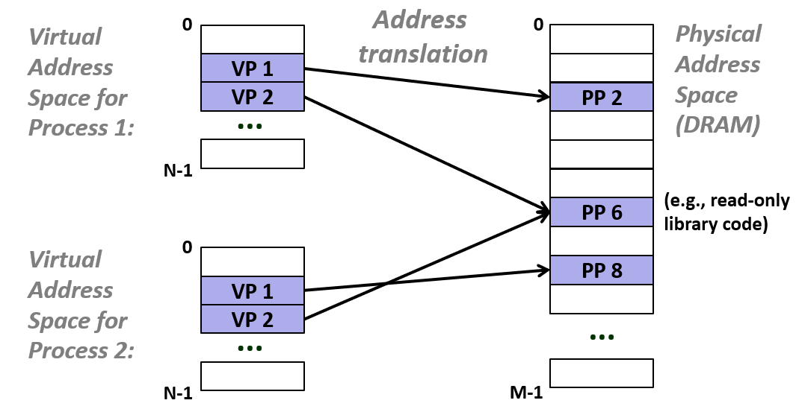

上图中虚拟页面 2 指向物理页面 6, 在进程 1 和进程 2 的页表中, 都是这样映射的, 这就是共享库的实现方式

所以 lib.c 对于系统上运行的每个进程来说都是相同的代码, lib.c 只需要加载到物理内存中一次

想要访问 lib.c 中的函数和数据的进程只需要映射, 让虚拟地址空间中的页面指向实际加载 lib.c 的物理页面

> 好的, 现在系统中只有一个 lib.c 的副本, 但每个过程都可以认为它有自己的副本

---

### 简化链接和加载

链接器假设每个程序都将加载到完全相同的位置: 所以链接器能提前知道这些东西将要加载到哪里, 然后它可以相应地重定位所有这些引用: 
- 每个程序都有相似的虚拟地址空间
- 代码、数据和堆总是从相同的地址开始

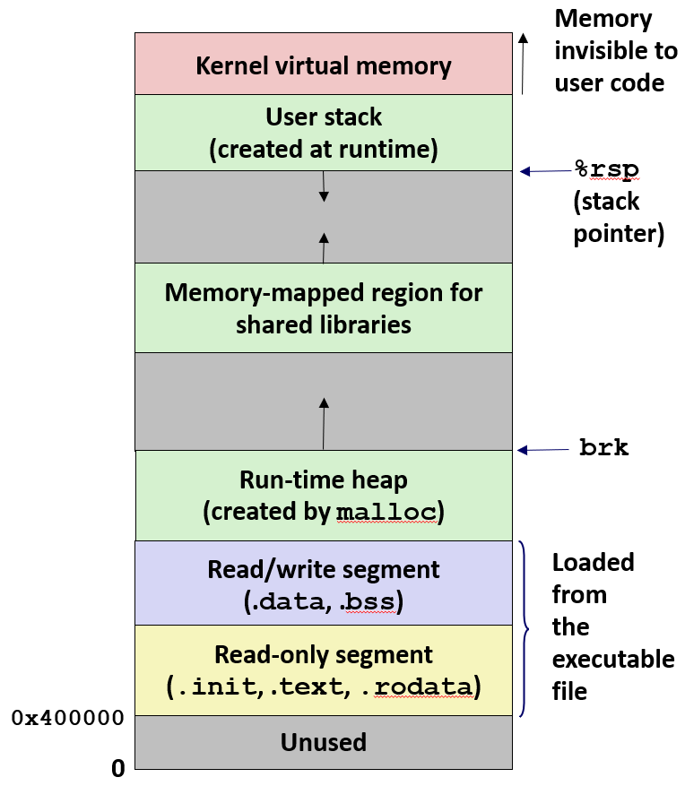

加载程序, execve 会查看 elf 可执行二进制文件: 它知道该二进制文件中的代码和数据段有多大, 它从固定的地址开始为 .text 和 .data 部分分配虚拟内存页

**加载器 execve 为代码和数据段创建 PTE, 并把每一个 PTE 都标记为无效的** 虚拟内存系统根据需要逐页复制 .text 和 .data 部分

虽然每个已分配的虚拟页面在页表中都有一个对应的页表条目，但这个条目的物理页号字段此时可能并没有指向实际的物理内存

操作系统通过将有效位设为0，表示这个页面虽然在虚拟地址空间中存在，但目前并不在物理内存中

- 节省物理内存：程序分配了 1GB 虚拟内存，但只用 100MB，物理内存只给那 100MB
- 按需加载：第一次访问时，有效位=0 触发缺页异常，操作系统才从磁盘加载
- 支持换出：内存紧张时，把不常用的页有效位设0，内容存磁盘，物理页给别人用

当 MMU 遇到有效位为 0 的 PTE 时触发缺页异常, 看起来好像该页面尚未初始化, 然后触发内核的缺页处理程序, 然后内核可以将该页面复制到物理内存中

程序和数据实际上并不是没有加载, 它们不是简单地复制到内存, 只有在缺页时才会复制它们, 也就是说在未命中时复制

只有第一次访问页面中的字节时才会复制这个页面, 这叫做按需分页

> 所以加载实际上是一个非常高效的机制, 因为你可能有一个程序, 其中包含一个巨大的数组, 但是你只是访问该数组的一部分
> 
> 因此, 实际上不会给整个数组都分配页面, 这些页面只有在其中某个字被访问时才会加载到 DRAM 中

---

## 内存保护工具

虚拟地址空间的有些部分是只读的, 比如代码段, 地址空间中有些部分只能由内核执行

在像 x86-64 这样的 64 位系统上, 尽管指针和地址是 64 位的, 但真正的虚拟地址空间是 48(2^48) 位的

48 位之后的高位比特全部为 0 或全部为 1: 高位都是 1 的地址是为内核代码和内核数据保留, 高位都为 0 的地址是为用户代码保留的

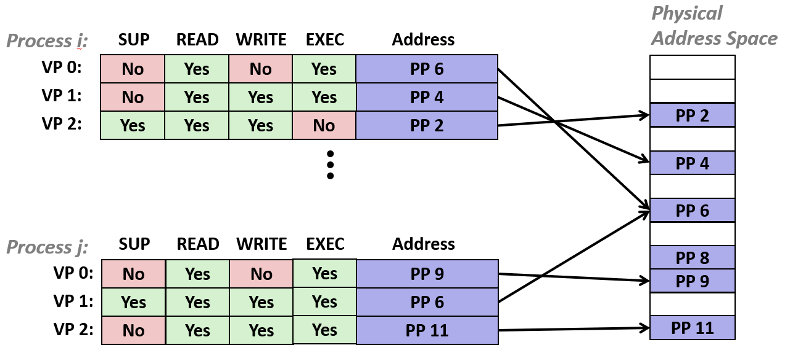

因此可以在 PTE 中设置一些位, 表明用户代码是否可以访问某些虚拟页面, 或者它们是否必须由内核访问, 这就是所谓的管理员模式

可以设置一些位, 表示该页面是否可以读、写或执行: 这个执行位是 x86-64 的新功能, 它在 32 位 x86 系统中不存在

> 这是现在用来防止类似 AttackLab 中代码注入攻击的技术, 因为它使这种攻击变得不可能

如果此位设为 0, 则无法从该页面中的任何字节加载指令

> 事实上, 正因为引入了这个执行位, 才会催生出像 AttackLab 中那样的利用 ret 指令引导的攻击

通过向 PTE 添加位的简单技术, 保护虚拟地址空间的不同部分免受未经授权的访问: MMU 在每次访问时检查这些位, 如果相应的权限位是 0, 就抛出异常由内核处理

---

## 地址翻译

### 概念

下面假设有 N 个元素的虚拟地址, M 个元素物理地址和一个将 V 映射为 "P|空"
- 如果能映射到, 那么虚拟地址 a 处的数据在 P 中的物理地址 a’
- 如果映射为空, 如果虚拟地址 a 处的数据不在物理内存中, 无效或存储在磁盘上

> 通常 N 比 M 大, 但也不是必须这样。M 也有可能比 N 大得多, 虽然通常不是这样, 但也不是不可能

---

给定一个由 n 位组成虚拟地址, 其中低 p 位为页面偏移(VPO), 高 n-p 位为虚拟页号(VPN)

与缓存的直接映射或全相联缓存类似, 根据 Tag 和 Index 找数据: 在虚拟内存中，MMU 根据虚拟页号 (VPN) 去页表中查找物理页号 (PPN)
- 低 p 位(偏移) = 缓存中的块偏移(Block Offset)：**决定在页面/块内的具体位置**
- 高 n-p 位(虚拟页号) = 缓存中的标签(Tag)：**用于唯一标识一个页面/块**

而且这种任意虚拟页可以放到任意物理页的映射关系, 没有固定位置的限制，灵活度上很像全相联缓存

页表基址寄存器 (PTBR): 用于指向 **当前运行程序的页表** 所在的物理起始位置: 英特尔的具体硬件名字叫 `CR3`(控制寄存器 3)

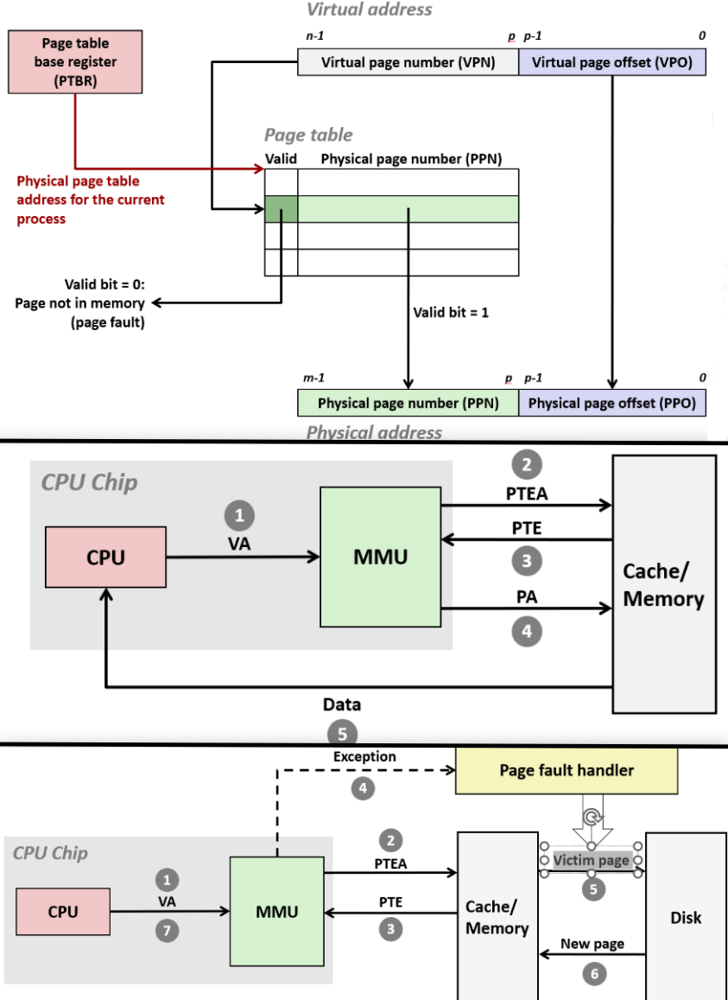

页表 (Page Table): 每一行页表条目保存的是 DRAM 中物理页面 k 位的高位地址, 也就是物理页号 (PPN), 而有效位代表是否映射到内存中

物理地址的物理页面偏移部分来自虚拟页面偏移: **虚拟块中的偏移量将与物理块中的偏移量相同, 大小相同**

当 CPU 传递一个虚拟地址给 MMU, MMU 得到虚拟页号并将其作为页表的索引, 根据索引标识一个页表条目

根据条目中的**有效位和记录的物理页号**, 以及来自虚拟地址的**页面偏移**得到相应的物理地址

- 处理器 CPU 会在执行指令时向 MMU 发送虚拟地址(VA), 可能是移动指令, 或者是调用、返回或其他任何类型的控制转移
- 接着 MMU 根据虚拟地址的 VPN 也就是PTEA, 向 **高速缓存|内存** 获取 PTE
- 然后 MMU 根据 PTE 生成物理地址(PA)发送给**高速缓存|内存**, 内存最后直接把数据返回给CPU, 而不经过MMU

---

### 页未命中

前面 CPU 同样将虚拟地址发送到 MMU, MMU 从内存获取 PTE, 但当 MMU 看 PTE 时发现有效位是 0, 这表明数据存储在磁盘上

因此 MMU 会触发 **缺页异常(Exception)**, 将控制转移到**缺页处理程序(Page fault handler)**

处理程序选出一个 **牺牲页(Victim page)**, 如果牺牲页已被修改, 则将其复制到磁盘

然后将新页面从磁盘提取到内存中, 通过缓存层次结构。然后处理程序返回到进程

当故障的处理程序返回后, 出现故障的移动指令会重新执行, 但这次是页命中

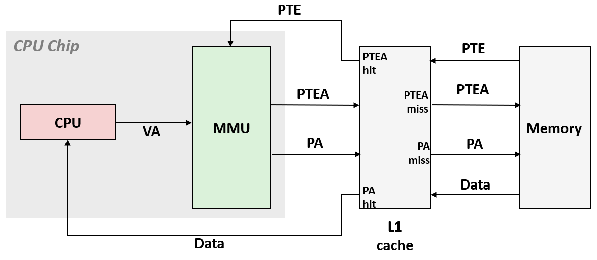

MMU 发送提取页表条目的请求, 将页表地址传给缓存时, 如果缓存不命中, 那就要去内存查找

内存将这些页表条目返回到缓存, 然后传给 MMU, 最后 MMU 构造该物理地址, 然后**再将**该物理地址传递给缓存

使用该物理地址去缓存里查找数据, 紧接着进行数据命中和不命中的操作

---

### 其他索引

> 刚才我们讲的是用物理地址去查缓存，但硬件设计师还有另一种方案：在MMU进行地址翻译之前，直接用虚拟地址(VA)去查缓存。
>
> 这就是所谓的VIVT(Virtually Indexed, Virtually Tagged，虚拟索引虚拟标签) 缓存。

这种方案虽然省去了MMU翻译的时间，但会发生 `Aliasing`: 多个不同的虚拟地址可能映射到同一个物理地址(比如共享库)，缓存里就会存多份一样的数据，导致数据不一致。

所以现代复杂CPU往往采用VIPT(Virtually Indexed, Physically Tagged，虚拟索引物理标签) 等折中方案

缓存通常用物理地址索引，但也有虚拟地址缓存的变体

**关于页面如何与磁盘交互(交换区、文件映射)、缺页中断处理，详见[18-Virtual_Memory_Systems](./18-Virtual_Memory_Systems)**

---

### TLB

页表条目 (PTEs) 缓存在 L1 中: 不仅缓存不命中, PTE 会被其它数据引用逐出, 而且就算命中 PTE, 也仍然需要小的 L1 延迟

所以 MMU 通过缓存 `PTE` 来加速这个翻译过程: PTE 缓存在 MMU 内的一个硬件缓存中, 称为转换后备缓冲区或 TLB

TLB 缓存了最近使用的页表条目的缓存, 就像其他缓存一样

虚拟页号位(VPN) 是 虚拟地址(VA) 中用来查找 虚拟页面(VP) 的唯一标识, 因此TLB 使用虚拟地址的 VPN 部分来访问它

其中 VPN 有一段组位数只取决于 TLB 具有多少组条目的索引位(TLBI), 用于**定位到TLB的某一组**

从 VPN 中取剩余位作为标记位TLBT, 用于区分不同的缓冲行, 确认**该组中哪个条目**是目标PTE

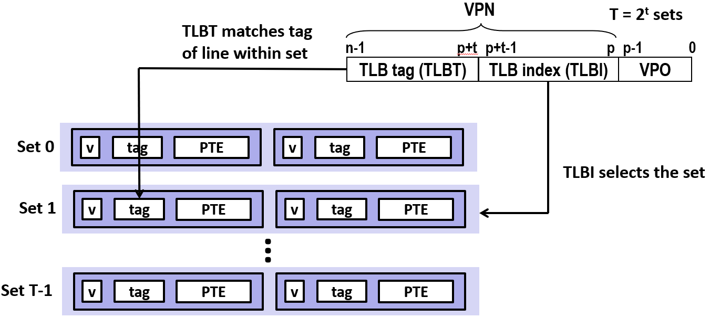

当 CPU 生成一个虚拟地址, 传递给 MMU, MMU 不会直接查看内存中的页表条目, 它首先询问 TLB 是否有这个页表条目, 它把 VPN 发送给 TLB

查询 TLB 是否缓存了这个虚拟页面的 PTE, 如果命中, 则返回可以让 MMU 构造物理地址的 PTE, 然后物理地址发送到缓存和内存系统, 最终数据被传回 CPU

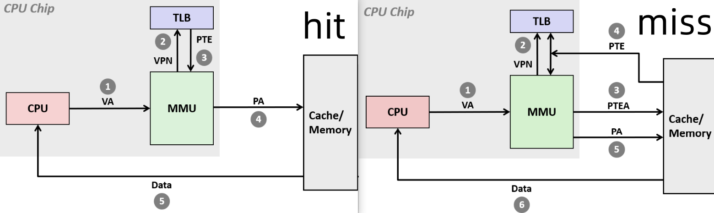

当 MMU 在 TLB 中查询 PTE 并且不命中时, 那么 MMU 必须像以前一样去内存找 PTE

内存将 PTE 返回到 MMU, 并将其存储在 TLB 中, 像以前一样, 如果没有空间的话, 就需要在 TLB 中选择牺牲的 PTE

如果选出的 PTE 已被修改, 则必须将其写回, 就像任何其他缓存一样, 最终, MMU 使用它来构建物理地址, 然后将数据发回 CPU

---

### 多级页表

假设每个虚拟页面(块)大小为 4KB。系统有 48 位地址空间, 相当于每个程序认为自己独占 2^48bit = 256TB 的空间。每条 PTE 大概为 8 字节

地址空间 2^48 个字节 / 每页(块) 2^12 个字节 = 需要的页表条目数

需要的页表条目数(PTEs) * 页表条目的大小为 8 个字节 = 2^39 字节 = 512GB

**这显然不是页表真正实现的方式, 所以真正的解决方式是多级页表**

假设有一个两级页表, 一级页表总是在内存中, 它常驻内存, 永远不会丢失, 然后一系列大小都相同的二级页表

一级页表的第 1 项指向第 1 个二级页表的起始地址, 一级页表的第 2 项指向第 2 个二级页表, 依此类推

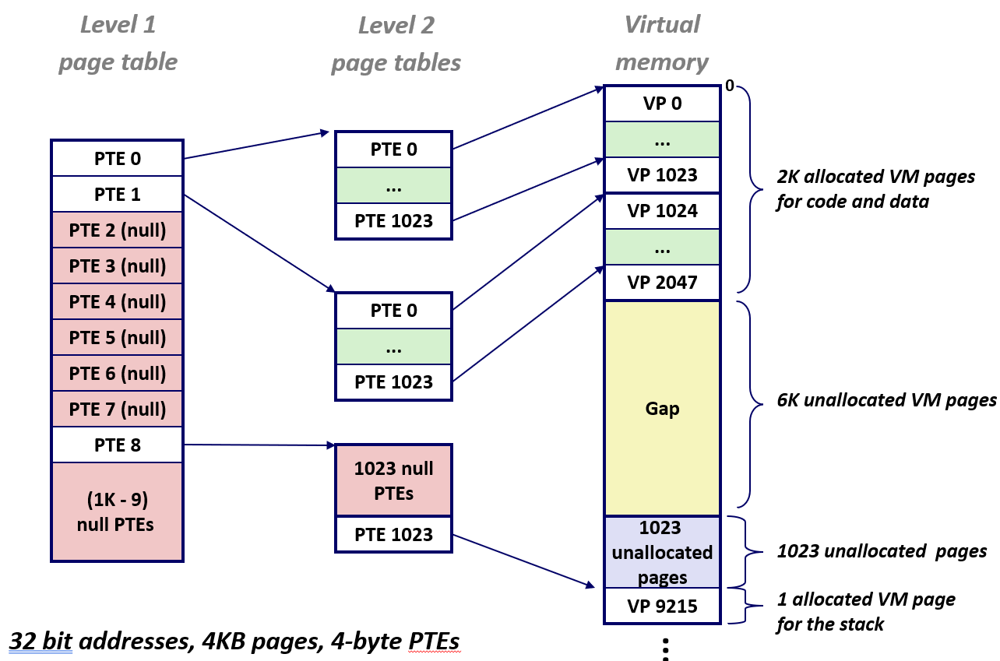

根据上图的内容, 已知这个进程的内存布局是下面这样的

|区域|虚拟页数量|实际使用情况|
|-|-|-|
|代码段 + 数据段(低地址)|2048 个页|全部在用(存放程序指令和全局变量)|
|中间大空洞(未分配)|6144 个页|全部未使用(没映射任何东西)|
|堆栈段(高地址)|1024 个页|只有最顶部的 1 个页在用(栈底)|

整个虚拟地址空间有 2048 + 6144 + 1024 = 9216 个虚拟页，但真正在用的只有 2048 + 1 = 2049 个页。大部分(6144 + 1023个页)都是空的

如果用单级页表，需要为每一个虚拟页建一个条目, 相当于 929216 个PTE

图中假设每个二级页表存储了 1024 个 PTE

- 代码+数据区(2048页)：需要 2048 / 1024 = 2 个二级页表。

- 中间这一整块完全没有使用，一级页表里对应的条目直接标为“无效”，不指向任何二级页表。所以0个。

- 栈区分配了 1024 页, 虽然只用了 1 页, 但不满1024页的这 1 页也需要 1 个二级页表来容纳

这样一来可以避免创建许多不必要的页表: 一个一级页表, 指向 3 个二级页表, 所以只用四个页表, 就已经覆盖了整个虚拟地址空间

--- 

有一个虚拟页面偏移量, 它由虚拟地址的低 p 位组成。剩下的位都是 VPN, 对于 k 级页表, VPN 被分解为 k 个相同的大小子 VPN

页表基址寄存器指向一级页表的偏移量。VPN1 中存储着要找的二级页表的偏移量; VPN2 中存储着要找的三级页表的偏移量

以此类推得到 VPNK-1 中存储着要找的 K 级页表的偏移量, 最后找到的第 k 级表里查找到对应对应的 PTE 并交给 MMU 形成物理地址的 PPN 部分

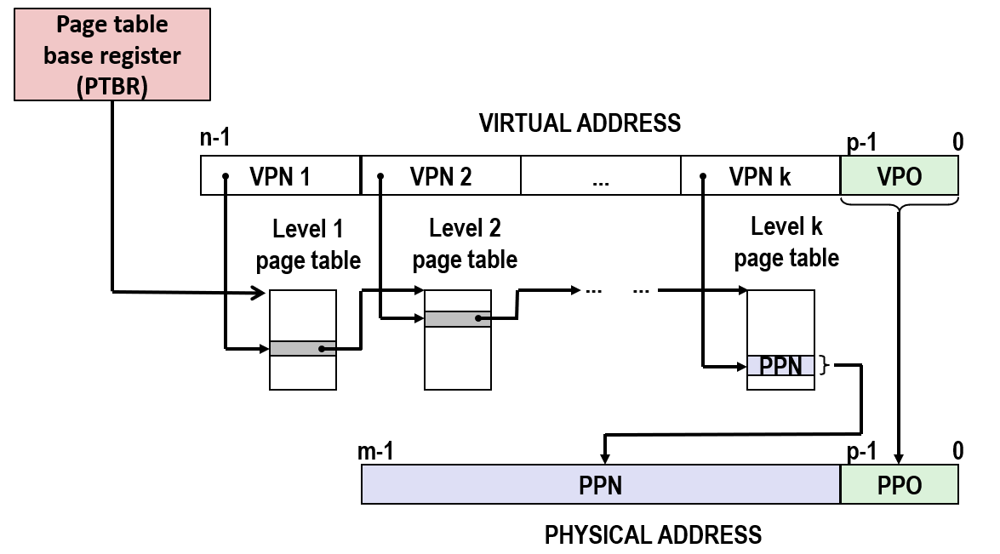

---

级数限制：x86-64使用4级页表，由硬件架构固定，MMU自动遍历。

节省内存的本质：不为未使用的虚拟地址区间分配二级页表(而非节省已有页表内的条目)。

剩余开销：即使一个二级页表里只有一个有效PTE(如栈)，也必须为整个二级页表(1024个PTE)分配空间，这是粒度带来的内部碎片。

性能权衡：TLB未命中时多级查表确实慢，但由于局部性，TLB命中率极高，硬件开销可接受；级数过多会增加TLB未命中代价，所以x86-64平衡后选4级。

分段已死：现代OS使用纯分页(线性地址空间)，分段是Intel早期的历史遗留，已被模式位屏蔽。