# Virtua Memory Systems

## 简单的内存系统示例


### TLB

页面大小是 64 字节, 所以页面偏移量需要 6 比特(64 = 2^6)

|VA|PA|虚拟页|VPO|PPO|VPN|PPN|
|-|-|-|-|-|-|-|
|14b|12b|64B|6b|6b|6b|8b|


TLB 缓存了最近使用的页表条目, 访问 TLB 时, 只需要虚拟页号就能查找到 PTE

示例的 TLB 有 16 个条目, 并且是 4 路组相连的，因此有 4 组, 所以使用 VPN 的低 2 位(2^2=4)作为组索引, VPN 剩下的高 6 位作为标记位

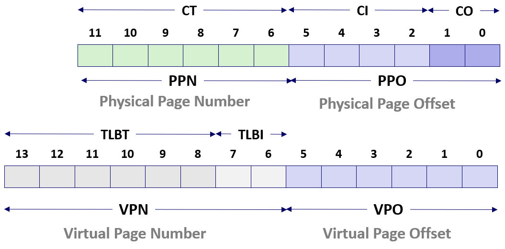

<div style="display: flex; gap: 20px; align-items: flex-start;">

Set|Tag|PPN|Valid
-|-|-|-
0|03|–|0
1|03|2D|1
2|02|–|0
3|07|–|0

Tag|PPN|Valid
-|-|-
09|0D|1
02|–|0
08|–|0
03|0D|1

Tag|PPN|Valid
-|-|-
00|–|0
04|–|0
06|–|0
0A|34|1

Tag|PPN|Valid
-|-|-
07|02|1
0A|–|0
03|–|0
02|–|0

</div>

真正的TLB内部不存储 set。而是 MMU 直接通过地址译码电路将TLBI(索引)转换为物理上的组选择信号，不需要读出组号再对比

---

### 页表 


下面假设这是页表的前 16 个条目, 实际共 256 个条目。

每个PTE包含一个物理页号(PPN)和一个有效位(Valid Bit), 如果有效位有效, 则表示那个虚拟页面对应的物理页面在内存中

和前面类似, 页表中不存储虚拟页号 (VPN), PTE 本身不需要记录自己是第几行

<div style="display: flex; gap: 20px; align-items: flex-start;">

|VPN|PPN|Valid|
|-|-|-|
|00|28|1|
|01|-|0|
|02|33|1|
|03|02|1|
|04|-|0|
|05|16|1|
|06|-|0|
|07|-|0|

|VPN|PPN|Valid|
|-|-|-|
|08|13|1|
|09|17|1|
|0A|09|1|
|0B|-|0|
|0C|-|0|
|0D|2D|1|
|0E|11|1|
|0F|0D|1|
</div>


---

### 缓存


缓存块的大小是 4 字节, 所以需要用 2b 用于表示偏移(CO); 缓存有 16 个组, 每组有1 行, 意味着我们需要 4b 表示索引(CI); 剩下的 6b 作为标记位(CT)

这里的缓存的标记位和物理页号一样只是一个巧合, 对于虚拟内存系统来说这不是必须的


<div style="display: flex; gap: 20px; align-items: flex-start;">

Idx|Tag|Valid|B0|B1|B2|B3
-|-|-|-|-|-|-
0|19|1|99|11|23|11
1|15|0|–|–|–|–
2|1B|1|00|02|04|08
3|36|0|–|–|–|–
4|32|1|43|6D|8F|09
5|0D|1|36|72|F0|1D
6|31|0|–|–|–|–
7|16|1|11|C2|DF|03

Idx|Tag|Valid|B0|B1|B2|B3
-|-|-|-|-|-|-
8|24|1|3A|00|51|89
9|2D|0|–|–|–|–
A|2D|1|93|15|DA|3B
B|0B|0|–|–|–|–
C|12|0|–|–|–|–
D|16|1|04|96|34|15
E|13|1|83|77|1B|D3
F|14|0|–|–|–|–

</div>

---

### 示例一

所以假设 CPU 执行了一条指令, 产生的虚拟地址是 0x3d4, 二进制展开: `0000 1111 0101 00`

首先去 TLB 查找 PTE, 因此需要索引TLBI和标记TLBT, 分别是 VPN 的低 2 位和高 6 位, 也就是0x3(0b11)和0x03(0b00 0011)

索引 TLBI = 3 表明 PTE 应该在 TLB(左上图) 的第 3 组。遍历第 3 组的条目, 发现第二个标记位为 3 并且有效位为 1, 在 TLB 中找到了 PTE 获知PPN = 0D

因为 TLB 中查找到了 PTE, 所以不再需要去页表(右图)查找 PTE, 也不需要读出 VPN

所以 MMU 返回的物理页号是 0x0D, 先前讨论过 VPO 永远等于 PPO 的, 所以直接拷贝 VPO 的值到 PPO 的位置, 合在一起构成了物理地址 0x354

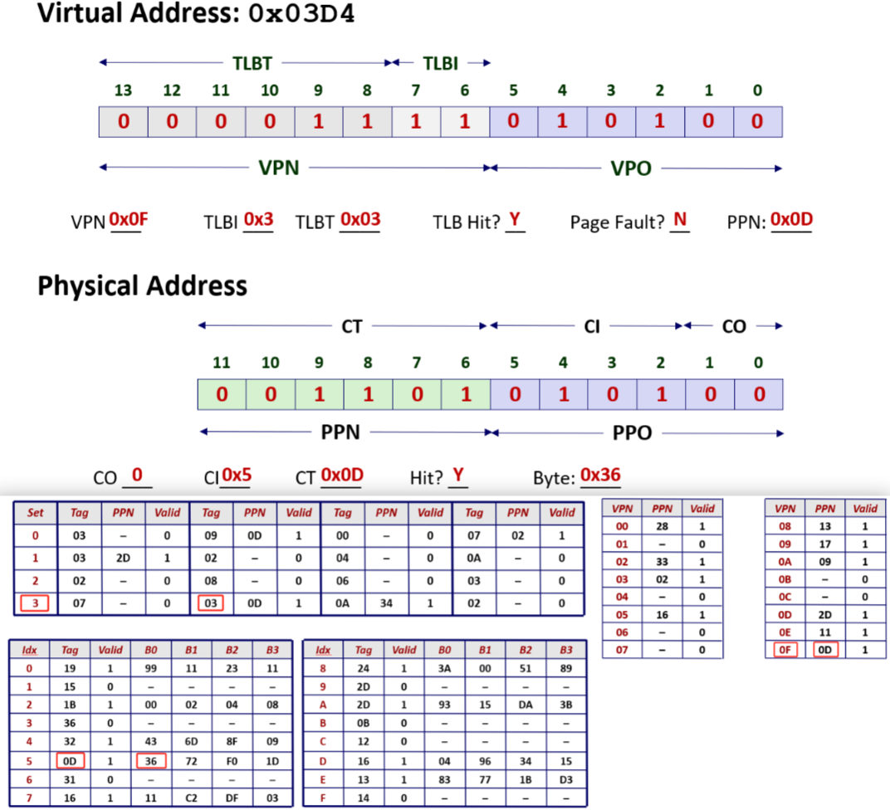

接着用 PA 去看 Cache 中有没有这个 PA 的缓存, 这需要标记CT、索引CI和偏移CO, 分别是PPN, PPO 的高 4 位和 PPO 的低 2 位, 也就是0x0D、0x5和0

索引 CI = 5 表明缓存应该在 Cache(左下图) 的第 5 组。遍历第 3 组的条目, 发现第二个标记位为 3 并且有效位为 1, 在 TLB 中找到了 PTE 获知PPN = 0D

找标记位为 0xd 的匹配的项且有效位为 1, 这就是要在高速缓存中找的项。偏移量是 0, 所以去请求第五组偏移量为 0 的字节, 值为 0x36

缓存命中, 高速缓存把这个字节返回给 MMU, 然后 MMU 把它传递给处理器, 然后处理器可能把这个字节存储在一个寄存器里

---

### 示例二

所以假设 CPU 执行了一条指令, 产生的虚拟地址是 0x0020, 二进制展开: `0000 0000 1000 00`

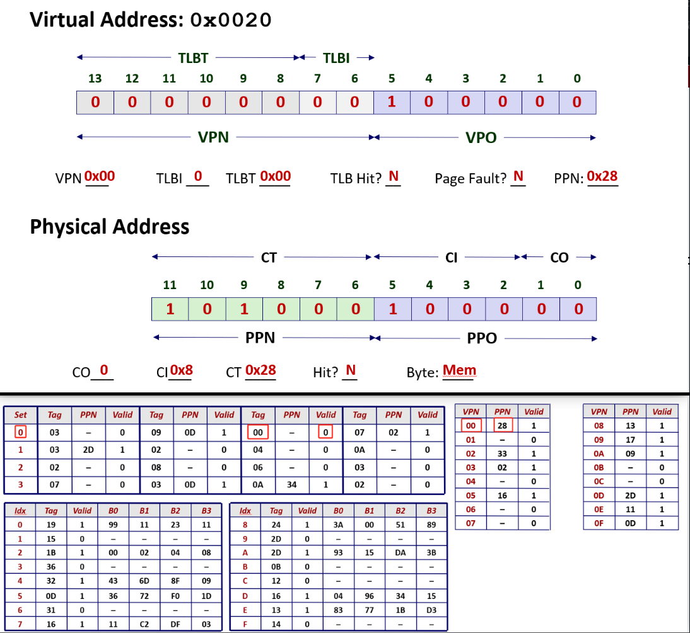

前面几步和上个例子完全一样, 解析 VP 得到 TLBT、TLBI 再检查 TLB 看是否有 PTE 的缓存

第一项是 0x03 不匹配, 第二项是 0x09 不匹配, 第三项是 0x00 匹配, 但是有效位为 0。查找缓存失败了, 这次 TLB 缓存不命中

查找缓存失败了, 只能放弃 TLB, 而去通过开销较大的内存访问, 去读取页表中对应的页表条目

寻找虚拟页号(VPN)为 0 的项, 检查对应的 PTE, 看虚拟页是否在内存中: 因为它的有效位为 1, 所以它在内存中

所以内存返回 PPN = 28 给 MMU, 然后 MMU 使用 PPN 和 VPO 去构造 PA, 把 PPN 和 VPO 连起来就是 PA

现在 MMU 用 PA 并请求高速缓存返回对应的 PA 上的一个字节。取出 CI = 0x8、CT = 0x28、CO = 00

所以去高速缓存的第 8 组查找标记为 24 的缓存, 本例中没有找到, 缓存不命中, 所以缓存不得不向内存传递那个物理地址去得到所需要的字节

---

## Core i7/Linux 内存系统


### 内存系统

> 这里举的例子是 Intel x86-64 下的 core i7, 它属于高端桌面系统 x86-64 家族, 它们和你在实验中使用的 shark 机器是相似的

下面是是 core i7 内存系统的结构图, 这是芯片的处理器封装 (Processor package)

看上去是一个单核, 实际上在这个处理器封装里面有 4 核, 每一核都是一个独立的 cpu, 可以独立的执行指令, 每一核都有寄存器文件, 一些用于取指令的硬件

有两个 L1 缓存, 用于缓存数据称为 d-cache, 另一个是指令缓存称为 i-cache, 两个大小都是 32k 字节, 并且都是 8 路组相连的

> 可以看出, 它们都很小, 但是它们的集成度很高

在缓存的层次结构中下一级是 L2, 它被称为统一缓存, 因为它可以缓存指令和数据, 它的大小比 L1 大一点, 256k 字节, 也是 8 路组相连的

缓存 L1 和 L2 都是位于芯片内部的。在芯片的外面有 L3 缓存, 被所有核共享, 大小是 8M, 是 16 路组相连的

因为 L1 缓存最靠近 CPU, 所以最快, 访问时间大概是 4 个时钟周期。L2 的大小要大一点, 离处理器也要远一点, 所以访问 L2 大概需要 10 个时钟周期

缓存 L3 是在处理器外边的, 需要建立芯片外部到芯片内的连接, 所以 L3 的访问时间是 30 到 50 个时钟周期

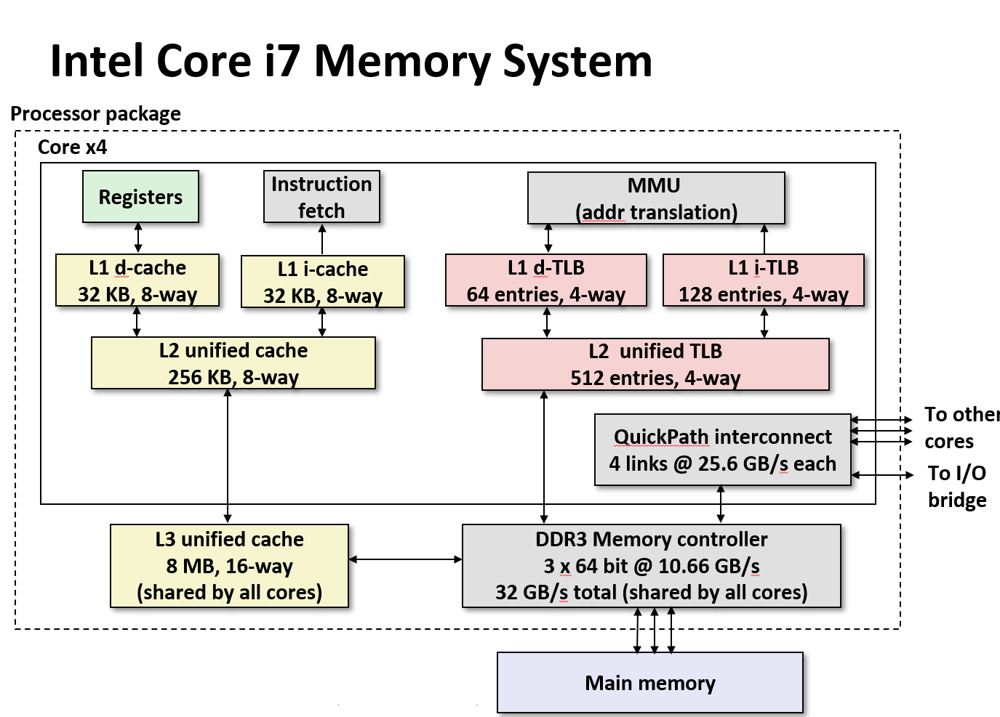


> 上次课我和一个学生课后交谈的时候, 我说错了, 我说系统的 TLB 没有层次结构, 但实际上是有的


这里有一个 L1 d-TLB 缓存, 有 64 个条目, 是 4 路组相连的, 所以 d-TLB 里面有 16 组。i-TLB 的更大

> 这是比较有意思的, 我猜, 这是一个有趣的设计, 我没有查过文献, 我只是说一说我的猜测
> 
> 指令 TLB 比较大的原因可能是对指令 TLB 缓存不命中的惩罚要比数据 TLB 缓存不命中大

内存控制器(Memory controller)从内存中提取数据, QuickPath interconnect负责连接到其他核心和 I/O 桥


**为什么要有二级缓存, 为什么不直接把L1缓存设计得更大**


> L1 缓存的大小并非可以随意增大，因为缓存中的索引位和偏移位的位数在硬件设计上是受限的。**后面我要说明原因**


如果把用于 L2 的资源全部分配给 L1(比如将 DTLB 和 ITLB 的大小翻倍)，系统运行时会遇到问题：

程序具有不确定性，指令工作集可能大于缓存(导致指令TLB容量不命中)，数据工作集也可能大于缓存(导致数据TLB容量不命中)，且无法预判哪种情况会发生。

保留 L2 的作用：当 L1 发生容量不命中时，L2 可以作为后备，大幅降低不命中的惩罚(Miss Penalty)。这就是设计二级缓存的核心思想。


---

### 地址翻译


在 Intel 系统中 CPU 产生一个 VP 长度为 48b, 虚拟页大小是 4kb, 所以 VPO 为 12b, VPN = 48 - 12 = 36b

前面提到 TLB 有 16 组, 因此将这 36b 的 VPN 拆分为低 4(2^4 = 16)b 的 TLBI 和高 32b 的 TLBT, 用于访问 TLB 查看是否存在缓存的 PTE

如果 TLB 缓存命中, MMU 就构造物理地址, 直接把 VPO 拷贝到 PPO 的位置, 然后连接上从 TLB 返回的 PPN

如果 TLB 缓存不命中, 系统就去页表, 使用前面说过的多级查表取出对应的 PPN, 从页表条目中取出 PPN 后和 PPO 连起来构成物理地址

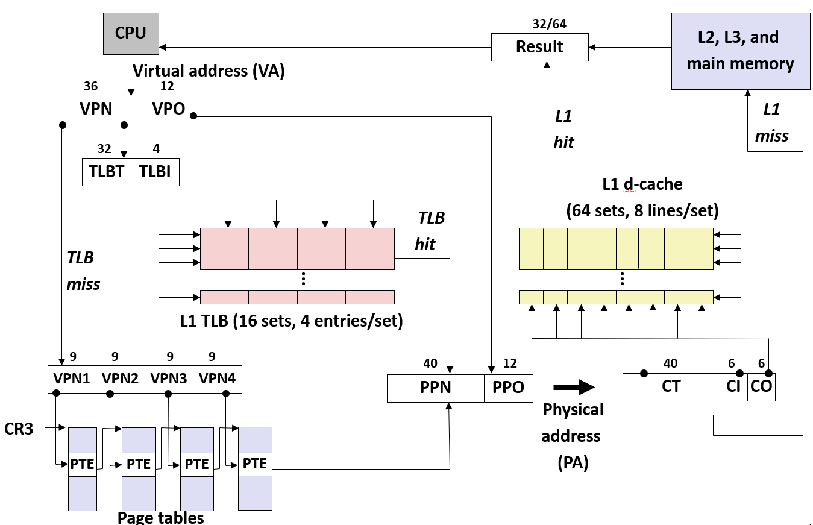


MMU 将物理地址传递给高速缓存, L1 数据缓存有 64 组, 所以要 6b(2^6=64) 的 CI。块大小通常是 64B, 所以块内偏移(CO)需要 6b

> 这里引出了我前面说的 L1 的缓存不能太大的原因, [注意缓存索引位和偏移位的长度](#Cute-Trick)


然后使用 PA 去 Cache 进行查找, 使用 CI 确定是哪一组, 使用 CT 看是否匹配, 如果缓存命中, 就返回对应的字给 CPU

如果缓存不命中, 就去 L2, L3 去取数据, 最后可能去内存中取数据, 如果出现了缺页的话, 最坏的情况应该是从磁盘中取数据


---

### 页表条目

第一级、第二级、和第三级的页表条目结构是相同的。页表条目指向的是下一级页表的地址, 第一级的 PTE 含有第二级的页表物理基地址, 后面的类似

- P: 是 present 的首字母, 标识子页表如果在物理内存中, 值为 1, 反之为 0。如果为 0, PTE剩下的就表示页表在磁盘上的位置

- R/W: 表示标识页表是只读的, 还是可读可写的, 这个标识对所有可达的页表都有效

- U/S: 指示是用户访问权限还是内核访问权限, 这就是内核保护它的数据和代码不受用户程序的破坏

- WT: 表示子页表使用直写还是写回缓存的策略

> 我所了解的所有系统都是使用的写回策略, 因为缓存不命中的, 惩罚太高了(感觉应该是直写的代价太大了) CD 这个标识不用掌握

- A: 引用位, 由 MMU 读和写时设置, 软件清除, 表示读写对应的页表

- PS: 表示页面的大小为 4KB 或 4MB

- XD, 标识能不能从这个 PTE 可访问的所有页中去指令和执行指令

> 这就是现代栈系统降低受到缓存区溢出攻击风险的一个方式


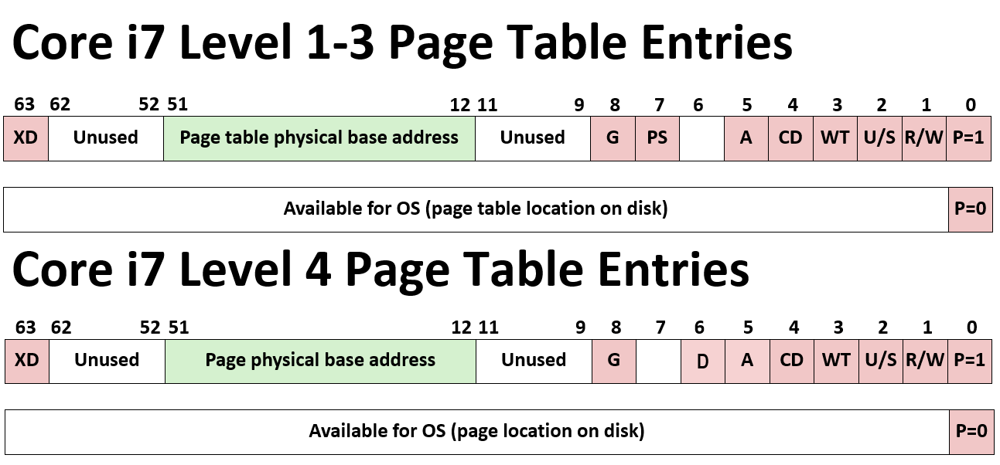

最后一级的页表条目的页表物理基地址不再指向另一个页表, 而是指令物理内存中某一页的基地址, 同样使用 40 比特表示


- P：如果为 1 表示子页表在物理内存中, 反之为 0
- R/W：对于子页，只读或者读写访问权限
- U/S: 对于子页，用户或超级用户(内核)模式访问权限
- WT：子页的直写或写回缓存策略
- A：引用位 (由 MMU 在读和写时设置，由软件清除) 
- D：修改位 (由 MMU 在读和写时设置，由软件清除)
- Page physical base address：物理页面地址的40个最高有效位 (强制页面对齐 4KB)
- XD：能/不能从这个子页中取指令

---

### 页表翻译

VPN 的 36 个比特划分为 4 组, 每组 9 比特, 表示在页表条目中的绝对偏移。在每个页表中都有 2^9 可能没有创建的页表条目

L1 PPT的首地址由内核记录并被存放在 CR3 寄存器中, 指向 L1 PT的基地址

VPN1 用来计算在 L1 PT 中的偏移, L1 的 PTE 含有 L2 PT 的起始位置。VPN2 用于计算在 L2 PT 中的偏移, 后面的 L3, L4 也是类似的

最后 VPN4 的 9b 用于表示在 L4PT 中的偏移, L4 中的每一个 PTE 都表示一个真实页, 里面含有物理页号, 然后 MMU 取出物理页号连上 VPO 构成物理地址


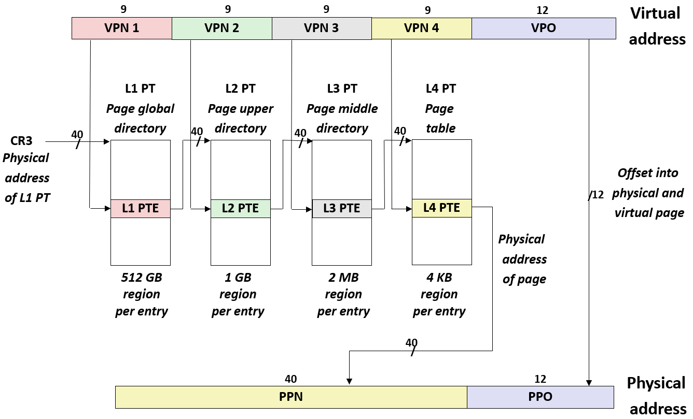

在 48b 地址，4级页表下, L1 PT有 512 个 PTE，每个 PTE 映射 512 GB 的虚拟地址区域(256 TB / 512 = 512 GB)

每个进程只有一个顶层页表(L1 PT)。操作系统只需为实际使用的内存区域(大区)分配下层页表

大部分 L1 PTE 保持无效，因此绝大多数程序仅需 1 个 L1 页表即可运行


---

### 小技巧

<span id="Cute-Trick"></span>

> 好的, 现在这里有一个很酷的技巧, 就是我前面提到的关于限制 L1 缓存大小的原因, 现在我要说明原因

因为 CO + CI = PPO 和 VPO 一样, 不用经过**虚拟->物理**的转换。当 VA 产生时, MMU 不需要等地址翻译完成，可以直接将着 VA 的 VPO 送去 L1 缓存里读出

等 TLB 翻译出 PPN 后，再拿回来比较一下这个提前读出来的缓存行是不是自己要的。

这就是著名的 VIPT(虚拟索引，物理标签)技术，它让地址翻译和缓存读取并行进行，大大节省了时间

如果 L1 缓存有 1024 组, CI 就要 10b(2^10)。此时 CI + CO = 16b, 超出的这(16 - 12 = 4 位)必须来自 PA 的高位


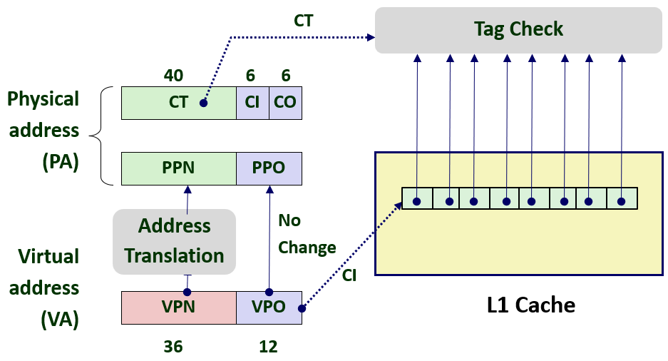


---

### 进程的虚拟地址空间

- 程序的代码段(.text 段), 总是位于 0x4000000 这个虚拟地址上

- 来自可执行二进制文件的初始化数据, 也就是 .data 段

- 可执行二进制文件中所定义的 .bss 段, 即未初始化数据

- 堆从 .bss 段开始向上生长, 有一个进程的全局变量 brk 指向堆顶, 所以内核能够知道进程的堆顶

- 接着是共享库的内存映射区域

- 在用户可以访问内存的顶部, 有一个向下生长的用户栈, 寄存器 %rsp 指向它的栈顶


内核代码和数据在地址空间的上部, 内核的代码和数据对所有进程来说都是一样的


地址翻译在 CPU 运行期间总是进行的, 内核执行的代码也是指令，发出的地址也是虚拟地址。

当内核需要直接操作物理内存的某个特定位置(比如设置页表、访问内存映射的 I/O 设备)时, 不能直接发物理地址, 因为 MMU 会拦截翻译

所以内核将**一组连续的虚拟页面**映射到**一组相应的连续物理页面**, 并且页面的大小等同于系统中 DRAM 的总量

也就是内核必须在它的虚拟地址空间里，保留一块与物理内存**一对一**映射的区域, 这为内核提供了一种便利的方法来访问物理内存


> 如果内核访问这个区域的第 0 个字节, 实际上访问的是物理地址的第 0 个字节
> 
> 如果访问的是这个区域的第 1 个字节, 实际上访问的是物理地址的第 1 个字节
> 
> 所以, 内核在这个虚拟内存上的读写, 实际上是对物理内存的读写


有内核为每个进程保存的与进程相关的数据结构, 进程的上下文, 这些进程相关的数据结构作为进程的上下文, 对每个进程来说, 进程上下文是不一样的

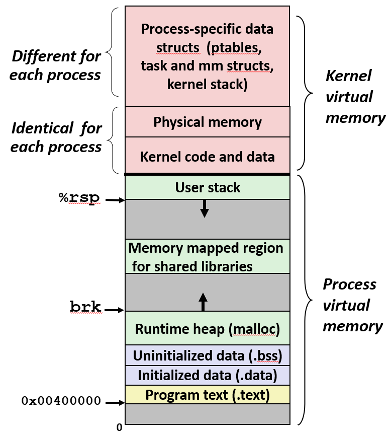

> 这张图不是完全正确的, 实际上在用户栈底和内核代码开始直接, 有空白的地址空间

在 Intel 的体系结构中虚拟地址是 48 位的:
- 如果 48 位的地址的最高位是 0 的话, 未使用的高 16 位需要设置为 0
- 如果 48 位的地址的最高位是 1 的话, 未使用的高 16 位需要设置为 1

这就造成了高 16 位不全为 0 或 不全为 1 的地址空间成为了空白的地址空间

> 你也可以认为内核的地址空间的符号位是 1, 用户的地址空间的符号位是 0

这个空洞的存在，本质上只是地址线物理上没焊那么多根(64位CPU只实现了48位寻址)所造成的数学边界效应

区域|地址范围|第 47 位|高 16 位
-|-|-|-
内核空间(上半部分)|0xFFFF 8000 0000 0000 ~ 0xFFFF FFFF FFFF FFFF|1|全为1
巨大空洞(不可访问)|0x0000 8000 0000 0000 ~ 0xFFFF 7FFF FFFF FFFF|-|不合法
用户空间(下半部分)|0x0000 0000 0000 0000 ~ 0x0000 7FFF FFFF FFFF|0|全为0

---

### 区域

#### 结构

系统 Linux 将内存组织成一些虚拟内存区域(VMA)的集合, 每个区域都是已经存在着的虚拟内存的连续片, 并且以某种方式相关联

如下图中的代码段, 数据段, 共享库段, **栈, 堆**都是一个区域或者说连续片


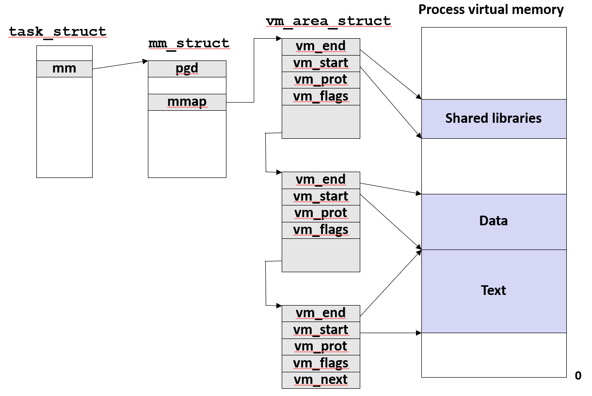

内核为系统中的每个进程维护一个单独的 task_struct, 它包含一个指针 mm 指向 mm_struct

结构 mm_struct 有一个指向第一级页表的指针 pgd, 第一级页表指针是进程上下文的一部分

当进程被调度的时候, 内核会把 pgd 拷贝到 CR3 中, 这就是切换地址空间的方法: 仅仅需要改变寄存器 CR3 的值, 就改变了地址空间

一旦 CR3 的值改变了, 当前进程就不能访问上一个进程的页表

结构 mm_struct 中还有 mmap 用于指向一个由结构体 area_struct 组成的链表, 每个元素描述了**用户空间**各个区域的信息

> 我这里展示的 area_struct 结构体是一个链表, 但是在真实的系统中, 这是某种树, 红黑树或其他类似的树


比如 vm_end, vm_start 定义了这个区域的起始处和结束处。vm_prot 描述这个区域内所有页的读/写许可权限, 比如代码段就被设置为只读的

标志位 vm_flags 表示这个页面是和其他进程共享的, 还是这个进程私有的

默认的情况下, 页面是进程私有的。当需要内存共享和映射时, 如果程序需要共享内存, 可以设置这个标志


---

#### 缺页错误


在 MMU 翻译多级页表, 查找 PTE 的过程中来获取数据时, 发现地址对应的页表不在内存中，就会触发缺页异常，由操作系统内核接手处理

一种情况, 比如 `mov eax, [0x12345678]`, 内核的异常处理函数会从 CR2 寄存器中读出数据地址 `0x12345678`，然后拿着去查链表

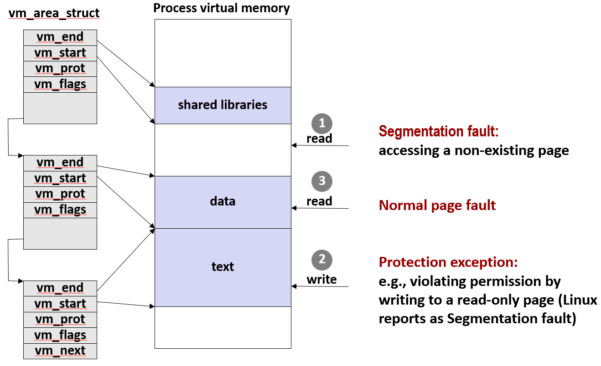

通过判断是否落在某个 `[start, end)` 区间, 便可得知该地址是否落在未分配的地址, 比如还未分配的堆空间, 栈空间

如果内核发现该地址并不在某个 area_struct 定义的区域之内, 那就是访问不存在的页面, 最后出发段错误


一种情况, 如果地址是合法的, 但指令尝试对一个虚拟地址空间的只读页面进行写操作, 就触发保护异常

在这个例子中, 是代码段, 是只读的, 所以会触发一个保护错误。**这也算非法内存读取, 所以在 Linux 的报告中是一个段错误**

最后如果一切正常, 那就按正常缺页处理, 去磁盘分配页面、换入数据即可


---

## 内存映射


通过将虚拟内存上的某段区域与一个磁盘上的对象关联起来, 以初始化这个虚拟内存区域的内容, 这个过程称为内存映射


每一个区域都和文件中的某些部分关联起来, 当第一次引用到某个区域, 它的初始值来自于磁盘上的普通文件

如果该区域是代码区, 那么这个区域会被映射到一个可执行文件的某个部分

内核在内存里凭空捏造了一个“匿名文件”。这个文件不存在于文件系统中，它的大小任意，但里面的内容全是二进制 0


当第一次访问堆上的新页时，内核并不去磁盘读东西，而是直接在当前物理内存里分配一个初始化为全 0 的物理页，交给堆使用, 这也被叫做请求二进制全零的页

一旦一个被匿名文件初始化的页被修改过了, 和其他页一样需要同步到文件中, 只不过这里是同步到内核维护的专门的交换文件


---

### 共享对象

正常的进程不会和其他进程有任何共享的东西, 但现在利用内存映射可以实现进程间共享对象, 因为进程可以映射虚拟内存的区域到同一个对象


假设有两个进程, 有各自不同的虚拟地址空间, 它们的虚拟页都被映射到物理内存的某个部分

然后进程 1 的某个段和进程 2 的某个段把一个文件的某个部分, 也就是把相同的对象映射到自己的虚拟内存空间。进程 1 和进程 2 各自的这块区域之间是没有关系的


因为这个共享对象有一个唯一的名字, 所以内核可以检查有没有进程映射到那个对象, 如果有, 就将内核就把虚拟地址对应的区域映射到相同的物理地址

使得每个独立虚拟地址空间的进程可以访问一些连续片(chunk)达到对同一个物理地址区域访问的目的


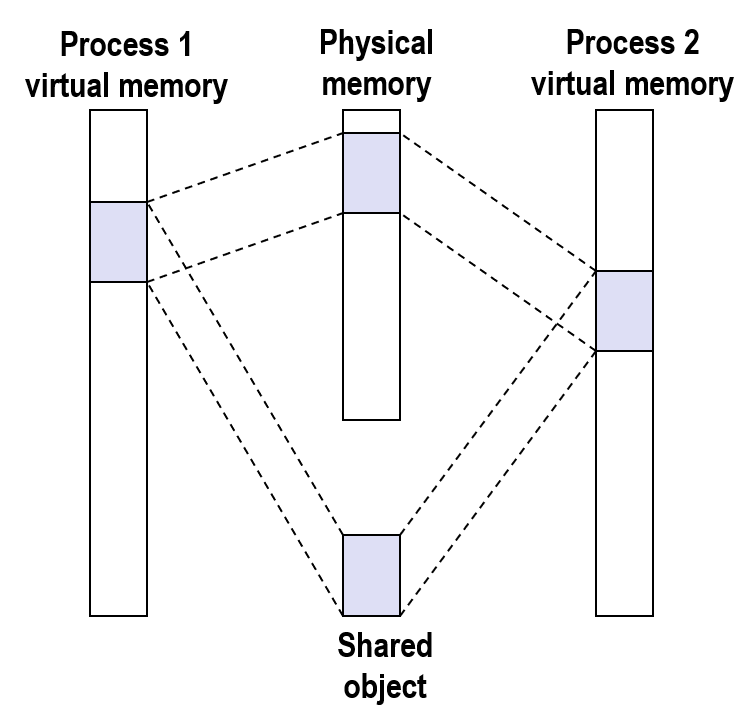

> 想像一下, 这些是多个 Apache 服务器的进程, 你可能需要共享一些缓存

---

### 私有写时复制对象

假设两个进程将一个对象映射到各自的某段区域, 但是这个对象不是共享对象, 而是一个私有写时复制对象(Private Copy-on-write Objects)

两个虚拟地址空间的对应区域映射到了相同的物理区域, **它们使用标志位将这个区域的页表标为私有写时复制**


共享对象的含义是, 如果一个进程对共享对象对应的虚拟地址空间进行了写操作, 那么这个写操作也会同步到磁盘上的文件


但如果这个对象被标记为**私有写时复制**, 那么进程对这个区域进行写操作时, 并不会同步写操作到共享对象的物理内存

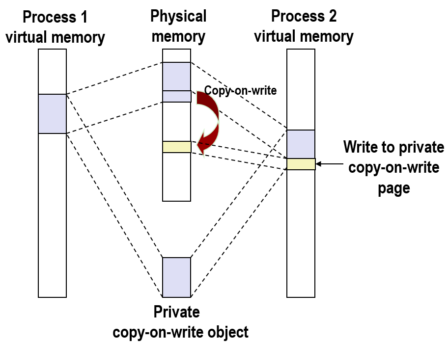

而是将页面拷贝一份, 并且把它映射到一个没有使用的物理地址, 这就是叫写时复制的原因

如果从这个区域读数据, 那么和共享对象一样, 仅仅从对应的物理地址空间读数据

而当对标记为私有写时复制的区域第一次写的时候, 系统会拷贝那个物理页, 然后在拷贝的物理页上写

> 为什么有人要这样做呢, 实际上, 写时复制是一个基本的系统概念, 它在高效共享方面使用非常广泛


**如果多个核心同时向内存写入数据，这些写操作的顺序谁来保证？会不会乱掉？**

> 这是一个好问题, 但是超过了我们的讨论范围
> 
> 内存系统负责维护它们的顺序, 它提供了一些保护措施, 这是一个复杂的问题, 叫做连续性模型, 每一种处理器都提供了自己的连续性模型

---

### 再看 fork

如果 fork 一个进程, 最简单的方式就是拷贝一个独立但是一模一样的地址空间, 这需要拷贝所有的页表, 所有的用户数据结构和内存

如果要 fork 的进程在它的地址空间内创建了很多虚拟页, 它们全部都要拷贝, 并且映射到不同的物理地址

开销会随着所使用的内存的大小的增长而增长, 几乎是无限制的


**写时复制技术提供了一个高效的解决方案**, 当执行 fork 的时候, 内核只拷贝所有的内核数据结构: mm_struct 和 area_struct 以及页表


> 这个操作是没有办法避免的, 但是它们的大小并不大, 它们没有程序正在访问的实际数据那么大

然后内核把两个进程中的每个页面都标记为只读, 再把每一个 area_struct 都标记为私有写时复制

因为它们拥有相同的页表和其他所有的数据结构, 所以 fork 在返回时, 每个进程都有一样的地址空间

如果两个进程仅仅是读的话, 它们共享相同的物理页; 当一个进程想要写时, 系统会使用写时复制的机制, 创建一个新页面

当进程去写页面, 而这个页面的 PTE 被标记为只读时, 会**触发一个异常**。然后内核查找访问地址的标志, 发现那个页面被标记为私有写时复制

所以内核拷贝这个页面并把它映射到一个物理地址空间的新区域, 当异常处理返回的时候, 重新执行当前写的指令

> 它尽可能的延迟了拷贝的发生, 当不得不需要拷贝的时候, 拷贝才会执行, 从某种意义上说, 这是最有效率的办法
> 
> **对虚拟地址空间只进行读的区域永远不会被复制**, 这是完美的, 因为两个进程分享, 没有被修改的物理内存, 这是为什么 fork 的效率并不低的原因

---

### 再看 execve

函数 execve 函数在当前进程中加载并执行一个新函数, 它删除当前进程的所有 area_struct 结构和页表

所以函数 execve 并不创建进程, 只在当前进程中, 在一个新的虚拟地址空间上运行一个程序, 然后为新区域创建了新的 area_struct 和页表


程序的代码被映射为可执行文件的 .text 段, 数据段被映射为可执行文件的 .data 段, 它们是私有的, 因为没有任何进程共享这两个部分

未初始化数据被文件中的 .bss 段定义被定义为私有的, 并且是请求二进制零的: 因为 .bss 段是未初始化的, 所以系统把它们全部初始化为 0

堆区的页面页都是私有的和请求二进制 0 的, 栈是私有写时复制的

共享库区域映射到实际的物理内存, 所有的进程都共享内存中的 libc 库, 所以这一部分虚拟地址空间被标记为共享的

共享库区域的代码被映射为目标文件中包含代码的 .text 段, 数据被映射为文件中包含数据的 .data 段

> 我没有把共享库区域中的私有写时复制的区域表示出来, 因为 libc 有许多函数，全画出来图就没法看了

如果 libc 函数有维护状态的静态变量, 如一个随机数产生器, 在每次调用中需要记录上次的状态

每个进程调用这个函数时，都需要维护自己独立的状态，不能互相干扰。所以这类会修改自身静态数据的函数，它们所在的内存页就必须被标记为私有写时复制

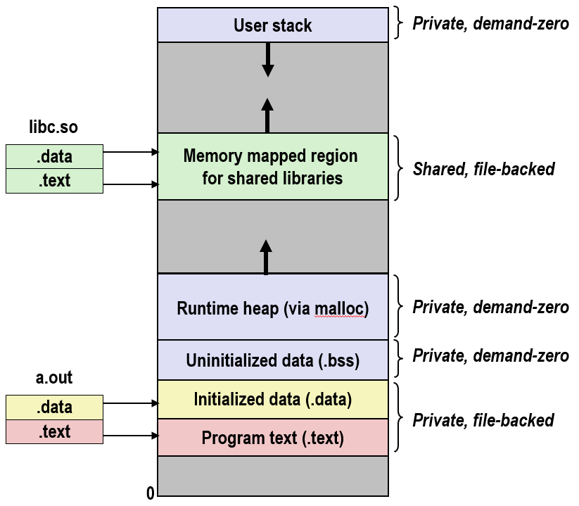

所以函数 execve 做的仅仅是创建一个新区域, 并把它映射到想执行的对象文件中:
- 创建 .bss 和栈, 然后把它们映射到一个匿名文件
- 创建一个内存映射区域, 映射到 libc
- 把程序计数器 %rip 设置为代码区域的入口点

当程序运行时, 注意没有加载任何内容, 所做的仅仅是设置内存映射, 在内核中创建数据结构

但当加载器把 %rip 设置为代码区域的入口点, 当执行代码段的第一条指令的时候, Linux 遇到的代码和数据没有时, 会陷入异常

所以加载不得不推迟, 直到加载一个页面的代码或数据, 加载推迟到页面实际被引用或访问

> 这个策略非常聪明且有趣, 我想, 这是另一个例子, 说明虚拟内存与操作系统紧密结合
> 
> 但这样做可能是高效的, 也有可能是低效的: 如果你有一个长的数组, 并且你将他们初始化为一些非0值
> 这就要求你在加载的时候拷贝整个数组到内存, 尽管你可能只访问这个数据结构中的一部分

---

### 用户级内存映射

内核提供了一个叫做 mmap 的基本的系统调用函数, 它允许你像内核一样进行内存映射

指针的参数 `start` 是一个指向虚拟地址空间的指针, 函数 mmap 将这个地址开始, 映射到由 fd 确定的文件的 offset 开始的 length 个字节映射到虚拟地址空间

```c
void *mmap(void *start, int len, int prot, int flags, int fd, int offset)
```


可以指定这个页面的保护类型是私有的, 读的, 只读的或是可读可写的; 可以指定该对象是私有的还是共享的

可以指定文件对象的类型: 如果映射为匿名文件, 设置 flag 就可以得到一个请求二进制零页面，这不需要传文件描述符参数

参数 start 不是必须的, 这个参数对于内核来说只是一个参考, 如果该区域有效, 它可以映射到这个虚拟地址空间区域

如果这个区域的部分虚拟地址空间已经被某个存在的区域包含了, 它会映射到虚拟地址空间中没有使用的部分

内核会返回一个指向映射区域开始处的指针, 可能不是 start 参数

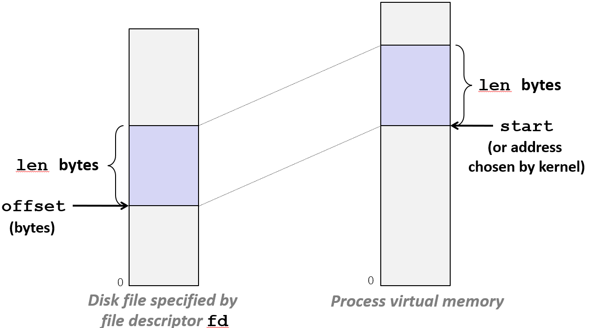

所以函数所做的时根据 fd 参数指定的某个文件, offset 开始的长度 length 字节的区域, 映射到同样大小的虚拟地址空间中

**函数 mmap 没有任何从文件拷贝到内存的动作, 仅仅是内存映射**, 把未使用的虚拟地址空间的某个部分映射到一个文件

如果后面再读这个区域, 便开始扫描虚拟地址空间的这部分: 当读到不存在的页面时, 内核会触发缺页异常, 然后换入对应的页面, 页面的初始值就是文件的某个部分

---

下面的的例子：从标准输入读文件，再写到标准输出，而且整个过程中数据不用先拷到用户空间

<div style="display: flex; gap: 20px; align-items: flex-start;">

```c
#include "csapp.h"

void mmapcopy(int fd, int size) {
    /* Ptr to memory mapped area */
    char *bufp;

    bufp = Mmap(NULL, size, 
                PROT_READ,
                MAP_PRIVATE, 
                fd, 0);
    Write(1, bufp, size);
    return;
}
```

```c
/* mmapcopy driver */
int main(int argc, char **argv){
    struct stat stat;
    int fd;

    /* Check for required cmd line arg */
    if (argc != 2) {
        printf("usage: %s <filename>\n",
               argv[0]);
        exit(0);
    }

    /* Copy input file to stdout */
    fd = Open(argv[1], O_RDONLY, 0);
    Fstat(fd, &stat);
    mmapcopy(fd, stat.st_size);
    exit(0);
}

```

</div>

通常的做法是用 read 和 write 两个系统调用，先读进来再写出去。但其实用 mmap 一个系统调用就能搞定

文件名通过命令行参数传进来后吗, 先打开文件拿到文件大小，然后调用 mmap 把整个文件映射到虚拟内存里: 文件描述符传进去，标志位设成私有，偏移量从0开始

映射完之后，直接调用write，把映射返回的那个缓冲区指针指向的内容写到标准输出（文件描述符是1），要写的大小就是文件大小。

这时候write会从那个缓冲区里一个字节一个字节地往外读

如果读到某个页面没加载到物理内存，便触发缺页异常，内核会把文件内容从磁盘换进来

异常处理完之后，write就能继续把数据写到标准输出了

整个过程数据直接从内核的文件缓存到了输出，没有经过用户空间那一道手