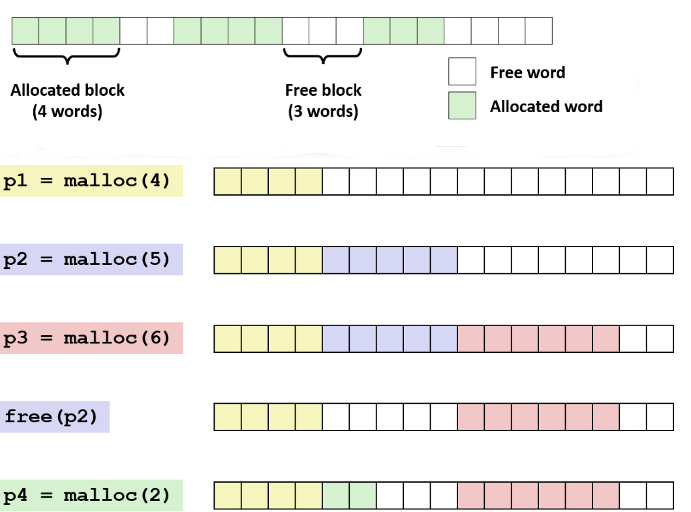
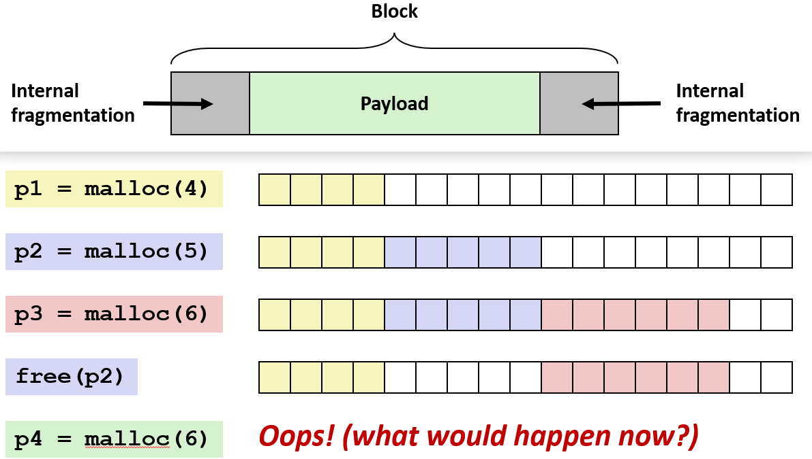
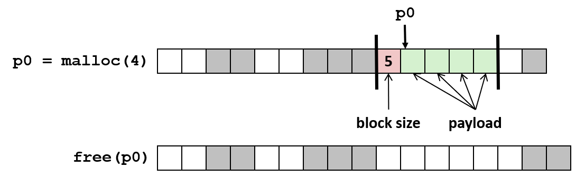
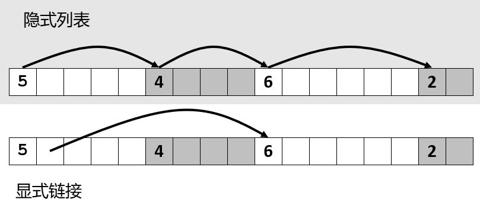
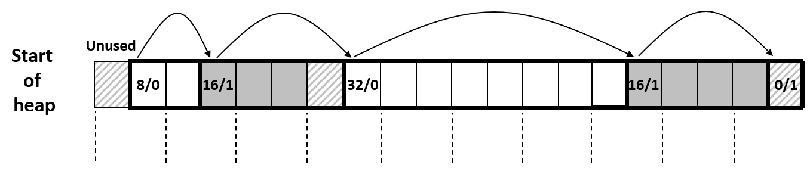
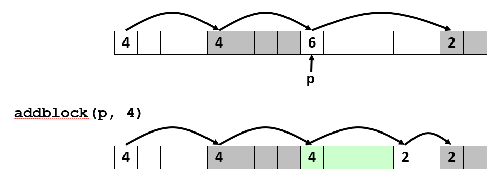
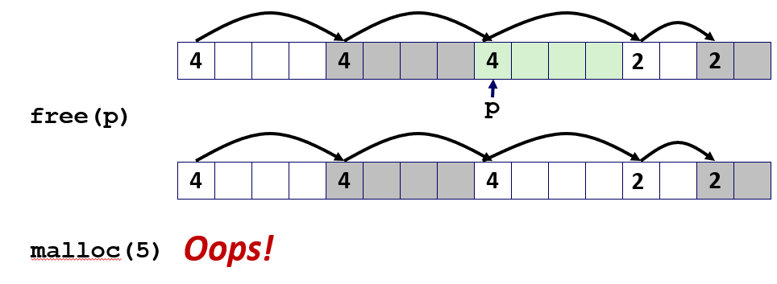
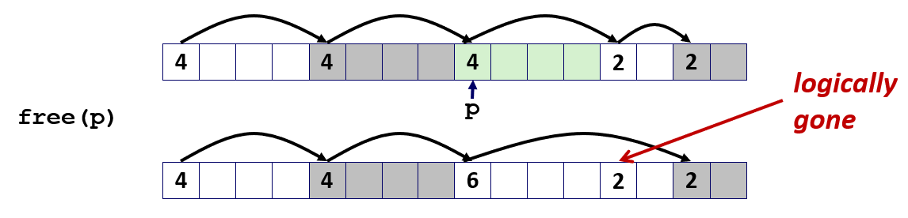
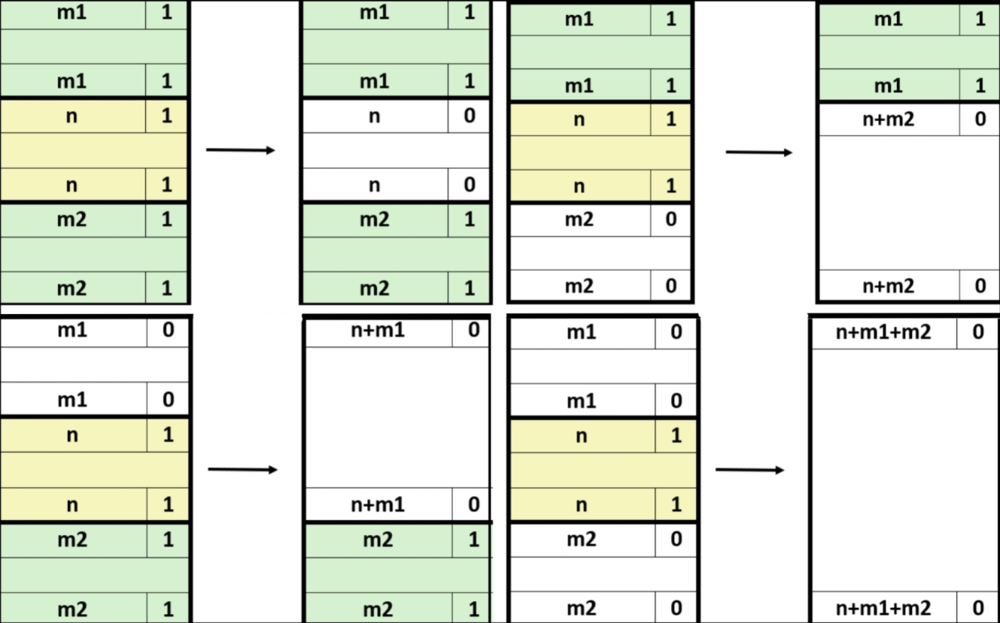

# Dynamic Memory Allocation Basic Concepts

## 基本概念

### 动态分配

应用程序使用动态分配器(dynamic memory allocators)去操纵虚拟内存，去构造、分配以及释放那些在运行时才知道其大小的虚拟存储器片

只有堆需要运行时动态决定内存块的生命周期, 所以在大多数标准动态内存分配器中，堆是其唯一管理的动态内存区域

所有语言都有一些用来分配和操纵动态存储器的机制: 在 C 中使用 malloc, 像 java 这样的语言中使用的是其他的新的方式

### 分类

分配器将堆维护为连续的, 大小可变的块的集合, 块可以被分配或者被释放: 分配表示正被某些应用程序使用; 空闲表示可供应用程序使用

分配器被分为两种类型: 显示分配器(Explicit allocator)和隐式分配器(Implicit allocator): 

- 显示分配器需要手动释放内存, 比如 C 中需要手动 free 显示的释放已经分配的内存

- 隐式分配器不需要手动释放空间, 系统负责释使用称为 gc(garbage collection) 的过程隐式地释放这些内存, 像 Java, ML, Lisp 这样的编程语言都支持隐式分配器

### malloc

在 C 语言中的分配器由 stdlib.h 中一组叫做 malloc 的函数分配内存

参数 size 表示传入 size 大小的字节, 然后返回一个指向内存块的指针, 该内存块至少包含 size 大小的字节

该块在 x86 系统上以 8 字节对齐，在 x86-64 系统上以 16 字节对齐

如果返回的大小 size = 0 则返回 NULL, 如果失败则像大多数典型的系统调用一样, 返回 NULL(0) 并设置errno

```c
#include <stdlib.h>
void *malloc(size_t size);
```

在 C 语言中通过调用 free 函数释放内存, 以一个先前调用 malloc 或 realloc 时返回的指针作为参数

释放了之前调用 malloc 函数的时候返回的地址指向的块, 然后将该块放到可用内存池

```c
void free(void* p);
```

函数 calloc 是 malloc 的另一个版本，它提供初始化为0的初始化内存块; 函数 realloc 可以改变以前分配的块的大小

所以当分配器管理内存并发现其不足时, 调用 sbrk 来获得额外的虚拟内存，然后将其添加到分配器正在操作的内存中

调用 sbrk 用于改变进程的堆顶位置: 增量为正，堆顶上移，堆内存增加; 增量为负，堆顶下移，堆内存减少


下面的例子简单使用用 malloc 分配一个大小为 n 的整型数组:

```c
#include <stdio.h>
#include <stdlib.h>

void foo(int n) {
    int i, *p;

    /* Allocate a block of n ints */
    p = (int *) malloc(n * sizeof(int));
    if (p == NULL) {
        perror("malloc");
        exit(0);
    }

    /* Initialize allocated block */
    for (i=0; i<n; i++)
    p[i] = i;


    /* Return allocated block to the heap */
    free(p);
}
```

因为参数是以字节为单位，所以用 `n * sizeof(int)` 来调用 malloc 返回一个指针

将 void* 泛型指针, 或者说无类型指针转​​换为指向整型的指针，以便于编译器编译, 然后将其分配给 p

检查这个指针是否为空指针, 如果为空则打印错误, 不为空则循环遍历数组的元素，将每个元素初始化为某个值

当不再需要分配的这块内存时，必须通过使用指针 p 调用 free 来释放它

---

### 约束

> 尽管我们知道**内存是按照字节大小寻址的**, 但是为了本讲座的目的，我们将假设它是字的地址, 而且我将假设字是 4 个字节


这些字所构成的块或者连续的片能够被分配或者被释放: 包括 4 字大小的被分配的块，后面跟着 2 个字的空闲块, 然后是另一个 4 字大小的已被分配块

将使用白色表示这些空闲块，并用某种颜色的阴影来表示已分配块




> 注意正在调用具有字大小的 malloc 不是字节, 只是为了保持这些图片更简单

调用 malloc 分别分配 4 字, 5字, 6字大小的块并获得指针 `p1`, `p2`, `p3`

然后调用 free 释放 `p2` 所指向的这个紫色块, 然后为 2 字大小的块进行另一次分配

那么分配器去查看否能找到一个有足够空间的空闲块: 找到这个有 5 个字大小的空闲块, 并在该空闲块内分配所请求的块

---


从上面例子可以看到, 像 malloc 这样的分配器**无法控制应用程序正在做的事情**:
- 应用程序可以将已分配块和空闲块的任意组合, 所以无法预测接下来是请求还是释放

- 应用程序想申请 1 字节就 1 字节，想申请 1GB 就 1GB


函数 malloc 是一个同步(线程阻塞)调用, 也就是**无法重新排序或缓冲请求**

当程序执行到 malloc 时，CPU 会暂停当前任务，跑进分配器的代码，分配器必须立刻把地址返回来，程序才能继续往下走

分配器一调用就必须立刻响应, 不能先等待, 然后待会一起处理, 这就导致分配器没法做全局的优化


一旦一块内存被 malloc 分配出去了, 分配器就**无法去读、写、移动那块内存里的任何数据**, 除非应用通过 free 把所有权还回来


而且 CPU 读取内存不是按字节读的，而是按字读的: 如果返回的地址没有对齐, CPU 就需要读两次再拼凑，效率极低，甚至某些架构直接报错


比如 Linux 机器上的 8 字节 (x86) 或 16 字节 (x86-64) 对齐方式

不仅要字对齐, 因为分配器不能移动块, 也就无法将已分配的块放到一起以达到压缩块的目的, 以便创建更大的空闲块

---

### 性能指标

分配器包含了时间和空间上的权衡, 尝试使其运行得尽可能块, 也希望尽可能高效地使用堆中的虚拟内存

目标是最大化吞吐量并且峰值内存利用率, 但这些目标往往相互冲突

#### 吞吐量

吞吐量(Throughput)指单位时间内的请求数量, 如 10 秒钟内调用 malloc 和 free 各 5000 次, 那么 `(5000 + 5000) / 10 = 1000` 次/秒

#### 峰值内存利用率

峰值内存利用率(Peak Memory Utilization)用于衡量分配器使用堆的效率, 去衡量分配器在实现中必须使用的数据结构中的各种开销上浪费了多少

将操作 malloc 和 free 都定义为 R, 那么任意的组合序列: R0, R1...Rk...Rn-1

当 malloc 调用产生 p 字节的块, 该块称为有效载荷(payload)。在操作 Rk 之后, 聚合有效载荷(aggregate payload) Pk 是当前分配的有效载荷的总和

在完美的分配器中, 聚合有效负载 = 内存量 = 所有已分配块的总大小。因为没有开销, 每个块都是有效载荷

当前堆的大小被定义为 Hk, 并且假设 Hk 是单调非递减的, 而这种单向增长是通过分配器在需要时调用 sbrk 来实现的

> 这是一个简化的假设，在真正的 malloc 包中不是这样

峰值内存利用率 = 前 k 个请求中最大的有效负载 / 当前堆的总大小: `Uk = max(Pi)/ Hk, i <= k`

但由于假定只递增, 所以 Pk 必定是最大的有效负载, 所以 k + 1 个请求后的峰值内存利用率, 是所有有效负载的总和除以堆的总大小

在最好的情况下, 堆中的每个块的内容都是有效负载, 因此利用率为 1

但实际上, 在分配器将要放置的每个块的内部，都有数据结构和其他内容, 这使它无法获得完美的利用率

因为块必须字节对齐的: 如果块必须以 16 字节边界开始, 那么请求 2 字节的有效负载就会浪费字节，降低利用率

> 所以这是其中一些开销是不可避免的, 但是你作为一个编写实现 malloc 人，你的的工作就是尽量使得这些浪费减小

---

### 碎片

如果有效负载小于块大小，则会**发生内部碎片**。内部碎片可能是由以下几个原因形成的:

- 维护堆的开销<span id="block-header"></span>: 每个块前面通常会有一个 header 用于记录: **当前块的大小, 当前块是否被分配, 指向前一个/后一个块的指针**

- 字节对齐的开销: 某些数据结构不是对齐所需的字节的整数倍, 为了填充浪费的空间形成内部碎片

- 程序决策的开销: 比如代码用更大的块维护更小的块; 比如为了方便管理, 给分配的块设定一个最小尺寸

内部碎片易于测量, 因为只取决于**过去的请求** R 的模式, 每个块的大小 - 该块有效负载大小 = 该块的内部碎片



**外部碎片发生**在堆中有空白的内存时, 剩余的总空间足够, 但没有一个可以满足指定大小的空闲块, 就像下图的例子中一样:


在一系列 malloc 和 free 调用之后, 获得一个包含 5 个字的和 2 个字的空闲块, 所以堆中的空闲的字总数是 7 个字

但收到 6 个字的请求, 但空闲的 2 个块都不能满足 6 字大小的请求


所以在这种情况下，分配器必须去获得更多的虚拟内存, 分配器必须获得更多虚拟内存，并在堆的这后面进行扩展并获得足够大的免空闲块

因此评估和理解外部碎片很困难, 因为不同于内部碎片取决于过去的请求, 外部碎片取决于**未来的请求**

---

### 确定块大小

典型的标准方法: 在每个块的开头使用一个字大小的的区域, [记录某些单元中该块的信息](#block-header)

下面的例子中: 如果应用程序想要 malloc 一个大小为 4 字的负载荷, 分配器需要找到大小为 5 的块



---

### 跟踪空闲块

最简单的方法是称为**隐式列表**的方法: 其思想是不论空闲与否, 在堆中的每个块的前面放置一个头部, 然后使用头部记录的大小来访问堆

比如下面的例子, 第一个块的偏移量为 5, 第二个块的偏移量为 4，依此类推

虽然这不是空闲块的列表, 通过在堆中遍历所有块, 然后忽略已分配的块就可以了



使用指针在空闲块之间**显式链接**: 空闲块是当前不会使用的, 所以可以在里储存指前和指后的指针去创建某种链接列表, 比如单链或双链表

这是明确的空闲块列表: 可以访问第一个空闲区块, 然后有指向下个空闲块的指针, 依此类推

隐式链表思想是遍历所有包括已分配的块, 时间复杂度 O(总块数); 显式链表只遍历空闲块，时间复杂度 O(空闲块数)

即使堆里有很多已分配的块, 空闲块的数量也可能很少，所以遍历显式链表可以很快

但如果应用程序频繁分配再释放，导致堆里到处都是小块的空闲碎片，那么空闲块的数量就会变得非常大，显式链表的遍历也可能变慢


还可以按**照块的大小范围，把空闲块划分到不同的列表中**: 一个列表只存放 0 到 8 字大小的空闲块；一个存放 9 到 16 字大小的块, 依此类推

极端一点，可以为每一种可能的块大小都创建一个列表, 当请求某个特定大小的块时，总能找到恰好匹配的块。这样几乎不会产生内部碎片，外部碎片也会减少

分类越细，即每个列表覆盖的大小范围越窄，内存的利用率就越接近理想状态

现实中不可能为每一种大小都单独维护一个列表, 那样开销太大了


或者**可以按大小去排序块**: 比如使用平衡树 (如红黑树)，在每个空闲块中都有指针，长度用做键


---


**为什么不为每一种可能的大小都单独创建一个列表呢**, 理论上确实可以这样: 每当遇到一个新的大小请求，就为它新建一个对应的尺寸类

但这个策略能不能奏效，很大程度上取决于定义的**尺寸类**覆盖的范围有多宽:
- 如果请求尺寸分布比较均匀, 比如各种大小出现的频率差不多, 那这种策略可能效果还不错

- 如果请求的尺寸种类特别多、很分散，那可能就要维护一大堆空闲列表, 很多列表里只有一两个块，甚至长期空着，这样就造成了管理结构本身的浪费


不过话说回来，这确实是一个非常实用的策略。假如程序里经常出现某几种固定大小的请求, 那就可以专门为这几种尺寸单独维护一个空闲列表

特殊情况特殊处理，而把其他所有杂七杂八的请求丢给另一个覆盖更广范围的通用列表去处理

如果某个空闲列表里所有的块大小都完全相同, 那效率就更高了: 不需要存完整的大小字段，只需一个 bitmap 标记**已分配/空闲**即可。

这样完全不需要遍历链表，分配和释放都是 O(1) 的常数时间，极其高效。

> 这是一个很好的问题，这是你在做 malloc 实验时会想到的事情, 实现 malloc 功能有一个巨大的设计空间


---

## 隐式空闲链表

在这个方案里, 每个块用两个完整的字来记录其大小和分配状态, 但这太浪费了

**块地址必须对齐**在实际中确实是个让人头疼的限制, 但在存储元数据这件事上，反而可以利用它

如果一个块与 8 字节对齐，那么地址一定是 8 的倍数，也就是低 3 位始终为 0（因为 8 的二进制是 1000）, 如果是 16 字节对齐，低 4 位始终为 0。

因为已经知道这个地址里的低位本来就是 0, 所以只需要在 Header 里用 1 个字, 然后把这个字的最低位拿来存分配状态

当以后需要提取块的大小时，只需要做一个简单的操作：把最低位的分配状态掩掉（mask out），强制置为 0，剩下的就是真实的大小值

|1 word 的非零高位| 1 word 为零的低位|||
|-|-|-|-|
|size | a | Payload| Optional padding|
|记录块总大小| a = 1 表示该块已分配<br> a = 0 表示该块未分配|已分配的块|未分配的块|


---

在下面的例子中, 块的大小用 4B 的一个字计量, 每个块的有效载荷的起始地址落在 8 字节对齐的地址上

在堆的最开头分配一个不使用的字, 把堆的起始地址先填充到 8 字节边界上

第一个块从"堆起始地址 + 4B 偏移"的位置开始, 对齐只要求有效载荷的起始地址对齐, 所以 Header 没有对齐并不重要


第一个块的有效载荷大小为 1 字, 把堆的起始地址先填充到 8 字节边界上, 接着是一个大小为 2 字(8/0)的空闲块

再接着是一个已分配的大小为 4 字(16/1)的块, 但有效载荷只用了 2 字, 剩下的被填充掉用于地址对齐

所以这里出现了内部碎片: 多出来的那部分字节虽然属于这个已分配块，但应用程序完全用不上，纯粹是为了凑齐对齐要求



接着可以用一个掩码(mask)从每个块的头部提取出分配状态位(alloc bit)，然后通过读取头部里的size字段遍历整个堆

链表关系是隐含在块与块之间的连续地址中的，而不是通过显式的指针

最后在这个堆的末尾放一个特殊的终止块(terminating block): 它是一个已分配块，但大小为零

> 这是一个很巧妙的小技巧，等我们讲到合并（coalescing）的时候你会明白它的用处

当遍历隐式链表时，只要读到这个**已分配且大小为零**的块，就知道已经到达堆的末尾了，可以终止搜索

---

### 查找空闲块

**首次适配**的方法是从头开始搜索空闲列表，选择第一个合适的空闲块：

假设第一个合适的块在链表末尾, 可能需要 O(已分配和空闲的块总数) 的时间; 而且不一定是恰好合适, 所以可能导致链表开头的碎片

假设要分配的块大小为 10，然后遍历列表寻找, 实际上需要 10 加上头部大小 2 的总大小

```c
p = start;

//遍历内存块列表，跳过已分配或大小不足的块
while (p < end) {
    int is_allocated = *p & 1;  // 检查分配标志位 
    int is_too_small = *p <= len;
    
    //如果块已分配或大小不足，则跳过
    if (!is_allocated && !is_too_small) {
        break;  // 找到合适的块
    }

    int block_size = *p & -2;   //获取当前块的大小（低位置零）
    p = p + block_size;  // 移动到下一个块（按字寻址）
}
```


**下一次适配**不从堆的开头每次开始去找到适合的块, 而是从上次搜索完成的位置开始。**通常应该**比首次适配更快：避免重新扫描无用的块

> 现在这似乎是一个好主意，但人们所做的研究已经证明这实际上会导致更糟糕的碎片

**最佳适配**是在堆中找到最佳适配的块: 如果要求 10 个字节, 那么尝试扫描堆中最接近 10 个字节的块

在找到最合适的之前，必须查找所有空闲块: 这可能会带来更大的消耗, 但它提高了内存利用率

> 这是一个典型时空权衡的例子, 它的速度较慢，但​​它提高了我们使用内存的效率


先前提到了一种使用多个不同大小类的空闲列表来组织空闲列表的替代方法

> 关于使用多个空闲列表有趣的点是: 你拥有的这些空闲列表越多，就越接近真正的最佳状态

如果有无限数量的各个大小的类, 每种类对应一种大小，就可以确切地知道从哪个空闲列表中获取块。**问题是这样一个组织会使用多少内存**

因此设计决策要考虑**需要多少个空闲列表**以及**所关联的块的大小的范围**

---

### 拆分空闲块

**请求的块所需大小**可能小于**要被分配块的大小**, 所以需要拆分块


假设如果应用程序请求包括头部大小为 4 的块, 然后出于某种原因选择了这个实际上是 6 的空闲块

分配器必须决定是保留这个大小为 6 的块, 返回失败的分配

或者将该块分成 2 个块，分成一个大小为 4 的已分配的块, 然后返回到应用程序，其后面是大小为 2 的空闲块



```c
void addblock(ptr p, int len) {
    // 将长度向上取整为偶数
    int newsize = ((len + 1) >> 1) << 1;
    
    // 获取当前块的实际大小（清除低位的分配标志位）
    int oldsize = *p & -2;
    
    // 设置新的块大小，并标记为已分配（低位置1）
    *p = newsize | 1;
    
    // 如果新大小小于原大小，在剩余部分创建新块
    if (newsize < oldsize) {
        // 在剩余空间的起始位置记录其大小
        *(p + newsize) = oldsize - newsize;
    }
}
```

---

### 释放块

释放块最简单的方法就是直接清除已分配的标志: 如果想要释放已经被分配的块, 只需将分配的位设置为零即可

```c
void free_block(ptr p) { *p = *p & -2 }
```

一个曾经是大小为 6 的块, 现在由 2 个连续的较小块组成，其中一个大小为 4，其中一个大小为 2

如果释放大小为 4 的块, 但只是清除了空闲块, 并没有真正注意到它是连续的: 因此最终得到了**两个连续的空闲块**的情况

如果之后请求大小为 5 的块: 有足够的空闲空间，但分配器却找不到它



这表明当释放块时, 需要合并任何相邻的块, 以尽量保持块尽可能大

---

### 合并块

任何优秀的分配器的不变性之一: 永远不会使得多个连续的空闲块存在, 始终是一个空闲块后跟一个已分配的块

如果释放一个已分配的块, 必须检查前后是否存在相邻的空闲块, 作为释放的一部分, 需要将这两个块合并为一个尽可能最大的块

```c
void free_block(ptr p) {
    // 清除分配标志位（将最低位置0），释放当前块
    *p = *p & -2;
    
    // 计算下一个块的起始地址
    ptr next = p + *p;
    
    // 如果下一个块也未被分配，则合并两个空闲块
    if ((*next & 1) == 0) {
        *p = *p + *next;  // 将下一个块的大小合并到当前块
    }
}
```

检查下一个块相对容易, 上一个块就比较麻烦, 以下面的图片为例:



要求释放绿色块, 只需检查该块头部所记录的该块大小, 便可知道下一块的头部位于偏移量 4 处

紧接着便可去检查下一个块的分配状态并使用头部中的 size 字段

但对于前一个块, 根据前面所谈论的内容, 似乎只有一个办法就是: 遍历空闲列表直到当前块的前一个块

这样效率非常低, 这会使得 free 的过程与堆的大小呈线形的关系: 因为要检查前一个区块，就必须从头开始遍历整个堆

---

### 双向合并

> 对于这个问题的解决方案是由着名计算机科学家 Don Knuth 在 1973 年提出的
> 
> 它非常聪明，非常简单，就像所有非常好的想法一样。很明显，事实证明它非常聪明并且是一种非常有用的技术


而这个想法只是将块的头部复制到块的脚部: 现在每个块包含一个头部和一个相同的脚部

这样便允许反方向遍历链表，尽管需要额外的空间, 但这样就可以在常数的时间内做到检查前一块


所以这个脚部有时被称为边界标记，而 Knuth 称之为边界标记, 这里把它称为脚部，与头部的概念并行

|头部高位|头部低位||脚部高位|脚部低位|
|-|-|-|-|-|
|size | a | 有效载荷和填充 | size | a| 


最终分配的块大小必须包含头部、边界标记和对齐填充。至于这会不会造成大量内存浪费, 完全取决于应用程序的请求模式

如果频繁请求很小的块, 比如每次只申请 1B, 但要求 8B 对齐, 再加上头部和边界标记: 这样有效载荷只占极小部分，内部碎片会非常严重。

如果请求的是很大的有效载荷, 比如每次申请 1000B, 那么头部、边界标记和填充的开销相对于有效载荷来说微乎其微, 浪费就不那么明显了。

---



**对于情况一, 针对想要释放的块, 上一块已被分配, 下一块也已经被分配**

所以在这种情况下只需保持头部和脚部的大小不变, **将分配状态设置为空闲即可**


**对于情况二, 针对想要释放的块, 上一块已被分配, 下一块是空闲的块**


那么要做的是检查前一个块的边界标记并发现已被分配, 所以不必对上一块做什么

接着使用大小来检查下一个块的分配状态, 偏移 n 跳转到下一个块的头部检查并发现分配状态是空闲的

所以这两个块需要合并: 只需将两个大小相加就可以创建更大的合并块, 并将其分配状态设置为零


**对于情况三, 针对想要释放的块, 上一块是空闲的, 下一块已被分配**

因为前一个块的头部被更新为了新的合并块的大小, 所以必须相应地更新被释放块的边界脚步


**对于情况四, 针对想要释放的块, 上一块是空闲的, 下一块也是空闲的**

在这种情况下只需将前一个的头部和后一个的脚部更新为 3 个块大小的总和

---

边界标记会带来额外的内部碎片，因为它不是有效载荷的一部分，而是纯粹的开销

如果不需要合并，那就不需要 Footer: 因为只有块被释放时，才需要去和它的邻居合并

所以也许可以在已分配的块上完全省略边界标记，只在空闲块上保留

但如果这么做, 当释放某个块、需要进行合并时，就无法知道前一个块是已分配还是空闲的

另外的办法是: 因为块与 8B 对齐，Header 里的 size 的低 3 位始终为 0

这里只用了其中 1b 来存储当前块的分配状态, 也可以用另外 1b 来存储前一个块的分配状态


利用其中的另一个位，专门用来指示前一个块的分配状态: 如果前一个块是已分配的，这个位就设为1；如果是空闲的，就设为0。

这样当执行free、需要判断是否要合并时，只需要检查这个"前一块分配位"就可以