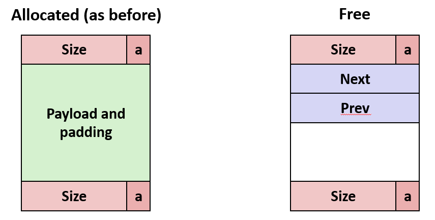
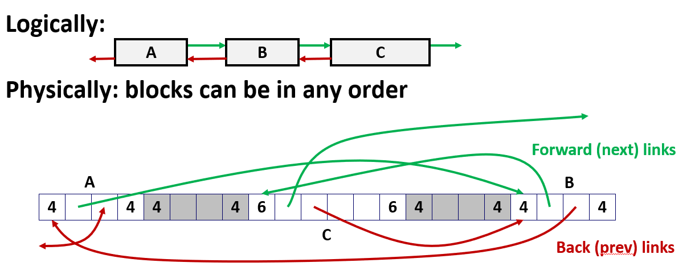
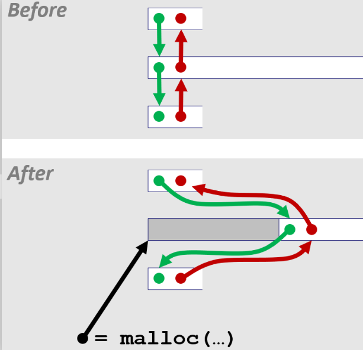
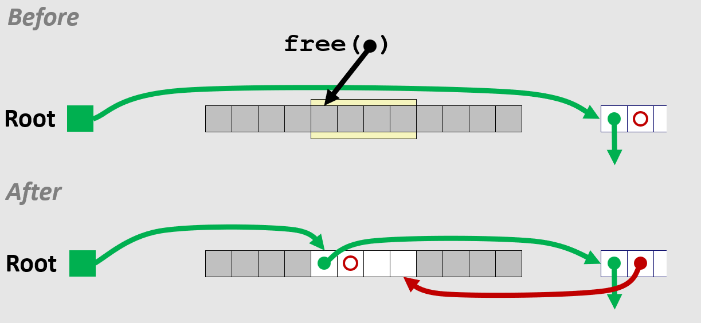
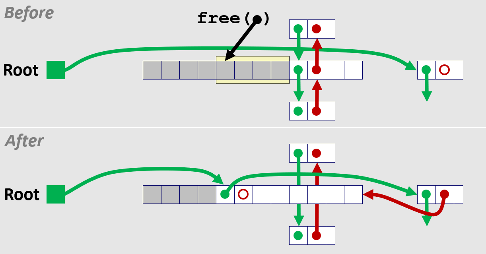
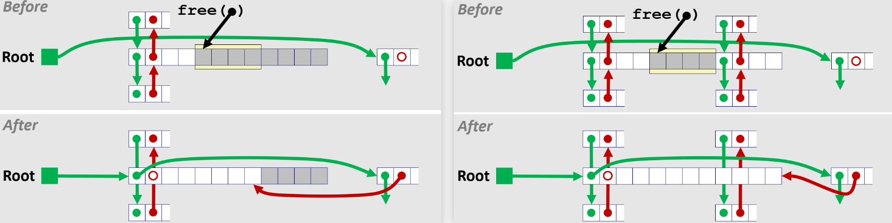
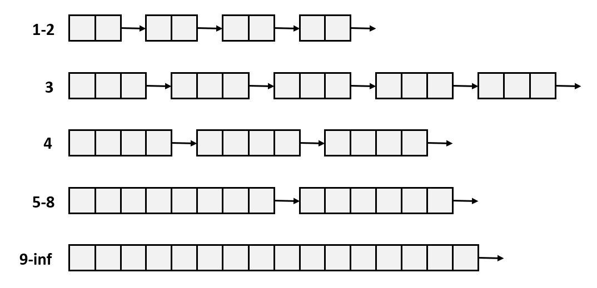
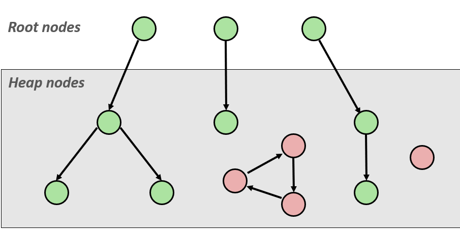
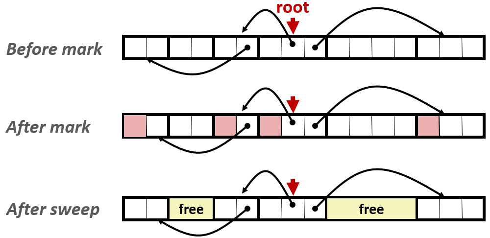

# Dynamic Memory Allocation Advanced Concepts


> 我意识到我没有很好地解释峰值内存利用率这个概念
> 我想要说明这是一个很重要的概念, 我希望大家都能够理解

回忆起正在执行一系列请求: R0, R1...Rk...Rn-1, 执行到 R(k) 之后的任意时刻定义两个值：堆大小 H(k) 和此刻堆中所有已分配的有效载荷的总和 P(k)

在整个请求序列中 P(k) 是上下起伏的, 是会随着请求执行而动态变化的: 当 malloc 时, 有效载荷总和会增加; 当 free 时, 有效载荷总和会减少


如果有一个完美分配器, 没有头部和脚部开销, 而且能把所有已分配的块挤在一起, 不留任何内部碎片和外部碎片, 那么堆里需要的"最小理论大小"就是 P(k)

根据定义, U(k) 等于历史上 P 曾经达到的最大值, 除以当前时刻的堆大小 H(k)

之所以 P 取历史上的最大值而不是当前值, 是因为这个曾经达到过的最大有效载荷, 代表了分配器曾承受过的最坏内存压力

虽然随着释放操作 P(k) 会降下来, 但堆大小 H(k) 通常不会缩小, 所以用这个压力值除以当前的堆总大小, 就得到了当前堆空间的利用效率

分配器很容易跟踪堆大小: 无论是堆增加还是缩小, 分配器也完全能通过 sbrk 来控制堆的大小

对于给定的一组分配和释放请求序列, Max(P(k)) 对任何分配器来说都是完全相同的常数, 因为它只取决于请求序列本身, 跟分配算法无关

唯一能改变 U(k) 的变量就只有 H(k): 也就是在扛住同样历史压力的情况下, 让堆大小 H(k) 涨得越慢, 利用率就越高

---

## 显式空闲列表


通过头部和脚部把整个堆遍历一遍来找到空闲块称之为隐式空闲列表, 用双向链表把**空闲块**串起来就是所谓的显式空闲列表


显式空闲列表的核心思想是在空闲块的有效载荷区域里存放指针, 用这些指针实现双向链表

已分配的块和之前完全一样: 头部、可选的脚部、有效载荷和填充, 所以分配器不能碰已分配块的有效载荷

但空闲块没人用, 所以分配器可以把空闲块的有效载荷区域借用来存放链表指针



逻辑上(Logically)这就是个普通的双向链表, 但物理上(Physically)这些块可以散落在内存的任意位置



比如图中大小为 6 的块, 它的前向指针指向另一个块, 后向指针指向地址更大的那个块。除非花大力气去维护地址顺序, 否则这些块在内存中没必要连续。

多次的 malloc 和 free 之后, 如果释放一个位于两个空闲块之间的块, 则必须合并


---

无论是已分配的还是空闲的, 在物理地址上都是紧紧挨在一起的, 但显式空闲列表只是把空闲块用指针串起来, 指针不按地址顺序走

可能乱跳从块 1 跳到块 3, 再跳到块 2, 地址不连续, CPU每次都要去不同的内存位置, 所以局部性差

但每个分配块内部本身是一整块连续内存, 应用程序访问这块内存时, 数据在地址上是顺序排列的, 所以局部性好

但空闲块被串成链表后, 遍历顺序不等于物理顺序, 所以扫描空闲块时局部性不好


虽然空闲链表乱跳, 但如果**恰好**链表上连续几个空闲块都在同一页内存里, 那CPU一次把整页加载进缓存后, 访问这几个块的头部/脚部/指针时就快得多

---


应用程序可以给分配器一些提示来提升性能或内存利用率, 但那样将不是一个通用的分配器

因为 malloc 是一个通用的分配器, 所以它并没有提供任何选择: 它在其接口中不提供任何用于传递这些提示的参数

通用分配器不能接收提示, 但可以根据历史请求模式做预测程序的未来行为: 比如检测到"大块、小块、大块、小块"的交替模式, 就能猜下一个请求的大小

假设有 100B 的空闲块, 并连续收到 20B, 80B, 100B 的分配请求

如果不做优化, 便从 100B 的空闲块中切出 20B 分配, 再切出 80B 分配, 然后释放 20B 的分配块, 再来 100B 的请求空间就不够用了

如果预测出 100B 的分配请求了, 那么就可以不把这个 100B 的空闲块拆分为 80B 和 20B, 而是将整个分配给 20B, 这 80B 的请求放到别处分配

当释放 20B 的分配块时, 便可以将空出的整个大块分配给后续的 100B 的分配请求


> 有没有更智能的预测分配器？我不知道, 但我不说没有。

---

分配器必须保证永远不应该有两个连续的空闲块: 每次释放时都要尽可能合并, 如果一直这么做, 就不会出现相邻空闲块

---


使用 free 时需要把释放的块拼接到链表中, 所以需要两个指针来操作

也可以用单链表实现, 但之前提到单链表的缺点是 free 时要从头搜索才能找到前一个块, 效率低

---


头部和脚部这些是开销, 不算有效载荷。算利用率时用的是聚集有效载荷总和, 所以任何不是有效载荷的东西都会拉低利用率

如果有效载荷只有一个字, 头部和脚部各占一个字, 那利用率就是50%

---

如果头部、脚部、前向指针、后向指针各占 1 字, 那么最小块就是 4 字, 有效载荷为 0

那么就永远不能分配一个小于 4 字的块: 这些指针不止是为了方便 free 才存在, 它们本身就是最小块大小的一部分

---


如果提前知道请求大小固定, 比如编译器维护抽象语法树时动态分配节点, 所有节点大小相同

那就完全可以分配一个大块, 然后从中切出等大小的对象, 甚至不需要指针, 用位向量标记哪些在用哪些空闲就行

这样还能获得连续访问的局部性。但通用分配器做不到, 因为它不知道请求模式

---


> 可以对程序行为做一般性假设, 在 malloc 实验里跑 trace, 观察模式然后针对它优化

不能硬编码说"如果大小是42下一个就是24", 但可以看记录发现有趣模式并利用它

---

应用程序期望的是一个连续的有效载荷块。不能在已分配的块里有效载荷里放任何东西

唯一能做的就是返回一个大小符合请求的连续内存块, 一旦交给应用程序, 分配器就不能再碰它

---

### 分配

分配相对简单一些, 下图中有指前的绿色指针, 指后的红色指针




想要分配出这个中间块, 只需要指向这个新的空闲区块, 然后只更新前一个和下一个块的前向和后向指针

---

### 释放

已分配的块并不存在于空闲列表中, 当需要释放它时, 就得考虑将新释放的块放在空闲列表的何处

最简单的办法就是后进先出(LIFO)策略: 统一将以释放的块插在空闲列表的开头

这么做的优势就是时间复杂度稳定并且操作简单, 因为因为总是在做同样的事情: 只是将块放在列表的开头

但缺点就是根据研究表明, 后进先出碎片化比地支顺序策略更严重

另外一种策略就是按地址顺序去排列空闲块: 前一个块从一个较小的地址开始, 下一个块从更大的地址开始: `addr(prev) < addr(curr) < addr(next)`

但这么做通常得以某种方式搜索空闲列表, 以便于找到插入新释放块的适当位置


当然可以使用某种平衡树加速搜索, 用某种平衡树红黑树或其他东西来实现 malloc, 这似乎是一个非常好的主意


但必须意识到这种方法正在与其他技术竞争, 特别是分离空闲链表(Segregated free lists): 隔离列表非常快, 具有非常小的常数因子


即使是有序列表, 通常也会用二叉有序树来做 nlog(n) 级别的更新, 但它的常数因子可能非常大

所以一般不会去依赖 log(n) 的搜索时间优势, 而是更倾向于维护那种常数因子可控的结构

---

显式列表分配器作为应用于各种现实生活分配器的通用分配器, 并很不是很高效

但它作为隔离列表分配器的一部分很有用, 可以拥有多个空闲列表, 每个列表都是一个显式列表:

- 随着不同大小类的数量增加, 搜索时间在极限情况下趋近于常数时间
- 如果维护包含不同大小范围的类, 那么搜索时间会降到 log(n), 因为每个大小类内部的范围是对数分布的。

所以当处理像 malloc 这样的大规模空间设计时, 最好先做最简单的事情, 等到确实发现有性能瓶颈了, 再去做优化

之前谈到的消除边界标签脚部和分配块的技巧就是一个应该推迟的优化的例子: 做一些简单的事情, 然后尝试逐步改进

> 很多程序员都会犯一个毛病, 我们称之为过早优化。他们总想着所有能用的花哨技巧, 还没等知道需不需要, 就把它们全塞进第一版代码里了


---

现在有一个显示空闲列表的根, 用于指向空闲列表中的第一个块。

有一个指向前面的红色指针, 因为前面是根, 所以这里是一个空指针。红指针旁边的绿色指针用于指向一些别的未分配的块




现在调用 free 将黄色区域的块释放, 释放其指针指向此块的开头。这个案例非常简单, 因为黄色区域的前后都是已分配的块, 所以不需要合并

根据 LIFO 策略, 刚释放的块要成为空闲列表中的第一个块: 将根指向刚释放的块开头, 将该块的绿色指针指向曾经的开头块

曾经开头块的空指针指向新释放块的结尾, 新释放块没有上一个块了, 所以红色指针是空指针

---

下面的情况中, **黄色区域属于连续内存中的某一段**。该区域的下一块**是显示空闲列表中的某一段**, 所以该块有指前和指后的指针

现在要释放黄色区域, 就要考虑到合并的问题: 必须将这两个块合并成一个大的块, 并且将这个大的块放在列表的开头


现在合并这两个块以形成一个空闲块, 然后像上面的案例一样, 将其安排到列表的开头

原先属于空闲列表的相邻块, 由于被合并: 它的上一块指向它的下一块, 它的下一块指向的上一块



可以用全局变量来存储空闲链表的头指针; 也可以用一个跟普通空闲块一样带有前后指针的节点, 该节点被称作哑元节点或者哨兵节点

因为哨兵节点和其他节点在代码逻辑上是统一的, 不用特殊处理空链表或者插入到头部的情况

在 LIFO 策略下, 当释放一个块并把它与相邻空闲块合并时, 可以直接把合并后的大块插到链表头部, 而不需要额外去链表里删除那两个被合并掉的旧块

因为旧块物理上已经不存在了, 只需创建这个大块、把它链接到原来的链表头前面、再更新全局头指针指向它就可以

---

接下来的案例中, 与刚才的案例类似, 只不过释放块的上一块是空闲的, 下一块是已分配的

以相同的方式将其合并, 然后通过将 Root 指向合并块来将其放在列表的开头, 以相同的方式处理被合并块的上下两块



最后一种就是释放块的上下块都是空闲的情况: 

- 像先前的双链表删除节点一样, 处理释放块的上下两个空闲块

- 然后以类似的方法合并这三个块并将其安排在空闲列表的开头处

> 后进先出分配器看起来简单, 但对某些人来说, 这是整个课程里最难的部分。它的代码量只有 200 行, 但你必须写出最棘手的代码
> 
> 因为所有操作都是通过显式指针完成的, 而这些指针插在任意空闲块的中间位置。PPT 上的示意图看起来一目了然, 但真正写的时候, 必须小心每一步指针的更新。
> 
> 我们书上描述的那个隐式空闲列表分配器开始改起——那个分配器太慢了, 根本拿不到分数, 是个糟糕的分配器。但它包含了所有基本思想。
> 
> 我能给你的最佳建议是：写两个辅助函数, 一个叫 insert_block, 负责把块插入空闲链表；另一个叫 remove_block, 负责从空闲链表中删除块。
> 
> 如果你用这两个函数做抽象, 把所有的链表操作都封装在它们里面, 那么把隐式列表分配器改造成显式列表分配器就会变得非常简单。
> 
> 当然, 改造完之后它还是太慢——但那相当于把一个 F 级的分配器提升到了 B- 级。

---

## 隔离空闲列表

### 介绍

隔离空闲列表(Segregated free lists)所做的就是创建多个隔离的空闲列表:
- 可能独属于某个固定尺寸大小的块, 所以只能搜索到特定大小的块
- 可能是一系列连续的尺寸, 所以可以搜索到很多不同尺寸大小的块

如果有很多很多一些小块的请求, 比如大小是 1 到 4, 对于这些小块可以拥有不同的空闲列表; 也可以标定一些范围划出列表, 涵盖从 5 到 8 的块



通常每个小尺寸都有单独的类; 可以根据 2 幂次大小分类较大的尺寸

---

### 分配

给定一组空闲链表, 每个链表对应某个大小的类, 并且设每个链表里的空闲块大小为 m

**假设要分配大小为 n 的块**: 首先从最接近 n 大小并且满足 m>n 的链表开始找, 如果列表中没有找到合适的空闲块, 就从更大的列表中尝试分配该块

如果列表中找到了合适的空闲块, 那就分割块并将剩余部分放在合适的链表中

如果最终所有列表中都没合适的块, 那么分配器必须通过操作系统调用 sbrk() 来分配更多的内存

从这个新内存中分配 n 个字节的块, 将剩余部分作为单个空闲块放置在最大大小类中

---

### 释放

释放块和之前一样：合并相邻空闲块, 然后将合并后的新块放入适当的列表中

至于插入策略可以为了更好的局部性选择维护地址顺序, 也可以仅仅为了速度而选择后进先出

---

### 优点

隔离列表分配器是迄今为止性能最优的类型, 它在吞吐量和内存利用率两方面都有显著提升

因为每个链表只包含特定大小范围的空闲块, 每个链表长度远小于将所有块混在一起的单一全局空闲列表

当需要分配时, 只需在接近请求大小的那个小列表中搜索, 查找速度自然比扫描一个包含所有大小类的巨大列表要快得多

隔离列表在不牺牲性能的前提下, 实现了**接近**最佳适配的效果:
- 在隐式或显式列表中, 最佳适配要遍历整个堆或整个链表, 找到能满足请求的最小空闲块, 这非常耗时

- 隔离列表天生把块按大小分了类, 直接去最合适的那个类里找, 搜索范围天然缩小了, 所以近似达到了最佳适配的内存利用率, 但开销却小得多

---

隔离列表查找合适大小的空闲块通常只需要检查对应链表的头指针, 耗时是极短且稳定的, 也就是常数因子很小、接近常数时间

系统调用 sbrk 需要从用户态切换到内核态, 涉及堆栈切换, 开销极大: 通常一次系统调用需要几百微秒, 但这是一个非常大的开销

一旦加上 sbrk 的开销, 总耗时比正常情况慢了上千倍, 严重破坏了分配器**通常很快**的性能预期

因此在不得不调用 sbrk 时, 通常会多分配一些内存, 比如请求 n 字节, 却扩展一大块, 以此来分摊系统调用的开销

为尽可能减少调用次数, 所以在不得不调用 sbrk 时, 通常会比请求的多分配一些内存: 相当于一次性给更多的空间, 省得每次都去系统调用

但必须小心, 如果一次性扩展太大, 又会导致内存利用率下降。这又是一个典型的空间换时间的权衡

---

这些链表头指针的数组本身存放在堆的起始位置: 因为无法在运行时确定程序的其他内存区域是否可用

这个数组占用的空间虽然很小, 但它确实属于分配器的开销, 会计入内存利用率的计算中

> 事实上,在我们后续的 Malloc Lab 实验中,也会要求你们这样实现。
> 
> 因此, 把它放在堆的开头是最合理、最规范的做法。好的, 这种分配器方案已经存在很长时间了, 是非常经典的设计

---

### 推荐阅读

关于动态存储分配, 有两篇经典的参考文献值得关注：

D. Knuth 的《计算机程序设计艺术》(第2版, Addison Wesley, 1973)是动态存储分配领域的经典参考书, 奠定了该领域的基础

Wilson 等人于1995年发表的《动态存储分配：调查与批判性评论》是一篇综合性的综述论文, 可以从 CS:APP 课程网站(csapp.cs.cmu.edu)获取

该论文刊于1995年9月苏格兰金罗斯举办的第一届国际内存管理研讨会论文集

> 事实上, 动态存储分配领域有数十种不同的技术, 我们在课程中只是触及了表面。
> 
> 如果你对这个方向真正感兴趣, Wilson 等人的那篇论文非常引人入胜, 也可能会给你的 Malloc Lab 提供一些有用的思路。

---

## GC

显式内存管理要求手动分配存储和释放存储, 隐式分配器不需要手动释放空间, 系统负责释使用称为垃圾回收(garbage collection) 的过程隐式地释放这些内存

应用程序分配空间, 但永远不必担心释放空间, 系统会自动那些永远不能再引用的内存区域, 如下面的例子

有一个函数 foo 里面使用 malloc 分配了 128B, 它将地址存储在该指针 p 中, 然后函数结束

```c
void foo() {
   int *p = malloc(128);
   return; /* p block is now garbage */
}
```

因为 p 是堆栈上的局部变量, 所以一旦这个函数返回, 程序无法获得访问权限, 这个指针永远丢失, 指针 p 指向的内存块是垃圾, 永远不能再被引用

接着分配器会识别这块内存是垃圾, 并且分配器将通过调用类似 free 的函数来释放这些块。函数 free 在被垃圾收集器调用而不是应用程序

垃圾回收(GC)在许多动态语言中常见: `Python、Ruby、Java、Perl、ML、Lisp、Mathematica`

虽然 C/C++ 本身不支持自动垃圾回收, 但确实存在一些为它们设计的垃圾回收器变体(如 Boehm 回收器)

但这些回收器是保守式(Conservative)的, 无法保证回收所有垃圾: 因为 C/C++ 在内存中的值既可以是指针, 也可以是普通整数, 回收器无法仅凭数值精确区分

```c
#include <stdio.h>
#include <stdlib.h>

int main() {
    // 1. 分配一块 1MB 的大内存
    char *big_block = (char *)malloc(1024 * 1024);
    
    // 2. 在这块内存里写一些数据
    sprintf(big_block, "This is some data...");
    
    // 3. 后来程序不再需要这块内存了, 但忘记 free(big_block)
    
    // 4. 这个整数恰好等于 big_block 的起始地址
    int i = 0x1000; 
    
    // 5. 把 big_block 指针重新赋值为 NULL 唯一的指针消失了
    big_block = NULL;
    
    // 6. 虽然已经没有任何指针指向那块 1MB 的内存了
    //    但栈上还有长得像指针的 int i = 0x1000 
    
    // 7. 回收器扫描栈和全局变量, 看到了 int i = 0x1000
    //    0x1000 这个值看起来像是一个地址, 保守一点的把它当成指针
    //    于是回收器标记 0x1000 这块内存为"存活" 这块 1MB 的内存永远不会被回收！
    
    printf("整数值 i = %d\n", i);  // 输出 4096, 碰巧等于地址 0x1000
    
    // 程序结束前, 这块内存没有被释放, 造成了内存泄漏
    return 0;
}
```

回收器只要发现某个值**看起来像**一个指向堆内存的地址, 回收器就会认为该内存块仍被引用, 从而保留它

因为在 C 语言中, 如果误把一个指针当成整数而回收了其指向的内存, 程序会立即崩溃；而漏收一些垃圾, 最多只会造成内存泄漏, 程序依然能正常运行

---

### 面临的问题


如果能预知程序未来的所有请求, 就能知道某个块将来不会再被访问, 那就可以释放它

如果某个内存块没有任何指针指向它, 那它就无法被访问, 根据定义它就是一个**垃圾块**

但在 C/C++ 中实现通过指针来判断可达性**极其困难**, 原因有下面几个: 

内存管理器**无法区分指针与非指针**, 如果管理器必须扫描内存, 它无法判断哪些值是整数、哪些值是指针

内存里存储的值只是一个数字: 一个 8B 的十六进制数可能是一个普通数值, 也可能恰好是一个指向数据结构的地址


即使识别出一个值确实是指针, 也**无法保证它指向的是某个内存块的开头**。它可能指向块的内部, 例如指向数组的某个元素或结构体的某个字段

而块的头部通常位于块的起始位置。如果指针指向内部, 管理器就无法找到该块的头部, 也就无法确定这个块的大小和归属


在 C/C++ 中指针可以被强制转换成整数, 存储在某个地方, 然后再转换回指针。这种操作使得内存管理器**无法通过扫描常规指针来发现所有对该块的引用**

---

### 经典算法

正因为上述的这些问题, 垃圾回收在计算机科学中是一个既古老又持续活跃的研究领域, 其研究历史可以追溯到 1960 年

直到今天, 它仍在被深入研究, 尤其是在并行程序(多线程)的背景下, 如何高效地进行垃圾回收依然是个热点问题

这里只介绍其中最简单的一种 `Mark-and-Sweep`, 其余算法不会展开讨论


> 如果你感兴趣, 有一本非常好的参考书推荐给你：Jones 和 Lin 合著的《Garbage Collection: Algorithms for Automatic Dynamic Memory》(1996年出版)。

|算法|年份|是否移动块|说明|
|-|-|-|-|
|标记-清扫<br>Mark-and-Sweep|1960 (McCarthy)|否|除非额外做压缩<br>否则不移动块|
|引用计数<br>Reference Counting|1960 (Collins)|否|本课不讨论|
|复制回收<br>Copying Collection|1963 (Minsky)|是|本课不讨论|
|分代回收<br>Generational Collectors|1983 (Lieberman & Hewitt)|取决于实现|基于生命周期的回收策略：大多数对象分配后很快变成垃圾, 因此回收工作应集中在最近分配的内存区域|


---

### Mark-and-Sweep

下面将内存视为一张有向图: 每个分配的堆块对应一个节点, 每个指向另一个堆块的指针都是一条有向边

有一种被称为 Root 的特殊节点, 该节点有指向堆的指针, 但该节点本身并不存在于堆中: 寄存器上指向堆的指针、栈中指向堆的指针、全局变量指向堆的指针

这里并不关系每个节点具体是什么内容, 只关心每个节点有没有被什么东西指向

如果存在从任何根到该节点的路径, 则该节点是可达的, 用绿色表示; 反之不可达的节点是垃圾, 用红色表示



---

#### 基础思想

这里基于现有的 malloc 和 free 实现一个简单的垃圾回收器: 一直调用 malloc 直到空间不足时触发回收, 可以是堆达到某个阈值, 或者操作系统拒绝再分配虚拟内存

由于字节对齐, 每个块的头部一般会有 3 或 4 个低位 0 作为空闲位可用。为了实现回收, 将其作为标记位(Mark Bit)

当空间不足时, 从所有根节点出发, 沿着指针遍历所有可达的堆块, 并在每个访问到的块中将标记位置为 1

从堆的起始位置开始, 检查每一个已分配块。如果某个块的标记位未被设置, 说明它没有任何根能到达它, 是一个垃圾块, 将其释放并归还给空闲列表



上图的箭头表示内存引用, 而不是空闲链表指针; 标记阶段是遍历的内存引用顺序, 清除阶段是遍历连续的堆空间

---


#### 简单示例

|函数|作用|
|-|-|
|new(n)|分配一个新的 n 字节块, 并将所有位置初始化为0, 返回指向该块的指针|
|read(b, i)|读取块 b 中偏移量 i 处的值, 存入寄存器|
|write(b, i, v)|将值 v 写入块 b 中偏移量 i 处|


每个堆块都有一个头部字(header word), 存储在块的前一个位置, 地址为 b[-1] 即块起始地址的前一个字

在不同的垃圾回收算法中, 头部用于不同的目的: 比如存储块大小、标记位等

垃圾回收器为了实现 `Mark-and-Sweep`, 垃圾回收器必须能够：


- is_ptr(p): 判断 p 是否是一个指针(即它指向的值是否看起来像堆中的一个地址)
- length(b): 返回块 b 的长度(不包括头部), 用于遍历块内的所有位置
- get_roots(): 获取所有根节点(栈、寄存器、全局变量中的指针集合)

---

下面是使用深度优先遍历内存图进行标记的伪代码: 输入是一个指针 p, 代表从某个根节点出发, 要标记的块

```c
ptr mark(ptr p) {
    if (!is_ptr(p)) return;        // 如果不是指针, 直接返回
    if (markBitSet(p)) return;     // 如果已经标记过, 直接返回（终止条件）
    setMarkBit(p);                 // 设置标记位
    for (i = 0; i < length(p); i++) // 遍历块中的每个字
        mark(p[i]);                // 递归标记每个字（可能是指针也可能不是）
    return;
}
```

下面是使用长度清除以查找下一个块的伪代码: 清扫阶段从堆的起始位置开始, 依次遍历堆中的每一个块, 直到到达堆的末尾

```c
ptr sweep(ptr p, ptr end) {
    while (p < end) {
        if (markBitSet(p))
            clearMarkBit(p);        // 存活块：清除标记位, 保留
        else if (allocateBitSet(p))
            free(p);                // 垃圾块：释放回空闲列表
        p += length(p);             // 移动到下一个块
    }
}
```

---

不仅不知道 p 是不是指针: 可能只是一个大整数, 也可能是一个指向某些数据结构的指针

而且函数 is_ptr(p) 检查 p 是否指向一个已分配的内存块来确定 p 是否为指针, 但指针可以指向任何地方, 指针可以指向块的中间, 可以是空指针


因为 C/C++ 无法采用精确的标记方式, 所以保守式回收器采用以下策略:

选择维护一棵平衡树或类似结构, 记录所有已分配堆块的起始地址和大小: 只要一个新块被 malloc, 就把它的信息加入这棵树

平衡树指针可以使用两个额外的字储存在头部

|头部|头部|头部|数据|
|-|-|-|-|
|Size|Left: 较小的地址| Right: 较大的地址||

当标记阶段扫描内存 `0x12345678` 时, 回收器会默认把 `0x12345678` 当成一个**潜在的指针**。

然后去平衡树, 检查 `0x12345678` 是否落在某个已分配块的地址范围内: 块起始地址 ≤ `0x12345678` ≤ 块起始地址 + 块大小


如果在范围内, 回收器就假设这是一个指向该块的指针, 于是将该块标记为**存活**; 如果不在范围内, 回收器就认为这不是指针


这种策略虽然解决了**指针指向块内部**的问题, 但也很容易把长得像地址的整数误认为指针, 这将导致**本该回收的垃圾块被错误地保留下来, 造成内存泄漏**

这正是被称为保守式回收器的原因: 宁可误留垃圾, 也不冒险误杀正在使用的内存

---

## 与内存相关的错误

> 一旦有了动态分配内存的这个好工具, 就可以在我们的程序中使用它并且用各种各样的方式给自己带来一些麻烦

所以下面会用一些与内存相关的操作或者内存操作展示可能会遇到的一些危险和陷阱: 

涉及内存的的错误是最糟糕的一种漏洞, 他们在空间和时间上都很遥远

假设写入错误的内存位置并破坏某些数据结构, 在当下不会引起任何错误, 当尝试引用该数据结构或者数据结构中的特定部分的时候才能够发现错误

可能是离当前操作区域很远的代码引用触发的错误, 也可能是一个完全不同的模块

另一件难以应对的事情就是对指针的误解和误用, 对指针的误解或者是指针初始化不正确


> 好的，我将向你展示如何理解指针，这是你生命中的第一次
>
> 当我学习 C 时，我只知道几个不同类型的指针是什么，我知道 int* p 是指向 int 的指针, 我知道 int** p 是一个数组, 我知道 int(*p) 也是另一种表达数组的方式
> 
> 我只知道有一些我可以处理的指针类型，但我对这意味着什么并不了解，或者只是简单的模式识别
> 
> 而且我敢打赌你也是这样做的, 但今天一切都会改变

---

为了真正理解指针, 需要了解 C 中各种运算符的优先级


函数调用 `()` 和 数组下标 `[]` 的优先级最高。紧接着是一元运算符，比如解引用 `*` 和取地址 `&`, 它们的优先级仅次于 `()` 和 `[]`

在算术运算中用的那些运算符的二进制版本` +、-、*、/`优先级低于上面这些一元运算符

> 此内容在 K&R 第 53 页, 你应该有一个回形针或将它折叠起来作为参考

运算符|结合性
-|-
`()  []  ->  .`|从左到右
`!  ~  ++  --  +  -  *  & (type) sizeof`|从右到左
`*  /  %`|从左到右
`+  -`|从左到右
`<<  >>`|从左到右
`<  <=  >  >=`|从左到右
`==  !=`|从左到右
`&`|从左到右
``^`|从左到右
`\|`|从左到右
`&&`|从左到右
`\|\|`|从左到右
`?:`|从右到左
`= += -= *= /= %= &= ^= != <<= >>=`|从右到左
`,`|从左到右

---

> 在实际工程中，几乎没人会写出 `int (*(*f())[13])()` 这样的代码。这根本不是让你用的，而是让你拿来练习“螺旋法则（Right-Left Rule）”的测试题。
> 
> 只要你掌握了优先级（[] 和 () 高于 *）以及如何从变量名开始向两边读，无论多复杂的声明你都能看懂。

|||
|-|-|
|`int *p`|p 是指向 int 的指针|
|`int *p[13]`|p 是一个由13个指向 int 的指针构成的数组|
|`int *(p[13])`|同上（括号显式强调 [] 优先级高于 *）|
|`int **p`|p 是指向 int 的指针的指针|
|`int (*p)[13]`|p 是一个指向“包含13个 int 的数组”的指针（数组指针）|
|`int *f()`|f 是一个函数，返回类型为 int *（指向 int 的指针）|
|`int (*f)()`|f 是一个函数指针，指向一个返回 int 的函数|
|`int (*(*f())[13])()`|f 是一个函数，返回一个指针，该指针指向一个包含13个函数指针的数组，每个函数指针指向一个返回 int 的函数|
|`int (*p[13])()`|p 是一个由13个函数指针构成的数组，每个指针指向一个返回 |`int 的函数|
|`int (*(*x[3])())[5]`|x 是一个由3个函数指针构成的数组，每个函数指针指向一个函数，该函数返回一个指针，该指针指向一个包含5个 int 的数组|
|`int (*p())[5]`|p 是一个函数，返回一个指针，该指针指向一个包含5个 int 的数组|

---


首先是经典的 scanf 错误, 忘记传递变量的地址, 所以 scanf 不知道把数据放在哪里

```c
int val;
///...
scanf(“%d”, val);
```


函数 malloc 不会初始化它返回的内存, 这块内存里可能残留着之前程序用过的任意数据。

由于 `y[i]` 初始值是未知的垃圾值，`y[i] += ...` 实际上是在垃圾值的基础上累加结果

```c
/* return y = Ax */
int *matvec(int **A, int *x) { 
   int *y = malloc(N * sizeof(int));

   for (int i = 0; i<N; i++) {
      for (int j = 0; j<N; j++) {
         y[i] += A[i][j]*x[j];
      }
   }

   return y;
}
```


在经典的 32 位 x86 架构中，`int` 和 `int *` 都占 4B, 程序员习惯了 sizeof(int) 和 sizeof(int *) 相等

> 这就是为什么当人们把 32 位代码移植到 64 位机器时，很多时候它会中断


```c
// p 是一个指向指针的指针(int **)
// 每个指针指向一个 int 
int **p; 

// 存储的是 N 个指向 int 的指针
// 在 64 位系统中，指针的大小是 8B, int 的大小是 4B
// 需要分配 N*8, 实际只分配了 N*4
p = malloc(N * sizeof(int));

// 数组 p 中的每个元素都指向一个 M*4 大小的连续空间的首地址
for (i=0; i<N; i++) {
   p[i] = malloc(M * sizeof(int)); //最终堆溢出, 发生段错误
}
```

下面的错误修正了上面的错误, 但却越界访问了第 N + 1 个子数组

```c
int **p;

p = malloc(N * sizeof(int *)); // 正确创建

for (i=0; i <= N; i++) { // 出错在这: i <= N
   p[i] = malloc(M * sizeof(int));
}
```
未检查最大字符串长度, 经典缓冲区溢出攻击的基础

```c
char s[8];
int i;

gets(s);  /* reads “123456789” from stdin */ 
```

指针算术是自动缩放(Auto-scaling)的, `p + 1` 意味着**移动到下一个元素**, 编译器会自动根据 p 指向的类型(int)加上对应的字节数(4B)

```c
int *search(int *p, int val) {
   //假设想要将指针递增以达到遍历数组的目的
   while (*p && *p != val)
      // 正确的效果: p + 1, 偏移 1*4B = 4B
      // 错误的效果: p + 4, 偏移 sizeof(int)*4B = 16B
      p += sizeof(int);

   return p;
}
```

在下面的代码中 size 是一个指向 int 的指针，指向堆中当前元素的总数, 想要执行的操作是: 将堆的大小减少 1


因为 `--` 的优先级比 解引用`*`高, 指针 size 本身被向下移动了一个 int 的长度, 指向了错误的内存地址, 而 size 原本指向的整数值完全没有改变

后续代码会使用错误的大小值, 导致数组越界或堆结构调整失效。若该指针被再次使用，将访问非法内存，造成堆栈数据破坏

```c
int *BinheapDelete(int **binheap, int *size) {
   int *packet = binheap[0];
   binheap[0] = binheap[*size - 1];
   *size--;
   Heapify(binheap, *size, 0);
   return(packet);
}
```

当函数返回时局部变量会失效, 不要引用不存在变量, 不要让函数返回一个局部变量的地址

一段时间可能没关系，直到有另一个函数重用该空间: 先前返回的值可能是一个返回地址，它可能是另一个函数局部变量

```c
int *foo () {
   int val;

   return &val;
}  
```


如果 y 占用了这块内存, 那么y 的数据被 free 的链表操作覆盖，造成数据损坏

即使 y 没有占用, 重复释放本身也会破坏空闲列表的指针结构，导致程序崩溃

```c
// 重复释放是一个很可怕的错误
x = malloc(N*sizeof(int));
// 省略的代码对 x 指向的空间进行了一些操作
free(x);

y = malloc(M*sizeof(int));
// 省略的代码对 y 指向的空间进行了一些操作
free(x); // 重复释放了 x
```

如果 y 复用了 x 的内存，x[i]++ 实际上是在悄悄修改 y 的数据，导致业务逻辑计算出错

如果 y 没有复用该内存，x 指向的是空闲块。空闲块里存的是分配器的链表指针和头部信息。x[i]++ 会破坏这些管理数据，导致后续 malloc/free 操作时程序崩溃

```c
x = malloc(N*sizeof(int));
// 省略的代码对 x 指向的空间进行了一些操作
free(x);
// ...
y = malloc(M*sizeof(int));
for (i=0; i<M; i++) {
   y[i] = x[i]++; // 引用已释放的块 x
}
```
分配了一些块, 但却没有去释放它们, 垃圾块永远留在那里, 造成内存泄漏

```c
foo() {
   int *x = malloc(N*sizeof(int));
   // ...
   return;
}
```

仅释放数据结构的一部分, 也会造成内存泄露

```c
struct list {
   int val;
   struct list *next;
};

foo() {
   struct list *head = malloc(sizeof(struct list));
   head->val = 0;
   head->next = NULL;
   // 创建并操作列表的其余部分
   free(head);
   return;
}
```

---

通过 GDB 只能知道段错误发生在哪一行代码, 在哪里崩溃, 却不知道为什么崩溃: 因为它只能逐条指令地观察，无法检查堆结构是否已经被破坏


当操作复杂数据结构时, GDB几乎无能为力, 所以更有效的做法是手写一个一致性检测器(Invariant Checker)

先明确数据结构应始终保持的不变量(Invariant), 然后写一个函数, 在运行时遍历数据结构, 逐一验证这些不变量是否成立

以内存分配器为例, 有两个核心不变量: **永远不应该有两个连续的空闲块**; **每个空闲块都应该出现在空闲链表中**

针对这两个不变量, 一致性检查器可以这么写: 扫描整个堆，统计空闲块总数; 遍历空闲列表, 统计链表中块数; 对比两个数是否一致，同时检查是否存在相邻的空闲块

---

强大的调试和分析工具 valgrin 可以重写可执行文件的代码段，在运行时逐个检查每一次内存引用，从而检测出坏指针、越界写入、访问已释放块等问题

今天强调的一致性检查器的强大之处在于: 可以设计成静默运行, 只要结构没有出错就不输出; 只有当某个不变量被违反时, 才输出

可以把一致性检查器当作**手术探针**来使用: 

- 程序在某处崩溃了, 在代码中较早的位置插入检查器, 运行正常, 程序继续运行，在后面某个位置崩溃了

- 把检查器移到更靠近崩溃点的位置, 这次检查器检测到了违规: 说明破坏堆的那段代码就在检查器位置和崩溃点之间

不断移动检查器，像二分搜索一样逐步缩小范围，最终精准定位到出问题的代码行