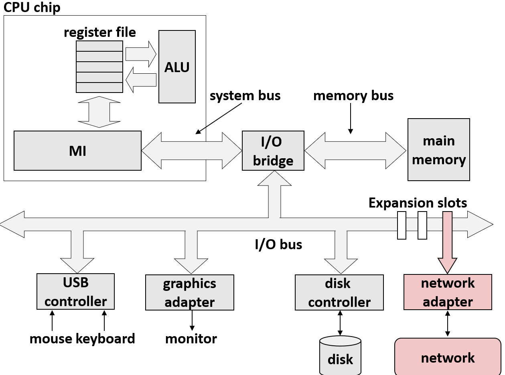
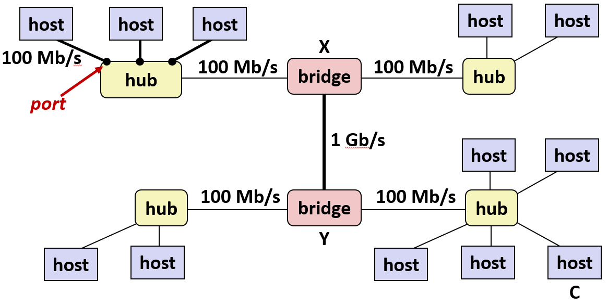
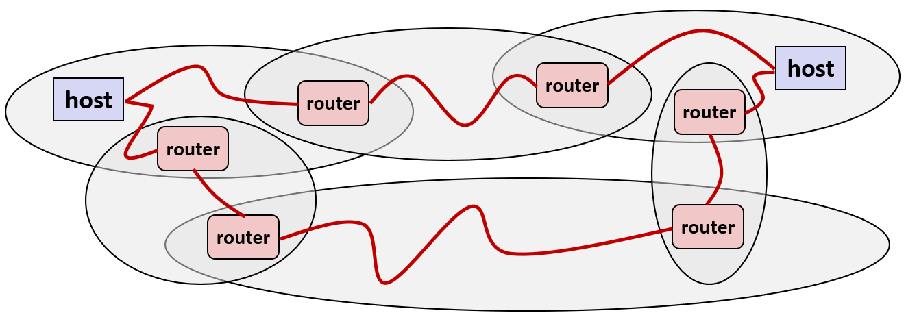
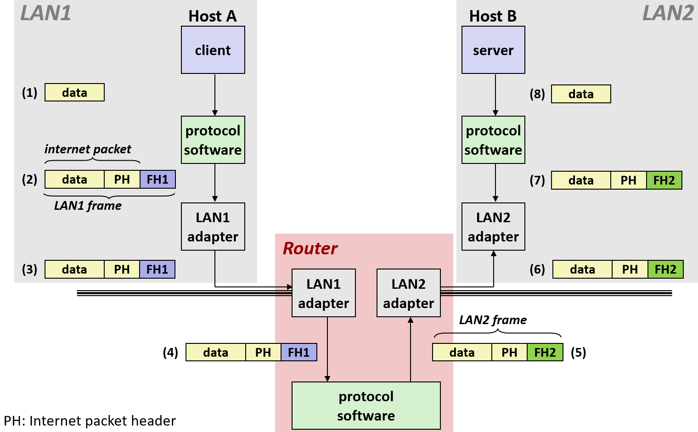
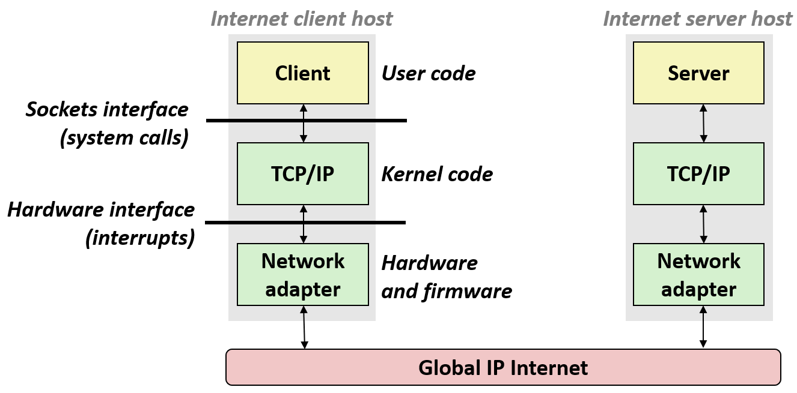
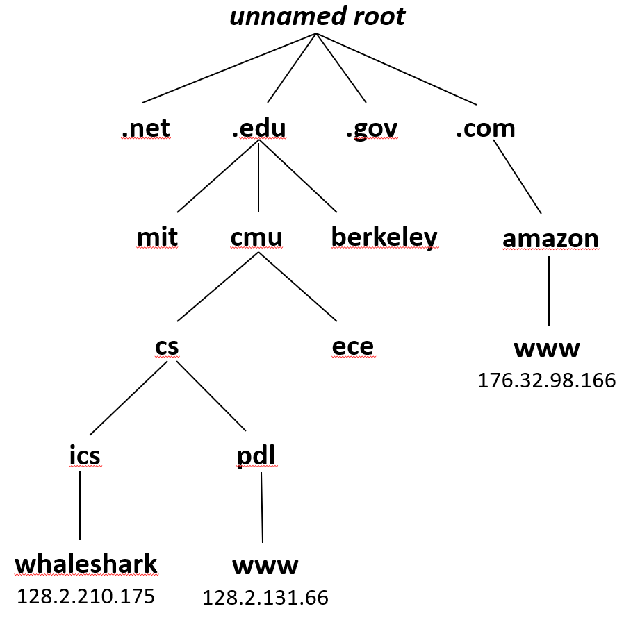
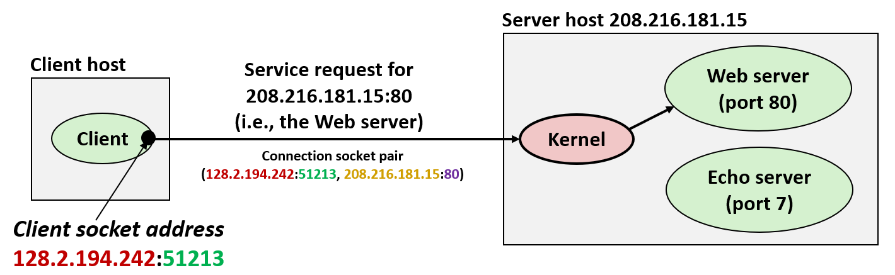
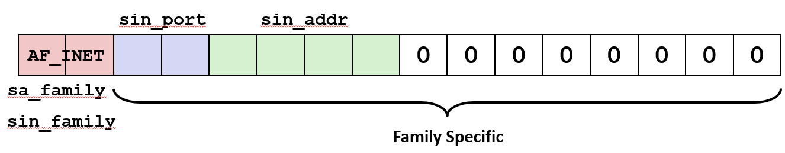
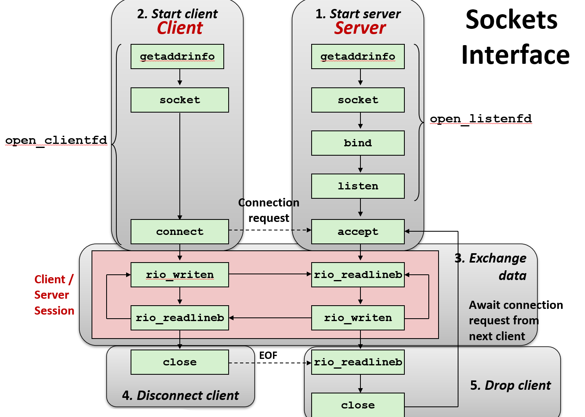
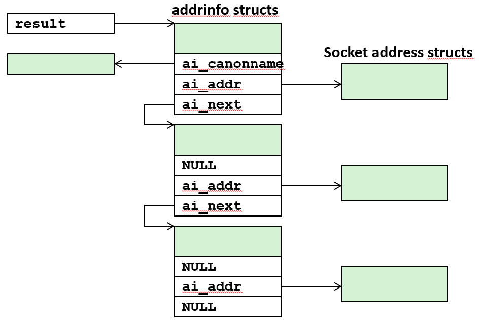

# Network Programming Part I


## 模型

### 软件方面

大多数网络系统都是基于 `Client-Server` 模型编写的, 主要的思路: 客户端想要使用某项服务, 然后客户端对服务器发出一个请求

一个服务器进程与一个或多个客户端进程协同工作, 服务器负责管理某种资源(如文件、数据库、内存块等)

服务器通过为客户端操作该资源来提供服务, 服务器由客户端的请求触发激活


> 当你在亚马逊上订购一些东西时, 亚马逊有一些服务器群, 你通过浏览器和亚马逊的一台网络服务器通信
> 
> 比如做一些交易，查找一些东西，或是提供一些信息, 然后它给了你一些你可能想要买的东西的精美图片, 交易通过你的信用卡完成
> 
> 电话是另一个有趣的例子，如果一部电话既是客户端又是服务器, 当我给其他人拨一通电话时, 我这边的电话是客户端，而他的电话是服务器
> 
> 它就在那里等待通话进来, 当通话进来时就创建了一个连接, 我们通过电话交谈，任意一边挂掉电话, 连接就断开了


现实中有许多不同的这种模型的例子，因为可以来回切换客户端和服务器的角色

---

### 硬件方面

计算机与网络的连接点被称为网卡(NIC, Network interface card): 哪怕如今它可能已经集成在主板上、不再是一张独立的卡，其底层逻辑也从未改变

这里不深入讨论硬件细节，但这里最精妙的一点在于：**对计算机而言，网卡本质上就是一个普通的 I/O 设备**

柔软且 UNIX 设计的网络 API 把网络抽象得就像一个文件, 打个比方:

**系统总线上连接**着一块硬盘，通过向硬盘写入或读取数据来完成交互

网络也**挂载在类似的系统总线**上, 当发送网络数据时，本质上就是向一个代表网络的虚拟文件进行写, 当接收数据时，就是进行读操作

先前提到的 I/O 的概念与网络编程密不可分: 这就是早期标准 UNIX 开发者创建的经典基石模型

现在这个模型不仅适用于 UNIX 也适用于 windows 和其他操作系统



---

## 据范围划分

网络就是一组被称为主机的计算机系统的层次系统, 按地理邻近度, 通过某种通信结构(线路)相互交流。根据覆盖范围划分:

**系统局域网(SAN)** 通常指的是在一个机房内部，用来把几十台、上百台服务器超高速连接在一起的网络: 交换以太网、Quadrics QSW


**局域网(LAN)** 主要部署在较小的区域内, 跨越建筑物或校园, 以太网是最突出的例子

> 比如在 CMU 校园里，就部署着一套非常复杂的网络基础设施。这个房间里的无线基站就是其中之一，当你使用无线网络或手机时，就是在与它进行交互

**广域网(WAN)** 可以跨越城市甚至国家或世界, 典型的高速点对点电话线

像 AT&T 这样的电信运营商提供接入 WAN 的通道, 它属于商业 WAN: 平时刷视频、打游戏都走这个网, 非常拥挤

科学家们在超级计算中心跑模拟实验时, 经常需要传输恐怖的数据量, 比如几个 PB 的天文观测数据或基因组数据, 走普通的商业互联网，不仅卡死, 网费也是天价

于是大学和科研机构联合起来，自己拉了一条只给科研用、不对公众开放的、极高带宽的全国性专用广域网 `Internet2`

**每当在网上发起一次简单的操作，背后都有无数极其复杂的底层基础设施在协同运转, 这就是 internet 的普适概念**

大写 I 的 `Internet` 指的是每天都在使用的、全球最大的因特网, 是一个依据特定原理和协议组织起来的具体实例

小写 i 的 `internet` 指互联网这一通用的技术概念, 即任何由多个网络连接而成的网络

> 在后期的课程中，只讨论大写 I 的 Internet, 因为大家熟知的现有的主要网络结构，对于这门课的底层理解来说足够了，不会去探讨其他小众的网络架构

---

## 互联网层次

### 以太网段

大多数底层的局域网都是基于以太网(Ethernet)技术构建的。现在以太网这个术语已经高度演进，更像是一个技术家族的统称，而不是指某一种特定的硬件

以太网段由一组主机组成, 这些主机通过电线(双绞线)连接到集线器上, 电线跨越建筑物中的房间或楼层

早期的盒子被称为集线器(Hub), 本质上是一个信号放大中继器: 任何一台电脑发送给它的数据，都会被它 **无脑广播(Broadcast)** 给所有连接在上面的机器

每个以太网适配器都有一个唯一 48b 的 MAC 地址, 例如: `00:16:ea:e3:54:e6`, 主机将比特以称为帧的块的形式发送到任何其他主机

集线器不加分辨地将每个端口的每个位复制到其他端口, 每台主机都能看到每个位

此时的网络就像是一个吵闹的派对, 每个人都在大喊大叫，所有人也都必须被迫听着别人的发言

最早期的以太网就是所有人共享一根同轴电缆，它传递的是无线电信号

> 在这个房间里使用 Wi-Fi(无线局域网)时，它的工作原理就和当年的集线器一模一样

在房间里发送的所有数据包，都共享相同的无线电频率和信道: 这就要有一套底层的冲突检测协议，来判断是否有两台主机因为同时发包而产生了信号干扰

正因为共享同一个信道，无线网络在同时容纳 100 台左右的主机通信时就会达到瓶颈。


---

### 桥接以太网

现代有线通信与早期的集线器不同, 不会盲目地向所有人广播数据, 它会了解哪些主机可以从哪些端口访问, 然后有选择地将帧从一个端口复制到另一个端口


当购买或者从有线电公司得到一个盒子时, 尽管它上面有一些端口，但实际上被称为交换机(Switch)或路由器(Router)


可以把这些设备层层级联起来, 只要建立了一个有线连接网络, 数据就能通过某种渠道从一个网络连接到另一个网络

随着网络规模变得更大、更复杂，还可以在顶层部署更高级、性能更强的交换机

虽然以太网的底层硬件和物理实现非常复杂，但在软件层面可以简单地把它抽象为：一堆可以直接相互对话的主机集合




---

### 互联网

而 Internet 本质上就是通过 路由器(Router) 把这无数个局域网拼装连接在一起

注: LAN 1 和 LAN 2 可能完全不同，完全不兼容(以太网、光纤通道、802.11*、T1链路、DSL等)


路由器内部运行着特定的路由协议，它们会根据你发送数据的**目的 IP 地址**来进行智能导航, 最终连接的是一大堆分布在世界各地的主机


通过路由器发送的数据包基于已知的寻址模式，在世界各地或者校园内部的多个路由器、交换机之间不停地跳跃，从一个端点传递到下一个端点，直到最终送达目标主机


> 关于这些路由器具体是如何工作的、它们又是如何保证高可靠性的, 这属于计算机网络(Network Infrastructure)的范畴
> 
> 在这门课里，我们假设网络工程师和内核开发者已经完美地解决了这些底层通信问题。作为系统级程序员，我们只需要关注：如何在两台主机之间建立端到端的通信




---

## 协议

### 概念

为了让不同计算机、不同厂商发行、不同电信机构协同工作, 在不兼容的局域网和广域网之间传输数据, 就需要有协议

协议是一组规则, 用于管理主机和路由器在网络间传输数据时应如何合作, 消除不同网络之间的差异: 报文格式, 如何被发送等等

### 作用

统一的互联网协议主要解决了两个根本性问题：命名方案与传递机制

它提供了统一的命名方案, 定义了主机地址的全球统一格式, 确保网络上的每台主机以及路由器都被分配了至少一个能够唯一标识它的互联网地址

只有建立了这种命名规则，才有可能在发送报文时，精准地指定目标主机是谁

它提供了一种标准的数据传递机制, 定义了标准的传输单元，也就是数据包(Packet)

每个数据包都由包含了数据包大小、源 IP 和目的 IP 等导航信息的头部(Header)和实际想要发送的数据(Payload)两部分组成


> "把所有的数据分到一个个数据包中"这个观点第一次出现的时候, 它并未被普遍接受

数据包通常只有 1000 到 2000 字节: 如果有一条很长的完整报文，操作系统在底层会将其切分成许多个独立的数据包依次发送，由路由系统将它们送达目的地

**分组交换(Packet Switching)机制** 已经高度成熟并被世界普遍接受, 但在互联网诞生之初, 这个**把所有数据切碎成包再发送**的观点是非常前卫且备受质疑的


因为当时统治世界的是传统的"电路交换(Circuit Switching)"电话系统: 如果二者电话，会有一组由电话公司维护的, 仅供通信双方专用的线路被保留和锁定

在整个通话过程中，这条线路被完全独占，即便两人保持沉默，别人也无法使用。而现代互联网彻底打破了这种高成本的锁定模式，改用数据包在共享的网络中高效穿梭。

### 封装

要想把一条报文从主机 A 发往主机 B, 必须像把信件装进信封一样, 将要传递的数据包进行层层封装




首先操作系统中的网络软件堆栈会自动介入，将提供原始的一组字节数据附加上一个互联网协议包头(PH，Packet Header)

这个包头规定了跨越广域网、实现主机到主机长途导航的路由信息。在数据包传输的不同阶段， 携带的 Header 数量是动态变化的，而且每一层运行着完全不同的协议


当数据包要流向具体的物理硬件时，又会附加上一个本地网络帧头(FH，Frame Header), 专门用于在当前局域网内部进行点对点传输的特定标记

完成这些封装后, **网卡(网络适配器)**便负责将这串带有双层报头的字节流通过物理介质发送出去

接收端的网卡在物理层接收到数据后, 其内部的网络栈便开始反向执行**剥离**的操作: 先检查并拆掉最外层的局域网帧头,然后再拆掉互联网包头

经过这样层层剥离后，最终位于应用层的主机 B 就能完全过滤掉复杂的路由细节，仅仅看到最初发送的那段纯粹的数据


> 解决不同的网络具有不同的最大帧大小; 路由器如何知道将帧转发到哪里; 当网络拓扑发生变化时，如何通知路由器; 如果数据包丢失了怎么办
> 
> 这些和其他问题由被称为计算机网络的系统领域来解决

---

## 协议族

### IP

Internet 底层依赖于一系列特定的协议族, 其中最基础的叫 **IP 协议(Internet Protocol)**, 它定义了主机的命名方式以及数据包/报(Datagram)的发送规则

底层的 IP 协议是完全不可靠的, 它采用的是 Best-Effort 的传输机制: 数据包在网络节点间传输时，没有问题则继续前进; 出现问题 IP 层的数据包就会直接丢失


> 但如果线路拥堵，或者周围有人启动微波炉带来了射频信号干扰, IP 协议甚至不会发送任何报错或道歉，只是默默地将它丢弃
>
> 虽然作为程序员我们应当熟悉网络的分层架构，但几乎没有人愿意直接在纯 IP 层上编写业务代码。

### UDP

为了解决或利用这种特性, 在 IP 层之上发展出了两种不同的传输层协议: 用户数据报协议(UDP)和传输控制协议(TCP)

UDP 协议只是在 IP 层之上做了一层极简的软件封装: 它完美继承了 IP 的不可靠性，发出去的包丢了就丢了

> 但在某些特定场景下它非常有用: 比如网络游戏、语音通话或视频直播，这些应用追求极高的实时性，即使偶然漏掉一两个数据包也无所谓

### TCP

TCP 协议承载了整个互联网超过 99% 的网络流量。它提供了一种如同传统电话般绝对可靠的**面向连接**的通信渠道

虽然由于网络波动 TCP 时快时慢，但为绝不丢失数据, TCP 还在底层做了极其复杂的工作:
- 它负责把你的长数据切分成一个个 IP 数据包
- 如果某个包在路上丢了，它会自动发起重传直到成功
- 由于不同的数据包可能走不同的路由路径导致乱序, TCP 还会负责在接收端将包重新按正确顺序排列

> 作为应用层程序员，我们不需要关心 TCP 到底是怎么切包、重传和排序的

TCP 成功将复杂的网络通信抽象成了一个纯粹的流(Stream)连接, 这正好完美对应了 UNIX 的文件 I/O 模型

只需要持续向这个连接写入数据, 网络就会自动把数据送过去; 另一端也只需要像读文件一样读取数据

允许像读写文件一样去操作 TCP/IP 网络的接口, 就叫做套接字(Socket)

> 这就是我们接下来要重点死磕的 Socket 编程



从软硬件系统层面观察, 客户端和服务器都是以应用程序的形式, 在其主机上的相应端点处被实现的

它们使用的软件和库是由用户态和核心态共同运行的, 因此可以使用 API 直接访问资源进行 socket 编程

---

### IPv4 IPv6

尽管下一代技术 IPv6 正在普及, 但自 20 世纪 80 年代起实施的第四代互联网协议(IPv4)依然是目前应用最广泛的现行标准

在 IPv4 中的每台主机都会被映射为一个 32b 的二进制 IP 地址, 为了方便人类阅读, 会再将其表示为**点分十进制(Dotted-Decimal)**, 例如: `128.2.203.179`

点分十进制由 4 个以点分隔的十进制数组成, 由于每一段在底层仅占 8 位的长度, 因此每个数字的取值范围严格限制在 0 到 255 之间


值得注意的是 IPv4 只有 32b, 去掉一些被保留的专用地址, 最多只能表示 43 亿个地址: **根本不够全球百亿级**的手机、电脑、服务器、智能设备分配

**因此发明了子网划分(CIDR)、私有地址(Private IP)、NAT(网络地址转换)三项核心技术来弥补, 其中起到决定性作用的是 NAT**


在网络传输和内存存储时，这些 32b 的 IP 地址必须统一采用大端字节序，这在工业界被称为**网络字节序(Network Byte Order)**

这四段字节并不是随机分配的，它们代表了不同层次的路由拓扑信息: 这些数字地址最终会被映射到一组人类易读的因特网域名(Domain Name)上

> 以 CMU 为例，任何以 128.2 开头的 IP 地址都属于卡内基梅隆大学。本质上，这意味着 CMU 拥有这整个 IP 地址块的所有权
> 
> 由于前 16 位被学校固定，剩下的 16 位可以自由分配，这为校园内的用户提供了多达 2^16(65536)个不同的独立 IP 地址空间

因特网工程任务组 (IETF) 在 1996 年推出了 128b 地址的第六代因特网协议版本(IPv6) 

下一代的 IPv6 协议提供了 128b 的地址，这是一项已经存在了 15 年的技术, 但到今天它的采纳率仍然很低

截至2015年，绝大多数因特网流量仍由 IPv4承载, 只有 4% 的用户使用 IPv6 访问谷歌服务

---

## IP地址

> 这绝对是一个让你极其渴望能换掉 C 语言、改用现代语言编程的领域，因为这里的历史包袱实在是太混乱了。
> 
> 绝大多数核心网络协议(TCP/IP、套接字等)在现代 C 语言标准确立之前就已经被设计出来了。
>
> 比如大家熟知的 Kernighan 和 Ritchie 的经典著作《C 程序设计语言》其早期版本乃至后来的 ANSI C / ISO C 标准确立时，很多现代语言特性还没有诞生
> 
> 举个最典型的例子，那个时代甚至连 `void*` 都还没有被发明，程序员不得不使用 char* 来充当空类型指针
> 
>所以，如果你在阅读网络编程的 API 接口时觉得它们设计得非常混乱、别扭，不用怀疑，你的直觉完全是对的，它就是一堆历史妥协的产物

在代码底层中定义了许多千奇百怪的结构体, 其中用来存储 IPv4 网络地址的最基础结构体叫做 `in_addr`: 它的内部只有一个 32b 的无符号整数

```c
/* Internet Address structure */
struct in_addr {
    uint32_t  s_addr; /* network byte order (big-endian) */
};
```


> 当年制定互联网协议的先驱们一定是**大端字节序**的坚定拥护者

所以即便如今世界上绝大多数的个人电脑和服务器 CPU(如 x86 架构)都采用小端字节序，网络传输却依然强制使用大端字节序

对于跨网络传输的数据包, 操作系统内核不干涉、不处理其**有效载荷**的字节序

但对于 Header 中用于路由和标识的所有元数据(如 IP 地址和端口号)，都必须强制转换为统一的网络字节序(大端序)


标准库提供了一系列字节序转换函数: 无论程序是运行在大端序还是小端序的硬件上，这些函数都能自动转换


函数名|全称拆解|输入/输出数据类型|转换方向|核心应用场景
-|-|-|-|-
htonl|Host to Network Long|uint32_t (32位无符号整型)|主机字节序 → 网络字节序|转换 IPv4 地址
htons|Host to Network Short|uint16_t (16位无符号整型)|主机字节序 → 网络字节序|转换 端口号 (Port)
ntohl|Network to Host Long|uint32_t (32位无符号整型)|网络字节序 → 主机字节序|解析收到的 IPv4 地址
ntohs|Network to Host Short|uint16_t (16位无符号整型)|网络字节序 → 主机字节序|解析收到的 端口号 (Port)

> 这些函数中没有用于转化 64 位数据的函数, 我不知道人们都是怎么做的，但就我个人，我会自己编写一个函数来实现这一功能
> 
> 我也可能不会这么做，因为我知道另一端的机器肯定是小端字节序的 

函数 `inet_pton` 把人类看懂的字符串(Presentation)转换成网络大端序的二进制整数(Network), 而函数 `inet_ntop` 则是反过来

但它们只负责转换数字, 实际写代码时, 还有别的要去做: 比如调另外的古董函数(gethostbyname)把域名转化为 IP; 判断 IPv4 和 IPv6


现代网络编程标准(POSIX)推出了函数 `getaddrinfo` 和 `getnameinfo` 将**域名解析**和**格式转换**合二为一

---

## DNS


当访问网站时, 从来不需要思考它的 IP 地址是多少，而是直接在浏览器中输入 `www.google.com`, 类似 www.google.com 这样的字符串被称为域名(Domain Name)

域名代表着一套分层命名系统(Hierarchical Naming System): 

.edu|.com|.net|.de|.cn
-|-|-|-|-
教育机构|商业公司|网络基础设施|德国|中国

上面这些被称为顶级域名(TLD, Top-Level Domains), 在顶级域名之下，延伸出了层层嵌套的**树状管理体系**



将域名精准映射到机器能够识别的 32 位二进制地址的工作是由一个全球性的超大型分布式数据库系统 **DNS(Domain Name System)** 来协同完成的

DNS 的核心管理模块在最顶层，被称为根域名服务器(Root Name Server)

在根服务器之下，针对每一个顶级域名，都有专门的超级机器集群(顶级域名服务器)负责追踪管理映射到该后缀下的所有下一级 IP 地址

> 以 CMU 为例，大学获得了 cmu.edu 的权威命名权。此后，CMU 就可以在校园内部署自己的权威本地 DNS 服务器。
> 
> 每当有人想要查询类似于 cs.cmu.edu(计算机系)对应的具体 IP 地址时，这套去中心化的分布式协议就会高效运转，通过多级查询最终返回正确的 IP 结果。
> 
> 这种完全分散(Decentralized)的设计，正是支撑整个互联网域名解析的高超机制

可以在概念上将 DNS 数据库视为数百万个主机条目的集合, 每个主机条目代表一组域名和 IP 地址之间的映射

输入一个域名, 返回一个或多个 IP 地址; 输入一个 IP 地址, 返回一个或多个域名

### 演示

使用 hostname 确定本地主机的真实域名：
```bash
linux> hostname
whaleshark.ics.cs.cmu.edu
```

在大部分机器上叫做 nslookup 来探测 DNS 映射的属性: 输入域名得到 IP 地址; 输入 IP 地址得到域名

每个主机都有一个本地定义的域名 localhost 映射到环回地址 127.0.0.1
```bash
linux> nslookup localhost
Address: 127.0.0.1
```

> 我将给你们展示一些代码, 下面是使用 nslookup 查询计算机科学学院的网址的输出例子

下面的输出告知了哪个 DNS 服务器返回了这些信息, 还告知了 `www.cs.cum` 实际上是一个更奇怪的域名 `WEB-LB.SRV.cum.edu` 的代名词


```bash
Randals-MacBook:22-netprog2 bryant$ nslookup www.cs.cmu.edu
Server:             128.2.1.10
Address:            128.2.1.10#53

Non-authoritative answer:
www.cs.cmu.edu canonical name = WEB-LB.SRV.cs.cmu.edu.
Name:   WEB-LB.SRV.cs.cmu.edu
Address: 128.2.217.13 # 它的 IP 地址是以 128.2 开头的，接着是 217.13
```


> 我也可以用它查询斯坦福大学计算机系域名的相关信息, 它会返回它的 IP 地址是 `171.64` 开头的一串数字
>
> 这个子域名 `www.cs.stanford.edu` 是由对应的权威 DNS 服务器独立管理的
> 
> 当访问 www.cs.stanford.edu 时，它真实域名节点其实是 cs.stanford.edu


```bash
Randals-MacBook:22-netprog2 bryant$ nslookup www.cs.stanford.edu
Server:             128.2.1.10
Address:            128.2.1.10#53

Non-authoritative answer:
www.cs.stanford.edu          canonical name = cs.stanford.edu.
Name:   cs.stanford.edu
Address: 171.64.64.64

```


域名和 IP 地址间的映射不是一一对应的: 可以有多个域名对应同一个 IP 地址, 也可以有多个 IP 地址对应一个域名

比如使用 `nslookup` 查询 `twitter.com` 的 IP 地址时, 返回了四个不同的地址: 

```bash
Randals-MacBook:22-netprog2 bryant$ nslookup ww.twitter.com
Server:             128.2.1.10
Address:            128.2.1.10#53

Non-authoritative answer:
ww.twitter.com canonical name = twitter.com.
Name:   twitter.com
Address: 199.16.156.38
Name:   twitter.com
Address: 199.16.156.230
Name:   twitter.com
Address: 199.16.156.70
Name:   twitter.com
Address: 199.16.156.198
```

如果重复一次, 就可以看到返回了和上一次不完全相同的地址: 比如说这次返回的 `199.16.156.6` 在上一次中没有出现

```bash
Randals-MacBook:22-netprog2 bryant$ nslookup ww.twitter.com
Server:             128.2.1.10
Address:            128.2.1.10#53

Non-authoritative answer:
ww.twitter.com canonical name = twitter.com.
Name:   twitter.com
Address: 199.16.156.38
Name:   twitter.com
Address: 199.16.156.6
Name:   twitter.com
Address: 199.16.156.230
Name:   twitter.com
Address: 199.16.156.70
```

第二次返回了一组有轻微不同的地址, 而且它的返回顺序也变了, 出现这个现象实际是因为它有许多的服务器

当请求访问 Twitter 或任何主流网站时，并不是一个单一的中心服务器在处理全球所有人的流量, 而是服务器集群分布在全球成千上万个不同的**地理位置**

像 Google 这样的巨头会持续对它的分布式 DNS 服务器进行动态升级与实时调整

当外部发起域名解析请求时，DNS 服务器会识别地理位置并动态返回一个在地理上最近、网络延迟最低的服务器 IP 地址

所以域名与IP地址之间的映射关系在底层往往是多对多的：
- 在北京、伦敦和纽约的用户通过 DNS 解析出来的二进制 IP 地址是完全不同的
- 为了承载高并发，上百个不同的二级域名也可能同时指向同一组高防服务器集群

在整个 DNS 树状分级命名系统中，许多中间节点的域名, 只是为了规范层级而存在，它们并不会直接映射到任何特定的物理主机 IP 上

```bash
linux> nslookup ics.cs.cmu.edu
# Can't find ics.cs.cmu.edu: No answer
```

---

## 端口

客户端与服务器之间通过在 Connection 上发送字节流来进行通信, 这种连接主要由 TCP 实现, 并具备三个至关重要的底层属性：

- 点对点(Point-to-Point)：每个连接都精准地建立在两个主机的进程对之间

- 全双工(Full-Duplex)：主机 A 向 B 发送数据的同时, B 也能向 A 发送数据

- 可靠(Reliable)：发出的字节流会以完全相同的顺序、完好无损地被接收方接收

连接的每一个端点(Endpoint)都被称为一个Socket(套接字), 而 Socket 地址的形式是"IP地址 : 端口号"

当另台机器通信时, 它上面可能同时运行着许多种不同的进程: 可能同时运行 SSH 远程管理服务器、一台 FTP 文件服务器，同时还兼任着邮件服务器和 Web 网页服务器

为了能让操作系统精确地区分数据该交给哪个具体的进程，就必须引入一个 16b 的整数作为端口号来标识


当用浏览器上网并同时连接几十台主机时，客户端内核会在发起连接请求的那一刻，自动为分配一个随机端口。

这个端口是动态的, 被称作临时端口(Ephemeral Port): 只在连接存在期间有效，一旦连接断开、生命周期结束，就会被内核默默回收

为了方便全球客户端访问, 服务器的端口是固定分配的, 被称作公认端口(Well-Known Port)

80|443|22|7|25
-|-|-|-|-
普通的万维网网页服务(HTTP)|加密网页服务(HTTPS)| SSH 远程登录 | 回显 echo 服务器|邮件(smtp)服务器

> 尽管这种固定独占的分配模式在端口空间上看起来是一种巨大的浪费, 但它确保了所有客户端都能通过这些标准的端口直接获取特定的服务

知名端口和服务名称之间的映射包含在每个 Linux 机器上的文件 `/etc/services` 中

它们是互联网标准的一部分，不仅是不同端口的标识符, 还告知了端口提供何种服务，以及对应协议的内容



内核需要区分来到这台机器的不同连接, 并且为各个连接启动它们需要的软件和进程

每个端口都有特定的进程执行程序: 一个客户端同时和单一服务器上的不同端口通信也是完全可能的


---

## 套接字

接下来的套接字(socket)接口与 Unix I/O 是一组与 Unix I/O 结合使用的系统级函数，用来构建网络应用


套接字接口创建于80年代初，是Unix最初 Berkeley 发行版的一部分，其中包含早期版本的因特网协议

可用于所有现代系统: Unix 变体、Windows、OS X、IOS、Android、ARM


对内核来说, 套接字是通信的端点; 但对应用程序来说, 套接字是文件描述符, 客户端和服务器通过读写套接字描述符进行通信

所有 Unix I/O 设备、包括网络都被抽象成文件, 普通文件 I/O 和套接字 I/O 之间的主要区别在于应用程序如何**打开**套接字描述符

> 虽然在硬件层面或是软件底层它们的本质有很大的区别, 但你作为一个应用程序员需要看到它们的一些共同点

---

### 地址结构


> 在这个部分你是会想要使用有面向对象的语言来编程的, 但你并不能用，你得用 C 语言来编程


因为当年设计套接字接口时, 还没有发明 `void*`, 并且为了让 connect、bind 和 accept 等系统调用能够接收任何类型的网络地址

所以设计者们使用**伪泛型**的强转技巧, 发明了套接字地址结构体 `struct sockaddr`

```c
struct sockaddr { 
    uint16_t  sa_family;    /* Protocol family */ 
    char      sa_data[14];  /* Address data.  */ 
};       
```

该结构体固定长 16B, 开头 2B 大小的协议族(sa_family)用来指明当前 Socket 到底属于什么网络类型, 14B 的 `sa_data` 则统一留作通用的地址数据

**为了书写方便，通常遵循著名的 Stevens 规范，将其重命名为 `typedef struct sockaddr SA`**<span id="SA"></span>

用于 IPv4 socket 的结构体叫做 sockaddr_in。可以将其视为 struct sockaddr 的一个**子类**, 它们在内存布局上是完美向下兼容的



```c
struct sockaddr_in  { 
    uint16_t        sin_family;  /* 2B 的协议族, 在 IPv4 中被固定设置为 AF_INET */ 
    uint16_t        sin_port;    /* 2B 的端口号 */ 
    struct in_addr  sin_addr;    /* 4B 的 IP 地址结构体 */ 
    unsigned char   sin_zero[8]; /* Pad to sizeof(struct sockaddr) */ 
}; 
```

由于 IPv4 的实际有效数据只需要 8 个字节（2字节协议族 + 2字节端口 + 4字节IP）

为了让总长度能够和 sockaddr 的 16B 对齐, 协议在末尾使用了一个 8B 的 `sin_zero[8]` 数组进行全 0 填充


正是因为伪继承关系, 将封装好具体 IP 和端口的 `sockaddr_in*` 指针传递给系统调用时，必须显式地将其强制类型转换为 `sockaddr *`

通过这种巧妙的内存对齐与强转，内核便能完美兼容并解析各种不同协议族的地址信息


即便在小端序的 x86 机器上运行, 字段 `sin_port` 和 `sin_addr`在内存中都必须被转换为大端网络字节序

---

### 接口

> 这就是程序员对 `Client-Server` 系统的完整流程的理解, 在这节课的剩余时间和周四的整节课上，我们将一步步实现整个过程
> 
> 而你们作为程序员必须理解每一个步骤: 每一步在做什么？它们为什么要这么做？怎么利用它们？
> 
> 好消息是一些最基本的模块已经是现成的了, 你们可以从书本之外的一些地方找到现存的代码并使用它们，这会使这一部分没有想象中的那么痛苦



图片的右半部分是服务器需要处理的步骤, 左半部分则是客户端要处理的步骤

第一步在右边主机上运行一个服务器程序, 准备接受客户端发送的连接请求并提供各种服务

第二步在左边主机上启动一个使用这些服务的客户端, 准备向服务端发送请求

第三步是, 有一个叫做会话(Session)的部分在客户端和服务器之间来回通信

任何应用程序都需要这个, 它包括了 rio_ 开头的多个函数，是 UNIX I/O 系统中的一部分 I/O 函数, 用于读写 rom 并处理一些底层 I/O 的操作

第四步是客户端主动结束连接, 就像挂电话一样; 第五步是服务器想要主动结束连接
 

最上方的 getaddrinfo 函数是整个流程的开端，用于查找从域名到 IP 地址的映射

#### socket

所以客户端和服务器要做的第一步都是通过调用 socket 函数来创建连接

主机使用 socket 函数来创建一个套接字描述符。函数 socket 不会使用操作系统，也不会往网络上发送任何内容, 只是为了创建一个 socket:
```c
int socket(int domain, int type, int protocol);
```
```c
int clientfd = socket(AF_INET, SOCK_STREAM, 0);
```

参数 AF_INET 表示正在使用 32b 的 IPv4 地址; 参数 SOCK_STREAM 表明使用 TCP 连接, 也被称为流连接，可以双向发送任意字节数据流

不过最好的方法是用 getaddrinfo 函数来自动生成这些参数，这样代码就与协议无关了

所有字母大写的参数都是包含在各种 .h 文件里的常量, 写代码的时候应该包含这些头文件

函数 socket 返回一个文件描述符，可以通过它找到一个文件

> 关于如何进行 socket 编程有一些文档, 但如果你想通过读那些东西来学会 socket 编程，你会疯掉的

#### bind


服务器端的 bind 函数用于将文件描述符(File Descriptor)与具体的套接字地址关联起来

函数 bind 函数接收 socket 返回的文件描述符, 一个代表套接字地址的结构体指针 sockaddr([SA](#SA)), 该地址结构体的实际长度(addrlen)

```c
// 成功返回 0, 失败返回 -1
int bind(int sockfd, SA *addr, socklen_t addrlen);
```

> 在纯 IPv4 的场景下，这个长度通常是 16 字节(尽管 IP 地址本身是 4B)，但作为现代程序员，你几乎不再需要去手动硬编码这个数字

函数 getaddrinfo 是在最新版的《CSAPP》中引入的现代网络编程的标准 API, 这是旧版教材中没有的重大技术更新

函数 getaddrinfo 能够自动为生成所需的 addr 以及 addrlen, 实现了协议无关性: 让服务器程序能够极其平滑地在 IPv4 和 IPv6 之间自由切换

当有网络数据到达这个指定的 addr 时, 运行在用户态的进程只需通过读取 fd, 就能源源不断地从连接中获取字节流

对 fd 进行写入操作，数据就会沿着这个特定端点的连接，安全、可靠地传输给网络另一端的客户端

---

#### listen

函数 socket 创建的描述符默认为客户端的**主动套接字**, 服务端需调用 `listen` 函数切换到监听状态

```c
// sockfd 为需要被转化的主动套接字
// backlog 在开始拒绝连接请求前，放入队列中等待的未完成的请求的数量
// 成功返回 0, 失败返回 -1
int listen(int sockfd, int backlog);
```

> 很显然 bind 函数和 listen 函数是有关的, 但你必须按这个特定的顺序去执行这两步来创建一个监听 socket

---

#### accept

服务器通过调用 accept 函数进入阻塞状态，以此来等待内核分发已经建立好的客户端连接

```c
int accept(int sockfd, SA *addr, int *addrlen);
```

在 Linux 内核中的每个进程都有一个独立的文件描述符数组，而拿到的那个 fd 本质是该数组的下标(Index)

该数组是一个结构体指针数组: 数组的每个元素都是一个指向 `struct file` 的指针

```c
// struct file *: 结构体指针
// __rcu: Read-Copy-Update 锁机制的类型标记
struct file __rcu * fd_array[NR_OPEN_DEFAULT];
```

内核会统计有多少个 fd 指向一份文件, 每当调用 close(fd), 那么对应文件的引用计数就会减少

当引用计数变为 0 时, 内核才会触发真正的销毁流程: 销毁在内存里的缓冲区和控制块

```c
struct sockaddr_storage clientaddr; 
socklen_t clientlen;

while (1) {
    clientlen = sizeof(clientaddr);

    // 1. 没有客户端连接到服务端时, 服务器线程被阻塞, 进入冬眠, 不占用 CP
    // 2. 一旦有一个客户端调用 connect 并且完成了三次握手
    //    服务器线程就会被唤醒, accept 返回全新的 connfd
    int connfd = accept(sockfd, (SA *)&clientaddr, &clientlen);
    
    // clientaddr 留空即可, 每次 accept 成功都会自动填充 clientaddr
    
    // 3. 创建一个子进程去操作 connfd
    if (fork() == 0) { 
        // 子进程将父进程的内存(变量、堆、栈)复制, 拥有完全独立的内存空间, 对该文件的引用增加
        // 调用 close 内核把子进程的 FD 数组中对应的位置清空, 减少对文件引用的计数
        close(listenfd);
        // 对返回的全新 connfd 进行读写操作
        do_something(connfd); 
        close(connfd);
        exit(0);
    }

    // 4. 循环结束, 接着 accept 阻塞进程以等待其他客户端的连接
}
```

---

#### connect

参数 addr 里填充的都是目标服务器的信息, 客户端通过调用 connect 尝试与服务器建立连接: 
```c
// 成功返回 0, 失败返回 -1
int connect(int clientfd, SA *addr, socklen_t addrlen);
```

在 Linux 内核中有一张由哈希表实现的 TCP 建立连接表(Established Socket Table)

当调用 connect 成功返回 0 时，内核就会在这张表里正式记录得到的连接

得到的连接是由一对儿套接字表征的(客户端地址:临时端口, addr.sin_addr:addr.sin_port)

---


**网络 I/O 在底层的逻辑始终像是在读写一个普通文件**: 通过捕获 EOF 结束连接，然后主线程重新回到 accept 处等待连接

当客户端决定关闭通信, 向服务器发起断开连接的请求后, 服务器读取套接字时会看到 EOF标志

于是服务器关闭这个专属连接并释放资源, 服务器程序紧接着会再次进入 accept 函数阻塞挂起，去等待并接受来自其他全新主机的连接请求


服务器一次只管理一个客户端的连接请求, 被称作 **串行服务器(Iterative Server)**

> 为了打破这种低效的僵局，我们在接下来的第 22 节课中将正式死磕多线程/多进程并发服务器（Concurrent Server）。
> 
> 我们将学会如何通过合理的线程设置，让服务器在好整以暇地处理当前客户端业务的同时，大门口依然能够源源不断地接受新的连接请求。

---

#### getaddrinfo


函数 getaddrinfo 用于替代过时的函数 gethostbyname 和 getservbyname, 可以将主机名、主机地址、端口和服务名称的字符串表示转换为套接字地址结构


旧网络函数是在多线程技术之前设计的, 其底层大量使用了静态分配的全局缓冲区，这导致在多线程高并发环境下, 极易发生数据覆盖和线程安全灾难

函数 getaddrinfo 具备可重入性, 每次调用都会在堆上动态申请独立内存, 从而可以被多线程程序安全、无锁地并发使用

```c
// 这里的 char* 指的是真的字符串, 并不是在还没有 void* 的时代作为空指针使用
int getaddrinfo(const char *host,            /* Hostname or address */
                const char *service,         /* Port or service name */
                const struct addrinfo *hints,/* 输入参数, 提示, 提高兼容性 */
                struct addrinfo **result); /* 返回一个由 struct addrinfo 组成的链表 */

void freeaddrinfo(struct addrinfo *result);  // 释放返回的数据结构所用的空间

const char *gai_strerror(int errcode); // 解释程序返回值中的各种错误代码的含义
```

同时对参数 `hints` 进行配置, 实现了网络参数的抽象, 允许编写完全独立于协议、具备极强可移植性的代码

函数 getaddrinfo 像一个**协议管理器**，为了同时兼顾 IPv4、IPv6、TCP 和 UDP, 引入了大量冗余的配置项和复杂的参数组合

> 通常只需要掌握少数几种固定的经典代码模式, 就足以应付绝大多数的网络编程场景了

返回的链表 `result` 将 IPv4 和 IPv6 自动解析并串联在同一根链表中, 同时完美适配 IPv4 和 IPv6

函数 getaddrinfo 会直接返回庞大复杂的地址结构体链表, 而不会隐藏掉底层的繁琐细节





链表 result 以 NULL 结尾, 每个节点都通过一个指针指向下一个节点，从而将所有结果串联起来

头节点中有 IP 地址对应的 CNAME, 随后的节点则封装了具体的地址信息, 例如经过二进制编码的 IPv4 或 IPv6 地址

像先前的例子一样传入 twitter 返回四个不同的地址: 那么链表实际就是一个有五个节点的链表, 头结点是它的规范名, 之后四个节点中的每个节点都会含一个 IP 地址

当遍历这个链表, 试着一个一个使用这四个地址, 如果第一个地址无法使用，会尝试第二个，第三个，直到用完链表中的所有地址为止


每个 addrinfo 结构都包含可以直接传递给套接字函数的参数: 其中 `struct sockaddr *ai_addr` 可以直接传递给 connect 和 bind 函数

```c
struct addrinfo {
    int              ai_flags;     /* Hints argument flags */
    int              ai_family;    /* First arg to socket function */
    int              ai_socktype;  /* Second arg to socket function */
    int              ai_protocol;  /* Third arg to socket function  */
    char            *ai_canonname; /* Canonical host name */
    size_t           ai_addrlen;   /* Size of ai_addr struct */
    struct sockaddr *ai_addr;      /* Ptr to socket address structure */
    struct addrinfo *ai_next;      /* Ptr to next item in linked list */
};
```

---

#### getnameinfo

函数 getnameinfo 用于替代过时的函数 gethostbyaddr 和 getservbyport, 可以将套接字地址转换为相应的主机和服务, 有 IP 地址就可以查询对应的域名


```c
int getnameinfo(const SA *sa, socklen_t salen, /* In: socket addr */
                char *host, size_t hostlen,    /* Out: host */
                char *serv, size_t servlen,    /* Out: service */
                int flags);                    /* optional flags */
```


下面是一个使用了上述函数的示例程序, 本质上就像探索 DNS 服务器一样, 在 getaddrinfo 中设置的参数是想要传入的名字的字符串

因为不需要提供任何提示, 所以将 hints 结构体中的数据全部设为 0, 并且设置为用 IPv4 地址的 TCP 连接

而 listp 和 p 代表的是由 addrinfo 结构体构成的链表的指针, 之后可以遍历链表并调用 getnameinfo 函数


```c
#include "csapp.h"

int main(int argc, char **argv)
{
    struct addrinfo *p, *listp, hints;
    char buf[MAXLINE];
    int rc, flags;

    /* Get a list of addrinfo records */
    memset(&hints, 0, sizeof(struct addrinfo));
    hints.ai_family = AF_INET;       /* IPv4 only */
    hints.ai_socktype = SOCK_STREAM; /* Connections only */
    if ((rc = getaddrinfo(argv[1], NULL, &hints, &listp)) != 0) {
        fprintf(stderr, "getaddrinfo error: %s\n", gai_strerror(rc));
        exit(1);
    }

    /* Walk the list and display each IP address */
    flags = NI_NUMERICHOST; /* Display address instead of name */
    for (p = listp; p; p = p->ai_next) {
        Getnameinfo(p->ai_addr, p->ai_addrlen, 
                    buf, MAXLINE, NULL, 0, flags);
        printf("%s\n", buf);
    }

    /* Clean up */
    Freeaddrinfo(listp);

    exit(0);
}

```


```bash
whaleshark> ./hostinfo localhost
127.0.0.1

whaleshark> ./hostinfo whaleshark.ics.cs.cmu.edu
128.2.210.175

whaleshark> ./hostinfo twitter.com
199.16.156.230
199.16.156.38
199.16.156.102
199.16.156.198
```