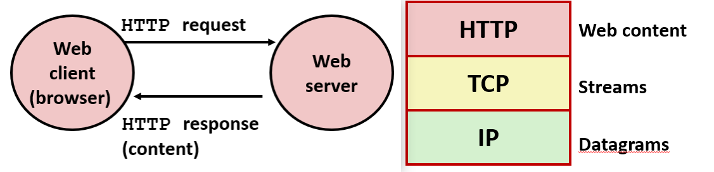
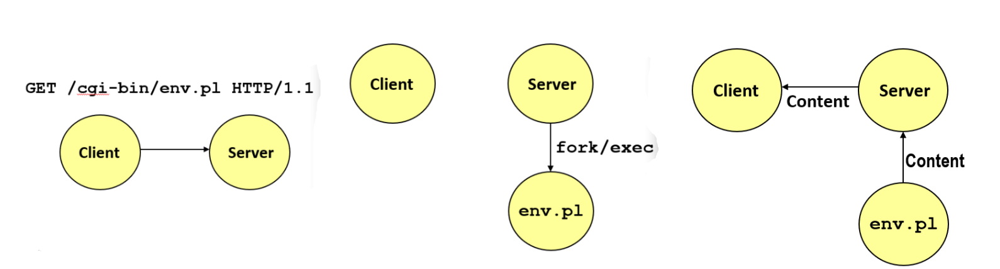

# Network Programming Part II

## 套接字接口

### 客户端

首先通过 getaddrinfo 函数来配置和发起连接, 这里通过设置 hints 提供一些更具体的配置信息


将套接字类型 ai_socktype 指定为 SOCK_STREAM, 建立的是 TCP 连接


虽然 getaddrinfo 支持像 "http" 或 "ssh" 这样的标准服务名称字符串, 但这里特殊指定了数字形式 AI_NUMERICSERV 的端口号 80

标志位 AI_ADDRCONFIG 能确保只有在本地配置了相应网络协议(如 IPv4 或 IPv6)时, 才会返回对应的地址

当带着这些配置 hints 调用 getaddrinfo 时, 它会根据我们的要求, 返回一个由潜在服务器地址构成的结果链表


```c
int open_clientfd(char *hostname, char *port) {
  int clientfd;
  struct addrinfo hints, *listp, *p;

  // 获取潜在的服务器地址列表
  memset(&hints, 0, sizeof(struct addrinfo));
  hints.ai_socktype = SOCK_STREAM;  // 开启一个 TCP 连接
  hints.ai_flags = AI_NUMERICSERV;  // 显式指定端口参数为纯数字字符串
  hints.ai_flags |= AI_ADDRCONFIG;  // 推荐配置, 根据本地网络环境过滤地址
  Getaddrinfo(hostname, port, &hints, &listp);

  // 遍历地址链表, 直到找到一个能成功建立连接的地址
  for (p = listp; p; p = p->ai_next) {
      // 创建套接字描述符
      if ((clientfd = socket(p->ai_family, p->ai_socktype, 
                             p->ai_protocol)) < 0)
          continue; // 如果创建失败, 尝试下一个地址

      // 尝试连接到服务器
      if (connect(clientfd, p->ai_addr, p->ai_addrlen) != -1)
          break; // 连接成功, 跳出循环
      Close(clientfd); // 连接失败, 关闭当前的套接字, 继续尝试下一个
  }

  // 清理工作
  Freeaddrinfo(listp);
  if (!p) // 所有地址都连接失败了
      return -1;
  else    // 最后一个尝试的地址成功建立了连接
      return clientfd;
}
```

像 Twitter 这样的大型网站, 一个域名背后可能会对应好几个不同的 IP 地址, 所以遍历对链表里的每一个地址进行尝试

函数 socket 会在内核中分配必要的数据结构和内存, 传入 socket 的参数全都是由 getaddrinfo 自动填充好的

如果某一个地址使用 socket 创建套接字失败或 connect 连不上, 程序会调用 close 释放掉, 然后进入下一次循环尝试链表里的下一个地址

一旦连接成功就跳出循环, 释放掉链表内存, 并把这个好用的套接字描述符返回给调用者

---

### 服务器

函数 socket 会返回一个文件描述符, 文件描述符在 Linux 中就是一些从 0、1、2 开始的小整数。通过它, 可以像读写普通文件一样去进行网络通信

但在刚调用完 socket 时, 就互联网层面而言, 它其实什么都没做, 网络上也没有产生任何数据。它在操作系统内核中真正的核心工作, 仅仅是分配了一些本地的数据结构


用 getaddrinfo 给 connect 函数传递各种参数, 用 connect 尝试连接服务器, 通常系统会内置一个超时时间, 如果太久连不上就会报错返回


因为不可能让客户端去连接一个根本不存在的服务器, 所以服务器必须提前搭好

尽管服务器的前两步也是调用 getaddrinfo 和 socket, 但为了设置好一个能在特定端口被动等待的服务器, 必须引入 bind 和 listen, 并最终调用 accept

之前的所有代码都是"砰！砰！砰！"瞬间执行完的, 但到了 accept 这里, 整个程序就会陷入挂起

如果没有客户端来访问就会永远卡在 accept 上, 直到有客户触发了连接, 才会继续往下运行

本地服务器不需要知道客户端的 IP 地址, 但需要填写那些讨厌的数据结构等等, 这时就要使用 Getaddrinfo


当 getaddrinfo 带着 hints 配置返回列表 listp 返回之后, 先调用 socket 创建出文件描述符

> 通常这个列表的长度就只有 1, 说实话, 我个人也有点纳闷为什么它在这种情况下不返回多个, 但一般现实中它就是只有 1 个结果


如果服务器崩溃或者主动杀死, 操作系统内核出于安全保护, 会强行把这个端口锁死几分钟, 也就是处于 TIME_WAIT 状态

如果没有调用传入 SO_REUSEADDR 的函数 setsockopt, 而是马上重新启动服务器, 就会直接报错崩溃


> 这个地方说实话有点晦涩和底层, 书里有详细的解释, 我这里就不花太多时间展开它的每一个字节了。
> 
> 但你必须记住它的实际核心功效：它是用来消除“Address already in use”, 也就是通知内核：一旦释就立刻让我重新用这个端口。


端口号是所有不同应用程序共同共享、竞争的, 每一个想要提供网络服务的进程, 都必须向操作系统申请独占一个端口

函数 bind 把刚刚创建的套接字描述符, 和特定的端口号绑定在一起, 并且如果另一个程序已经独占把这个端口, bind 就会直接宣告失败

> 除非你拥有系统的 root 最高管理员访问权限, 否则操作系统是绝对不允许你在 80(HTTP)或者 22(SSH)这种 1024 以下的特权端口上架设服务的。


尽管机器同意占用端口, 但实际上还必须显式地调用 listen 告诉操作系统: 真的准备接收连接请求了

> 我也不知道为什么非要倔强地把 bind 和 listen 拆成两个独立的系统调用, 但 UNIX 系统的底层设计就是这样的, 我们只能遵守。

数字参数 LISTENQ 代表允许在后台排队接收的客户端最大连接请求数, 在服务器开始拒绝连接后续请求之前, 这个队列能缓存一小批请求


如果设置得太小, 除非服务器处理速度极其恐怖, 否则只要有一波小高峰, 很多用户的连接就会直接失败


如果设置得太大, 内存开销是一方面, 更糟糕的是, 这会让非常容易受到某些特定类型的拒绝服务(DoS/DDoS)恶意网络攻击

执行完 listen 后, 这个好不容易搞定的文件描述符, 才算真正变成了能够收集并倾听连接请求的 listenfd


```c
int open_listenfd(char *port)
{
    struct addrinfo hints, *listp, *p;
    int listenfd, optval=1;

    // 获取潜在的服务器地址列表
    memset(&hints, 0, sizeof(struct addrinfo));
    hints.ai_socktype = SOCK_STREAM;             // 接受 TCP 连接
    hints.ai_flags = AI_PASSIVE | AI_ADDRCONFIG; // 被动监听任意本地 IP 地址, 并根据网络环境自动配置
    hints.ai_flags |= AI_NUMERICSERV;            // 显式指定端口参数为纯数字字符串
    Getaddrinfo(NULL, port, &hints, &listp);

    // 遍历地址链表, 直到成功绑定某一个地址
    for (p = listp; p; p = p->ai_next) {
        // 创建套接字描述符
        if ((listenfd = socket(p->ai_family, p->ai_socktype, 
                               p->ai_protocol)) < 0)
            continue;  // 创建失败, 尝试下一个地址

        // 核心优化：允许端口释放后立即重复使用, 避免 "Address already in use" 错误
        Setsockopt(listenfd, SOL_SOCKET, SO_REUSEADDR, 
                   (const void *)&optval , sizeof(int));

        // 将套接字描述符与指定的本地端口进行绑定
        if (bind(listenfd, p->ai_addr, p->ai_addrlen) == 0)
            break; // 绑定成功, 跳出循环
        Close(listenfd); // 绑定失败, 关闭当前套接字, 尝试下一个
    }

    // 清理工作
    Freeaddrinfo(listp);
    if (!p) // 所有地址都绑定失败
        return -1;

    // 将该套接字转换为监听套接字, 准备接收来自客户端的连接请求
    if (listen(listenfd, LISTENQ) < 0) {
        Close(listenfd);
        return -1;
    }
    return listenfd;
}

```

---

## 示例: Echo

### 客户端

> 下面的部分实现了一个 Echo 客户端, 非常简单完全是由前面学过的那些基础函数组合实现的

首先从命令行参数中获取服务器的 host 和 port: 比如本地测试时, 可以传入 localhost 和端口 15213

接着调用刚才的 Open_clientfd 来建立与服务器的 TCP 连接, 并成功拿到一个网络文件描述符 clientfd

声明一个字符数组 buf 作为缓冲区, 并调用 Rio_readinitb 函数初始化了一个特殊的 RIO 结构体, 用来在这个套接字上安全地处理数据来回

```c
#include "csapp.h"

int main(int argc, char **argv)
{
    int clientfd;
    char *host, *port, buf[MAXLINE];
    rio_t rio;

    host = argv[1];
    port = argv[2];

    // 1. 建立与服务器的 TCP 连接, 并获取文件描述符
    clientfd = Open_clientfd(host, port);
    
    // 2. 将健壮的 RIO 缓冲区与该网络文件描述符绑定并初始化
    Rio_readinitb(&rio, clientfd);

    // 3. 循环读取终端输入(直到读取到 EOF)
    while (Fgets(buf, MAXLINE, stdin) != NULL) {
        // 将输入的数据写入套接字, 发送给服务器
        Rio_writen(clientfd, buf, strlen(buf));
        
        // 从套接字读取服务器回显过来的一行数据, 存入 buf
        Rio_readlineb(&rio, buf, MAXLINE);
        
        // 将回显的数据打印到终端屏幕上
        Fputs(buf, stdout);
    }
    
    // 4. 通信结束, 关闭套接字连接
    Close(clientfd); 
    exit(0);
}
```

---


### 服务器

> 相比客户端, 服务器端的代码确实要繁琐和令人头疼一些, 主要在于它需要处理各种复杂的底层数据结构


为了同时兼容 IPv4 和 IPv6, 引入了结构体 struct sockaddr_storage, 它是通用套接字 API 的一部分, 本质上就是一个足够大的通用内存缓冲区。

因为 IPv6 的地址比 IPv4 大得多, 这个结构体能确保无论客户端用哪种协议连过来, 都有足够的空间塞下它的 IP 地址和端口信息

当执行到 Accept 时, 它会彻底挂起直到有客户端发起连接: 一旦连接成功, Accept 会返回一个全新的文件描述符 connfd

**监听描述符 listenfd 和连接描述符 connfd 有着本质的区别**


监听描述符 listenfd 永远驻守在特定端口, 不参与具体的业务通信; 而 connfd 则是被临时分配出来的专属的

如果服务器要同时维持 1000 个客户端连接, 就会产生 1000 个不同的 connfd, 每个 connfd 只负责和对应的那个客户端互传数据

将提前准备好的 client_hostname 和 client_port 这两个字符缓冲区, 以及它们的指针和最大长度传入函数 Getnameinfo

函数 Getnameinfo 会自动把二进制的套接字地址, 反向解析成人类可读的字符串, 例如将域名或 IP、数字端口填入缓冲区


打印出连接来源后, 程序把 connfd 丢给 echo 函数去处理真正的读写业务

当 echo 结束后, 服务器会主动调用 Close(connfd) 断开与该客户端的连接, 随后立刻回到循环开头, 继续在 Accept 上等待下一个倒霉蛋或者新客户的到来

```c
#include "csapp.h"
void echo(int connfd);

int main(int argc, char **argv) {
    int listenfd, connfd;
    socklen_t clientlen;
    
    // 声明一个足够大的通用结构体, 确保能容纳 IPv4 或 IPv6 任何一种客户端地址
    struct sockaddr_storage clientaddr;

    char client_hostname[MAXLINE], client_port[MAXLINE];

    // 1. 开启本地端口监听, 拿到监听描述符
    listenfd = Open_listenfd(argv[1]);
    
    // 2. 服务器核心死循环, 通过 Ctrl-C 退出
    while (1) {
        // 每次调用 Accept 前, 必须重新初始化地址结构体的大小
        clientlen = sizeof(struct sockaddr_storage); 
        
        // 阻塞等待连接。成功后 listenfd 保持不变, 返回全新的连接描述符 connfd
        connfd = Accept(listenfd, (SA *)&clientaddr, &clientlen);
        
        // 3. 将客户端的二进制套接字地址反向解析为主机名和端口号字符串
        Getnameinfo((SA *) &clientaddr, clientlen, 
                    client_hostname, MAXLINE, client_port, MAXLINE, 0);
        
        printf("Connected to (%s, %s)\n", client_hostname, client_port);
        
        // 4. 执行具体的业务逻辑(单线程读取并回显数据)
        echo(connfd);
        
        // 5. 业务结束, 关闭当前的客户端连接描述符, 释放资源
        Close(connfd);
    }
    exit(0);
}
```

```c
void echo(int connfd) {
    size_t n;
    char buf[MAXLINE];
    rio_t rio;

    Rio_readinitb(&rio, connfd);
    while((n = Rio_readlineb(&rio, buf, MAXLINE)) != 0) { 
        printf("server received %d bytes\n", (int)n);
        Rio_writen(connfd, buf, n);
    }
}
```

---

## telnet

如果像测试"通过 Internet 连接传输 ASCII 字符串的服务器"可以使用 telnet 程序, 比如简单的 echo 服务器: Web 服务器, Mail 服务器

```bash
# 创建与在 <host> 上运行并在端口 <portnumber> 上监听的服务器的连接
linux> telnet <host> <portnumber>
```

> 程序 telnet 曾经是在使用 ssh 之前经常使用的老方法, 这是一种与其他机器通信的方式
> 
> 这绝对是不安全的, 因此, 不要将它用于实际中大多数地方, 你甚至无法使用 telnet 连接到另一台计算机

下面的例子在端口上用 telnet 查看自己, 事实上它看起来很像 echo 客户端

```bash
whaleshark> ./echoserveri 15213
Connected to (MAKOSHARK.ICS.CS.CMU.EDU, 50280)
server received 11 bytes
server received 8 bytes
```

```bash
makoshark> telnet whaleshark.ics.cs.cmu.edu 15213
Trying 128.2.210.175...
Connected to whaleshark.ics.cs.cmu.edu (128.2.210.175).
Escape character is '^]'.
Hi there!
Hi there!
Howdy!
Howdy!
^]
telnet> quit
Connection closed.
makoshark>
```

---

## Web

### 基础知识

客户端和服务器使用超文本传输协议 (HTTP) 进行通信: 客户端和服务器建立 TCP 连接
客户端请求内容, 服务器响应所请求的内容, 客户端和服务器关闭连接




所有这些顶层的协议都是基于互联网协议 (IP) 之上的: TCP 协议是位于数据包协议之上, 然后 http 协议是顶层协议, 它使用 TCP 协议在万维网上发送和接收数据


> HTTP 协议最早是由万维网之父 Tim Berners-Lee 在 90 年代初期首创并制定出来的。此后, 这个协议经历了几次重大的版本演进。
> 
> 在我们目前公开课所讲解的知识体系里, 最通用的、也是最经典的“最新”版本, 就是 1999 年 6 月发布的 HTTP/1.1 版本


---

### MIME

HTTP 协议允许在网络上载送各种不同格式的数据: 无论是标准的网页文本, 还是 JPEG 图像、音频、视频, 都可以通过同一个协议进行传输

Web 服务器向客户端返回的所谓内容 (Payload), 本质上在套接字里都只是一串连续的、没有任何标记的二进制字节序列


浏览器在收到这串字节时, 为了区分是该当成一张图, 还是当成一段文本打印, 需要用到多用途互联网邮件扩展 MIME


当服务器给客户端发送文件时, 必须在 HTTP 响应头里显式地加上一个 Content-Type 字段, 即指定其 MIME 类型, 来告知发送的是什么格式的数据


|资源类别 | MIME 类型字符串 | 对应的实际内容 |
|-|-|-|
|文本| text/html| HTML 网页文档|
|文本| text/plain|未经格式化的纯文本(TXT)|
|图片| image/gif | 以 GIF 格式编码的二进制图像|
|图片|image/png |以 PNG 格式编码的二进制图像|
|图片 | image/jpeg| 以 JPEG 格式编码的二进制图像|

---

### 内容


服务器返回给客户端的 Web 内容一般可以分为两大类: 静态内容(Static Content)和动态内容(Dynamic Content)

#### 静态内容

**静态内容**是指已经提前存储在服务器磁盘上的、固定不变的文件, 例如 HTML 文件、JPEG 图片、CSS 样式表或音频片段

**统一资源定位符 URL 本质上就是指向服务器文件系统中的某一个具体文件路径**


每当客户端发起请求时, 服务器就把这个文件从磁盘上读出来, 原封不动地通过套接字吐给客户端。**因此, 任何人、在任何时间访问它, 得到的信息都是完全一样的**

#### 动态内容

**动态内容**是指由服务器代表客户端实时、动态生成的网页内容, 最典型的例子就是天气预报页面、查询数据库的结果、或者抢票系统

客户端发送请求时, URL 指向的不再是一个静态资源文件, 而是一个存在于服务器端的可执行程序, 比如一个可执行的 C 语言编译程序或脚本

服务器收到请求后, 就会拉起这个程序, 把客户端传入的参数传给它, 由程序实时运行算出一个全新的 HTML 数据流, 再返回给客户端

> 如今现代的前端开发全靠浏览器端执行复杂的 JavaScript 去做动态渲染, 我在这里谈论旧的工作方式有点过时了

---

### URL

每个文件都有一个唯一的统一资源定位符 URL, 例如 URL: http://www.cmu.edu:80/index.html

客户端使用前缀 (http://www.cmu.edu:80) 以推断: 要联系的协议 HTTP, 服务器位置 www.cmu.edu, 正在监听的端口 80


服务器使用后缀 (/index.html) 以推断: 请求的是静态内容还是动态内容, 在文件系统上查找文件

路径中的第一个斜杠 / 并不代表操作系统的绝对根目录, 而是代表服务器管理 Web 内容的主目录

如果客户端发来的最小请求路径只有一个斜杠, 服务器会自动帮它扩展并补全为一个配置好的默认文件名, 通常是 index.html

在协议层面上, 其实没有任何硬性规定说哪些文件必须是动态的、哪些必须是静态的

> 为了让服务器好处理, 行业内形成了一个普遍的约定：所有包含可执行代码的动态程序, 都统一存放在名为 cgi-bin 的特定目录中

---

### HTTP 请求

在浏览器里输入网址查看某个网页时, 浏览器的底层操作就是通过套接字向服务器发送一段符合 HTTP 规范的纯文本请求数据

虽然在 90% 的场景下都只是向服务器 GET 一个页面, 但 HTTP 协议其实定义了一套非常标准的结构

一个标准的 HTTP 请求由两大部分组成：一个请求行 Request Line, 后面紧跟着零个或多个请求报头 Request Headers


请求行是整个数据包的第一行, 它用空格分成了三个关键字段：`<method> <uri> <version>` 

请求方法 method 显式地告诉服务器想执行什么操作: GET、POST、OPTIONS、HEAD、PUT、DELETE 或 TRACE 等

统一资源标识符 uri 用来唯一标识想要的资源: 如果通过代理服务器访问, 可能是完整的 URL; 如果是直接访问目标服务器, 就是 URL 后缀路径

HTTP 版本 version 标明客户端使用的是哪个协议版本, 通常是 `HTTP/1.0` 或 `HTTP/1.1`

紧跟在请求行后面的, 是若干行键值对, 格式为 `<header name>: <header data>`, 这些报头用来向服务器提供客户端自身的额外信息

例如 Host 报头指定目标主机名, User-Agent 告诉服务器你用的是什么浏览器, 而 Accept 则声明你的浏览器能看懂哪些 MIME 类型的数据。


---

### HTTP 响应

服务器在处理完客户端的请求后, 会通过套接字发回一个标准的 HTTP 响应, 由三部分组成：一个响应行、零个或多个响应报头, 以及最后包裹的响应正文内容

在响应报头和正文内容之间, 必须用一个仅包含 `"\r\n"` 的空行进行物理分隔: 空行后面全是具体的网页或图片数据


响应行是响应包的第一行, 包含三个字段: `<version> <status code> <status msg>`

HTTP 版本 `<version>` 标明服务器使用的协议版本, 如 HTTP/1.1

状态码 `<status code>` 是一个三位数字, 用于告诉客户端这次请求的结果状态, 最经典的如: `200 OK`, `301 Moved Permanently`, `404 Not Found`

状态描述信息 `<status msg>` 对状态码进行解释的简短英文文本


响应报头用来给浏览器提供关于这次响应的元数据, 附加信息。格式同样是 `<header name>: <header data>` 

在手写 Web 服务器时, 有两个报头是必须精准计算并返回的：

- Content-Type：告诉浏览器返回数据的 MIME 类型(如 text/html), 决定了浏览器怎么渲染它

- Content-Length：显式地指明了响应正文内容的精确字节数。浏览器需要靠它来判断数据有没有接收完整

---

### HTTP 示例

当首先尝试直接请求根目录 / 时, 服务器返回了 301 状态码, 告诉页面已经搬家了

```bash
whaleshark> telnet www.cmu.edu 80        # 客户端：发起与服务器 80 端口的 TCP 连接
Trying 128.2.42.52...                   # Telnet 自动打印的连接过程
Connected to WWW-CMU-PROD-VIP.ANDREW.cmu.edu.
Escape character is '^]'.
GET / HTTP/1.1                          # 客户端：手动输入请求行
Host: www.cmu.edu                       # 客户端：HTTP/1.1 规范强制要求的 Host 报头
                                        # 客户端：手动敲入一个空行(\r\n), 代表报头结束！
HTTP/1.1 301 Moved Permanently          # 服务器：响应行, 告知资源已永久移动
Date: Wed, 05 Nov 2014 17:05:11 GMT     # 服务器：响应报头, 当前时间
Server: Apache/1.3.42 (Unix)            # 服务器：响应报头, 表明自己是 Apache 服务器
Location: http:#www.cmu.edu/index.shtml # 服务器：重定向的核心报头, 指明新家地址
Transfer-Encoding: chunked              # 服务器：声明正文将采用分块传输编码
Content-Type: text/html; charset=...    # 服务器：告诉浏览器返回数据的 MIME 类型
                                        # 服务器：发回一个空行(\r\n), 用于分隔报头与响应正文
15c                                     # 服务器：正文第一行, 指明当前数据块的十六进制长度
<HTML><HEAD>                            # 服务器：HTML 内容正式开始
...
</BODY></HTML>                          # 服务器：HTML 内容结束
0                                       # 服务器：最后一个分块的长度为 0, 代表正文传输彻底完毕
Connection closed by foreign host.      # 服务器：底层调用 Close 主动切断 TCP 连接
```

根据上一步服务器提示的 Location 新地址, 重新发起对 /index.shtml 的请求, 这次完美闭环了 200 OK 事务

```bash
whaleshark> telnet www.cmu.edu 80        # 客户端：再次打开连接
Trying 128.2.42.52...                   
Connected to WWW-CMU-PROD-VIP.ANDREW.cmu.edu.
Escape character is '^]'.
GET /index.shtml HTTP/1.1               # 客户端：这次精准请求新地址
Host: www.cmu.edu                       # 客户端：提供对应的主机报头
                                        # 客户端：敲入空行, 发送请求
HTTP/1.1 200 OK                         # 服务器：成功响应！请求处理无误
Date: Wed, 05 Nov 2014 17:37:26 GMT     
Server: Apache/1.3.42 (Unix)
Transfer-Encoding: chunked
Content-Type: text/html; charset=... 
                                        # 服务器：空行分隔符
1000                                    # 服务器：分块传输开始, 标明后续字节块大小
<html ..>                               # 服务器：网页源码正文
...
</html>
0                                       # 服务器：内容传输结束标识
Connection closed by foreign host.      # 服务器：功成身退, 断开套接字
```


---

### 微型 Web 示例

#### 介绍

书上描述的微型 Web 服务器 Tiny 是一个顺序 Web 服务器, 为真实浏览器提供静态和动态内容: 文本文件、HTML 文件、GIF、PNG 和 JPEG 图像

不如真正的 Web 服务器完整或健壮, 可以用格式不正确的 HTTP 请求来破坏它, 例如：用 `\n` 而不是 `\r\n` 终止行


> 书上有一个非常有趣的代码称为 tiny, 我强烈建议你阅读和研究
> 
> 它是世界上最小功能的 Web 服务器, 它实际上只有几页代码, 它提供了静态和动态内容的一些非常基本的处理
> 
> 现在它缺乏很多功能, 处理错误的工作也非常糟糕, 它没有很多你在服务器上期望的功能

---

#### 操作流程

顺序服务器 Tiny 处理一条 HTTP 事务的核心生命周期可以用以下流程来概括：

- 接受连接：调用 Accept 阻塞等待, 直到拿到客户端真实的连接套接字 connfd

- 读取并解析请求：通过已连接的 Socket 读取请求行, 利用 sscanf 强行切分成 方法`<method>`、统一资源标识符 `<uri>`和版本 `<version>` 三部分

- 方法校验: 只要发现 `<method>` 不是 GET, 就会立刻向客户端返回错误响应, 如 501 Not Implemented, 拒绝服务

- 动静态路由分流: 服务器检查 `<uri>` 中是否包含特定的字符串

如果是静态内容：服务器在自己的本地文件系统里检索对应的静态文件, 然后通过套接字将文件字节流原封不动地复制到输出缓冲区发给客户端

如果是动态内容：服务器会执行 fork() 系统调用, 拉起一个子进程, 由该子进程去加载并执行对应的可执行程序, 生成动态网页

---

##### 静态内容

获取静态文件时, 服务端会拿着传入的连接文件描述符 fd、本地文件名 filename 和系统调用得到的文件大小 filesize 发送报文, 正文


首先调用辅助函数 get_filetype 来推导文件的 MIME 类型, 然后利用 sprintf 往缓冲区 buf 里一行行拼接 HTTP 响应报头


在标准的 Linux 系统中, 文本换行通常只需要一个 `\n`。但响应头的每一行必须以 `\r\n`结束, 最后在报头末尾连敲两个 `\r\n\r\n` 来制造用于间隔的空行

> 但不要问为什么, 这就是 `Tim Berners-Lee` 等初代万维网缔造者的伟大智慧 —— HTTP 协议规定

报头本身是没有长度标记的, 浏览器只能通过 `Content-length` 确定该从套接字里读取多少个字节的正文

拼接完成后, 调用 Rio_writen 一口气把报头文本灌进套接字发送出去


这里没有采用常规的**分配缓冲区、用 read 把文件读进内存、用 write 发给套接字**的传统方法, 而是使用 mmap 进行零拷贝优化


mmap 会直接把本地磁盘文件 srcfd 的虚存地址映射到当前进程的虚拟地址空间里, 并返回一个指针 srcp, 这样内核就会把文件内容直接当成内存来看待

映射完成后立刻调用 Close(srcfd) 关闭文件描述符, 因为已经拿到了可以直接操作文件内容的指针 srcp


最后调用 Rio_writen(fd, srcp, filesize), 把这片物理内存中的数据顺着网络发给客户端, 调用 Munmap 销毁映射、释放内存


```c
void serve_static(int fd, char *filename, int filesize)
{
    int srcfd;
    char *srcp, filetype[MAXLINE], buf[MAXBUF];

    // 1. 拼接并发送 HTTP 响应报头给客户端
    get_filetype(filename, filetype);       
    sprintf(buf, "HTTP/1.0 200 OK\r\n");    
    sprintf(buf, "%sServer: Tiny Web Server\r\n", buf);
    sprintf(buf, "%sConnection: close\r\n", buf);
    sprintf(buf, "%sContent-length: %d\r\n", buf, filesize);
    sprintf(buf, "%sContent-type: %s\r\n\r\n", buf, filetype); // 注意末尾的两个 \r\n, 用于制造空行分割线
    Rio_writen(fd, buf, strlen(buf));       
   
    // 2. 发送真正的响应正文给客户端(利用 mmap 内存映射技术优化)
    srcfd = Open(filename, O_RDONLY, 0);    // 以只读方式打开本地文件
    
    // 将整个文件映射到进程的虚拟内存空间中, 避免了一步传统的内核到用户空间的 read 缓冲区拷贝
    srcp = Mmap(0, filesize, PROT_READ, MAP_PRIVATE, srcfd, 0);
    
    Close(srcfd);                           // 映射成功后, 可以立即关闭文件描述符, 不影响内存指针
    Rio_writen(fd, srcp, filesize);         // 直接将映射区的文件数据通过套接字发送给客户端
    Munmap(srcp, filesize);                 // 释放这段虚拟内存映射区
}
```


---

##### 动态内容

在下面的示例中, 如果请求 URI 包含字符串 `/cgi-bin`, 则 Tiny 服务器假定该请求是针对动态内容的, 然后将 `env.pl` 解释为文件的名称


接着服务器使用 `fork` 和 `exec` 创建子进程, 并运行由 URI 标识的程序, 子进程运行并生成动态内容, 最后服务器捕获子进程的内容将其转发给客户端




---

### CGI

当服务器判定客户端请求的是动态内容时, 操作系统和网络层必须面对四个核心的底层交互问题:

- 浏览器输入的参数如何跨越网络传递给服务器的

- 服务器在 fork 拉起子进程后, 如何把这些参数塞给子进程

- 服务器如何把其他和请求相关的, 如请求头、客户端 IP 等元数据也同步给子进程

- 子进程执行完毕后生成的 HTML 页面或多媒体字节流, 服务器该如何精准捕获到, 并顺着套接字发回给客户端

为了统一上述问题的处理标准, 通用网关接口 CGI(Common Gateway Interface) 应运而生。它是互联网早期生成动态内容的原始标准

因为服务器拉起的子进程都是严格按照 CGI 规范编写的, 所以这些负责生成动态内容的可执行程序或脚本, 通常就被称为 CGI 程序


虽然 CGI 设计很经典, 但在现代已很大程度上已经被更新、更快的技术取代: 如 FastCGI、Apache 模块、Java Servlets、Rails 控制器

传统的 CGI 规范采用的是 "一次一进程" 的模式: 每当有一个客户端发来动态请求, 服务器就必须调用 fork() 和 execve() 现场创建一个全新的子进程

频繁地创建和销毁进程是非常昂贵且缓慢的开销, 现代技术采用进程池、线程池或常驻内存常驻进程的机制来大幅提升响应速度

---

**浏览器通过将输入的参数附加到 URL 中, 然后传递给服务器**, 参数列表以 `?` 开头, 用 `&` 分隔参数, 用 `%20` 表示空格


例如 `http://add.com/cgi-bin/adder?15213&18213` 中 adder 是服务器上执行的 CGI 程序, `?` 后面就是参数

---


服务器在拉起子进程之前, 调用系统函数在当前上下文, 将 `?` 后面的**参数设置一个名为 QUERY_STRING 的环境变量, 把这些参数塞给子进程**

在操作系统底层, 环境变量是绑定在具体进程的上下文里的。每个子进程都有自己独立的、受保护的虚拟内存空间和环境块


当子进程被 fork 出来并 execve 时会完全继承父进程的环境变量, 因此动态程序只需要调用 getenv("QUERY_STRING") 就能取出参数

```c
    /* Extract the two arguments */
    if ((buf = getenv("QUERY_STRING")) != NULL) {
        p = strchr(buf, '&');
        *p = '\0';
        strcpy(arg1, buf);
        strcpy(arg2, p+1);
        n1 = atoi(arg1);
        n2 = atoi(arg2);
    }
```

---

**服务器通过以下操作把其他和请求相关的, 如请求头、客户端 IP 等元数据也同步给子进程**


服务器先调用 Rio_writen 把 HTTP 响应行 HTTP/1.0 200 OK 和服务器名字发给了客户端

因为响应头由服务器本身控制, 子进程只负责生成数据正文, 所以服务器先调用 Rio_writen 把 HTTP 响应行 HTTP/1.0 200 OK 和服务器名字发给客户端


调用 setenv 将解析出来的参数 cgiargs 塞进环境变量 QUERY_STRING 供子进程读取

函数 Dup2(fd, STDOUT_FILENO) 把客户端连接的套接字文件描述符 fd, 复制并覆盖掉子进程的标准输出 STDOUT_FILENO

完成 Dup2 后, 子进程里所有原本打算输出到屏幕上的 printf 或 puts 操作, 其字节流都会被内核直接重定向到网络套接字, 发往浏览器

调用 Execve 加载并运行真正的 CGI 程序, execve 会用新程序的代码和数据彻底覆盖当前子进程, 继承刚被 dup2 修改过的文件描述符表以及设置的环境变量


```c
void serve_dynamic(int fd, char *filename, char *cgiargs)
{
    char buf[MAXLINE], *emptylist[] = { NULL };

    // 1. 服务器主动发送 HTTP 响应报头的第一部分给客户端
    sprintf(buf, "HTTP/1.0 200 OK\r\n");
    Rio_writen(fd, buf, strlen(buf));
    sprintf(buf, "Server: Tiny Web Server\r\n");
    Rio_writen(fd, buf, strlen(buf));

    // 2. 派生子进程来处理具体的 CGI 动态业务
    if (Fork() == 0) { // 子进程分支
        // 服务器在此处设置所有的 CGI 环境变量
        setenv("QUERY_STRING", cgiargs, 1); 
        
        // 将标准输出(1)重定向到客户端套接字描述符 fd
        // 这样 CGI 程序内部任何普通的 printf 都会直接变成网络发送
        Dup2(fd, STDOUT_FILENO);          
        
        // 替换进程映像, 去执行真正的动态程序, 并传入当前的环境变量数组 environ
        Execve(filename, emptylist, environ); 
    }
    
    // 3. 父进程阻塞等待, 直到子进程执行完毕并负责将其回收, 防止产生僵尸进程
    Wait(NULL); 
}
```

---

**子进程执行完毕后生成的 HTML 页面或多媒体字节流, 服务器通过以下操作精准捕获到, 并顺着套接字发回给客户端**

程序首先利用 sprintf 不断地把常规的 HTML 标签和计算出来的加法结果拼接起来, 最终全部存储在名为 content 的本地字符串缓冲区中

服务器父进程只发送了 HTTP/1.0 200 OK 和 Server 这两行最头部的报头, 现在子进程必须把正文的剩余说明补齐

于是子进程通过 printf 打印了 Content-length 和 Content-type


最后程序末尾的两个连续的 `\r\n` 制造了 HTTP 规范里用来分隔报头与正文的空行, 最后用 printf("%s", content) 把网页内容一口气输出出来

```c
// 1. 动态构建响应正文(HTML 内容)
    sprintf(content, "Welcome to add.com: ");
    sprintf(content, "%sTHE Internet addition portal.\r\n<p>", content);
    sprintf(content, "%sThe answer is: %d + %d = %d\r\n<p>",
            content, n1, n2, n1 + n2);
    sprintf(content, "%sThanks for visiting!\r\n", content);

    // 2. 补全并生成 HTTP 响应的剩余报头
    // 由于父进程提前帮我们执行了 dup2(fd, STDOUT_FILENO), 这里的 printf 实际上全部直接写入了客户端 Socket
    printf("Content-length: %d\r\n", (int)strlen(content));
    printf("Content-type: text/html\r\n\r\n"); // 双 \r\n 制造空行, 用来终结报头并开启正文
    
    // 3. 倾倒正文内容
    printf("%s", content);
    
    // 4. 强行冲刷缓冲区, 确保所有字节在子进程退出前都已顺着网络彻底发送出去
    fflush(stdout);

    exit(0);
```

#### 示例

```bash
bash:makoshark> telnet whaleshark.ics.cs.cmu.edu 15213
Trying 128.2.210.175...
Connected to whaleshark.ics.cs.cmu.edu (128.2.210.175).
Escape character is '^]'.
# 客户端发送的 HTTP 请求
GET /cgi-bin/adder?15213&18213 HTTP/1.0

# 服务器生成的 HTTP  响应
HTTP/1.0 200 OK
Server: Tiny Web Server
Connection: close
# CGI 程序生成的 HTTP 响应
Content-length: 117
Content-type: text/html

Welcome to add.com: THE Internet addition portal.
<p>The answer is: 15213 + 18213 = 33426
<p>Thanks for visiting!
Connection closed by foreign host.
bash:makoshark> 
```