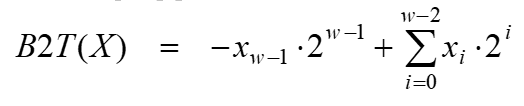
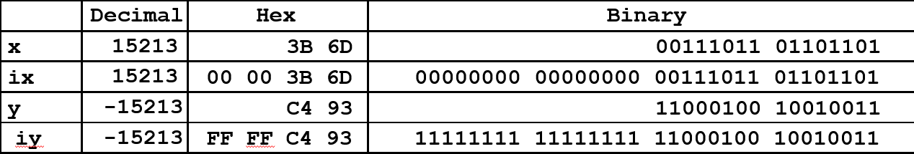

# 比特, 字节和整型


## 比特(位)

一切都是比特(bit), 每个位(bit)都是 0 或 1, 计算机通过以各种方式编码/解释比特集
- 计算机决定怎么做(指令集)
- 以及表示和操作数字、集合、字符串等等

### 二进制

根据下面表格的规律, 可知二进制 `1010.01` 转化 十进制结果为 `10.25`

|位数|4|3|2|1|小|1|2|
|-|-|-|-|-|-|-|-|
|代数|8|4|2|1|数|0.5|0.25|
|幂|3|2|1|0|点|-1|-2|
|位|1|0|1|0|.|0|1|

|十进制|15213|1.20|1.5213 * 10^4|
|-|-|-|-|
|二进制|11101101101101|1.00110011[0011]…|1.1101101101101 * 2^13|

## 字节

1字节(Byte) = 8比特(bits), 二进制表示 `00000000` 到 `11111111`, 十进制表示 `0` 到 `255`, 十六进制表示 `00` 到 `FF`

|十进制(Decimal) |0|1|2|3|4|5|6|7|8|9|10|11|12|13|14|15|
|-|-|-|-|-|-|-|-|-|-|-|-|-|-|-|-|-|
|十六进制(Hex)| 0|1|2|3|4|5|6|7|8|9|A|B|C|D|E|F|
|二进制(Binary)|0000|0001|0010|0011|0100|0101|0111|1000|1001|1010|1011|1100|1101|1101|1110|1111|

### 数据表示示例

|C Data Type|Typical 32-bit|Typical 64-bit|x86-64|
|-|-|-|-|
|char|1|1|1|
|short|2|2|2|
|int|4|4|4|
|long|4|8|8|
|float|4|4|4|
|double|8|8|8|
|long double|-|-|10/16|
|pointer|4|8|8|

## 布尔代数

由乔治·布尔于19世纪发展而来, 逻辑的代数表示`True` 编码为 `1` , `False` 编码为 `0`

操作符 &,  |,  ~,  ^ 在C中都是可用的, 可用于任意**整型**类型long, int, short, char, unsigned
- 将参数视为位向量
- 按位应用于参数


### 表示

例如 `w` 位的向量 可以表示{0, … ,w–1}的子集, 那么下列表格可表达子集 {0, 3, 5, 6}
|0|1|1|0|1|0|0|1|
|-|-|-|-|-|-|-|-|
|7|6|5|4|3|2|1|0|

那么上述表格所表示的子集跟下面4个子集分别进行&(与), |(或), ^(异或), ~(非)

|01101001|&|01000001|{ 0, 6 }|
|-|-|-|-|
|01101001| \||01111101|{ 0, 2, 3, 4, 5, 6 }|
|01101001|^|00111100|{ 2, 3, 4, 5 }|
|01101001|~|10101010|{ 1, 3, 5, 7 }|


### C中位运算
操作符 &,  |,  ~,  ^ 在C中都是可用的
可应用于任意“整型”数据类型
long, int, short, char, unsigned
将参数视为位向量
按位应用于参数

### 移位操作

#### 左移 x << y

把位向量x往左边移动y个位置, 丢弃左边多余的部分, 在右边填充0


#### 右移 x >> y
把位向量x往右边移动y个位置, 丢弃右边多余的部分。逻辑移位往左边填充0, 算数移位往左边填充最高有效位


#### 未定义行为

移位量 < 0 或 ≥ 操作数位数大小

## 整型

### 编码

#### 公式
- 无符号整型(Unsigned)

- 二进制补码(Two’s complement)


---

#### 示例

short 占2个字节, 所以是8个比特
```c
unsigned short x = 15213;
unsigned short y = -15213;
```


|example\\weight|1|2|4|8|16|32|64|128|256|512|1024|2048|4096|8192|16384|-32768|
|-|-|-|-|-|-|-|-|-|-|-|-|-|-|-|-|-|
|15213|1|0|1|1|0|1|1|0|1|1|0|1|1|1|0|0|
|-15213|1|1|0|0|1|0|0|1|0|0|1|0|0|0|1|1|

15213 = 1+4+8+32+64+256+512+2048+4096+8192
-15213 = 1+2+16+128+1024+16384-32768


### 数字范围

#### 公式


#### 示例


#### 观察


---

### 整型转换


如果单个表达式中存在有无符号数和有符号数的混用, 带符号值隐式转换为无符号值


### 整型拓展

