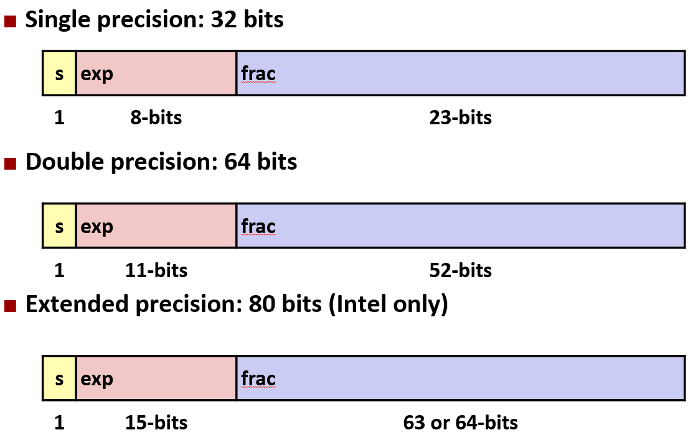
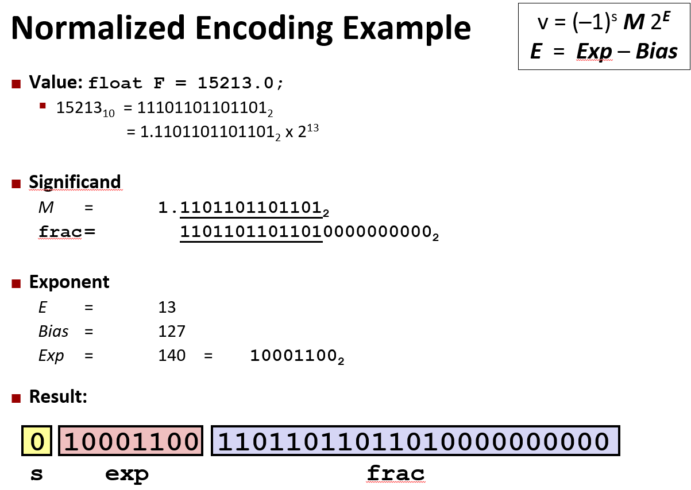
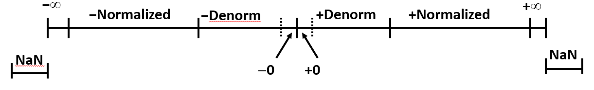
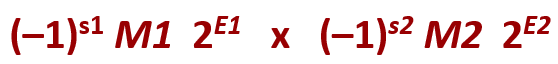

# 浮点数

## 移码表示

### 作用
传统的有符号数表示方法（如补码）需要特殊的符号位来表示正负数。而移码的优点在于它不需要显式的符号位，通过给值加上偏移量，使得负数和正数都可以通过无符号数的方式来表示。

移码表示有助于在进行数值比较、加法等运算时简化符号问题，因为它通过偏移量将整个范围都转换为非负数。

### 原理
移码的基本思想是通过给一个整数添加一个固定的偏移值（即移码）来消除负号，使得负数和正数都可以用非负数表示。具体来说：
- 移码值 = 实际值 + 偏移量
其中，偏移量（bias）通常是 2^(n-1)，其中 n 是位数。

通常，在移码表示中，我们使用 2^(n-1) 作为偏移量，特别是用于表示整数或浮点数。

这个偏移量使得表示的范围从 0 到 2^n - 1，其中偏移量可以在值的负数部分加上一个固定的偏移，使得“零”值为偏移值。

## IEEE 浮点标准
IEEE 标准 754建立于1985年，作为浮点运算的统一标准, 由所有主要CPU支持。

- 受数值问题驱动, 对于四舍五入、上溢、下溢来说是很好的标准
- 硬件很难快速制造, 在定义标准时，数值分析师比硬件设计师占主导地位

---

### 数字形式
在 **IEEE 754 浮点数标准**中，浮点数通常表示为：`(–1)^s * M * 2^E`
- 符号位 s 确定数字是负数还是正数
- 有效数字 M  通常是范围 `[1.0,2.0)`内的一个分数值
- 指数 E 按二次幂对值进行加权

### 编码

`MSB` 是符号位 `s`, `exp` 字段编码为 `E` (但不等于 E), `frac` 字段编码为 `M` (但不等于 M)

---

### 表示方式

在浮点数表示法中（如 **IEEE 754 浮点数标准**），数值的表示方式分为 **规格化数值**、**非规格化数值** 和一些 **特殊值**。这些概念是理解浮点数表示、计算精度和溢出的关键。

在 **IEEE 754 浮点数标准**中, 偏移量(Bias)通常被表示为: `Bias = (2^(k-1)) - 1`, 其中 k 是指数位数。Bias(float) = 127, Bias(double) = 1023。

### 规格化数值
条件: `exp ≠ 000…0` 和 `exp ≠ 111…1` 时

指数值: E = `Exp(exp 字段的无符号值)` – `Bias`

用隐含的前导1进行编码: `M = 1.xxxxx`
- `.xxxxx`: frac 字段的位数
- 当 frac=00000 时最小 (M = 1.0)
- 当 frac=11111 时最大 (M = 2.0 – ε)

---

### 非规格化

条件: `exp = 000…0`时

指数值：`E = 1 – Bias`
用隐含的前导0进行编码: `M = 0.xxxxx`
- `.xxxxx`: frac 字段的位数
- 当 frac = 000…0, 表示不同的值 +0 和 –0
- 当 frac ≠ 000…0, 表示最接近 0.0 的数字, 等距

---

### 特殊值

条件: `exp = 111…1`时

当 `frac = 000…0`时, 可能表示正无穷(−1.0/−0.0), 负无穷(1.0/−0.0)
当 `frac ≠ 000…0`时, 表示不能确定数字值的情况, 非数字(NaN)

## 四舍五入

### 十进制
默认的舍入方式很难在不丢失精度的情况下获得任何其它类型的值, 一组正数的总和总是被高估或低估

当正好处于两个可能值的中间时, 四舍五入，使最低有效位数为偶数
- 7.8949999	7.89	(不到一半)
- 7.8950001	7.90	(高于一半)
- 7.8950000	7.90	(一半—向上舍入)
- 7.8850000	7.88	(一半—向下舍入)

### 二进制
最低有效位为0时为“偶数”, 当舍入位置右侧的位 = 100…2 为“一半”

|Value|Binary|Rounded|Action|Rounded|Value|
|-|-|-|-|-|-|
|2|3/32|10.000112|10.002|(<1/2—down)|2|
|2|3/16|10.001102|10.012|(>1/2—up)|2 1/4|
|2|7/8|10.111002|11.002|(1/2—up)|3|
|2|5/8|10.101002|10.102|(1/2—down)|2 1/2|

---

## 乘法

符号位 s = s1 ^ s2, 有效数字 M = M1 * M2, 指数位 E = E1 + E2

如果 M ≥ 2，将 M 右移，增加 E。如果 E 超出范围，则溢出 。为了适合 frac  精度舍入M 

## 加法

对于符号位 s 和有效数字 M, 取有符号数对齐和相加的结果。取较大的指数E

如果 M ≥ 2，将 M 右移，增加 E 。如果 M < 1，将 M 左移 k 位， 将 E 递减 k 位。如果 E 超出范围，则溢出。为了适合 frac  精度舍入M 

## 转换

- (double/float)2int: 截断小数部分。值将会向0截断。超出范围或 NaN 时未定义：通常设置为 TMin

- int2double: 精确转换，只要 int 的字大小 ≤ 53 位

- int2float: 将会遵守四舍五入