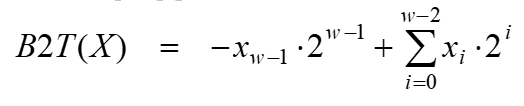

# 计算机三码
最早的计算机ENIAC（埃尼阿克）采用十进制而不是二进制
二进制是由冯诺依曼体系结构规定的

**计算机里的数据分两大类**
- 数值数据：无符号整数、带符号整数、浮点数
- 非数值数据：位串（0和1组成）、字符（包括中文、英文等）

---

## 基础概念

### 真值
真正的值，即现实中带正负号的数

### 机器数

计算机内部用0和1编码的0/1序列
例如：unsigned char a = 254, 机器数则为2^8 - 2 = `11111100`

### 数据表示

数值数据表示有三要素: **进位计数制**, **定/浮点表示**, **定点数的编码**

**进位计数制**称进制。进制有很多种，计算机中，最重要的是十进制、二进制、十六进制、八进制，以及它们的相互转换

**定点数的编码**(原码、补码、反码)解决正负号问题, **其中反码已经不再使用**在计算机的数字电路中只有加法器，没有所谓的**减法器**。计算机保存最原始的数字，是没有正负之分的，叫做**无符号数字**。

**定/浮点**主要解决小数点问题

---

## 原码
原码左边第一位存放符号，0表示正数，1表示负数。**原码直观易懂、与真值转换容易, 但是也有很多缺点。**

- 0的表示不唯一，不利于程序员编程
- 加减运算方式复杂不统一，电路设计更复杂
- **运算时需要额外对符号进行处理**

例如：1 + (-1) = 0001 + 1001 = 1010 = -2 结果与正常的运算逻辑不符

---

## 反码

**现代的计算机系统已经不使用反码了, 把"反码"当作历史概念和某些协议里的特定算法即可。**

- 正数的反码保持原码不变：3 = `00000011`(原码) = `00000011`(反码)
- 负数除符号位外, 其余所有位数全部取反: -5 = `10000101`(原码) = `11111010`(反码)

于是3 + (-5) = (-2)的计算过程为: `00000011 + 11111010 = 11111101`

---

## 补码
计算机不同于人脑，**计算机在碰到任何数字之前只根据最高位的符号位来判断正负性，`0`表示正数，`1`表示负数**。

用8位二进制**反码表示**的话，其中有两个特殊的编码会出现: `00000000(+0)`、`11111111(-0)`

**其实，+0和-0代表的都是0。这样一来，`0`这个数字在计算机中的编码就不是唯一的了**。对于计算机来说，这是绝对不行的，因为任何数字都只能有1个编码。

我们把0当成正数，这样0的编码就变成 `00000000`。那8位二进制表示的正数范围仍然是： +0 —— +127。

把负数**整体向后挪动1位**, 只要将8位二进制表示的负数范围变成：-128 —— -1，就能成功解决问题。

**正数时，补码跟原码一样；负数时，补码就是原码符号位除外，其他位按位取反，再加1。**

### 运算推导
假设运算器为4位，则模为2的4次方，等于16
- 0的补码为 0 + 16 = 0000 + 10000 = 0000 = 0
- 1的补码为 1 + 16 = 0001 + 10000 = 0001 = 1
- -1的补码为 -1 + 16 = `10000 – 0001` = `1111 – 0001 + 0001` = `1110 + 0001` = 1111

### 计算真值

例如: 补码1001真值 = -2^3 + 2^0 = -8 + 1 = -7

---

## 模运算系统

**在一个模运算系统中，一个数与它除以“模”后的余数等价。**

时钟是一种模12系统。假设钟表时针指向9点，要将它拨向7点，有两种拨法：
- 逆时针拨2格：`9 - 2` = 7
- 顺时针拨10格：`(9 + 10) (mod 12)` = 7

模12系统中，`9 – 2` ≡ `(9 + 10) (mod 12)`, `–2 ≡ 10 (mod 12)`, 则称 **-2的模12补码等于10**

### 重要结论

- 运算器只有有限位，假设为n位，则运算结果只保留较低的n位，因此，其模为2^n
- 负数的补码 = 模减去它的绝对值
- 在确定模下，减 B 就等于加上 B 的补码，结果再取膜。

我们便可以用负数(十进制)的补码 来表示 负数的加法

