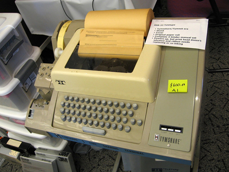

# Shell与终端

## 早期终端

终端就是用户最终操作的地方。一台电传打字机就是最早的终端。



早期的unix系统是一个多用户的操作系统, 每个用户通过该设备与shell交互, 终端把数据传递给shell, shell处理完毕后再发会终端。 **此时终端还不属于操作系统**

## 现代终端
现在的计算机早就没有了单独的硬件作为终端, 但是用户使用终端和shell交互的设计理念从未变过。

**显示器不是终端, 它只是一个输出设备, 不是用来和shell交互**

现在的操作系统会模拟出一个终端, 我们可以通过该终端与shell交互。


现在的虚拟终端无处不在, 比如：`linux图形界面, 命令行终端`, `mac的图形界面, 命令行终端`, `windows的界面, dos`


终端的简写是 `tty`, 有很多人就疑惑了, 终端不应该是 `terminal` 吗？因为电传打字机的英文是 `Teletype`, 所以 `tty` 代表终端的说法就一直流传到了现在。

**现代虚拟终端是操作系统的一部分了。**

### Windows终端
windows的界面是嵌入内核的, 在这一方面和linux不同, windows也没有shell, 而是直接通过windows界面部分与内核交互, 不过这不影响windows界面就是一个终端

### Linux终端

#### 分类
Linux终端有两种。以下`*`符号代表任何一个数字。

`tty/*` 是linux默认提供的终端, 就是那种linux系统自带的黑窗口, 它早已不再是早期的电传打字机, 而是操作系统自带的, 

`pts/*` 是虚拟终端, 以后使用的都是这个。远程链接和图形界面都是虚拟终端。
#### 操作
- `w` 该命令显示当前主机各用户登录的信息

- `tty` 该命令用于查看终端

- `Ctrl+Alt+F(2~8)` 都可以 打开linux自带的真正终端

- `Ctrl+Alt+F1` 切换至图形终端


## Shell介绍
shell的英文含义就是`壳`, 用户就是通过shell来与操作系统交互的。

shell有很多种类, 我们最常使用的是bash, sh是第一个shell。

linux的shell可以执行众多命令，shell脚本其实就是把这些命令放在一个文件中，然后依次执行，就可以完成对linux系统的各种复杂操作。

很多人推荐zsh, 说这是未来主流。**如果有兴趣, 可以自己去看一下zsh, zsh真的很强。**

**注意：管理员可以遵照用户的习惯给每个用户设置专门的shell, 它不是所有用户的公用的。**

## Shell网站

shell脚本没有权威网站，只要搜索学习shell脚本的常用网站，随便一个都可以，都差不多。

我在这里给大家推荐一个我比较喜欢的中文shell脚本网站。阮一锋的bash脚本网站，对于我们开发人员来说，shell脚本简单的会一些就可以了。网址：https://wangdoc.com/bash/intro


## 基础知识

- shell脚本就是将诸多命令放在一个文件中依次执行，只不过为了控制这些命令的执行，shell脚本必须提供诸多控制命令执行的功能。


- **shell脚本的第一行为`#!/bin/bash`，这一行可以告诉bash使用bash来解释脚本**，如果没有这一行，系统就会使用默认的shell来解释脚本，在大多数情况下不会出现错误，但少数情况下，bash和shell不大的区别就会导致错误。
- `#` 表示注释，对于任何语言，注释都是非常重要的，shell脚本中`#`表示注释。
- 在执行脚本之前，需要给脚本添加执行权限。
- `""`：使用双引号，变量将被当做变量解释
- `''`： 使用单引号，变量将被当做字符串解释
- ` ``数字键1左面的反引号 `：反引号包含的变量将被解释器解释为系统命令，然后执行命令。
- `转义字符`：主要就是\n，\t。echo命令使用转义字符需要加上-e参数。
- `()` ：执行`()`中的命令不会影响`()`外的变量。
- `{}` ：执行`{}`中的命令会影响`{}`外的变量

## 基础语法

**普通变量**
- readonly标识符：代表变量不可更改
- unset表示符：将num变量设置为空。
- 在shell脚本中，变量在定义时默认是不指定类型的。在shell脚本中，变量简单的分为字符串类型，整数类型就可以了，默认变量为字符串类型。
- 如果我们想要将一个变量定义为整数类型，可以使用declare -i来显示定义、
```sh
#!/bin/bash

# 定义字符串变量
name="张三"

# 定义整数变量
declare -i age=30

# readonly 变量
readonly PI=3.14159

# unset 变量
unset name

echo "姓名：$name"
echo "年龄：$age"
echo "PI: $PI"
```

**内部变量**
- 也可以叫预设变量，预定义变量，就是shell已经预定义的变量。
- \$# 传给shell脚本参数的数量
- \$* 传给shell脚本参数的内容
- \$1，$2，$3，$4... 表示第一个，第二个，第三个...命令行参数
- \$? 用于检查上一个命令是否执行成功，如果执行成功，则返回0，否则返回非0的数。这个变量非常有用，一定要会。
- \$0 当前进程名称
- \$$ 当前进程的进程号

```sh
#!/bin/bash

echo "参数数量：$#"
echo "所有参数：$*"
echo "第一个参数：$1"
echo "第二个参数：$2"
echo "当前进程名称：$0"
echo "当前进程ID：$$"

# 检查上一条命令是否成功执行
if [ $? -eq 0 ]; then
  echo "命令执行成功"
else
  echo "命令执行失败"
fi
```

**环境变量**
在shell脚本中可以直接使用bash的环境变量。比如可以定义一个新的环境变量，这样其它脚本也就可以看到该环境变量了，可以类比C语言的全局变量。或者修改PATH或LD_LIBRARY_PATH的值，以方便之后或其它脚本使用PATH或LD_LIBRARY_PATH
```sh
#!/bin/bash

# 设置新的环境变量
export MY_VARIABLE="Hello World"

# 打印环境变量
echo "MY_VARIABLE: $MY_VARIABLE"

# 修改 PATH 环境变量 (不建议这样做，可能会影响系统)
# export PATH=$PATH:/new/path

# 打印 PATH 环境变量
echo "PATH: $PATH"
```


#### 变量的判断：
- `${num:-val}`：如果num存在，则整个表达式的值为num，否则整个表达式的值为val。
- `${num:=val}`: 如果num存在，则整个表达式的值为num，否则整个表达式的值为val，且将num赋值为val。
```sh
#!/bin/bash

num1=10
num2=

echo "${num1:-5}"  # 输出 10
echo "${num2:-5}"  # 输出 5

echo "${num1:=20}" # 输出 10
echo "${num2:=20}" # 输出 20

echo "num1: $num1" # 输出 num1: 10
echo "num2: $num2" # 输出 num2: 20
```
#### 对字符串的操作：
- 获取字符串的长度：格式为` ${#str} `
- 从字符串中提取字符串：格式为`${str:n1: n2}`，从n1的位置开始提取n2个字符
- 对字符串进行替换：格式为`${str/old/new}`用new来替换第一个匹配到的old字符串。

```sh
#!/bin/bash

str="Hello, World!"

# 获取字符串长度
echo "字符串长度：${#str}"

# 提取子字符串
echo "子字符串：${str:7:5}"

# 替换字符串
echo "替换后：${str/World/Linux}"
```
## 判断语句
判断语句也就是对各种功能进行判断，可以包括文件判断，字符串判断，数值判断，逻辑判断：格式为 test condition 或 [ condition ]。这么说太空洞了，讲了对应的应用场景就非常好理解了。其实还是[ condution ]用的比较多。

判断语句非常重要，一定要熟练掌握，下一课学控制语句，大家就明白了。**这一课的判断语句主要是语法，下一课就有应用了，所以大家如果不理解，就死记住。**

#### 文件判断

| -e|-d|-f|-r|-w|-x|
|--------|--------|--------|--------|--------|--------|
| 文件是否存在 |是否为目录 |是否为普通文件|可读 |可写 |可执行 |

其实参数还有很多，比较常用的就这些了。

#### 字符串判断
**注意：在使用字符串进行判断时，一定要加上``，否则容易出现莫名其妙的错误。**
(1)	-z : （zero）表示空串
(2)	-n: （not zero）表示不是空串
**(3)**	== ：表示两个字符串相等，其实这里使用=也可以，**但写=就必须留空格，否则就变成赋值了**。
(4)	!= ：表示两个字符串不相等
**在判断相等或不相等时，推荐在变量后加`x`，在某些版本的bash中，如果一个字符串为空，会直接报错的。**

#### 数值判断
因为`>`，`<`等已经被重定向占了，所以比较数值也只能采取这种比较麻烦的方式了。
 

#### 逻辑判断
(1)	[ ! expr ] 逻辑非。
(2)	[ expr1 -a expr2 ] （a为and）逻辑与，只有两个表达式均为真，结果为真。
(3)	[ expr1 -o expr2 ] （o为or）逻辑或，expr1或expr2为真，则结果为真。
(4)	**[] || [] 用或来合并表达式**
(5)	**[] && [] 用且来合并表达**


## 控制语句
**注意：学习shell脚本的控制语句可以类比c语言的控制语句，作用是一样的。**

#### read语句
在讲控制语句之前，先讲一下从键盘上读取字符串的read语句。
```bash
read -p "请输入您的姓名：" name
echo "您好，${name}！"
```
#### if语句：
```bash
#!/bin/bash

read -p "请输入一个整数：" num

if [ $num -gt 0 ]; then
    echo "$num 是正数。"
elif [ $num -eq 0 ]; then
    echo "$num 是零。"
else
    echo "$num 是负数。"
fi
```

#### case语句：
```bash
#!/bin/bash

read -p "请输入一个字母（a/b/c）：" letter

case $letter in
    a)
        echo "您输入了 a。"
        ;;
    b)
        echo "您输入了 b。"
        ;;
    c)
        echo "您输入了 c。"
        ;;
    *)
        echo "输入错误！"
        ;;
esac
```

#### for语句：
**注意：这种方法支持c语言的循环，可以使用`<，>`等符号来表示范围了。但是不能在for内部定义变量**
```bash
#!/bin/bash

for (( i=0; i<=10; i++ )); do
    echo "i 的值为：$i"
done
```

```bash
#!/bin/bash

for fruit in apple banana orange; do
    echo "我喜欢吃 $fruit。"
done
```

#### while语句
可以理解为，但满足什么条件时，就会执行
```bash
#!/bin/bash

count=0
while [ $count -lt 5 ]; do
    echo "count 的值为：$count"
    count=$((count+1))
done
```

```bash
#!/bin/bash

while read line; do
    echo "读取到一行内容：$line"
done < input.txt
```
#### until语句
until语句和while刚好相反，until为条件为假时执行接下来的语句。可以理解为：**当满足什么条件时，就不执行了**

```bash
#!/bin/bash

count=0
until [ $count -eq 5 ]; do
    echo "count 的值为：$count"
    count=$((count+1))
done
```

这些没什么讲的必要，都是语法，记住就可以了。多用一用就熟练了。
## 函数
shell脚本的函数和C语言的函数类似。大家可以类比的学。
#### 格式 
function 函数() 。其中function和()可以省略一个，这么说太抽象了。
```bash
#!/bin/bash
function totleNum() {
    echo "this is totleNum"
}
totleNum
```

#### 函数的返回值
(1)	return的形式：
```bash
#!/bin/bash

function add() {
    local sum=$(( $1 + $2 ))
    return $sum
}

add 5 3
echo "函数的返回值为：$?"
```
注意：shell的函数和c语言的return关键字意义并不相同。在shell脚本中，return关键字主要用来返回函数的执行状态，如果为0，则函数正确，否则视为出现错误，return可以返回我们想要的错误码。
注意：return只能返回0-255的数字，超过这个返回就会出错。

(2)	echo的形式：
echo更接近c语言的返回值，我们一般用echo的形式来接收代码的返回值。
```bash
#!/bin/bash

function multiply() {
    local product=$(( $1 * $2 ))
    echo $product
}

result=$(multiply 4 6)
echo "函数的返回值为：$result"
```

#### 在函数内部：
\$#，\$*等内容表示函数的参数情况。
```bash
#!/bin/bash

function printArgs() {
    echo "参数个数：$#"
    echo "所有参数：$*"
    echo "第一个参数：$1"
    echo "第二个参数：$2"
}

printArgs "hello" "world"
```
