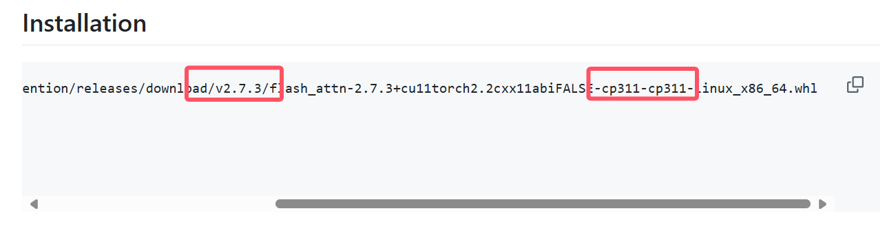
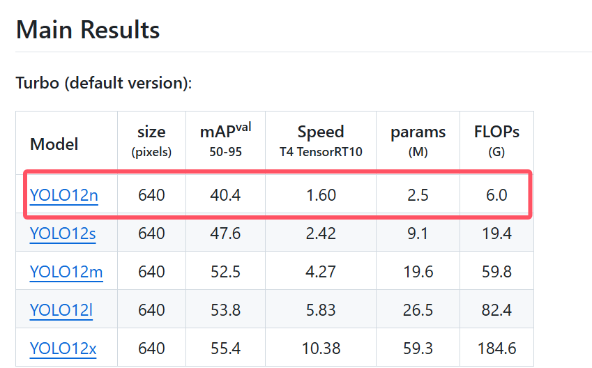

# YOLO12

- windows + python + anaconda + pycharm + yolo12 + openvino

## 创建环境
- **第 1 步**: 使用git将yolo12项目clone后使用Pycharm打开
```
git clone https://github.com/sunsmarterjie/yolov12.git
```

- **第 2 步**: 打开requirements.txt并注释掉以下3行
```txt
# torch==2.2.2
# torchvision==0.17.2
# flash_attn-2.7.3+cu11torch2.2cxx11abiFALSE-cp311-cp311-linux_x86_64.whl
```
- **第 3 步**: 在Pycharm中打开终端并键入以下内容创建相应的conda环境
```bash
conda create -n yolo12 python=3.11
```
例如 我这里想将环境取名为yolo12
- **第 4 步**: 紧接着依次键入以下命令行激活并安装相应包
```bash
conda activate yolo12
```


## 下载 Pytorch
- **第 1 步**: 去[Pytorch官网](https://pytorch.org/)下载相应的Pytorch 并按照下图选择


复制图中的命令行将`torchaudio`删掉那么就变成了这个样子
```bash
pip3 install torch torchvision --index-url https://download.pytorch.org/whl/cu124
```
- **第 2 步**: 打开Pycharm终端键入该命令行即可。
- **第 3 步**: 如果遇到下载过慢可以中断，手动点击链接下载并使用`pip install 包本地路径`手动安装

## 下载flash-attention
- **第 1 步**: 打开[yolo12](https://github.com/sunsmarterjie/yolov12.git)的git仓库 下滑找到`Installation` 查看需要的flash-attention版本



- **第 2 步**: 使用[huggingface国内镜像站](https://hf-mirror.com/lldacing/flash-attention-windows-wheel/tree/main)下载**最接近版本**的flash-attention windows端whl包

截止2025.4.5日 本文下载的`flash_attn-2.7.4+cu124torch2.6.0cxx11abiFALSE-cp311-cp311-win_amd64.whl`

- **第 3 步**: 在Pytorch终端中键入如下指令安装flash-attention
```bash
pip install 下载的flash-attention的本地位置
```

## 安装剩余环境
- **第 1 步**: 在Pycharm的终端中依次输入如下命令行
```bash
pip install -r requirements.txt
```
```bash
pip install -e .
```

## 验证安装
- **第 1 步**: 在[yolo12](https://github.com/sunsmarterjie/yolov12.git)的git仓库下载测试模型例如**YOLO12n**


将下载好的`.pt`模型文件拷贝到项目目录下

- **第 2 步**: 在Pycharm中键入以下命令行 或者 在运行python代码
```bash
yolo predict model=yolov12n.pt source='https://ultralytics.com/images/bus.jpg'
```
```py
from ultralytics import YOLO

model = YOLO('yolov12n.pt')
model.predict('bus.jpg')
```