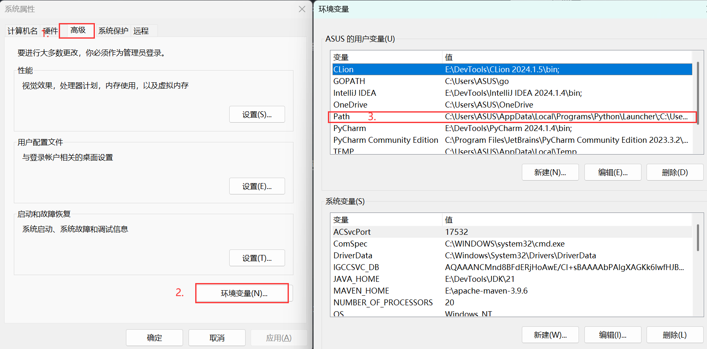
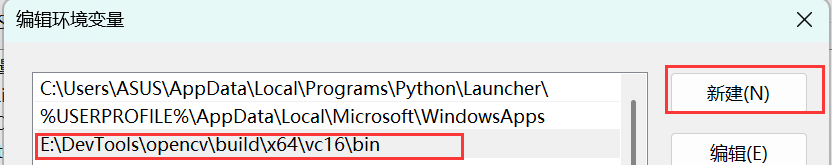
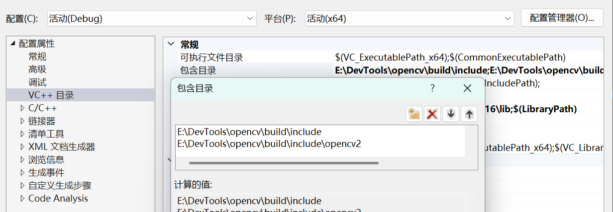
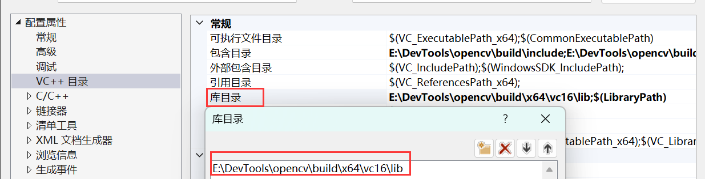
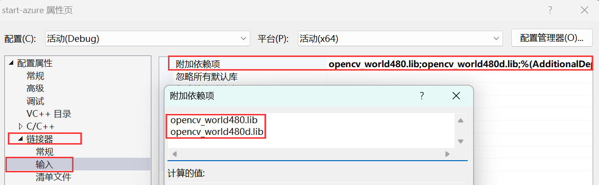

# 基础配置 - Windows


[OpenCV 官方网站](https://opencv.org/releases/) 提供的 Windows 预编译二进制包是使用 Microsoft Visual C++ (MSVC) 编译器编译的。这意味着它们与 MSVC 开发环境兼容。

如果你的开发环境是基于 GCC 编译器（例如通过 MinGW 工具链），那么你不能直接使用这些预编译的 MSVC 版本。你需要下载 OpenCV 的源代码，然后使用你的 MinGW GCC 编译器来自行编译 OpenCV，以生成兼容 GCC 的库文件。


## MVSC
请依据自身需求和习惯, 自行选择 `IDE` (例如: `CLion`、`Qt Creator`、`Visual Studio` 等) 这里选择的是 `Visual Studio`

在 [OpenCV 官方网站](https://opencv.org/releases/) 下载后解压至工作目录

::: tip
例如我的目录在E:\DevTools\opencv 请依据自身需求和习惯选择目录!
:::


按下 `Win + R` 并键入 `sysdm.cpl`打开系统属性, 高级-环境变量, 双击PATH添加环境变量

 


- 点击新建并键入绝对路径 `E:\DevTools\opencv\build\x64\vc16\bin`



- 在VC++目录的包含目录添加头文件路径 `E:\DevTools\opencv\build\include`、`E:\DevTools\opencv\build\include\opencv2` 



- 在VC++目录的库目录添加链接库路径 `E:\DevTools\opencv\build\x64\vc16\lib` 



- 最后在链接器的输入的附加依赖项添加`opencv_world480d.lib`, 此文件位于`E:\DevTools\opencv\build\x64\vc16\lib`下 并且根据不同的opencv版本 名字发生变化



## MinGW 或 Ninja
- 在工作目录下clone对应的opencv版本
```bash
git clone -b 4.9.0 https://github.com/opencv/opencv.git
git clone -b 4.9.0 https://github.com/opencv/opencv_contrib.git
```

::: details 点击示例的工作目录
```bash
PS E:\DevTools\opencv> tree
├─mingw
│  ├─build
│  └─install
├─mvsc
├─ninja
└─source
    ├─opencv
    └─opencv_contrib
```
:::

### MinGW
- 在 `mingw\build` 下使用 `cmake` 生成对应的 `makefile`

::: details 点击查看 MinGW
```bash
cmake -G "MinGW Makefiles" 
      -D CMAKE_BUILD_TYPE=Release 
      -D BUILD_SHARED_LIBS=ON 
      -D BUILD_STATIC_LIBS=ON 
      -D BUILD_EXAMPLES=OFF 
      -D BUILD_opencv_world=OFF 
      -D BUILD_opencv_java=OFF 
      -D BUILD_opencv_python=OFF 
      -D CMAKE_INSTALL_PREFIX="E:\DevTools\opencv\mingw\install" 
      -D OPENCV_EXTRA_MODULES_PATH="E:\DevTools\opencv\source\opencv_contrib\modules"
      -D CMAKE_C_COMPILER="E:\DevTools\CLion 2024.1.5\bin\mingw\bin\gcc.exe"
      -D CMAKE_CXX_COMPILER="E:\DevTools\CLion 2024.1.5\bin\mingw\bin\g++.exe"
      E:\DevTools\opencv\source\opencv
```
:::


**请不要漏了上述指令最后一行的 `E:\DevTools\opencv\source\opencv` 这是用来帮助定位CmakeLists.txt位置的**

- 查看终端提示信息确认生成的makefile文件**是否为所期望**的。
::: details 点击查看 `MinGW` 示例的提示信息
```bash
-- General configuration for OpenCV 4.9.0 =====================================
--   Version control:               4.9.0
--
--   Extra modules:
--     Location (extra):            E:/DevTools/opencv/source/opencv_contrib/modules
--     Version control (extra):     4.9.0
--
--   Platform:
--     Timestamp:                   2025-07-16T03:37:22Z
--     Host:                        Windows 10.0.26100 AMD64
--     CMake:                       3.28.6
--     CMake generator:             MinGW Makefiles
--     CMake build tool:            E:/DevTools/CLion 2024.1.5/bin/mingw/bin/mingw32-make.exe
--     Configuration:               Release
--
--   CPU/HW features:
--     Baseline:                    SSE SSE2 SSE3
--       requested:                 SSE3
--     Dispatched code generation:  SSE4_1 SSE4_2 FP16 AVX AVX2 AVX512_SKX
--       requested:                 SSE4_1 SSE4_2 AVX FP16 AVX2 AVX512_SKX
--       SSE4_1 (18 files):         + SSSE3 SSE4_1
--       SSE4_2 (2 files):          + SSSE3 SSE4_1 POPCNT SSE4_2
--       FP16 (1 files):            + SSSE3 SSE4_1 POPCNT SSE4_2 FP16 AVX
--       AVX (9 files):             + SSSE3 SSE4_1 POPCNT SSE4_2 AVX
--       AVX2 (38 files):           + SSSE3 SSE4_1 POPCNT SSE4_2 FP16 FMA3 AVX AVX2
--       AVX512_SKX (8 files):      + SSSE3 SSE4_1 POPCNT SSE4_2 FP16 FMA3 AVX AVX2 AVX_512F AVX512_COMMON AVX512_SKX
--
--   C/C++:
--     Built as dynamic libs?:      YES
--     C++ standard:                11
--     C++ Compiler:                E:/DevTools/CLion 2024.1.5/bin/mingw/bin/g++.exe  (ver 13.1.0)
--     C++ flags (Release):         -fsigned-char -W -Wall -Wreturn-type -Wnon-virtual-dtor -Waddress -Wsequence-point -Wformat -Wformat-security -Wmissing-declarations -Wundef -Winit-self -Wpointer-arith -Wshadow -Wsign-promo -Wuninitialized -Wsuggest-override -Wno-delete-non-virtual-dtor -Wno-comment -Wimplicit-fallthrough=3 -Wno-strict-overflow -fdiagnostics-show-option -Wno-long-long -fomit-frame-pointer -ffunction-sections -fdata-sections  -msse -msse2 -msse3 -fvisibility=hidden -fvisibility-inlines-hidden -O3 -DNDEBUG  -DNDEBUG
--     C++ flags (Debug):           -fsigned-char -W -Wall -Wreturn-type -Wnon-virtual-dtor -Waddress -Wsequence-point -Wformat -Wformat-security -Wmissing-declarations -Wundef -Winit-self -Wpointer-arith -Wshadow -Wsign-promo -Wuninitialized -Wsuggest-override -Wno-delete-non-virtual-dtor -Wno-comment -Wimplicit-fallthrough=3 -Wno-strict-overflow -fdiagnostics-show-option -Wno-long-long -fomit-frame-pointer -ffunction-sections -fdata-sections  -msse -msse2 -msse3 -fvisibility=hidden -fvisibility-inlines-hidden -g  -O0 -DDEBUG -D_DEBUG
--     C Compiler:                  E:/DevTools/CLion 2024.1.5/bin/mingw/bin/gcc.exe
--     C flags (Release):           -fsigned-char -W -Wall -Wreturn-type -Waddress -Wsequence-point -Wformat -Wformat-security -Wmissing-declarations -Wmissing-prototypes -Wstrict-prototypes -Wundef -Winit-self -Wpointer-arith -Wshadow -Wuninitialized -Wno-comment -Wimplicit-fallthrough=3 -Wno-strict-overflow -fdiagnostics-show-option -Wno-long-long -fomit-frame-pointer -ffunction-sections -fdata-sections  -msse -msse2 -msse3 -fvisibility=hidden -O3 -DNDEBUG  -DNDEBUG
--     C flags (Debug):             -fsigned-char -W -Wall -Wreturn-type -Waddress -Wsequence-point -Wformat -Wformat-security -Wmissing-declarations -Wmissing-prototypes -Wstrict-prototypes -Wundef -Winit-self -Wpointer-arith -Wshadow -Wuninitialized -Wno-comment -Wimplicit-fallthrough=3 -Wno-strict-overflow -fdiagnostics-show-option -Wno-long-long -fomit-frame-pointer -ffunction-sections -fdata-sections  -msse -msse2 -msse3 -fvisibility=hidden -g  -O0 -DDEBUG -D_DEBUG
--     Linker flags (Release):      -Wl,--gc-sections
--     Linker flags (Debug):        -Wl,--gc-sections
--     ccache:                      NO
--     Precompiled headers:         NO
--     Extra dependencies:          pthread
--     3rdparty dependencies:
--
--   OpenCV modules:
--     To be built:                 aruco bgsegm bioinspired calib3d ccalib core datasets dnn dnn_objdetect dnn_superres dpm face features2d flann fuzzy gapi hfs highgui img_hash imgcodecs imgproc intensity_transform line_descriptor mcc ml objdetect optflow phase_unwrapping photo plot quality rapid reg rgbd saliency shape stereo stitching structured_light superres surface_matching text tracking ts video videoio videostab wechat_qrcode xfeatures2d ximgproc xobjdetect xphoto
--     Disabled:                    world
--     Disabled by dependency:      -
--     Unavailable:                 alphamat cannops cudaarithm cudabgsegm cudacodec cudafeatures2d cudafilters cudaimgproc cudalegacy cudaobjdetect cudaoptflow cudastereo cudawarping cudev cvv freetype hdf java julia matlab ovis python2 python3 sfm viz
--     Applications:                tests perf_tests apps
--     Documentation:               NO
--     Non-free algorithms:         NO
--
--   Windows RT support:            NO
--
--   GUI:                           WIN32UI
--     Win32 UI:                    YES
--     VTK support:                 NO
--
--   Media I/O:
--     ZLib:                        build (ver 1.3)
--     JPEG:                        build-libjpeg-turbo (ver 2.1.3-62)
--       SIMD Support Request:      YES
--       SIMD Support:              NO
--     WEBP:                        build (ver encoder: 0x020f)
--     PNG:                         build (ver 1.6.37)
--     TIFF:                        build (ver 42 - 4.2.0)
--     JPEG 2000:                   build (ver 2.5.0)
--     OpenEXR:                     build (ver 2.3.0)
--     HDR:                         YES
--     SUNRASTER:                   YES
--     PXM:                         YES
--     PFM:                         YES
--
--   Video I/O:
--     DC1394:                      NO
--     FFMPEG:                      YES (prebuilt binaries)
--       avcodec:                   YES (58.134.100)
--       avformat:                  YES (58.76.100)
--       avutil:                    YES (56.70.100)
--       swscale:                   YES (5.9.100)
--       avresample:                YES (4.0.0)
--     GStreamer:                   NO
--     DirectShow:                  YES
--
--   Parallel framework:            pthreads
--
--   Trace:                         YES (built-in)
--
--   Other third-party libraries:
--     Lapack:                      NO
--     Eigen:                       NO
--     Custom HAL:                  NO
--     Protobuf:                    build (3.19.1)
--     Flatbuffers:                 builtin/3rdparty (23.5.9)
--
--   OpenCL:                        YES (NVD3D11)
--     Include path:                E:/DevTools/opencv/source/opencv/3rdparty/include/opencl/1.2
--     Link libraries:              Dynamic load
--
--   Python (for build):            E:/DevTools/miniconda3/python.exe
--
--   Java:
--     ant:                         NO
--     Java:                        NO
--     JNI:                         NO
--     Java wrappers:               NO
--     Java tests:                  NO
--
--   Install to:                    E:/DevTools/opencv/mingw/install
-- -----------------------------------------------------------------
--
-- Configuring done (121.1s)
-- Generating done (1.8s)
-- Build files have been written to: E:/DevTools/opencv/mingw/build
```
:::


- 执行makefile文件 编译源代码
```bash
mingw32-make -j 8
```


- 安装到期望的目录
```bash
mingw32-make install
```
本示例会安装到 `E:/DevTools/opencv/mingw/install`

- 最后在环境变量 `PATH` 中添加`E:\DevTools\opencv\mingw\install\x64\mingw\bin`

### Ninja

- 在 `ninja\build` 下使用 `cmake` 生成对应的 `build.ninja`

::: details 点击查看 Ninja
```bash
cmake -G "Ninja" 
      -D CMAKE_BUILD_TYPE=Release 
      -D BUILD_SHARED_LIBS=ON 
      -D BUILD_STATIC_LIBS=ON 
      -D BUILD_EXAMPLES=OFF 
      -D BUILD_opencv_world=OFF 
      -D BUILD_opencv_java=OFF 
      -D BUILD_opencv_python=OFF 
      -D CMAKE_INSTALL_PREFIX="E:\DevTools\opencv\mingw\install" 
      -D OPENCV_EXTRA_MODULES_PATH="E:\DevTools\opencv\source\opencv_contrib\modules"
      -D CMAKE_C_COMPILER="E:\DevTools\CLion 2024.1.5\bin\mingw\bin\gcc.exe"
      -D CMAKE_CXX_COMPILER="E:\DevTools\CLion 2024.1.5\bin\mingw\bin\g++.exe"
      E:\DevTools\opencv\source\opencv
```
:::


**请不要漏了上述指令最后一行的 `E:\DevTools\opencv\source\opencv` 这是用来帮助定位CmakeLists.txt位置的**

- 查看终端提示信息确认生成的 `build.ninja` 文件**是否为所期望**的。
::: details 点击查看 `Ninja` 示例的提示信息
```bash
--
-- General configuration for OpenCV 4.9.0 =====================================
--   Version control:               4.9.0
--
--   Extra modules:
--     Location (extra):            E:/DevTools/opencv/source/opencv_contrib/modules
--     Version control (extra):     4.9.0
--
--   Platform:
--     Timestamp:                   2025-07-16T04:04:54Z
--     Host:                        Windows 10.0.26100 AMD64
--     CMake:                       3.28.6
--     CMake generator:             Ninja
--     CMake build tool:            E:/DevTools/CLion 2024.1.5/bin/ninja/win/x64/ninja.exe
--     Configuration:               Release
--
--   CPU/HW features:
--     Baseline:                    SSE SSE2 SSE3
--       requested:                 SSE3
--     Dispatched code generation:  SSE4_1 SSE4_2 FP16 AVX AVX2 AVX512_SKX
--       requested:                 SSE4_1 SSE4_2 AVX FP16 AVX2 AVX512_SKX
--       SSE4_1 (18 files):         + SSSE3 SSE4_1
--       SSE4_2 (2 files):          + SSSE3 SSE4_1 POPCNT SSE4_2
--       FP16 (1 files):            + SSSE3 SSE4_1 POPCNT SSE4_2 FP16 AVX
--       AVX (9 files):             + SSSE3 SSE4_1 POPCNT SSE4_2 AVX
--       AVX2 (38 files):           + SSSE3 SSE4_1 POPCNT SSE4_2 FP16 FMA3 AVX AVX2
--       AVX512_SKX (8 files):      + SSSE3 SSE4_1 POPCNT SSE4_2 FP16 FMA3 AVX AVX2 AVX_512F AVX512_COMMON AVX512_SKX
--
--   C/C++:
--     Built as dynamic libs?:      YES
--     C++ standard:                11
--     C++ Compiler:                E:/DevTools/CLion 2024.1.5/bin/mingw/bin/g++.exe  (ver 13.1.0)
--     C++ flags (Release):         -fsigned-char -W -Wall -Wreturn-type -Wnon-virtual-dtor -Waddress -Wsequence-point -Wformat -Wformat-security -Wmissing-declarations -Wundef -Winit-self -Wpointer-arith -Wshadow -Wsign-promo -Wuninitialized -Wsuggest-override -Wno-delete-non-virtual-dtor -Wno-comment -Wimplicit-fallthrough=3 -Wno-strict-overflow -fdiagnostics-show-option -Wno-long-long -fomit-frame-pointer -ffunction-sections -fdata-sections  -msse -msse2 -msse3 -fvisibility=hidden -fvisibility-inlines-hidden -O3 -DNDEBUG  -DNDEBUG
--     C++ flags (Debug):           -fsigned-char -W -Wall -Wreturn-type -Wnon-virtual-dtor -Waddress -Wsequence-point -Wformat -Wformat-security -Wmissing-declarations -Wundef -Winit-self -Wpointer-arith -Wshadow -Wsign-promo -Wuninitialized -Wsuggest-override -Wno-delete-non-virtual-dtor -Wno-comment -Wimplicit-fallthrough=3 -Wno-strict-overflow -fdiagnostics-show-option -Wno-long-long -fomit-frame-pointer -ffunction-sections -fdata-sections  -msse -msse2 -msse3 -fvisibility=hidden -fvisibility-inlines-hidden -g  -O0 -DDEBUG -D_DEBUG
--     C Compiler:                  E:/DevTools/CLion 2024.1.5/bin/mingw/bin/gcc.exe
--     C flags (Release):           -fsigned-char -W -Wall -Wreturn-type -Waddress -Wsequence-point -Wformat -Wformat-security -Wmissing-declarations -Wmissing-prototypes -Wstrict-prototypes -Wundef -Winit-self -Wpointer-arith -Wshadow -Wuninitialized -Wno-comment -Wimplicit-fallthrough=3 -Wno-strict-overflow -fdiagnostics-show-option -Wno-long-long -fomit-frame-pointer -ffunction-sections -fdata-sections  -msse -msse2 -msse3 -fvisibility=hidden -O3 -DNDEBUG  -DNDEBUG
--     C flags (Debug):             -fsigned-char -W -Wall -Wreturn-type -Waddress -Wsequence-point -Wformat -Wformat-security -Wmissing-declarations -Wmissing-prototypes -Wstrict-prototypes -Wundef -Winit-self -Wpointer-arith -Wshadow -Wuninitialized -Wno-comment -Wimplicit-fallthrough=3 -Wno-strict-overflow -fdiagnostics-show-option -Wno-long-long -fomit-frame-pointer -ffunction-sections -fdata-sections  -msse -msse2 -msse3 -fvisibility=hidden -g  -O0 -DDEBUG -D_DEBUG
--     Linker flags (Release):      -Wl,--gc-sections
--     Linker flags (Debug):        -Wl,--gc-sections
--     ccache:                      NO
--     Precompiled headers:         NO
--     Extra dependencies:          pthread
--     3rdparty dependencies:
--
--   OpenCV modules:
--     To be built:                 aruco bgsegm bioinspired calib3d ccalib core datasets dnn dnn_objdetect dnn_superres dpm face features2d flann fuzzy gapi hfs highgui img_hash imgcodecs imgproc intensity_transform line_descriptor mcc ml objdetect optflow phase_unwrapping photo plot quality rapid reg rgbd saliency shape stereo stitching structured_light superres surface_matching text tracking ts video videoio videostab wechat_qrcode xfeatures2d ximgproc xobjdetect xphoto
--     Disabled:                    world
--     Disabled by dependency:      -
--     Unavailable:                 alphamat cannops cudaarithm cudabgsegm cudacodec cudafeatures2d cudafilters cudaimgproc cudalegacy cudaobjdetect cudaoptflow cudastereo cudawarping cudev cvv freetype hdf java julia matlab ovis python2 python3 sfm viz
--     Applications:                tests perf_tests apps
--     Documentation:               NO
--     Non-free algorithms:         NO
--
--   Windows RT support:            NO
--
--   GUI:                           WIN32UI
--     Win32 UI:                    YES
--     VTK support:                 NO
--
--   Media I/O:
--     ZLib:                        build (ver 1.3)
--     JPEG:                        build-libjpeg-turbo (ver 2.1.3-62)
--       SIMD Support Request:      YES
--       SIMD Support:              NO
--     WEBP:                        build (ver encoder: 0x020f)
--     PNG:                         build (ver 1.6.37)
--     TIFF:                        build (ver 42 - 4.2.0)
--     JPEG 2000:                   build (ver 2.5.0)
--     OpenEXR:                     build (ver 2.3.0)
--     HDR:                         YES
--     SUNRASTER:                   YES
--     PXM:                         YES
--     PFM:                         YES
--
--   Video I/O:
--     DC1394:                      NO
--     FFMPEG:                      YES (prebuilt binaries)
--       avcodec:                   YES (58.134.100)
--       avformat:                  YES (58.76.100)
--       avutil:                    YES (56.70.100)
--       swscale:                   YES (5.9.100)
--       avresample:                YES (4.0.0)
--     GStreamer:                   NO
--     DirectShow:                  YES
--
--   Parallel framework:            pthreads
--
--   Trace:                         YES (built-in)
--
--   Other third-party libraries:
--     Lapack:                      NO
--     Eigen:                       NO
--     Custom HAL:                  NO
--     Protobuf:                    build (3.19.1)
--     Flatbuffers:                 builtin/3rdparty (23.5.9)
--
--   OpenCL:                        YES (NVD3D11)
--     Include path:                E:/DevTools/opencv/source/opencv/3rdparty/include/opencl/1.2
--     Link libraries:              Dynamic load
--
--   Python (for build):            E:/DevTools/miniconda3/python.exe
--
--   Java:
--     ant:                         NO
--     Java:                        NO
--     JNI:                         NO
--     Java wrappers:               NO
--     Java tests:                  NO
--
--   Install to:                    E:/DevTools/opencv/ninja/install
-- -----------------------------------------------------------------
--
-- Configuring done (121.0s)
-- Generating done (1.3s)
-- Build files have been written to: E:/DevTools/opencv/ninja/build
```
:::


- 执行build.ninja文件 编译源代码
```bash
ninja
```


- 安装到期望的目录
```bash
ninja install
```
本示例会安装到 `E:/DevTools/opencv/ninja/install`

- 最后在环境变量 `PATH` 中添加`E:\DevTools\opencv\ninja\install\x64\mingw\bin`