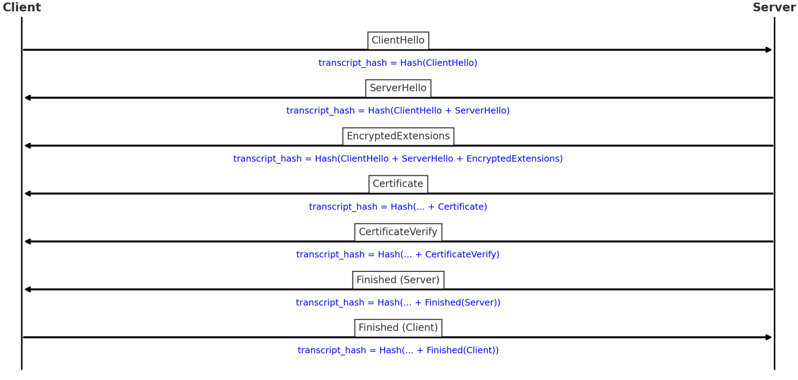

# TLS

## SSL

SSL(Secure Sockets Layer)是最早期的加密协议，用来保障数据在传输过程中的安全。
SSL 已被废弃，因为存在安全漏洞。但很多人习惯口头上还说“SSL证书”，其实现在都是 TLS。

## SSL 证书
在互联网安全通信中，TLS 协议需要确认通信的对方身份，以防止中间人冒充。

为此，TLS 使用 **X.509 数字证书**。这种证书最初并不是为 TLS 专门设计的，而是更早期的身份认证标准。后来被 SSL/TLS 协议采纳，用来：

- 证明服务器(或客户端)的身份；

- 提供公钥，支持安全的密钥交换。

由于 SSL 协议在早期被广泛使用，这类证书被俗称为“SSL 证书”。其实，无论今天是 HTTPS、FTPS 还是 IMAPS，背后用的都是同样的 X.509 证书，只不过现在协议主流是 TLS。

常见的 “xxxS” 协议(如 HTTPS = HTTP over TLS)通常表示在原协议上加了一层加密保护。但需要注意：历史上有些 “S” 协议最早是基于 SSL，而不是现在的 TLS，有的还支持 STARTTLS 这样的方式。所以 “S = TLS” 并不是绝对规律。

## TLS
TLS(Transport Layer Security，传输层安全协议)是继承自 SSL 的安全通信协议，目前已经发展到 **TLS 1.3**，这是现阶段最安全、应用最广泛的版本。  

TLS 本质上是一个独立的安全层协议，它并非专为 HTTP 设计，而是基于 **TCP** 的通用安全机制。常见应用包括：  

- **HTTPS**：`HTTP over TLS`，即 HTTP 流量通过 TLS 加密传输  
- **IMAPS / SMTPS / POP3S**：邮件协议通过 TLS 加密  
- **FTPS**：FTP 基于 TLS 的安全传输  

此外，当在 **UDP** 上使用时，TLS 的变体称为 **DTLS(Datagram TLS)**，并非直接套用 TLS。  


## TLS握手 

## ClientHello
### 协议版本
- 内容：客户端支持的 TLS 版本(通常是 TLS 1.3，但会兼容低版本)。

- 作用：让服务端知道客户端“我至少能用 TLS 1.2/1.3，你选一个大家都支持的”。

### Client Random(随机数)

- 内容：一个 32 字节的随机值。

- 作用：后续生成密钥时的输入之一，确保密钥是每次握手唯一的，防止重放攻击。

### Session ID / PSK 信息(可选)

- 内容：可能包含上次会话的 ID 或者基于 PSK (Pre-Shared Key) 的参数。

- 作用：支持 会话恢复 和 0-RTT(客户端在握手未完成前就能发数据)。

### Cipher Suites(密码套件列表)

- 内容：客户端支持的一组加密算法组合。

- 作用：让服务端从中选择一个双方都支持的安全算法。

以下是官方推荐的 5 种套件

|套件名称	|加密算法	|哈希算法	|适用场景|
|-|-|-|-|
|TLS_AES_256_GCM_SHA384|	AES-256-GCM|	SHA-384|	最高安全级别(推荐生产环境)|
|TLS_AES_128_GCM_SHA256|	AES-128-GCM|	SHA-256	|平衡安全与性能(通用场景)|
|TLS_CHACHA20_POLY1305_SHA256	|ChaCha20-Poly1305|	SHA-256	|移动设备/无 |AES 硬件加速(如 Android)|
|TLS_AES_128_CCM_SHA256|	AES-128-CCM|	SHA-256	|特殊硬件需求(极少使用)|
|TLS_AES_128_CCM_8_SHA256	|AES-128-CCM-8(短标签)|	SHA-256|	资源严格受限设备(不推荐)|


### Compression Methods

- 内容：TLS 1.3 已废弃压缩，这里基本为空, TLS 1.3 固定为 null

- 作用：防御 CRIME 攻击(TLS 压缩漏洞)。

### KeyShare(密钥交换参数)

- 内容：客户端的 ECDHE 公钥(曲线 ID + 公钥点)。

- 作用：提供 DH/ECDHE 公钥参数，服务端用它和自己的私钥算共享秘密。

- 注意：这是 TLS 1.3 最大的改进之一，首次握手就发公钥，避免了 TLS 1.2 的“多往返”。

### Supported Groups(椭圆曲线/群 ID)

- 内容：客户端支持的椭圆曲线或有限域 DH 群(如 secp256r1, x25519)。

- 作用：告诉服务端“我能做哪些曲线上的 ECDHE”，避免选一个客户端不会的。

### Signature Algorithms

- 内容：客户端支持的数字签名算法(如 rsa_pss_rsae_sha256, ecdsa_secp256r1_sha256)。

- 作用：服务端在发证书和签名时，需要选择一种客户端认可的算法。

### Supported Versions(TLS 1.3 专有)

- 内容：客户端支持的 TLS 版本列表(比如 [0x0304=TLS 1.3, 0x0303=TLS 1.2])。

- 作用：避免降级攻击(防止攻击者强迫客户端退回到 TLS 1.0 之类的老版本)。

### Extensions(扩展)

TLS 1.3 里，ClientHello 的扩展字段极其重要：

- SNI(Server Name Indication)：告诉服务器目标域名，便于虚拟主机区分不同网站。

- ALPN(Application Layer Protocol Negotiation)：比如选择 http/1.1 或 h2 (HTTP/2)。

- OCSP stapling：要求服务端附带证书状态响应。

- PSK / Early Data：如果要用 0-RTT，可以在这里声明。

---

## ServerHello
### 协议版本

- 内容：服务端选择的最终版本(通常就是 TLS 1.3)。

- 作用：明确告诉客户端“我们这次会话使用 TLS 1.3”，防止降级攻击。

### Server Random(随机数)

- 内容：一个 32 字节的随机值。

- 作用：与 Client Random 一起参与密钥派生，确保每次会话的密钥都是唯一的。

### Session ID Echo(会话 ID 回显，可选)

- 内容：如果客户端提供了 Session ID，这里可能会回显。

- 作用：TLS 1.3 中不常用，主要为了兼容性(TLS 1.2 的会话恢复机制)。

### Cipher Suite(密码套件)

- 内容：从客户端提供的候选列表里选一个，比如 TLS_AES_128_GCM_SHA256。

- 作用：确定双方后续通信的加密算法(对称加密 + 哈希函数)。

### Compression Method(固定 null)

- 内容：TLS 1.3 废弃了压缩，这里基本固定为 null。

- 作用：防止 CRIME 攻击。

### KeyShare(服务端的 ECDHE 公钥参数)

- 内容：服务端的 ECDHE 公钥(曲线 ID + 公钥点)。

- 作用：和客户端的 KeyShare 一起，通过 ECDHE 算法计算共享秘密。

### Supported Versions(确认版本)

- 内容：确认使用的 TLS 版本(一般就是 TLS 1.3)。

- 作用：再次防止降级攻击，确保双方对版本达成一致。

### 其他扩展(Extensions)

- ALPN(应用层协议协商)：选择 HTTP/2 (h2) 或 HTTP/1.1。

- PSK / Early Data：如果使用了会话恢复或 0-RTT，在这里确认。

- 其他扩展：可能包括加密算法参数协商结果。

---

## 字段对照

|类别	|ClientHello 发的内容|	ServerHello 的回应|	作用|
|-|-|-|-|
|协议版本|	Supported Versions(支持的版本列表)|	选择一个版本	|确认最终使用的 TLS 版本，防止降级攻击|
|随机数|	Client Random(32字节随机数)|	Server Random(32字节随机数)|	两个随机数一起参与密钥派生，保证每次会话唯一|
|会话恢复 / 0-RTT|	Session ID / PSK 信息|	Session ID 回显 / PSK 接受|	支持会话恢复和 0-RTT 数据传输|
|密码套件|	Cipher Suites(候选列表)|	从列表中选定一个|	确定最终对称加密和哈希算法|
|压缩方式|	TLS 1.3 固定 null|	固定 null|	为避免 CRIME 攻击, TLS 1.3 废弃压缩|
|密钥交换参数|	KeyShare(ECDHE 公钥，曲线 ID + 公钥点)|	KeyShare(服务端 ECDHE 公钥)	|双方用 ECDHE 公钥计算共享秘密，生成后续密钥材料|
|支持的曲线 / 群|	Supported Groups	|已通过 KeyShare 表现|	确认使用哪条曲线进行 ECDHE|
|支持的签名算法|	Signature Algorithms |	在后续 CertificateVerify 使用	|确保服务器证书签名客户端能验证|
|扩展信息|	| |	确定访问的虚拟主机、上层协议，以及证书状态等|

---

## 计算共享秘密

### 计算过程
|项目|	服务端持有|	客户端持有	|来源说明|
|-|-|-|-|
|ECDHE 私钥	|服务端自己生成|	客户端自己生成	|各自本地产生，不交换|
|ECDHE 公钥|	ClientHello 里获得客户端公钥|	ServerHello 里获得服务端公钥|	公钥由对方发送，自己保存|
|曲线 ID|	从 ClientHello.KeyShare 里看到候选曲线并选择|	从 ServerHello.KeyShare 里得知服务端选择的曲线	|客户端提议，服务端选择并确认|

结果: 双方用自己的私钥 + 对方的公钥 = 算出相同的 ECDHE共享秘密(ECDHE_SharedSecret)

### 计算原理
#### ECDHE 的基本数学背景
以 椭圆曲线 Diffie-Hellman(ECDH) 为例：
- 双方事先约定好一条椭圆曲线(比如 secp256r1)和一个基点 G
- 客户端生成一个随机私钥 a，并计算公钥 A = aG
- 服务端生成一个随机私钥 b，并计算公钥 B = bG
- 双方交换各自的公钥 A 和 B。

#### 双方计算共享秘密

- 客户端拿到服务端公钥 B，用自己的私钥 a 计算：Sc = aB = a(bG) = (ab)G

- 服务端拿到客户端公钥 A，用自己的私钥 b 计算：Ss = bA = b(aG) = (ab)G

也就是说，虽然双方只知道自己的私钥，但因为群运算的交换律，最后计算出来的点完全相同

#### 为什么攻击者拿不到

- 攻击者只能看到：基点 G，客户端公钥 A=aG，服务端公钥 B=bG。

- 他要想计算共享秘密 (ab)G，必须知道 a 或 b。

- 但根据 椭圆曲线离散对数问题(ECDLP)，从 A=aG 推出 a 在**现有计算能力下是不可行**的。

- 所以，攻击者不能计算出 (ab)G，而客户端和服务端可以。

---

## 派生阶段密钥
### 问题背景
- 共享秘密只是一个椭圆曲线点的坐标，分布不均匀，不适合直接作为对称加密密钥。
- 要派生多个不同用途的密钥，即使一个阶段的密钥泄露，其他阶段的密钥也不会受影响。
### HKDF介绍
HKDF (HMAC-based Key Derivation Function) **是一个**基于 HMAC 的密钥派生**函数**。
它的作用是：从一个原始秘密中，安全地派生出多个独立、用途不同的子密钥。

### 具体流程(***)
1. 双方 HKDF-Extract 对共享秘密进行标准化, 获得标准化的Handshake Secret
2. 双方 HKDF-Expand 派生出握手阶段的密钥(client/server handshake traffic key)
3. Server 使用 server handshake traffic key 分别加密发送以下消息
   - EncryptedExtensions(用 s hs traffic key 加密)

   - Certificate(用 s hs traffic key 加密)

   - CertificateVerify(用 s hs traffic key 加密，内部用证书私钥对 transcript_hash 签名)

   - Finished(Server)(用 s hs traffic key 加密，内部用 finished key 对 transcript_hash 做 HMAC)
4. 客户端每收到一条握手消息就 立刻解密并更新 transcript_hash，不是等全部收完才一起解。
   - 验证证书链（CA → 网站证书）

   - 验证 CertificateVerify 签名（用证书公钥）

   - 验证 Finished(Server)（用 finished key 校验 HMAC）
5. 客户端用 c hs traffic key 加密发送 Finished(Client)，内部同样是用 finished key 对 transcript_hash 做 HMAC。
6. 服务端解密并验证, 至此握手完成
7. 双方 HKDF-Extract 对共享秘密进行标准化, 获得标准化的 Master Secret
8. 双方 HKDF-Expand 派生出握手阶段的密钥(client/server application traffic key)
9. 丢弃 handshake traffic key, 进入应用数据加密阶段（HTTP/2、HTTP/3 等）


::: tip
里面有些概念还不理解没关系, 下面有详细的介绍
:::

---


## HKDF-Extract

**从下列表格的产物中得到3个标准化后的结果: EarlySecret, HandshakeSecret, MasterSecret**

|产物|salt|IKM|公式表达|
|-|-|-|-|
|EarlySecret|0|如果用了 PSK(Pre-Shared Key，例如会话恢复/0-RTT), 则为PSK, 否则为0|EarlySecret = HKDF-Extract(0, PSK(0))|
|HandshakeSecret|EarlySecret|ECDHE共享秘密|HandshakeSecret = HKDF_Extract(EarlySecret,ECDHE_SharedSecret)|
|MasterSecret|HandshakeSecret|0|MasterSecret = HKDF_Extract(HandshakeSecret,0)|

---


## transcript_hash

在每个阶段，双方都会**根据 `ServerHello` 选定的密码套件里规定的 `hash`** 算法把到目前为止的所有握手消息做一次哈希。




### 作用

- 保证密钥和握手消息强绑定，防止攻击者篡改握手消息。

- **如果中间有人修改了 ClientHello 或 ServerHello，hash 就会不同 → 派生出的密钥也不同 → 最终 Finished 校验会失败**。

## HKDF-Expand
### 输入材料
`HKDF-Expand-Label(secret, label, context, length)`

- **secret**：输入的阶段 Secret(例如 Handshake Secret、Master Secret)
- **label**：密钥用途标签，由协议固定定义，如：
  - `"c hs traffic"`：客户端握手流量密钥
  - `"s hs traffic"`：服务端握手流量密钥
  - `"c ap traffic"`：客户端应用流量密钥
  - `"s ap traffic"`：服务端应用流量密钥
  - `"finished"`：Finished 报文校验密钥
- **context**：通常是握手消息的 transcript_hash，用来保证密钥和所有握手内容强绑定
- **length**：要输出的密钥长度，由密码套件 (cipher suite) 决定，例如 AES-128-GCM 需要 16 字节，AES-256-GCM 需要 32 字节

### 工作原理
Expand 实际上是反复运行 HMAC：

```
T(1) = HMAC(secret, info || 0x01)
T(2) = HMAC(secret, T(1) || info || 0x02)
...
OKM = T(1) || T(2) || ... 直到满足所需长度
```
- **info** = "tls13 " + label + context
- **counter**：保证能生成足够长的输出，一般只到 1 就够了(因为 TLS 密钥长度不大)

### 产出产品

#### 握手阶段
| 基于的标准化Secret| 派生结果 | Label| Context (info) | Length 来源| 用途 |
| - | - | - | - | - | - |
| **Handshake Secret** | client handshake traffic secret | `"c hs traffic"` | transcript_hash(ClientHello+ServerHello) | cipher suite | 客户端握手阶段加密/解密 |
| | server handshake traffic secret | `"s hs traffic"` | transcript_hash(ClientHello+ServerHello) | cipher suite | 服务端握手阶段加密/解密 |
| | finished key (client/server) | `"finished"` | transcript_hash(到当前消息) | HMAC 输出长度| 生成/校验 Finished 报文 |

#### 应用阶段
| 基于的标准化Secret | 派生结果 | Label| Context (info) | Length 来源| 用途 |
| - | - | - | - | - | - |
| **Master Secret**| client application traffic secret | `"c ap traffic"` | transcript_hash(握手消息全集) | cipher suite | 客户端应用数据加密/解密 |
| | server application traffic secret | `"s ap traffic"` | transcript_hash(握手消息全集) | cipher suite | 服务端应用数据加密/解密 |
| | exporter master secret| `"exp master"` | transcript_hash(握手消息全集) | HMAC 输出长度| 应用层导出密钥(外部使用) |
| | resumption master secret | `"res master"` | transcript_hash(握手消息全集) | HMAC 输出长度| 生成 PSK 用于未来会话恢复 |

### 0-RTT 阶段(可选)

| 基于的标准化Secret | 派生结果 | Label| Context (info) | Length 来源| 用途 |
| - | - | - | - | - | - |
| **Early Secret** | binder key | `"res binder"` | transcript_hash(ClientHello\[without binders]) | HMAC 输出长度| 验证 PSK 绑定(0-RTT/会话恢复) |
| | client early traffic secret | `"c e traffic"` | transcript_hash(ClientHello)| cipher suite | 0-RTT 数据加密|
| | early exporter master secret | `"e exp master"` | transcript_hash(ClientHello)| HMAC 输出长度| 提供 0-RTT 的密钥导出|

---


## 证书验证

### CA
CA的全称是“证书颁发机构”(Certificate Authority)，它是由受信任的第三方机构负责签发和管理数字证书，以验证网络实体(如网站、用户、设备)的身份，并保障通信安全


---


### 根CA证书

操作系统厂商(Microsoft Windows、Apple、Linux 发行版)、浏览器厂商(Chrome、Firefox)会有自己的信任根计划(Root Program)

他们有自己的密钥对A, 用私钥A对自己的信息和公钥进行加密获得数字签名, 并将数字签名和公钥A放入证书, 并预先安装在浏览器或者操作系统里

根CA的私钥一旦泄露，全世界的信任体系就崩溃(任何人都能伪造合法证书)。
所以根CA的私钥通常保存在 HSM(硬件安全模块)，离线存储、物理隔离。

平时不会直接用根私钥签发终端证书，而是只用它签发中间CA证书和每隔几年更新一次中间CA证书

当签发中间CA时，根CA可能举行线下签发仪式(有摄像、多人见证、密钥分片恢复)。
一旦签好中间CA证书，就把根私钥再锁回保险柜。


---

### 中间CA证书  
中间CA需要根CA签发**中间CA证书(Intermediate Cert)**, 以便于证明中间CA是中间CA, 因此也有自己的密钥对B。

中间CA将公钥B和自己的信息一并交给根CA, 根CA使用私钥A进行数字签名后, 将中间CA证书签发给中间CA。

---

### 网站证书

每个网站都有一对专属密钥C, 将公钥C和域名信息、有效期、证书等信息等交给中间CA。

中间CA将这些信息和公钥C进行哈希运算得到哈希值, 再用私钥B对哈希值进行加密得到中间CA的数字签名。

最后将公钥C、数字签名还有上述信息放入网站证书(Leaf Cert), 签发给网站主人

---

### 用户访问网站  

当用户在浏览器中输入 `https://example.com` 时，服务器会返回一份 **证书链**，其中通常包含：  
- 网站证书(Leaf Certificate)  
- 中间 CA 证书(Intermediate Certificate)  

客户端收到证书链后，会依次验证，形成一条“信任链(Chain of Trust)”。  

---

#### 验证网站证书 
- 网站证书上带有 **中间 CA 的签名**。  
- 客户端需要使用 **中间 CA 的公钥 B** 来验证该签名。  
- 公钥 B 就存放在“中间 CA 证书”中。  
- 因此，在验证网站证书前，客户端必须先验证中间 CA 证书的有效性。  

---

#### 验证中间 CA 证书
- 中间 CA 证书上带有 **根 CA 的签名**。  
- 客户端需要使用 **根 CA 的公钥 A** 来验证该签名。  
- 公钥 A 存放在 **根 CA 证书** 中。  

---

#### 根 CA 证书
- **根 CA 证书是自签的**，即它的签名是自己生成的。  
- 浏览器并不会尝试去验证这个签名，而是直接检查根证书是否存在于操作系统或浏览器的 **受信任列表(Root Store)**  
- 如果该根证书已预装且被信任，则整个信任链才能继续。  

---

#### 信任链的逐级验证过程  
1. **验证根 CA**：确认根证书在本机信任库中。  
2. **用根 CA 公钥 A** 验证中间 CA 证书的签名。  
3. **用中间 CA 公钥 B** 验证网站证书的签名。  
4. 在验证网站证书时：  
   - 客户端先用公钥 B 对网站证书中的数字签名进行解密，得到一个哈希值。  
   - 同时，客户端对网站证书的内容(域名、有效期、公钥等)进行同样的哈希运算。  
   - 如果这两个哈希值相同，则说明证书内容未被篡改，网站证书可信。  


---

### 前向安全(PFS)  
即使服务器的长期私钥在未来泄露，也无法解密历史通信。  
原因是每次会话密钥都由临时密钥 `a`、`b` 生成，与长期私钥无关。  

---

## 会话恢复与 0-RTT  

1. **Session Resumption(会话恢复 / PSK / Ticket)**  
   - 服务器在首次会话结束时发放一个 **Session Ticket**。  
   - 下次连接时，客户端带上 Ticket 作为 PSK，免去证书链传输和签名验证，加速握手。  
   - 推荐使用 **PSK + DHE(PSK-DHE)**：即便票据泄露，仍可保持前向安全。  

2. **0-RTT Early Data(零往返数据)**  
   - 使用 PSK 时，客户端可在服务器最终确认前直接发送少量早期数据(0-RTT)。  
   - **风险**：0-RTT 数据可被 **重放(Replay)**。  
   - 因此对涉及写操作(如下单、转账)必须禁用 0-RTT，或实现 **幂等性 / 防重放机制**。  