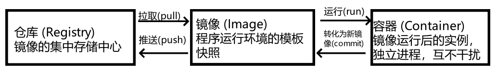

# Docker

程序是跑在操作系统上的，而操作系统上又装了各种不同版本的依赖库和配置，这些被程序所依赖的信息，我们统称为"环境"。程序依赖环境，环境不同，程序就可能跑不起来。

想将项目部署到各个不同操作系统的服务器上，那依赖的软件和配置就更多了。
Docker 就是这样一款可以将程序和环境打包并运行的工具软件。


### Docker 与 虚拟机

传统虚拟机自带一个完整操作系统，而容器本身不带完整操作系统，容器的基础镜像实际上只包含了操作系统的核心依赖库和配置文件等必要组件。

它利用一个叫 Namespace 的能力让它看起来就像是一个独立操作系统一样。再利用一个叫 Cgroup 的能力限制它能使用的计算资源。

容器本质上只是个自带独立运行环境的特殊进程，底层用的其实是宿主机的操作系统内核


## 基础概念



### 镜像
Docker 镜像可以理解为程序运行所依赖环境的`模板`或`快照`。它包含了操作系统的基础层、运行该应用所必需的依赖库、配置文件以及应用本身，从而确保应用在不同环境中都能以一致的方式运行。

镜像本身是只读的，不会在运行过程中发生修改；当镜像被启动时，会在其之上创建一个可写层，从而生成一个容器，容器就是镜像的运行实例。

同一个镜像可以在任何安装了 Docker 的宿主机上启动，运行效果保持一致。同时，一台宿主机上可以基于同一镜像运行多个相互独立的容器。

| 命令 | 说明 | 示例 |
| ---- | ---- | ---- |
| `docker images` | 查看本地已有镜像 | `docker images` |
| `docker pull <image>:<tag>` | 从远程仓库拉取镜像 | `docker pull ubuntu:20.04` |
| `docker rmi <image>:<tag>` | 删除镜像（按名字或 ID） | `docker rmi ubuntu:20.04` |
| `docker tag <image>:<tag> <repo>/<image>:<tag>` | 给镜像打标签 | `docker tag myapp:latest myrepo/myapp:v1` |
| `docker build -t <image>:<tag> .` | 根据 Dockerfile 构建镜像 | `docker build -t myapp:v1 .` |
| `docker save -o <file>.tar <image>:<tag>` | 保存镜像为文件 | `docker save -o myapp.tar myapp:v1` |
| `docker load -i <file>.tar` | 从文件加载镜像 | `docker load -i myapp.tar` |
| `docker push <repo>/<image>:<tag>` | 推送镜像到远程仓库 | `docker push myrepo/myapp:v1` |

### 容器

Docker 容器可以理解为镜像在运行时生成的实例。它基于镜像启动，并在其之上叠加一个可写层，从而允许在运行过程中进行文件写入、配置修改和应用操作。

容器与宿主机共享同一个操作系统内核，但彼此之间相互隔离，包括文件系统、进程空间和网络环境。因此，在同一台宿主机上可以同时运行多个相互独立的容器，而不会互相干扰。

与虚拟机相比，容器更加轻量，启动速度更快，资源占用更少，这使得容器非常适合在微服务架构、持续集成/持续部署（CI/CD）以及弹性伸缩等场景下使用。
| 命令                                             | 说明             | 示例                                        |
| ---------------------------------------------- | -------------- | ----------------------------------------- |
| `docker ps`                                    | 查看当前正在运行的容器    | `docker ps`                               |
| `docker ps -a`                                 | 查看所有容器（包括已停止的） | `docker ps -a`                            |
| `docker run -it <image> bash`                  | 基于镜像启动一个交互式容器  | `docker run -it ubuntu bash`              |
| `docker start <container_id>`                  | 启动已存在的容器       | `docker start 123abc`                     |
| `docker stop <container_id>`                   | 停止正在运行的容器      | `docker stop 123abc`                      |
| `docker rm <container_id>`                     | 删除容器           | `docker rm 123abc`                        |
| `docker exec -it <container_id> bash`          | 进入正在运行的容器      | `docker exec -it 123abc bash`             |
| `docker logs <container_id>`                   | 查看容器运行日志       | `docker logs 123abc`                      |
| `docker cp <local_file> <container_id>:<path>` | 将文件复制到容器中      | `docker cp ./app.py 123abc:/usr/src/app/` |


### 仓库

Docker 仓库（Registry）可以理解为存放和分发镜像的**集中仓库**。它就像是一个镜像的`云盘`，开发者可以将自己构建的镜像推送到仓库中，也可以从仓库中拉取别人已经构建好的镜像来使用。

- **公共仓库**：最常用的是 [Docker Hub](https://hub.docker.com/?utm_source=chatgpt.com)，这里有大量官方和社区维护的镜像。
- **私有仓库**：企业或个人可以搭建自己的镜像仓库（如 Harbor、registry），方便在团队或公司内部共享和管理镜像。

通过使用仓库，开发者可以轻松实现镜像的存储、分发和复用，从而提升协作效率和应用交付速度。

| 命令                                 | 说明         | 示例                            |
| ---------------------------------- | ---------- | ----------------------------- |
| `docker login`                     | 登录到远程仓库    | `docker login`                |
| `docker logout`                    | 登出远程仓库     | `docker logout`               |
| `docker pull <repo>/<image>:<tag>` | 从仓库拉取镜像    | `docker pull nginx:latest`    |
| `docker push <repo>/<image>:<tag>` | 将本地镜像推送到仓库 | `docker push myrepo/myapp:v1` |
| `docker search <keyword>`          | 在公共仓库中搜索镜像 | `docker search mysql`         |

## Dockerfile

**Dockerfile 是一个文本文件**，里面定义了一系列构建镜像所需的指令和步骤。可以把它理解为一份`食谱`，告诉 Docker 应该基于什么环境、安装哪些依赖、复制哪些文件、以及容器启动时要执行什么命令。

通过 Dockerfile，我们可以：

- **自动化构建镜像**，避免手动在容器里一步步配置。

- **确保环境一致**，团队成员和生产环境使用的镜像完全相同。

- **易于维护和迭代**，修改 Dockerfile 并重新构建即可生成新的镜像版本。

**常见指令**

- FROM：指定基础镜像。

- RUN：执行命令（如安装依赖）。

- COPY / ADD：拷贝文件到镜像里。

- WORKDIR：设置容器内的工作目录。

- CMD / ENTRYPOINT：指定容器启动时执行的命令。

::: details 点击查看示例：Python Web 应用的 Dockerfile

```dockerfile
# 选择基础镜像
FROM python:3.9-slim

# 设置工作目录
WORKDIR /app

# 复制依赖文件并安装依赖
COPY requirements.txt .
RUN pip install --no-cache-dir -r requirements.txt

# 复制项目代码
COPY . .

# 暴露容器端口
EXPOSE 5000

# 启动命令
CMD ["python", "app.py"]
```

:::

这个 Dockerfile 的作用是：

1. 基于轻量的 Python 3.9 镜像。
2. 在 /app 目录下安装依赖并复制项目代码。
3. 暴露 5000 端口。
4. 启动时运行 app.py，即一个简单的 Python Web 应用。

## Docker Compose

**Docker Compose 是一个用来定义和管理多容器应用的工具**。通过一个 `docker-compose.yml` 文件，你可以一次性描述多个服务（如 Web、数据库、缓存），并让它们以指定的方式协同运行。

有了 Compose，你不需要一条一条 `docker run` 命令去启动容器，只需一条 `docker-compose up` 就能把整个应用环境跑起来。

使用场景

- 微服务：多个服务组件需要一起启动（如 Nginx + MySQL + Redis）。
- 开发环境：快速搭建一致的测试环境。
- 本地调试：用与生产环境一致的配置文件启动服务。


::: details 点击配置示例
```yaml
version: '3'
services:
  web:
    image: nginx:latest
    ports:
      - "8080:80"
  db:
    image: mysql:5.7
    environment:
      MYSQL_ROOT_PASSWORD: root
    volumes:
      - db_data:/var/lib/mysql

volumes:
  db_data:
```
:::


这个配置启动了两个服务：

- web：基于 Nginx 镜像，映射本地 8080 → 容器 80 端口。
- db：基于 MySQL 5.7，设置了 root 密码，并把数据存放在 volume 中。

| 命令                     | 说明         | 示例                        |
| ---------------------- | ---------- | ------------------------- |
| `docker-compose up -d` | 后台启动所有服务   | `docker-compose up -d`    |
| `docker-compose down`  | 停止并删除容器、网络 | `docker-compose down`     |
| `docker-compose logs`  | 查看服务日志     | `docker-compose logs web` |
| `docker-compose ps`    | 查看运行中的服务   | `docker-compose ps`       |

## 架构原理

**Docker 采用 C/S（客户端/服务端）架构**，Client 对应 Docker-cli， Server 对应 Docker daemon。我们在命令行里敲 Docker 命令，使用的就是 Docker-cli.

Docker Daemon 内部分为 Docker Server、Engine 两层。Docker Server 本质上就是个 HTTP 服务，负责对外提供操作容器和镜像的 api 接口。

接收到 API 请求后，会分发任务给 Engine 层，Engine 层负责创建 Job，由 Job 实际执行各种工作。不同的 Docker 命令会执行不同类型的 Job 任务。

### Docker Client（客户端）
- 用户与 Docker 交互的入口（命令行 docker）。
- 通过 REST API 与 Docker Daemon 通信。

### Docker Daemon（守护进程）
- 常驻后台进程，负责管理镜像、容器、网络和数据卷。
- 接收客户端的请求并执行操作。

### Docker Images（镜像）
- 应用及其依赖的只读模板。

### Docker Containers（容器）
- 镜像运行时的实例，拥有独立的文件系统和运行环境。

### Docker Registry（仓库）
- 镜像存放与分发中心（如 Docker Hub）。

### 工作流程简述
- 用户通过 docker run 等命令与 客户端交互。
- 客户端将请求发给 Daemon。
- Daemon 检查本地是否有镜像，没有就去 Registry 拉取。
- Daemon 基于镜像启动 容器。


## 其他指令

| 功能 | 命令 | 示例 |
| ---- | ---- | ---- |
| 将宿主文件夹复制到容器中 | `docker cp <your_file_name> <container_id>:/<data_path>` | `docker cp ./app 123abc:/usr/src/app` |
| 将正在运行的容器转换为新镜像 | `sudo docker commit <container_id> <new_image_name>` | `sudo docker commit 123abc mynewimage:v1` |
| 使用集显运行容器 | `sudo -E docker run -e DISPLAY=$DISPLAY -v /tmp/.X11-unix:/tmp/.X11-unix -it <image>` | `sudo -E docker run -e DISPLAY=$DISPLAY -v /tmp/.X11-unix:/tmp/.X11-unix -it pb-24` |
| 进入正在运行的容器 | `sudo docker exec -it <container_id> /bin/bash` | `sudo docker exec -it 123abc /bin/bash` |
| 加载 `.tar` 镜像 | `sudo docker load < your_image.tar` | `sudo docker load < myimage.tar` |
| 将镜像保存为 `.tar` | `sudo docker save -o <file>.tar <image>:<tag>` | `sudo docker save -o myimage.tar myapp:v1` |


## 安装教程

### apt
**Step1：更新系统软件包**
```bash
sudo apt update
```
**Step2：安装依赖包【用于通过HTTPS来获取仓库】**
```bash
sudo apt install apt-transport-https ca-certificates curl software-properties-common
```
**Step3：添加Docker官方GPG密钥**
```bash
sudo -i
curl -fsSL https://mirrors.aliyun.com/docker-ce/linux/ubuntu/gpg | gpg --dearmor -o /etc/apt/trusted.gpg.d/docker-ce.gpg
```
**Step4：验证**
```bash
sudo apt-key fingerprint 0EBFCD88
0EBFCD88 是公钥的指纹。执行这个命令后，系统会显示与该指纹相关的公钥信息。
```
**Step4：添加Docker阿里稳定版软件源**
```bash
sudo add-apt-repository "deb [arch=amd64] https://mirrors.aliyun.com/docker-ce/linux/ubuntu $(lsb_release -cs) stable"
```
**Step5：再次更新软件包**
```bash
sudo apt update
```
**Step6：安装默认最新版**
```bash
sudo apt install docker-ce docker-ce-cli containerd.io
```

### dnf

```bash
# 1) 卸载旧版本（如有）
sudo dnf remove -y docker docker-client docker-client-latest docker-common \
  docker-latest docker-latest-logrotate docker-logrotate docker-engine

# 2) 添加官方仓库并安装
sudo dnf -y install dnf-plugins-core
sudo dnf config-manager --add-repo https://download.docker.com/linux/fedora/docker-ce.repo
sudo dnf -y install docker-ce docker-ce-cli containerd.io docker-buildx-plugin docker-compose-plugin

# 3) 启用服务
sudo systemctl enable --now docker
```

