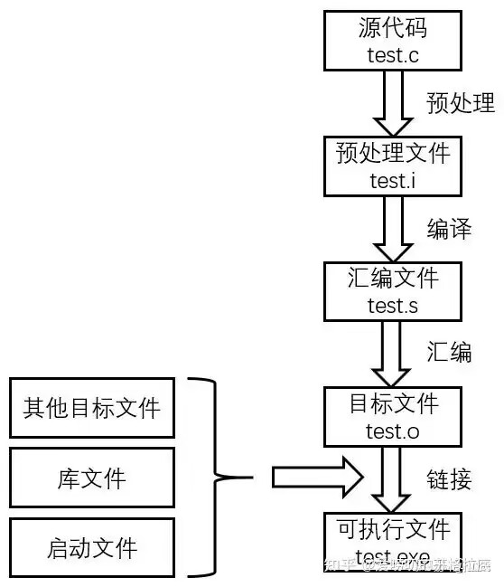

# 编译与链接

## 编译过程

在深入了解作用域、链接和存储期之前，理解 C++ 的编译和链接过程非常重要。


### 第 1 步: 预处理 (Preprocessing)
- 源文件预处理生成对应的 `.i` 文件，预处理会把 `.c` 文件和头文件展开到 `.i` 文件当中
- 预处理器读取源代码文件，处理以 `#` 开头的指令。
- 预处理器的输出是一个经过修改的源代码文件，通常以 `.i` 或 `.ii` 为扩展名。
- 就是简单的文本复制替换

| 常见的操作     | 宏展开| 文件包含 | 条件编译 | 删除注释 |
| -------- | -------- | -------- | -------- | -------- |
|  |`#define`|`#include`|`#ifdef`, `#ifndef`, `#if`| |

### 第 2 步: 汇编 (Assembly)
- `.i` 预处理文件经过编译 生成了汇编文件 `.s` 汇编文件中就是汇编代码
- 编译器将预处理后的源代码文件翻译成汇编语言代码。


### 第 3 步: 编译 (Compilation)
- 汇编文件经过汇编，生成了对象文件，也就是目标文件，以elf格式保存起来

- 编译器会进行语法分析、语义分析、优化等操作。
- 通过编译之后，就会将源文件编译成目标文件
- 编译器的输出是一个包含机器指令的目标文件，通常以 `.o` (Unix/Linux) 或 `.obj` (Windows) 为扩展名。
- 目标文件包含了编译后的代码和一些符号信息，用于后续的链接。
- `.o` 并不可以执行，编译器并不知道声明的 `add` 和 `printf`


相应的windows下 PE 虽然互不兼容，但结构相似，都是对二进制代码的一种封装。
可以在文件头部找到可执行文件的头部信息，比如操作系统 机器类型。
后面是区块section，里面是机器代码和程序的数据。


### 第 4 步: 链接 (Linking)
- 链接器将一个或多个目标文件以及所需的库文件(静态库 `.a` 或 `.lib`，动态库 `.so` 或 `.dll`) 合并成一个可执行文件。
- 链接器的主要任务是解析符号引用。目标文件中可能引用了在其他目标文件或库中定义的函数或变量。链接器会找到这些符号的定义，并将所有的引用关联起来。
- 如果链接器找不到某个符号的定义，就会报告链接错误。

### g++命令
```bash
g++ -c  filename.cpp
g++ filename1.o filename2.o -o executableFile
```

## 翻译单元
一个 `.cpp` 源文件及其包含的所有头文件（经过预处理后）被视为一个翻译单元。

链接主要发生在不同的翻译单元之间。​可以理解为多个文件在编译器中可能以一个文件出现。

​通常在源代码中包含一个或多个头文件，头文件会依次包含其他头文件，所以会包含多个单独的物理文件。

但c预处理实际上使用包含的头文件内容替换#include指令。所以编译器源代码文件和所有的头文件都看成一个包含信息的单独文件，这个文件被称为翻译单元。

​描述一个具有文件作用域的变量时，他的实际可见范围是整个翻译单元。

如果程序由多个源代码文件组成，那么该程序也将有多个翻译单元组成。

每个翻译单元均对应一个源代码文件和她所包含的文件。

## 作用域 (Scope)

作用域描述了程序中一个标识符（例如变量名、函数名）在哪些区域是可见的或可以被访问的。

**块作用域 (Block Scope):**

- 标识符在声明它的花括号 `{}` 内部可见。
- 这包括函数体、循环体、条件语句体等。
- 在块内声明的变量在块外部是不可见的。

```cpp
void myFunction() {
    int x = 10; // x 具有块作用域，只在 myFunction 函数内部可见
    if (true) {
        int y = 20; // y 具有内部块作用域，只在 if 语句块内部可见
        std::cout << x << " " << y << std::endl; // 可以访问 x 和 y
    }
    std::cout << x << std::endl; // 可以访问 x
    // std::cout << y << std::endl; // 错误：y 在这里不可见
}
```

**函数作用域 (Function Scope):**
- 仅适用于 `goto` 语句的标签。标签在整个函数体内都是可见的。
- 现代 C++ 编程中应尽量避免使用 `goto`。

```cpp
void anotherFunction() {
    goto myLabel;
    int x = 5; // 这行代码不会被执行
    myLabel:
    std::cout << "Reached label." << std::endl;
}
```

**函数原型作用域 (Function Prototype Scope):**
- 用于函数原型（函数声明）中的参数名。参数名在原型声明结束后就失效了，它们的主要作用是提供类型信息。

```cpp
void printValue(int value); // 'value' 具有函数原型作用域

void printValue(int x) { // 'x' 具有块作用域
    std::cout << "Value: " << x << std::endl;
}
```

**文件作用域 (File Scope) 或全局作用域 (Global Scope):**
- 在所有函数外部声明的标识符具有文件作用域（也称为全局作用域）。
- 这些标识符从声明点开始到文件结束都是可见的。
- **链接属性**对于文件作用域的变量非常重要。

```cpp
int globalVar = 100; // 具有文件作用域，默认情况下具有外部链接

static int internalVar = 200; // 具有文件作用域和内部链接

void someFunction() {
    std::cout << globalVar << std::endl; // 可以访问 globalVar
    std::cout << internalVar << std::endl; // 可以访问 internalVar
}
```

## 链接 (Linkage)

链接描述了程序的不同部分（不同的翻译单元）中的标识符如何相互关联。它决定了一个标识符是否能在多个文件中被引用。

**无链接 (No Linkage):**
- 具有块作用域、函数作用域或函数原型作用域的标识符没有链接。
- 它们是其所在块、函数或函数原型的私有成员，不能被其他翻译单元访问。

**外部链接 (External Linkage):**
- 具有文件作用域且没有使用 `static` 关键字修饰的标识符默认具有外部链接。
- 具有外部链接的标识符可以在多个翻译单元中使用。
- 要在一个文件中使用在另一个文件中定义的具有外部链接的变量或函数，需要使用 `extern` 关键字进行声明。

**文件 `file1.cpp`:**
```cpp
int sharedVar = 5; // 具有外部链接
void printSharedVar(); // 声明，将在其他文件中定义
```

**文件 `file2.cpp`:**
```cpp
#include <iostream>

extern int sharedVar; // 声明 sharedVar 在其他地方定义
void printSharedVar() {
    std::cout << "Shared variable: " << sharedVar << std::endl;
}

int main() {
    printSharedVar(); // 可以访问并使用在 file1.cpp 中定义的 sharedVar
    return 0;
}
```

**内部链接 (Internal Linkage):**
- 具有文件作用域且使用 `static` 关键字修饰的标识符具有内部链接。
- 具有内部链接的标识符只能在定义它们的**翻译单元**中使用，不能被其他文件中的代码直接引用。

**文件 `file1.cpp`:**
```cpp
static int localData = 10; // 具有内部链接
void processLocalData();
```

**文件 `file2.cpp`:**
```cpp
// extern int localData; // 错误：无法找到具有外部链接的 localData

void processLocalData() {
    // 可以访问 file1.cpp 中定义的 localData
}

int main() {
    // ...
    return 0;
}
```

## 存储期 (Storage Duration)

存储期描述了对象在内存中存在的时长。

**静态存储期 (Static Storage Duration):**
- 如果对象具有静态存储期，它在程序的整个执行期间都存在。
- 文件作用域的变量（无论是使用 `static` 修饰还是未修饰）都具有静态存储期。
- 使用 `static` 关键字在函数内部声明的局部变量也具有静态存储期，但其作用域仍然是块作用域。它们在程序开始时被创建，并在程序结束时销毁，但在其作用域之外不可访问。

```cpp
int globalValue = 50; // 静态存储期，外部链接

static int fileLocalValue = 75; // 静态存储期，内部链接

void counter() {
    static int count = 0; // 静态存储期，无链接（仅在 counter 函数内部可见）
    count++;
    std::cout << "Count: " << count << std::endl;
}

int main() {
    counter(); // 输出 Count: 1
    counter(); // 输出 Count: 2
    return 0;
}
```

**注意：** 对于文件作用域的变量，`static` 关键字主要控制其**链接属性 (内部链接)**，而不是存储期。无论是否使用 `static`，文件作用域的变量都具有静态存储期。

**线程存储期 (Thread Storage Duration):**
- 用于并发程序设计。程序执行可以被分为多个线程。
- 具有线程存储期的对象从被声明到所属线程结束一直存在。
- 可以使用关键字 `thread_local` (C++11 引入) 声明一个对象，每个线程都拥有该变量的私有副本。

```cpp
#include <iostream>
#include <thread>

thread_local int threadSpecificData = 0;

void threadFunction() {
    threadSpecificData++;
    std::cout << "Thread ID: " << std::this_thread::get_id() << ", Data: " << threadSpecificData << std::endl;
}

int main() {
    std::thread t1(threadFunction);
    std::thread t2(threadFunction);

    t1.join();
    t2.join();

    return 0;
}
```

**自动存储期 (Automatic Storage Duration):**
- 块作用域的变量（除了声明为 `static` 或 `extern` 的）通常都具有自动存储期。
- 它们在进入声明它们的代码块时被自动创建（分配内存），在退出该代码块时被自动销毁（释放内存）。
- 函数的参数也具有自动存储期。

```cpp
void anotherFunction() {
    int localVar = 10; // 自动存储期，在 anotherFunction 调用时创建，结束时销毁
    std::cout << localVar << std::endl;
}
```

**动态分配存储期 (Dynamic Storage Duration):**
- 通过使用 `new` 运算符在堆（heap）上分配的内存具有动态分配存储期。
- 这部分内存的生命周期由程序员显式地使用 `delete` 运算符来管理。
- 如果忘记使用 `delete` 释放动态分配的内存，会导致内存泄漏。

```cpp
int* dynamicVar = new int(25); // 在堆上分配内存，具有动态存储期
std::cout << *dynamicVar << std::endl;
delete dynamicVar; // 显式释放内存
dynamicVar = nullptr;
```

## 作用域、链接和存储期的关系

这三个概念是 C++ 中管理变量和函数生命周期和可见性的关键。它们相互关联但又各自独立：

- **作用域**决定了标识符在代码的哪个区域可以被访问。
- **链接**决定了具有文件作用域的标识符是否可以在不同的翻译单元之间共享。
- **存储期**决定了对象在内存中存在的时间长短。

例如，一个具有文件作用域的 `static` 变量拥有静态存储期（在程序运行期间一直存在）和内部链接（只能在定义它的文件中访问）。一个具有块作用域的局部变量通常拥有自动存储期（在进入代码块时创建，退出时销毁）和无链接（只能在其所在的块内访问）。

理解这些概念对于编写清晰、高效和可维护的 C++ 程序至关重要。