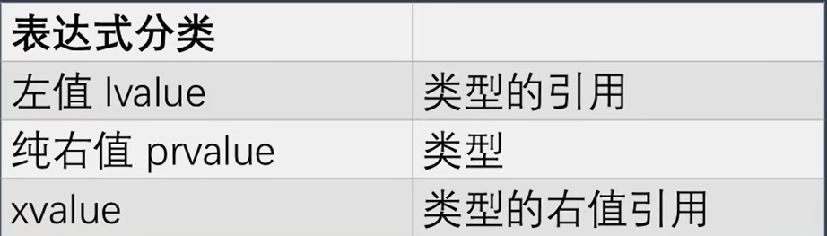

# 占位类型说明符


## auto关键字
auto只能推断出类型，引用不是类型，所以auto无法推断出引用，要使用引用只能自己加引用符号。

auto关键字在推断引用的类型时：会直接将引用替换为引用指向的对象。其实引用一直是这样的，引用不是对象，任何使用引用的地方都可以直接替换成引用指向的对象。

auto关键字在推断类型时，如果没有引用符号，会忽略值类型的const修饰，而保留修饰指向对象的const，典型的就是指针。
```cpp
int main() {
    int i = 100;

    const int* const pi = &i;

    auto pi2 = pi;
    //auto 就是 int const *   (const int *)
}
```
**没有引用修饰 就是值传递 auto获取值的类型**

auto关键字在推断类型时，如果有了引用符号，那么值类型的const和修饰指向对象的const都会保留

**因为在传递值时，修改这个值并不会对原有的值造成影响。而传递引用时，修改这个值会直接对原有的值造成影响。**
```cpp
int main() {
    int i = 100;

    const int* const pi = &i;

    auto& pi2 = pi;
    //全部保留
}
```
当然，我们可以在前面加上const，这样永远都有const的含义。
```cpp
int i = 100;
const auto i2 = i;
```
auto不会影响编译速度，甚至会加快编译速度。因为编译器在处理XX a = b时，当XX是传统类型时，编译期需要检查b的类型是否可以转化为XX。当XX为auto时，编译期可以按照b的类型直接给定变量a的类型，所以效率相差不大，甚至反而还有提升。

**最重要的一点，就是auto不要滥用，对于一些自己不明确的地方不要乱用auto，否则很可能出现事与愿违的结果，使用类型应该安全为先。**

**auto主要用在与模板相关的代码中，一些简单的变量使用模板常常导致可读性下降，经验不足还会导致安全性问题。**

自动变量：auto是储存类别说明符 cpp中的auto和c的auto完全不同 在编写c/cpp兼容程序 **最好不要用auto作为储存类别说明符(auto int lpox)** 但是可以用 自动类型推断(auto a = xxx)

## decltype关键字

`decltype` 关键字是从 `C++11` 开始引入的。通过这个运算符能够获得一个变量或者表达式的值的类型。在编译时会对代码中 `decltype` 中的表达式进行类型的推导和替换。
```cpp
decltype(变量)
decltype(表达式)
```


当 `decltype` 用于变量以及类的成员变量时, 能够获得变量的类型, 同时还能够得到这个类型的引用类型, 以及 `cv` 限定符。也就是我们常用的 `const` 限定符和不常用的 `volatile` 限定符

```cpp
int a;
decltype(a) b; // 等价于 int b;
```
```cpp
const int a = 3;
decltype(a) b = 5; // 等价于 const int b = 5;
```

```cpp
int a = 3;
int& b = a;
decltype(b) c = a; //before: a = 3
c = 4; //after: a = 4
```

```cpp
struct S {
    float a;
};

int main() {
    decltype(S::a) a = 0.1; // float a = 0.1;
    S s1;
    decltype(s1.a) b = 0.1; // float b = 0.1;
}
```
不过还有更简单的方法,就是通过编辑器直接查看

**`auto` 只能推导出基本类型, 而不能获得引用类型以及`cv`限定符。所以需要手动添加。**
```cpp
const int a = 3;
const int& b = a;
decltype(b) c = a; // const int& c = a;
auto d = b; // int d = b;
```


如果用于除此之外的表达式, 则情况有所不同。这是为什么呢?

```cpp
int a = 1;
decltype((a)) b = a; // int& b = a;
int* p = &(a);
```



这是因为 `decltype` 对于表达式的类型推导, 与单纯的变量的类型推导方法非常不同。

对于表达式类型获得的是: 先获得表达式的值去除引用后的基本类型, 然后按照表达式的左值、纯右值和xvalue分类来推导出引用方式。


对于左值获得的是类型的引用,  纯右值则是没有引用的类型, 对于xvalue是类型的右值引用


对于这种形式 `decltype((a))` 的表达式可以获得它的地址, 所以这个表达式是个左值。


按照刚才所说的推导方法, 对于 `decltype` 推导出的是左值引用, 因此最终推导出来的结果是个int类型的引用


如果 `decltype` 中的参数是个函数调用, 推导出来的结果会比较有趣

```cpp
std::string f1() {
    return std::string("Hello");
}

string& f2() {
    static std::string s = "Hello";
    return s;
}

string&& f3(std::string& s) {
    return std::move(s);
}

int main() {
    decltype(f1()) s1;
    decltype(f2()) s2 = s1;
    decltype(f3(s1)) s3 = "hello";
}
```


函数 `f1()` 返回的是一个 `string` 类型的值。所以函数 `f1()` 的调用是个右值, 类型是 `string` 因此 `decltype` 推导出来的是 `string` 类型。

函数 `f2()` 返回的是一个 `string` 引用。所以函数 `f2()` 的调用是个左值, 因此 `decltype` 推导出来的是 `string` 引用。

函数 `f3()` 返回的是个右值引用。所以函数 `f3()` 的调用是个xvalue, 因此 `decltype` 推导出来的是 `string` 右值引用。


所以最后发现对于函数的调用, `decltype` 推导出来的类型正好是函数的返回值类型。

```cpp
std::string s1 = "Hello";
 // 这一行是调用的string的加法重载运算符. 它返回的是个string值
 // 所以S2的类型是个string对象, 它初始化时复制了S1的值
decltype(s1 + ", world") s2 = s1;
 // append 函数返回的是个引用 所以s3是s1的引用
 // decltype里的表达式只在编译时由编译器用于类型的推导, 不会在运行时真正执行, 所以S1的值仍然是hello
decltype(s1.append(", world")) s3 = s1;
```

## decltype(auto)说明符
在 `C++14` 中增加了 `decltype(auto)` 说明符。它和`auto`一起统称为**占位类型说明符**
```cpp
decltype(auto) 变量 = 初始值表达式;
```

s2的类型就相当于将`auto` 替换为等号后面的表达式.S2的类型也是string


s3的类型就是一个`std::string`的引用, 但是与之前的例子不同, `append()`函数是会在运行时实际执行的, 所以s3最后的值是`hello world`
```cpp
std::string s1 = "Hello";
decltype(auto) s2 = s1 + ", world"; // std::string s2 = "Hello";
decltype(auto) s3 = s1.append(", world");
std::cout << s3 << std::endl;
```


通过使用 `decltype(auto)` 可以帮助判断出表达式的值的类别是属于`prvalue`, `xvalue`和`lvalue`中的哪一种。


我们可以定义一个类模板 `value_category` 以及它的左值引用和右值引用的特化版本, 唯一的区别就是静态成员value的值不同。
```cpp
template<typename T>
struct value_category {
    static constexpr auto value = "prvalue";
};

template<typename T>
struct value_category<T&> {
    static constexpr auto value = "lvalue";
};

template<typename T>
struct value_category<T&&> {
    static constexpr auto value = "xvalue";
};
```


这样我们要获得一个表达式的值的类别时, 只需要用 `decltype` 推导出表达式的类型, 作为模板的类型参数传递给 `value_category`模板, 就可以获得对应的类别的字符串值。
```cpp
#define VALUE_CATEGORY(expr) value_category<decltype((expr))>::value
#define CAT(a) std::cout << "Category of " << #a << " : " << VALUE_CATEGORY(a) << std::endl
```

右值表达式推导为值类型, 所以对应了第一个模板是 `prvalue`

左值表达式对应的 `decltype` 的推导类型是左值引用, 对应第二个模板。

而`xvalue`表达式, 使用 `decltype` 推导为类型的右值引用, 对应了第三个模板


在 `C++11` 中 `decltype` 常用于在定义函数模板时, 函数返回值类型的自动推导。 在 `C++14` 中做了改进。
```cpp
//cpp14 这是我们在前面视频中讲到过的万能引用
template<typename T, typename U>
decltype(auto) add(T&& t, U&& u) {
    return std::forward<T>(t) + std::forward<U>(u);
};
```
这样我们在函数中结合使用`std::forward`函数, 就可以保留传入参数的原有左右值的类别

在模板实例化时就会根据传入的实参和返回语句中的表达式推导出函数的返回类型

在这个例子中, 传入的两个实参是两个匿名的`std::string`对象是纯右值
```cpp
auto s = add(std::string("Hello"), std::string(" World"));
```
所以这个函数模板实例化后就成为这个样子
```cpp
std::string add<std::string, std::string>(std::string&& t, std::string&& u);
```


而在下面例子中, 传入的实参是两个`std::string`对象, 是左值。
```cpp
auto s1 = std::string("Hello ");
auto s2 = std::string(" World");
auto s3 = add(s1, s2);
```
则函数模板实例化出来是这样
```cpp
std::string add<std::string&, std::string&>(std::string& t, std::string& u);
```

使用 `decltype(auto)` 推断函数返回类型。如果使用不当, 可能会造成不可预料的结果


函数`f1`返回值是个局部变量, 返回值类型使用`decltype`来推导就是`int`,
```cpp
decltype(auto) f1(int i) { return i;}
```
所以函数就是这样的
```cpp
int f1(int i) {return i}
```


函数`f2`返回值`(i)`是个左值表达式。`decltype`推导出来的结果是`int&`,
```cpp
decltype(auto) f2(int i) {return (i);}
```
那么函数就是这样的
```cpp
int& f2(int i)
```
这就有问题了, `i`是个临时变量。函数返回一个临时变量的引用的结果, 就是返回了一个悬空引用. 也就是一个未定义的内存空间的引用


这种情况多数编译器在编译时会提示警告信息, 有时候编译器的警告信息比错误信息更有用。因为编译错误不会流到运行时才发生, 而警告可能会变成运行时的错误。


`f3`的返回类型与`f2`一样,但区别是`f3`的传参就是一个引用, 这是没问题的
```cpp
decltype(auto) f3(int& i) { return (i); }
int& f3(int& i) {return (i);}
```

`(i+1)`是个右值, 所以推导出来的是值的类型`int`, 因此函数返回的是`int`类型
```cpp
decltype(auto) f4(int i) {return (i + 1);}
int f4(int i) {return (i+1);}
```


