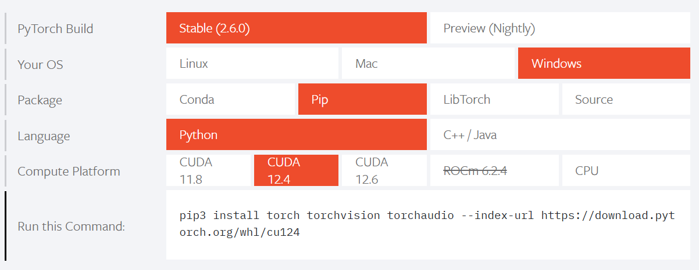
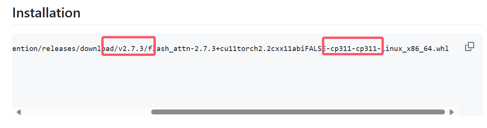

# 神经网络

## Yolo 作用

要在一张照片里找出所有的特定物体，比如所有的猫、所有的狗和所有的人。

**传统的方法可能就像这样**： 你会非常仔细地把照片分成很多很多的小块，然后一块一块地检查：“这小块像不像猫的耳朵？这小块像不像狗的鼻子？这小块像不像人的眼睛？” 你需要检查很多很多次，才能把所有的猫、狗和人都找出来，这会比较慢。

**YOLO 不会把照片切成无数小块慢慢检查，而是只看一眼整张照片，就能同时告诉你**：

- “这里有一只猫！”（并且会用一个框框把它圈起来）
- “那里有一只狗！”（也会用一个框框把它圈起来）
- “那边站着一个人！”（同样会用一个框框把他/她圈起来）


YOLO 非常适合需要快速识别物体的场景，比如自动驾驶汽车识别道路上的车辆和行人，或者监控摄像头快速发现异常情况等等。因为它“You Only Look Once”（你只看一次）就能完成任务，所以速度非常快。

我们将数据集输入交给yolo并训练出相应模型`.pt`并交给yolo去识别

## OpenVINO 作用

OpenVINO 主要用于加速在**使用**模型进行**推理和识别**，而不是模型的**训练**。 它的核心作用是在部署阶段优化模型，使其在各种英特尔硬件上运行得更快。

## Pytorch 作用
PyTorch 是一个用于构建和训练机器学习模型的库或框架。 它是你用来“做”机器学习的工具

- 面粉、糖、鸡蛋、牛奶 等各种食材（对应着机器学习中的数据、模型参数、神经网络层等）。
- 搅拌器、烤箱、模具 等工具（对应着机器学习中的各种函数、算法、优化器等）。
- 使用这些原材料和工具，按照一定的配方（你的机器学习模型代码），最终烤制出美味的蛋糕（训练好的模型）。

简单来说，PyTorch 是一个用于构建和训练机器学习模型的“厨房”和“食材库”。


## 主要流程

**假设我们现在有一个部署了yolo12 和openvino的anaconda环境A 和 部署了labelImg的环境B。那么本文的主要流程如下：**

### 一、在 Windows 平台上 (Anaconda 环境 B):
使用labelImg获取数据集

### 二、在 Windows 平台上 (Anaconda 环境 A):

- **在环境 A 下使用 PyCharm 运行 YOLOv12 将获得的数据集输入到YOLOv12中 训练并获得 .pt 文件**：这是训练模型的标准流程。


- **然后在环境 A 下运行 .pt 文件转化成 ONNX**： 这是将 PyTorch 模型转换为 OpenVINO 可识别的中间格式的常用方法。
- **再在环境 A 下将 .onnx 转化成 .xml 或者 .bin 文件**：这是使用 OpenVINO Model Optimizer 将 ONNX 模型转换为 OpenVINO IR 格式的关键步骤。


### 三、在 Ubuntu 22.04 电脑上：

- **安装 C++ 版本的 OpenVINO 和 OpenCV**：这是在 Ubuntu 上使用 OpenVINO C++ API 进行推理的必要准备。
- **使用 OpenCV 读取图片**：OpenCV 是一个常用的图像处理库，可以方便地读取图像数据。
- **使用获取的 .xml 或者 .bin 文件在 OpenVINO 上使用来进行识别**：将使用 OpenVINO Inference Engine 加载 .xml 和 .bin 文件，并将 OpenCV 读取的图像数据作为输入进行推理，从而实现物体识别。

## 部署 labelImg
- 尚待补充 TODO

## 获取数据集
- 尚待补充 TODO

## 训练模型
- 尚待补充 TODO

## 部署YOLO12
- windows + python + anaconda + pycharm + yolo12 + openvino

### 创建环境
- **第 1 步**: 使用git将yolo12项目clone后使用Pycharm打开
```
git clone https://github.com/sunsmarterjie/yolov12.git
```

- **第 2 步**: 打开requirements.txt并注释掉以下3行
```txt
# torch==2.2.2
# torchvision==0.17.2
# flash_attn-2.7.3+cu11torch2.2cxx11abiFALSE-cp311-cp311-linux_x86_64.whl
```
- **第 3 步**: 在Pycharm中打开终端并键入以下内容创建相应的conda环境
```bash
conda create -n yolo12 python=3.11
```
例如 我这里想将环境取名为yolo12
- **第 4 步**: 紧接着依次键入以下命令行激活并安装相应包
```bash
conda activate yolo12
```


### 下载 Pytorch
- **第 1 步**: 去[Pytorch官网](https://pytorch.org/)下载相应的Pytorch 并按照下图选择


复制图中的命令行将`torchaudio`删掉那么就变成了这个样子
```bash
pip3 install torch torchvision --index-url https://download.pytorch.org/whl/cu124
```
- **第 2 步**: 打开Pycharm终端键入该命令行即可。
- **第 3 步**: 如果遇到下载过慢可以中断，手动点击链接下载并使用`pip install 包本地路径`手动安装

### 下载flash-attention
- **第 1 步**: 打开[yolo12](https://github.com/sunsmarterjie/yolov12.git)的git仓库 下滑找到`Installation` 查看需要的flash-attention版本



- **第 2 步**: 使用[huggingface国内镜像站](https://hf-mirror.com/lldacing/flash-attention-windows-wheel/tree/main)下载**最接近版本**的flash-attention windows端whl包

截止2025.4.5日 本文下载的`flash_attn-2.7.4+cu124torch2.6.0cxx11abiFALSE-cp311-cp311-win_amd64.whl`

- **第 3 步**: 在Pytorch终端中键入如下指令安装flash-attention
```bash
pip install 下载的flash-attention的本地位置
```

### 安装剩余环境
- **第 1 步**: 在Pycharm的终端中依次输入如下命令行
```bash
pip install -r requirements.txt
```
```bash
pip install -e .
```

### 验证安装
- **第 1 步**: 在[yolo12](https://github.com/sunsmarterjie/yolov12.git)的git仓库下载测试模型例如**YOLO12n**


将下载好的`.pt`模型文件拷贝到项目目录下

- **第 2 步**: 在Pycharm中键入以下命令行 或者 在运行python代码
```bash
yolo predict model=yolov12n.pt source='https://ultralytics.com/images/bus.jpg'
```
```py
from ultralytics import YOLO

model = YOLO('yolov12n.pt')
model.predict('bus.jpg')
```

## 部署OpenVINO
- **第 1 步**: 在Pycharm终端键入以下命令行即可
```bash
pip install openvino-dev
```

## 转化模型格式

### 将.pt文件转化为.onnx文件
```py
from ultralytics import YOLO

model = YOLO('yolov12n.pt')
model.export(format="onnx", half=True)  # or format="onnx"
```

### 将.onnx文件转为.xml和.bin
```py
from openvino import convert_model, save_model
import os

# 指定您的 ONNX 模型路径
onnx_model_path = 'E:/project/yolov12/yolov12n.onnx'

# 指定您想要保存 OpenVINO IR 模型的输出路径（包括文件名）
output_path = 'E:/project/yolov12/openvino/yolov12n.xml'

# 如果输出目录不存在，尝试创建它
output_dir = os.path.dirname(output_path)
if not os.path.exists(output_dir):
    os.makedirs(output_dir)

try:
    # 使用 convert_model 函数进行转换
    ov_model = convert_model(onnx_model_path)

    # 保存模型
    save_model(ov_model, output_path)

    print(f"ONNX 模型已成功转换为 OpenVINO IR 格式，保存在: {output_path} 和相应的 .bin 文件")

except Exception as e:
    print(f"转换过程中发生错误：{e}")
```
## 在Ubuntu22.04中部署OpenVINO

- 第 1 步：下载 GPG-PUB-KEY-INTEL-SW-PRODUCTS.PUB。您也可以使用以下命令
```bash
wget https://apt.repos.intel.com/intel-gpg-keys/GPG-PUB-KEY-INTEL-SW-PRODUCTS.PUB
```
- 第 2 步：将此密钥添加到系统密钥环。
```bash
sudo apt-key add GPG-PUB-KEY-INTEL-SW-PRODUCTS.PUB
```
- 第 3 步：通过以下命令添加存储库。

```bash
# Ubuntu 20
echo "deb https://apt.repos.intel.com/openvino/2025 ubuntu20 main" | sudo tee /etc/apt/sources.list.d/intel-openvino-2025.list
```
```bash
# Ubuntu 22
echo "deb https://apt.repos.intel.com/openvino/2025 ubuntu22 main" | sudo tee /etc/apt/sources.list.d/intel-openvino-2025.list
```
```bash
# Ubuntu 24
echo "deb https://apt.repos.intel.com/openvino/2025 ubuntu24 main" | sudo tee /etc/apt/sources.list.d/intel-openvino-2025.list
```
- 第 4 步：使用更新命令更新软件包列表。
```bash
sudo apt update
```
- 第 5 步：验证 APT 存储库的设置是否正确。使用 apt-cache 命令查看包含所有可用 OpenVINO 程序包和组件的列表
```bash
apt-cache search openvino
```
- 第 6 步：安装 OpenVINO 运行时。
```bash
sudo apt install openvino-2025.0.0
```

## 验证测试
```bash
├── build
├── CMakeLists.txt
├── config
│   ├── bus.jpg
│   ├── yolov12n.bin
│   └── yolov12n.xml
├── include
└── src
    └── infer_image.cpp
```
```cmake
cmake_minimum_required(VERSION 3.10)
project(yolov12_inference)

find_package(OpenCV REQUIRED)
message(STATUS "Found OpenCV library: ${OpenCV_VERSION}")
find_package(OpenVINO REQUIRED)


file(GLOB_RECURSE YOLO_SOURCE_FILES
        "${CMAKE_CURRENT_SOURCE_DIR}/src/*.cpp"
        "${CMAKE_CURRENT_SOURCE_DIR}/src/*.c"
)

add_executable(${PROJECT_NAME} ${YOLO_SOURCE_FILES})


target_link_libraries(${PROJECT_NAME} PUBLIC
    ${OpenCV_LIBS}
    ${OpenVINO_LIBRARIES}
    openvino::frontend::onnx
    openvino::runtime
    openvino::frontend::tensorflow_lite
)
```
```cpp
#include <iostream>
#include <string>
#include <vector>
#include <opencv2/opencv.hpp>
#include <openvino/openvino.hpp>

int main() {
    // 指定 OpenVINO IR 模型的路径
    std::string model_path = "../config/yolov12n.xml";
    std::string weights_path = "../config/yolov12n.bin";

    // 指定要识别的图片路径
    std::string image_path = "../config/bus.jpg";

    try {
        // 1. 创建 OpenVINO Core 对象
        ov::Core core;

        // 2. 读取模型
        auto model = core.read_model(model_path, weights_path);

        // 3. 获取模型的输入端口
        auto input_port = model->inputs().front();
        ov::Shape input_shape = input_port.get_shape();

        // 4. 编译模型到设备 (这里使用 CPU，您可以根据需要更改为 "GPU")
        auto compiled_model = core.compile_model(model, "CPU");

        // 5. 创建推理请求
        auto infer_request = compiled_model.create_infer_request();

        // 6. 使用 OpenCV 读取图片
        cv::Mat image = cv::imread(image_path);
        if (image.empty()) {
            std::cerr << "Error: Could not open the image: " << image_path << std::endl;
            return 1;
        }

        // 7. 预处理图像
        cv::Mat resized_image;
        cv::resize(image, resized_image, cv::Size(input_shape[3], input_shape[2]));
        cv::Mat blob;
        cv::dnn::blobFromImage(resized_image, blob, 1.0 / 255.0, cv::Size(), cv::Scalar(), true, false);

        // 8. 设置输入数据到推理请求
        ov::Tensor input_tensor(input_port.get_element_type(), input_shape, blob.ptr());
        infer_request.set_input_tensor(input_tensor);

        // 9. 执行推理
        infer_request.infer();

        // 10. 获取输出结果
        const ov::Tensor& output_tensor = infer_request.get_output_tensor();
        const float* output_data = output_tensor.data<const float>();

        // 11. 后处理输出结果 (您需要根据您的 YOLOv12 模型实现这部分)
        std::cout << "Inference Results (first 100 elements):" << std::endl;
        size_t output_size = output_tensor.get_size();
        for (size_t i = 0; i < std::min((size_t)100, output_size); ++i) {
            std::cout << output_data[i] << " ";
        }
        std::cout << std::endl;
        if(!resized_image.empty())cv::imshow("123", resized_image);
        else std::cout<<1<<std::endl;
        cv::waitKey(0);

    } catch (const std::exception& error) {
        std::cerr << "Error occurred: " << error.what() << std::endl;
        return 1;
    }

    return 0;
}

```