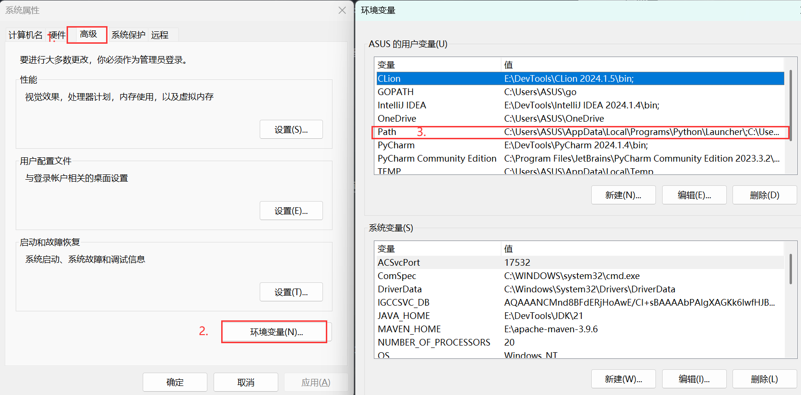
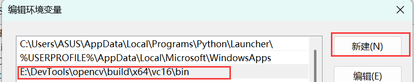
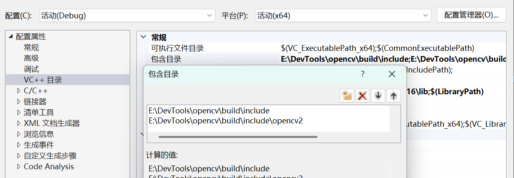
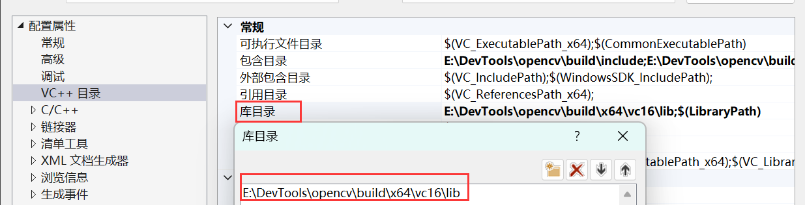
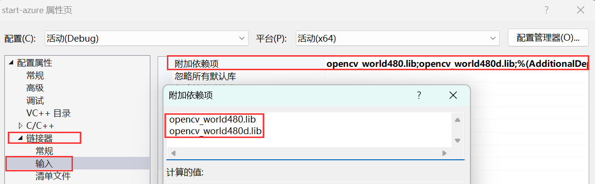

# 基础配置 - Windows


[OpenCV 官方网站](https://opencv.org/releases/) 提供的 Windows 预编译二进制包是使用 Microsoft Visual C++ (MSVC) 编译器编译的。这意味着它们与 MSVC 开发环境兼容。

如果你的开发环境是基于 GCC 编译器（例如通过 MinGW 工具链），那么你不能直接使用这些预编译的 MSVC 版本。你需要下载 OpenCV 的源代码，然后使用你的 MinGW GCC 编译器来自行编译 OpenCV，以生成兼容 GCC 的库文件。


## MVSC
请依据自身需求和习惯, 自行选择 `IDE` (例如: `CLion`、`Qt Creator`、`Visual Studio` 等) 这里选择的是 `Visual Studio`

在 [OpenCV 官方网站](https://opencv.org/releases/) 下载后解压至工作目录

**例如我的目录在E:\DevTools\opencv** **请依据自身需求和习惯选择目录!**

按下 `Win + R` 并键入 `sysdm.cpl`打开系统属性, 高级-环境变量, 双击PATH添加环境变量

 


- 点击新建并键入绝对路径 `E:\DevTools\opencv\build\x64\vc16\bin`



- 在VC++目录的包含目录添加头文件路径 `E:\DevTools\opencv\build\include`、`E:\DevTools\opencv\build\include\opencv2` 



- 在VC++目录的库目录添加链接库路径 `E:\DevTools\opencv\build\x64\vc16\lib` 



- 最后在链接器的输入的附加依赖项添加`opencv_world480d.lib`, 此文件位于`E:\DevTools\opencv\build\x64\vc16\lib`下 并且根据不同的opencv版本 名字发生变化



## MinGW

- 在工作目录下clone对应的opencv版本 例如我的在E:\opencv_mingw
```bash
git clone -b 4.9.0 https://github.com/opencv/opencv.git
git clone -b 4.9.0 https://github.com/opencv/opencv_contrib.git
```

- clone完毕后 在opencv文件夹下创建build和install目录, 并在build目录下执行指令生成对应的makefile文件

其中 `CMAKE_C_COMPILER` 和 `CMAKE_CXX_COMPILER`为 MinGW的 gcc和g++

### CMD
```bash
cmake -G "MinGW Makefiles" ^
      -D CMAKE_C_COMPILER="E:\DevTools\mingw64\bin\gcc.exe" ^
      -D CMAKE_CXX_COMPILER="E:\DevTools\mingw64\bin\g++.exe" ^
      -D CMAKE_INSTALL_PREFIX="..\install" ^
      -D CMAKE_BUILD_TYPE=Release ^
      -D INSTALL_C_EXAMPLES=ON ^
      -D INSTALL_PYTHON_EXAMPLES=ON ^
      -D OPENCV_GENERATE_PKGCONFIG=ON ^
      -D BUILD_EXAMPLES=ON ^
      -D OPENCV_EXTRA_MODULES_PATH="..\..\opencv_contrib\modules" ^
      -D BUILD_opencv_world=OFF ^
      -D BUILD_opencv_java=OFF ^
      -D BUILD_opencv_python=OFF ^
      ..
```
### PowerShell
```bash
cmake -G "MinGW Makefiles" `
      -D CMAKE_C_COMPILER="E:\DevTools\mingw64\bin\gcc.exe" `
      -D CMAKE_CXX_COMPILER="E:\DevTools\mingw64\bin\g++.exe" `
      -D CMAKE_INSTALL_PREFIX="..\install" `
      -D CMAKE_BUILD_TYPE=Release `
      -D INSTALL_C_EXAMPLES=ON `
      -D OPENCV_GENERATE_PKGCONFIG=ON `
      -D BUILD_EXAMPLES=ON `
      -D OPENCV_EXTRA_MODULES_PATH="..\..\opencv_contrib\modules" `
      -D BUILD_opencv_world=OFF `
      -D BUILD_opencv_java=OFF `
      -D BUILD_opencv_python=OFF `
      ..
```

**请不要漏了上述指令最后一行的'..' 这是用来帮助定位CmakeLists.txt位置的**
- 查看终端提示信息确认生成的makefile文件**是否为所期望**的。例如我的提示信息如下

```bash

--
-- General configuration for OpenCV 4.9.0 =====================================
--   Version control:               4.9.0
--
--   Extra modules:
--     Location (extra):            E:/DevTools/opencv/opencv_contrib/modules
--     Version control (extra):     4.9.0
--
--   Platform:
--     Timestamp:                   2025-06-22T18:23:11Z
--     Host:                        Windows 10.0.26100 AMD64
--     CMake:                       3.29.0
--     CMake generator:             MinGW Makefiles
--     CMake build tool:            E:/DevTools/CLion 2024.1.5/bin/mingw/bin/mingw32-make.exe
--     Configuration:               Release
--
--   CPU/HW features:
--     Baseline:                    SSE SSE2 SSE3
--       requested:                 SSE3
--     Dispatched code generation:  SSE4_1 SSE4_2 FP16 AVX AVX2
--       requested:                 SSE4_1 SSE4_2 AVX FP16 AVX2 AVX512_SKX
--       SSE4_1 (18 files):         + SSSE3 SSE4_1
--       SSE4_2 (2 files):          + SSSE3 SSE4_1 POPCNT SSE4_2
--       FP16 (1 files):            + SSSE3 SSE4_1 POPCNT SSE4_2 FP16 AVX
--       AVX (9 files):             + SSSE3 SSE4_1 POPCNT SSE4_2 AVX
--       AVX2 (38 files):           + SSSE3 SSE4_1 POPCNT SSE4_2 FP16 FMA3 AVX AVX2
--
--   C/C++:
--     Built as dynamic libs?:      YES
--     C++ standard:                11
--     C++ Compiler:                E:/DevTools/mingw64/bin/g++.exe  (ver 8.1.0)
--     C++ flags (Release):         -fsigned-char -W -Wall -Wreturn-type -Wnon-virtual-dtor -Waddress -Wsequence-point -Wformat -Wformat-security -Wmissing-declarations -Wundef -Winit-self -Wpointer-arith -Wshadow -Wsign-promo -Wuninitialized -Wsuggest-override -Wno-delete-non-virtual-dtor -Wno-comment -Wimplicit-fallthrough=3 -Wno-strict-overflow -fdiagnostics-show-option -Wno-long-long -fomit-frame-pointer -ffunction-sections -fdata-sections  -msse -msse2 -msse3 -fvisibility=hidden -fvisibility-inlines-hidden -O3 -DNDEBUG  -DNDEBUG
--     C++ flags (Debug):           -fsigned-char -W -Wall -Wreturn-type -Wnon-virtual-dtor -Waddress -Wsequence-point -Wformat -Wformat-security -Wmissing-declarations -Wundef -Winit-self -Wpointer-arith -Wshadow -Wsign-promo -Wuninitialized -Wsuggest-override -Wno-delete-non-virtual-dtor -Wno-comment -Wimplicit-fallthrough=3 -Wno-strict-overflow -fdiagnostics-show-option -Wno-long-long -fomit-frame-pointer -ffunction-sections -fdata-sections  -msse -msse2 -msse3 -fvisibility=hidden -fvisibility-inlines-hidden -g  -O0 -DDEBUG -D_DEBUG
--     C Compiler:                  E:/DevTools/mingw64/bin/gcc.exe
--     C flags (Release):           -fsigned-char -W -Wall -Wreturn-type -Waddress -Wsequence-point -Wformat -Wformat-security -Wmissing-declarations -Wmissing-prototypes -Wstrict-prototypes -Wundef -Winit-self -Wpointer-arith -Wshadow -Wuninitialized -Wno-comment -Wimplicit-fallthrough=3 -Wno-strict-overflow -fdiagnostics-show-option -Wno-long-long -fomit-frame-pointer -ffunction-sections -fdata-sections  -msse -msse2 -msse3 -fvisibility=hidden -O3 -DNDEBUG  -DNDEBUG
--     C flags (Debug):             -fsigned-char -W -Wall -Wreturn-type -Waddress -Wsequence-point -Wformat -Wformat-security -Wmissing-declarations -Wmissing-prototypes -Wstrict-prototypes -Wundef -Winit-self -Wpointer-arith -Wshadow -Wuninitialized -Wno-comment -Wimplicit-fallthrough=3 -Wno-strict-overflow -fdiagnostics-show-option -Wno-long-long -fomit-frame-pointer -ffunction-sections -fdata-sections  -msse -msse2 -msse3 -fvisibility=hidden -g  -O0 -DDEBUG -D_DEBUG
--     Linker flags (Release):      -Wl,--gc-sections
--     Linker flags (Debug):        -Wl,--gc-sections
--     ccache:                      NO
--     Precompiled headers:         NO
--     Extra dependencies:          pthread
--     3rdparty dependencies:
--
--   OpenCV modules:
--     To be built:                 aruco bgsegm bioinspired calib3d ccalib core datasets dnn dnn_objdetect dnn_superres dpm face features2d flann freetype fuzzy gapi hfs highgui img_hash imgcodecs imgproc intensity_transform line_descriptor mcc ml objdetect optflow phase_unwrapping photo plot python3 quality rapid reg rgbd saliency shape stereo stitching structured_light superres surface_matching text tracking ts video videoio videostab wechat_qrcode xfeatures2d ximgproc xobjdetect xphoto
--     Disabled:                    java world
--     Disabled by dependency:      -
--     Unavailable:                 alphamat cannops cudaarithm cudabgsegm cudacodec cudafeatures2d cudafilters cudaimgproc cudalegacy cudaobjdetect cudaoptflow cudastereo cudawarping cudev cvv hdf julia matlab ovis python2 sfm viz
--     Applications:                tests perf_tests examples apps
--     Documentation:               NO
--     Non-free algorithms:         NO
--
--   Windows RT support:            NO
--
--   GUI:                           WIN32UI
--     Win32 UI:                    YES
--     VTK support:                 NO
--
--   Media I/O:
--     ZLib:                        build (ver 1.3)
--     JPEG:                        build-libjpeg-turbo (ver 2.1.3-62)
--       SIMD Support Request:      YES
--       SIMD Support:              YES
--     WEBP:                        build (ver encoder: 0x020f)
--     PNG:                         build (ver 1.6.37)
--     TIFF:                        build (ver 42 - 4.2.0)
--     JPEG 2000:                   build (ver 2.5.0)
--     OpenEXR:                     build (ver 2.3.0)
--     HDR:                         YES
--     SUNRASTER:                   YES
--     PXM:                         YES
--     PFM:                         YES
--
--   Video I/O:
--     DC1394:                      NO
--     FFMPEG:                      NO
--       avcodec:                   NO
--       avformat:                  NO
--       avutil:                    NO
--       swscale:                   NO
--       avresample:                NO
--     GStreamer:                   NO
--     DirectShow:                  YES
--
--   Parallel framework:            pthreads
--
--   Trace:                         YES (built-in)
--
--   Other third-party libraries:
--     Lapack:                      NO
--     Eigen:                       NO
--     Custom HAL:                  NO
--     Protobuf:                    build (3.19.1)
--     Flatbuffers:                 builtin/3rdparty (23.5.9)
--
--   OpenCL:                        YES (NVD3D11)
--     Include path:                E:/DevTools/opencv/opencv/3rdparty/include/opencl/1.2
--     Link libraries:              Dynamic load
--
--   Python 3:
--     Interpreter:                 E:/DevTools/anaconda3/python.exe (ver 3.11.7)
--     Libraries:                   E:/DevTools/anaconda3/libs/python311.lib (ver 3.11.7)
--     numpy:                       E:/DevTools/anaconda3/Lib/site-packages/numpy/core/include (ver 1.26.4)
--     install path:                E:/DevTools/anaconda3/Lib/site-packages/cv2/python-3.11
--
--   Python (for build):            E:/DevTools/anaconda3/python.exe
--
--   Java:
--     ant:                         NO
--     Java:                        YES (ver 21.0.4)
--     JNI:                         E:/DevTools/JDK/21/include E:/DevTools/JDK/21/include/win32 E:/DevTools/JDK/21/include
--     Java wrappers:               NO
--     Java tests:                  NO
--
--   Install to:                    E:/DevTools/opencv/opencv/install
-- -----------------------------------------------------------------
--
-- Configuring done (590.8s)
-- Generating done (7.3s)
-- Build files have been written to: E:/DevTools/opencv/opencv/build
(base) PS E:\DevTools\opencv\opencv\build>

```