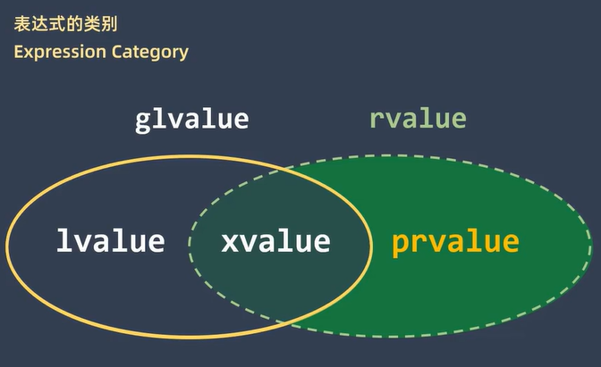

# 引用
## 引用 

通过指针，我们可以灵活地访问和修改内存中的数据

**但这也带来了严重的副作用，比如指针加加减减就可以访问相邻的内存单元**。

这会导致访问了未分配的内存、越界访问了数组、或者操作了不该操作的内存区域，就可能导致程序崩溃、数据损坏，甚至安全漏洞。

所以引用被发明了，引用就是作用阉割的指针（可以视为 `类型* const` ，所以引用必须上来就赋初值，不能设置为空），编译器不将其视作对象，操作引用相当于操作引用指向的对象。**也就从根本是杜绝了引用篡改内存的能力。**

**新手如果不懂内存，就直接将引用视为指向对象的别名就可以了。**


从底层的实现角度来看，引用在很多情况下可以被视为一个 `类型* const` 的指针，**这意味着**：

- 引用在声明时必须立即初始化，它必须指向一个已经存在的对象。这就像一个常量指针，一旦指向某个地址就不能再改变。

- 引用一旦被初始化，就不能再指向另一个对象。 这与指针不同，指针可以随时指向不同的内存地址。

- 引用不能为空（不能被设置为 nullptr）。 由于引用必须在声明时初始化，因此它总是指向一个有效的内存区域。

由于引用的这些特性，编译器不会将其视作一个独立的对象来分配内存（在大多数情况下）。

操作引用实际上相当于直接操作引用所指向的原始对象。

这就从根本上降低了通过引用意外或恶意地篡改内存的能力。

虽然在底层可能仍然涉及到地址操作，但这些操作被编译器更好地控制和约束，从而提高了代码的安全性。

**要真正理解指针，引用是需要学习c语言对应汇编的，只要懂了汇编，一目了然。不懂汇编就只能这样理解了。**

在计算机操作系统中，内存是按字节 (Byte) 进行存储和寻址的。

无论是使用指针还是引用，都不要尝试解引用（访问）未初始化的指针，因为这会导致未定义的行为，可能会引发程序崩溃或其他不可预测的问题。

虽然引用在声明时必须初始化，但在使用指针时，务必确保指针指向有效的内存地址。


## 左值
在`C++11`之前大致可以分为左值和右值

拥有地址属性的对象就叫左值，左值来源于c语言的说法，能放在 `=` 左面的就是左值，注意，左值也可以放在 `=` 右面。


可以判断左值的方法: 能够获得这个表达式的引用或者取地址就是左值

## 右值
C++任何一个对象要么是左值，要么是右值。或者说无法操作地址的对象就叫做右值。

判断是否为右值，就看是不是左值，有没有地址属性，不是左值，就是右值。

比如临时对象，就都是右值，临时对象的地址属性无法使用。
```cpp
int main() {
    int i = 10;
    int i2 = i + 1;
    //(i + 1) = 200;  (i + 1)就是一个临时对象
}
```
注意：左值也可以放在 `=` 右面，但右值绝对不可以放在等号左面
```cpp
int main() {
    int i = 200;
    ++i = 200; //先++ 然后返回i的对象
    //i++ = 200; // wrong 
}
```

## 表达式分类
在`C++11`之后变化就比较大, 大致是这个样子。


`glvalue`泛左值和`prvalue(pure-r-value)`纯右值。而泛左值又被分为`l-value`左值和`x-value`。`x-value`和`prvalue`共同组成`rvalue`

`x-value`英文全称是`eXpiring value`, 也就是即将消亡的值


## 普通左值引用
就是一个对象的别名，只能绑定左值，无法绑定常量对象。
```cpp
int main() {
    // const int i = 100;
    // int& refI = i;
    // refI = 200;
    // 如果使用了引用 const则形同虚设 所以不允许这么写
    int i = 100;
    //引用相当于别名
    int& refI = i;
}
```
## const左值引用
可以对常量起别名，可以绑定左值和右值。
```cpp
int main() {
    const int i = 100;
    const int& refI1 = i;
    const int& refI2 = 200;
}
```
## 右值引用 (*)
只能绑定右值的引用。
```cpp
int main() {
    int i = 100;
    int&& rightRefI1 = i++;
    int&& rightRefI2 = (i + 1);
    //int&& rightRefI3 = i;
}
```
有了右值引用, 我们就可以在函数调用时, 将左值参数和右值参数分开来。
```cpp
void func(int& a) {
    std::cout<<"调用左值引用重载函数"<<std::endl;
}

void func(int&& a) {
    std::cout<<"调用右值引用重载函数"<<std::endl;
}

int a = 5;
func(a);//a是个左值 左值引用
func(5);//5是一个字面值 是一个右值 右值引用
```


## 移动语义
通过重载函数能够区分出左值引用和右值引用, 接下来就可以实现移动语义了。

以下这段代码其实是有问题的
```cpp
class CharBuffer {
public:
    CharBuffer(unsigned int nSize):
        m_buff(new char[nSize]),
        m_size(nSize) {
        std::cout<<"普通构造函数"<<std::endl;
    }
    ~CharBuffer() {
        delete[] m_buff;
        std::cout<<"析构函数"<<std::endl;
    }
private:
    char* m_buff;
    unsigned int m_size;
}

int main() {
    CharBuffer buf1(100);
    // CharBuffer buf2(buf1); // wrong!
}
```
buff1使用了普通的构造函数, 而buff2则是使用了拷贝构造函数, 将buff1复制了过来

由于我们没有定义拷贝构造函数,所以编译器会为我们自动生成一个
```cpp
CharBuffer(const CharBuffer& other):
    m_buff(other.m_size),
    m_size(other.m_buff) {
}
```
这样两个对象中的`m_buff`, 指向的是同一块内存区域, 显然这不是我们所要的。

这还会导致`buff1`和`buff2`对象, 在调用析构函数时, 对`m_buff`指向的同一块内存释放两次。

**因此我们需要定义自己的拷贝构造函数**
```cpp
CharBuffer(const CharBuffer& other):
    m_buff(other.m_size),
    m_buff(new char[nSize]) {
    memcpy(m_buff, other.m_buff, m_size);
    std::cout<<"拷贝构造函数"<<std::endl;
}

//拷贝赋值运算符重载函数
CharBuffer& operator=(const CharBuffer& other) {
    if(this == &other) return *this;

    m_size = other.m_size;
    
    delte[] m_buff;
    m_buff = new char[m_size];
    memcpy(m_buff, other.m_buff, m_size);

    std::cout<<"拷贝赋值运算符"<<std::endl;
    return *this;
}
```
与拷贝方式相比, 移动构造函数少了内存的分配和内存数据的复制。

不过他修改了被移动的对象, 被移动对象基本上是被掏空了。
```cpp
CharBuffer(CharBuffer&& other):
    m_buff(other.m_size),
    m_buff(other.m_buff) {
    other.m_buff = nullptr;
    other.m_size = 0;

    std::cout<<"移动构造函数"<<std::endl;
}

CharBuffer& operator=(CharBuffer&& other) {
    if(this == &other) return *this;

    delte[] m_buff;

    m_size = other.m_size;
    m_buff = other.m_buff;

    other.m_size = 0;
    other.m_buff = nullptr;

    std::cout<<"移动赋值运算符"<<std::endl;
    return *this;
}
```
## 拷贝省略

以下代码应该是先调用普通的构造函数, 创建这个匿名对象
再用这个对象作为右值参数, 调用移动构造函数创建对象buffer
```cpp
CharBuffer buff{CharBuffer(100)};
```
然而实际是只调用了一次普通构造函数, 并没有调用移动构造函数。

这是因为有一个拷贝省略`Copy Elision`的技术对这样的语句进行了优化。

编译器在一些条件下会省略临时对象的创建, 直接在目标的存储位置构造该对象。

就省略了临时对象的创建, 到目标对象的复制或移动临时对象的销毁等这些不必要的开销


在`C++11`中, 可以通过编译器的参数来关闭这个优化。`C++17`, 不再是优化选项, 而是`C++`语言的规范。
## 返回值优化
以下这个例子临时对象的创建也会被省略, 这叫做返回值优化`Return Value Optimization(RVO)`

在`C++11`中, 可以通过编译器的参数来关闭这个优化。`C++17`, 不再是优化选项, 而是`C++`语言的规范。
```cpp
CharBuffer generate(int n) {
    return CharBuffer(n);
}

int main() {
    CharBuffer buff = generate(100);
}
```

## move函数 (*)
右值看重对象的值而不考虑地址，move函数可以对一个左值使用，使操作系统不再在意其地址属性，将其完全视作一个右值。
```cpp
int main() {
    int i = 10;
    //i仍然是左值 可以赋值 但不要这样做 
    int&& rightRefI = std::move(i); 
}
```
**move函数让操作的对象失去了地址属性，所以有义务保证以后不再使用该变量的地址属性**

**简单来说就是不再使用该变量，因为左值对象的地址是其使用时无法绕过的属性。**

```cpp
CharBuffer buff1(100); //普通构造
CharBuffer buff2 = buff1; // buff1左值 拷贝构造
CharBuffer buff3 = std::move(buff1); //std::move(buff1)右值 移动构造
//CharBuffer buff3 = static_cast<CharBuffer&&>(buff1); //与std::move(buff1)完全等价
```
我们来看一下GCC中move函数的源码, 虽然这个函数只有一行, 就是将传入的参数转换成右值引用并返回。

虽然函数的名字叫move, 但实际上它并没有移动什么, 只是做了一个静态转换而已。
```cpp
template<typename _Tp>
constexpr typename std::remove_reference<_Tp>::type&&
move(_Tp&& __t) noexcept {
    return static_cast<typename std::remove_reference<_Tp>::type&&>(__t);
}
```

**并不是所有的类都需要实现移动语义, 或者说大部分情况下都不需要**

例如如果一个类的成员都是基本类型, 那么移动构造和拷贝构造, 在代码上没有什么区别
```cpp
class MyClass {
public:
    MyClass(int a, int b): m_a(a),m_b(b) {}

    MyClass(const MyClass& other) : 
        m_a(other.m_a),
        m_b(other.m_b) {
        
        std::cout<< "Copy Constructor Called"<<std::endl;
    }
private:
    int m_a;
    int m_b;
};

int main() {
    MyClass a(1,2);
    MyClass b(std::move(a)); // Copy Constructor Called
}
```
前面例子中的`CharBuffer`类, 由于拷贝构造涉及到深拷贝, 需要复制较多的数据, 而移动构造可以减少一些工作


值得注意的是 `unique_ptr` 对所管理对象具有唯一的控制权, 当需要将所有权转移到另外一个 `unique_ptr`对象时就要用移动语义。

## 临时对象
**右值都是不体现地址的对象。那么，还有什么能比临时对象更加没有地址属性呢？右值引用主要负责处理的就是临时对象。**
程序执行时生成的中间对象就是临时对象，注意，所有的临时对象都是右值对象，因为临时对象产生后很快就可能被销毁，使用的是它的值属性。

```cpp
int getI() { return 10; }

int main() {
    int i = 10;
    int&& refI = getI(); // getI()返回的值就是临时对象
}
```
再看这个例子, 这次用到移动赋值运算符。

使用移动赋值运算符, 将buff1内部的资源转移给了buff2。离开了这个大括号后, buff1离开作用域被销毁。


但在大括号外的对象buff2仍然保有了buff1原有的资源。对象buff2在buff1即将消亡前, 将buff1所拥有的资源转移到了自己这里。


这就引出了另外一个值的类型`x-value`也就是即将消亡的值
```cpp
int main() {
    CharBuffer buff2(10);

    {
        CharBuffer buff1(100);
        buff2 = std::move(buff1); 
    }
    //..
}
```

## 完美转发
完美转发是什么呢？说到底，它描述的其实就是一个参数传递的过程，能够将一个传递到一个函数的参数，再通过该函数原封不动的传递给另一个函数（这里的原封不动不单是指参数的值，更包括参数的类型，参数的限定符）


```cpp
void f(const std::string& s) {
    std::cout<<"左值: "<<s<<std::endl;
}
void f(std::string&& s) {
    std::cout<<"右值: "<<s<<std::endl;
}

void g(const std::string& s) {
    f(s);
}
void g(std::string&& s) {
    f(s);
}

int main() {
    g(std::string("hello1")); //期望是右值 但实际左值
    std::string str("hello2"); //期望是左值 实际也是左值
    g(str);
}
```
其实这也很好理解, 对于函数g的参数s不管实参的类型是什么

在函数体内, 这个参数是一个具有名称的局部变量, 可以获得它的地址, 所以是个左值

因此在函数g的两个重载版本中, 调用函数f时, 都会调用参数为左值引用的那个版本

**为了能够调用与参数原有类型对应的左值和右值引用的重载函数, 就需要完美转发**

C++提供了forward模板来解决完美转发的问题，forward模板可以使参数推断出它原来的类型，实现了完美转发。

```cpp
void f(const std::string& s) {
    std::cout<<"左值: "<<s<<std::endl;
}
void f(std::string&& s) {
    std::cout<<"右值: "<<s<<std::endl;
}

//万能引用
template<class T>
void g(T&& v) {
    f(std::forward<T>(v));
}

int main() {
    g(std::string("hello1")); //期望是右值 实际也是右值
    std::string str("hello2"); //期望是左值 实际也是左值
    g(str);
}
```


**完美转发就是一个专门配合万能引用的知识点，专门用来在使用万能引用的地方原封不动的传递参数。其实记住它是和万能引用配合使用的就掌握的差不多了，**


## 万能引用
C++11还带来了万能引用(转发引用)，也就是既能当做左值，又能当做右值的引用。

万能引用是既可以被编译期处理为左值引用，又可以被编译期处理为右值引用。

就是当参数为左值时。T&&为左值。当参数为右值时，T&& 为右值。

**不是既是左值引用又是右值引用，不违背C++一个引用不是左值引用，就是右值引用的基本说法**

**万能引用会在编译期被当做左值引用或右值引用处理。**

### 模板型
```cpp
#include <iostream>
#include <boost/type_index.hpp>

using boost::typeindex::type_id_with_cvr;
//这个T&& 就是万能引用类型。
//注意：只有T&& 是万能引用类型
template<typename T>
void test(T&& elem) {
    std::cout << "elem type is : " << type_id_with_cvr<decltype(elem)>().pretty_name() << std::endl;
    std::cout << "T type is : " << type_id_with_cvr<T>().pretty_name() << std::endl;
}

int main() {
    int i = 10;
    test(i);
    test(10);
    test(std::move(i));
}
```
```cpp
template<typename T>
class MyVector	{
public:
    template<typename T2>
    void push_back(T2&& elem) {
      //此时T2&& 的类型完全独立于MyVector类了
      //每调用一次push_back函数，都要推断T2的类型。
    }
};
```
以下的写法均不是万能引用
```cpp
const T&& parm;       //这就是普通的右值引用。
std::vector<T>&& parm;    //这也是右值引用。
```
```cpp
template<typename T>
class MyVector{
public:
    void push_back(T&& elem) {
        //此时T&& 不是万能引用，因为T影响的是MyVector的类型。
    }
};
```


### auto型
```cpp
#include <iostream>
#include <vector>
#include <boost/type_index.hpp>

using boost::typeindex::type_id_with_cvr;

int main() {
    int i = 10;
    auto&& elem = i;
    //auto&& elem = std::move(i);
    std::cout << type_id_with_cvr<decltype(elem)>().pretty_name() << std::endl;
}
```
```cpp
auto&& //就是万能引用。
const auto&& var //右值引用
```
```cpp
int main() {
    //rrefI的类型是右值引用 但他本身是一个左值
    int&& rrefI = 10;
}
```

## 引用折叠
以下是标准库中`std::forward()`的源码, 他有2个重载版本, 一个为左值引用, 一个为右值引用
```cpp
template<typename T>
T&& forward(typename std::remove_reference<T>::type& t) noexcept {
    return static_cast<T&&>(t);
}

template<typename T>
T&& forward(typename std::remove_reference<T>::type&& t) noexcept {
    return static_cast<T&&>(t);
}
```
从代码上看 `std::forward()` 只是做了个静态类型转换, 将传入的值**转换成**模板参数类型T的**右值引用形式**


这只是个形式上的右值引用, 实际上由于一个叫做**引用折叠**的规则, 实际的转换类型既可以是右值引用, 也可以是左值引用


**接下来我们再看看函数模板的类型参数推导规则**

函数模板的类型参数, 在实例化时会**根据传入的实参的类型**被推导成相应的类型


以函数模板g为例, 它在实例化时, 模板参数T的类型取决于传入的实参是左值还是右值
```cpp
//万能引用
template<class T>
void g(T&& v) {
    f(std::forward<T>(v));
}
```

如果是右值, 那么就被推到为实参的非引用类型
```cpp
g(std::string("Hello")); // 实参是string匿名对象, 是个右值, T就被推导为string

void g<std::string>(std::string&& v) {
    f(std::forward<std::string>(v));
}
```

如果是左值, 那么T就被推导为实参类型的引用。
```cpp
std::string str("Hello");
g(str);

void g<std::string&>(std::string& && v) {
    f(std::forward<std::string&>(v));
}
```
但这里出现了一个问题 就是出现了 **引用的引用**(`& &&`)

在`C++`语法上, 类型的引用的引用是不允许的, 因此需要引用折叠规则


就是除了**右值引用的右值引用**(`&& &&`)会被折叠成**右值引用**(`&&`)之外, 其他的引用组合中只要有**左值引用**(`&`), 那么就折叠为**左值引用**(`&`)


引用折叠其实概念很简单,一个引用不是左值引用就是右值引用，当一个万能引用被认为左值引用时，类型应该是T& &&，此时类型就会折叠为T&。

简单来说，就是引用符号太多了，折叠为`&`或`&&`
