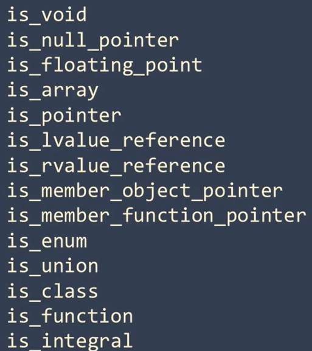

# 类型特征


`<type_traits>` 提供了一系列的类模板和少量函数, 可以用于编译时的类型分析和转换


通过这些模板, 可以确保模板类型的安全和正确使用, 以及实现条件编译。

## 使用示例
虽然`<type_traits>`里定义了非常多的模板, 不过使用方法基本都是相同的

```cpp
template <class T>
void testIntegral(T a) {
    if (std::is_intefral<T>::value) {
        std::cout << std::boolalpha << a << " is an integral type" << std::endl;
    }else {
        std::cout << a << " is NOT a integral type" << std::endl;
    }
}
```



## 实现原理
我们自己定义一个类似标准库中的类模板`my_is_integral`
```cpp
template<typename T>
struct my_is_integral {
    static const bool value{false};
};


std::cout<< my_is_integral<int>::value << std::endl;
std::cout<< my_is_integral<float>::value << std::endl;
```

不过目前在这两个类型的模板实例中, 静态成员value都是false


我们需要让模板参数为int时, 它的value值为true, 因此我们在定义一个类型参数为int的模板特化版本
```cpp
template<>
struct my_is_integral<int> {
    static const bool value{true};
};


std::cout<< my_is_integral<int>::value << std::endl;
std::cout<< my_is_integral<float>::value << std::endl;
```
像`bool`, `char`, `long`, `long long`, 包括有符号的和无符号的, 也都是整数类型。

因此也要给这些类型定义特化版本, 这里没什么捷径, 就是穷举了所有的符合条件的类型。
```cpp
template<typename T>
struct my_is_integral: std::false_type();

template<>
struct my_is_integral<int>: std::true_type();

template<>
struct my_is_integral<bool>: std::true_type();

template<>
struct my_is_integral<char>: std::true_type();

template<>
struct my_is_integral<long>: std::true_type();

template<>
struct my_is_integral<long long>: std::true_type();
```


可以给`my_is_integral`定义一个快捷方式
```cpp
template<typename T>
constexpr bool my_is_integral_v{my_is_integral<T>::value};

std::cout << my_is_integral_v<long> << std::endl;
```

## 模板元编程
不过这个代码还存在一些问题, 我们这个自定义的`my_is_integral` 对于有`const`或者`volatile`修饰符的整数类型, 仍然不能够得到正确结果

所以需要使用另外一种`Type Traits`类。`remove::cv` 可以将类型前面的`const`和`volatile`修饰符除去
```cpp
template<typename T>
struct my_is_integral_helper: std::false_type{};

template<>
struct my_is_integral_helper<int>: std::true_type();


template<typename T>
struct my_is_integral: public my_is_integral_helper<typename std::remove_cv<T>::type{

};

template<typename T>
constexpr bool my_is_integral_v{my_is_integral<T>::value};

std::cout << my_is_integral_v<const int> << std::endl; // true
```


以上的实现方式属于模板的元编程模式, `C++`的模板元编程模式, 简单的说就是通过编译时进行推导和求值, 从而改变或生成运行时的代码


不是所有的`<type_traits>`功能, 都可以通过元编程方式实现, 有一些则需要通过编译器的内建功能辅助完成

例如`std::is_abstract`用于判断一个类型是否是抽象类, 它就需要编译器提供内建的功能来实现

由于`<type_traits>`都是与类型打交道的, 所以大多在函数模板中使用


## 条件编译
使用`<type_traits>`结合`if constexpr(常量表达式)`还可以实现条件编译
```cpp
//这个程序编译时会报错 提示没有length这个成员函数
class IMeasurable {
public:
  virtual double length() = 0;
};

class Complex: public IMesurable {
public:
    Complex(double r, double i) : imaginary(i),real(r) {};
    double length() override {
        return std::sqrt(imaginary * imaginary + real * real);
    }
private:
    double imaginary = 0;
    double real = 0;
};


template<typename T>
double length(T& t) {
    if(std::is_arithmetic_v<T>) {
        if(t < 0) return -t;
        return t;
    }
    //这个分支是永远不会执行的 但是编译器仍然会编译这段代码
    else if(std::is_base_of_v<IMesurable,T>) return t.length();

    return 0;
}


int main() {
    double l = -114.514;
    std::cout << length(l) << std::endl;
}
```

这个问题可以通过`if constexpr()`来解决
```cpp
template<typename T>
double length(T& t) {
    if(std::is_arithmetic_v<T>) {
        if(t < 0) return -t;
        return t;
    } else if constexpr (std::is_base_of_v<IMesurable,T>) {
        return t.length();
    }

    return 0;
}
```

`if constexpr()`是从`C++17`开始引入的, 它被称作编译时的条件语句, 他在编译时对条件表达式进行判断

只有当表达式条件为真时, 这个分支的代码才会被编译,如果不为真, 那么这段代码就会被舍弃
而我们使用的`<type_traits>`中的模板变量都是常量

```cpp
double l = 11.4514;
std::cout << length(l) << std::endl;

Complex v = {1.14, 5.14};
std::cout << length(v) << std::endl;
```
实例化后就相当于这2段代码
```cpp
template<>
double length<double>(double& t) {
    if(t < 0) return -t;
    return t;
}

template<>
double length<Complex>(Complex& t) {
    return t.length();
}
```
如果没有`if constexpr()`, 实现上述代码的功能, 就要针对各种类型编写模板的特化版本

## static_assert
可以使用`static_assert`在编译阶段判断条件是否为真, 如果不为真, 则会停止编译, 报出静态断言错误
```cpp
template<typename T>
double length(T& t) {
    static_assert(std::is_arithmetic_v<T> || std::is_base_of_v<IMesurable,T>, "Error: Used a type that does not support calculating length")
    if(std::is_arithmetic_v<T>) {
        if(t < 0) return -t;
        return t;
    } else if constexpr (std::is_base_of_v<IMesurable,T>) {
        return t.length();
    }

    return 0;
}
```


