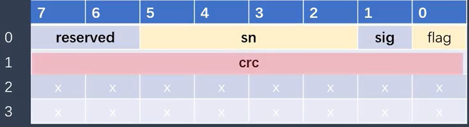
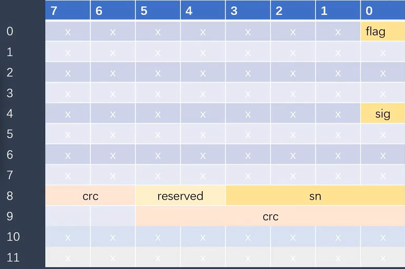
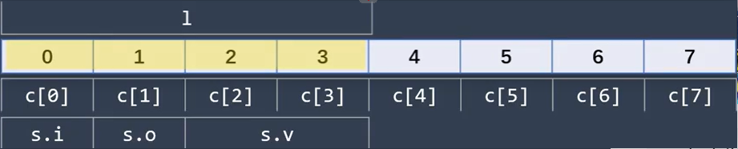
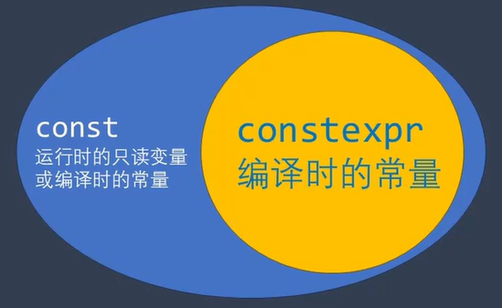

# 结构、联合、枚举、类
## 面向过程和面向对象

面试的时候经常会听到一个问题, 谈一下对面向对象和面向过程的理解。

**面向对象和面向过程是一个相对的概念。**

**面向对象是按照人类的思维来编码的一种方式**, C++就完全支持**面向对象**功能, 可以按照人类的思维来处理问题。
举个例子, 要把大象装冰箱, 按照人类的思路自然是分三步, 打开冰箱, 将大象装进去, 关上冰箱。
要实现这三步, 我们就要首先有人, 冰箱这两个对象。人有给冰箱发指令的能力, 冰箱有能够接受指令并打开或关闭门的能力。

**面向过程是按照计算机的工作逻辑来编码的方式**
最典型的面向过程的语言就是c语言了, c语言直接对应汇编, 汇编又对应电路。C语言最大的特点就是 结构体当中不允许有方法。一个结构体对象是要声明在栈或堆中, 而方法是要声明在代码区当中的。这2个根本都不是一个东西,怎么能夹杂在一起呢? 这是单纯从汇编角度讲 确实无法实现


从纯粹的汇编角度来看，C 语言的结构体是数据的集合，它们在内存中占据一块连续的空间（栈或堆），而方法是指令的集合，存储在代码段中。这两者在本质上是不同的，C 语言的设计哲学也倾向于将数据和操作数据的方法分离。

**那么为什么 C++ 中的 struct 可以包含方法呢？**

这主要是**因为 C++ 是一种支持面向对象编程 (Object-Oriented Programming, OOP) 的语言**，而 C 是一种面向过程的语言。

在 OOP 的概念中，**对象**是将数据（属性）和操作这些数据的方法捆绑在一起的实体。C++ 的 struct 和 class 都是实现这种对象概念的机制。

从汇编的角度来看，C++ 中 struct 内部定义的方法仍然存储在代码段中，这与 C 语言中的方法并没有本质的区别。**关键的区别在于 C++ 如何将方法与特定的结构体对象关联起来。**

C++ 通过引入一个**隐式的指针** `this` 来实现这一点。当您在一个结构体对象上调用一个方法时，编译器会在底层将该对象的内存地址作为第一个参数传递给这个方法。这个 `this` 指针指向当前调用该方法的对象。这样，方法内部就可以通过 `this` 指针来访问该对象的成员变量。

**用一个简单的例子来说明：**

```cpp
struct Rectangle {
    int width;
    int height;

    int area() {
        return width * height; // 实际上是 this->width * this->height
    }
};

int main() {
    Rectangle rect1 = {5, 10};
    int area1 = rect1.area(); // 这里，rect1 的地址会被隐式地传递给 area() 方法

    Rectangle rect2 = {3, 7};
    int area2 = rect2.area(); // 这里，rect2 的地址会被隐式地传递给 area() 方法
}
```
在汇编层面，`Rectangle` 结构体仍然只是一块内存区域，用于存储 `width` 和 `height`。而 `area()` 方法是一个独立的指令序列。当调用 `rect1.area()` 时，`area()` 方法会接收到 `rect1` 的内存地址，从而能够访问 `rect1` 的 `width` 和 `height` 成员。同样地，当调用 `rect2.area()` 时，`area()` 方法会接收到 `rect2` 的内存地址。

**所以，从汇编角度来看，C++ 并没有真正把方法`放进`结构体中。而是通过隐式的 this 指针机制，使得结构体的方法能够操作特定结构体对象的数据。** 这是一种语法糖，使得代码更符合面向对象的思想，将数据和行为逻辑紧密地联系在一起。

**总结一下：**
- C 语言是面向过程的，强调数据和操作数据的方法是分离的。
- C++ 是面向对象的，它允许将数据（成员变量）和操作这些数据的方法捆绑在一起，形成对象。
- C++ 中 `struct` 内部的方法在汇编层面仍然是独立的，但它们通过隐式的 `this` 指针与特定的结构体对象关联起来，从而实现了面向对象编程中方法操作对象数据的概念。


## 结构体

```c
struct Student {
    char name[100];
    char id[10];
    short gender;
    time_t birthdar;
};
```
**在C语言中, 使用结构的方式是**
```c
struct Student student = {"tom", "001", 0, 1};
```
**而在cpp中, 可以像使用基本类型那样直接定义结构对象。** 
```cpp
Student student1{"tom", "001", 0, 1};
// 或者像这样 用一个空的大括号来初始化结构变量
Student student2= {};

```
**可以直接在定义结构的时候 在后面直接定义变量**
```cpp
struct Student {
    char name[100];
    char id[10];
    short gender;
    time_t birthdar;
}student1;
```
```cpp
struct Student {
    char name[100];
    char id[10];
    short gender;
    time_t birthdar;
}student1 = {"tom", "001", 0, 1};
```

**在c语言中 还经常用typedef来给结构定义一个别名**
```c
typedef struct _Student {
    char name[100];
    char id[10];
    short gender;
    time_t birthdar;
}Student;
```
这样就可以像cpp一样定义结构变量了


**以下三种调用的效果是一致的**
```cpp
Student student1{"tom", "001", 0, 1};
std::cout<<student1.name<<std::endl;

Student* pStudent = new Student("Bob", "002", 0, 1);
std::cout<<pStudent->name<<std::endl;

std::cout<<(*pStudent).gender;
```
值得注意的是 成员运算符的优先级要高于间接引用运算发


**在以下例子中是纯C语言的结构。**
结构里的成员都是基本类型的变量。或者基本类型的数组 或者是嵌套的这种结构
```cpp
struct Date {
    unsigned short year, month, day;
};

struct Student {
    char name[100];
    char id[10];
    short gender;
    Date birthdar;
};
```
这种结构的好处就是可以作为二进制存储，读取，或者通过网络发送, 接收


在这个例子中 可以将结构变量直接作为一个字符缓存传递欸fwrite函数写入一个二进制文件中。然后可以通过fread函数讲数据直接读取到结构体中, 实现内存数据与二进制文件之间的存取。
```c
int test_w(const char* fname) {
    Student student{"tom", "001", {2001,2,3}, 1};
    FILE* f = fopen(fname, "wb");
    fwrite(&student, sizeof(student), sizeof(char), f);
    fclost(f);
    return 0;
}

int test_r(const char* fname) {
    Student student = {};
    FILE* f = fopen(fname, "rb");
    fread(&student, sizeof(student), sizeof(char), f);
    fclost(f);
    std::cout<<student.name<<std::endl;
    return 0;
}
```
但如果结构中包含了非基本类型变量,例如将name改成string类对象。再直接将这个结构作为缓存传递给fwrite函数写入二进制文件, 则无法通过fread恢复。

这种情况下就要自己实现一些转换的功能, 这种转换通常叫序列化,Serialize


**可以将一个字节或者整型按照比特位分成几部分**
这种定义方法经常在面向底层的驱动程序以及通讯程序中使用

```c
struct Header {
    unsigned int flag:1;
    unsigned int sig:1;
    unsigned int sn:4;
    unsigned int reserved:2;
    unsigned int crc:8;
};
```
每个成员后面的冒号表示占用了几个比特位。 例如flag表示一个比特位。flag,sig,sn,reserved,crc它们的类型都是unsigned int,并且是连续的,因此它们在内存中都在同一个整型值中



```c
struct Header {
    unsigned int flag:1;
    bool sig:1;
    unsigned int sn:4;
    unsigned int reserved:2;
    unsigned int crc:8;
};
```
它们在内存当中的位置则是这样的。这不是我们想要的结果


所以常见的是按照整型或者字符型的大小对其的方式来定义这种比特位的结构


**在c语言中可以这么做 但cpp不允许这么做**
```c
struct rect{double x;double y}
int rect;
```
就计算机而言 声明A是声明B的简化
```c
// 声明A
struct book library;
```
```c
// 声明B
struct book {
    char title[N]
    char author[N]
    float value
}library;
```


以下是结构体的一些应用场景
```c
struct funds {
    char bank[N];
    double bankfund;
    double savefunds;
}

//传递结构的指针
double sum(const struct funds * money) {
    return (money->bankfound + money->savefunds);
}

//传递结构
double sun(struct funds moolah) {
  //因为传递的是副本不改变moolah 无需const
}
//将结构作为返回值
struct namct getinfo() {
}
```
```c
double sum(const struct funds money[]) {}

int main() {
    //james代表数组首元素的地址
    //james == &james[0]
    struct funds james[N] = {
      //省略
    }
    sum(james);
}
```
```c
struct book {"123",1.1,1.1};//字面量
struct {"!23",1.1};//匿名
```
## 联合
union联合同种类数据类型只能有一个成员 可以使同一个存储空间有多种不同的类型

联合在内存中所占的大小是由这些成员类型中**最大的一种大小**决定的
在这个例子中, 成员类型中最大的是数组c是8个字节
```cpp
union MyUnionType {
    unsigned long l;
    unsigned char c[8]
    struct {
        unsigned char i;
        unsigned char o;
        unsigned short v;
    }s;
};
```



## 枚举
```cpp
enum ColorType{
    Red, // 0
    Blue, // 1
    Yellow, // 2
    Green // 3
};
```
```cpp
enum AnimalType{
    Bird = 1,
    Horse = 3,
    Dog, //上一项的值 + 1 = 4
    Cat = 6
};
```
如果2个枚举类型中的元素名称是相同的, 则会引起冲突, 在cpp中引入了有类的作用域的枚举, 也就是在enum关键字后面再加个关键字class
```cpp
enum class ColorType {
    Red,
    Blue,
    Yellow,
    Green
};
```


## 类
从计算机的角度讲, 计算机只能定义一个叫做人和冰箱的结构体。人有手这个部位, 冰箱有门这个部位。然后从天而降一个方法, 是这个方法让手打开了冰箱, 又是另一个方法让大象进去, 再是另一个方法让冰箱门关上。

从开发者的角度讲, 面向对象显然更利于程序设计。用面色过程的开发方式, 程序一旦大了, 各种从天而降的方法会非常繁琐, 一些用纯c写的大型程序, 实际上也是模拟了面向对象的方式。

那么, 如何用面向过程的c语言模拟出面向对象的能力呢? 类就诞生了, 在类中可以定义专属于类的方法, 让类有了自己的动作。回到那个例子, 人的类有了让冰箱开门的能力, 冰箱有了让人打开的能力, 不再需要天降神秘力量了。

**总结:到现在, 大家应该可以理解类的重要性了吧, 这是面向对象的基石, 也可以说是所有现代程序的基石。**

#### 构造方法:
类再怎么吹, 它也是通过面向过程的机器实现的, 类相当于定义了一个新类型, 该类型生成在堆或栈上的对象时内存排布和c语言相同。但是c++规定, C++有在类对象创建时就在对应内存将数据初始化的能力, 这就是构造方法。

C没有初始化的话 栈内存原先有什么数据 i和i2就是什么数据
没人会知道出现什么样的bug
```c
struct CTest{
    int i;
    int i2;
}
int main() {
    CTest test;
    std::cout << test.i << std::endl;
}
```

构造方法有以下类型。
1. 普通构造方法:写法代码演示
2. 复制构造方法:用另一个对象来初始化对象对应的内存, 代码演示
3. 移动构造方法:也是用另一个对象来初始化对象, 具体内容会在Part3第13节详细讲解。
4. 默认构造方法:当类没有任何构造方法时, 编译期会为该类生成一个默认的的构造方法, 在最普通的类中, 默认构造方法什么都没做, 对象对应的内存没有被初始化。
```cpp
struct CPPTest{
public:
    //普通构造方法
    CPPTest(int i, int i2):i(i),i2(i2) {}
    //复制构造方法
    //南开佬原话"const 能加就加 不加引用不就成死循环了吗?"
    CPPTest(const CPPTest& cppTest): i(cppTest.i),i2(cppTest.i2) {}
    int i;
    int i2;
}
```

总结:构造方法就是C++提供的**必须有的**在对象创建时初始化对象的方法, （默认的什么都不做也是一种初始化的方式）

#### 析构方法:
析构方法介绍:当类对象被销毁时, 就会调用析构方法。**栈上对象的销毁时机就是方法栈销毁时**
**堆上的对象销毁时机就是该堆内存被手动释放时**, 如果用new申请的这块堆内存, 那调用delete销毁这块内存时就会调用析构方法。

```cpp
struct CPPTest {
public:
    CPPTest(int i1, int i2):i1(i1),pi(new int(i2)) {}
    CPPTest(const CPPTest& cppTest): i1(cppTest.i1),pi(new int(*cppTest.pi)) {}
    //这种情况下 析构方法就必须干点活了 否则会内存泄漏
    ~CPPTest() {
      delete pi;
    }
    int i1;
    int* pi;
}
```

总结, 当类对象销毁时有一些我们必须手动操作的步骤时, 析构方法就派上了用场。所以, 几乎所有的类我们都要写构造方法, **析构方法却未必需要**。

## this关键字
编译器将this解释为指向方法所作用的对象的指针, 这句话新手有些不好理解, 用代码演示一下就好说了。C++类的本质就是C语言的结构体外加几个类外的方法, C++最后都要转化为C语言来实现, 类外的方法就是通过this来指向这个类的。

```cpp
class Test{
public:
    Test(const std::string& name, unsigned old) {}
    ~Test() ();
    void outPut() const {
        std::cout<<"name = "<<this->name<<"     old = " this->old<<std::endl;
    }
private:
    std::string name;
    unsigned old;
}

```
以上代码在编译器执行之后 就会变成下面C语言风格的天降方法
```cpp
class Test{
public:
    std::string name;
    unsigned old;
}

void outPut(Test* const myThis) {
  std::cout<<"name = "<<myThis->name<<"     old = " myThis->old<<std::endl;
}
```

当然, 这么说并非完全准确, this是一个关键字, 只是我们将它当做指针理解罢了。

this有很多功能是单纯的指针无法满足的。比如每个类方法的参数根本没有名	叫this的指针。这不过是编译器赋予的功能罢了。
```cpp
void (Test::* pf) () = &Test::outPut;
int main() {
  Test test("abc", 20);
  (test.*pf)();
  return 0;
}
```


## const关键字介绍
**变量的存储位置有三种，分别是静态变量区，栈区，堆区。**


const是让编译期将变量视为常量，用const修饰的变量和真正的常量有本质的区别。


真正的常量存储在常量区或代码区，比如`abcdefg`这个字符串就存储在常量区，而`3`，`100`这些数字就存储在代码区中，这些都是真正的常量，无法用任何方式修改。

const修饰的变量仍然存储在堆区或栈区中，从内存分布的角度讲，和普通变量没有区别。

const修饰的变量并非不可更改的，C++本身就提供了 `mutable` 关键字用来修改const修饰的变量。

从汇编的角度讲，const修饰的变量也是可以修改的。
```cpp
const char* pc = "xxxxxx"
//const只能保证被pc指向的字符串不被修改 但是不能保证pc不能指向别的字符串
```
const 放在* 左侧任意位置 限定了指针指向的数据不能改变 右侧限定了指针不能改变


## 常量表达式
**常量表达式**是指一个表达式的值是个固定值, 这个值不会因为程序的运行状态而改变, 编译器在编译过程中, 就可以将这个表达式用结果值替换, 而不需要在程序运行的时候再去计算结果, 这样可以提高程序的性能

在这个例子里, 表达式中出现的都是字面常量和内置运算符, 很显然它可以计算出一个固定值181, 因此编译器可以直接将它替换为181
```cpp
int main() {
    int s = 13 * 13 + 12; //181
}
```

常量函数运算符组成的表达式, 它们都是编译时可以获得值的, 因此这个常量表达式, 也可以在编译时求出它的值, 并替换掉这个表达式
```cpp
int main() {
    const int x = 8;
    int r = x * x + 1; //65
}
```


在`C++11`之前, 我们可以用 `const` 关键字来定义常量, 特别是整形常量
```cpp
// int m = 10; wrong!
// const int n = m; wrong!
const int n = 10; // right!
char charArr[n] = {};
std::array<int, n> numArr;
enum Number {
    ONE,
    TWO,
    TEN = n;
} 
```
## constexpr关键字
我们可能需要更灵活的获得一个常量值。例如以下的这类情况。

创建一个数组, 大小是**5的阶乘**(`5! = 120`), 在`std::array`类模板中, 它的第二个模板参数用于指定这个数组的大小, 但是直接将函数的调用, 作为这个模板的参数是不行的, 因为它不是一个常量表达式
```cpp
// 以下代码出错
int factorial(int n) {
    return n > 1 ? n * factorial(n - 1) : 1;
}

std::array<char, factorial(5)> arr;
```
而使用 `constexpr` 关键字则能够解决上述问题
```cpp
constexpr int factorial(int n) {
    return n > 1 ? n * factorial(n - 1) : 1;
}

std::array<char, factorial(5)> arr;
```


当在定义变量时使用 `constexpr` 关键字, 变量必须初始化, 且初始值必须是一个常量表达式
```cpp
constexpr int a {12};
const int b{12};
constexpr int c{b+3};
//constexpr int a; // wrong!
```


概括一下 `const` 和 `constexpr` 的关系是这样的



 `constexpr` 变量是编译时就确定值的常量, 而 `const`只有少数情况下是编译时的常量, 大部分情况下是运行时的只读变量


`constexpr` 用于函数的声明, 这样的函数又被称为常量表达式函数

当常量表达式函数的实参都是常量表达式时, 那么这个函数的调用也是个常量表达式, 如果不是所有的参数都是常量, 那么这个函数就是个普通函数。

```cpp
constexpr int multiply(int a, int b) {
    return a * b;
}

int main() {
    constexpr int c = multiply(5, 3); // 常量表达式
    int d = multiply(c, 11); // 常量表达式
    int f = multiply(d, 7); // 运行时执行
}
```

一个函数要能够成为常量表达式函数, 需要满足一些条件
- 函数的返回值和传参是**字面类型**(`LiteralType`)
- 函数中不能调用非 `constexpr` 函数
- 函数中不能抛出异常

由于 `constexpr` 函数内部不能调用非 `constexpr` 函数, 因此很多函数库中的函数是不能使用的

例如, `<cmath>` 中的函数是可以用于 `constexpr` 函数的。而 `iostream`, `thread` 中的函数则是不能够用于 `constexpr` 函数


除了使用基本类型的常量, 还可以使用自定义类型的常量
```cpp
class Complex {
public:
    constexpr Complex(double r = 0, double i = 0;):_r(r), _i(i) {}
    constexpr double getReal() const {return _r;}
    constexpr double getImaginary() const {return _i;}
    // C++14之前 不允许constexpr类出现返回值为void的函数
    constexpr void setReal(double v) {_r = v;}
    constexpr void setImaginary(double v) {_i = v;}
private:
    double _r;
    double _i;
};

constexpr Complex a(1.7, 3.8);
std::cout << a.getReal() <<", "<< a.getImaginary() << std::endl;
```


我们还可以定义返回complex值的常量函数
```cpp
constexpr Complex multiply(const Complex& a, const Complex& b) {
    Complex res; // 中间临时变量可以出现
    res.setReal(a.getReal() * b.getReal() - a.getImaginary() * b.getImaginary());
    res.setImaginary(a.getReal() * b.getReal() + a.getImaginary() * b.getImaginary());
    return res;
}

constexpr Complex a(1.7, 3.8);
constexpr Complex b(1.7, 3.8);
// 由于实参a和b都是常量, 会在编译阶段求值
constexpr auto c = multiply(a, b); 
```


## 常成员方法和常对象
常成员方法和常对象很多人并不在意, 确实, 都写普通变量也可以。但是, 我还是要提一点, 在大型程序中, **尽量加上const关键字可以减少很多不必要的错误**。

**这一点, 开发过大型程序的人应该深有体会, 没开发过大型程序的人也不必在意, 记住多用const, 这是一个很好的习惯。**


### 常成员方法

常成员方法就是无法修改成员变量的方法。可以理解为将this指针指向对象用const修饰的方法。


因为类的成员方法已经将this指针省略了, 只能在方法后面加const关键字来实现无法修改类成员变量的功能了

**常方法无法调用普通方法**, 否则常方法的这个`常`字还有什么意义。

**成员方法能写作常成员方法就尽量写作常成员方法, 可以减少出错几率。**

同名的常成员方法和普通成员方法是可以重载的, 常量对象会优先调用常成员方法, 普通对象会优先调用普通成员方法

### 常对象
常对象就是用const修饰的对象, 定义好之后就再也不需要更改成员变量的值了。常对象在大型程序中还是很有意义的。

常对象不能调用普通方法, 这一点之前其实已经讲过了。

常方法在大型程序中真的很重要, 很多时候我们都需要创建好就不再改变的对象。

**常成员方法和常对象要多用, 这真的是一个非常好的习惯, 写大项目可以少出很多bug**


## mutable关键字
Mutable意为可变的, 与const相对, 被mutable修饰的成员变量, 永远处于可变的状态, 即便处于一个常方法中, 该变量也可以被更改。

```cpp
class Test{
public:
    void outPut() const;

    mutable unsigned outPutCallCount = 0;
}

void Test::outPut() const {
  ++outPutCallCount;
  std::cout<< "hello world"<<std::endl;
}

```

这个关键字在现代C++中使用情况并不多, 一般来说只有在统计方法调用次数时才会用到。

**总结**
- mutable是一种万不得已的写法, 一个程序不得不使用mutable关键字时, **可以认为这部分程序是一个糟糕的设计。**
- mutable不能修饰静态成员变量和常成员变量。
- mutable关键字是一种没有办法的办法, 设计时应该尽量避免。
- 只有在统计方法调用次数这类情况下才推荐使用。这个关键字也称不上是重点。

## default关键字
default关键字的作用很简单。在编译时不会生成默认构造方法时便于书写。

可以对**默认复制构造方法, 默认的赋值运算符和默认的析构方法**使用, 表示使用的是系统默认提供的方法, 这样可以使代码更加明显。

**现代C++中, 哪怕没有构造方法, 也推荐将构造方法用default关键字标记, 可以让代码看起来更加直观, 方便。**

```cpp
class Test{
public:
    Test(unsigned old):old(old) {}
    //不写default也会生成  写了更加直观
    Test(const Test& test) = default;
    Test() = default;
    Test& operator=(const Test& test) = default;

    unsigned old;
}
```

**default关键字还是推荐使用的, 在现代C++代码中, 如果需要使用一些默认的方法, 推荐用default标记出来。**

## delete关键字
C++会为程序生成默认构造方法, 默认复制构造方法, 默认重载赋值运算符（重载部分会详细讲解）。

在很多情况下, 我们并不希望这些默认的方法被生成, 在C++11以前, 只能有将此	方法声明为私有方法或是将方法只声明不定义两种方式。

C++11于是提供了delete关键字, 只要在方法最后加上`=delete`就可以明确告诉	编译期不要默认生成该方法。
```cpp
class Test{
public:
    Test(const Test& test) = delete;
    Test() = delete;
    Test& operator=(const Test& test) = delete;

    unsigned old;
}
```
**delete关键字还是推荐使用的, 在现代C++代码中, 如果不希望一些方法默认生成, 就用delete表示, 这个功能还是很有用的, 比如在单例模式中**

## 友元
友元就是可以让另一个类或方法访问私有成员的简单写法。
```cpp
class Test{
    friend class Test2;
    friend void outPut(const Test& test);

    std::string getName()const {return name;}
    unsigned getOld() {return old;}
private:
    std::string name;
    unsigned old;
};
class Test2{
public:
    void outPut(const Test& test) {
        std::cout << test.getName() <<"   "<< test.getOld() << std::endl;
    }
};
void outPut(const Test& test) {
    std::cout << test.getName() <<"   "<< test.getOld() << std::endl;
}
```


友元会破坏封装性, 一般不推荐使用, 所带来的方便写几个接口方法就解决了。

**某些运算符的重载必须用到友元的功能, 这才是友元的真正用途, 具体怎么重载下一课就会讲。**

**友元平常并不推荐使用, 新手不要再纠结友元的语法了, 只要可以用友元写出必须用友元的重载运算符就可以了**

## 重载运算符
**重载运算符在整个C++中拥有非常重要的地位, 这一节非常重要。**


很多时候我们想让类对象也能像基础类型的对象一样进行作基础操作, 比如`+`, `-`, `*`, `\`, 也可以使用某些运算符`=`, `()`, `[]`,`<<`, `>>`

但是一般的类即使编译器可以识别这些运算符, 类对象也无法对这些运算符做出应对, 我们必须对类对象定义处理这些运算符的方式。

C++提供了定义这些行为的方式, 就是`operator`运算符 来定义运算符的行为, operator是一个关键字, 告诉编译器我要重载运算符了。


### 注意事项
- 只能重载C++已有的运算符, 所有无法将`**`这个运算符定义为指数的形式, 因为C++根本没有`**`这个运算符。
- C++重载运算符不能改变运算符的元数, `元数`这个概念就是指一个运算符对应的对象数量, 比如`+`必须为`a + b`, 也就是说`+`必须有两个对象, 那么`+`就是二元运算符。比如`++`运算符, 必须写为`a++`, 也就是一元运算符。

### 一元运算符重载

| 一元运算符重载     | ++     |--|[]|()|<<|>>|
| -------- | -------- | -------- | -------- | -------- | -------- | -------- |
```cpp
#include <vector>
class Test{
    friend std::ostream& operator<< (std::ostream& os, const Test& test);
    friend std::istream& operator>> (std::istream& is, Test& test);
public:
    int operator[](unsigned i) {
        return ivec[i];
    }

    std::vector<int> ivec{1, 2, 3, 4};  
};
std::ostream& operator<< (std::ostream& os, const Test& test) {
    os << test.name <<std::endl;
    return os;
}
std::istream& operator>> (std::istream& is, Test& test) {
    is >> test.name;
    return is;
}

```
### 二元运算符重载
| 二元运算符重载     | +     |-|*|/|=|>|<|==|
| -------- | -------- | -------- | -------- | -------- | -------- | -------- | -------- | -------- |


```cpp
class Test{
public:
    Test operator+(Test& test) {
        count += test.count;
        return *this;
    }
    Test& operator= (const Test& test) {
        if(this == &test) return *this;
        count = test.count;
        return *this;
    }
    //Test& operator= (const Test& test) = delete;
    unsigned count = 0;
};


```


### 三元运算符
至于唯一的三元运算符`?:`, 不能重载


### 类转化运算符 

语法: `operator 类型`

### 特殊的运算符

new, delete, new[], delete[]

注意:`=`类会默认进行重载, 如果不需要可以用`delete关键字进行修饰`。

## 普通继承及其实现原理
C++面向对象的三大特性:分装, 继承, 多态。分装就是类的权限管理, 很简单, 就不讲了。继承这节课讲, 继承很重要, 有些地方也是需要重点理解的。

1. C++继承介绍:C++非继承的类相互是没有关联性的, 假设现在需要设计医生, 教师, 公务员三个类, 需要定义很多重复的内容而且相互没有关联, 调用也没有规律。如果这还算好, 那一个游戏有几千件物品, 调用时也要写几千个方法。这太要命了。于是继承能力就应运而生了。


2. C++继承原理:C++的继承可以理解为在创建子类成员变量之前先创建父类的成员变量, 实际上, C语言就是这么模仿出继承功能的。
**先调用父类的构造方法先把父类构造出来 再调用自己的构造方法
父类对象的指针 指向 子类对象 也是天经地义的 因为类型检查的时候 只查看父类的几个类型**


3. C++继承的注意事项。
(1)	C++子类对象的构造过程。先调用父类的构造方法, 再调用子类的构造方法, 也就是说先初始化父类的成员, 再初始化子类的成员。
(2)	若父类没有默认的构造方法, 子类的构造方法又未调用父类的构造方法, 则无法编译。
(3)	C++子类对象的析构过程。先调用父类的析构方法, 再调用子类的析构方法。
演示一下:

总结:面向对象三大特性的继承就这么简单, 很多人觉得类继承很复杂, 其实完全不是这样的, 只要明白子类在内存上其实就相当于把父类的成员变量放在子类的成员变量前面罢了。构造和析构过程也是为了这个机制而设计的。
## 虚方法
### 虚方法介绍:
(1)	虚方法就是面向对象的第三大特点:多态。多态非常的重要, 它完美解决了上一课设计游戏装备类的问题, 我们可以只设计一个方法, 方法参数是基类指针, 就可以调用子类的功能。比如射击游戏, 所有的枪都继承自一个枪的基类, 人类只要有一个开枪的方法就可以实现所有枪打出不同的子弹。
(2)	父类指针可以指向子类对象, 这个是自然而然的, **因为子类对象的内存前面就是父类成员, 类型完全匹配**。**（不要死记硬背, 尽量理解原理）**
(3)	当父类指针指向子类对象, 且子类重写父类某一方法时。父类指针调用该方法, 就会产生以下的可能
①	**该方法为虚方法:父类指针调用的是子类的成员方法。**
②	**该方法不是虚方法:父类指针调用的是父类的成员方法。**

```cpp
class Spear {
public:
    Spear(const std::string& name, const std::string& icon):name(name),icon(icon) {
        std::cout << "Spear()" << std::endl;
    }
    virtual ~Spear() {
        std::cout << "~Spear()" << std::endl;
    }
    virtual void openFire() const {
        std::cout<< "Spear::openFire" << std::endl;
    }
protected:
    std::string name;
    std::string icon;
};
class FireSpear:public Spear {
public:
    FireSpear(const std::string& name, const std::string& icon, int i): Spear(name, icon),i(i) {
        std::cout << "FireSpear()" << std::endl;
    }
    virtual ~FireSpear() {
        std::cout << "~FireSpear()" << std::endl;
    }
    virtual void openFire() const override{
        std::cout<< "FireSpear::openFire" << std::endl;
    }
};


void openFire(const Spear* pSpear) {
    pSpear->openFire();
    delete pSpear;
}

int main() {
    //如果父类和子类都无virtual修饰 则实现静态绑定(在编译时就确定方法地址) 输出的父类方法
    //父类不修饰 子类修饰报错|父类修饰 子类不修饰 编译会自动加上 还是多态
    openFire(new FireSpear("abc","abc",1));
    return 0;
}
```

### 虚方法的注意事项:
(1)	子父类的虚方法必须完全相同, 为了防止开发人员一不小心将方法写错, 于是C++11添加了override关键字。
(2)	**(*) 父类的析构方法必须为虚方法:这一点很重要, 当父类对象指向子类对象时, 容易使独属于子类的内存泄露。会造成内存泄露的严重问题**。

### overide关键字的作用:
前面已经说过了, 为了防止开发人员将方法名写错了, 加入了override关键字。


### 虚方法实现多态的原理介绍
(1)	动态绑定和静态绑定:
①	静态绑定:程序在编译时就已经确定了方法的地址, 比如非虚方法就是静态绑定。
②	动态绑定:程序在编译时确定的是程序寻找方法地址的方法, 只有在程序运行时才可以真正确定程序的地址, 比如虚方法就是动态绑定。
(2)	虚方法是如何实现动态绑定的呢? 
①	每个有虚方法的类都会有一个虚方法表(每个类有且仅有一个虚方法表 所有的对象共用), 对象其实就是指向虚方法表的指针, 编译时编译器只告诉了程序会在运行时查找虚方法表的对应方法。每个类都会有自己的虚方法表, 所以当父类指针引用的是子类虚方法表时, 自然调用的就是子类的方法。


**总结:虚方法是C++类的重要特性之一, 很简单, 但使用频率非常高, 至于如何实现的也要掌握。**

## 静态

### 静态变量

静态变量可以创建"静态存储器、块作用域、局部"的变量。这些变量和自动变量具有相同的作用域。

但是程序离开他们所在的函数后 静态变量不会消失 也就是说静态变量是"块作用域 无连接 静态存储期"

外部链接的静态变量 具有`文件作用域`, `外部链接`, `静态存储期`。该类别有时被称为`外部储存类别`。

属于该类别的变量成为外部变量, 把变量的定义型声明放在所有函数的外面, 便创建了外部变量。

当然为了指出该函数使用了外部变量 可以用extern再次声明
```c
int Errupt; //外部定义的变量
double up[100]; //外部定义的数组
extern char Coal; //如果cola被定义在另一个文件 则必须这么声明

int main() {
  extern int Errupt;//可选的声明
  extern double up[100];//可选的声明
}
```
静态变量区在编译时就已经确定地址，存储全局变量与静态变量。
```cpp
#include <iostream>
//g_i和test当中的callCount在编译时就已经确定
//代码运行时 会直接忽略static unsigned callCount = 0;这一句
unsigned g_i = 0;
unsigned test() {
    static unsigned callCount = 0;
    return ++callCount;
}

int main() {
    test();
    test();
    test();
    unsigned testFuncCallCount = test();
    std::cout << testFuncCallCount << std::endl;
    return 0;
}
```

声明全局变量很危险, 但是可以用const 修饰保证数据安全。好处是可以偷懒。

坏处是 数据是重复的 相当于给每个文件提供了一个数据副本 对于前面的例子来说这不是什么问题 对于const修饰的庞大数组 就不能视而不见
```c
//文件A
static const double PI = 3.14
```
```c
文件B
#include "A.h"
```
```c
文件C
#include "A.h"
```


### 静态成员变量: 
(1)	Part2的第六节课就讲过C语言的静态成员变量, 在编译期就已经在静态变量区明确了地址, 所以生命周期为程序从开始运行到结束, 作用范围为与普通的成员变量相同。这些对于类的静态成员变量同样适用。

(2)	类的静态成员变量因为创建在静态变量区, 所以直接属于类, 也就是我们可以直接通过类名来调用, 当然通过对象调用也可以。

```cpp
class Test {
public:
    static unsigned i;
};
unsigned Test::i = 20;

int main() {
    //Test test;
    //test.i;
    std::cout << Test::i << std::endl;
    return 0;
}
```

### 静态成员变量的注意项: 
静态成员变量必须在类外进行初始化, 否则会报未定义的错误, 不能用构造方法进行初始化。因为静态成员变量在静态变量区, 只有一份, 而且静态成员变量在编译期就要被创建, 成员方法那都是运行期的事情了

### 静态成员方法的特点: 
从内存角度讲 静态成员方法和普通成员方法没什么区别 都是在代码区。静态成员方法就是为静态成员变量设计的, 唯一作用就是为了维持封装性。

```cpp
class Test {
public:
    static unsigned getI() { return i; }
private:
    static unsigned i;
};
unsigned Test::i = 20;

int main() {
    std::cout << Test::getI() << std::endl;
    return 0;
}
```
## 纯虚方法
### 纯虚方法介绍: 
(1)	还是那个枪械射击的例子, 基础的枪类有对应的对象吗? 没有。它唯一的作用就是被子类继承。
(2)	基类的openfire方法实现过程有意义吗? 没有。它就是用来被重写的。
(3)	所以纯虚方法的语法诞生了, 只要将一个虚方法写为纯虚方法, 那么该类将被认为无实际意义的类, 无法产生对象, 这就是虚基类。纯虚方法也不用去写实际部分。写了编译期也会自动忽略。

```cpp
class Spear {
public:
    Spear(const std::string& name, const std::string& icon):name(name),icon(icon) {
        std::cout << "Spear()" << std::endl;
    }
    virtual ~Spear() {
        std::cout << "~Spear()" << std::endl;
    }
    virtual void openFire() const = 0;
protected:
    std::string name;
    std::string icon;
};
class FireSpear:public Spear {
public:
    FireSpear(const std::string& name, const std::string& icon, int i): Spear(name, icon),i(i) {
        std::cout << "FireSpear()" << std::endl;
    }
    virtual ~FireSpear() {
        std::cout << "~FireSpear()" << std::endl;
    }
    virtual void openFire() const override{
        std::cout<< "FireSpear::openFire" << std::endl;
    }
};


void openFire(const Spear* pSpear) {
    pSpear->openFire();
    delete pSpear;
}

int main() {
    //如果父类和子类都无virtual修饰 则实现静态绑定(在编译时就确定方法地址) 输出的父类方法
    //父类不修饰 子类修饰报错|父类修饰 子类不修饰 编译会自动加上 还是多态
    openFire(new FireSpear("abc","abc",1));
    return 0;
}
```

### 纯虚方法的注意事项: 
(1)	虚基类的构造方法和析构方法不能省。

**总结: 纯虚方法的特点就是语法简单, 却经常使用, 必会。**


## RTTI
RTTI使用频率不是很高, 但仍然有一定的意义, 应当掌握。
### RTTI介绍: 
(1)	RTTI（Run Time Type Identification）即通过运行时类型识别, 程序能够通过基类的指针或引用来检查这些指针或引用所指向的对象的实际派生类。
(2)	C++为了支持多态, C++的指针或引用的类型可能与它实际指向对象的类型不相同, 这时就需要rtti去判断类的实际类型了, **rtti是C++判断指针或引用实际类型的唯一方式**。

### RTTI的使用场景: 可能有很多人会疑惑RTTI的作用, 所以单独拿出来说一下。
(1)	异常处理: 这是RTTI最主要的使用场景, 具体作用在异常处理章节会详细讲解。
(2)	IO操作: 具体作用等到IO章节会详细讲解。

### RTTI的使用方式: RTTI的使用过程就两个方法
(1)	typeid方法: typeid方法返回的一个叫做type_info的结构体, 该结构体包括了所指向对象的实际信息, 其中name()方法就可以返回方法的真实名称。type_info结构体其他方法没什么用.
```cpp
int main() {
    Spear* pSpear = new FireSpear("asd","fsd",20);
    std::cout << typeid(*pSpear).name() <<std::endl;//class FireSpear
    delete pSpear;
}
```
(2)	dynamic_cast方法: C++提供的将父类指针转化为子类指针的方法。

```cpp
int main() {
    Spear* pSpear = new FireSpear("asd", "fsd", 20);
    if(std::string(typeid(*pSpear).name()) == "class FireSpear") {
        FireSpear* pFireSpear = dynamic_cast<FireSpear*>(pSpear);
        if(pFireSpear) {
            std::cout << "cast FireSpear success" << std::endl;
        }
    }
    delete pSpear;
}
```

### RTTI的注意事项: 
(1)	当使用typeid方法时, 父类和子类必须有虚方法（父类有了虚方法, 子类自然会有虚方法）, 否则类型判断会出错。

**RTTI总结: 就是C++在运行阶段判断对象实际类型的唯一方式。**

## 多继承
首先提一下：多继承了解一下就可以了。
### 多继承的概念
(1)	就是一个类同时继承多个类, 在内存上, 该类对象前面依次为第一个继承的类, 第二个继承的类, 依次类推。

```cpp
class Dervied: public Base1, public Base2{
    //省略
}
```

### 多继承的注意点：
(1)	多继承最需要注意的点就是重复继承的问题, 这个问题下一课将会详细讲解。
(2)	多继承会使整个程序的设计更加复杂, **平常不推荐使用**。C++语言中用到多继承的地方主要就是接口模式。相较于C++, java直接取消了多继承的功能, 添加了接口。

**多继承的总结：多继承这个语法虽然在某些情况下使代码写起来更加简洁, 但会使程序更加复杂难懂, 一般来说除了接口模式不推荐使用。**

## 虚继承
### 虚继承的概念：
虚继承就是为了避免多重继承时产生的二义性问题。虚继承的问题用语言不好描述, 但用代码非常简单, 所以直接写代码了。

```cpp
#include <iostream>
class TrueBase {
public:
    std::string icon;
    int i = 100;
};

class Base1 : virtual public TrueBase {
public:
    Base1(int base1I) : base1I(base1I) { std::cout<< "Base1()" << std::endl;}

    int base1I;
};
class Base2 : virtual public TrueBase {
public:
    Base2(int base2I) : base1I(base2I) { std::cout<< "Base2()" << std::endl;}

    int base2I;
};

class Dervied : public Base1, public Base2 {
public:
    Dervied(int base1I, int base2I, int i) : Base1(base1I), Base2(base2I) {
        std::cout << "Derived" << std::endl;
    }
};
```

### 虚继承的实现原理介绍：
(1)	使用了虚继承的类会有一个虚继承表, 表中存放了父类所有成员变量相对于类的偏移地址。
(2)	按照刚才的代码, B1, B2类同时有一个虚继承表, 当C类同时继承B1和B2类时, 每继承一个就会用虚继承表进行比对, 发现该变量在虚继承表中偏移地址相同, 就只会继承一份。
(3) 南开佬原话: 如果不理解 都加上virtual

### 虚继承的注意点：
没什么需要注意的, 语法简单。

**虚继承的总结：这个语法就是典型的语法简单, 但在游戏开发领域经常使用的语法, 其它领域使用频率会低很多。**

## 移动构造方法与移动赋值运算符
### 对象移动的概念：
(1)	对一个体积比较大的类进行大量的拷贝操作是非常消耗性能的, 因此C++11中加入了`对象移动`的操作
(2)	所谓的对象移动, 其实就是把该对象占据的内存空间的访问权限转移给另一个对象。比如一块内存原本属于A, 在进行`移动语义`后, 这块内存就属于B了。

### 移动语义为什么可以提高程序运行效率。
因为我们的各种操作经常会进行大量的`复制构造`, `赋值运算`操作。这两个操作非常耗费时间。移动构造是直接转移权限, 这是不是就快多了。

**注意：在进行转移操作后, 被转移的对象就不能继续使用了, 所以对象移动一般都是对临时对象进行操作（因为临时对象很快就要销毁了）。**


```cpp
class Test{
public:
    Test() = default;
    //普通构造方法
    Test(const Test& test) {
        if(test.str) {
            //strlen不会统计最后一个结束符
            str = new char[strlen(test.str) + 1]();
            strcpy_s(str, strlen(test.str) + 1, test.str);
        }else {
            str = nullptr;
        }
    }
    //移动构造方法 不用分配内存了
    Test(Test&& test) {
        if(test.str) {
            str = test.str
            test.str = nullptr;
        }else {
            str = nullptr;
        }
    }
    //普通的赋值运算符
    Test& operator=(const Test& test) {
        if (this == &test) return *this;
        if (str) {
            delete[] str;
            str = nullptr;
        }
        if (test.str) {
            str = new char[strlen(test.str) + 1]();
            strcpy_s(str, strlen(test.str) + 1, test.str);
        }else {
            str = nullptr;
        }
        return *this;
    }
    //移动赋值运算符
    Test& operator=(Test&& test) {
        if (this == &test) return *this;
        if (str) {
            delete[] str;
            str = nullptr;
        }
        if(test.str) {
            str = test.str
            test.str = nullptr;
        }else {
            str = nullptr;
        }
        return *this;
    }
private:
    char* str = nullptr;
};
Test makeTest() {
    Test t;
    return t;
}
int main() {
    Test t = makeTest();
}

```

**注意这里的右值引用不能是const的, 因为你用右值引用方法参数就算为了让其绑定到一个右值上去的！就是说这个右值引用是一定要变的, 但是你一旦加了const就没法改变该右值引用了。**

### 默认移动构造方法和默认移动赋值运算符

会默认生成移动构造方法和移动赋值运算符的条件：

**只有一个类没有定义任何自己版本的拷贝操作（拷贝构造, 拷贝赋值运算符）, 且类的每个非静态成员都可以移动, 系统才能为我们合成。**

**可以移动的意思就是可以就行移动构造, 移动赋值。所有的基础类型都是可以移动的, 有移动语义的类也是可以移动的。**

