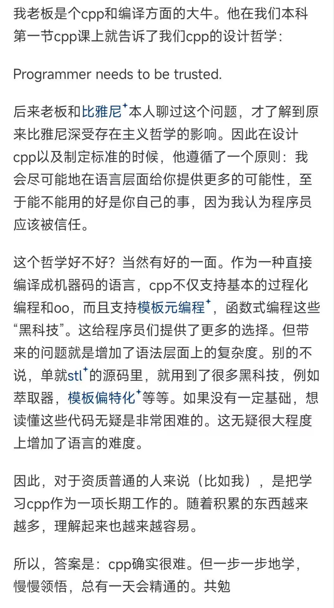

# 前言

## 为什么要学习现代cpp

在没有 _GC_ 的世界里，程序员必须自己手动进行内存管理，必须清楚地确保必要的内存空间，释放不要的内存空间。

程序员在手动进行内存管理时，申请内存尚不存在什么问题，但在释放不要的内存空间时，就必须一个不漏地释放。这非常地麻烦。容易发生下面三种问题：内存泄露，悬垂指针，错误释放引发BUG。

**_C++_ 本身没有像 _Java_ 或 _C#_ 那样的内置垃圾回收（GC）机制**

但它提供了多种工具和方法来管理内存，避免**内存泄露和悬空指针**问题。


## 手动管理内存
 _C++_ 提供了 _new_ 和 _delete_ 操作符用于动态内存分配和内存释放。程序员必须显式调用 _delete_ 来释放分配的内存，否则会导致内存泄漏。
```c
int* ptr = new int(10)
delete ptr; // 释放内存 
```
## 智能指针
 _C++11_ 引入了智能指针，它们通过自动管理内存的生命周期，减少了手动释放内存的负担。
 std::unique_ptr: 拥有为一所有权，当智能指针超出作用域时，自动释放内存。
 ```cpp
std::unique_ptr<int> ptr1 = std::make_unique<int>(10);
 ```
std::shared_Ptr:实现共享所有权，只有当最后一个指向对象的  _shared_ptr_ 被销毁时，内存才会被释放。
```cpp
std::shared_ptr<int> ptr1 = std::make_shared<int>(10);
std::shared_ptr<int> ptr2 = ptr1;  // 共享同一内存
```
std::weak_ptr:用于避免循环引用，不要直接访问资源，需要先提升到 _shared_ptr_ 才能使用

```cpp
std::weak_ptr<int> weakPtr = ptr1;  //不增加引用计数
```
## RAII（资源获取即初始化）
_C++_ 的 _RAII_ 对象（_Resource Acquisition Is Initialization_）是一种通过对象的生命周期来管理资源的方式，尤其适用于文件句柄、锁和动态内存等资源。
当对象超出作用域时，它的析构函数会自动调用，用来释放资源。
```cpp
class MyClass{
public:
    MyClass(){
        //资源初始化
    }
    ~MyClass(){
        //资源释放
    }
};
```
## 第三方垃圾回收库
虽然  _C++_ 本身没有内置的垃圾回收，但可以通过第三方库来实现，例如：
_Beohm-Demers-Weiser_ 垃圾回收器：一个广泛使用的 _C/C++_垃圾回收库，它可以实现自动内存管理。

## 总结
_C++_ 更强调程序员对内存的显式管理，而不像 _Java_ 等语言那样完全依赖垃圾回收机制。

然而，借助智能指针和 _RAII_ 等现代 _C++_ 特性，程序员可以在很多情况下避免手动管理内存，同时有效避免内存泄漏等问题。

