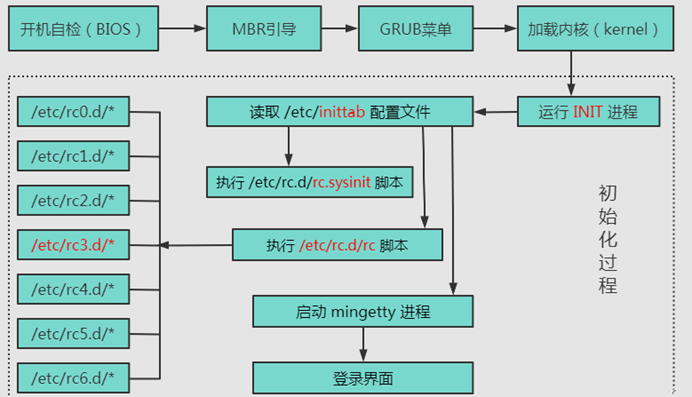

# linux系统的启动过程


## 早期linux系统的开机方式
> 为什么这里要特别强调早期呢？因为现在启动方式已经变了。这时肯定就有很多人有疑惑了, **既然都变了, 为什么还要讲旧的呢？**
> 
> 其实这种早期的启动方式还是很有必要学的。原因有以下几点。
> - 现在的启动方式也是通过早期的方式优化过来的, 有一定的关联性。
> - **有很多老项目, 现在还在用**这种init进程的启动方式。
> - 新的启动方式大规模使用的时间并不久, **也就在2018年左右才开始普及**, 现在百度搜索linux系统的开机过程, 显示的几乎全部是init进程的启动方式。
> 前期提要: linux系统的开机过程很重要, 但是真正重要的其实就那么几步。**很多课程把开机过程说的很多, 我觉得完全没有必要**, 几句话就可以把我们需要的全部讲清楚。


我把开机过程分为了以下几个阶段: 
#### 一、从开机自检（BIOS）到加载内核阶段
- 这一阶段对应的知识我们完全不必掌握, 知道这是从开机到载入内核的过程就可以了
- **注意: 这个不重要只是对我们想做C++后端的人来说, 对于做嵌入式的朋友, 这是绝对的核心, 如果是运维的话, 这些还是应该掌握的**

#### 二、启动init进程: 
使用命令 `ps -ef | more` 查看进程
- 这个进程是linux系统的第一个进程, PID为1, 又叫超级进程, 也叫根进程。
- 负责产生其它所有的用户进程, 所有的进程都被挂在这个进程下, 如果这个进程退出了, 那么所有进程都会被kill。**如果一个子进程的父进程退出了, 那么这个子进程会被挂到这个根进程下面。**
- linux又是以进程为最小执行单元的, 也就是说做任何事情都要依靠进程。从这里, 大家应该也能感觉到这个进程的重要性了
#### 三、读取inittab
init进程在启动时会读取/etc/inittab, 接着根据该配置文件的启动层级和执行项来启动对应的程序。

以下的代码就是一个典型的inittab文件
```
# Default runlevel. The runlevels used by RHS are:
#   0 - halt (Do NOT set initdefault to this)
#   1 - Single user mode
#   2 - Multiuser, without NFS (The same as 3, if you do not have networking)
#   3 - Full multiuser mode
#   4 - unused
#   5 - X11
#   6 - reboot (Do NOT set initdefault to this)
# 
id:5:initdefault:
```
我们发现inittab文件其实很简单, **真正有用的其实就一行: id:5:initdefault**

在讲解这一行代码前, 我们先介绍一下linux系统的运行级别, linux系统总共设置了7种运行级别, 不同的运行级别对应不同的执行方式。这7种运行级别分别是: 
|0级|1级|2级|3级|4级|5级|6级|
|--------|--------|--------|--------|--------|--------|--------|
|关机|单用户模式|无网络的多用户模式|多用户模式（无图形界面）|未使用|多用户模式（有图像界面）|重启|

以上的inittab文件表示init进程要启动的进程将会完成操作系统5级的功能。

#### 四、执行系统初始化脚本（/etc/rc.d/rc.sysinit）
对linux系统一些必备的东西进行初始化, 比如时钟, 键盘, 磁盘, 文件系统等。

这个脚本比较长, 也比较复杂, 而且都是对系统级的操作, 没什么讲解的必要。就不讲解这个脚本的内容了。


#### 五、执行启动层级对应的脚本（/etc/rc*.d）
linux系统不同的运行级别有不同的进程, 这些进程就要依靠这些脚本来启动。

比如: 在上面的例子中, /etc/inittab文件中记录的运行级别为: 5。所以, 由init进程执行/etc/rc5.d进程, 进行5运行级别必要的操作。

所以: 在早期, 如果有**系统级的进程想要**设置为**开机启动**, 就将启动该进程的命令放在该文件中。这种进程通常是一种服务, **至于什么是服务, 进程那里会详细讲解的**。
**后面有了service系统, 就不需要手动更改配置文件了。**


#### 六、不同的运行级别执行不同操作
例如: 对于3级, 5级来说, 就是启动对应的终端。5级为图形终端, 3级为命令行终端。然后执行rc.local文件。

所以: 早期如果有什么**用户级进程需要**在系统启动时**自动启动**, 就添加到rc.local文件中。
**后面有了service系统, 就不需要手动更改配置文件了。**


总结早期linux启动过程: 
- 完成开机自检到加载内核阶段
- 启动init进程负责产生其它所有的用户进程
- 读取inittab 并根据配置的启动层级和执行项来启动对应的程序
- 执行系统初始化脚本(rc.sysinit)
- 根据启动层级启动对应对应的脚本(rc*.d)

## systemd系统

> - 我们开发人员一般来说并不需要去操作systemd系统, 这都是运维的事情。
> - **这节课对systemd系统更多的是一个介绍 和 基本的设置。**
> - **等下一门课, 网络课程, 要进行大量的网络配置。那时就有更多的实际操作例子了。**
> - **如果**这门课**是关于运维的课程**, 那么systemd将是最重要的核心
> - systemd系统极其庞大, 复杂。**运维需要拿出一整章来讲**。
> - 如果对systemd系统有兴趣, 可以去百度一下, 资料很多, 毕竟这是运维的绝对核心。

现代的启动方式就是systemd系统。根据linux习惯, 字母d是守护（deamon）的缩写。systemd在名称上就是要守护整个linux系统的含义。

### systemd系统的开机过程和init系统的区别: 

##### 第一个启动的进程将不再是/etc/init进程, 而是/lib/systemd/systemd。

- 我们使用命令 `ps -ef | more` 查看进程。看到pid为1的进程还是/sbin/init
- 我们再使用命令`ls -l /sbin/init`输出`/sbin/init -> /lib/systemd/systemd` 
- 可以看到他只是个软链接罢了 真正pid为1的其实还是systemd进程


##### 默认启动的系统级进程通过系统目录进行配置（代替/etc/inittab的配置方式）
|优先级|1级|2级|3级|
|--------|--------|--------|--------|
|配置目录|/etc/systemd/system|/run/systemd/system|/lib/systemd/system|

systemd根据优先级从高到低的从这些目录中读取配置文件。启动这些配置文件对应的进程。如果同一服务三个地方都配置了, 优先级高的会覆盖优先级低的。	


- 在安装好samba服务后, 系统会在/lib/systemd/system目录中添加一个默认的配置文件(smbd.service)。
- 如果想自己设置配置文件, 只要在/etc/systemd/system目录下添加自定义的配置文件
- 这样就将/lib/systemd/system目录下的配置文件覆盖掉了。
- 至于/run/systemd/system是系统用来配置的, 我们不需要去管。

##### apt list额外补充:
- `apt list`:查看可以下载的所有包
- `apt list --installed`:查看已经被下载的所有包
- `apt list --installed | grep samba`:正则表达式查看被下载的相关samba包
- `apt list --installed 2> /dev/null | grep samba`:重定向把error和warning扔到null里
##### 重定向额外补充
|重定向|>|>>|2>|
|--------|--------|--------|--------|
|作用|覆盖文件内容|文件末尾追写|只输入error和warining 剩下的原位置输出|


### 读懂配置文件
现在大家只要知道一个服务的配置文件有三块就可以了, 具体表示什么, 如果之后用到了配置服务的情况, 再详细讲解。到时有了例子, 也好讲多了。
|部分|unit块|service块|install块|
|--------|--------|--------|--------|
|作用|启动顺序与依赖关系|启动行为|定义如何安装这个配置文件, 即如何做到开机自启|


#### **其实从这里, 我们也能看出systemd系统相对于init系统的优势。**

**systemd系统**配置服务非常规范, systemd系统可以对这些配置文件按照固定的格式优化, 比如可以让多个服务同时启动, 大幅提高服务启动效率。

**init系统配置**文件中仅仅是些**让脚本启动的命令**, 脚本具体是什么格式完全由开发人员确定。这就导致整个系统难以优化, 各种服务只能线性的依次启动, 效率很低。

#### **systemed系统组成及其优缺点**
- **systemed系统优点就是功能强大, 使用简单。**
- **systemed系统缺点就是体系庞大, 十分复杂**
- 很快我们就能体会到systemd系统有多么庞大, 复杂。

|单元unit|scope|slice|snapshot|socket|swap|timer|
|--------|--------|--------|--------|--------|--------|--------|
|作用|路径|不是由systemd启动的外部进程|进程组|systemd快照|套接字|文件交换|定时器|


|单元unit|serveice|target|device|mount|automount|path|
|--------|--------|--------|--------|--------|--------|--------|
|作用|服务|运行级别|设备|文件系统的挂载点|自动挂载点|路径|


**这些我们当然不需要全部掌握, 否则东西太多了, 每一个unit知识点都很多。实际上我们只需要掌握service单元就可以了。剩下的连名字都不需要去记。**

**大家如果感兴趣的话, 可以去百度一下timer unit和target unit, 这两个网络配置时也是会用到的, 到时演示一下吧。**

#### systemctl是systemd的主要命令, 可以用于管理服务单元。


- `systemctl enable httpd.service`: 使某任务开机自启
- `systemctl disable httpd.service`: 使某服务不开机自启
- `systemctl status httpd.service`: 服务详细信息 
- `systemctl list-units --type=service`: 显示所有已经启动的服务
- `systemctl start httpd.service`: 启动某服务
- `systemctl stop httpd.service`: 停止某服务
- `systemctl restart httpd.service`: 重启某服务


至于用户级别的开机自启进程设置, 这门课就不讲了。这门课更多的是理论, 这种实践性比较强的东西就放在下一门课, 也就是网路那门课讲了。

这门课终究还是基础知识课, 不涉及项目, 一些应用性的知识, 等到真正做项目时再做会更好的。
