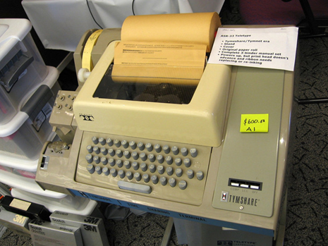

# 系统结构介绍
## linux系统整体结构的划分

linux系统可以简单的划分为用户区和内核区。
 
用户区, 内核区具体有什么接下来几节课会讲的, 这节课只讲整体的问题

### 为什么linux系统要被划分为用户区, 内核区？

**这个问题就要从进程谈起了, 因为进程才是操作系统的执行单元, 用户的一切操作都是以进程为单元的。**

一个进程也可以被划分为用户区, 内核区

**进程用户区, 内核区和操作系统用户区, 内核区的关系以后会讲的, 如果新手不明白二者的关系, 现在只需要记住二者有大致的对应关系**

那么一个进程为什么要划分为用户区, 内核区呢。只有一个区不可以吗？

当然是可以的, 但是如果不分区, 用户可以轻易的访问计算机的所有资源, 那么数据的安全性, 对硬件的保护将无从谈起。
- 不分区意味着所有数据对用户可见, 用户可以随意获取, 毫无保密性。
- 不分区意味着用户可以直接操作硬件, 那么硬件的安全性将无法得到保证, 很多硬件不能长期做某些操作。
-	不分区意味着非专业用户的操作更容易弄坏系统。

综上所述, **分区是必须的。让进程在用户区在执行时, 就不能访问内核区的东西（因为操作系统的核心在内核区, 只要用户不能任意修改内核区, 操作系统就不易损坏）。而当进程在内核区时, 可以任意访问用户区与内核区。**

**进程的分区就是以操作系统的分区为前提的**（原因等讲到进程的时候会详细讲解）。所以操作系统的分区是必须的。


**进程需要分区 而系统分区又是进程分区的前提 所以系统必须分区**


### 那么操作系统是如何将整个系统划分为用户区, 内核区的呢？
说操作系统的划分是如何实现的还不如说进程的分区是如何实现的。因为linux是面向进程设计的操作系统, 一切都要靠进程来运行。

**进程用户区, 内核区**和**操作系统用户区, 内核区**有大致的对应关系


##### 核心概念
- **进程**：可以简单理解为一个正在运行的程序。
- **内存**：计算机中用于存储数据的地方, 可以分为物理内存（RAM）和虚拟内存。
- **指针**：一个变量, 存储的是内存地址。通过指针, 我们可以访问特定内存地址中存储的数据。**可以把指针想象成一个门牌号, 它指向内存中的一个特定位置。在32位系统中, 这个门牌号是32位的；在64位系统中, 它是64位的。**
- **寻址**：通过内存地址来找到特定的内存位置。**寻址就是根据门牌号（指针）找到对应的房间（内存地址）**

##### 解释
1. 进程的内存空间
- 每个进程在运行时, 都会被分配一块独立的内存空间, 用于存储代码、数据等。
- 在32位系统中, 一个进程的内存空间大小理论上是4GB（2的32次方字节）。
- 在64位系统中, 一个进程的内存空间大小理论上是2的64次方字节。

2. 指针的作用
- 在32位系统中, 指针是32位的, 可以寻址4GB的内存空间。**由于只有32位, 所以它可以表示 2^32 个不同的内存地址。这就好比一个小区只有 2^32 个门牌号, 所以最多只能找到 2^32 个房间。因此, 32位系统理论上最多能寻址 2^32 字节（4GB）的内存空间。**
- 在64位系统中, 指针是64位的, 可以寻址更大的内存空间。**64位指针可以表示 2^64 个不同的内存地址, 因此64位系统理论上可以寻址 2^64 字节的内存空间。**
- 指针是用来存储内存地址的。

3. 进程的内存空间
- 每个进程在运行时, 操作系统都会为其分配一块**独立的内存空间**, 用于存放代码、数据等。
- **这个内存空间就是通过指针来寻址的。**
- 指针位数决定的是理论上可以访问的最大地址空间, 而进程实际使用的内存空间通常小于这个值, 并且还受到其他因素的限制。


**堆内存的本质是什么？就是在需要时就申请的物理内存。那能申请多少堆内存呢？可以申请到指针无法寻址为止, 也就是达到一个进程的上限。**

**大家这下明白为什么在早期的计算机中, 500M的物理内存可以运行4G的进程了吧, 一个进程在启动时, 代码区, 栈区, 动态库链接区等区域消耗的内存很小, 堆内存只有在需要时申请就可以了, 加起来也不会达到500M, 更别提4G了。**


进程的东西这里就这些了, 剩下的等到进程那一章再讲

4. 指针的值是可以修改的, 我们可以修改指针的值到想要的任何一个值, 所以从软件的角度是无法将用户区, 内核区进行划分的。

**众所周知 在windows平台一个32位程序 0到2G是内核区 3到4G是用户区**
那我们可不可以修改一个指针 让他访问0到2G内核区的东西呢? 从软件角度讲当然是可以的啦
```cpp
#include <iostream>
int main() {
  // int* p = (int*)(100);
  int* p = reinterpret_cast<int*>(100); //这是cpp写法
  std::cout<<*p<<std::endl;
}
```
0到2G为内核区 那么100当然在0到2G之中了 所以p指向的也是内核区的东西
但是以上代码无法运行 **因为访问权限不够 为什么不够呢?**

**答: 为了实现操作系统内核区, 用户区分离的功能, CPU有0, 1, 2, 3级4种运行级别, linux和windows都只使用了0级或3级。当进程在用户区时, CPU在3的运行级别下运行, 此时指针只能访问用户区。进程切换到内核区时, CPU的运行级别就切换到0级了, 指针可以访问用户区和内核区。**

5. 操作系统就是通过CPU来实现的内核区, 用户区分离。


**扩展一点知识: 为什么java就无法做破解, 因为java没有指针, 无法修改想要修改的内存。至于引用, 其实就是不被视为对象的指针, 引用其实有地址, 有值, 但是编译器不将其视为对象, 也就无法单独拿出来使用, 所以引用无法修改想要修改的内存。所以java虽然有引用, 但是无法进行破解。**


其实说这么多 就是为了解释**只有从硬件角度也就是cpu才可以实现用户区和内核区分离**
- 说操作系统的划分还不如说进程的划分
- 而进程是依靠指针寻址的
- 而指针的值是可以修改的
- **所以无法从软件角度实现内核区和用户区分离**。


## 内核区


linux系统内核区可以分为三部分。
#### 下层, 驱动程序：
直接对接硬件, 将硬件抽象为一个个文件, 让上层可以通过操作文件来操作硬件。大家应该都听说过一句话 在linux中一切皆文件
#### 中层, 文件, 网络, 进程, 内存等管理系统：
1. 这些是操作系统真正的核心。文件, 网络, 进程, 内存会有单独的章节来讲解, Part2就不详细解答了。
2. 为什么说这些是真正的核心呢？因为这些模块几乎任何程序都在频繁的使用。

- **文件系统**, 经常使用的打开文件, 关闭文件就不说了, 实际上向屏幕输出, 也是在对文件进行操作, 因为显示器在驱动程序那里就已经被抽象为文件了。
- **内存管理**更不必多说, 我们经常需要对堆内存进行申请, 释放操作, 这就离不开内存管理系统。
- **进程管理系统**也是经常使用, linux系统是以进程为最小执行单元的, 也就是说, linux完成几乎任何任务都需要依靠进程。而进程是需要资源的, 所以进程管理是不是就非常重要。
- **网络服务模块**：网路的重要性不必多说, 现代程序几乎都离不开网络, 网络操作也是整个linux系统编程的重中之重。

**文件系统, 内存管理, 进程管理, 网络系统也可以说是linux系统编程的4大天王, 每个系统都会有单独的章节来详解。**


**这四个模块要尽量深入研究, 研究的越深入, 对linux系统的理解程度就越深, 如果大家已经有了很不错的基础, 可以看一下linux的源码, 就看这四个系统就可以了, 看完, 理解之后, linux系统编程就大成了。**

#### 上层, 系统调用接口：
1. 上一课已经说明了操作系统分为用户区, 内核区的必要性, 用户区不能直接操作内核区, 但内核区又是必须要使用的。
2. 于是操作系统提供了系统调用接口, 用户区可以通过调用系统调用接口来间接操作内核区, 这样既可以使用内核区, 又实现了用户区, 内核区的分离。

```cpp
```

我们创建的文件, 网络协议栈都在操作系统内核区中, 我们用户只能通过对应的文件描述符来间接操作该文件（因为linux系统一切皆文件）

#### 扩展知识：为什么进程内核区的对象一定要手动释放呢？这里给大家扩展一下, 很多工作多年的人都不知道。
**不管任何语言：一个对象可能存放的地方有三种**
- 栈内存：内存回收完全不需要自己考虑, 函数执行完毕, 栈内存自动回收。

- 堆内存：动态申请的内存不会自动释放, **但也是有方法解决的**, 因为栈内存是堆内存寻址的唯一方式, 我们可以给堆内存添加一个引用计数, 如果引用计数为0, 那么就销毁堆内存, 这就是智能指针的工作原理。

- 内核区：内核区对象就**真的没有任何办法可以自行判断释放时机了**, 只能自己手动释放, 任何语言都是这样。

典型的例子就是文件操作了, **因为文件对象就在进程内核区中**。


## linux用户区

#### C语言函数库：
-	系统调用接口提供的功能往往比较单一, 很多任务需要大量的系统调用配合使用。**非常麻烦。**
- **于是c语言函数库就诞生了**, 它基于系统调用, 分装的函数定义了大量的功能, 并且进行了大幅度的优化。

注意：很多时候我们既可以使用库函数, 也可以使用系统调用。**推荐还是使用库函数**, 库函数一般使用比较方便, 而且效率更高, 虽然加了一层封装, 但往往经过了大幅的优化。

**这里不演示了, 等part3配置好环境后, 会写一个非常典型的例子。**

**当然：我们这门课写文件时用的是C++, 系统调用和库函数一般在写脚本, 配置时才会使用, 但了解系统调用和库函数还是非常有意义的。**

#### shell：

-	shell的英文含义就是“壳”, 用户就是通过shell来与操作系统交互的。
- shell本身提供了多种功能, 比如各种命令, 还有重定向等功能, Part3就会集中去讲这些功能。
- shell有很多种类, 我们最常使用的是bash, 对于非专业的运维来说, 不同shell之间的差距忽略不计就可以了。

一点扩展知识, sh是第一个shell, 很多人推荐zsh, 说这是未来主流。不过这些都是运维的事情, 不是我们这门课的核心。

**大家如果有兴趣, 可以自己去看一下zsh, zsh真的很强。**

**注意：管理员可以遵照用户的习惯给每个用户设置专门的shell, 它不是所有用户的公用的。**


## 终端

终端就是用户最终操作的地方。一台电传打字机就是最早的终端。



早期的unix系统是一个多用户的操作系统, 每个用户通过该设备与shell交互, 终端把数据传递给shell, shell处理完毕后再发会终端。

**此时：终端还不属于操作系统**

#### 现在的终端：
1. 现在的计算机早就没有了单独的硬件作为终端（显示器不是终端, 它只是一个输出设备, 不是用来和shell交互）, 但是用户使用终端和shell交互的设计理念从未变过。

2. 现在的操作系统会模拟出一个终端, 我们可以通过该终端与shell交互。现在的虚拟终端无处不在, 比如：
- windows的界面, dos。（windows的界面是嵌入内核的, 在这一方面和linux不同, windows也没有shell, 而是直接通过windows界面部分与内核交互, 不过这不影响windows界面就是一个终端）
- linux图形界面, 命令行终端
- mac的图形界面, 命名行终端


额外说一点, 终端的简写就是“tty”, 有很多人就疑惑了, 终端不应该是terminal吗？怎么就成“tty”了呢？因为电传打字机的英文是“Teletype”, 简称“tty”, 所以tty代表终端的说法就一直流传到了现在。

**现在, 虚拟终端是操作系统的一部分了。**

3. 我们查看一下linux的终端（现在还未进行环境配置, 等环境配置完成之后再进行这些操作吧）, 看一下终端种类, 发现终端种类有两种。" \* " 代表任何一个数字。
- **tty/***: 是linux默认提供的终端, 就是那种linux系统自带的黑窗口, 它早已不再是早期的电传打字机, 而是操作系统自带的, 

- **pts/***: 就是虚拟终端, 我们以后使用的都是这个。远程链接和图形界面都是虚拟终端。


其实终端理解到这里就足够了, 剩下的没必要去管了, 就算是运维, 了解这些也差不多了。

#### 操作
- `w` 该命令显示当前主机各用户登录的信息
- `tty` 该命令用于查看终端
- Ctrl+Alt+F2到F8都可以 打开linux自带的真正终端
- Ctrl+Alt+F1 切换至图形终端
