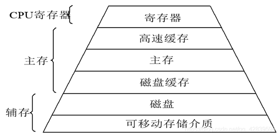

# 计算机的存储结构


## 内存管理
内存管理的核心其实有两部分：
- 分页机制: 这部分**是理论部分**，这里偷一下懒，有兴趣的可以去百度。
- 内存池: 内存池是网络编程的重点。


## 现代计算机的存储结构

首先解释一下这张图，计算机的存储设备可以按照存储容量的从大到小，速度从慢到快，单位存储价格从低到高分为网络（可以认为存储数量无限），磁盘，磁盘缓存，物理内存（主存），高速缓存，寄存器。其中寄存器在cpu内部，其它的都在cpu外部。

其实大家可以这么理解 主要存储就三个 寄存器 物理内存 磁盘

## 寄存器
Cpu只能直接使用寄存器中的数据，任何数据都必须要传递到寄存器中才可以使用。

寄存器体积非常小，对于32位系统来说，有32bit，对于64位系统来说，有64bit。
从数量上来说，寄存器也很少，也就十几个。

## 高速缓存 (Cache)

在计算机发展的早期，内存访问速度相对较慢，成为了制约程序性能的瓶颈。为了弥补主内存与速度更快的寄存器之间的速度差异，**高速缓存 (Cache)** 的概念被引入。高速缓存的主要目的是通过临时存储数据，减少对速度较慢的主内存的访问，从而提高程序的执行效率。

### 工作原理

高速缓存的具体工作原理涉及复杂的硬件机制，例如缓存行、缓存命中/缺失、替换策略等。对于我们理解其在编程中的影响而言，只需要知道高速缓存是一个比主内存更快的小型存储区域，用于存储近期被频繁访问的数据即可。

### C 语言中的高速缓存优化

在 C 语言中，编译器会进行各种优化以提高程序性能，其中就包括利用高速缓存。考虑以下代码片段：

```c
int val1 = x;
// 一些不使用 x 的代码
int val2 = x;
```
一个智能的编译器可能会识别出在两次读取 x 的值之间，x 的值并没有被显式修改。因此，编译器可能会将 x 的值临时存储在速度更快的寄存器中，而不是每次都从主内存中读取。这个过程可以看作是一种缓存。

### `volatile` 关键字的作用

然而，如果上述两条语句之间，有其他代码可能会修改 x 的值（例如，通过另一个线程、硬件中断等），那么编译器进行的这种缓存优化可能会导致程序行为不正确。

默认情况下，编译器通常无法确定一个变量是否会被外部因素（超出当前编译单元的代码）所修改。出于安全考虑，如果没有明确的指示，编译器可能会避免对这样的变量进行激进的缓存优化。

volatile 关键字 的作用就是告诉编译器，被声明为 volatile 的变量的值可能会在使用过程中发生变化，这种变化并非由当前程序代码直接控制。当变量被声明为 volatile 时，编译器将不会对该变量进行缓存优化，每次访问该变量时都会直接从内存中读取。

### const 和 volatile 的同时使用

`const` 和 `volatile` 这两个限定符可以同时使用。`const` 用于表示变量在程序内部是不可修改的，而 `volatile` 则表示该变量的值可能被外部代理（例如硬件）所改变。一个典型的例子是内存映射的硬件寄存器：程序不应该修改它的值，但它的值可能会被硬件更新。

### 限定符的顺序
`const` 和 `volatile` 这两个限定符在声明中的顺序并不重要，`const volatile int data;` 和 `volatile const int data;` 的含义是相同的。但通常建议按照 `const volatile` 的顺序书写以保持一致性。


## 主存

一般我们说主存的概念，有两种，如开头的图片所示。

这里所说的主存，其实就是物理内存。在计算机中，从硬件的角度讲只有物理内存。物理内存就是我们使用的内存条。程序的主要过程都在内存上体现。

#### 磁盘缓存
提高磁盘与主存的交互速度。
#### 磁盘
磁盘是计算机长期存储的主要设备，比如文件就写在磁盘上。内存上的内容在系统关闭时会清空，只有写到磁盘上才可以长久存储。
#### 可移动存储介质
网络不必说，需要数据时从网络获取就可以了。


## 早期内存分配机制
在早期的计算机中，要运行一个程序，需要把内存全部加载到物理内存。

这样的物理内存分配方式看上去很合理，但实际上在分配策略方面有很多问题。

在物理内存的分配方面，曾经有非常多的算法，但始终没有一个算法可以很好的解决物理内存的分配问题。直到虚拟内存诞生。


## 虚拟内存
### 介绍
用户在开发程序时是以进程为单位的，如果直接使用物理内存会非常困难，所以发明了虚拟内存的概念。

每个进程都有一套虚拟内存地址，用来给自己的进程空间编号。**虚拟内存简单来说就是操作系统让进程误认为自己有连续的4g内存。**


在32位的系统中，**每个进程**都会有一个4g的虚拟内存，直接操作4g的虚拟内存，然后通过CPU的mmu模块将这4g的虚拟内存映射到物理内存上。


从物理内存的角度考虑，当进程需要内存时，cpu的mmu模块就会给进程分配所需要的物理内存。

所以进程的虚拟内存对应的物理内存并不连续，mmu有一套复杂的在物理内存上分配内存的方式。这就完美解决了物理内存的分配问题。


