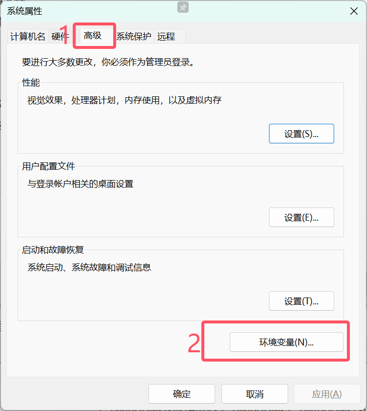
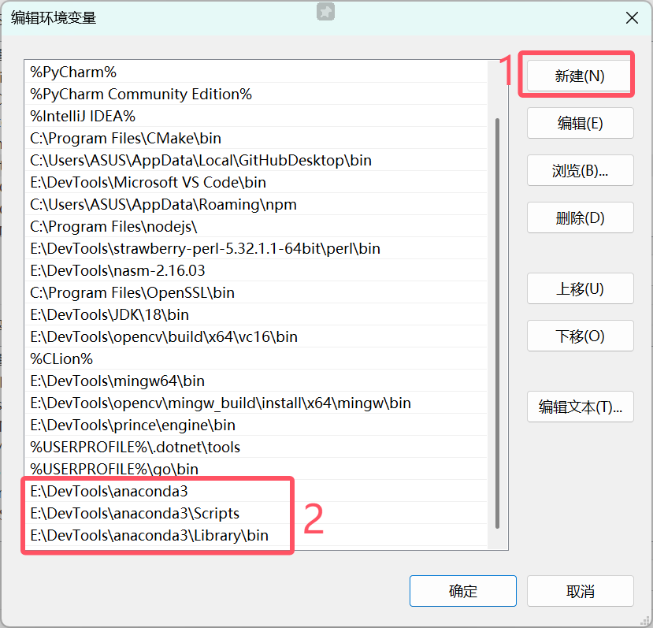

# Conda

## 为什么需要 Conda

### 一、软件包管理：解决“软件安装和依赖地狱”
想象一下，你想要安装一个软件，比如一个数据分析工具。这个工具可能依赖于其他一些软件才能正常运行，就像一个玩具需要电池、螺丝等配件一样。这些“配件”就是依赖项。

- **没有 conda 的情况**： 你可能需要手动去网上搜索、下载并安装这些依赖项。更糟糕的是，不同的软件可能需要同一个依赖项的不同版本。这就像你家里的两个玩具，一个需要 2 节 AA 电池，另一个需要 4 节 AA 电池，如果你只有一个电池槽，就会很麻烦。在软件世界里，不同版本的依赖项可能会互相冲突，导致你的软件无法正常工作，这就是所谓的“依赖地狱”。

- **有了 conda**： conda 就像一个智能的管家，它可以帮你自动处理这些依赖项。当你告诉 conda 你想安装某个软件包时，它会自动找到该软件包需要的所有依赖项，并且确保安装的版本是兼容的。它就像一个智能的购物助手，帮你把所有需要的配件都准备好，而且保证它们能一起工作。

### 二、环境管理：解决“项目之间的互相干扰”

假设你同时在进行两个不同的项目。第一个项目需要 Python 的版本 3.8 和某个库的版本 A=1.0。第二个项目因为一些历史原因，只能使用 Python 的版本 3.9 和同一个库的版本 A=2.0。

- **没有 conda 的情况**： 你可能会把所有软件包都安装在同一个地方。当你切换项目时，你可能需要卸载一些软件包，安装另一些软件包，这非常麻烦而且容易出错。就像你只有一个房间，一会儿要布置成儿童乐园，一会儿又要变成严肃的办公室，每次都要大费周章地搬来搬去。

- **有了 conda**： conda 可以让你创建独立的环境。你可以为第一个项目创建一个环境，安装 Python 3.8 和库 A=1.0。然后为第二个项目创建另一个完全独立的环境，安装 Python 3.9 和库 A=2.0。每个环境里的软件包都是相互隔离的，就像你家里的不同房间一样，互不干扰。当你需要切换项目时，你只需要激活对应的环境，就像走进不同的房间，一切都是你需要的样子。

### 总结:
- 简化软件包的安装、更新和卸载，并自动处理复杂的依赖关系。
- 允许你创建和管理独立的开发环境，避免不同项目之间的软件包冲突。

## Conda分类
### Anaconda Distribution
预装系列科学计算类的包，安装包比较大，自带环境和包的图形管理界
面 Anaconda Navigator
### MiniConda
只有最简单的python环境命令行，没有预装的第三方包，也没有图形界
面，需要自行通过命令行进行包和环境的管理
### 建议
- **深入使用**仍然逃脱不了使用命令行管理
- 对于命令行不熟悉的可以选择Anaconda

## Windows安装Conda

- 由于本文面向的是初学者 故这里选择安装Anaconda 但也会兼顾使用一些基础的命令行指令

### 下载并安装Anaconda
点击官网链接下载 https://www.anaconda.com/download/success
下载完毕后 双击运行.exe程序 无脑下一步 并**选择相应的安装路径** 和 用户

### 配置环境变量
- 按下Win + r键并键入`SYSDM.CPL` 回车打开界面后 如图依次点击



- 双击Path打开编辑界面


- 如图依次点击 并 键入**自己安装anaconda时的对应位置**


完成后点击确定 打开cmd并键入`conda --version`验证环境变量

### 修改源
直接打开cmd输入以下命令
```bash
conda config --add channels https://mirrors.tuna.tsinghua.edu.cn/anaconda/pkgs/free/
```
```bash
conda config --add channels https://mirrors.tuna.tsinghua.edu.cn/anaconda/pkgs/main/
```
```bash
conda config --add channels https://mirrors.tuna.tsinghua.edu.cn/anaconda/cloud//pytorch/
```
```bash
conda config --add channels https://mirrors.tuna.tsinghua.edu.cn/anaconda/cloud/conda-forge/
```
```bash
conda config --set show_channel_urls yes
```

## Linux安装Conda
- 尚待补充

## Conda常用命令

|命令|作用|
|-|:-:|
|```conda --version```|查看conda版本|
|```conda config --show```|查看conda的环境配置|
|```conda config --add channels https://```|设置镜像|
|```conda config --set show_channel_urls yes```|设置搜索时显示通道地址|
|```conda update conda```|将conda自身更新到最新版本|
|```conda update Anaconda```|更新Anaconda整体 |
|```conda create --help```|查询某个命令的帮助 |
|```conda create -n name python=3.10```|创建python版本为3.10、名字为name的虚拟环境|
|```conda config --set show_channel_urls yes```|设置搜索时显示通道地址|
|```conda env list```|查看有哪些虚拟环境|
|```conda activate name```|激活环境|
|```conda deactivate```|退出虚拟环境|
|```conda remove --name name --all```|删除虚拟环境|
|```conda remove --name name package_name```|删除环境下的包|
|```conda list```|查询看当前环境中安装了哪些包|
|```conda install package_name```|安装包 |
|```conda install package_name=0.20.3```|安装特定版本的包 |
|```conda update package_name```|更新到它的最新版本|
|```conda uninstall package_name```|将依赖于这个包的所有其它包也同时卸载|
|```conda uninstall package_name --force```|不删除依赖包|