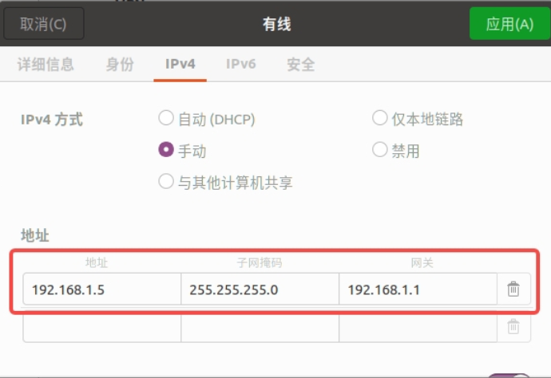

# 雷达导航
## Ubuntu22.04配置Mid360网关
- settings(设置) -> network(网络) -> wired -> ipv4
- ipv4 method选择manual(手动)
- DNS地址写不写无所谓 地址(address)192.168.1.5 网关(gateway)192.168.1.1 子网掩码(netmark)255.255.255.0
- 在Mid360.json中找到lidar_configs选项 根据实物雷达后面的数字修改ip


## 配置Mid360SDK
https://github.com/Livox-SDK/Livox-SDK2
```bash
git clone git@github.com:Livox-SDK/Livox-SDK2.git
```
- 打开Livox-SDK2 并 新建文件夹build
- 进入build文件夹 并 打开bash输入指令
```bash
cmake .. && make -j 4
sudo make install
```

## 安装small_icp
```bash
sudo apt install -y libeigen3-dev libomp-dev
```
```bash
git clone https://github.com/koide3/small_gicp.git
```
```bash
cmake .. -DCMAKE_BUILD_TYPE=Release && make -j
sudo make install
```

## 修改slam_toolbox地图
- 加载.tar的镜像
```bash
sudo docker load < ogm2pgbm.tar
```
查看本地镜像
```bash
sudo docker images
```
- clone项目Ogm2Pgbm 并运行docker镜像
```bash
git clone https://github.com/ToroSamy/Ogm2Pgbm.git
```
```bash
cd Ogm2Pgbm
sudo ./autorun.sh
```
- 将map.yaml 和 map.pgm 拷贝到Ogm2Pgbm/workspace/map
- 在 **docker容器** 中执行如下命令行
```bash
roslaunch ogm2pgbm ogm2pgbm.launch map_file:=/root/workspace/map/map.yaml record:=true
```

- 当 终端 提示`done!`后 使用如下命令行 将`.bag`拷贝到宿主机中
查看docker容器id
```bash
sudo docker ps
```
从 id 为60ba15da2b35的容器中拷贝.bag到~/develop-work-space/project/Ogm2Pgbm/builder/下
```bash
sudo docker cp 60ba15da2b35:/root/.ros/ogm2pgbm_sensordata.bag ~/develop-work-space/project/Ogm2Pgbm/builder/
```
- 在Ogm2Pgbm/workspace/builder下执行如下命令行
```bash
rviz2 -d ogm2pgbm.rviz
```
```bash
pip install rosbags
```
进入存放 rosbag 的目录，执行以下命令，将 ogm2pgbm_sensordata.bag 转换为 base.db3 
```bash
rosbags-convert --src ogm2pgbm_sensordata.bag   --dst base   --src-typestore empty   --dst-typestore ros2_humble   --exclude-topic /rosout /robot/map /rosout_agg
```
启动 slam_toolbox 准备建图
```bash
ros2 run slam_toolbox async_slam_toolbox_node --ros-args   -p use_sim_time:=True   -p odom_frame:=robot_odom   -p base_frame:=robot_base_link   -p map_frame:=robot_map   -p do_loop_closing:=False   -p max_laser_range:=10.0
```
播放rosbag
```bash
ros2 bag play base.db3
```
- 待 rosbag 播放完毕，在 rviz2 界面左侧 SlamToolBoxPlugin 中设置好文件名，点击 Serialize Map 即可保存 .posegraph+.data 地图；点击 Save Map 可保存 .pgm+.yaml 地图