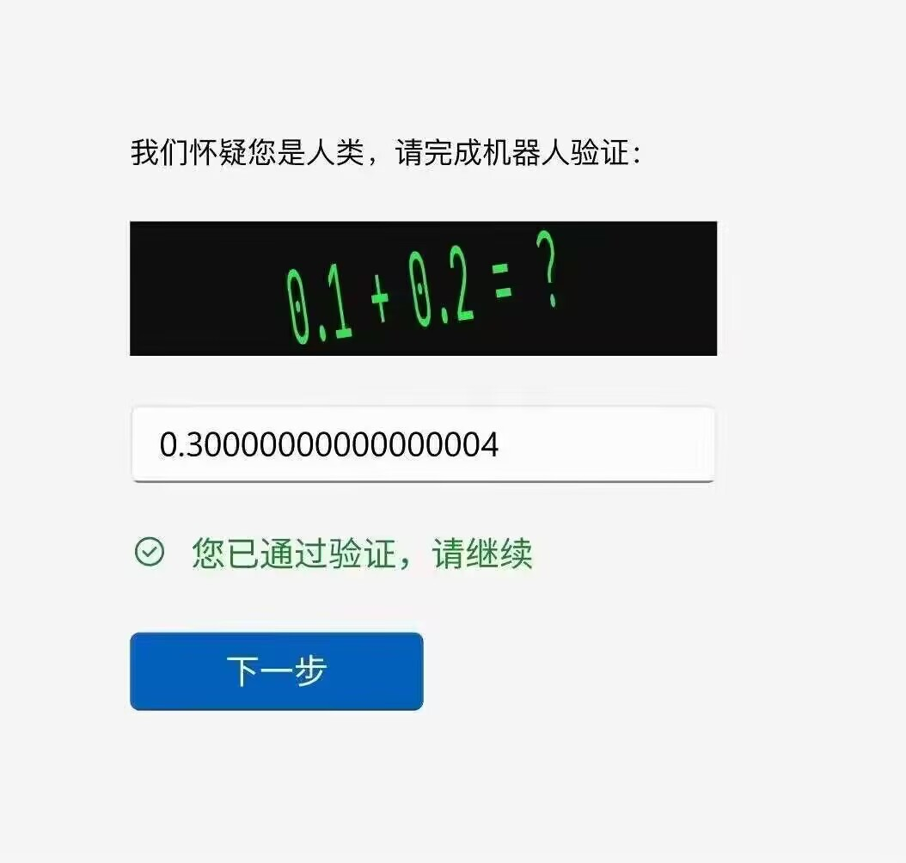

## Debug和Release有什么区别

- 在发布版本的构建过程中，编译器会应用他认为合适的优化。因此构建结果通常会更小，运行速度也更快
- 另一方面由于编译结果与源代码完全不匹配，所以调试难度会增加

## 什么是驱动
- 驱动程序可以使硬件设备正常工作，相当于硬件的接口，操作系统只有通过这个接口，才能控制硬件设备的工作

## 计算机三码
在计算机的数字电路中只有加法器，没有所谓的“减法器”。

计算机保存最原始的数字，是没有正负之分的，叫做“无符号数字”。

原码左边第一位存放符号，0表示正数，1表示负数。
| 优点     | 弊端     |
| -------- | -------- |
|原码直观易懂、与真值转换容易 | 0有两种表示形式 |
|  | 减法运算复杂   |

**一、为什么需要反码？** 
反码的作用就相当于数学中的负数。

对于小学生来说，会做的算术题是：5-3,但是不会做3-5。于是，我们上初中的时候，数学里就引进了一个新的概念：负数。引入负数之后，本来是减法的运算就可以变成加法来实现：
3-5=3+[-5]=[-2], 中括号代表“负数”，“负数”就是我们人为给出的数学术语。

对于计算机来说，会做的算术题是：5+3,但是不会做3-5。于是，我们就在编码里引进了一个新的概念：反码。引入反码之后，本来就是减法的运算可以变成加法来实现：
3-5=3+[-5]=[-2]，中括号代表“反码”，“反码”就是我们认为给出的计算机术语。

这里，你一定有个疑问：为什么计算机只会做5+3,但是不会做3-5。这是因为在计算机的数字电路中只有加法器，没有所谓的”减法器“。不是说计算机厂商不会设计减法器，因为聪明的人既然发明了方法能够用加法来实现减法操作，那为什么还需要画蛇添足的弄一个减法器？

接着说：那么反码要怎么定义才能实现减法变加法的功能呢？聪明的人想的办法如下：
1. 正数的反码保持原码不变：3=[0_0000011]
2. 负数除最高位（正负号位）外，全部取反（0变1,1变0）：-5 [1_0000101]取反=[1_1111010]
于是3+[-5]=[-2]的计算过程为：
[0_0000011]+[1_1111010]=[1_1111101]

**二、为什么需要补码？**
都是因为“0”这个特殊数字的存在。
先问你一个问题：0是正数还是负数？你肯定会说：0既不是正数也不是负数，这是我们初中学到的数学知识。这个回答没有问题，所以以后每次碰到0,人们都不会把他当成正数或负数。

那么计算机呢？计算机不同于人脑，**计算机在碰到任何数字之前只根据最高位的符号位来判断正负性，“0”表示正数，“1”表示负数**。

前面我们推论了为何要用反码，那么用8位二进制反码表示的正数范围：+0 —— +127；负数范围： -127 —— -0。但是，其中有两个特殊的编码会出现：
[0_0000000]=+0 （反码）
[1_1111111]=-0 （反码）

**其实，+0和-0代表的都是0。这样一来，“0”这个数字在计算机中的编码就不是唯一的了**。对于计算机来说，这是绝对不行的，因为任何数字都只能有1个编码。

于是，聪明的人就做了这样一个决定：把0当成正数，也即+0，这样0的编码就变成：0_0000000。那8位二进制表示的正数范围仍然是： +0 —— +127。

但是，对于负数就必须要做调整，也即-0必须要让位---1_1111111这个编码不能表示-0。我们可以把负数整体向后“挪动1位”：只要将8位二进制表示的负数范围从：-127 —— -0变成：-128 —— -1，就能成功解决问题。

那么怎么整体挪动1位呢？方法就是反码+1。{1_1111111}编码就不再表示-0，而变成了-1。顺着推，最小的编码{1_0000000}就是-128。

**我们给这个反码+1又人为的取了一个新的名字，叫补码**。于是乎，补码的定义如下：

1. 正数的补码保持原码不变：`3={0_0000011}`

2. 负数先求反码，然后再加1：`-5=[1_1111010]+1={1_1111011}`

于是`3+{-5}={-2}`的计算过程为：`{0_0000011} + {1_1111011}={11111110}`

至此，通过补码就成功解决了数字0在计算机中非唯一编码的问题，且也能实现减法变加法。

所以，在计算机的世界里，0是正数。这点和我们学的数学不一样。

{0_1111111}=+127 （补码）

{0_0000000}=+0 （补码）

{1_1111111}=-1 （补码）

{1_0000000}=-128 （补码）

## 位操作

#### 操作
| 按位与     | &     |都为1时 才为1 |
| -------- | -------- |--------|
| 按位或 | \| |有一个为1时 则为1|
| 按位异或 | ^ | 不同则为1|
|二进制反码或按位取反|~||

#### 用法
注意: 因为markdown语法远古
mask 0 0 0 0 0 0 1 1
flag 1 0 0 1 0 1 1 0
| 用法| 例如|解释 |结果|
| -------- | -------- |--------|--------|
| 掩码 | flags = flags & mask |把掩码中的 0 看作不透明 1看作透明|0000010|
| 打开特定位 | flags = flags \| mask | 把flags的1号位设置为1且其他位不变。**任何位与0的组合结果都为本身，任何与1组合结果都为1**。即00001111 \| 10110110|10111111|
|关闭位(清空位)|flags = flags & ~mask||00001001|

#### 位移运算符
左移运算符和右移运算符可以用于获取一些特定的位
| 左移运算符     | << n     |整体往左n 移出作末端位的值丢失 用0填充空出的位置 |相当于* 2的n次方|
| -------- | -------- |--------|--------|
| 右移运算符 | >> n |整体往右n 移出作末端位的值丢失 用0填充空出的位置|相当于/ 2的n次方|

## 编程语言 和 技术栈

**编程语言：** 程序员与计算机沟通的桥梁，通过编写代码来实现特定的功能
**技术栈：** 一组协同工作的技术、工具和框架的集合，用于构建和运行应用程序

***两者的区别：***
**1、** **包含关系：** 编程语言是技术栈的一部分，但技术栈远不止编程语言
**2、** **侧重点：** 编程语言关注的是代码的语法和语义，而技术栈关注的是整个应用程序的构建和运行
**3、** **抽象层次：** 编程语言是一种相对底层的工具，而技术栈是一种更高层次的概念，它将各种技术整合在一起，提供了一个完整的解决方案
**4、** **抽象比喻：** 
**编程语言** 好比是建造房屋的砖块，是构成建筑的基本单元
**技术栈** 好比是一整套的建筑工具和材料，包括砖块、水泥、钢筋、脚手架等，以及施工图纸和施工规范

编程语言是技术栈中的一个重要的组成部分，但它们并不是同义词。技术栈是一个更广泛的概念，它涵盖了整个软件开发过程中的各种技术和工具。选择合适的技术栈对于开发高质量的应用程序至关重要。

技术栈中的很多部分确实是由编程语言开发出来的。这就像一栋大楼，编程语言是建造大楼的砖块，而技术栈就是整栋建筑。

***举个例子：***
**前端框架（如 _React，Vue_）:** 这些框架本质上就是用 _JavaScript_（一种编程语言）写成的。它们提供了一套规则和组件，帮助开发者更高效地构建用户界面
**后端框架（如 _Django,Ecpress.js_）：** 同样，这些框架也是用特定的编程语言（Python, JavaScript）写成的。它们提供了处理请求、响应、数据库交互等功能的工具。
**数据库管理系统：** 虽然数据库的底层实现可能涉及到多种编程语言，但数据库的查询语言（如*SQL*）本身就是一种专门用于操作数据的语言

***所以，编程语言和技术栈之间的关系可以总结为：***

**1、** **编程语言是基础：** 他们是构建技术栈的基石
**2、** **技术栈是集合：** 他们将多种编程语言、框架、工具等组合在一起，形成了一个完整地解决方案
**3、** **相互依存：** 编程语言用来开发技术栈，而技术栈又为编程语言提供了一个应用的场景

为什么技术栈中需要多种语言？ 
**不同层次的需求**： 不同的技术栈组件有不同的复杂度和功能。例如，底层的操作系统可能用 _C_ 语言编写，而上层的应用可能用 _Python_ 或 _JavaScript_ 编写
**历史原因**： 很多技术栈是随着时间的推移逐步演化而来的，不同的组件可能使用不同的编程语言

### 编译型语言（Compiled Languages）
**解释**: 编译型语言是指源代码在运行之前由编译器（Compiler）翻译成机器码（也称为目标代码），然后计算机的处理器直接执行这些机器码。

**特点**: 一次编译，反复执行：编译型语言的代码在运行之前必须通过编译器进行翻译，编译后的可执行文件不再需要源代码，直接可以运行。
运行速度快：由于编译后的机器码直接运行，程序的执行速度通常比解释型语言快。
调试复杂：由于编译型语言经过编译生成二进制文件，调试时需要回到源代码进行修改，并重新编译，调试相对复杂。
**常见编译型语言**: 
C、C++、Go、Rust、Fortran、Pascal

**优点**: 
**性能高**：编译后生成的二进制文件可以直接在目标机器上高效执行。
**安全性强**：源代码可以在编译后不再公开，保护了程序的源代码不被轻易查看。

**缺点**: 移植性较低：编译后的机器码与具体的硬件和操作系统相关，需要为不同平台重新编译。

### 解释型语言（Interpreted Languages）
解释型语言是指源代码不经过事先的编译，而是由解释器（Interpreter）逐行读取并直接执行代码。这意味着每次运行时，解释器都会逐行翻译和执行代码。

**特点**：
**逐行执行**：解释器逐行读取源代码并即时翻译成机器码，因此代码在每次运行时都需要解释。
**运行速度较慢**：由于解释器逐行翻译代码，相对于编译型语言，其运行速度通常较慢。
调试方便：解释型语言通常支持即时调试和修改，调试更加方便和灵活。

**常见解释型语言**：Python、JavaScript、Ruby、Perl、PHP

**优点**：
**平台独立性强**：解释型语言通常可以跨平台使用，只要有对应的解释器，程序就能在不同的平台上运行。
**灵活性高**：无需编译，修改代码后可以立即运行，非常适合快速开发和调试。

**缺点**：
**性能较差**：由于代码在每次运行时都需要逐行解释，运行速度比编译型语言慢。
**发布不便**：解释型语言需要附带源代码运行，发布时容易泄露源代码。

### 混合型语言（Hybrid Languages）
混合型语言结合了编译和解释的特点，通常先将代码编译为一种中间代码（Intermediate Code），然后由解释器或虚拟机执行这个中间代码。

**特点**：
**编译为中间代码**：源代码首先被编译为一种平台无关的中间代码（如字节码），中间代码不是机器码，无法直接在硬件上运行。
**虚拟机执行**：编译后的中间代码由虚拟机（如Java虚拟机JVM或Python虚拟机）进行解释或即时编译（JIT，Just-In-Time Compilation）为机器码。
平衡性能与跨平台性：通过中间代码的方式，混合型语言在性能和跨平台性上实现了平衡。
**常见混合型语言**：Java、C#、Python（通过字节码）、MATLAB
**优点**：
**平台独立性**：由于中间代码与具体硬件无关，程序可以在不同的系统上运行，只要有相应的虚拟机或解释器支持。
性能较好：通过JIT编译技术，虚拟机在执行时可以将中间代码编译成机器码，从而提升运行速度。
**缺点**：
**启动速度慢**：初始运行时，由于需要将代码编译为中间代码并进行解释，启动速度可能较慢。
**复杂性增加**：虚拟机和解释器的引入使得系统架构复杂，增加了程序运行时的资源占用。

|类型|执行方式|优点|缺点|代表语言|应用场景|
|--------|--------|--------|--------|--------|--------|
|编译型语言|先编译为机器码，再执行|运行速度快，性能高|编译过程复杂，移植性差|C、C++、Go、Rust|适合高性能需求的系统编程、嵌入式开发、游戏开发等领域。|
|解释型语言|逐行解释源代码并执行|开发灵活，跨平台方便|运行速度慢，源代码需要暴露|Python、JavaScript、PHP|适合快速原型开发、脚本编写、动态网页开发等场景。|
|混合型语言|先编译为中间代码，再解释或JIT执行|平衡了性能和跨平台性，具有灵活性和高效性|启动速度慢，系统架构复杂|Java、C#、Python（字节码）|适合大型企业级应用、跨平台开发，既需要性能又要求良好跨平台性的场景。|